# 파이프라인 동시 실행 분석: 2-토픽 DAG 패턴

> 분석 일자: 2026-03-23
> 시나리오: 다수 파이프라인(각 N개 Job 병렬) 동시 요청, 파이프라인 단위 순차 실행

## 1. 아키텍처 개요

### 핵심 설계: 2-토픽 분리

| 토픽 | 파티션 | 역할 |
|------|--------|------|
| `commands.execution` | **1** | Control 토픽 — 파이프라인 실행 순서 보장 |
| `commands.jenkins` | 3 | Task 토픽 — Jenkins 빌드 커맨드 병렬 처리 |

Control 토픽이 **1파티션 + concurrency=1 consumer**로 전역 순서를 보장한다. Consumer가 파이프라인 완료까지 **블로킹**하므로 앞선 파이프라인이 끝나야 다음 메시지를 소비한다. 별도의 인메모리 큐나 글로벌 카운터 없이 **Kafka 자체가 순서 제어**를 담당한다.

### 전체 아키텍처 흐름도

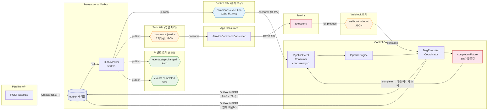

### 순차 실행 원리

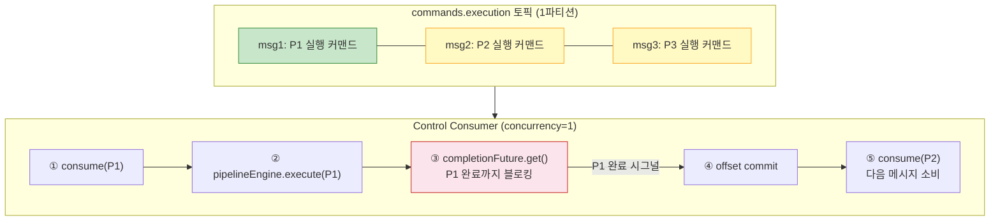

**왜 인메모리 큐가 불필요한가**: Kafka 토픽 자체가 메시지 큐이다. 1파티션은 전역 순서를 보장하고, consumer가 블로킹하면 다음 메시지를 소비하지 않는다. 앱 재시작 시에도 committed offset부터 재개하므로 크래시 복구가 자동이다.

## 2. 시나리오: 3 파이프라인 × 3 Job × executor 2

### 토픽 중심 메시지 흐름도

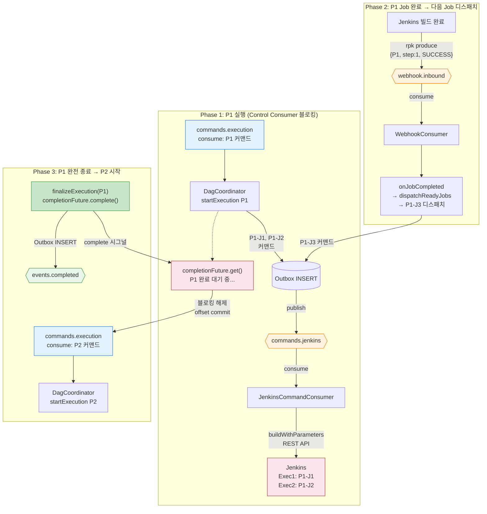

### 토픽별 메시지 타임라인

```mermaid
flowchart LR
    subgraph CMD["commands.execution (Control)"]
        direction TB
        CE1["T=0s  {exec:P1} → consume, 블로킹 시작"]
        CE2["T=6m  블로킹 해제 → offset commit"]
        CE3["T=6m  {exec:P2} → consume, 블로킹 시작"]
        CE4["T=12m 블로킹 해제"]
        CE5["T=12m {exec:P3} → consume"]
        CE1 --- CE2 --- CE3 --- CE4 --- CE5
    end

    subgraph JNK["commands.jenkins (Task)"]
        direction TB
        CJ1["T=0s  {P1-J1, step:1}"]
        CJ2["T=0s  {P1-J2, step:2}"]
        CJ3["T=2m  {P1-J3, step:3}"]
        SEP1["──── P1 완료 ────"]
        CJ4["T=6m  {P2-J1, step:1}"]
        CJ5["T=6m  {P2-J2, step:2}"]
        CJ1 --- CJ2 --- CJ3 --- SEP1 --- CJ4 --- CJ5
    end

    subgraph WH["webhook.inbound"]
        direction TB
        W1["T=2m  {P1, step:1, SUCCESS}"]
        W2["T=2.5m {P1, step:2, SUCCESS}"]
        W3["T=4m  {P1, step:3, SUCCESS}"]
        SEP2["──── P1→P2 전환 ────"]
        W4["T=8m  {P2, step:1, SUCCESS}"]
        W1 --- W2 --- W3 --- SEP2 --- W4
    end

    subgraph COMP["events.completed"]
        direction TB
        F1["T=6m  {P1, SUCCESS}"]
        F2["T=12m {P2, SUCCESS}"]
        F3["T=18m {P3, SUCCESS}"]
        F1 --- F2 --- F3
    end

    style CMD fill:#e3f2fd,stroke:#1976d2,color:#333
    style JNK fill:#fff3e0,stroke:#f57c00,color:#333
    style WH fill:#fff3e0,stroke:#f57c00,color:#333
    style COMP fill:#e8f5e9,stroke:#388e3c,color:#333
    style SEP1 fill:#ffcdd2,stroke:#c62828,color:#333
    style SEP2 fill:#ffcdd2,stroke:#c62828,color:#333
```

### 타임라인

```
commands.execution 토픽: [P1, P2, P3]

═══ P1 실행 (Consumer 블로킹) ═══
T=0s    consume(P1) → startExecution → completionFuture.get()
        (P1-J1, P1-J2) 동시 빌드
T=2min  P1-J1 완료 → webhook → P1-J3 디스패치
T=2.5m  P1-J2 완료 (ready job 없음)
T=4min  P1-J3 완료 → P1 종료!
        finalizeExecution → completionFuture.complete()
        → 블로킹 해제 → offset commit

═══ P2 실행 ═══
T=4min  consume(P2) → startExecution → completionFuture.get()
        (P2-J1, P2-J2) 동시 빌드
T=8min  P2 종료 → 블로킹 해제

═══ P3 실행 ═══
T=8min  consume(P3) → ...
T=12min P3 종료

총 소요: 3 파이프라인 × ~4분 = ~12분
```

## 3. Job 상태 전이

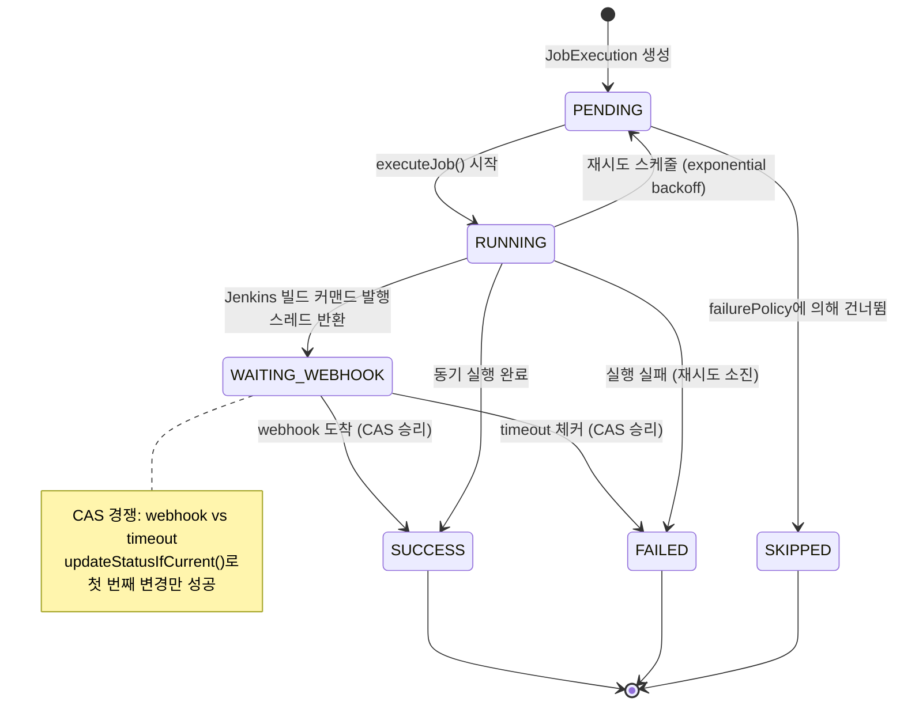

## 4. Break-and-Resume + 완료 시그널

Control Consumer가 블로킹하지만, DAG 내부의 Job 실행은 **Break-and-Resume** (비블로킹)이다. 이 두 패턴이 결합되는 방식:

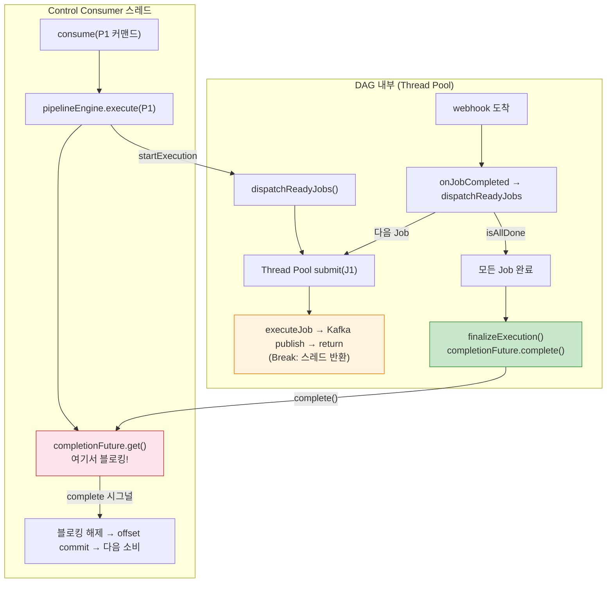

**Control Consumer 스레드**는 `completionFuture.get()`에서 블로킹되지만, **DAG 내부 Job은 Thread Pool에서 비블로킹**으로 실행된다. webhook이 도착하면 webhook consumer 스레드에서 `onJobCompleted()`를 호출하고, 마지막 Job이 완료되면 `completionFuture.complete()`로 Control Consumer를 깨운다.

## 5. Jenkins Executor API

### API 엔드포인트

```
GET {JENKINS_URL}/computer/api/json?tree=busyExecutors,totalExecutors
```

| 필드 | 의미 | 산출 기준 |
|------|------|----------|
| `totalExecutors` | Jenkins 전체 executor 수 | Master + Agent 노드 합계 |
| `busyExecutors` | 빌드 실행 중인 executor 수 | BUILDING 상태 카운트 |
| **available** | `total - busy` | 즉시 빌드 가능한 슬롯 |

### 정상 모드 vs 폴백 모드

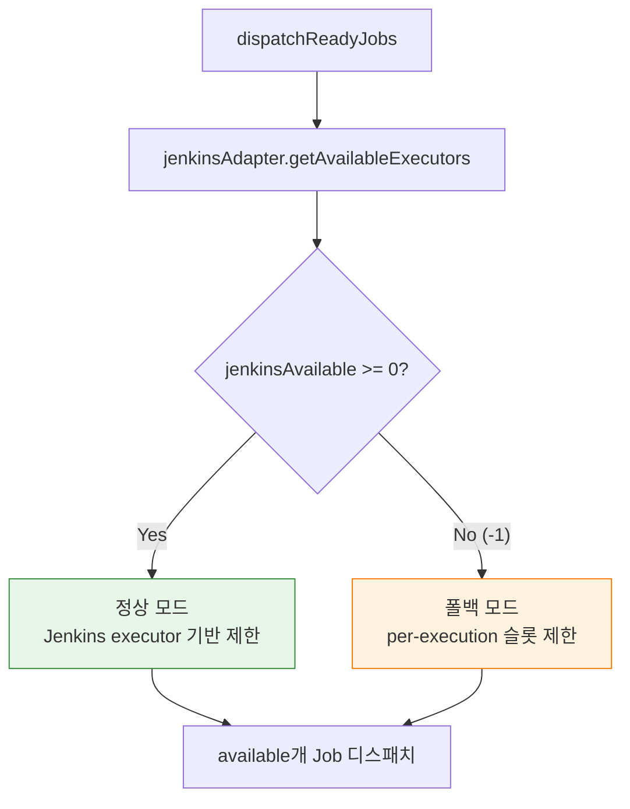

| 모드 | 조건 | 동작 |
|------|------|------|
| 정상 | `totalExecutors >= 1` | `available = total - busy` 만큼 디스패치 |
| 폴백 | Jenkins 다운, K8s dynamic agent (`total=0`), 파싱 실패 | `available = maxConcurrentJobs - runningCount` |

현재 GCP Jenkins는 K8s Pod agent 방식(`totalExecutors=0`)이므로 **폴백 모드**로 동작한다.

## 6. Kafka 토픽 아키텍처

### 전체 토픽 목록

| 토픽 | 파티션 | 용도 | 포맷 | 보존 |
|------|--------|------|------|------|
| `commands.execution` | **1** | Control: 파이프라인 실행 순서 보장 | Avro | 7일 |
| `commands.jenkins` | 3 | Task: Jenkins 빌드 커맨드 | JSON | 7일 |
| `webhook.inbound` | 2 | Jenkins/GitLab webhook 결과 | JSON | 3일 |
| `events.step-changed` | 3 | Job 상태 변경 (SSE → UI) | Avro | 7일 |
| `events.completed` | 3 | 파이프라인 완료 이벤트 | Avro | 7일 |
| `events.dag-job` | 3 | DAG Job 이벤트 | Avro | 7일 |
| `ticket.events` | 3 | 티켓 도메인 이벤트 | Avro | 7일 |
| `audit.events` | 1 | 감사 로그 | Avro | 30일 |
| `dlq` | 1 | Dead Letter Queue | bytes | 30일 |

> `commands.execution`이 1파티션인 이유: 파이프라인 간 전역 순서를 보장하기 위해. `commands.jenkins`가 JSON인 이유: Redpanda Connect Bloblang이 Avro를 파싱하지 못하기 때문.

### 전체 토픽 흐름도

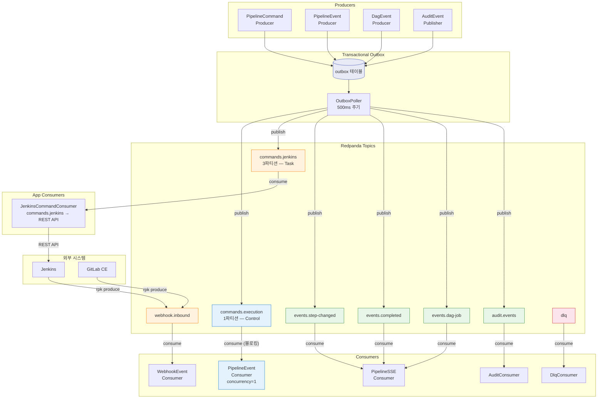

### Outbox 패턴

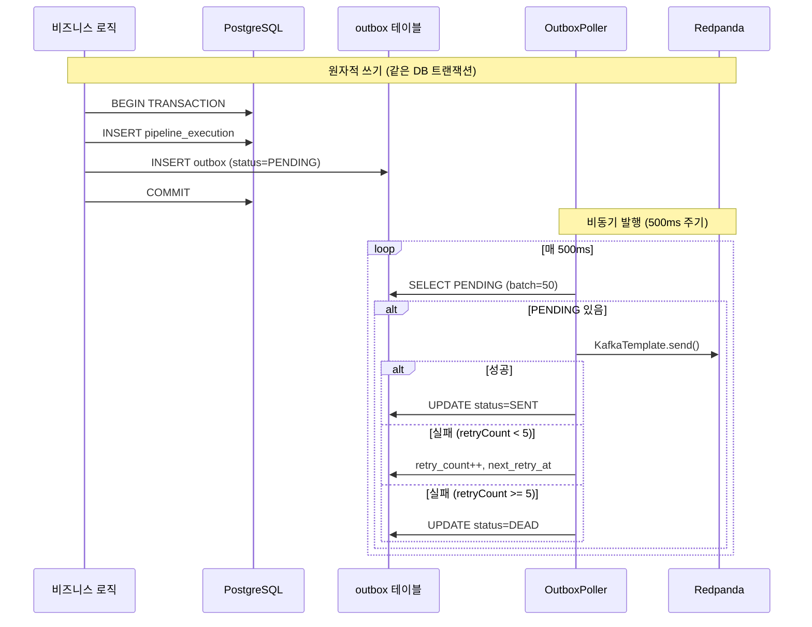

### 외부 시스템 연동 아키텍처

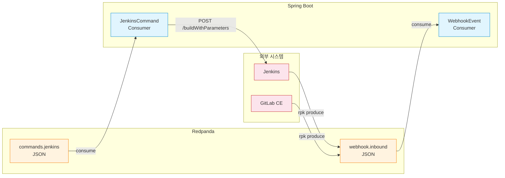

### Consumer Group 및 멱등성

| Consumer | Group ID | 멱등성 방식 | 재시도 |
|----------|----------|------------|--------|
| PipelineEventConsumer | `pipeline-engine` | `ce_id` → ProcessedEvent | @RetryableTopic: 1s,2s,4s,8s → DLT |
| WebhookEventConsumer | `webhook-processor` | `webhook:{executionId}:{stepOrder}` | 4회 backoff → DLT |
| PipelineSseConsumer | `pipeline-sse` | 무상태 | - |
| AuditConsumer | `audit-consumer` | `ce_id` | 기본 재시도 |
| DlqConsumer | `dlq-handler` | 로깅만 | 없음 |

### 직렬화 전략

| 포맷 | 토픽 | 이유 |
|------|------|------|
| **Avro** | commands.execution, events.*, audit, ticket | Java Consumer 간 타입 안전성 + 스키마 진화 |
| **JSON** | commands.jenkins, webhook.inbound | Redpanda Connect Bloblang 호환성 |
| **bytes** | dlq | 이기종 페이로드 격리 |

## 7. 크래시 복구, 재시도, DLQ

### 복구 시나리오 상세

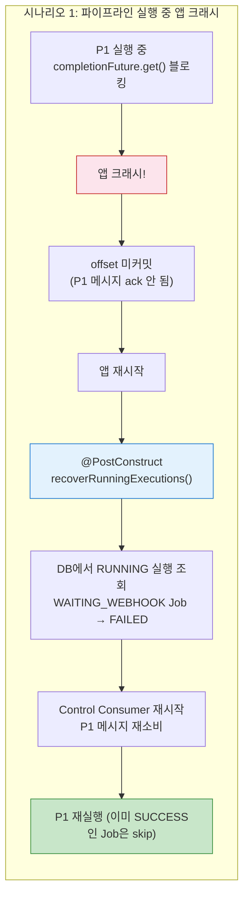

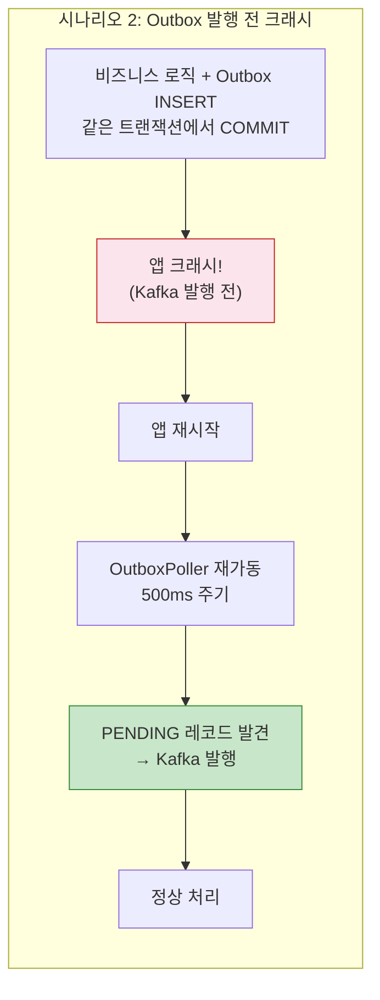

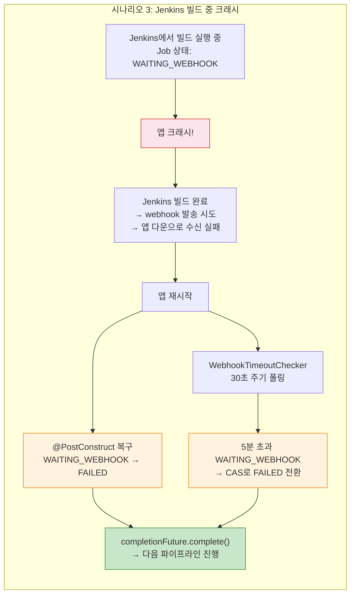

### 재시도 토픽 (@RetryableTopic)

Spring Kafka의 `@RetryableTopic`이 자동으로 **재시도 토픽**과 **DLT(Dead Letter Topic)**를 생성한다. 원본 토픽 이름에 suffix를 붙여 관리한다.

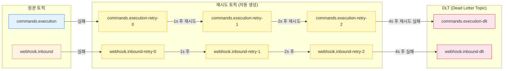

| Consumer | 재시도 정책 | 재시도 토픽 | DLT |
|----------|-----------|-----------|-----|
| PipelineEventConsumer | 4회, backoff 1s→2s→4s→8s | `commands.execution-retry-{0,1,2}` | `commands.execution-dlt` |
| WebhookEventConsumer | 4회, backoff 1s→2s→4s→8s | `webhook.inbound-retry-{0,1,2}` | `webhook.inbound-dlt` |
| TicketStatusEventConsumer | 4회, backoff 1s→2s→4s→8s | `ticket.events-retry-{0,1,2}` | `ticket.events-dlt` |

### 재시도 흐름 상세

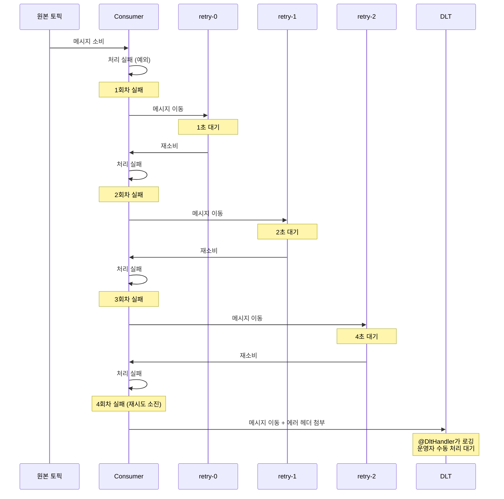

### DLQ에 간 메시지 수동 재처리

DLT에 도달한 메시지는 자동 복구되지 않는다. 운영자가 원인을 분석하고 수동으로 재처리해야 한다.

**재처리 절차:**

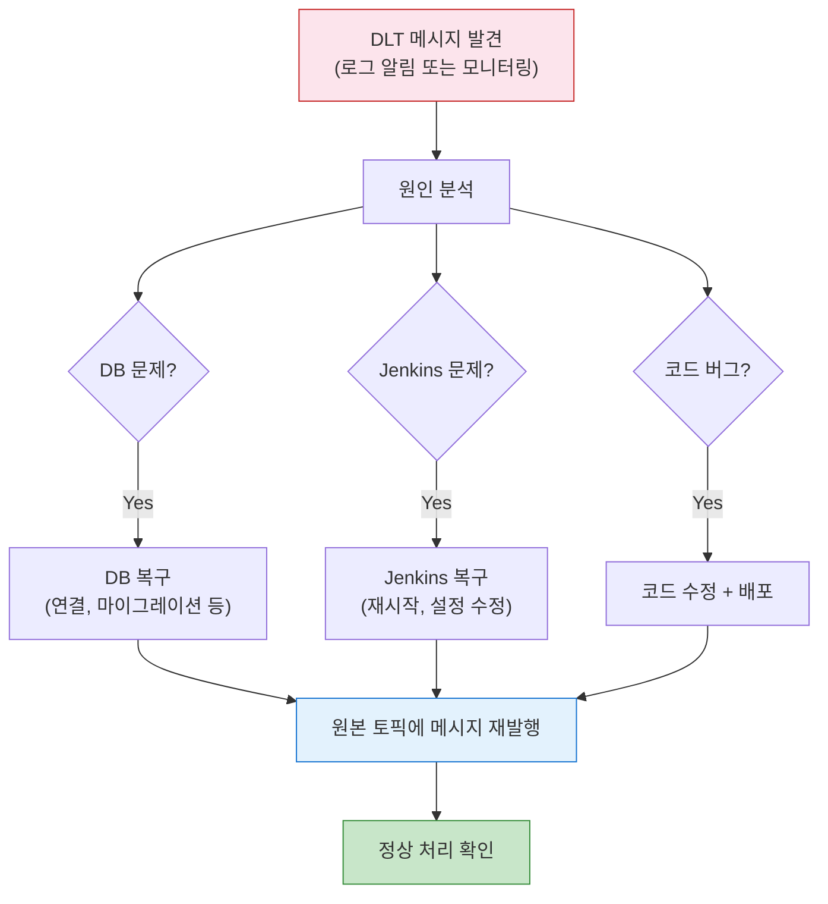

**재발행 방법:**

```bash
# 1. DLT 메시지 확인 (rpk CLI)
rpk topic consume commands.execution-dlt --num 1 --format json

# 2. 에러 헤더 확인
# kafka_dlt-exception-fqcn: 예외 클래스
# kafka_dlt-exception-message: 에러 메시지
# kafka_dlt-original-topic: 원본 토픽

# 3. 원인 해결 후 원본 토픽에 재발행
rpk topic produce commands.execution --key {executionId} < message.json

# 4. 또는 API로 파이프라인 재실행
curl -X POST http://localhost:8070/api/pipelines/{id}/execute
```

**DLT 메시지에 자동 첨부되는 헤더:**

| 헤더 | 내용 |
|------|------|
| `kafka_dlt-exception-fqcn` | 예외 클래스명 (예: `java.lang.IllegalStateException`) |
| `kafka_dlt-exception-message` | 에러 메시지 |
| `kafka_dlt-original-topic` | 원본 토픽 이름 |
| `kafka_dlt-original-partition` | 원본 파티션 번호 |
| `kafka_dlt-original-offset` | 원본 오프셋 |
| `kafka_dlt-original-timestamp` | 원본 메시지 타임스탬프 |

### Outbox 레벨 재시도 vs Kafka 레벨 재시도

시스템에는 **두 레벨의 재시도**가 존재한다.

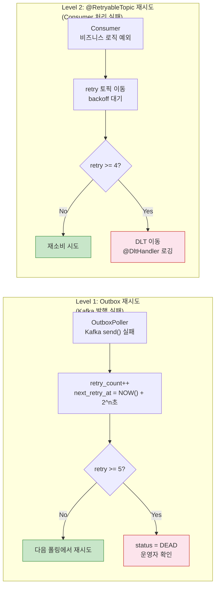

| 레벨 | 대상 | 재시도 횟수 | 백오프 | 실패 시 |
|------|------|-----------|--------|---------|
| **Outbox** | Kafka 브로커 연결 실패, 발행 타임아웃 | 5회 | 2^n초 (1,2,4,8,16) | status=DEAD (outbox 테이블) |
| **@RetryableTopic** | Consumer 비즈니스 로직 예외 (DB 오류, 파싱 실패 등) | 4회 | 1s→2s→4s→8s | DLT 토픽 이동 |

Outbox DEAD와 DLT 모두 자동 복구되지 않으며, 운영자가 원인 해결 후 수동 재처리한다. Outbox DEAD는 DB에서 확인(`SELECT * FROM outbox WHERE status='DEAD'`), DLT는 Kafka에서 확인(`rpk topic consume {topic}-dlt`).
