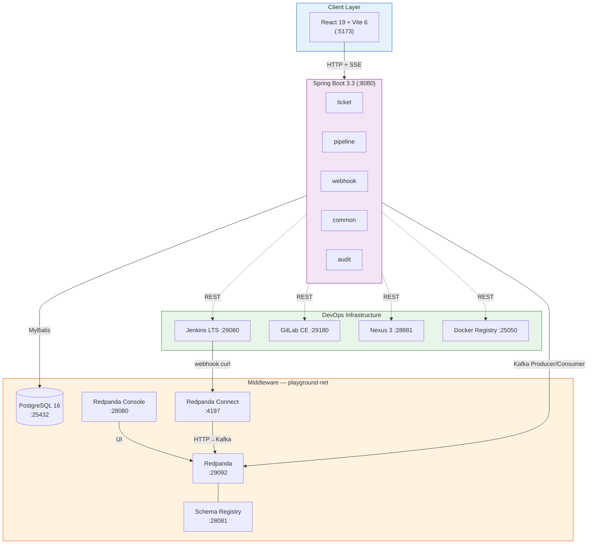
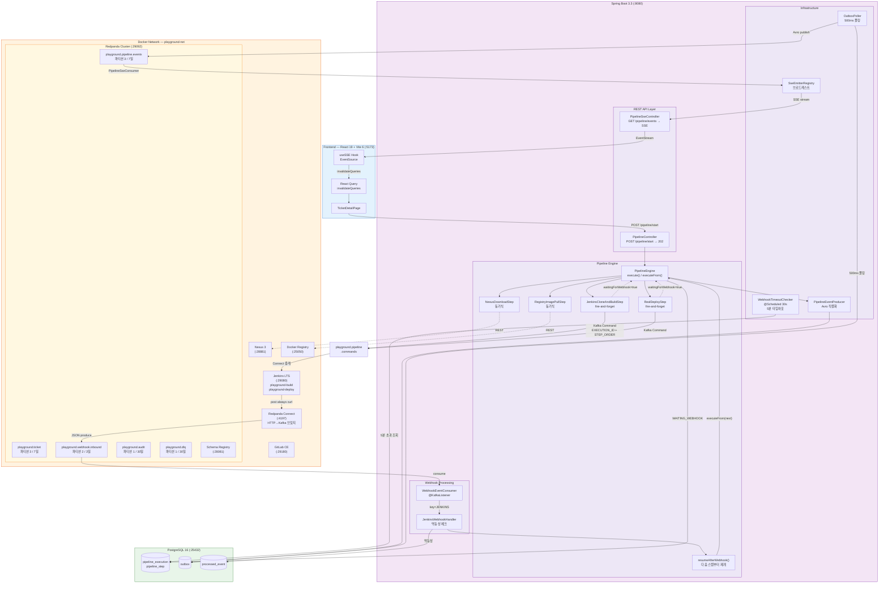
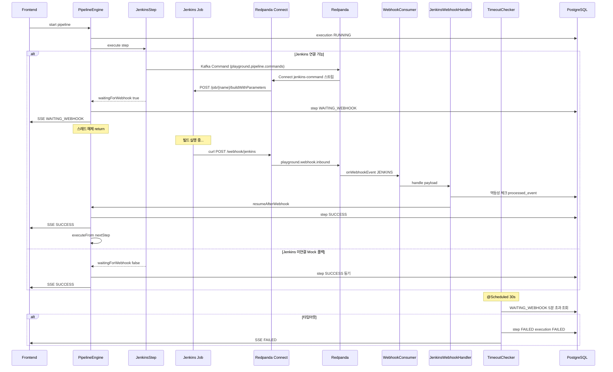
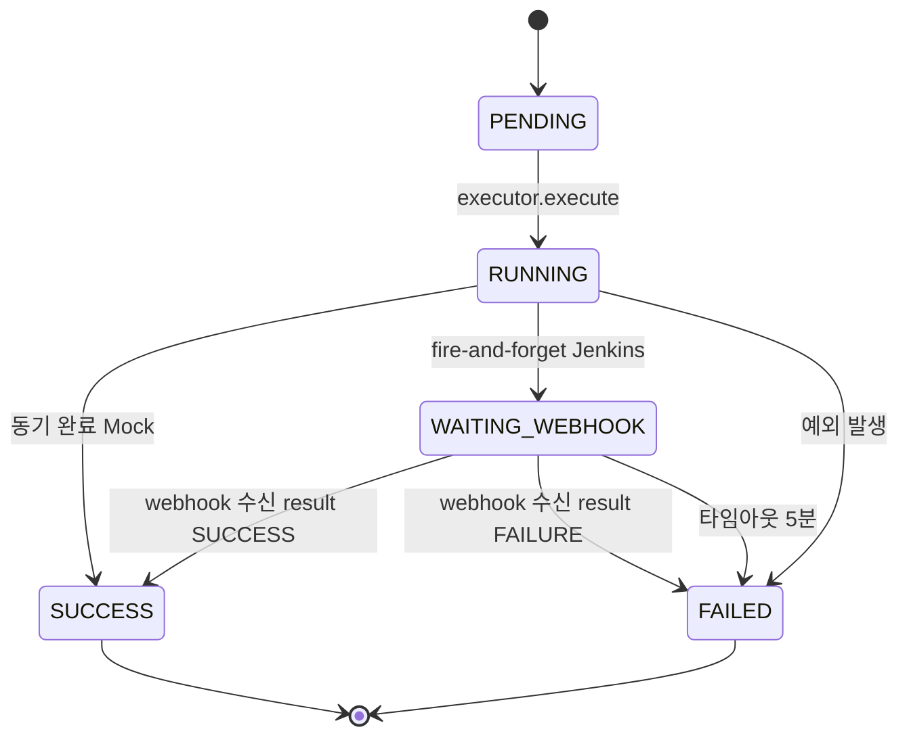
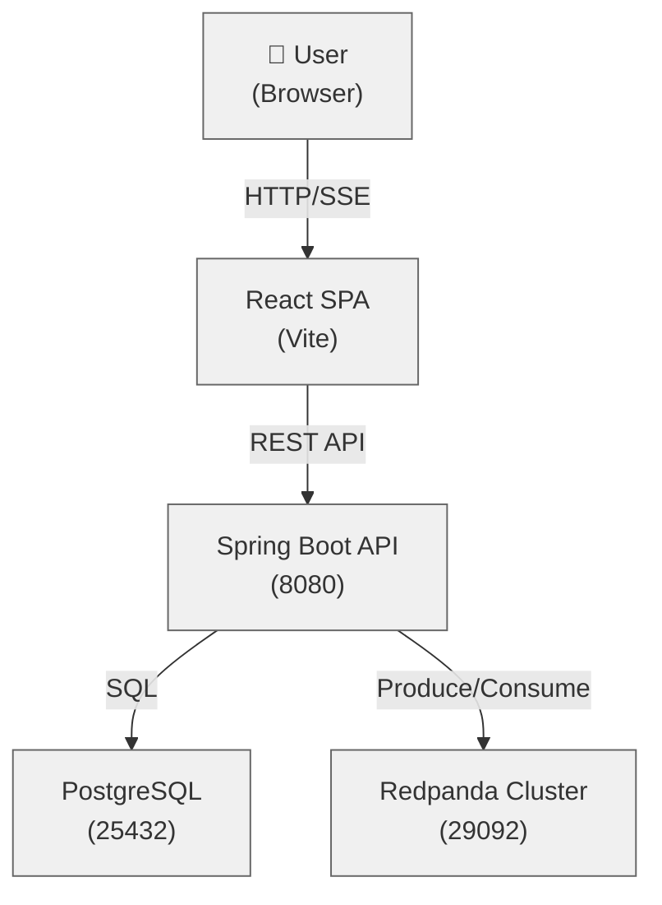
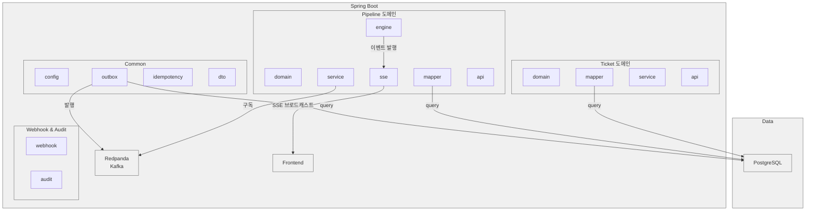

# Redpanda Playground 아키텍처

## 시스템 개요

Redpanda Playground는 Spring Boot 백엔드와 React 프론트엔드로 구성된 이벤트 기반 배포 플랫폼 데모입니다. PostgreSQL을 데이터베이스로 사용하고 Redpanda(Kafka)를 메시지 브로커로 활용하여 ticket 도메인과 pipeline 도메인 간 느슨한 결합을 유지합니다.



## 패키지 구조

### 1. ticket (배포 티켓 도메인)

**ticket/domain**
- Ticket: 배포 대상 정의 (이름, 설명, 상태)
- TicketSource: 배포 소스 (GIT, NEXUS, HARBOR)
- TicketStatus: DRAFT, READY, DEPLOYING, DEPLOYED, FAILED

**ticket/mapper**
- TicketMapper: MyBatis SQL 매핑 (insert/select/update/delete)
- TicketSourceMapper: 소스 CRUD

**ticket/service**
- TicketCommandService: 티켓 생성/수정/삭제 (Outbox 발행)
- TicketQueryService: 목록/상세 조회

**ticket/api**
- TicketController: REST API (GET/POST/PUT/DELETE)

**ticket/dto**
- TicketCreateRequest/Response
- TicketUpdateRequest/Response
- TicketListResponse

### 2. pipeline (배포 파이프라인 도메인)

**pipeline/domain**
- Pipeline: 티켓 기반 자동 생성되는 실행 단위
- PipelineStep: 단계별 작업 (BUILD, PUSH, DEPLOY, HEALTH_CHECK)
- PipelineStatus: PENDING, RUNNING, SUCCESS, FAILED
- StepEvent: 단계별 상태 변화 이벤트

**pipeline/mapper**
- PipelineMapper: 파이프라인 CRUD
- PipelineStepMapper: 단계 조회/수정

**pipeline/service**
- PipelineCommandService: 파이프라인 시작 (202 Accepted 응답)
- PipelineQueryService: 상태/이력/이벤트 조회
- PipelineEventConsumer: playground.ticket 구독하여 파이프라인 자동 생성

**pipeline/engine**
- PipelineEngine: 상태 머신으로 단계 실행 및 이벤트 발행
- StepExecutor: 각 단계별 실행 로직 (Jenkins 연동 또는 Mock 폴백)

**pipeline/event**
- PipelineStartedEvent, StepStartedEvent, StepCompletedEvent, PipelineCompletedEvent

**pipeline/sse**
- PipelineSSEController: GET /api/tickets/{id}/pipeline/events (Server-Sent Events)
- SSEEmitter: 클라이언트별 이벤트 스트림 관리
- PipelineEventPublisher: SSE 브로드캐스트

**pipeline/api**
- PipelineController: pipeline 관련 REST API

**pipeline/dto**
- PipelineStartRequest/Response
- PipelineStatusResponse
- StepEventResponse

### 3. common (공통 인프라)

**common/config**
- KafkaConsumerConfig: Consumer 설정
- KafkaProducerConfig: Producer 설정
- AvroConfig: Avro Serializer 설정

**common/outbox**
- OutboxEvent: 발행할 이벤트 데이터
- OutboxMapper: 폴링용 SQL (FOR UPDATE SKIP LOCKED)
- OutboxPoller: 주기적 폴링 (500ms) 및 발행
- OutboxPublisher: Kafka 발행

**common/idempotency**
- IdempotentEventRecord: (correlationId, eventType) 복합 키로 중복 감지
- IdempotencyMapper: 조회 및 기록
- IdempotencyFilter: 메서드 인터셉터

**common/dto**
- ApiResponse<T>: 표준 응답
- ErrorResponse: 오류 응답

**common/exception**
- BusinessException: 비즈니스 예외
- InvalidStateException: 상태 오류

### 4. webhook

HTTP 수신은 Redpanda Connect가 담당하고(`docker/connect/jenkins-webhook.yaml`), Spring 애플리케이션은 Kafka Consumer로만 처리합니다.

**webhook**
- WebhookEventConsumer: `playground.webhook.inbound` 토픽 구독, key 기반 소스별 라우팅

**webhook/handler**
- JenkinsWebhookHandler: Jenkins webhook 파싱, 멱등성 체크, PipelineEngine.resumeAfterWebhook() 호출

**webhook/dto**
- JenkinsWebhookPayload: Jenkins Job 완료 콜백 페이로드 (executionId, stepOrder, result, duration 등)

### 5. audit

**audit/event**
- AuditEvent: 감사 로그 이벤트
- AuditEventListener: 모든 도메인 이벤트 구독하여 playground.audit 발행

## 주요 기술 패턴

### Outbox 패턴 (트랜잭션 아웃박스)

Ticket 생성 시 ticket 레코드와 outbox 레코드를 동일 트랜잭션에 삽입합니다.

```java
@Transactional
public void createTicket(TicketCreateRequest req) {
    // 1. 티켓 insert
    ticketMapper.insert(ticket);

    // 2. outbox insert (같은 TX)
    outboxPublisher.publish(TicketCreatedEvent.of(ticket));
}
```

OutboxPoller는 500ms마다 미발행 메시지를 폴링하고 `FOR UPDATE SKIP LOCKED`로 동시성을 확보합니다.

```sql
SELECT * FROM outbox
WHERE published = false
FOR UPDATE SKIP LOCKED
LIMIT 100
```

### Consumer 멱등성 (Idempotency)

이벤트 중복 수신 시에도 단 한 번만 처리되도록 (correlationId, eventType) 복합 키로 관리합니다.

```java
@KafkaListener(topics = "playground.ticket")
public void onTicketEvent(TicketCreatedEvent event) {
    // 중복 검사
    if (idempotencyService.isDuplicate(
        event.getCorrelationId(),
        TicketCreatedEvent.class.getSimpleName())) {
        return;
    }

    // 처리
    pipelineService.createPipeline(event);

    // 기록
    idempotencyService.record(
        event.getCorrelationId(),
        TicketCreatedEvent.class.getSimpleName());
}
```

### 202 Accepted 비동기 응답

파이프라인 시작 요청은 즉시 202 Accepted를 반환하고, 실제 실행은 이벤트 기반으로 진행됩니다.

```java
@PostMapping("/{id}/pipeline/start")
public ResponseEntity<Void> startPipeline(@PathVariable Long id) {
    pipelineService.startPipeline(id);
    return ResponseEntity.accepted().build();
}
```

클라이언트는 SSE로 실시간 상태를 추적합니다.

### Server-Sent Events (SSE) 스트리밍

파이프라인 실행 중 단계별 진행 상황을 실시간으로 브라우저에 전송합니다.

```java
@GetMapping("/{id}/pipeline/events")
public SseEmitter streamPipelineEvents(@PathVariable Long id) {
    SseEmitter emitter = new SseEmitter();
    sseManager.register(id, emitter);
    return emitter;
}
```

PipelineEngine이 단계를 실행하면서 이벤트를 발행하면, SSEEmitter가 모든 구독자에게 브로드캐스트합니다.

### Break-and-Resume 패턴 (Jenkins 이벤트 기반 실행)

Jenkins 스텝(Clone/Build, Deploy)은 REST API 폴링 대신 이벤트 기반으로 동작합니다. 빌드를 fire-and-forget으로 트리거하고, Job 완료 시 webhook 콜백으로 파이프라인을 재개하여 스레드 블로킹을 제거합니다.

**동작 원리**: Engine이 Jenkins 빌드를 트리거한 뒤 스텝 상태를 `WAITING_WEBHOOK`으로 설정하고 스레드를 해제합니다. Jenkins Job 완료 시 post 블록에서 Redpanda Connect로 webhook을 전송하고, Consumer가 이를 수신하여 `resumeAfterWebhook()`으로 파이프라인을 이어서 실행합니다. Jenkins 미연결 시에는 기존 동기식 Mock으로 폴백합니다.

#### 전체 시스템 상세 구조



#### 이벤트 흐름 시퀀스



#### 스텝 상태 전이



#### 관련 파일

| 파일 | 역할 |
|------|------|
| `PipelineEngine` | executeFrom() 루프 + resumeAfterWebhook() 재개 |
| `JenkinsCloneAndBuildStep` | fire-and-forget 빌드 트리거 |
| `RealDeployStep` | fire-and-forget 배포 트리거 |
| `PipelineCommandProducer` | Kafka 커맨드 발행 (App → Kafka → Connect → Jenkins) |
| `JenkinsAdapter` | Jenkins REST API 상태 조회 (isAvailable, getStatus) |
| `WebhookEventConsumer` | Kafka 토픽 수신 + 소스별 라우팅 |
| `JenkinsWebhookHandler` | 페이로드 파싱 + 멱등성 체크 + resume 호출 |
| `WebhookTimeoutChecker` | 5분 타임아웃 감시 (@Scheduled 30s) |
| `setup-jenkins.sh` | Jenkins Job post 블록에 webhook curl 설정 |

#### 설정 항목

| 항목 | 기본값 | 위치 |
|------|--------|------|
| Webhook 타임아웃 | 5분 | WebhookTimeoutChecker.TIMEOUT_MINUTES |
| 타임아웃 체크 주기 | 30초 | WebhookTimeoutChecker @Scheduled fixedDelay |
| Docker 네트워크 | playground-net | docker-compose.yml, docker-compose.infra.yml |
| Connect webhook 엔드포인트 | :4197/webhook/jenkins | jenkins-webhook.yaml |
| Connect jenkins-command | kafka → http://jenkins:8080 | jenkins-command.yaml |

## ArchUnit 경계 강제

ticket 패키지와 pipeline 패키지는 Kafka 이벤트를 통해서만 소통합니다. 직접 호출은 빌드 시점에 거부됩니다.

```
ticket.*가 pipeline.*을 import 불가
pipeline.*이 ticket.*을 직접 import 불가 (단, event 수신 클래스 제외)
```

이는 `src/test/java/architecture/ArchitectureTest.java`에서 ArchUnit으로 검증됩니다.

## 데이터 흐름 (C4 다이어그램)



## 컴포넌트 다이어그램



## 설정 가능한 항목

| 항목 | 기본값 | 설정처 |
|------|--------|--------|
| Outbox 폴링 주기 | 500ms | application.yml |
| Kafka Consumer Group | playground-group | application.yml |
| Avro Schema Registry | http://localhost:28081 | application.yml |
| SSE 타임아웃 | 1시간 | SseEmitterConfig |
