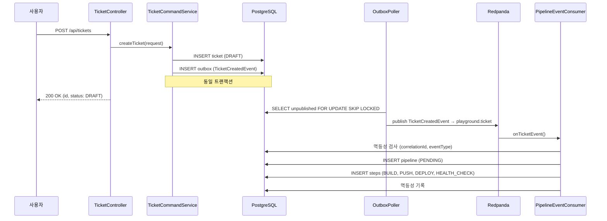
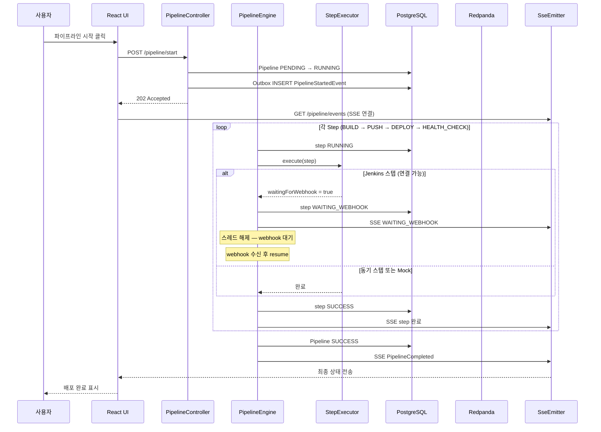
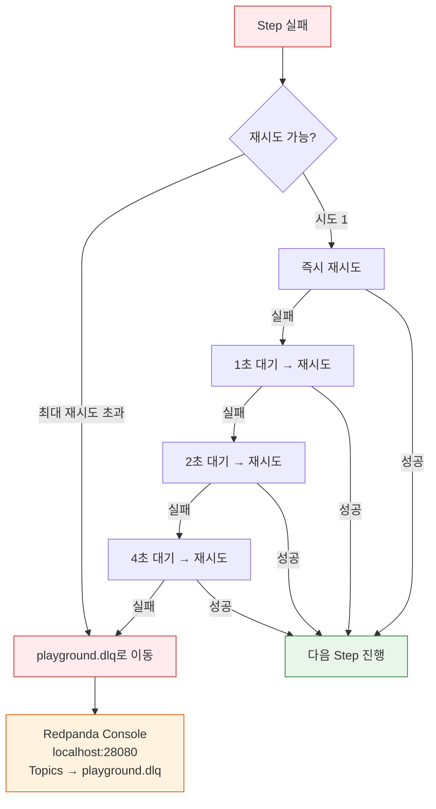
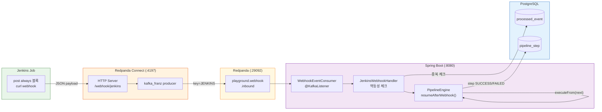
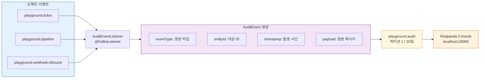
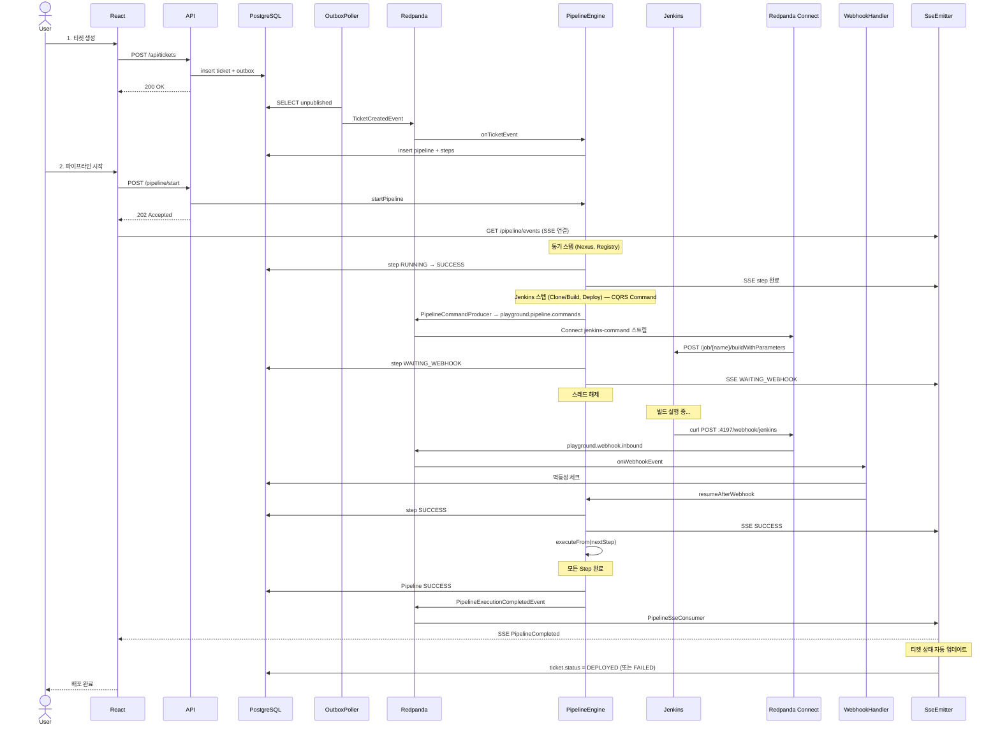

# Redpanda Playground 이벤트 흐름

## 토픽 설계

| 토픽 | 파티션 | 보관기간 | 용도 |
|------|--------|---------|------|
| playground.ticket | 3 | 7일 | 티켓 생성/변경 이벤트 |
| playground.pipeline | 3 | 7일 | 파이프라인 단계별 이벤트 |
| playground.webhook.inbound | 2 | 3일 | 외부 webhook 수신 |
| playground.pipeline.commands | 3 | 7일 | Jenkins 빌드 커맨드 (App → Connect → Jenkins) |
| playground.audit | 1 | 30일 | 감사 로그 |
| playground.dlq | 1 | 30일 | 재처리 실패 메시지 |

## Avro 스키마 목록

| 스키마 | 토픽 | 설명 |
|--------|------|------|
| TicketCreatedEvent | playground.ticket | 티켓 생성됨 |
| TicketStatusChangedEvent | playground.ticket | 티켓 상태 변경됨 |
| PipelineStartedEvent | playground.pipeline | 파이프라인 시작됨 |
| PipelineStepStartedEvent | playground.pipeline | 단계 시작됨 |
| PipelineStepCompletedEvent | playground.pipeline | 단계 완료됨 |
| PipelineCompletedEvent | playground.pipeline | 파이프라인 완료됨 |
| PipelineFailedEvent | playground.pipeline | 파이프라인 실패함 |
| WebhookEvent | playground.webhook.inbound | 외부 webhook 수신됨 |
| JenkinsBuildCommand | playground.pipeline.commands | Jenkins 빌드/배포 트리거 커맨드 |
| AuditEvent | playground.audit | 감사 로그 |

## 주요 흐름 1: 티켓 생성 → 파이프라인 자동 시작



## 주요 흐름 2: 파이프라인 시작 → 실시간 진행 상황 추적



**스텝 상태 흐름**: `PENDING → RUNNING → SUCCESS/FAILED` (동기) 또는 `PENDING → RUNNING → WAITING_WEBHOOK → SUCCESS/FAILED` (Jenkins 이벤트 기반)

## 주요 흐름 3: 재시도 및 DLQ



재시도 전략은 **지수 백오프**(1s → 2s → 4s)를 적용합니다. 4회 모두 실패하면 `playground.dlq`로 메시지를 이동하고, Redpanda Console(localhost:28080)에서 실패 원인을 확인할 수 있습니다.

## 주요 흐름 4: Webhook 수신 (Break-and-Resume)

Jenkins Job 완료 시 webhook 콜백이 Redpanda Connect(포트 4197)를 거쳐 Kafka로 전달되고, Consumer가 파이프라인을 재개합니다. Spring 애플리케이션에는 HTTP webhook 엔드포인트가 없으며, Redpanda Connect(`docker/connect/jenkins-webhook.yaml`)가 HTTP→Kafka 브릿지 역할을 합니다. 커맨드 방향(App→Jenkins)도 마찬가지로 Connect(`docker/connect/jenkins-command.yaml`)가 Kafka→HTTP 브릿지 역할을 합니다.



**Webhook 페이로드 예시** (Jenkins → Redpanda Connect):
```json
{
  "executionId": "550e8400-e29b-41d4-a716-446655440000",
  "stepOrder": 1,
  "jobName": "playground-build",
  "buildNumber": 42,
  "result": "SUCCESS",
  "duration": 15230,
  "url": "http://jenkins:29080/job/playground-build/42/"
}
```

**안전장치**: `WebhookTimeoutChecker`가 30초마다 `WAITING_WEBHOOK` 상태 스텝을 조회하고, 5분 초과 시 자동으로 FAILED 처리합니다.

## 주요 흐름 4-1: Jenkins CQRS Command (App → Jenkins)

커맨드 흐름은 App이 직접 Jenkins REST를 호출하지 않고, Kafka 토픽을 경유합니다.

```mermaid
flowchart LR
    subgraph Spring["Spring Boot (:8080)"]
        CMD["PipelineCommandProducer<br/>publishJenkinsBuildCommand()"]
    end

    subgraph Redpanda["Redpanda (:29092)"]
        Topic["playground.pipeline<br/>.commands"]
    end

    subgraph Connect["Redpanda Connect"]
        Filter["Bloblang 필터<br/>eventType=JENKINS_BUILD_COMMAND"]
        URLBuild["URL 조합<br/>/job/{name}/buildWithParameters"]
        HTTP["http_client output<br/>POST"]
    end

    subgraph Jenkins["Jenkins (:8080)"]
        Job["playground-build<br/>playground-deploy"]
    end

    CMD -->|"key=JENKINS_BUILD_COMMAND<br/>Avro payload"| Topic
    Topic --> Filter
    Filter --> URLBuild
    URLBuild --> HTTP
    HTTP -->|"basic_auth"| Job

    style Spring fill:#f3e5f5,stroke:#7b1fa2,color:#333
    style Redpanda fill:#fff8e1,stroke:#f57f17,color:#333
    style Connect fill:#fff3e0,stroke:#e65100,color:#333
    style Jenkins fill:#e8f5e9,stroke:#2e7d32,color:#333
```



**CQRS 분리 이점**: App은 Jenkins URL/인증을 몰라도 됩니다. Connect가 중계하므로 Jenkins 교체 시 Connect YAML만 수정하면 됩니다.

## 주요 흐름 5: 감사 로그



모든 도메인 이벤트가 발행되면 `AuditEventListener`가 자동으로 감사 로그를 `playground.audit` 토픽에 기록합니다. Redpanda Console에서 조회 가능합니다.

## 이벤트 상세 구조 (Avro 예시)

### TicketCreatedEvent
```json
{
  "ticketId": 1,
  "name": "Production Deploy v2.0",
  "description": "Deploy to AWS prod",
  "sources": [
    {
      "type": "GIT",
      "url": "https://github.com/org/repo"
    },
    {
      "type": "NEXUS",
      "artifactId": "app-2.0.war"
    }
  ],
  "correlationId": "uuid-12345",
  "timestamp": 1704067200000
}
```

### PipelineStepCompletedEvent
```json
{
  "pipelineId": 5,
  "stepId": 1,
  "stepName": "BUILD",
  "status": "SUCCESS",
  "duration": 45000,
  "logs": "Build completed successfully",
  "correlationId": "uuid-12345",
  "timestamp": 1704067245000
}
```

## 동시성 보장

### Outbox 폴링 (중복 방지)

```sql
-- 여러 인스턴스가 동시에 실행되어도 안전
SELECT * FROM outbox
WHERE published = false
FOR UPDATE SKIP LOCKED
LIMIT 100
```

- FOR UPDATE: 선택된 행에 배타 잠금
- SKIP LOCKED: 잠금된 행 건너뜀
- 결과: 각 행이 정확히 한 번씩 처리됨

### Consumer 멱등성

```
correlationId: 요청 시점에 생성된 UUID
eventType: 이벤트 클래스명

(correlationId, eventType) → 복합 키
중복 수신 시 자동으로 무시됨
```

## 트러블슈팅

### 메시지가 DLQ에 쌓이는 경우

1. Redpanda Console (localhost:28080) 확인
2. playground.dlq 토픽에서 메시지 상세 보기
3. oErrorReason/stackTrace 확인
4. 원인 해결 후 메시지 재발행

### SSE 연결 끊김

- 브라우저 개발자 도구 → Network → EventStream 확인
- Spring Boot 로그에서 SSE 연결/해제 확인
- SseEmitterConfig의 타임아웃 설정 검토

### 파이프라인이 시작되지 않음

- PostgreSQL 연결 확인
- Redpanda 브로커 상태 확인 (Redpanda Console)
- Consumer Group 상태 확인: playground-group의 lag

## 전체 메시지 흐름 시퀀스 다이어그램



## 동시성 보호: Webhook vs Timeout Race Condition

파이프라인 스텝이 `WAITING_WEBHOOK` 상태일 때, 두 경로가 동시에 상태를 변경할 수 있다:

1. **WebhookTimeoutChecker** (5분 타임아웃) → FAILED로 변경
2. **JenkinsWebhookHandler** (webhook 콜백 도착) → SUCCESS로 변경

### 문제

DB 상태를 먼저 읽고(`SELECT`) 이후에 갱신(`UPDATE`)하면, 두 경로가 동시에 `WAITING_WEBHOOK`을 읽고 각각 다른 상태로 업데이트할 수 있다. 결과적으로 FAILED 처리된 스텝 이후의 다음 스텝이 실행되는 현상이 발생한다.

### 해결: CAS(Compare-And-Swap) 방식

```sql
-- 기존: 무조건 UPDATE
UPDATE pipeline_step SET status = 'SUCCESS' WHERE id = ?

-- 수정: 현재 상태가 예상값일 때만 UPDATE
UPDATE pipeline_step SET status = 'SUCCESS' WHERE id = ? AND status = 'WAITING_WEBHOOK'
```

`affected rows = 0`이면 다른 경로가 먼저 상태를 변경한 것이므로 처리를 중단한다.

적용 위치:
- `PipelineEngine.resumeAfterWebhook()`: webhook 콜백 처리 시
- `WebhookTimeoutChecker.checkTimeouts()`: 타임아웃 처리 시

### 티켓 상태 업데이트: 이벤트 기반

파이프라인 완료 후 티켓 상태를 직접 변경하지 않고, `PipelineExecutionCompletedEvent`를 소비하여 업데이트한다.

```
PipelineEngine → Kafka(PipelineExecutionCompletedEvent) → PipelineSseConsumer → ticket.status
```

`PipelineSseConsumer`가 SSE 브로드캐스트와 티켓 상태 업데이트를 함께 처리한다. SSE 이벤트 발송 후 `TicketMapper.updateStatus()`를 호출하여 DEPLOYED 또는 FAILED로 전환한다.

| Pipeline 상태 | Ticket 상태 |
|--------------|-------------|
| SUCCESS | DEPLOYED |
| FAILED | FAILED |

이 방식의 장점은 파이프라인 모듈이 티켓 모듈에 직접 의존하지 않는다는 점이다 (느슨한 결합).
