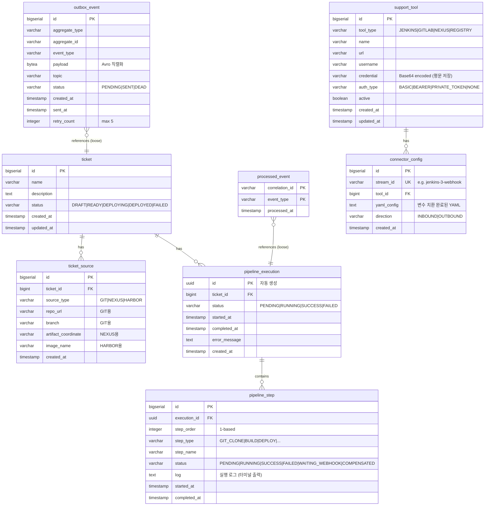
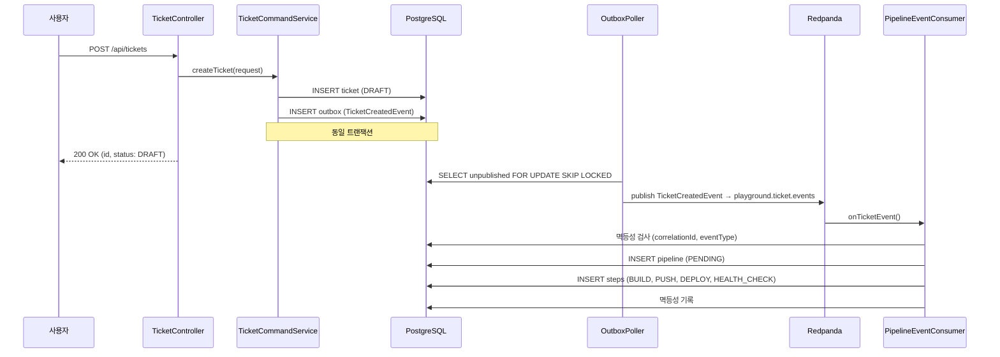
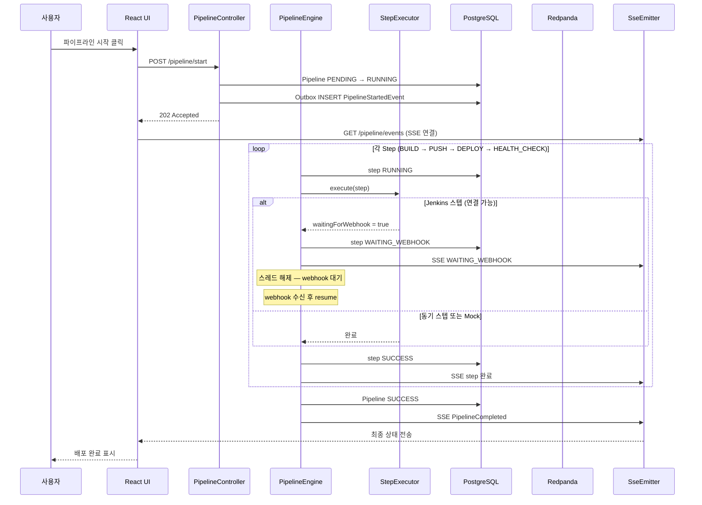
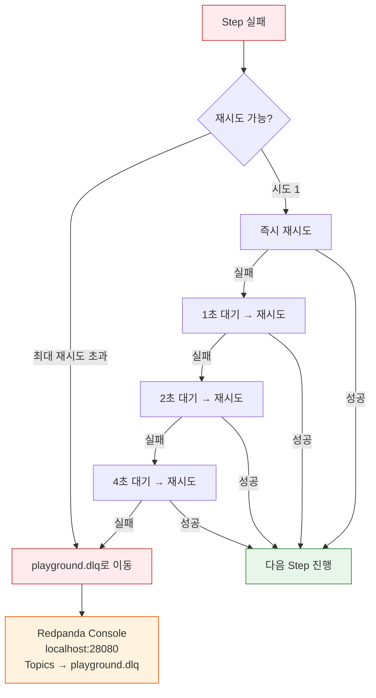
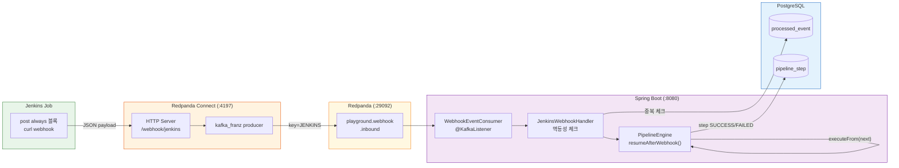
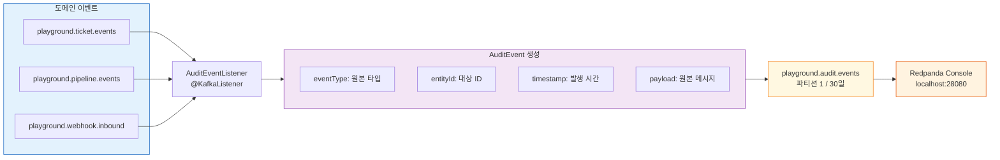
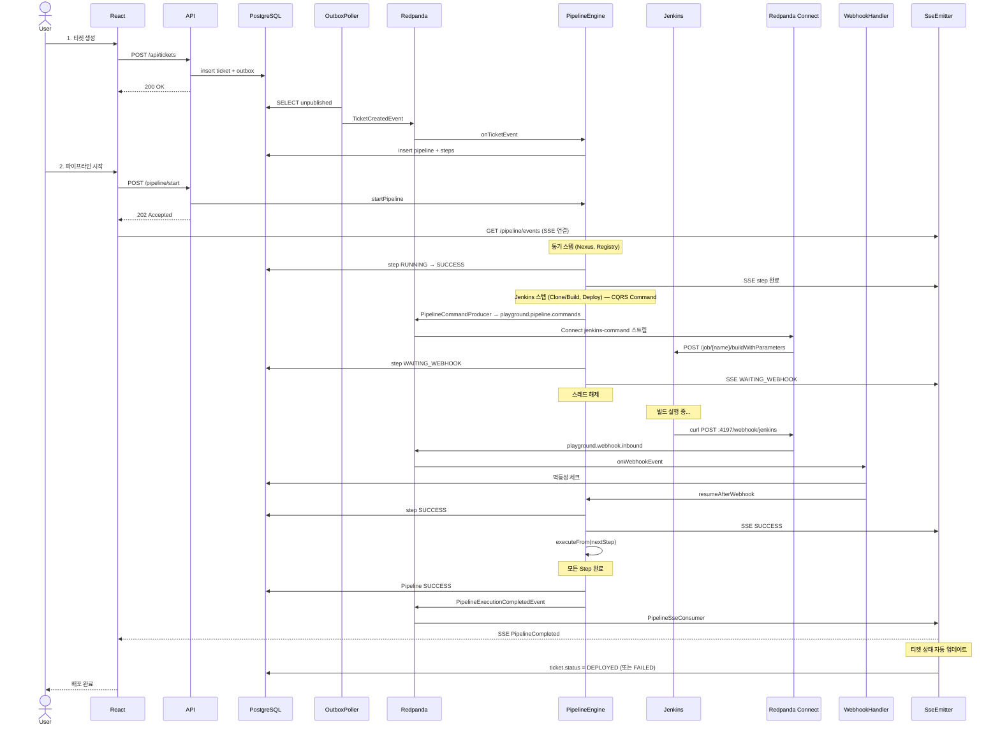

# 백엔드 아키텍처

이 문서는 Redpanda Playground 백엔드의 데이터베이스 설계, 핵심 기능 흐름, 이벤트/메시지 설계를 정리한다. 전체 프로젝트 개요는 [README](../README.md)를 참조한다.

---

## 1. 데이터베이스 설계

### ERD



### 테이블별 역할

**ticket + ticket_source**: 배포 대상을 정의한다. `source_type`에 따라 어떤 필드가 채워지는지 달라지는 다형적 설계다. GIT이면 `repo_url`/`branch`, NEXUS이면 `artifact_coordinate`, HARBOR이면 `image_name`을 사용한다. 이 소스 유형이 파이프라인 스텝 생성의 기준이 된다. 참고로 `SourceType`(GIT/NEXUS/HARBOR — 배포 소스 유형)과 `ToolType`(JENKINS/GITLAB/NEXUS/REGISTRY — 외부 도구 유형)은 별개의 enum이다.

**pipeline_execution + pipeline_step**: 파이프라인 실행 이력이다. `step_order`는 1부터 시작하며, SAGA 보상 시 역순 반복과 웹훅 재개 시 다음 스텝 인덱싱에 사용된다. `log` 필드에는 각 스텝의 실행 출력이 저장되어 프론트엔드 터미널 뷰에 표시된다.

**outbox_event**: Transactional Outbox 패턴의 핵심 테이블이다. `payload`는 BYTEA(바이너리)로, Avro 직렬화된 바이트가 직접 저장된다. `status = 'PENDING'`에 대한 부분 인덱스가 있어 폴러의 스캔 성능을 최적화한다. 5회 재시도 초과 시 `DEAD`로 표시된다.

**processed_event**: 멱등성 보장 테이블이다. `(correlation_id, event_type)` 복합 PK로 동일 이벤트의 중복 처리를 차단한다. 같은 `correlation_id`라도 다른 `event_type`은 별도 레코드로 허용된다.

**support_tool**: 외부 도구(Jenkins, GitLab, Nexus, Registry) 연결 정보를 런타임에 관리한다. `application.yml`에 하드코딩하지 않고 DB에서 관리하기 때문에, 앱 재시작 없이 도구를 추가/수정할 수 있다. `credential` 필드는 평문으로 저장된다. `ToolRegistry.decodeCredential()`이 값을 그대로 반환하며, API 응답 시에는 `hasCredential` boolean으로 마스킹한다.

`auth_type` 컬럼은 각 도구가 어떤 인증 방식을 사용하는지 명시한다. 기존에는 `username`/`credential` 두 컬럼만 있었는데, Jenkins는 Basic Auth를, GitLab은 `Private-Token` 헤더를 요구하는 등 도구마다 인증 프로토콜이 달라서 어떤 방식으로 헤더를 구성해야 하는지 알 수 없었다. `auth_type`이 이 결정을 코드가 아닌 데이터로 표현한다.

| auth_type | 인증 헤더 구성 | 사용 도구 |
|-----------|--------------|----------|
| BASIC | `Authorization: Basic base64(username:credential)` | Jenkins, Nexus |
| BEARER | `Authorization: Bearer {credential}` | (확장용) |
| PRIVATE_TOKEN | `Private-Token: {credential}` | GitLab |
| NONE | 헤더 없음 | Docker Registry (로컬) |

커넥터 템플릿에서 `auth_type`에 따라 인증 헤더가 결정된다. 예를 들어 Jenkins Command 커넥터(`jenkins-command.yaml`)는 `basic_auth` 섹션에 `${TOOL_USERNAME}`과 `${TOOL_CREDENTIAL}`을 치환하고, GitLab 커넥터는 `Private-Token` 헤더에 `${TOOL_CREDENTIAL}`을 주입한다. 중요한 점은 credential이 Kafka 메시지에 절대 포함되지 않는다는 것이다. 인증 정보는 커넥터 등록 시 `ConnectorManager.loadAndReplace()`가 템플릿 변수를 치환하여 Connect 스트림 설정에만 주입하므로, 토픽을 소비하는 다른 컨슈머가 credential을 볼 수 없다.

**connector_config**: 동적으로 생성된 Redpanda Connect 스트림의 설정을 영속화한다. Connect Streams API로 등록한 스트림은 컨테이너 재시작 시 소멸하므로, 변수 치환이 완료된 YAML을 이 테이블에 저장하고 앱 기동 시 복원한다. `support_tool`과 1:N 관계이며 `ON DELETE CASCADE`로 도구 삭제 시 자동 정리된다. 상세: [04-patterns.md#dynamic-connector-management](04-patterns.md#dynamic-connector-management)

### Flyway 마이그레이션

| 버전 | 테이블 | 설명 |
|------|--------|------|
| V1 | `ticket`, `ticket_source` | 티켓 + 소스 관리. CASCADE 삭제. `uuid-ossp` 확장 필요 (`infra/docker/shared/init-db/01-init.sql`에서 설정) |
| V2 | `pipeline_execution`, `pipeline_step` | 파이프라인 실행 이력. UUID PK (`gen_random_uuid()`) |
| V3 | `outbox_event` | Transactional Outbox. 부분 인덱스 |
| V4 | `processed_event` | 멱등성 보장. 복합 PK |
| V5 | `support_tool` | 외부 도구 테이블 정의 (시드 데이터 제거 — 시크릿 노출 방지) |
| V6 | `outbox_event` | correlation_id 컬럼 추가 |
| V7 | `support_tool` | 기본 도구 시드 데이터 삽입 |
| V8 | `pipeline_step` | step_name 컬럼 길이 확장 |
| V9 | `connector_config` | 동적 Connect 스트림 설정 영속화. `support_tool` FK + CASCADE 삭제 |
| V12 | `support_tool` | `auth_type` 컬럼 추가. 기존 데이터: GITLAB→PRIVATE_TOKEN, REGISTRY→NONE, 나머지→BASIC |

---

## 2. 핵심 기능 흐름

> 이벤트 흐름 다이어그램, 동시성 보장, 트러블슈팅은 이 문서의 하단 섹션에서 다룬다.

### 2-1. 티켓 생성 → 파이프라인 실행

```
POST /api/tickets
  → TicketService.create()
  → ticket INSERT + ticket_source INSERT (1:N)
  → 201 Created

POST /api/tickets/{id}/pipeline/start
  → PipelineService.startPipeline()
    1. 티켓 상태 → DEPLOYING
    2. PipelineExecution + Steps 생성 (소스 유형 기반)
    3. Outbox INSERT (PIPELINE_EXECUTION_STARTED 이벤트)
    4. 202 Accepted + trackingUrl 응답

[비동기]
  OutboxPoller (500ms 폴링)
    → outbox_event 조회 (최대 50건)
    → KafkaTemplate.send() (byte[] 직렬화)
    → playground.pipeline.commands 토픽 발행
    → outbox_event 상태 → SENT

  PipelineEventConsumer
    → 이벤트 수신 → 멱등성 체크
    → PipelineEngine.execute() (비동기 스레드풀)
```

202 Accepted 패턴을 사용하는 이유는, 파이프라인 실행이 수 분 이상 걸릴 수 있기 때문이다. 클라이언트는 응답과 함께 받은 SSE 엔드포인트로 진행 상태를 실시간 구독한다.

### 2-2. 파이프라인 실행 엔진

`PipelineEngine`이 SAGA Orchestrator 역할을 한다. 스텝 타입별 실행기(executor)가 매핑되어 있다:

| StepType | Executor | 동작 |
|----------|----------|------|
| GIT_CLONE | JenkinsCloneAndBuildStep | Jenkins Job 트리거 → 웹훅 대기 |
| BUILD | JenkinsCloneAndBuildStep | Jenkins Job 트리거 → 웹훅 대기 |
| ARTIFACT_DOWNLOAD | NexusDownloadStep | Nexus REST API로 아티팩트 검색 |
| IMAGE_PULL | RegistryImagePullStep | Docker Registry API로 이미지 존재 확인 |
| DEPLOY | RealDeployStep | Jenkins 배포 Job 트리거 → 웹훅 대기 |

실행 흐름:

```
PipelineEngine.execute(execution)
  → executeFrom(execution, fromIndex=0, startTime)
    for each step (순차):
      1. step.status → RUNNING
      2. executor.execute(execution, step)
      3-a. waitingForWebhook == true → 스레드 해제 (return)
      3-b. 성공 → step.status → SUCCESS → 다음 스텝
      3-c. 실패 → SagaCompensator.compensate() → execution.status → FAILED
    all steps done → execution.status → SUCCESS

  각 스텝 완료 시:
    → PipelineEventProducer → playground.pipeline.events 토픽
    → PipelineSseConsumer → SseEmitterRegistry.send() → 브라우저 SSE
```

### 2-3. Break-and-Resume (Jenkins 통합)

Jenkins처럼 오래 걸리는 외부 작업은 스레드를 점유하면 안 된다. 이 프로젝트는 "Break-and-Resume" 패턴으로 이 문제를 해결한다.

> 상세: [04-patterns.md#break-and-resume](04-patterns.md#break-and-resume)

```
[PipelineEngine]
  step.execute() → Jenkins Job 트리거 (fire-and-forget)
  step.waitingForWebhook = true
  → 엔진이 return → 스레드 해제

[Jenkins]
  빌드 완료 → POST http://playground-connect:4197/webhook/jenkins

[Redpanda Connect: jenkins-webhook.yaml]
  HTTP 수신 → payload 매핑 → playground.webhook.inbound 토픽 발행
  (전송만 담당, 비즈니스 로직 없음)

[WebhookEventConsumer]
  토픽 소비 → key 기반 라우팅 (JENKINS)
  → JenkinsWebhookHandler
    → 멱등성 체크
    → PipelineEngine.resumeAfterWebhook(executionId, stepOrder, result, buildLog)

[PipelineEngine.resumeAfterWebhook()]
  CAS: stepMapper.updateStatusIfCurrent(WAITING_WEBHOOK → SUCCESS/FAILED)
  → 성공: executeFrom(execution, nextStepIndex) → 다음 스텝부터 재개
  → 실패: SagaCompensator.compensate() → 보상 실행
```

CAS(Compare-And-Swap)가 중요한 이유: 웹훅 콜백과 타임아웃 체커가 동시에 같은 스텝의 상태를 변경하려 할 수 있다. `updateStatusIfCurrent`로 선착순 1건만 성공하도록 경쟁 조건을 방지한다.

### 2-4. SAGA 보상 (실패 시뮬레이션)

> 상세: [04-patterns.md#saga-orchestrator](04-patterns.md#saga-orchestrator)

```
POST /api/tickets/{id}/pipeline/start-with-failure
  → PipelineService에서 injectRandomFailure()
  → 랜덤 스텝에 [FAIL] 마커 삽입

해당 스텝 실행 시:
  → executor가 [FAIL] 감지 → 예외 발생
  → PipelineEngine이 catch
  → SagaCompensator.compensate(execution, failedStepOrder, stepExecutors)
    → 완료된 스텝을 역순(failedStepOrder-2 → 0) 반복
    → status == SUCCESS인 스텝만 보상
    → executor.compensate(execution, step)
      → 성공: step.status → COMPENSATED ("Compensated after saga rollback")
      → 실패: step.status → FAILED ("COMPENSATION_FAILED: ...") + 수동 개입 로그
  → execution.status → FAILED
  → SSE로 각 보상 결과 실시간 알림
```

보상은 best-effort다. 개별 보상 실패가 전체 보상 루프를 중단시키지 않는다. `COMPENSATION_FAILED` 상태와 로그 메시지가 운영자에게 수동 개입이 필요하다는 신호다.

---

## 3. 이벤트/메시지 설계

> 상세: [04-patterns.md#topic-message-design](04-patterns.md#topic-message-design)

### 토픽 목록

| 토픽 | 파티션 | 보관 | 직렬화 | Avro 스키마 | 용도 |
|------|--------|------|--------|-------------|------|
| `playground.pipeline.commands` | 3 | 7일 | Avro | `PipelineExecutionStartedEvent`, `JenkinsBuildCommand` | 파이프라인 실행 커맨드 |
| `playground.pipeline.events` | 3 | 7일 | Avro | `PipelineStepChangedEvent`, `PipelineExecutionCompletedEvent` | 스텝 변경/완료 이벤트 |
| `playground.ticket.events` | 3 | 7일 | Avro | `TicketCreatedEvent` | 티켓 생성 이벤트 |
| `playground.webhook.inbound` | 2 | 3일 | JSON | (Connect가 raw JSON 수신) | 외부 웹훅 수신 |
| `playground.audit.events` | 1 | 30일 | Avro | `AuditEvent` | 감사 이벤트 |
| `playground.dlq` | 1 | 30일 | - | (원본 메시지 그대로) | Dead Letter Queue |

네이밍 규칙은 `playground.{도메인}.{유형}`이다. 파이프라인/티켓 토픽은 3 파티션으로 병렬 처리하고, 감사/DLQ는 순서 보장이 중요하므로 1 파티션이다. 웹훅은 보관 기간이 짧다(3일) — 처리 후 재참조할 일이 거의 없기 때문이다.

### Avro 스키마 구조

스키마 파일은 `common-kafka/src/main/avro/` 에 위치한다. 이벤트 메타데이터(eventId, correlationId, eventType, timestamp, source)는 Avro 스키마에 포함되지 않고, `CloudEventsHeaderInterceptor`가 **Kafka 헤더**로 별도 부착한다.

#### 공통 enum

```
SourceType:     GIT | NEXUS | HARBOR
PipelineStatus: PENDING | RUNNING | SUCCESS | FAILED
```

#### 토픽별 스키마 상세

**playground.pipeline.commands**

| 스키마 | 필드 | 타입 | 설명 |
|--------|------|------|------|
| **PipelineExecutionStartedEvent** | executionId | string | 실행 UUID |
| | ticketId | long | 티켓 ID |
| | steps | string[] | 스텝 이름 목록 |
| **JenkinsBuildCommand** | executionId | string | 실행 UUID |
| | ticketId | long | 티켓 ID |
| | stepOrder | int | 스텝 순서 (1-based) |
| | jobName | string | Jenkins Job 이름 |
| | params | map&lt;string&gt; | 빌드 파라미터 |

**playground.pipeline.events**

| 스키마 | 필드 | 타입 | 설명 |
|--------|------|------|------|
| **PipelineStepChangedEvent** | executionId | string | 실행 UUID |
| | ticketId | long | 티켓 ID |
| | stepName | string | 스텝 이름 |
| | stepType | string | 스텝 유형 (GIT_CLONE, BUILD 등) |
| | status | string | 스텝 상태 (RUNNING, SUCCESS, FAILED, COMPENSATED 등) |
| | log | string? | 실행 로그 (nullable) |
| **PipelineExecutionCompletedEvent** | executionId | string | 실행 UUID |
| | ticketId | long | 티켓 ID |
| | status | PipelineStatus | 최종 상태 (SUCCESS, FAILED) |
| | durationMs | long | 총 소요시간 (ms) |
| | errorMessage | string? | 에러 메시지 (nullable) |

**playground.ticket.events**

| 스키마 | 필드 | 타입 | 설명 |
|--------|------|------|------|
| **TicketCreatedEvent** | ticketId | long | 티켓 ID |
| | name | string | 티켓 이름 |
| | sourceTypes | SourceType[] | 소스 유형 목록 (GIT, NEXUS, HARBOR) |

**playground.audit.events**

| 스키마 | 필드 | 타입 | 설명 |
|--------|------|------|------|
| **AuditEvent** | actor | string | 행위자 |
| | action | string | 수행 행위 |
| | resourceType | string | 대상 리소스 유형 |
| | resourceId | string | 대상 리소스 ID |
| | details | string? | 상세 정보 (nullable) |

**playground.webhook.inbound** — Avro 아님 (JSON)

| 필드 | 타입 | 설명 |
|------|------|------|
| webhookSource | string | 소스 식별 (JENKINS) |
| payload | string | 원본 JSON 페이로드 |
| headers | map&lt;string&gt; | HTTP 헤더 |

> Redpanda Connect가 HTTP 수신 → Kafka 발행 시 JSON으로 전달한다. `WebhookEventConsumer`가 소비 후 `WebhookEvent` Avro로 역직렬화하지 않고 raw JSON으로 처리한다.

### 직렬화 방식

`kafka-defaults.yml`에서 Producer는 `ByteArraySerializer`, Consumer는 `ByteArrayDeserializer`를 사용한다. Avro 직렬화/역직렬화를 코드에서 직접 수행하며(`AvroSerializer` 유틸), Schema Registry 기반 자동 serde를 쓰지 않는다. Outbox 테이블의 `payload`가 BYTEA인 것도 이 때문이다.

### CloudEvents 헤더 규칙

`CloudEventsHeaderInterceptor`가 Producer의 모든 메시지에 CloudEvents 헤더를 추가한다. OutboxPoller에서도 `ce_type`과 `eventType` 헤더를 직접 설정한다.

---

## 4. ArchUnit 경계 강제

ticket 패키지와 pipeline 패키지는 Kafka 이벤트를 통해서만 소통한다. 직접 호출은 빌드 시점에 거부된다.

```
ticket.*가 pipeline.*을 import 불가
pipeline.*이 ticket.*을 직접 import 불가 (단, event 수신 클래스 제외)
```

이는 `src/test/java/arch/ArchitectureBoundaryTest.java`에서 ArchUnit으로 검증된다.

---

## 5. 이벤트 흐름 다이어그램

### 흐름 1: 티켓 생성 → 파이프라인 자동 시작



### 흐름 2: 파이프라인 시작 → 실시간 진행 상황 추적



**스텝 상태 흐름**: `PENDING → RUNNING → SUCCESS/FAILED` (동기) 또는 `PENDING → RUNNING → WAITING_WEBHOOK → SUCCESS/FAILED` (Jenkins 이벤트 기반)

### 흐름 3: 재시도 및 DLQ



재시도 전략은 **지수 백오프**(1s → 2s → 4s)를 적용한다. 4회 모두 실패하면 `playground.dlq`로 메시지를 이동하고, Redpanda Console(localhost:28080)에서 실패 원인을 확인할 수 있다.

### 흐름 4: Webhook 수신 (Break-and-Resume)

Jenkins Job 완료 시 webhook 콜백이 Redpanda Connect(포트 4197)를 거쳐 Kafka로 전달되고, Consumer가 파이프라인을 재개한다. Spring 애플리케이션에는 HTTP webhook 엔드포인트가 없으며, Redpanda Connect(`infra/docker/shared/connect/jenkins-webhook.yaml`)가 HTTP→Kafka 브릿지 역할을 한다. 커맨드 방향(App→Jenkins)도 마찬가지로 Connect(`infra/docker/shared/connect/jenkins-command.yaml`)가 Kafka→HTTP 브릿지 역할을 한다.



**안전장치**: `WebhookTimeoutChecker`가 30초마다 `WAITING_WEBHOOK` 상태 스텝을 조회하고, 5분 초과 시 자동으로 FAILED 처리한다.

### 흐름 4-1: Jenkins CQRS Command (App → Jenkins)

커맨드 흐름은 App이 직접 Jenkins REST를 호출하지 않고, Kafka 토픽을 경유한다.

```mermaid
flowchart LR
    subgraph Spring["Spring Boot (:8080)"]
        CMD["PipelineCommandProducer<br/>publishJenkinsBuildCommand()"]
    end

    subgraph Redpanda["Redpanda (:29092)"]
        Topic["playground.pipeline<br/>.commands"]
    end

    subgraph Connect["Redpanda Connect"]
        Filter["Bloblang 필터<br/>eventType=JENKINS_BUILD_COMMAND"]
        URLBuild["URL 조합<br/>/job/{name}/buildWithParameters"]
        HTTP["http_client output<br/>POST"]
    end

    subgraph Jenkins["Jenkins (:8080)"]
        Job["playground-build<br/>playground-deploy"]
    end

    CMD -->|"key=JENKINS_BUILD_COMMAND<br/>Avro payload"| Topic
    Topic --> Filter
    Filter --> URLBuild
    URLBuild --> HTTP
    HTTP -->|"basic_auth"| Job

    style Spring fill:#f3e5f5,stroke:#7b1fa2,color:#333
    style Redpanda fill:#fff8e1,stroke:#f57f17,color:#333
    style Connect fill:#fff3e0,stroke:#e65100,color:#333
    style Jenkins fill:#e8f5e9,stroke:#2e7d32,color:#333
```



**CQRS 분리 이점**: App은 Jenkins URL/인증을 몰라도 된다. Connect가 중계하므로 Jenkins 교체 시 Connect YAML만 수정하면 된다.

### 흐름 5: 감사 로그



모든 도메인 이벤트가 발행되면 `AuditEventListener`가 자동으로 감사 로그를 `playground.audit.events` 토픽에 기록한다. Redpanda Console에서 조회 가능하다.

---

## 6. 전체 메시지 흐름 시퀀스 다이어그램



---

## 7. 동시성 보장

### Outbox 폴링 (중복 방지)

```sql
-- 여러 인스턴스가 동시에 실행되어도 안전
SELECT * FROM outbox_event
WHERE status = 'PENDING'
FOR UPDATE SKIP LOCKED
LIMIT 50
```

- FOR UPDATE: 선택된 행에 배타 잠금
- SKIP LOCKED: 잠금된 행 건너뜀
- 결과: 각 행이 정확히 한 번씩 처리됨

### Consumer 멱등성

```
correlationId: 요청 시점에 생성된 UUID
eventType: 이벤트 클래스명

(correlationId, eventType) → 복합 키
중복 수신 시 자동으로 무시됨
```

### Webhook vs Timeout Race Condition

파이프라인 스텝이 `WAITING_WEBHOOK` 상태일 때, 두 경로가 동시에 상태를 변경할 수 있다:

1. **WebhookTimeoutChecker** (5분 타임아웃) → FAILED로 변경
2. **JenkinsWebhookHandler** (webhook 콜백 도착) → SUCCESS로 변경

DB 상태를 먼저 읽고(`SELECT`) 이후에 갱신(`UPDATE`)하면, 두 경로가 동시에 `WAITING_WEBHOOK`을 읽고 각각 다른 상태로 업데이트할 수 있다.

**해결: CAS(Compare-And-Swap) 방식**

```sql
-- 기존: 무조건 UPDATE
UPDATE pipeline_step SET status = 'SUCCESS' WHERE id = ?

-- 수정: 현재 상태가 예상값일 때만 UPDATE
UPDATE pipeline_step SET status = 'SUCCESS' WHERE id = ? AND status = 'WAITING_WEBHOOK'
```

`affected rows = 0`이면 다른 경로가 먼저 상태를 변경한 것이므로 처리를 중단한다.

적용 위치:
- `PipelineEngine.resumeAfterWebhook()`: webhook 콜백 처리 시
- `WebhookTimeoutChecker.checkTimeouts()`: 타임아웃 처리 시

### 티켓 상태 업데이트: 이벤트 기반

파이프라인 완료 후 티켓 상태를 직접 변경하지 않고, `PipelineExecutionCompletedEvent`를 소비하여 업데이트한다.

```
PipelineEngine → Kafka(PipelineExecutionCompletedEvent) → PipelineSseConsumer → ticket.status
```

`PipelineSseConsumer`가 SSE 브로드캐스트와 티켓 상태 업데이트를 함께 처리한다. SSE 이벤트 발송 후 `TicketMapper.updateStatus()`를 호출하여 DEPLOYED 또는 FAILED로 전환한다.

| Pipeline 상태 | Ticket 상태 |
|--------------|-------------|
| SUCCESS | DEPLOYED |
| FAILED | FAILED |

이 방식의 장점은 파이프라인 모듈이 티켓 모듈에 직접 의존하지 않는다는 점이다 (느슨한 결합).

---

## 8. 트러블슈팅

### 메시지가 DLQ에 쌓이는 경우

1. Redpanda Console (localhost:28080) 확인
2. playground.dlq 토픽에서 메시지 상세 보기
3. errorReason/stackTrace 확인
4. 원인 해결 후 메시지 재발행

### SSE 연결 끊김

- 브라우저 개발자 도구 → Network → EventStream 확인
- Spring Boot 로그에서 SSE 연결/해제 확인
- SseEmitterRegistry의 타임아웃 설정 검토

### 파이프라인이 시작되지 않음

- PostgreSQL 연결 확인
- Redpanda 브로커 상태 확인 (Redpanda Console)
- Consumer Group 상태 확인: playground의 lag
