# 아키텍처 패턴 카탈로그

이 문서는 Redpanda Playground에 적용된 10개 아키텍처 패턴을 하나의 카탈로그로 정리한다.

## 패턴 요약

| # | 패턴 | 핵심 한 줄 |
|---|------|-----------|
| 1 | [202 Accepted](#1-202-accepted) | 긴 작업은 즉시 응답 + 추적 URL 제공 |
| 2 | [SAGA Orchestrator](#2-saga-orchestrator) | PipelineEngine이 오케스트레이터, 실패 시 완료 스텝 역순 보상 |
| 3 | [Transactional Outbox](#3-transactional-outbox) | DB 트랜잭션 + 이벤트 발행 원자성, 500ms 폴링 |
| 4 | [SSE 실시간 알림](#4-sse-실시간-알림) | 서버→클라이언트 단방향 스트리밍, TanStack Query 캐시 무효화 |
| 5 | [Break-and-Resume](#5-break-and-resume) | 웹훅 대기 시 스레드 해제, CAS로 경쟁 조건 방지 |
| 6 | [Redpanda Connect](#6-redpanda-connect) | HTTP↔Kafka 브릿지 (전송만, 비즈니스 로직 없음) |
| 7 | [토픽/메시지 설계](#7-토픽메시지-설계) | 도메인별 토픽, EventMetadata 공통 스키마, CloudEvents |
| 8 | [Adapter/Fallback](#8-adapterfallback) | 외부 시스템별 어댑터 분리, ToolRegistry 기반 동적 해석 |
| 9 | [Idempotency](#9-idempotency) | (correlationId, eventType) 복합 키, preemptive acquire |
| 10 | [Dynamic Connector Management](#10-dynamic-connector-management) | 런타임 Connect 스트림 등록/삭제, DB 영속화 |

---


## 1. 202 Accepted 비동기 응답 패턴

## 1. 개요 — 왜 이 패턴이 필요한가

HTTP 요청을 받은 서버가 처리를 완료하는 데 오랜 시간이 걸릴 때, 동기 방식으로 응답하면 클라이언트는 그 시간 내내 연결을 붙잡고 기다려야 한다. 파이프라인 실행처럼 여러 단계를 순서대로 수행하는 작업은 수십 초에서 수 분까지 걸릴 수 있으므로, 동기 응답은 타임아웃·리소스 낭비·사용자 경험 저하를 동시에 유발한다.

**202 Accepted 패턴**은 이 문제를 HTTP 의미론에 맞게 해결한다. 서버는 요청을 받자마자 "처리 예약을 수락했다"는 202 응답을 즉시 반환하고, 실제 작업은 비동기로 진행한다. 클라이언트는 응답 본문에 포함된 `trackingUrl`을 통해 진행 상황을 별도 채널(이 프로젝트에서는 SSE)로 구독한다.

이 패턴이 가진 핵심 가치는 두 가지다. 첫째, 요청 수락과 처리 완료를 분리함으로써 서버가 처리 시간에 상관없이 빠르게 응답할 수 있다. 둘째, 처리 과정 자체를 이벤트 브로커(Redpanda)를 통해 분산시킬 수 있어 수평 확장과 장애 격리가 자연스럽게 달성된다.

---

## 2. 이 프로젝트에서의 적용

### PipelineController

```
POST /api/tickets/{id}/pipeline/start
```

클라이언트가 위 엔드포인트를 호출하면 컨트롤러는 다음 두 가지만 수행하고 즉시 반환한다.

1. `ticketId`와 요청 메타데이터로 `PipelineStartEvent`를 생성해 Redpanda 토픽에 발행한다.
2. 추적용 SSE 엔드포인트 URL을 담은 `202 Accepted` 응답을 반환한다.

**응답 예시:**

```json
HTTP/1.1 202 Accepted
Content-Type: application/json

{
  "status": "ACCEPTED",
  "ticketId": "TICKET-42",
  "trackingUrl": "/api/tickets/TICKET-42/pipeline/events",
  "message": "파이프라인 실행이 예약되었습니다."
}
```

### SSE 추적 엔드포인트

```
GET /api/tickets/{id}/pipeline/events
Content-Type: text/event-stream
```

클라이언트는 위 SSE 엔드포인트에 연결해 파이프라인 각 단계의 이벤트를 실시간으로 수신한다. 단계가 진행될 때마다 이벤트가 스트리밍되고, 마지막 단계 완료 또는 실패 시 `COMPLETED`/`FAILED` 이벤트와 함께 스트림이 닫힌다.

```
data: {"stage":"LINT","status":"RUNNING","progress":10}

data: {"stage":"LINT","status":"DONE","progress":30}

data: {"stage":"TEST","status":"RUNNING","progress":40}

data: {"stage":"BUILD","status":"DONE","progress":90}

data: {"stage":"PIPELINE","status":"COMPLETED","progress":100}
```

---

## 3. 코드 흐름

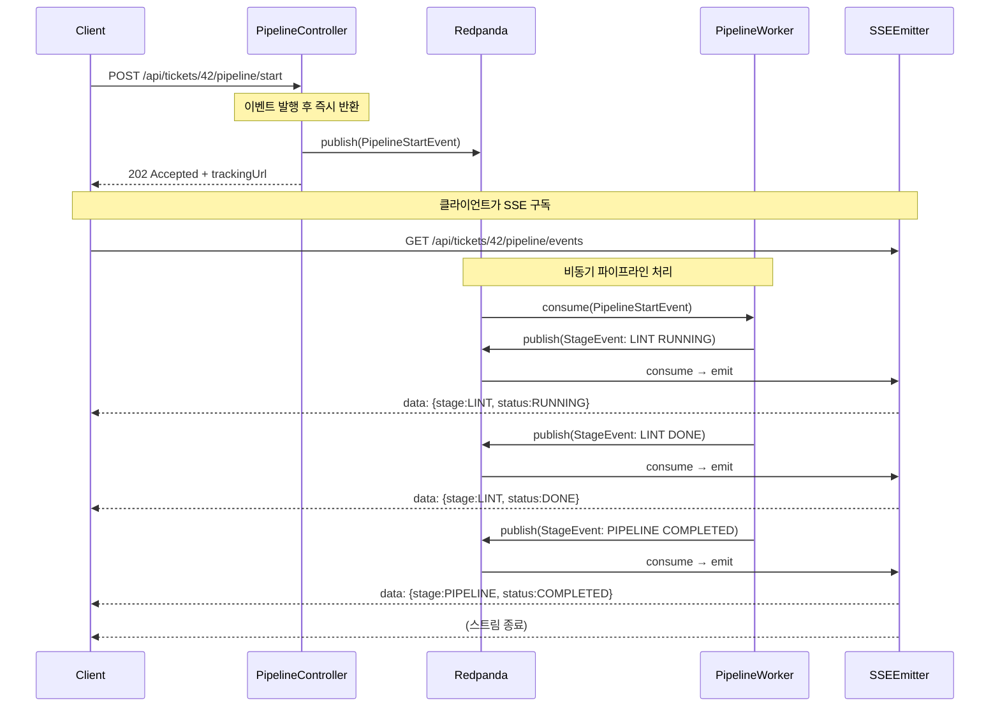

흐름에서 주목할 점은 `PipelineController`와 `PipelineWorker`가 Redpanda 토픽을 통해서만 연결된다는 것이다. 컨트롤러는 워커의 존재를 모르고, 워커는 요청 스레드와 완전히 분리되어 실행된다. 이 분리 덕분에 워커를 여러 인스턴스로 확장하거나 장애 시 재처리하는 것이 HTTP 레이어의 변경 없이 가능하다.

---

## 4. 왜 200이 아닌 202인가

HTTP 상태 코드는 단순한 숫자가 아니라 서버의 처리 상태를 표현하는 의미론적 계약이다.

- **200 OK**는 "서버가 요청을 완전히 처리했고 결과를 응답 본문에 담아 반환한다"는 의미다. 클라이언트는 200을 받으면 작업이 완료되었다고 간주해도 된다.
- **202 Accepted**는 "요청은 수락했지만 아직 처리가 완료되지 않았다"는 의미다. RFC 7231은 이를 명시적으로 정의한다: *"The request has been accepted for processing, but the processing has not been completed."*

파이프라인 시작 요청의 경우 컨트롤러가 반환하는 시점에 파이프라인은 이제 막 Redpanda 토픽에 올라간 상태다. 처리가 완료된 것이 전혀 없으므로 200을 반환하는 것은 거짓말이 된다. 클라이언트가 200을 받고 "완료됐겠지"라고 판단하면 추적 로직을 건너뛰거나 잘못된 상태를 표시할 수 있다.

202는 이 의도를 정직하게 전달한다. 클라이언트는 "아직 진행 중이니 추적이 필요하다"는 신호를 받고, 응답 본문의 `trackingUrl`로 자연스럽게 이동한다.

---

## 5. 주의사항 / 트레이드오프

**클라이언트 복잡도가 높아진다.**
동기 응답이라면 클라이언트는 응답 하나만 처리하면 된다. 비동기 패턴은 최초 202 처리, SSE 연결, 이벤트 파싱, 연결 종료 처리까지 여러 단계를 구현해야 한다. 모바일이나 레거시 클라이언트에서는 SSE 지원 여부를 먼저 확인해야 한다.

**SSE 연결이 끊기면 이벤트를 놓친다.**
SSE는 서버에서 클라이언트로의 단방향 스트림이다. 네트워크 단절 후 재연결하면 그 사이에 발행된 이벤트는 기본적으로 수신할 수 없다. 이 문제는 SSE의 `Last-Event-ID` 헤더와 서버 측 이벤트 저장소(Redis, DB)를 조합해 재전송하는 방식으로 해결할 수 있으나, 구현 비용이 추가된다.

**추적 URL의 유효 기간을 명시해야 한다.**
`trackingUrl`이 영원히 유효하다면 오래된 연결이 누적되어 서버 리소스가 낭비된다. 파이프라인 완료 후 일정 시간(예: 5분)이 지나면 404를 반환하도록 설계하고, 클라이언트가 이를 처리할 수 있어야 한다.

**멱등성을 고려해야 한다.**
클라이언트가 네트워크 오류로 202 응답을 받지 못하면 동일 요청을 재시도할 수 있다. `ticketId`가 이미 실행 중인 파이프라인을 가지고 있을 때 중복 실행을 막을 보호 장치(DB unique constraint, 상태 체크)가 컨트롤러에 있어야 한다.

**Redpanda 토픽이 가용하지 않으면 202가 거짓말이 된다.**
컨트롤러는 이벤트 발행에 성공했을 때만 202를 반환해야 한다. 발행 실패 시 503 Service Unavailable 또는 500을 반환해 클라이언트가 재시도할 수 있게 해야 하며, 발행 성공 후 워커가 소비하지 못하는 상황은 별도의 DLQ(Dead Letter Queue) 전략으로 다룬다.

---


## 2. SAGA Orchestrator 패턴 (보상 트랜잭션)

## 1. 분산 트랜잭션에서 왜 SAGA가 필요한가

단일 DB 트랜잭션은 ACID를 보장한다. 그러나 배포 파이프라인처럼 Git 클론 → 아티팩트 다운로드 → 이미지 풀 → 배포 순서로 여러 외부 시스템을 거치면, 단일 트랜잭션으로 묶을 수 없다. 각 스텝이 다른 프로세스(Jenkins, Nexus, Harbor)를 호출하기 때문이다.

**2PC(2-Phase Commit)** 는 이 문제의 고전적 해법이지만, 실제 운영에서는 세 가지 이유로 쓰기 어렵다.

1. **코디네이터 장애 = 전체 블로킹**: Prepare 단계에서 코디네이터가 죽으면 모든 참여자가 잠금을 풀지 못한 채 대기한다.
2. **외부 시스템은 XA를 지원하지 않는다**: Jenkins REST API나 Nexus HTTP API는 분산 트랜잭션 프로토콜을 제공하지 않는다.
3. **긴 작업에는 적합하지 않다**: 빌드처럼 수 분이 걸리는 작업을 Prepare 상태로 잠금을 유지할 수 없다.

SAGA는 각 스텝을 독립적인 로컬 트랜잭션으로 실행하고, 실패 시 이미 완료된 스텝을 **보상 트랜잭션(compensating transaction)** 으로 되돌린다. 잠금 없이, 비동기로, 외부 API도 참여할 수 있다는 점이 핵심이다.

---

## 2. Choreography vs Orchestrator

SAGA를 구현하는 방식은 두 가지다.

| 구분 | Choreography | Orchestrator |
|------|-------------|-------------|
| 제어 위치 | 각 서비스가 이벤트를 보고 직접 판단 | 중앙 오케스트레이터가 순서를 지시 |
| 흐름 파악 | 이벤트 추적 없이는 전체 흐름 불명확 | 오케스트레이터 코드 하나로 전체 흐름 파악 |
| 결합도 | 서비스들이 이벤트 스키마에 묵시적으로 결합 | 오케스트레이터가 각 스텝을 명시적으로 호출 |
| 디버깅 | 분산 추적 없이 어디서 멈췄는지 확인 어려움 | 오케스트레이터 로그 하나로 진행 상황 확인 |

이 프로젝트에서 Orchestrator를 선택한 이유는 **가시성** 때문이다. 파이프라인 실행은 "어느 스텝이 실행 중인가"를 사용자가 SSE로 실시간으로 봐야 한다. 오케스트레이터 방식은 `PipelineEngine` 하나에서 상태를 직접 업데이트하므로, 이벤트를 쫓아다니지 않아도 현재 상태를 정확히 알 수 있다. 또한 보상 순서도 `SagaCompensator`에 명시적으로 정의되어 있어 "어떤 스텝이 왜 롤백됐는가"를 코드에서 바로 읽을 수 있다.

---

## 3. 이 프로젝트에서의 적용

### PipelineEngine: SAGA 오케스트레이터

`PipelineEngine`은 스텝을 순서대로 실행하는 중앙 오케스트레이터다. 각 스텝 실행 전후에 상태를 DB에 기록하고 Kafka 이벤트를 발행한다. 스텝이 예외를 던지면 즉시 `SagaCompensator.compensate()`를 호출한다.

```java
// PipelineEngine.executeFrom() — 핵심 루프
for (int i = fromIndex; i < steps.size(); i++) {
    try {
        executor.execute(execution, step);         // 스텝 실행
        // ...SUCCESS 상태 기록...
    } catch (Exception e) {
        // ...FAILED 상태 기록...
        sagaCompensator.compensate(execution, step.getStepOrder(), stepExecutors);  // SAGA 보상 시작
        return;
    }
}
```

Break-and-Resume 패턴과 연동도 된다. Jenkins 빌드처럼 웹훅을 기다려야 하는 스텝은 `step.isWaitingForWebhook() == true`를 설정하고 스레드를 해제한다. 웹훅 콜백이 도착하면 `resumeAfterWebhook()`이 `executeFrom(execution, stepOrder, ...)`을 다시 호출해 다음 스텝부터 이어간다. 실패 콜백이면 마찬가지로 `SagaCompensator`를 호출한다.

### SagaCompensator: 역순 보상

`SagaCompensator`는 실패한 스텝의 이전 스텝들을 역순으로 순회하며 각 `PipelineStepExecutor.compensate()`를 호출한다.

```java
// SagaCompensator.compensate() — 역순 순회
for (int i = failedStepOrder - 2; i >= 0; i--) {
    PipelineStep step = steps.get(i);
    if (step.getStatus() != StepStatus.SUCCESS) continue;  // 완료된 스텝만 보상

    try {
        executor.compensate(execution, step);  // 부작용 되돌리기
        stepMapper.updateStatus(step.getId(), StepStatus.COMPENSATED.name(), "Compensated after saga rollback", ...);
    } catch (Exception ce) {
        // 보상 실패 → COMPENSATION_FAILED 상태 기록, 계속 진행 (수동 개입 필요)
        stepMapper.updateStatus(step.getId(), StepStatus.FAILED.name(), "COMPENSATION_FAILED: " + ce.getMessage(), ...);
    }
}
```

보상 실패가 발생해도 루프를 멈추지 않는다. 다른 스텝은 최대한 보상을 시도하고, 실패한 항목은 `COMPENSATION_FAILED` 로그를 남겨 운영자가 수동으로 처리할 수 있게 한다.

### 실패 시뮬레이션: `POST /start-with-failure`

SAGA 보상 흐름을 직접 확인하려면 `POST /api/tickets/{ticketId}/pipeline/start-with-failure`를 호출한다. `PipelineService.injectRandomFailure()`가 첫 번째 스텝을 제외한 나머지 중 하나의 이름에 `[FAIL]` 마커를 붙인다. 첫 번째 스텝을 제외하는 이유는 보상 대상이 없으면 SAGA 동작을 확인할 수 없기 때문이다.

`[FAIL]` 마커가 붙은 스텝을 실행하는 `MockDeployStep` 또는 `RealDeployStep`은 스텝명에 `[FAIL]`이 포함되면 `RuntimeException`을 던진다. 이 예외가 `PipelineEngine`의 catch 블록으로 전파되어 보상이 시작된다.

---

## 4. 코드 흐름

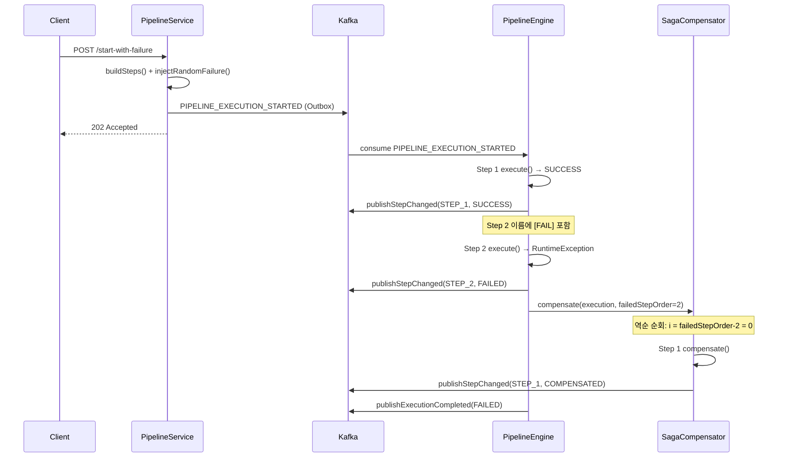

---

## 5. 보상 전략

각 `PipelineStepExecutor` 구현체의 보상 전략은 스텝 성격에 따라 다르다.

| 스텝 | 실행 효과 | 보상 전략 | 구현 |
|------|----------|----------|------|
| `GIT_CLONE` (JenkinsCloneAndBuildStep) | Jenkins 빌드 큐 등록 | Jenkins 잡 취소 또는 no-op | default (no-op) |
| `BUILD` (JenkinsCloneAndBuildStep) | Jenkins 빌드 실행 | 빌드 취소 또는 결과물 삭제 | default (no-op) |
| `ARTIFACT_DOWNLOAD` (NexusDownloadStep) | Nexus에서 아티팩트 다운로드 | 읽기 전용 → no-op 안전 | default (no-op) |
| `IMAGE_PULL` (RegistryImagePullStep) | Harbor에서 이미지 풀 | 읽기 전용 → no-op 안전 | default (no-op) |
| `DEPLOY` (RealDeployStep) | 서버에 배포 실행 | rollback Jenkins 잡 트리거 또는 undeploy API 호출 | `compensate()` 오버라이드 (현재 로그만) |

읽기 전용이거나 멱등한 스텝은 `PipelineStepExecutor` 인터페이스의 `default void compensate()`가 no-op으로 처리한다. 부작용이 있는 스텝(실제 배포)만 `compensate()`를 오버라이드해 외부 시스템에 롤백을 요청하면 된다.

---

## 6. 주의사항 / 트레이드오프

**보상은 실행 취소가 아니다.** `Step 1`이 파일을 생성했다면 보상은 그 파일을 삭제하는 별도 작업이다. 원자적 롤백이 아니라 "되돌리는 새 작업"이므로, 보상과 원본 사이에 다른 프로세스가 개입하면 불일치가 생길 수 있다.

**보상 자체가 실패할 수 있다.** `SagaCompensator`는 보상 실패 시 `COMPENSATION_FAILED`를 기록하고 다음 스텝 보상을 계속 시도한다. 이 상태가 남아 있으면 운영자가 직접 확인하고 처리해야 한다. 자동 재시도를 넣으면 idempotent한 보상 구현이 전제되어야 한다.

**최종 일관성(Eventual Consistency).** 보상이 완료되는 순간까지 시스템은 부분적으로 적용된 상태다. DB의 `pipeline_step` 테이블에는 `SUCCESS`와 `COMPENSATED`(보상 완료), `FAILED`(보상 실패) 상태가 혼재할 수 있다.

**WebhookTimeoutChecker도 SAGA 보상을 트리거한다.** 웹훅이 5분 내에 도착하지 않아 `WebhookTimeoutChecker`가 스텝을 FAILED로 전환하면, 단순히 실패 표시만 하는 것이 아니라 `SagaCompensator.compensate()`를 호출해 이전 완료 스텝들을 역순 보상한다. 타임아웃 실패도 일반 실패와 동일한 보상 경로를 탄다.

**격리 수준이 없다.** 2PC와 달리 SAGA는 ACID의 I(Isolation)를 보장하지 않는다. Step 1이 완료된 직후 다른 프로세스가 그 결과를 읽을 수 있고, 이후 보상이 실행되면 이미 읽어간 데이터와 불일치가 발생한다. 이를 방지하려면 Semantic Lock이나 Pessimistic View 같은 SAGA 대응 격리 패턴을 별도로 적용해야 한다.

---


## 3. Transactional Outbox 패턴

## 1. 개요

마이크로서비스가 DB에 상태를 저장하고 Kafka에 이벤트를 발행하는 두 작업은 서로 다른 리소스를 건드린다.
DB 트랜잭션과 Kafka produce는 하나의 원자적 단위로 묶을 수 없기 때문에, 순서대로 실행하면 둘 사이에서 실패가 발생할 때 일관성이 깨진다.

DB 커밋 후 Kafka produce를 직접 호출하는 방식은 두 가지 위험을 가진다.
첫째, DB는 커밋됐지만 Kafka produce가 네트워크 오류로 실패하면 이벤트가 영구 유실된다.
둘째, Kafka produce가 먼저 성공했지만 DB 커밋이 롤백되면 존재하지 않는 상태에 대한 이벤트가 발행된다.
어느 쪽이든 downstream consumer는 비즈니스 실제 상태와 다른 이벤트를 처리하게 된다.

Kafka produce를 트랜잭션 이전에 호출하는 방식도 마찬가지다. produce 성공 후 DB 커밋이 실패하면 이벤트는 이미 전송됐고 취소할 수 없다. Kafka는 메시지를 보낸 순간부터 consumer가 읽을 수 있는 구조이기 때문에 "발행 취소"가 불가능하다.

Transactional Outbox는 이 딜레마를 "Kafka 발행 자체를 DB 트랜잭션의 일부로 끌어들이는" 방식으로 해결한다.
이벤트를 Kafka에 직접 보내는 대신, 동일한 DB의 `outbox_event` 테이블에 이벤트 레코드를 삽입한다.
도메인 엔티티 저장과 outbox 레코드 삽입이 같은 `BEGIN...COMMIT` 안에서 일어나므로, 두 쓰기는 원자적으로 성공하거나 실패한다.
이후 별도 프로세스(Poller 또는 CDC 커넥터)가 `PENDING` 상태의 레코드를 읽어 Kafka에 전달하고 상태를 `SENT`로 갱신한다.

핵심 보장은 **at-least-once delivery**다. 폴러가 produce에 실패해도 outbox 레코드가 `PENDING`으로 남아 있어 재시도할 수 있다.
중복 발행 가능성은 존재하지만, 이벤트 유실보다 중복이 훨씬 다루기 쉽다. Consumer가 멱등성을 갖추면 중복은 무해하다.

---

## 2. 이 프로젝트에서의 적용

### outbox_event 테이블 구조

```sql
CREATE TABLE outbox_event (
    id              BIGSERIAL PRIMARY KEY,
    aggregate_type  VARCHAR(50)  NOT NULL,   -- 도메인 집합체 (TICKET, PIPELINE, AUDIT)
    aggregate_id    VARCHAR(100) NOT NULL,   -- 집합체 인스턴스 ID
    event_type      VARCHAR(100) NOT NULL,   -- 이벤트 타입 (TICKET_CREATED, AUDIT_CREATE 등)
    payload         BYTEA        NOT NULL,   -- Avro 직렬화 이벤트
    topic           VARCHAR(200) NOT NULL,   -- Kafka 토픽명
    status          VARCHAR(20)  NOT NULL DEFAULT 'PENDING',
    created_at      TIMESTAMP    NOT NULL DEFAULT NOW(),
    sent_at         TIMESTAMP,
    retry_count     INTEGER      NOT NULL DEFAULT 0,
    correlation_id  VARCHAR(100)             -- 분산 추적 ID (V6 마이그레이션 추가)
);

-- 부분 인덱스: PENDING 상태만 인덱싱하여 폴러 쿼리 최적화
CREATE INDEX idx_outbox_event_status ON outbox_event(status)
WHERE status = 'PENDING';
```

`status` 컬럼은 세 가지 값을 가진다.
- **PENDING**: 초기 상태. 폴러가 조회하여 Kafka로 발행을 시도한다.
- **SENT**: produce 성공 후 전환. 부분 인덱스 조건에서 제외되므로 폴러 조회에 잡히지 않는다.
- **DEAD**: `retry_count`가 MAX_RETRIES(5)를 초과하면 전환. 자동 재시도를 포기하고 운영자 수동 처리를 기다리는 상태다.

`sent_at` 컬럼은 운영 모니터링에서 "평균 발행 지연(`sent_at - created_at`)"을 계산하는 데 활용한다.

### DB 트랜잭션 내 outbox 삽입 — 직접 호출 vs 이벤트 리스너

outbox 테이블에 레코드를 삽입하는 방식은 크게 두 가지가 있다. 이 프로젝트는 **방식 A(직접 호출)**를 사용한다.

#### 방식 A: 직접 메서드 호출 (이 프로젝트)

서비스가 커스텀 `EventPublisher` 컴포넌트를 직접 의존하고, `publish()` 메서드를 호출한다.
여기서 `EventPublisher`는 Spring의 `ApplicationEventPublisher`와 전혀 다르다. 이름에 "publish"가 들어갈 뿐, **Spring 이벤트 버스를 사용하지 않는 단순 `@Component`**다. 내부적으로 `outboxMapper.insert()`를 호출해 DB에 직접 INSERT할 뿐이며, 이벤트 리스너가 수신하는 구조가 아니다.

```
호출 흐름 (Spring 이벤트 시스템 미사용):
TicketService.create()
  → eventPublisher.publish()      // 일반 메서드 호출
    → outboxMapper.insert()       // MyBatis INSERT — 같은 DB 트랜잭션 참여
```

```java
// EventPublisher: Spring 이벤트와 무관한 단순 @Component
@Component
@RequiredArgsConstructor
public class EventPublisher {
    private final OutboxMapper outboxMapper;

    public void publish(String aggregateType, String aggregateId,
                        String eventType, byte[] payload, String topic,
                        String correlationId) {
        OutboxEvent event = OutboxEvent.of(aggregateType, aggregateId,
                eventType, payload, topic, correlationId);
        outboxMapper.insert(event); // DB INSERT만 수행 — Kafka 호출 없음
    }
}

// TicketService: EventPublisher를 직접 주입받아 호출
@Service
@RequiredArgsConstructor
public class TicketService {
    private final TicketMapper ticketMapper;
    private final EventPublisher eventPublisher;  // 커스텀 컴포넌트 직접 의존

    @Transactional
    public TicketResponse create(TicketCreateRequest request) {
        ticketMapper.insert(ticket);
        // 같은 트랜잭션 안에서 outboxMapper.insert()가 실행됨
        eventPublisher.publish("TICKET", String.valueOf(ticket.getId()),
                "TICKET_CREATED", AvroSerializer.serialize(event),
                Topics.TICKET_EVENTS, correlationId);
        return TicketResponse.from(ticket, savedSources);
    }
}
```

`publish()`가 반환되는 시점에 Kafka 발행은 아직 일어나지 않았다. "이벤트를 반드시 발행하겠다는 약속"만 DB에 기록된 것이다. 서비스가 `EventPublisher`에 직접 결합되므로 outbox 삽입을 빼먹을 가능성이 낮지만, 도메인 로직과 outbox 인프라 코드가 한 메서드에 섞인다는 단점이 있다.

#### 방식 B: Spring 이벤트 + @TransactionalEventListener (대안)

서비스는 Spring의 `ApplicationEventPublisher`로 도메인 이벤트를 **이벤트 버스에 발행**하고, 별도 `@TransactionalEventListener`가 이벤트를 **수신**하여 outbox INSERT를 담당한다. 방식 A와 달리 서비스는 outbox의 존재 자체를 모른다.

```
호출 흐름 (Spring 이벤트 시스템 사용):
TicketService.create()
  → applicationEventPublisher.publishEvent()   // Spring 이벤트 버스에 발행
    → [Spring이 리스너 탐색]
      → OutboxEventListener.handle()           // @TransactionalEventListener가 수신
        → outboxMapper.insert()                // 같은 DB 트랜잭션 참여 (BEFORE_COMMIT)
```

```java
// 1. 범용 도메인 이벤트 정의 — 모든 도메인이 공유
public record OutboxDomainEvent(
    String aggregateType,   // "TICKET", "PIPELINE", "AUDIT" 등
    String aggregateId,
    String eventType,       // "TICKET_CREATED", "PIPELINE_STARTED" 등
    byte[] payload,
    String topic,
    String correlationId
) {}

// 2. 서비스 — 도메인 이벤트만 발행, outbox를 모른다
@Service
@RequiredArgsConstructor
public class TicketService {
    private final TicketMapper ticketMapper;
    private final ApplicationEventPublisher applicationEventPublisher;

    @Transactional
    public TicketResponse create(TicketCreateRequest request) {
        ticketMapper.insert(ticket);
        applicationEventPublisher.publishEvent(new OutboxDomainEvent(
                "TICKET", String.valueOf(ticket.getId()),
                "TICKET_CREATED", AvroSerializer.serialize(event),
                Topics.TICKET_EVENTS, correlationId));
        return TicketResponse.from(ticket, savedSources);
    }
}

// PipelineService도 동일한 OutboxDomainEvent 사용
@Service
@RequiredArgsConstructor
public class PipelineService {
    private final PipelineMapper pipelineMapper;
    private final ApplicationEventPublisher applicationEventPublisher;

    @Transactional
    public PipelineResponse start(PipelineStartRequest request) {
        pipelineMapper.insert(pipeline);
        applicationEventPublisher.publishEvent(new OutboxDomainEvent(
                "PIPELINE", String.valueOf(pipeline.getId()),
                "PIPELINE_STARTED", AvroSerializer.serialize(event),
                Topics.PIPELINE_EVENTS, correlationId));
        return PipelineResponse.from(pipeline);
    }
}

// 3. 리스너 — 하나의 리스너가 모든 도메인 이벤트를 수신하여 outbox INSERT
@Component
@RequiredArgsConstructor
public class OutboxEventListener {
    private final OutboxMapper outboxMapper;

    @TransactionalEventListener(phase = TransactionPhase.BEFORE_COMMIT)
    public void handle(OutboxDomainEvent e) {
        outboxMapper.insert(OutboxEvent.of(e.aggregateType(), e.aggregateId(),
                e.eventType(), e.payload(), e.topic(), e.correlationId()));
    }
}
```

리스너가 `OutboxDomainEvent` 하나만 수신하므로, 새 도메인(AUDIT, DEPLOYMENT 등)이 추가돼도 리스너를 수정할 필요 없이 서비스에서 `aggregateType`과 `eventType`만 달리 넘기면 된다.

`@TransactionalEventListener(phase = BEFORE_COMMIT)`은 트랜잭션이 커밋되기 직전에 실행되므로, 도메인 INSERT와 outbox INSERT가 같은 트랜잭션 안에서 원자적으로 처리된다. `AFTER_COMMIT`을 쓰면 트랜잭션 밖에서 실행되어 outbox INSERT가 실패해도 롤백되지 않으므로 반드시 `BEFORE_COMMIT`이어야 한다.

#### 두 방식 비교

| 구분 | 직접 호출 (방식 A) | 이벤트 리스너 (방식 B) |
|------|-------------------|----------------------|
| 결합도 | 서비스 → EventPublisher 직접 의존 | 서비스 → ApplicationEventPublisher (Spring 표준) |
| 도메인 순수성 | 서비스에 outbox 코드 혼재 | 서비스는 도메인 이벤트만 발행 |
| 디버깅 | 호출 스택이 직선적, 추적 쉬움 | 이벤트 발행-리스너 간접 호출, 추적에 한 단계 추가 |
| 이벤트 누락 위험 | `publish()` 호출을 빼먹으면 누락 | 리스너 등록을 빼먹으면 누락 |
| 확장성 | 새 이벤트마다 `publish()` 호출 추가 | 리스너 하나로 여러 이벤트 타입 처리 가능 |
| 적합한 규모 | 이벤트 타입이 적고 팀이 작을 때 | 도메인 이벤트가 많고 관심사 분리가 중요할 때 |

이 프로젝트가 방식 A를 선택한 이유는 학습 목적에서 outbox 삽입 흐름을 한눈에 따라갈 수 있는 단순함이 더 중요했기 때문이다. 프로덕션에서 도메인 이벤트가 늘어나면 방식 B로 전환하여 서비스에서 인프라 관심사를 분리하는 것이 권장된다.

### OutboxPoller 동작

`OutboxPoller`는 `@Scheduled(fixedDelay = 500)`으로 500ms마다 실행된다. 폴링 주기를 500ms로 설정한 이유는 학습 목적에서 지연을 체감할 수 있는 범위로 두었기 때문이며, 프로덕션에서는 50~100ms가 더 일반적이다.

폴러의 실행 흐름은 다음과 같다.

1. `SELECT * FROM outbox_event WHERE status = 'PENDING' ORDER BY created_at LIMIT 50 FOR UPDATE SKIP LOCKED`로 미발행 레코드를 배치로 조회한다. `LIMIT`을 두는 이유는 장애 후 재시작 시 밀린 레코드가 많을 때 폴러가 한 번에 모든 레코드를 메모리에 올리지 않도록 하기 위해서다. `FOR UPDATE SKIP LOCKED`는 다중 인스턴스 환경에서 같은 레코드를 두 폴러가 동시에 처리하는 중복 produce를 방지한다.
2. 각 레코드를 Kafka에 produce한다. `ProducerRecord`에 CloudEvents 필수 헤더 4개(`ce_specversion`, `ce_id`, `ce_source`, `ce_type`)와 레거시 호환용 `eventType`, 확장 속성 `correlationId`를 자동 추가한다. `KafkaTemplate.send().get(5, TimeUnit.SECONDS)`으로 동기 확인해 브로커 ack를 보장한다. 5초 타임아웃을 설정하는 이유는 무한 대기로 스케줄러 스레드가 블로킹되는 것을 방지하기 위함이다.
3. produce 성공 시 `markAsSent(id)` → `UPDATE status = 'SENT', sent_at = NOW()`를 실행한다.
4. produce 실패 시 `retry_count`를 증가시키고 다음 주기에 재시도한다. `retry_count`가 MAX_RETRIES(5)를 초과하면 `markAsDead(id)` → `status = 'DEAD'`로 전환하고 경고 로그를 남긴다. DEAD 상태의 레코드는 더 이상 자동 재시도되지 않으며 운영자가 원인을 확인하고 수동 처리해야 한다.

이 프로젝트에서 공통 헤더와 이벤트별 헤더는 책임이 분리돼 있다.

- **공통 헤더** (`ce_specversion`, `ce_id`, `ce_source`, `ce_time`, `trace-id`): `CloudEventsHeaderInterceptor`가 모든 메시지에 자동 부착. `KafkaProducerConfig`에서 `KafkaTemplate.setProducerInterceptor()`로 등록한다.
- **이벤트별 헤더** (`ce_type`, `eventType`, `correlationId`): `OutboxPoller`가 outbox 레코드 메타데이터를 기반으로 직접 설정한다.

인터셉터는 `addIfAbsent` 로직을 사용하므로, OutboxPoller가 먼저 설정한 헤더(예: `ce_type`)는 덮어쓰지 않는다.

```java
// 1. 공통 헤더 자동 부착 — ProducerInterceptor (common-kafka 모듈)
@Slf4j
@Component
public class CloudEventsHeaderInterceptor implements ProducerInterceptor<String, byte[]> {

    @Value("${spring.application.name:unknown}")
    private String serviceName;

    @Override
    public ProducerRecord<String, byte[]> onSend(ProducerRecord<String, byte[]> record) {
        Headers headers = record.headers();
        addIfAbsent(headers, "ce_specversion", "1.0");
        addIfAbsent(headers, "ce_id", UUID.randomUUID().toString());
        addIfAbsent(headers, "ce_source", "/" + serviceName);
        addIfAbsent(headers, "ce_time", Instant.now().toString());

        // 분산 추적: MDC에서 traceId 전파
        String traceId = MDC.get("traceId");
        if (traceId != null) {
            addIfAbsent(headers, "trace-id", traceId);
        }
        return record;
    }

    /** 이미 같은 키가 있으면 덮어쓰지 않는다. Producer가 명시 설정한 헤더가 우선. */
    private void addIfAbsent(Headers headers, String key, String value) {
        if (headers.lastHeader(key) == null) {
            headers.add(key, value.getBytes(StandardCharsets.UTF_8));
        }
    }
    // onAcknowledgement, close, configure 생략
}

// 2. KafkaTemplate에 인터셉터 등록
@Configuration
@EnableKafka
@EnableScheduling
@RequiredArgsConstructor
public class KafkaProducerConfig {

    private final CloudEventsHeaderInterceptor cloudEventsHeaderInterceptor;

    @Bean
    public KafkaTemplate<String, byte[]> kafkaTemplate(ProducerFactory<String, byte[]> producerFactory) {
        KafkaTemplate<String, byte[]> template = new KafkaTemplate<>(producerFactory);
        template.setProducerInterceptor(cloudEventsHeaderInterceptor);
        return template;
    }
}

// 3. OutboxPoller — 이벤트별 헤더만 설정, 공통 헤더는 인터셉터에 위임
@Slf4j
@Component
@RequiredArgsConstructor
public class OutboxPoller {

    private static final int MAX_RETRIES = 5;

    private final OutboxMapper outboxMapper;
    private final KafkaTemplate<String, byte[]> kafkaTemplate;

    @Scheduled(fixedDelay = 500)
    public void pollAndPublish() {
        List<OutboxEvent> events = outboxMapper.findPendingEvents(50);
        for (OutboxEvent event : events) {
            try {
                ProducerRecord<String, byte[]> record = new ProducerRecord<>(
                        event.getTopic(), null, event.getAggregateId(), event.getPayload());

                // 이벤트별 헤더만 설정 — 공통 헤더는 CloudEventsHeaderInterceptor가 자동 부착
                record.headers().add("ce_type",
                        event.getEventType().getBytes(StandardCharsets.UTF_8));
                record.headers().add("eventType",
                        event.getEventType().getBytes(StandardCharsets.UTF_8));
                if (event.getCorrelationId() != null) {
                    record.headers().add("correlationId",
                            event.getCorrelationId().getBytes(StandardCharsets.UTF_8));
                }

                kafkaTemplate.send(record).get(5, TimeUnit.SECONDS);  // 동기 ack 대기
                outboxMapper.markAsSent(event.getId());
            } catch (Exception e) {
                log.error("Failed to publish outbox event: id={}, type={}, retryCount={}",
                        event.getId(), event.getEventType(), event.getRetryCount(), e);
                if (event.getRetryCount() != null && event.getRetryCount() >= MAX_RETRIES) {
                    outboxMapper.markAsDead(event.getId());
                    log.warn("Outbox event exceeded max retries, marked as DEAD: id={}",
                            event.getId());
                } else {
                    outboxMapper.incrementRetryCount(event.getId());
                }
            }
        }
    }
}
```

---

## 3. 코드 흐름

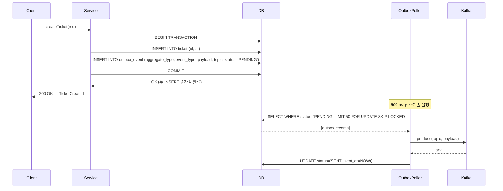

`Service`와 `Poller`는 완전히 분리된 실행 흐름이다.
Client는 Kafka 발행 결과를 기다리지 않고 DB 커밋 직후 응답을 받는다.
Kafka가 일시적으로 다운돼 있어도 Client 요청은 성공하고, Kafka 복구 후 폴러가 밀린 레코드를 순서대로 처리한다.

---

## 4. 폴링 vs CDC 비교

두 방식 모두 outbox 테이블에 기록된 이벤트를 Kafka로 전달한다는 목적은 같다. 다른 점은 "어떻게 변경을 감지하는가"다.

**폴링(Polling)** 은 앱 안에서 주기적으로 `SELECT`를 실행한다. 추가 인프라 없이 스프링 스케줄러만으로 구현 가능하며, 디버깅과 운영이 단순하다. 단점은 폴링 주기만큼 고정 지연이 발생하고, 트래픽이 없는 시간대에도 주기적으로 DB 쿼리가 실행된다는 것이다.

**CDC(Change Data Capture)** 는 DB의 WAL(Write-Ahead Log)을 직접 스트리밍한다. Debezium 같은 커넥터가 WAL에서 `outbox_event` 테이블의 INSERT를 감지해 Kafka에 바로 전송하므로 지연이 수십 ms 이내다. `status` 컬럼을 `SENT`로 갱신할 필요도 없다. 대신 Kafka Connect + Debezium 클러스터를 별도로 운영해야 하고, DB의 WAL 보존 설정도 조정해야 한다.

| 구분 | 폴링 | CDC |
|------|------|-----|
| 구현 복잡도 | 낮음 (스케줄러 + SELECT) | 높음 (Debezium + Kafka Connect) |
| 지연 | 폴링 주기 고정 (이 프로젝트 500ms) | 거의 실시간 (수십 ms) |
| DB 부하 | 주기적 SELECT 부하 발생 | WAL 읽기 (SELECT 없음) |
| 운영 복잡도 | 앱 내 관리, 단순 | 외부 커넥터 운영 필요 |
| 다중 인스턴스 | SKIP LOCKED 필요 | 커넥터가 단일 진입점 |
| 적합한 규모 | 초당 수십 건 이하 | 초당 수백 건 이상 |

이 프로젝트는 패턴 학습 목적이므로 폴링 방식을 사용한다. 운영 부담 없이 핵심 개념을 빠르게 검증하기 좋기 때문이다.

---

## 5. 트레이드오프

**지연(Latency)**: 비즈니스 이벤트가 Kafka에 도달하는 최소 시간은 폴링 주기(500ms)에 produce 왕복 시간을 더한 값이다. 이 지연은 결정론적이다. 폴링 주기를 짧게 설정하면 지연은 줄지만 DB 쿼리 빈도가 올라간다. 실시간 요구사항이 강한 서비스에서는 폴링이 구조적 한계를 갖는다.

**DB 부하**: 폴러가 500ms마다 SELECT를 실행하므로 이벤트가 없는 시간에도 DB 부하가 지속된다. 부분 인덱스(`WHERE status = 'PENDING'`)가 PENDING 레코드만 인덱싱하므로 SENT/DEAD 레코드가 쌓여도 폴러 쿼리 성능에는 영향이 없다. 다만 테이블 자체가 커지는 것을 방지하기 위해 `OutboxMapper.deleteOlderThan()`으로 오래된 SENT 레코드를 주기적으로 정리해야 한다.

**중복 발행 가능성**: produce는 성공했지만 `markAsSent()`가 실패하면, 다음 폴링 주기에 같은 레코드를 다시 produce한다. Consumer는 반드시 멱등성을 갖춰야 한다. 이 프로젝트에서는 Consumer 쪽의 `ProcessedEvent` 테이블로 `(correlationId, eventType)` 복합 키 기반 중복 차단을 구현하고 있다.

**운영 단순성**: 폴링 방식의 진짜 장점은 별도 인프라 없이 앱 하나로 at-least-once 발행 보장을 구현할 수 있다는 점이다. CDC 인프라를 운영할 역량이나 필요성이 생기기 전까지는 폴링이 합리적이고 충분한 선택이다. 먼저 폴링으로 패턴을 이해하고, 트래픽이 늘면 CDC로 전환하는 점진적 접근이 권장된다.

---


## 4. SSE (Server-Sent Events) 실시간 추적

## 1. 개요

파이프라인 이벤트를 클라이언트에 실시간으로 전달할 때 SSE를 선택한 이유는 단방향성과 단순함 때문이다. 파이프라인 진행 상태는 서버에서 클라이언트 방향으로만 흐른다. 클라이언트가 서버에 보낼 데이터는 없으므로 WebSocket의 양방향 채널은 불필요한 복잡도를 추가할 뿐이다.

**WebSocket과의 차이:**

| 항목 | SSE | WebSocket |
|------|-----|-----------|
| 방향 | 서버 → 클라이언트 (단방향) | 양방향 |
| 프로토콜 | HTTP/1.1 위에서 동작 | 별도 업그레이드 핸드셰이크 |
| 프록시/방화벽 | 대부분 투명하게 통과 | 별도 설정 필요한 경우 있음 |
| 재연결 | 브라우저가 자동 처리 | 직접 구현 필요 |
| 서버 구현 | `SseEmitter` (Spring 표준) | `WebSocketHandler` |

**SSE가 적합한 경우:**
- 진행률, 로그 스트리밍, 알림처럼 서버가 일방적으로 push하는 시나리오
- 기존 HTTP 인프라(로드밸런서, 프록시)를 그대로 사용해야 하는 환경
- 클라이언트가 브라우저 표준 `EventSource` API만으로 구현하길 원할 때

---

## 2. 이 프로젝트에서의 적용

### 엔드포인트 — `GET /api/tickets/{id}/pipeline/events`

클라이언트가 이 엔드포인트에 GET 요청을 보내면 서버는 `SseEmitter`를 생성하고 응답으로 반환한다. HTTP 연결은 닫히지 않고 열린 채로 유지되며, 서버는 이 채널을 통해 이벤트를 순차적으로 전송한다.

```java
@GetMapping(value = "/api/tickets/{id}/pipeline/events",
            produces = MediaType.TEXT_EVENT_STREAM_VALUE)
public SseEmitter streamPipelineEvents(@PathVariable String id) {
    SseEmitter emitter = new SseEmitter(180_000L); // 3분 타임아웃
    sseService.register(id, emitter);
    return emitter;
}
```

`SseEmitter`는 Spring MVC가 반환값으로 인식하고 응답 스트림을 열어 둔다. `produces = TEXT_EVENT_STREAM_VALUE`는 Content-Type을 `text/event-stream`으로 설정해 브라우저가 SSE 연결임을 인식하게 한다.

### Kafka Consumer → SSE Push

Redpanda에서 파이프라인 이벤트를 소비하는 Kafka Consumer는 메시지를 받는 즉시 해당 티켓의 `SseEmitter`를 조회해 클라이언트에 push한다.

```java
@KafkaListener(topics = "pipeline-events")
public void consume(PipelineEvent event) {
    SseEmitter emitter = sseService.get(event.ticketId());
    if (emitter != null) {
        try {
            emitter.send(SseEmitter.event()
                .name(event.stage())
                .data(event));
        } catch (IOException e) {
            sseService.remove(event.ticketId());
        }
    }
}
```

Kafka Consumer는 멀티스레드로 동작하므로 `SseEmitterRegistry`는 `ConcurrentHashMap`으로 구현한다. `emitter.send()`가 `IOException`을 던지면 클라이언트 연결이 끊긴 것이므로 즉시 등록을 해제한다. `IllegalStateException`도 catch해야 한다 — emitter가 이미 완료/타임아웃된 상태에서 `send()`를 호출하면 이 예외가 발생하며, 마찬가지로 등록을 해제한다.

### React `usePipelineEvents` 훅

클라이언트는 브라우저 표준 `EventSource` API로 SSE 연결을 맺는다.

```typescript
function usePipelineEvents(ticketId: string) {
  const [events, setEvents] = useState<PipelineEvent[]>([]);

  useEffect(() => {
    const source = new EventSource(`/api/tickets/${ticketId}/pipeline/events`);

    source.onmessage = (e) => {
      setEvents(prev => [...prev, JSON.parse(e.data)]);
    };

    source.onerror = () => {
      // EventSource는 오류 발생 시 자동으로 재연결 시도
      console.warn('SSE 연결 오류, 재연결 중...');
    };

    return () => source.close(); // 컴포넌트 언마운트 시 연결 종료
  }, [ticketId]);

  return events;
}
```

`EventSource`는 연결이 끊기면 브라우저가 자동으로 재연결을 시도한다는 점이 WebSocket과 다른 핵심 장점이다. 별도의 재연결 로직 없이 `onerror` 핸들러에서 로그만 남겨도 브라우저가 알아서 복구한다.

---

## 3. 흐름

```mermaid
flowchart TD
    A([브라우저]) -->|GET /api/tickets/{id}/pipeline/events| B[Spring Controller]
    B -->|SseEmitter 생성 & 등록| C[(SseEmitterRegistry\nConcurrentHashMap)]
    B -->|SseEmitter 반환| A

    D([Redpanda]) -->|pipeline-events 토픽| E[Kafka Consumer]
    E -->|ticketId로 조회| C
    C -->|emitter.send| A

    style A fill:#dbeafe,stroke:#1d4ed8,color:#333
    style B fill:#dcfce7,stroke:#15803d,color:#333
    style C fill:#fef9c3,stroke:#a16207,color:#333
    style D fill:#f3e8ff,stroke:#7e22ce,color:#333
    style E fill:#dcfce7,stroke:#15803d,color:#333
```

흐름의 핵심은 `SseEmitterRegistry`가 연결의 생명주기를 중재한다는 점이다. Controller가 emitter를 등록하고, Consumer가 emitter를 조회해 push하며, 연결 종료 시 두 곳 모두에서 정리를 트리거할 수 있다.

---

## 4. 연결 관리

### 타임아웃

`SseEmitter` 생성자에 밀리초 단위 타임아웃을 지정한다. 타임아웃이 지나면 Spring이 자동으로 연결을 종료하고 `onTimeout` 콜백을 호출한다. 파이프라인이 장시간 실행될 수 있으므로 충분한 여유를 두되, 무한(`-1L`)은 리소스 누수 위험이 있어 피한다.

```java
SseEmitter emitter = new SseEmitter(180_000L);
emitter.onTimeout(() -> sseService.remove(id));
emitter.onCompletion(() -> sseService.remove(id));
emitter.onError(e -> sseService.remove(id));
```

세 콜백 모두 등록 해제를 수행한다. `onCompletion`은 정상 종료, `onTimeout`은 타임아웃, `onError`는 오류 상황에 각각 호출된다.

### 재연결

브라우저의 `EventSource`는 연결이 끊기면 기본 3초 후 자동으로 재연결을 시도한다. 서버는 `retry` 필드로 이 간격을 조절할 수 있다.

```java
emitter.send(SseEmitter.event().reconnectTime(5000));
```

파이프라인 완료 후에는 클라이언트가 더 이상 재연결하지 않도록 완료 이벤트를 전송하고 emitter를 종료한다. `complete()` 호출 전에 반드시 Registry에서 먼저 제거해야 한다. Registry에서 제거해도 emitter 객체 자체는 유효하다 — 제거는 다른 스레드가 이 emitter에 새 메시지를 보내는 것을 방지할 뿐이다. 순서가 반대면 `onCompletion` 콜백과 다른 스레드의 `send()` 사이에 경쟁 조건이 생길 수 있다.

```java
sseService.remove(ticketId);  // 먼저 Registry에서 제거 (다른 스레드의 send 방지)
emitter.send(SseEmitter.event().name("done").data("pipeline-complete"));
emitter.complete();
```

### Emitter 정리

Registry가 비대해지는 것을 방지하기 위해 스케줄러로 주기적으로 만료된 emitter를 정리한다. 실제로는 `onTimeout`/`onCompletion` 콜백으로 대부분 정리되지만, 콜백이 누락된 케이스에 대한 안전망으로 동작한다.

---

## 5. 트레이드오프

**장점:**
- 브라우저 표준 `EventSource` API로 클라이언트 구현이 단순하다. 재연결, 이벤트 파싱이 내장되어 있다.
- 기존 HTTP 인프라를 그대로 사용하므로 로드밸런서나 프록시 설정 변경이 필요 없다.
- Spring `SseEmitter`는 스레드 안전하게 설계되어 있어 Kafka Consumer 스레드에서 직접 `send()`를 호출해도 안전하다.

**단점:**
- 수평 확장 시 문제가 생긴다. 클라이언트가 서버 A에 연결되어 있고, Kafka Consumer가 서버 B에서 이벤트를 소비하면 push가 되지 않는다. 이를 해결하려면 Redis Pub/Sub나 Sticky Session이 필요하다.
- HTTP/1.1 환경에서는 브라우저당 동일 도메인에 최대 6개의 연결 제한이 있다. HTTP/2를 사용하면 다중화로 이 제한이 사라진다.
- 파이프라인이 완료된 후에도 클라이언트가 연결을 유지하면 서버 리소스가 낭비된다. `done` 이벤트를 명시적으로 전송해 클라이언트가 `source.close()`를 호출하도록 유도해야 한다.

> 이 프로젝트는 단일 인스턴스 학습 환경이므로 수평 확장 문제는 현재 범위 밖이다. 프로덕션 적용 시에는 Redis Pub/Sub와 함께 사용하는 것이 표준 패턴이다.

---


## 5. Break-and-Resume 패턴 (Webhook Callback)

## 1. 개요 — 왜 폴링 대신 이벤트 기반인가

외부 시스템(Jenkins 같은 CI 서버)에 작업을 위임할 때 가장 단순한 방법은 폴링이다. 주기적으로 "끝났어?" 라고 물어보는 방식인데, 이는 세 가지 문제를 만든다.

첫째, **스레드 블로킹**이다. Jenkins 빌드는 수십 초에서 수 분까지 걸린다. 폴링 루프를 스레드 안에서 돌리면 그 스레드는 CPU도 쓰지 않은 채 잠만 자면서 서버 리소스를 점유한다. 동시에 100개의 파이프라인이 실행 중이라면 100개 스레드가 전부 잠든 상태로 대기한다.

둘째, **불필요한 API 호출**이다. 빌드가 2분 걸리는데 5초마다 폴링하면 24번의 요청 중 23번은 "아직 안 끝났음"을 확인하는 데 낭비된다. Jenkins 서버에 부하를 주고, 네트워크 비용이 발생한다.

셋째, **반응 지연**이다. 빌드가 완료된 순간과 서버가 그 사실을 아는 순간 사이에 최대 폴링 간격만큼의 지연이 생긴다.

**Break-and-Resume 패턴**은 이 문제를 역전시킨다. "끝나면 나한테 알려줘"라고 요청하고 스레드를 해제한다. Jenkins가 완료되는 시점에 webhook을 보내면 그때 다시 파이프라인 실행을 재개한다. 두 번의 실행 사이에 서버 측 스레드는 완전히 자유롭다.

---

## 2. 이 프로젝트에서의 적용

### PipelineEngine — 빌드 트리거와 스레드 해제

`PipelineEngine`이 `BUILD` 스텝에 도달하면 Jenkins REST API를 호출해 빌드를 시작한다. 이 호출은 fire-and-forget이다. Jenkins가 큐에 빌드를 등록했다는 응답(201 Created)을 받는 순간 엔진은 다음을 수행하고 메서드를 반환한다.

```
1. 현재 스텝 상태를 WAITING_WEBHOOK으로 DB에 저장
2. 관련 컨텍스트(ticketId, stepId, 타임아웃 기한)를 DB에 기록
3. 스레드 해제 (return)
```

이 시점에서 파이프라인은 "일시 정지" 상태다. 스레드는 없지만 DB에 상태가 보존되어 있으므로 언제든 재개할 수 있다.

### Jenkins → Redpanda Connect → Kafka

Jenkins의 `Jenkinsfile` 안에는 빌드 완료 후 webhook을 전송하는 `post` 블록이 있다.

```groovy
post {
    always {
        script {
            def result = currentBuild.result ?: 'SUCCESS'
            sh """
                curl -s -X POST http://redpanda-connect:4197/webhook \
                  -H 'Content-Type: application/json' \
                  -d '{"ticketId":"${params.TICKET_ID}","result":"${result}"}'
            """
        }
    }
}
```

curl 요청은 Redpanda Connect의 HTTP 입력 엔드포인트로 전달된다. Redpanda Connect는 HTTP 요청을 `webhook-events` Kafka 토픽으로 변환해 발행한다. 이 변환은 설정만으로 동작하며 별도 애플리케이션 코드가 필요 없다.

### WebhookHandler — Kafka 소비와 파이프라인 재개

`WebhookHandler`는 `webhook-events` 토픽을 구독하는 Kafka 컨슈머다. 메시지를 수신하면 다음 순서로 처리한다.

```
1. ticketId로 WAITING_WEBHOOK 상태의 스텝을 조회
2. Jenkins 결과(SUCCESS/FAILURE)를 스텝 상태로 변환
3. 스텝 상태를 SUCCESS 또는 FAILED로 업데이트
4. 다음 스텝이 있으면 PipelineEngine.resume(ticketId) 호출
```

`resume()` 호출이 있어야 비로소 파이프라인이 다시 앞으로 나아간다. 이 구조 덕분에 Jenkins와 Spring Boot 사이의 결합은 "webhook URL 하나"로 최소화된다.

### WebhookTimeoutChecker — 5분 타임아웃 보호

webhook이 도착하지 않는 상황은 반드시 처리해야 한다. Jenkins 서버가 다운되거나 네트워크 오류로 curl이 실패하면 파이프라인은 영원히 WAITING_WEBHOOK 상태에 머문다.

`WebhookTimeoutChecker`는 스케줄러로 동작한다. 1분마다 DB를 조회해 `waitingSince` 시각이 5분을 초과한 WAITING_WEBHOOK 스텝을 찾고, 해당 스텝을 FAILED 상태로 전환한 뒤 `SagaCompensator.compensate()`를 호출해 이전 완료 스텝들을 역순 보상한다. 이후 파이프라인 전체를 FAILED로 전환하고, SSE로 클라이언트에게 타임아웃 실패 이벤트가 전송되며 스트림이 종료된다.

---

## 3. 코드 흐름

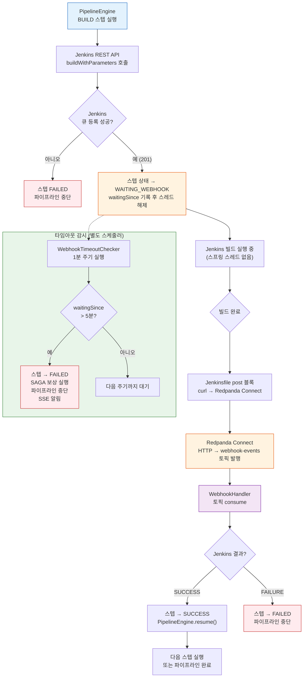

흐름에서 핵심은 `E` 박스 이후다. 스프링 스레드는 WAITING_WEBHOOK을 저장하고 즉시 반환한다. Jenkins 빌드가 진행되는 동안(수십 초~수 분) 서버 측에서 이 파이프라인을 위해 점유된 스레드는 없다. webhook이 도착하는 순간 Kafka 컨슈머 스레드가 한 번 더 깨어나 파이프라인을 재개한다.

---

## 4. 타임아웃 처리

타임아웃 감시는 단순히 "5분 후 실패"가 아니라 세 가지 상황을 커버한다.

**Jenkins 서버 다운.** Jenkins가 아예 응답하지 않으면 빌드 트리거 단계(C 분기)에서 이미 실패 처리된다. 타임아웃 감시 대상이 아니다.

**빌드는 시작됐지만 webhook 전송 실패.** curl 명령 자체가 실패하거나 Redpanda Connect가 일시 다운된 경우다. 빌드는 성공했으나 서버는 그 사실을 모른다. 5분 타임아웃이 이 상황을 처리한다.

**빌드 시간이 5분을 초과하는 경우.** 정상적인 긴 빌드도 타임아웃 대상이 될 수 있다. 이를 방지하려면 `WebhookTimeoutChecker`의 임계값을 빌드 유형별로 다르게 설정하거나, 스텝 생성 시 예상 빌드 시간을 기반으로 개별 타임아웃 기한을 DB에 저장해야 한다.

타임아웃으로 FAILED 처리된 이후 webhook이 늦게 도착하는 경우도 있다. 이때 `resumeAfterWebhook()`의 CAS(`updateStatusIfCurrent`)가 WAITING_WEBHOOK 상태가 아닌 것을 감지하고 처리를 건너뛴다. CAS 실패 시 로그를 남기고 조용히 반환하므로 중복 보상이 발생하지 않는다.

`resumeAfterWebhook()`의 실행 시간 계산도 정확하다. `Duration.between(execution.getStartedAt(), now)`로 파이프라인 전체 실행 시간을 계산해 완료 이벤트(`PipelineExecutionCompletedEvent.durationMs`)에 포함한다. 성공/실패 모두에 적용된다.

---

## 5. 트레이드오프

**장점: 스레드 효율.** 폴링 방식 대비 파이프라인당 점유 스레드가 제로에 가깝다. 수백 개의 파이프라인이 WAITING_WEBHOOK 상태에 있어도 서버 리소스에 거의 영향이 없다.

**장점: 반응성.** Jenkins 빌드가 완료되는 즉시 webhook이 전송된다. 폴링 간격만큼의 지연 없이 SSE로 결과가 전달된다.

**단점: 외부 시스템 의존성.** Jenkins의 `post` 블록이 webhook을 보내도록 `Jenkinsfile`이 올바르게 작성되어 있어야 한다. Jenkins 관리자와의 협의가 필요하며, Jenkinsfile이 잘못되면 파이프라인이 항상 타임아웃으로 실패한다.

**단점: Redpanda Connect 가용성.** Jenkins와 Spring Boot 사이에 Redpanda Connect가 추가된다. Connect가 다운되면 webhook이 소실된다. Connect 재시작 후 재전송을 보장하려면 Jenkins 측에서 재시도 로직이 필요하다.

**단점: 디버깅 복잡도.** 실패 원인이 Jenkins 빌드 자체인지, curl 전송인지, Connect 변환인지, Kafka 소비인지 추적하려면 각 단계의 로그를 별도로 확인해야 한다. 분산 추적(correlationId를 webhook 페이로드에 포함)을 설계 초기부터 넣지 않으면 운영 시 원인 파악이 어렵다.

**판단 기준.** 빌드 시간이 짧고(30초 이내) 파이프라인 수가 적다면(동시 10개 이하) 폴링이 구현 단순성 면에서 낫다. 빌드가 길거나 파이프라인이 많아질 전망이라면 Break-and-Resume이 확장성과 리소스 효율 면에서 명확하게 우위다.

---


## 6. 06. Redpanda Connect (HTTP → Kafka 브릿지)

## 1. 개요

Redpanda Connect는 외부 시스템이 Kafka 프로토콜을 직접 구현하지 않아도 이벤트를 토픽에 발행할 수 있게 해주는 데이터 파이프라인 도구다. HTTP, gRPC, 파일, AWS S3 등 다양한 입력 소스를 Kafka 토픽으로 연결하거나, 반대로 Kafka 토픽에서 데이터를 꺼내 외부 시스템으로 전달하는 역할을 한다.

**직접 Kafka produce와의 차이점:**

직접 produce 방식은 클라이언트가 Kafka 프로토콜(바이너리 TCP)을 구현한 라이브러리를 사용해야 한다. Java의 `KafkaProducer`, Go의 `franz-go` 같은 것들이 여기에 해당한다. 이 방식은 성능이 뛰어나지만, 해당 언어/환경에서 Kafka 클라이언트를 사용할 수 없을 때는 대안이 필요하다.

Redpanda Connect를 브릿지로 두면 클라이언트는 HTTP POST 한 번으로 끝난다. Kafka 클라이언트 설정, 재연결 로직, 파티션 전략 같은 복잡성은 Connect가 흡수한다.

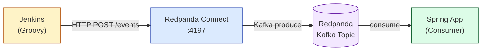

## 2. 이 프로젝트에서의 적용

### 흐름

Jenkins 파이프라인이 빌드·배포 이벤트를 발생시키면 이를 Kafka 토픽으로 흘려보내야 한다. Jenkins는 Groovy 환경에서 실행되며, 공식 Kafka 클라이언트가 없다. `httpRequest` 스텝은 기본 제공되므로 HTTP POST로 이벤트를 보내는 것이 가장 자연스럽다.

Redpanda Connect가 `:4197` 포트에서 HTTP 요청을 받아 `ci-events` 토픽으로 전달한다. Spring 앱은 별도 webhook 엔드포인트를 구현할 필요 없이 기존 Kafka 컨슈머로 이벤트를 수신한다.

### Jenkins 파이프라인 예시

```groovy
// Jenkinsfile
post {
    always {
        script {
            def payload = """{
                "jobName": "${env.JOB_NAME}",
                "buildNumber": "${env.BUILD_NUMBER}",
                "result": "${currentBuild.result}",
                "timestamp": "${System.currentTimeMillis()}"
            }"""
            httpRequest(
                url: 'http://redpanda-connect:4197/events',
                httpMode: 'POST',
                contentType: 'APPLICATION_JSON',
                requestBody: payload
            )
        }
    }
}
```

### Spring 앱 측

Spring 앱은 Kafka 컨슈머만 구현하면 된다. Jenkins가 HTTP로 보내는지, Spring 앱이 직접 produce하는지는 관심사가 아니다.

```java
@KafkaListener(topics = "ci-events", groupId = "ci-monitor")
public void handleCiEvent(String message) {
    log.info("CI 이벤트 수신: {}", message);
    // 빌드 결과 처리
}
```

## 3. 설정 예시 (connect.yaml)

```yaml
# connect.yaml
input:
  http_server:
    address: "0.0.0.0:4197"
    path: "/events"
    allowed_verbs:
      - POST
    timeout: "5s"

pipeline:
  processors:
    - bloblang: |
        root = this
        root.received_at = now()

output:
  kafka_franz:
    seed_brokers:
      - "redpanda:9092"
    topic: "ci-events"
    compression: lz4
    batching:
      count: 10
      period: "100ms"
```

**핵심 필드 설명:**

- `http_server.address`: Connect가 리슨할 주소. 컨테이너 내부에서는 `0.0.0.0`으로 바인딩해야 외부에서 접근 가능하다.
- `http_server.path`: 요청을 받을 경로. 여러 파이프라인을 분리하고 싶으면 path별로 별도 yaml을 구성한다.
- `pipeline.processors.bloblang`: Benthos/Connect의 변환 언어. 필드 추가, 필터링, 라우팅을 처리한다. 위 예시는 수신 시각을 메타데이터로 추가한다.
- `kafka_franz`: 순수 Go 구현의 Kafka 클라이언트를 사용한다. `sarama` 기반의 `kafka` output보다 성능이 좋고, Redpanda와의 호환성이 높다.
- `batching`: 소량의 메시지도 일정 개수나 시간이 차면 묶어서 produce해 처리량을 높인다.

### docker-compose 통합

```yaml
services:
  redpanda-connect:
    image: redpandadata/connect:latest
    ports:
      - "4197:4197"
    volumes:
      - ./connect.yaml:/connect.yaml
    command: run /connect.yaml
    depends_on:
      - redpanda
```

## 4. 왜 Connect인가?

Jenkins는 Kafka 클라이언트가 없다. 이것이 핵심 이유다.

Jenkins 파이프라인은 Groovy로 작성되며, JVM 위에서 실행되므로 이론상 Java Kafka 클라이언트를 사용할 수 있다. 하지만 Jenkins 플러그인 의존성 관리는 복잡하고, 파이프라인 스크립트에서 외부 라이브러리를 직접 추가하는 것은 권장되지 않는다. Jenkins 관리자가 클러스터 설정을 잠가두면 선택지가 더 좁아진다.

HTTP는 언어나 런타임에 관계없이 어디서나 사용할 수 있는 범용 프로토콜이다. `curl`, `httpRequest`, `fetch`, `requests` — 어떤 환경에서든 HTTP 클라이언트는 존재한다. Connect를 HTTP 엔드포인트로 노출하면 **모든 HTTP 가능 시스템이 Kafka 프로듀서가 된다.**

이 패턴은 GitHub Actions, GitLab CI, 배치 스크립트, 레거시 모노리스처럼 Kafka 클라이언트를 내장하기 어려운 시스템을 Kafka 생태계에 연결할 때 반복적으로 등장한다.

## 5. 트레이드오프

| 항목 | Connect 브릿지 방식 | 직접 Produce 방식 |
|------|-------------------|--------------------|
| 클라이언트 요구사항 | HTTP만 가능하면 충분 | Kafka 클라이언트 라이브러리 필수 |
| 레이턴시 | HTTP 왕복 + Kafka produce (2홉) | Kafka produce (1홉) |
| 신뢰성 | Connect 장애 시 이벤트 유실 가능 | 클라이언트가 직접 재시도 제어 |
| 운영 복잡도 | Connect 인스턴스 추가 관리 필요 | 클라이언트 라이브러리 버전 관리 |
| 변환/라우팅 | bloblang으로 파이프라인 내 처리 | 애플리케이션 코드에서 처리 |

**신뢰성 보완:** Connect가 Kafka에 write하기 전에 다운되면 HTTP 응답이 실패로 돌아오므로 Jenkins는 재시도할 수 있다. Connect가 Kafka write를 완료했지만 HTTP 응답 전에 다운되면 Jenkins는 실패로 인식하고 재시도하지만 이벤트는 이미 토픽에 있다. 이 중복을 방지하려면 이벤트에 고유 ID를 포함하고 컨슈머에서 멱등성을 보장해야 한다.

**언제 직접 produce를 써야 하나:** 클라이언트가 Java, Go, Python처럼 성숙한 Kafka 클라이언트가 있는 환경이고, 레이턴시가 중요하거나, 파티션 키 전략을 세밀하게 제어해야 한다면 직접 produce가 낫다. Connect는 "Kafka를 못 쓰는 외부 시스템을 연결할 때" 가장 빛을 발한다.

---


## 7. 토픽/메시지 설계 (Avro 스키마)

## 1. 개요 — 왜 토픽 설계가 중요한가

토픽은 이벤트 브로커에서 데이터가 흐르는 경로이자 계약이다. 토픽 이름이 의미를 잃으면 어떤 컨슈머가 어떤 메시지를 읽어야 하는지 코드를 열지 않고는 알 수 없다. 파티션 수를 잘못 설정하면 순서 보장이 깨지거나 병렬 처리 효율이 떨어진다. 메시지 포맷에 스키마 규칙이 없으면 프로듀서 팀과 컨슈머 팀이 각자 다른 구조를 기대하는 상황이 생기고, 필드 하나를 바꿀 때마다 모든 컨슈머를 동시에 배포해야 하는 강결합이 발생한다.

이 문서는 Redpanda Playground 프로젝트가 6개 토픽을 어떤 규칙으로 설계했는지, 그리고 Avro 스키마와 Schema Registry가 그 계약을 어떻게 강제하는지 설명한다.

---

## 2. 토픽 네이밍 규칙

모든 토픽은 `playground.{domain}.{type}` 형식을 따른다.

| 토픽 | 도메인 | 타입 | 직렬화 |
|------|--------|------|--------|
| `playground.ticket.events` | ticket | events | Avro |
| `playground.pipeline.commands` | pipeline | commands | Avro |
| `playground.pipeline.events` | pipeline | events | Avro |
| `playground.webhook.inbound` | webhook | inbound | JSON |
| `playground.audit.events` | audit | events | Avro |
| `playground.dlq` | (공통) | - | - |

**프리픽스 `playground.`** 는 같은 Redpanda 클러스터에 여러 프로젝트가 공존할 때 토픽 간 충돌을 막는다. 개발/스테이징 환경에서 단일 클러스터를 공유하는 경우에도 `playground-dev.ticket.events`처럼 프리픽스만 바꿔 격리할 수 있어 네이밍 규칙을 지키는 것만으로 환경 분리가 가능하다.

**도메인 세그먼트**는 ArchUnit이 강제하는 도메인 경계와 일치한다. `ticket` 도메인 코드만 `playground.ticket.events`에 발행하고, `pipeline` 도메인 코드만 `playground.pipeline.*`을 소유한다. 이 규칙을 지키면 어떤 서비스가 어떤 토픽의 오너인지 항상 명확하다.

**타입 세그먼트**는 메시지의 성격을 구분한다. `events`는 "이미 일어난 사실"이므로 프로듀서가 결과에 책임을 지지 않는다. `commands`는 "수행해 달라는 요청"이므로 컨슈머가 처리 책임을 진다. `inbound`는 외부 시스템에서 들어온 원본 데이터로, 도메인 이벤트로 변환되기 전 단계임을 나타낸다.

### 도메인별 분리 이유

`pipeline.commands`와 `pipeline.events`를 하나의 토픽으로 합치면 컨슈머 그룹이 자신에게 불필요한 메시지를 필터링해야 한다. 필터링은 곧 불필요한 역직렬화 비용이고, 컨슈머 로직에 "내가 처리할 메시지인가?"를 판단하는 분기가 생긴다. 도메인과 타입으로 분리된 토픽은 컨슈머가 구독 시점에 이미 관심 데이터만 받도록 설계되어 있어 이 분기가 사라진다.

---

## 3. 파티션 전략

### 토픽별 파티션 수

| 토픽 | 파티션 수 | 이유 |
|------|-----------|------|
| `playground.ticket.events` | 3 | 티켓은 여러 ID가 독립적으로 생성되므로 병렬 처리 이득이 있다. 3개는 소규모 클러스터의 실용적 출발점이다. |
| `playground.pipeline.commands` | 3 | 파이프라인 커맨드는 `executionId` 단위로 순서가 보장되어야 하며, 동시에 여러 파이프라인이 독립 실행된다. |
| `playground.pipeline.events` | 3 | 커맨드 토픽과 동일한 `executionId` 키를 사용해 같은 실행의 이벤트가 같은 파티션에 쌓이도록 한다. |
| `playground.webhook.inbound` | 2 | 웹훅 수신량은 Jenkins 빌드 수와 비례하며 상대적으로 적다. Connect가 단순 포워딩만 하므로 2개로 충분하다. |
| `playground.audit.events` | 1 | 감사 이벤트는 발생 순서 자체가 감사의 의미를 가진다. 단일 파티션으로 전역 순서를 보장한다. |
| `playground.dlq` | 1 | Dead Letter Queue는 처리 실패 메시지를 모아두는 보조 토픽이다. 순차 분석을 위해 단일 파티션이 적합하다. |

### 파티션 키 선택

파티션 키는 "같은 키를 가진 메시지는 항상 같은 파티션으로"라는 규칙으로 순서를 보장한다. 잘못된 키를 선택하면 파티션이 불균등하게 채워지거나 순서 보장이 필요한 곳에서 순서가 깨진다.

- **`playground.ticket.events`**: `ticketId`를 키로 사용한다. 같은 티켓에 대한 이벤트 순서를 보장하면서도 서로 다른 티켓은 다른 파티션으로 분산된다.
- **`playground.pipeline.commands` / `playground.pipeline.events`**: `executionId`를 키로 사용한다. 하나의 파이프라인 실행(`executionId`)에 속한 커맨드와 이벤트가 단일 파티션에서 순서대로 처리되어야 SAGA 보상 로직이 올바르게 동작한다.
- **`playground.webhook.inbound`**: Jenkins 빌드 ID 또는 `executionId`를 키로 사용한다. 같은 빌드의 웹훅이 같은 컨슈머 인스턴스로 라우팅되어 `resumeAfterWebhook()` 처리가 일관성을 유지한다.
- **`playground.audit.events`**: 단일 파티션이므로 키가 순서에 영향을 주지 않는다. `resourceId`를 키로 설정해 특정 리소스의 감사 이력 조회 시 파티션 지역성을 활용할 수 있다.

---

## 4. Avro 스키마 설계

### 메타데이터 전략 — Kafka 헤더 단일화

모든 이벤트 메타데이터는 Kafka 레코드 헤더에 통합되어 있고, Avro payload는 순수 비즈니스 데이터만 담는다. 이 구조를 선택한 이유는 메타데이터의 정본(source of truth)을 한 곳으로 통합해 ID 불일치와 책임 분산 문제를 제거하기 위해서다.

메타데이터 헤더는 세 곳에서 설정된다.

**CloudEventsHeaderInterceptor** (`ProducerInterceptor`)가 모든 메시지에 자동 부착:

| 헤더 키 | 값 | 역할 |
|---------|-----|------|
| `ce_specversion` | `"1.0"` | CloudEvents 규격 버전 |
| `ce_id` | `UUID.randomUUID()` | 이벤트 고유 식별자 (정본 이벤트 ID) |
| `ce_source` | `"/" + serviceName` | 발행 서비스 식별자 |
| `ce_time` | `Instant.now().toString()` | 이벤트 발생 시각 |
| `trace-id` | MDC에서 추출 | 분산 추적 ID |

**OutboxPoller**가 이벤트별로 설정:

| 헤더 키 | 값 | 역할 |
|---------|-----|------|
| `ce_type` | `event.getEventType()` | 이벤트 타입 (e.g. `TICKET_CREATED`) |
| `eventType` | `event.getEventType()` | 컨슈머 라우팅용 (ce_type과 동일 값) |
| `correlationId` | `event.getCorrelationId()` | 멱등성 체크 기준 키 |

Interceptor는 `addIfAbsent()`를 사용하므로 OutboxPoller가 먼저 설정한 `ce_type`은 덮어쓰지 않는다.

**멱등성 체크**: 컨슈머는 `record.headers()`에서 `correlationId`를 추출하고, `processed_event` 테이블의 `(correlationId, eventType)` 복합 키로 중복 수신을 판단한다.

### 도메인 이벤트 구조 예시

```json
// TicketCreatedEvent — playground.ticket.events
{
  "type": "record",
  "name": "TicketCreatedEvent",
  "namespace": "com.study.playground.avro.ticket",
  "fields": [
    {"name": "ticketId",     "type": "long"},
    {"name": "name",         "type": "string"},
    {"name": "sourceTypes",  "type": {"type": "array", "items": "com.study.playground.avro.common.SourceType"}}
  ]
}

// PipelineExecutionStartedEvent — playground.pipeline.commands
{
  "type": "record",
  "name": "PipelineExecutionStartedEvent",
  "namespace": "com.study.playground.avro.pipeline",
  "fields": [
    {"name": "executionId",  "type": "string"},
    {"name": "ticketId",     "type": "long"},
    {"name": "steps",        "type": {"type": "array", "items": "string"}}
  ]
}
```

### 왜 JSON이 아닌 Avro인가

JSON은 사람이 읽기 쉽고 별도 도구 없이 파싱할 수 있다는 장점이 있다. 그러나 이벤트 브로커 환경에서는 세 가지 이유로 Avro가 더 적합하다.

**첫째, 스키마 진화(Schema Evolution)를 관리할 수 있다.** Avro는 `BACKWARD`, `FORWARD`, `FULL` 호환성 규칙을 Schema Registry에서 강제한다. 새 필드를 추가할 때 `default` 값을 제공하면 구버전 컨슈머가 새 메시지를 읽을 수 있고, 새 컨슈머가 구 메시지를 읽을 수도 있다. JSON이라면 이 규칙을 코드 리뷰와 팀 약속으로만 지켜야 한다.

**둘째, 직렬화 크기가 컴팩트하다.** JSON은 필드 이름을 매 메시지마다 문자열로 포함하지만, Avro는 필드 이름을 스키마 ID로 대체해 페이로드를 최소화한다. 토픽에 초당 수천 건의 이벤트가 쌓이는 환경에서 이 차이는 브로커 디스크와 네트워크 비용에 직접 영향을 준다.

**셋째, 컴파일 타임 타입 안전성을 제공한다.** Avro Gradle 플러그인이 `.avsc` 파일로부터 Java 클래스를 생성하므로, 프로듀서가 `ticketId` 필드에 `String`을 넣으면 컴파일 오류가 발생한다. JSON 기반이라면 이 오류가 런타임에서야 드러난다.

`playground.webhook.inbound`가 JSON을 유지하는 이유는 Redpanda Connect가 외부 Jenkins에서 받은 원본 HTTP 페이로드를 그대로 포워딩하기 때문이다. 외부 시스템의 JSON 구조를 Avro로 강제하려면 Connect 파이프라인에 변환 로직이 필요하고, 이는 Connect가 "전송만 담당"한다는 역할 분리 원칙에 위배된다. 원본을 보존하고 Spring 컨슈머가 도메인 이벤트로 변환하는 것이 올바른 경계다.

### Schema Registry 역할

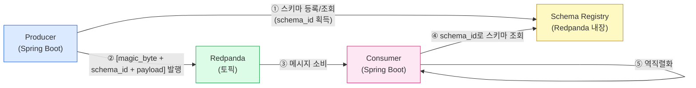

Redpanda는 Schema Registry를 내장하므로 별도 컨테이너 없이 `http://localhost:8081`로 접근 가능하다. 프로듀서는 처음 메시지를 보낼 때 스키마를 등록하고 `schema_id`(정수)를 받는다. 이후 메시지 페이로드 앞에 5바이트(magic byte 1 + schema_id 4)를 붙여 발행한다. 컨슈머는 이 5바이트를 읽어 Schema Registry에서 스키마를 가져온 뒤 역직렬화한다. 스키마가 Registry에 없으면 역직렬화 자체가 실패하므로, 미등록 스키마로 발행하는 사고가 런타임에서 즉시 드러난다.

---

## 5. 메시지 보관 정책 (Retention)

보관 정책은 "컨슈머 장애 복구에 얼마나 여유를 줄 것인가"와 "디스크 비용" 사이의 트레이드오프다.

| 토픽 | 보관 기간 | 이유 |
|------|-----------|------|
| `playground.ticket.events` | 7일 | 티켓 생성 이벤트는 다운스트림 컨슈머가 재처리해야 할 경우를 대비해 일주일의 여유를 둔다. |
| `playground.pipeline.commands` | 1일 | 커맨드는 처리된 후 의미가 없다. 실행 이력은 DB에 있으므로 짧은 보관으로 충분하다. |
| `playground.pipeline.events` | 7일 | SSE 구독 전 발생한 이벤트를 재처리하거나 감사 목적으로 조회할 수 있도록 보관한다. |
| `playground.webhook.inbound` | 3일 | Jenkins 콜백은 재처리 가능성이 낮지만 디버깅을 위해 짧게 보관한다. |
| `playground.audit.events` | 30일 | 감사 이벤트는 규정 준수 목적으로 장기 보관이 필요하다. |
| `playground.dlq` | 14일 | 실패 메시지를 분석하고 수동 재처리하는 데 충분한 시간을 확보한다. |

Redpanda는 `retention.ms`(시간 기반)와 `retention.bytes`(크기 기반) 두 가지 정책을 지원하며, 둘 다 설정하면 먼저 도달하는 조건에 따라 삭제된다. 이 프로젝트는 학습 환경이므로 기간 기반만 설정한다. 프로덕션에서 `playground.audit.events`처럼 보관 기간이 긴 토픽은 크기 상한도 함께 설정해 디스크 폭발을 방지해야 한다.

---

## 6. 주의사항 — 스키마 변경 시 호환성

스키마를 변경할 때 호환성 규칙을 위반하면 컨슈머가 역직렬화에 실패하고 메시지가 DLQ로 이동한다. Schema Registry의 호환성 모드는 기본적으로 `BACKWARD`이며, 이 모드에서 허용되는 변경과 금지되는 변경은 다음과 같다.

**허용되는 변경 (BACKWARD 호환)**
- `default` 값을 가진 새 필드 추가. 구버전 컨슈머는 이 필드를 무시하고, 신버전 컨슈머는 default로 채운다.
- 기존 필드에 `null` union 추가. `"type": "string"` → `"type": ["null", "string"]`

**금지되는 변경**
- 기존 필드 삭제. 구버전 메시지를 읽는 컨슈머가 해당 필드를 찾지 못한다.
- `default` 없는 새 필드 추가. 구버전 메시지에 해당 필드가 없으므로 역직렬화 실패.
- 필드 타입 변경 (`string` → `long`). 이미 발행된 메시지의 바이트 구조가 달라진다.
- 필드 이름 변경. Avro는 필드를 이름으로 매핑하므로 이름이 달라지면 새 필드로 인식된다.

**브랜치별 Schema Registry 전략**: `feature` 브랜치에서는 `testCompatibility` API로 호환성 검사만 수행하고 실제 등록은 하지 않는다. `develop`/`main` 브랜치 빌드 시에만 Schema Registry에 등록한다. 이 규칙은 실험적 스키마 변경이 공유 Registry를 오염시키는 것을 방지한다.

---

## 7. Envelope 패턴 — 구현 완료

### 이전 구조의 문제점

Avro payload에 `EventMetadata`(eventId, correlationId, eventType, timestamp, source)가 내장되어 있었고, 동시에 CloudEventsHeaderInterceptor가 `ce_id`, `ce_time`, `ce_source`를 독립적으로 생성했다. 같은 이벤트에 서로 다른 ID와 타임스탬프가 존재하는 Dual Metadata 상태였다.

### 현재 구조

```
Kafka 헤더 (CloudEvents + 확장)     Avro payload (비즈니스 데이터만)
────────────────────────────────     ────────────────────────────────
ce_id          (Interceptor)         ticketId: 42
ce_type        (OutboxPoller)        name: "배포 티켓"
ce_source      (Interceptor)        sourceTypes: [GITLAB]
ce_time        (Interceptor)
correlationId  (OutboxPoller)
eventType      (OutboxPoller)
trace-id       (Interceptor/MDC)
```

- **EventMetadata.avsc 삭제**: 모든 Avro 스키마에서 `metadata` 필드 제거, `EventMetadata` 레코드 삭제
- **correlationId → Outbox**: `outbox_event` 테이블에 `correlation_id` 컬럼 추가, OutboxPoller가 Kafka 헤더로 전달
- **컨슈머**: `event.getMetadata().getCorrelationId()` → `extractHeader(record, "correlationId")`로 전환
- **정본 이벤트 ID**: CloudEventsHeaderInterceptor가 생성하는 `ce_id`가 유일한 이벤트 ID

### 스키마 호환성 참고

이 프로젝트는 학습 환경이므로 BACKWARD 호환 단계(Phase 1: optional 전환 → Phase 2: 제거)를 건너뛰고 한번에 `metadata` 필드를 삭제했다. 프로덕션에서는 Phase 1(optional 전환) → 컨슈머 전환 → Phase 2(필드 제거) 순서로 진행해야 기존 메시지 역직렬화 실패를 방지할 수 있다.

---

## 참고

- `src/main/avro/` — 전체 `.avsc` 스키마 파일
- `docs/#3-transactional-outbox` — 이벤트 발행 원자성 보장
- `PROJECT_SPEC.md` — 토픽 목록 및 도메인 격리 규칙

---


## 8. Adapter 패턴: Real + Fallback Step Executor

## 1. 개요

배포 파이프라인은 Jenkins, Nexus, Container Registry, Kubernetes 같은 외부 인프라에 의존한다. 개발 초기나 데모 환경에서는 이 인프라가 모두 갖춰져 있지 않은 경우가 많다. 외부 의존성을 직접 호출하는 코드를 작성하면 인프라가 없을 때 전체 흐름을 테스트하거나 시연하기 어려워진다.

Adapter 패턴은 이 문제를 해결한다. 각 외부 시스템 호출을 `StepExecutor` 인터페이스 뒤에 숨기고, 인프라 가용성에 따라 Real 구현체와 Fallback(Mock) 구현체를 교체한다. 오케스트레이터는 인프라 존재 여부를 알 필요 없이 동일한 인터페이스로 각 단계를 실행한다.

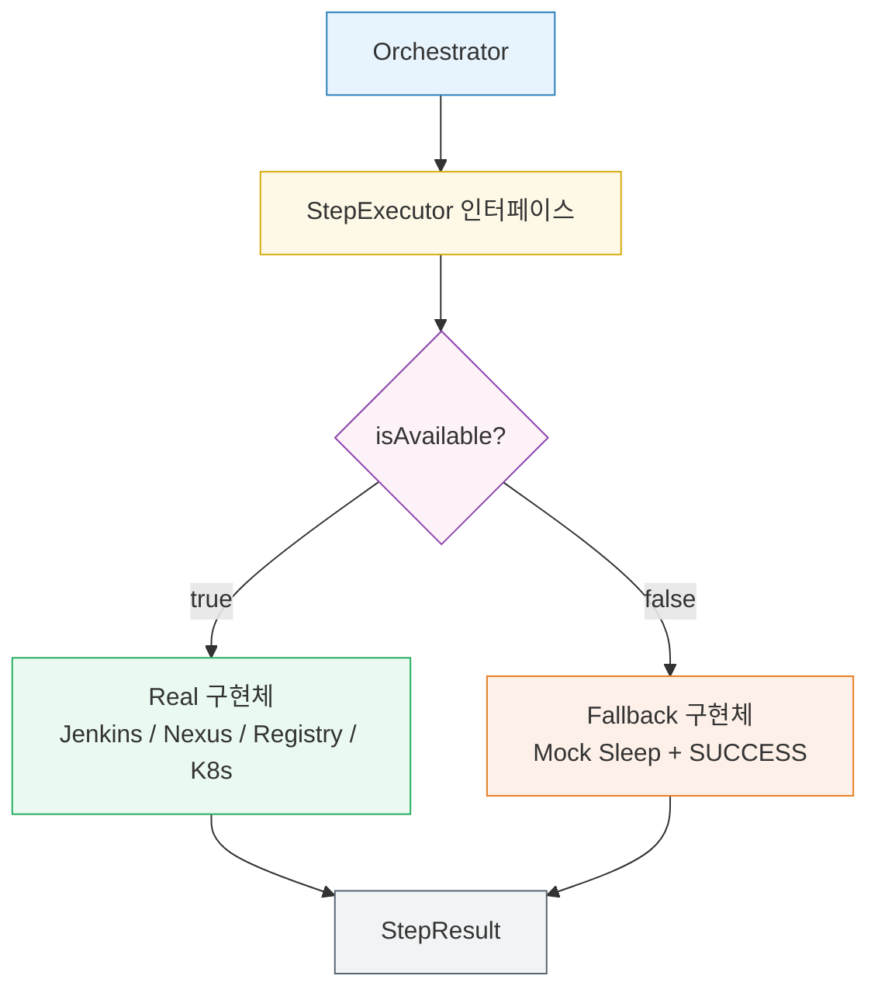

---

## 2. 이 프로젝트에서의 적용

### StepExecutor 인터페이스

모든 단계 구현체가 따르는 계약이다. `execute` 메서드 하나와 가용성 확인 메서드 하나로 이루어진다.

```java
public interface StepExecutor {
    StepResult execute(DeployStep step);
    boolean isAvailable();
}
```

`isAvailable()`은 외부 시스템에 경량 헬스체크(HTTP ping, 커넥션 테스트 등)를 수행한다. 실패하면 오케스트레이터가 Fallback으로 전환한다.

### Real 구현체

| 구현체 | 대상 시스템 | 주요 동작 |
|--------|------------|-----------|
| `JenkinsCloneAndBuildStep` | Jenkins | Job 트리거 → 빌드 완료 폴링 |
| `NexusDownloadStep` | Nexus Repository | 아티팩트 다운로드 URL 생성 및 검증 |
| `RegistryImagePullStep` | Container Registry | 이미지 존재 확인 및 Pull 명령 전송 |
| `RealDeployStep` | Kubernetes / 배포 대상 | 매니페스트 적용 후 롤아웃 상태 확인 |

각 Real 구현체는 `isAvailable()` 내부에서 외부 시스템 연결 가능 여부를 확인한다. 예를 들어 `JenkinsCloneAndBuildStep`은 Jenkins REST API `/api/json`으로 헬스 요청을 보내고, 응답이 없으면 `false`를 반환한다.

### Fallback 구현체

Real 구현체가 `isAvailable() = false`를 반환하면 대응하는 Fallback이 실행된다. Fallback은 실제 작업을 수행하지 않고, 의도적인 지연(sleep) 후 성공을 반환하여 전체 흐름이 끊기지 않게 한다.

```java
public class FallbackJenkinsStep implements StepExecutor {

    @Override
    public boolean isAvailable() {
        return true; // Fallback은 항상 가용
    }

    @Override
    public StepResult execute(DeployStep step) {
        log.info("[FALLBACK] Jenkins 미연결 — Mock 빌드 시뮬레이션");
        sleep(2_000); // 빌드 시간 시뮬레이션
        return StepResult.success("mock-artifact-1.0.0.jar");
    }
}
```

### 오케스트레이터에서의 선택 로직

```java
StepExecutor executor = real.isAvailable() ? real : fallback;
StepResult result = executor.execute(step);
```

선택 로직은 오케스트레이터 한 곳에만 존재한다. 각 단계 구현체는 자신이 Real인지 Fallback인지 알 필요가 없다.

---

## 3. 왜 이 패턴인가

**인프라 없이도 전체 흐름 시연이 가능하다.** Jenkins나 Nexus가 없는 환경에서도 Fallback이 각 단계를 통과시키므로, 이벤트 발행→SAGA 오케스트레이션→상태 추적 전 흐름을 데모할 수 있다. 발표나 개발 초기 단계에서 유용하다.

**점진적 통합이 자연스럽다.** Jenkins를 먼저 연결하면 `JenkinsCloneAndBuildStep`이 Real로 동작하고, Nexus는 아직 Fallback으로 남아 있어도 된다. 단계별로 실제 시스템을 붙여가면서 전체 파이프라인을 완성할 수 있다.

**오케스트레이터와 인프라가 분리된다.** SAGA 오케스트레이터는 각 외부 시스템의 API 세부 사항을 모른다. 외부 시스템이 바뀌어도 해당 `StepExecutor` 구현체만 교체하면 오케스트레이터 코드는 변경하지 않아도 된다.

---

## 4. [FAIL] 마커 처리

`[FAIL]` 마커는 파이프라인 메시지 본문에 포함된 의도적 실패 신호다. 이 마커 처리도 `StepExecutor` 계층에서 담당한다. Real과 Fallback 모두 `execute()` 진입 시점에 마커를 확인하고, 마커가 있으면 실제 외부 호출 없이 즉시 `StepResult.failure()`를 반환한다.

```java
@Override
public StepResult execute(DeployStep step) {
    if (step.getPayload().contains("[FAIL]")) {
        log.warn("[FAIL 마커 감지] 단계 강제 실패 처리: {}", step.getName());
        return StepResult.failure("FAIL marker detected");
    }
    // 이후 실제 실행 또는 Mock 실행
}
```

이 방식은 SAGA 보상 트랜잭션 흐름을 인프라 없이도 테스트할 수 있게 한다. 특정 단계 메시지에 `[FAIL]`을 포함하면 그 단계부터 보상 이벤트가 역순으로 발행되는 전체 롤백 시나리오를 재현할 수 있다.

---

## 5. 보안 및 설정

### SSRF 방지 — AdapterInputValidator

모든 Real 어댑터(Jenkins, Nexus, Registry, GitLab)는 외부 입력을 URL 경로에 포함하기 전에 `AdapterInputValidator`로 검증한다. 두 가지 검증을 수행한다.

- `validatePathParam(value, paramName)`: 화이트리스트 정규식(`^[a-zA-Z0-9_./-]+$`)으로 허용 문자만 통과시키고, `../` 같은 경로 순회를 차단한다.
- `validateBaseUrl(url)`: 다운로드 URL이 허용된 호스트에서 온 것인지 확인한다.

URL 조립에는 문자열 연결 대신 `UriComponentsBuilder.pathSegment()`를 사용해 자동 인코딩을 보장한다.

### @Profile("mock") — Fallback 분리

Mock 스텝 구현체(`MockCloneStep`, `MockBuildStep` 등)에 `@Profile("mock")`을 추가해 프로덕션 환경에서 Mock 빈이 로드되지 않도록 했다. 개발/데모 환경에서만 `spring.profiles.active=mock`을 설정해 Fallback을 활성화한다.

### RestTemplate 타임아웃

모든 어댑터가 사용하는 `RestTemplate`에 connectTimeout(3초)과 readTimeout(10초)을 설정했다. 외부 시스템 장애 시 스레드가 무한 대기하는 것을 방지한다.

---

## 관련 패턴

- `03-transactional-outbox.md` — 단계 결과를 Outbox를 통해 발행하는 방법
- `01-async-accepted.md` — 오케스트레이터가 비동기 수락 응답을 처리하는 방법

---


## 9. 멱등성 패턴 (ProcessedEvent 중복 방지)

## 1. 개요

Kafka(Redpanda)는 at-least-once 전달을 기본으로 보장한다. 즉, 네트워크 장애나 Consumer 재시작이 발생하면 같은 메시지가 두 번 이상 도착할 수 있다. Consumer가 메시지를 처리한 직후, 오프셋을 커밋하기 직전에 죽으면 재시작 시 같은 메시지를 다시 읽는다. 이것은 버그가 아니라 설계된 동작이다.

문제는 Consumer 로직이 멱등하지 않을 때 발생한다. 주문 생성, 결제 승인, 외부 API 호출처럼 부작용이 있는 작업은 같은 메시지를 두 번 처리하면 데이터 불일치나 이중 청구가 생긴다. 따라서 Consumer 로직 자체를 멱등하게 만들거나, 중복 메시지를 탐지하여 건너뛰는 장치가 필요하다.

## 2. 이 프로젝트에서의 적용

### processed_event 테이블

중복 탐지의 핵심은 "이 메시지를 이미 처리했는가"를 저장하는 저장소다. 이 프로젝트는 `processed_event` 테이블을 사용한다.

```sql
CREATE TABLE processed_event (
    correlation_id VARCHAR(255) NOT NULL,
    event_type     VARCHAR(100) NOT NULL,
    processed_at   TIMESTAMP    NOT NULL DEFAULT NOW(),
    PRIMARY KEY (correlation_id, event_type)
);
```

`(correlation_id, event_type)` 복합 유니크 키가 핵심이다. 같은 상관관계 ID라도 이벤트 타입이 다르면 별개의 처리로 간주한다. 예를 들어 `order-123` 상관관계 ID에 대해 `ORDER_CREATED`와 `ORDER_PAID`는 각각 독립적으로 기록된다.

### INSERT...WHERE NOT EXISTS (preemptive acquire)

중복 여부를 먼저 SELECT로 확인한 뒤 처리하는 방식은 TOCTOU(Time Of Check To Time Of Use) 경쟁 조건에 취약하다. 두 Consumer 인스턴스가 동시에 같은 메시지를 받으면 둘 다 SELECT에서 미처리로 판단하고 동시에 처리를 시작할 수 있다.

이 프로젝트는 preemptive acquire 패턴을 사용한다. 처리 전에 먼저 레코드를 삽입하려 시도하고, 유니크 제약 위반이 발생하면 중복으로 판단한다.

```java
// Spring Data JPA 네이티브 쿼리 예시
@Modifying
@Query(value = """
    INSERT INTO processed_event (correlation_id, event_type, processed_at)
    SELECT :correlationId, :eventType, NOW()
    WHERE NOT EXISTS (
        SELECT 1 FROM processed_event
        WHERE correlation_id = :correlationId AND event_type = :eventType
    )
    """, nativeQuery = true)
int insertIfAbsent(@Param("correlationId") String correlationId,
                   @Param("eventType") String eventType);
```

반환값이 0이면 이미 처리된 메시지다. `WHERE NOT EXISTS` 구문과 유니크 키를 함께 사용하면 SELECT+INSERT 사이의 경쟁 조건 없이 DB 수준에서 원자적으로 처리된다.

### 중복 수신 시 처리

삽입 시도 결과가 0이면(이미 처리됨) 비즈니스 로직을 실행하지 않고 skip 로그만 남긴 뒤 오프셋을 커밋한다. Consumer가 멈추지 않아야 하기 때문에 예외를 던지지 않는다.

```
[SKIP] 이미 처리된 이벤트 — correlationId=order-123, eventType=ORDER_CREATED
```

### webhook 멱등키

Jenkins 파이프라인 실행에서 발생하는 webhook 이벤트는 별도의 멱등키를 사용한다.

```
jenkins:{executionId}:{stepOrder}
```

`executionId`는 Jenkins 빌드 번호, `stepOrder`는 파이프라인 단계 순서다. 같은 빌드의 같은 단계에서 webhook이 재전송되어도 동일한 키로 탐지되어 무시된다.

## 3. 왜 이 방식인가

**DB 기반** (이 프로젝트의 선택): 별도 인프라 추가 없이 비즈니스 트랜잭션과 동일한 DB를 사용한다. `processed_event` 삽입과 비즈니스 데이터 변경을 하나의 트랜잭션에 묶을 수 있어 원자성이 자연스럽게 확보된다. 단점은 DB I/O가 추가되고, 대용량 처리에서 병목이 될 수 있다는 점이다.

**Redis 기반**: `SETNX`(SET if Not eXists) 명령으로 빠른 중복 탐지가 가능하다. 처리량이 높은 시스템에 적합하지만 Redis가 필수 인프라가 되고, Redis 장애 시 멱등성 보장이 무너진다. TTL 기반 자동 만료가 가능하다는 장점이 있다.

**Kafka 트랜잭션(exactly-once)**: Kafka 자체 트랜잭션 기능을 사용하면 Consumer 오프셋과 Producer 전송을 원자적으로 처리할 수 있다. 그러나 외부 시스템(DB, API) 호출을 포함하는 로직에는 적용되지 않으며, 설정이 복잡하고 성능 비용이 있다.

이 프로젝트는 외부 API 호출과 DB 쓰기가 혼재하기 때문에 Kafka 트랜잭션만으로는 부족하다. Redis 추가 의존성을 피하고 트랜잭션 일관성을 보장하는 DB 기반 방식이 적합하다.

## 4. 주의사항

**테이블 정리 전략**: `processed_event` 테이블은 시간이 지날수록 계속 커진다. 무한 증가를 막으려면 `processed_at` 기준으로 일정 기간이 지난 레코드를 주기적으로 삭제해야 한다. 보존 기간은 Kafka 메시지 보존 기간보다 길어야 한다. Kafka retention이 7일이라면 `processed_event`는 최소 14일 이상 보존해야 재처리 시나리오에서 중복을 탐지할 수 있다.

```sql
-- 배치 삭제 예시 (30일 이상 경과한 레코드)
DELETE FROM processed_event
WHERE ctid IN (
    SELECT ctid FROM processed_event
    WHERE processed_at < NOW() - INTERVAL '30 days'
    LIMIT 1000
);
```

한 번에 전체 삭제하면 DB 락이 길어질 수 있으므로 서브쿼리 `LIMIT`으로 배치 처리한다.

**키 충돌 설계**: `correlation_id`는 전역적으로 고유해야 한다. UUID v4를 사용하면 충돌 확률이 사실상 없다. 순차 ID나 타임스탬프 기반 ID는 분산 환경에서 충돌 가능성이 있으므로 피한다. webhook의 `jenkins:{executionId}:{stepOrder}` 패턴처럼 도메인별로 prefix를 붙이면 `correlation_id` 네임스페이스 충돌을 방지할 수 있다.

**트랜잭션 경계**: `insertIfAbsent`와 비즈니스 로직은 반드시 같은 트랜잭션 안에 있어야 한다. 삽입 성공 후 비즈니스 로직이 실패하면 트랜잭션 롤백으로 삽입도 함께 취소되어, 다음 재시도 시 정상적으로 처리된다. 두 작업이 별도 트랜잭션으로 분리되면 삽입은 성공했지만 비즈니스 처리는 실패한 유령 레코드가 생겨 이후 재시도가 모두 중복으로 판단된다. 이 프로젝트에서 `TicketStatusEventConsumer`는 `@Transactional`로 `processedEvent` 삽입과 `ticketMapper.updateStatus()`를 하나의 트랜잭션으로 묶는다.

**예외 처리 전략**: Consumer에서 멱등성 체크 외의 예외가 발생하면 catch에서 삼키지 않고 재전파해야 한다. 예외를 삼키면 Kafka 오프셋이 커밋되어 실패한 메시지가 영구 유실된다. `JenkinsWebhookHandler`는 `JsonProcessingException`은 skip하고 그 외 예외는 재전파한다. `JsonProcessingException`을 skip하는 이유는 잘못된 JSON은 재시도해도 동일하게 실패할 구조적 문제이기 때문이다. 반면 DB 오류나 네트워크 예외는 일시적일 수 있으므로 재전파해 Kafka 재시도를 유도한다.

---


## 10. 동적 커넥터 관리 패턴

## 1. 개요

Redpanda Connect를 Streams 모드로 운영하면 여러 파이프라인을 하나의 프로세스에서 관리할 수 있다. 현재 이 프로젝트는 3개의 정적 YAML 파일(`jenkins-webhook`, `gitlab-webhook`, `jenkins-command`)을 docker-compose 기동 시 로드하는 방식으로 동작한다. 새로운 외부 도구(Nexus, ArgoCD 등)를 추가하려면 YAML 파일을 수동으로 작성하고 컨테이너를 재기동해야 한다.

문제는 지원도구 관리(`SupportToolService`)와 커넥터 관리가 분리되어 있다는 점이다. UI에서 Jenkins 인스턴스를 등록해도 해당 인스턴스의 webhook 수신 파이프라인이나 command 발행 파이프라인이 자동으로 생성되지 않는다. 운영자가 YAML을 직접 작성하고, docker-compose를 재기동하는 수동 과정이 개입한다.

동적 커넥터 관리 패턴은 이 간극을 메운다. 지원도구 CRUD 이벤트에 연동하여 Connect Streams REST API로 커넥터를 런타임에 생성·수정·삭제하고, DB에 설정을 영속화하여 재시작 시에도 복원하는 구조다.

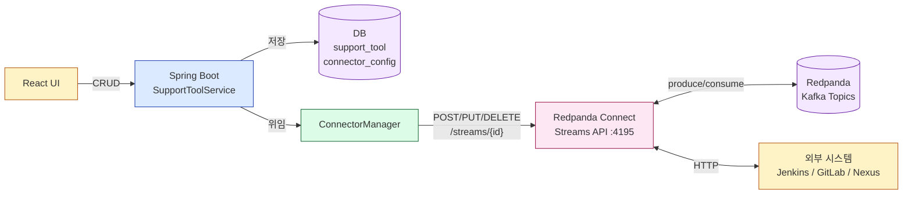

---

## 2. 현재 구조

### 정적 파이프라인 3개

| 파일 | 방향 | 역할 |
|------|------|------|
| `jenkins-webhook.yaml` | HTTP → Kafka | Jenkins webhook을 `:4197/webhook/jenkins`로 수신하여 `playground.webhook.inbound` 토픽에 발행 |
| `gitlab-webhook.yaml` | HTTP → Kafka | GitLab webhook을 `:4196/webhook/gitlab`로 수신하여 같은 토픽에 발행 |
| `jenkins-command.yaml` | Kafka → HTTP | `playground.pipeline.commands` 토픽에서 `JENKINS_BUILD_COMMAND` 이벤트를 소비하여 Jenkins REST API로 빌드 트리거 |

이 3개는 docker-compose에서 볼륨 마운트(`/etc/connect/*.yaml`)로 Streams 모드에 로드된다. 파일 기반 스트림이므로 REST API로 삭제할 수 없고, 컨테이너 재시작 후에도 항상 존재한다.

### 지원도구 CRUD

`SupportToolService`는 DB 테이블(`support_tool`)을 통해 외부 도구의 연결 정보(URL, 인증, 타입)를 관리한다. `testConnection()`으로 헬스체크까지 지원하지만, 커넥터 생성과는 연동되지 않는다. 도구를 등록하는 것과 그 도구의 파이프라인을 생성하는 것이 별개 작업인 셈이다.

---

## 3. 동적 관리 설계

### 핵심 아이디어

지원도구 등록 시점에 해당 도구 유형(`ToolType`)에 맞는 YAML 템플릿을 채워 Connect Streams REST API로 등록한다. 삭제 시점에는 API로 스트림을 제거한다. 설정은 DB에 영속화하여 애플리케이션 재시작 시 일괄 복원한다.

### ConnectorManager 역할

`SupportToolService`와 Connect Streams API 사이를 중재하는 컴포넌트다. 직접적인 HTTP 호출 로직을 캡슐화하여 `SupportToolService`가 커넥터 관리 상세를 알 필요 없게 한다.

```
SupportToolService  ──→  ConnectorManager  ──→  Connect Streams API
       │                       │
       └── support_tool ──────└── connector_config (DB)
```

### YAML 템플릿 기반 생성

커넥터 유형별로 YAML 템플릿을 정의하고, 지원도구의 연결 정보(URL, 인증, 토픽명)를 주입하여 완성된 YAML을 만든다. 템플릿은 코드 내 상수 또는 리소스 파일로 관리한다.

변수 치환 대상:

| 변수 | 출처 | 예시 |
|------|------|------|
| `${tool.url}` | SupportTool.url | `http://jenkins:8080` |
| `${tool.username}` | SupportTool.username | `admin` |
| `${tool.credential}` | SupportTool.credential (복호화) | API 토큰 |
| `${tool.id}` | SupportTool.id | `3` |
| `${webhook.path}` | ToolType 기반 생성 | `/webhook/jenkins-3` |

### 영속화 전략

Connect Streams REST API로 등록한 스트림은 컨테이너 재시작 시 소멸한다. 이를 해결하기 위해 `connector_config` 테이블에 스트림 ID와 YAML 설정을 저장한다.

```sql
-- V9__create_connector_config.sql
CREATE TABLE connector_config (
    id          BIGSERIAL PRIMARY KEY,
    stream_id   VARCHAR(100) UNIQUE NOT NULL,  -- Connect 스트림 ID (e.g. jenkins-3-webhook)
    tool_id     BIGINT NOT NULL,               -- support_tool FK
    yaml_config TEXT NOT NULL,                  -- 변수 치환 완료된 YAML
    direction   VARCHAR(20) NOT NULL,           -- INBOUND / OUTBOUND
    created_at  TIMESTAMP NOT NULL DEFAULT NOW(),
    FOREIGN KEY (tool_id) REFERENCES support_tool(id) ON DELETE CASCADE
);
```

---

## 4. 코드 흐름

### 등록 흐름

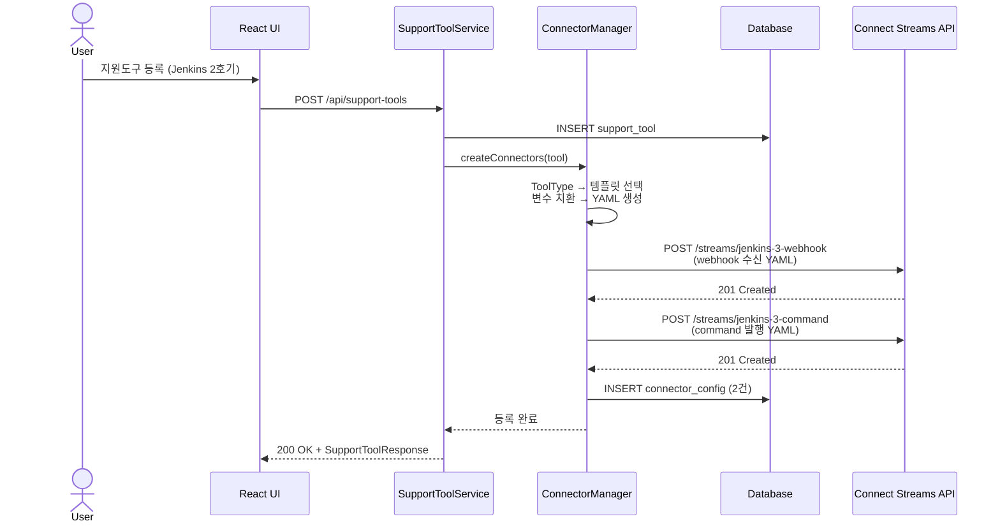

스트림 ID는 `{toolType}-{toolId}-{direction}` 형식으로 생성한다(예: `jenkins-3-webhook`, `jenkins-3-command`). 파일 기반 스트림과 이름이 충돌하지 않도록 도구 ID를 포함한다.

### 삭제 흐름

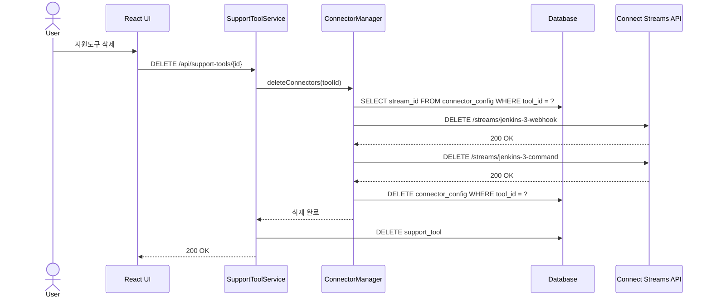

### 기동 시 복원 흐름

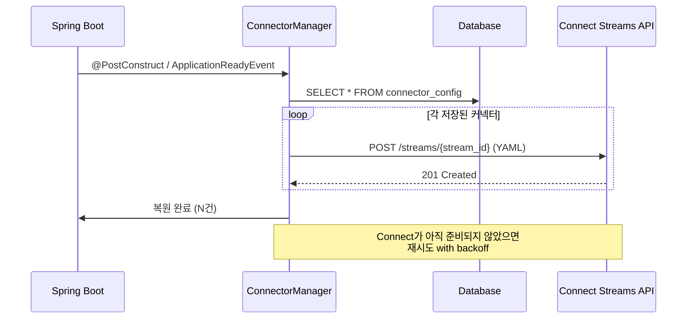

Connect 컨테이너가 Spring Boot보다 늦게 기동될 수 있으므로, 복원 로직은 지수 백오프 재시도를 포함해야 한다.

---

## 5. 커넥터 유형별 YAML 템플릿

### Webhook 수신 (HTTP → Kafka)

Jenkins, GitLab, Nexus 등 외부 시스템이 webhook을 보낼 때 수신하는 파이프라인이다. 기존 `jenkins-webhook.yaml`과 동일한 구조에서 경로와 소스 식별자만 달라진다.

```yaml
# 템플릿: webhook-inbound
input:
  http_server:
    path: /webhook/${tool.type}-${tool.id}
    allowed_verbs:
      - POST

pipeline:
  processors:
    - mapping: |
        root.webhookSource = "${tool.type}"
        root.toolId = ${tool.id}
        root.payload = content().string()
        root.headers = @
        root.receivedAt = now()

output:
  kafka_franz:
    seed_brokers:
      - redpanda:9092
    topic: playground.webhook.inbound
    key: ${! json("webhookSource") }
```

Streams 모드에서 `http_server`의 `address`는 무시되고 공유 포트(4195)에 등록되므로, `path`만 고유하면 충돌하지 않는다.

### Command 발행 (Kafka → HTTP)

Spring 앱이 Kafka에 발행한 command를 소비하여 외부 시스템 REST API를 호출하는 파이프라인이다. ToolType별로 HTTP 요청 형식이 달라지므로 템플릿도 분기된다.

**Jenkins Command:**

```yaml
# 템플릿: jenkins-command
input:
  kafka_franz:
    seed_brokers:
      - redpanda:9092
    topics:
      - playground.pipeline.commands
    consumer_group: connect-${tool.type}-${tool.id}-command
    start_from_oldest: false

pipeline:
  processors:
    - mapping: |
        let event_type = @eventType.string()
        let target_tool = @targetToolId.string()
        root = if $event_type != "JENKINS_BUILD_COMMAND" || $target_tool != "${tool.id}" {
          deleted()
        } else { this }
    - mapping: |
        let job = this.jobName
        let query = this.params.key_values().map_each(kv -> "%s=%s".format(kv.key, kv.value)).join("&")
        meta jenkins_path = "/job/%s/buildWithParameters?%s".format($job, $query)
        root = ""

output:
  http_client:
    url: "${tool.url}${! meta(\"jenkins_path\") }"
    verb: POST
    headers:
      Content-Type: application/x-www-form-urlencoded
    basic_auth:
      enabled: true
      username: "${tool.username}"
      password: "${tool.credential}"
    retries: 3
    retry_period: "5s"
```

정적 `jenkins-command.yaml`과의 차이점은 consumer group에 도구 ID를 포함하여 격리하고, `targetToolId` 헤더로 특정 도구에만 반응하도록 필터링한다는 것이다. 여러 Jenkins 인스턴스가 동일 토픽을 소비하더라도 각자 자기 메시지만 처리한다.

**GitLab Command:**

```yaml
# 템플릿: gitlab-command
input:
  kafka_franz:
    seed_brokers:
      - redpanda:9092
    topics:
      - playground.pipeline.commands
    consumer_group: connect-gitlab-${tool.id}-command
    start_from_oldest: false

pipeline:
  processors:
    - mapping: |
        let event_type = @eventType.string()
        let target_tool = @targetToolId.string()
        root = if $event_type != "GITLAB_PIPELINE_COMMAND" || $target_tool != "${tool.id}" {
          deleted()
        } else { this }

output:
  http_client:
    url: "${tool.url}/api/v4/projects/${! this.projectId }/pipeline"
    verb: POST
    headers:
      Content-Type: application/json
      Private-Token: "${tool.credential}"
    retries: 3
```

**Nexus Command:**

```yaml
# 템플릿: nexus-command (아티팩트 조회 트리거)
input:
  kafka_franz:
    seed_brokers:
      - redpanda:9092
    topics:
      - playground.pipeline.commands
    consumer_group: connect-nexus-${tool.id}-command
    start_from_oldest: false

pipeline:
  processors:
    - mapping: |
        let event_type = @eventType.string()
        let target_tool = @targetToolId.string()
        root = if $event_type != "NEXUS_SEARCH_COMMAND" || $target_tool != "${tool.id}" {
          deleted()
        } else { this }

output:
  http_client:
    url: "${tool.url}/service/rest/v1/search?repository=${! this.repository }&name=${! this.componentName }"
    verb: GET
    headers:
      Accept: application/json
    basic_auth:
      enabled: true
      username: "${tool.username}"
      password: "${tool.credential}"
```

---

## 6. 트레이드오프

### 정적 vs 동적

| 항목 | 정적 (파일 기반) | 동적 (API 기반) |
|------|-----------------|----------------|
| 설정 관리 | YAML 파일 + docker-compose | DB + REST API |
| 추가/변경 | 파일 수정 → 재기동 | API 호출 → 즉시 반영 |
| 영속성 | 파일이므로 자연스럽게 영속 | 휘발성 — DB 영속화 필요 |
| 삭제 보호 | API로 삭제 불가 (안전) | API로 즉시 삭제 가능 |
| 버전 관리 | Git 추적 가능 | DB 레코드 (Git 외부) |
| 적합한 경우 | 변하지 않는 기본 파이프라인 | 사용자가 런타임에 추가하는 파이프라인 |

### 혼용 전략

두 방식을 배타적으로 사용할 필요는 없다. 이 프로젝트에서 권장하는 전략은 다음과 같다.

**파일 기반 (기본):** 프로젝트에 내장된 기본 도구의 파이프라인. 현재의 3개 YAML이 여기에 해당한다. docker-compose와 함께 항상 존재하며, Git으로 버전 관리된다. 이 파이프라인은 "프로젝트가 동작하기 위한 최소 인프라"에 해당하므로 정적으로 유지하는 것이 안전하다.

**API 기반 (동적):** 사용자가 UI에서 추가하는 도구의 파이프라인. `SupportToolService.create()` 시점에 `ConnectorManager`가 Connect API로 등록하고, DB에 설정을 저장한다. 컨테이너 재시작 시 `@PostConstruct`에서 DB를 읽어 복원한다.

두 방식이 같은 토픽을 사용할 수 있다. webhook 수신 파이프라인은 모두 `playground.webhook.inbound`에 발행하고, `webhookSource` 필드로 출처를 구분한다. command 파이프라인은 모두 `playground.pipeline.commands`에서 소비하되, `eventType`과 `targetToolId` 헤더로 자기 메시지만 필터링한다.

### 주의사항

1. **포트 공유**: Streams 모드에서 동적으로 추가된 `http_server` input도 공유 포트(4195)에 등록된다. path가 겹치면 기존 스트림이 덮어씌워지므로 path에 도구 ID를 포함하여 고유성을 보장한다.

2. **인증 정보 노출**: YAML 템플릿에 credential이 평문으로 들어간다. Connect Streams API의 `GET /streams/{id}`로 설정을 조회하면 인증 정보가 노출될 수 있다. Connect API 접근을 내부 네트워크로 제한하거나, Connect의 환경변수 참조(`${CREDENTIAL}`) 방식을 사용하는 것을 고려해야 한다.

3. **복원 순서**: Spring Boot가 Connect보다 먼저 기동되면 복원 API 호출이 실패한다. `ApplicationReadyEvent` + 재시도 로직(지수 백오프, 최대 5회)으로 대응한다.

4. **Dry-run 검증**: 동적 등록 전 `POST /streams/{id}?dry_run=true`로 YAML 유효성을 먼저 검증한다. 잘못된 설정이 등록되어 스트림이 즉시 실패하는 것을 방지한다.

---

## 7. 구현 상세

### 파일 구조

```
app/src/main/
├── java/com/study/playground/connector/
│   ├── domain/ConnectorConfig.java          # DB 엔티티
│   ├── mapper/ConnectorConfigMapper.java    # MyBatis 인터페이스
│   ├── client/ConnectStreamsClient.java      # Connect REST API 클라이언트
│   └── service/
│       ├── ConnectorManager.java            # 핵심 오케스트레이터
│       └── ConnectorRestoreListener.java    # 기동 시 복원
└── resources/
    ├── db/migration/V9__create_connector_config.sql
    ├── mapper/ConnectorConfigMapper.xml
    └── connect-templates/
        ├── webhook-inbound.yaml             # 공용 webhook 수신
        ├── jenkins-command.yaml             # Jenkins 빌드 트리거
        ├── gitlab-command.yaml              # GitLab 파이프라인 트리거
        └── nexus-command.yaml               # Nexus 아티팩트 조회
```

### 설계 결정

| 결정 | 선택 | 이유 |
|------|------|------|
| 패키지 위치 | `connector` 패키지 | adapter, pipeline과 동일한 단일 책임 패키지 패턴 |
| YAML 템플릿 | `resources/connect-templates/` 리소스 파일 | 20-30줄 YAML을 Java 상수로 넣으면 가독성 저하 |
| 변수 치환 | `String.replace()` | 학습 프로젝트에 템플릿 엔진은 과잉. 5개 변수만 치환 |
| REGISTRY 타입 | 커넥터 생성 스킵 | webhook/command 패턴에 맞지 않음 |
| 부분 실패 | 보상 삭제 후 예외 전파 | webhook 성공 + command 실패 시 webhook 롤백 |
| 기동 복원 | `ApplicationReadyEvent` + 지수 백오프 | Connect가 Spring보다 늦게 뜰 수 있음 |
| 실패 격리 | try/catch graceful degradation | 커넥터 실패가 도구 CRUD를 차단하지 않음 |

### 템플릿 변수

실제 구현에서 플레이스홀더는 `${TOOL_TYPE}`, `${TOOL_ID}`, `${TOOL_URL}`, `${TOOL_USERNAME}`, `${TOOL_CREDENTIAL}` 형식을 사용한다. 설계 문서의 `${tool.type}` 형식과 다른 이유는, `String.replace()`로 단순 치환할 때 Java 프로퍼티 표현식(`${tool.type}`)이 Redpanda Connect의 자체 변수 문법(`${! ... }`)과 혼동될 수 있어서 대문자 프리픽스(`TOOL_`)로 네임스페이스를 분리했기 때문이다.

### ConnectStreamsClient

`JenkinsAdapter`와 동일한 패턴(RestTemplate + try/catch + boolean 반환)으로 구현했다. `Content-Type: application/yaml`로 YAML 본문을 전송하고, 실패 시 false를 반환하며 예외를 전파하지 않는다. Connect 서버 주소는 `app.connect.url` 프로퍼티로 설정한다(기본값: `http://localhost:4195`).

### ConnectorManager 핵심 흐름

**createConnectors(tool):** REGISTRY면 즉시 반환한다. 그 외에는 webhook 템플릿과 command 템플릿(ToolType별)을 로드하여 변수를 치환하고, Connect API에 순차 등록한다. command 등록 실패 시 이미 등록한 webhook을 보상 삭제한 뒤 예외를 던진다. 양쪽 모두 성공하면 `connector_config` 테이블에 2건을 INSERT한다.

**deleteConnectors(toolId):** DB에서 해당 도구의 커넥터 목록을 조회하고, 각각 Connect API DELETE를 호출한 뒤(best-effort) DB 레코드를 삭제한다.

**restoreConnectors():** DB의 모든 커넥터 설정을 조회하여 Connect API에 재등록한다. 성공/실패 카운트를 로깅한다.

### ConnectorRestoreListener

`ApplicationReadyEvent`를 수신하면 별도 스레드에서 복원을 시도한다. 지수 백오프(2s → 4s → 8s → 16s → 32s, 최대 5회)로 Connect 컨테이너 준비를 기다리며, 최종 실패 시 에러 로그만 남기고 앱 기동을 차단하지 않는다.

### SupportToolService 변경점

`ConnectorManager`를 필드로 주입받아 `create()` 후 `connectorManager.createConnectors(tool)`, `delete()` 전 `connectorManager.deleteConnectors(id)`를 호출한다. 둘 다 try/catch로 감싸서 커넥터 실패가 도구 CRUD에 영향을 주지 않도록 했다.

### 검증 방법

```bash
# 1. 빌드
./gradlew build

# 2. 도구 등록 → 동적 스트림 확인
curl -X POST http://localhost:8080/api/support-tools \
  -H 'Content-Type: application/json' \
  -d '{"toolType":"JENKINS","name":"Jenkins 2호기","url":"http://jenkins2:8080","username":"admin","credential":"token","active":true}'

curl http://localhost:4195/streams  # 동적 스트림 2개 확인

# 3. 도구 삭제 → 스트림 제거 확인
curl -X DELETE http://localhost:8080/api/support-tools/{id}
curl http://localhost:4195/streams  # 동적 스트림 사라짐

# 4. 복원: 앱 재시작 후 GET /streams에서 복원 확인
```

---

## 참조

- **HTTP→Kafka 브릿지 기본 개념**: `docs/#6-redpanda-connect`
- **Streams 모드 + REST API 기술 상세**: `docs/infra/03-connect-streams.md`
- **정적 파이프라인 YAML**: `docker/connect/jenkins-webhook.yaml`, `gitlab-webhook.yaml`, `jenkins-command.yaml`
- **지원도구 CRUD**: `SupportToolService.java`
- **구현 소스**: `connector/` 패키지 (domain, mapper, client, service)

---

