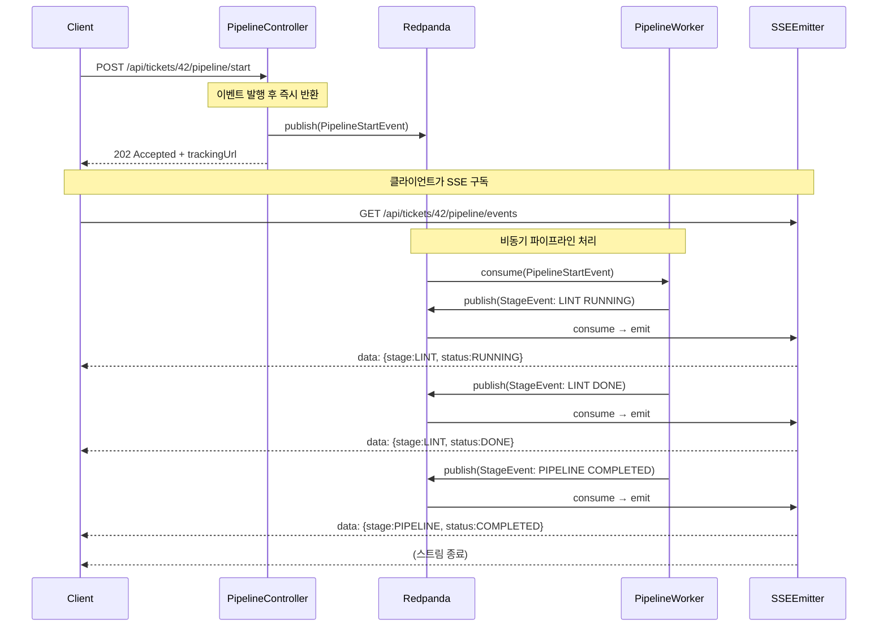

# 202 Accepted 비동기 응답 패턴

## 1. 개요 — 왜 이 패턴이 필요한가

HTTP 요청을 받은 서버가 처리를 완료하는 데 오랜 시간이 걸릴 때, 동기 방식으로 응답하면 클라이언트는 그 시간 내내 연결을 붙잡고 기다려야 한다. 파이프라인 실행처럼 여러 단계를 순서대로 수행하는 작업은 수십 초에서 수 분까지 걸릴 수 있으므로, 동기 응답은 타임아웃·리소스 낭비·사용자 경험 저하를 동시에 유발한다.

**202 Accepted 패턴**은 이 문제를 HTTP 의미론에 맞게 해결한다. 서버는 요청을 받자마자 "처리 예약을 수락했다"는 202 응답을 즉시 반환하고, 실제 작업은 비동기로 진행한다. 클라이언트는 응답 본문에 포함된 `trackingUrl`을 통해 진행 상황을 별도 채널(이 프로젝트에서는 SSE)로 구독한다.

이 패턴이 가진 핵심 가치는 두 가지다. 첫째, 요청 수락과 처리 완료를 분리함으로써 서버가 처리 시간에 상관없이 빠르게 응답할 수 있다. 둘째, 처리 과정 자체를 이벤트 브로커(Redpanda)를 통해 분산시킬 수 있어 수평 확장과 장애 격리가 자연스럽게 달성된다.

---

## 2. 이 프로젝트에서의 적용

### PipelineController

```
POST /api/tickets/{id}/pipeline/start
```

클라이언트가 위 엔드포인트를 호출하면 컨트롤러는 다음 두 가지만 수행하고 즉시 반환한다.

1. `ticketId`와 요청 메타데이터로 `PipelineStartEvent`를 생성해 Redpanda 토픽에 발행한다.
2. 추적용 SSE 엔드포인트 URL을 담은 `202 Accepted` 응답을 반환한다.

**응답 예시:**

```json
HTTP/1.1 202 Accepted
Content-Type: application/json

{
  "status": "ACCEPTED",
  "ticketId": "TICKET-42",
  "trackingUrl": "/api/tickets/TICKET-42/pipeline/events",
  "message": "파이프라인 실행이 예약되었습니다."
}
```

### SSE 추적 엔드포인트

```
GET /api/tickets/{id}/pipeline/events
Content-Type: text/event-stream
```

클라이언트는 위 SSE 엔드포인트에 연결해 파이프라인 각 단계의 이벤트를 실시간으로 수신한다. 단계가 진행될 때마다 이벤트가 스트리밍되고, 마지막 단계 완료 또는 실패 시 `COMPLETED`/`FAILED` 이벤트와 함께 스트림이 닫힌다.

```
data: {"stage":"LINT","status":"RUNNING","progress":10}

data: {"stage":"LINT","status":"DONE","progress":30}

data: {"stage":"TEST","status":"RUNNING","progress":40}

data: {"stage":"BUILD","status":"DONE","progress":90}

data: {"stage":"PIPELINE","status":"COMPLETED","progress":100}
```

---

## 3. 코드 흐름



흐름에서 주목할 점은 `PipelineController`와 `PipelineWorker`가 Redpanda 토픽을 통해서만 연결된다는 것이다. 컨트롤러는 워커의 존재를 모르고, 워커는 요청 스레드와 완전히 분리되어 실행된다. 이 분리 덕분에 워커를 여러 인스턴스로 확장하거나 장애 시 재처리하는 것이 HTTP 레이어의 변경 없이 가능하다.

---

## 4. 왜 200이 아닌 202인가

HTTP 상태 코드는 단순한 숫자가 아니라 서버의 처리 상태를 표현하는 의미론적 계약이다.

- **200 OK**는 "서버가 요청을 완전히 처리했고 결과를 응답 본문에 담아 반환한다"는 의미다. 클라이언트는 200을 받으면 작업이 완료되었다고 간주해도 된다.
- **202 Accepted**는 "요청은 수락했지만 아직 처리가 완료되지 않았다"는 의미다. RFC 7231은 이를 명시적으로 정의한다: *"The request has been accepted for processing, but the processing has not been completed."*

파이프라인 시작 요청의 경우 컨트롤러가 반환하는 시점에 파이프라인은 이제 막 Redpanda 토픽에 올라간 상태다. 처리가 완료된 것이 전혀 없으므로 200을 반환하는 것은 거짓말이 된다. 클라이언트가 200을 받고 "완료됐겠지"라고 판단하면 추적 로직을 건너뛰거나 잘못된 상태를 표시할 수 있다.

202는 이 의도를 정직하게 전달한다. 클라이언트는 "아직 진행 중이니 추적이 필요하다"는 신호를 받고, 응답 본문의 `trackingUrl`로 자연스럽게 이동한다.

---

## 5. 주의사항 / 트레이드오프

**클라이언트 복잡도가 높아진다.**
동기 응답이라면 클라이언트는 응답 하나만 처리하면 된다. 비동기 패턴은 최초 202 처리, SSE 연결, 이벤트 파싱, 연결 종료 처리까지 여러 단계를 구현해야 한다. 모바일이나 레거시 클라이언트에서는 SSE 지원 여부를 먼저 확인해야 한다.

**SSE 연결이 끊기면 이벤트를 놓친다.**
SSE는 서버에서 클라이언트로의 단방향 스트림이다. 네트워크 단절 후 재연결하면 그 사이에 발행된 이벤트는 기본적으로 수신할 수 없다. 이 문제는 SSE의 `Last-Event-ID` 헤더와 서버 측 이벤트 저장소(Redis, DB)를 조합해 재전송하는 방식으로 해결할 수 있으나, 구현 비용이 추가된다.

**추적 URL의 유효 기간을 명시해야 한다.**
`trackingUrl`이 영원히 유효하다면 오래된 연결이 누적되어 서버 리소스가 낭비된다. 파이프라인 완료 후 일정 시간(예: 5분)이 지나면 404를 반환하도록 설계하고, 클라이언트가 이를 처리할 수 있어야 한다.

**멱등성을 고려해야 한다.**
클라이언트가 네트워크 오류로 202 응답을 받지 못하면 동일 요청을 재시도할 수 있다. `ticketId`가 이미 실행 중인 파이프라인을 가지고 있을 때 중복 실행을 막을 보호 장치(DB unique constraint, 상태 체크)가 컨트롤러에 있어야 한다.

**Redpanda 토픽이 가용하지 않으면 202가 거짓말이 된다.**
컨트롤러는 이벤트 발행에 성공했을 때만 202를 반환해야 한다. 발행 실패 시 503 Service Unavailable 또는 500을 반환해 클라이언트가 재시도할 수 있게 해야 하며, 발행 성공 후 워커가 소비하지 못하는 상황은 별도의 DLQ(Dead Letter Queue) 전략으로 다룬다.

---


