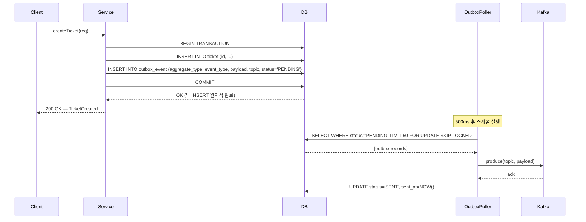

# Transactional Outbox 패턴

## 1. 개요

마이크로서비스가 DB에 상태를 저장하고 Kafka에 이벤트를 발행하는 두 작업은 서로 다른 리소스를 건드린다.
DB 트랜잭션과 Kafka produce는 하나의 원자적 단위로 묶을 수 없기 때문에, 순서대로 실행하면 둘 사이에서 실패가 발생할 때 일관성이 깨진다.

DB 커밋 후 Kafka produce를 직접 호출하는 방식은 두 가지 위험을 가진다.
첫째, DB는 커밋됐지만 Kafka produce가 네트워크 오류로 실패하면 이벤트가 영구 유실된다.
둘째, Kafka produce가 먼저 성공했지만 DB 커밋이 롤백되면 존재하지 않는 상태에 대한 이벤트가 발행된다.
어느 쪽이든 downstream consumer는 비즈니스 실제 상태와 다른 이벤트를 처리하게 된다.

Kafka produce를 트랜잭션 이전에 호출하는 방식도 마찬가지다. produce 성공 후 DB 커밋이 실패하면 이벤트는 이미 전송됐고 취소할 수 없다. Kafka는 메시지를 보낸 순간부터 consumer가 읽을 수 있는 구조이기 때문에 "발행 취소"가 불가능하다.

Transactional Outbox는 이 딜레마를 "Kafka 발행 자체를 DB 트랜잭션의 일부로 끌어들이는" 방식으로 해결한다.
이벤트를 Kafka에 직접 보내는 대신, 동일한 DB의 `outbox_event` 테이블에 이벤트 레코드를 삽입한다.
도메인 엔티티 저장과 outbox 레코드 삽입이 같은 `BEGIN...COMMIT` 안에서 일어나므로, 두 쓰기는 원자적으로 성공하거나 실패한다.
이후 별도 프로세스(Poller 또는 CDC 커넥터)가 `PENDING` 상태의 레코드를 읽어 Kafka에 전달하고 상태를 `SENT`로 갱신한다.

핵심 보장은 **at-least-once delivery**다. 폴러가 produce에 실패해도 outbox 레코드가 `PENDING`으로 남아 있어 재시도할 수 있다.
중복 발행 가능성은 존재하지만, 이벤트 유실보다 중복이 훨씬 다루기 쉽다. Consumer가 멱등성을 갖추면 중복은 무해하다.

---

## 2. 이 프로젝트에서의 적용

### outbox_event 테이블 구조

```sql
CREATE TABLE outbox_event (
    id              BIGSERIAL PRIMARY KEY,
    aggregate_type  VARCHAR(50)  NOT NULL,   -- 도메인 집합체 (TICKET, PIPELINE, AUDIT)
    aggregate_id    VARCHAR(100) NOT NULL,   -- 집합체 인스턴스 ID
    event_type      VARCHAR(100) NOT NULL,   -- 이벤트 타입 (TICKET_CREATED, AUDIT_CREATE 등)
    payload         BYTEA        NOT NULL,   -- Avro 직렬화 이벤트
    topic           VARCHAR(200) NOT NULL,   -- Kafka 토픽명
    status          VARCHAR(20)  NOT NULL DEFAULT 'PENDING',
    created_at      TIMESTAMP    NOT NULL DEFAULT NOW(),
    sent_at         TIMESTAMP,
    retry_count     INTEGER      NOT NULL DEFAULT 0,
    correlation_id  VARCHAR(100)             -- 분산 추적 ID (V6 마이그레이션 추가)
);

-- 부분 인덱스: PENDING 상태만 인덱싱하여 폴러 쿼리 최적화
CREATE INDEX idx_outbox_event_status ON outbox_event(status)
WHERE status = 'PENDING';
```

`status` 컬럼은 세 가지 값을 가진다.
- **PENDING**: 초기 상태. 폴러가 조회하여 Kafka로 발행을 시도한다.
- **SENT**: produce 성공 후 전환. 부분 인덱스 조건에서 제외되므로 폴러 조회에 잡히지 않는다.
- **DEAD**: `retry_count`가 MAX_RETRIES(5)를 초과하면 전환. 자동 재시도를 포기하고 운영자 수동 처리를 기다리는 상태다.

`sent_at` 컬럼은 운영 모니터링에서 "평균 발행 지연(`sent_at - created_at`)"을 계산하는 데 활용한다.

### DB 트랜잭션 내 outbox 삽입 — 직접 호출 vs 이벤트 리스너

outbox 테이블에 레코드를 삽입하는 방식은 크게 두 가지가 있다. 이 프로젝트는 **방식 A(직접 호출)**를 사용한다.

#### 방식 A: 직접 메서드 호출 (이 프로젝트)

서비스가 커스텀 `EventPublisher` 컴포넌트를 직접 의존하고, `publish()` 메서드를 호출한다.
여기서 `EventPublisher`는 Spring의 `ApplicationEventPublisher`와 전혀 다르다. 이름에 "publish"가 들어갈 뿐, **Spring 이벤트 버스를 사용하지 않는 단순 `@Component`**다. 내부적으로 `outboxMapper.insert()`를 호출해 DB에 직접 INSERT할 뿐이며, 이벤트 리스너가 수신하는 구조가 아니다.

```
호출 흐름 (Spring 이벤트 시스템 미사용):
TicketService.create()
  → eventPublisher.publish()      // 일반 메서드 호출
    → outboxMapper.insert()       // MyBatis INSERT — 같은 DB 트랜잭션 참여
```

```java
// EventPublisher: Spring 이벤트와 무관한 단순 @Component
@Component
@RequiredArgsConstructor
public class EventPublisher {
    private final OutboxMapper outboxMapper;

    public void publish(String aggregateType, String aggregateId,
                        String eventType, byte[] payload, String topic,
                        String correlationId) {
        OutboxEvent event = OutboxEvent.of(aggregateType, aggregateId,
                eventType, payload, topic, correlationId);
        outboxMapper.insert(event); // DB INSERT만 수행 — Kafka 호출 없음
    }
}

// TicketService: EventPublisher를 직접 주입받아 호출
@Service
@RequiredArgsConstructor
public class TicketService {
    private final TicketMapper ticketMapper;
    private final EventPublisher eventPublisher;  // 커스텀 컴포넌트 직접 의존

    @Transactional
    public TicketResponse create(TicketCreateRequest request) {
        ticketMapper.insert(ticket);
        // 같은 트랜잭션 안에서 outboxMapper.insert()가 실행됨
        eventPublisher.publish("TICKET", String.valueOf(ticket.getId()),
                "TICKET_CREATED", AvroSerializer.serialize(event),
                Topics.TICKET_EVENTS, correlationId);
        return TicketResponse.from(ticket, savedSources);
    }
}
```

`publish()`가 반환되는 시점에 Kafka 발행은 아직 일어나지 않았다. "이벤트를 반드시 발행하겠다는 약속"만 DB에 기록된 것이다. 서비스가 `EventPublisher`에 직접 결합되므로 outbox 삽입을 빼먹을 가능성이 낮지만, 도메인 로직과 outbox 인프라 코드가 한 메서드에 섞인다는 단점이 있다.

#### 방식 B: Spring 이벤트 + @TransactionalEventListener (대안)

서비스는 Spring의 `ApplicationEventPublisher`로 도메인 이벤트를 **이벤트 버스에 발행**하고, 별도 `@TransactionalEventListener`가 이벤트를 **수신**하여 outbox INSERT를 담당한다. 방식 A와 달리 서비스는 outbox의 존재 자체를 모른다.

```
호출 흐름 (Spring 이벤트 시스템 사용):
TicketService.create()
  → applicationEventPublisher.publishEvent()   // Spring 이벤트 버스에 발행
    → [Spring이 리스너 탐색]
      → OutboxEventListener.handle()           // @TransactionalEventListener가 수신
        → outboxMapper.insert()                // 같은 DB 트랜잭션 참여 (BEFORE_COMMIT)
```

```java
// 1. 범용 도메인 이벤트 정의 — 모든 도메인이 공유
public record OutboxDomainEvent(
    String aggregateType,   // "TICKET", "PIPELINE", "AUDIT" 등
    String aggregateId,
    String eventType,       // "TICKET_CREATED", "PIPELINE_STARTED" 등
    byte[] payload,
    String topic,
    String correlationId
) {}

// 2. 서비스 — 도메인 이벤트만 발행, outbox를 모른다
@Service
@RequiredArgsConstructor
public class TicketService {
    private final TicketMapper ticketMapper;
    private final ApplicationEventPublisher applicationEventPublisher;

    @Transactional
    public TicketResponse create(TicketCreateRequest request) {
        ticketMapper.insert(ticket);
        applicationEventPublisher.publishEvent(new OutboxDomainEvent(
                "TICKET", String.valueOf(ticket.getId()),
                "TICKET_CREATED", AvroSerializer.serialize(event),
                Topics.TICKET_EVENTS, correlationId));
        return TicketResponse.from(ticket, savedSources);
    }
}

// PipelineService도 동일한 OutboxDomainEvent 사용
@Service
@RequiredArgsConstructor
public class PipelineService {
    private final PipelineMapper pipelineMapper;
    private final ApplicationEventPublisher applicationEventPublisher;

    @Transactional
    public PipelineResponse start(PipelineStartRequest request) {
        pipelineMapper.insert(pipeline);
        applicationEventPublisher.publishEvent(new OutboxDomainEvent(
                "PIPELINE", String.valueOf(pipeline.getId()),
                "PIPELINE_STARTED", AvroSerializer.serialize(event),
                Topics.PIPELINE_EVENTS, correlationId));
        return PipelineResponse.from(pipeline);
    }
}

// 3. 리스너 — 하나의 리스너가 모든 도메인 이벤트를 수신하여 outbox INSERT
@Component
@RequiredArgsConstructor
public class OutboxEventListener {
    private final OutboxMapper outboxMapper;

    @TransactionalEventListener(phase = TransactionPhase.BEFORE_COMMIT)
    public void handle(OutboxDomainEvent e) {
        outboxMapper.insert(OutboxEvent.of(e.aggregateType(), e.aggregateId(),
                e.eventType(), e.payload(), e.topic(), e.correlationId()));
    }
}
```

리스너가 `OutboxDomainEvent` 하나만 수신하므로, 새 도메인(AUDIT, DEPLOYMENT 등)이 추가돼도 리스너를 수정할 필요 없이 서비스에서 `aggregateType`과 `eventType`만 달리 넘기면 된다.

`@TransactionalEventListener(phase = BEFORE_COMMIT)`은 트랜잭션이 커밋되기 직전에 실행되므로, 도메인 INSERT와 outbox INSERT가 같은 트랜잭션 안에서 원자적으로 처리된다. `AFTER_COMMIT`을 쓰면 트랜잭션 밖에서 실행되어 outbox INSERT가 실패해도 롤백되지 않으므로 반드시 `BEFORE_COMMIT`이어야 한다.

#### 두 방식 비교

| 구분 | 직접 호출 (방식 A) | 이벤트 리스너 (방식 B) |
|------|-------------------|----------------------|
| 결합도 | 서비스 → EventPublisher 직접 의존 | 서비스 → ApplicationEventPublisher (Spring 표준) |
| 도메인 순수성 | 서비스에 outbox 코드 혼재 | 서비스는 도메인 이벤트만 발행 |
| 디버깅 | 호출 스택이 직선적, 추적 쉬움 | 이벤트 발행-리스너 간접 호출, 추적에 한 단계 추가 |
| 이벤트 누락 위험 | `publish()` 호출을 빼먹으면 누락 | 리스너 등록을 빼먹으면 누락 |
| 확장성 | 새 이벤트마다 `publish()` 호출 추가 | 리스너 하나로 여러 이벤트 타입 처리 가능 |
| 적합한 규모 | 이벤트 타입이 적고 팀이 작을 때 | 도메인 이벤트가 많고 관심사 분리가 중요할 때 |

이 프로젝트가 방식 A를 선택한 이유는 학습 목적에서 outbox 삽입 흐름을 한눈에 따라갈 수 있는 단순함이 더 중요했기 때문이다. 프로덕션에서 도메인 이벤트가 늘어나면 방식 B로 전환하여 서비스에서 인프라 관심사를 분리하는 것이 권장된다.

### OutboxPoller 동작

`OutboxPoller`는 `@Scheduled(fixedDelay = 500)`으로 500ms마다 실행된다. 폴링 주기를 500ms로 설정한 이유는 학습 목적에서 지연을 체감할 수 있는 범위로 두었기 때문이며, 프로덕션에서는 50~100ms가 더 일반적이다.

폴러의 실행 흐름은 다음과 같다.

1. `SELECT * FROM outbox_event WHERE status = 'PENDING' ORDER BY created_at LIMIT 50 FOR UPDATE SKIP LOCKED`로 미발행 레코드를 배치로 조회한다. `LIMIT`을 두는 이유는 장애 후 재시작 시 밀린 레코드가 많을 때 폴러가 한 번에 모든 레코드를 메모리에 올리지 않도록 하기 위해서다. `FOR UPDATE SKIP LOCKED`는 다중 인스턴스 환경에서 같은 레코드를 두 폴러가 동시에 처리하는 중복 produce를 방지한다.
2. 각 레코드를 Kafka에 produce한다. `ProducerRecord`에 CloudEvents 필수 헤더 4개(`ce_specversion`, `ce_id`, `ce_source`, `ce_type`)와 레거시 호환용 `eventType`, 확장 속성 `correlationId`를 자동 추가한다. `KafkaTemplate.send().get(5, TimeUnit.SECONDS)`으로 동기 확인해 브로커 ack를 보장한다. 5초 타임아웃을 설정하는 이유는 무한 대기로 스케줄러 스레드가 블로킹되는 것을 방지하기 위함이다.
3. produce 성공 시 `markAsSent(id)` → `UPDATE status = 'SENT', sent_at = NOW()`를 실행한다.
4. produce 실패 시 `retry_count`를 증가시키고 다음 주기에 재시도한다. `retry_count`가 MAX_RETRIES(5)를 초과하면 `markAsDead(id)` → `status = 'DEAD'`로 전환하고 경고 로그를 남긴다. DEAD 상태의 레코드는 더 이상 자동 재시도되지 않으며 운영자가 원인을 확인하고 수동 처리해야 한다.

이 프로젝트에서 공통 헤더와 이벤트별 헤더는 책임이 분리돼 있다.

- **공통 헤더** (`ce_specversion`, `ce_id`, `ce_source`, `ce_time`, `trace-id`): `CloudEventsHeaderInterceptor`가 모든 메시지에 자동 부착. `KafkaProducerConfig`에서 `KafkaTemplate.setProducerInterceptor()`로 등록한다.
- **이벤트별 헤더** (`ce_type`, `eventType`, `correlationId`): `OutboxPoller`가 outbox 레코드 메타데이터를 기반으로 직접 설정한다.

인터셉터는 `addIfAbsent` 로직을 사용하므로, OutboxPoller가 먼저 설정한 헤더(예: `ce_type`)는 덮어쓰지 않는다.

```java
// 1. 공통 헤더 자동 부착 — ProducerInterceptor (common-kafka 모듈)
@Slf4j
@Component
public class CloudEventsHeaderInterceptor implements ProducerInterceptor<String, byte[]> {

    @Value("${spring.application.name:unknown}")
    private String serviceName;

    @Override
    public ProducerRecord<String, byte[]> onSend(ProducerRecord<String, byte[]> record) {
        Headers headers = record.headers();
        addIfAbsent(headers, "ce_specversion", "1.0");
        addIfAbsent(headers, "ce_id", UUID.randomUUID().toString());
        addIfAbsent(headers, "ce_source", "/" + serviceName);
        addIfAbsent(headers, "ce_time", Instant.now().toString());

        // 분산 추적: MDC에서 traceId 전파
        String traceId = MDC.get("traceId");
        if (traceId != null) {
            addIfAbsent(headers, "trace-id", traceId);
        }
        return record;
    }

    /** 이미 같은 키가 있으면 덮어쓰지 않는다. Producer가 명시 설정한 헤더가 우선. */
    private void addIfAbsent(Headers headers, String key, String value) {
        if (headers.lastHeader(key) == null) {
            headers.add(key, value.getBytes(StandardCharsets.UTF_8));
        }
    }
    // onAcknowledgement, close, configure 생략
}

// 2. KafkaTemplate에 인터셉터 등록
@Configuration
@EnableKafka
@EnableScheduling
@RequiredArgsConstructor
public class KafkaProducerConfig {

    private final CloudEventsHeaderInterceptor cloudEventsHeaderInterceptor;

    @Bean
    public KafkaTemplate<String, byte[]> kafkaTemplate(ProducerFactory<String, byte[]> producerFactory) {
        KafkaTemplate<String, byte[]> template = new KafkaTemplate<>(producerFactory);
        template.setProducerInterceptor(cloudEventsHeaderInterceptor);
        return template;
    }
}

// 3. OutboxPoller — 이벤트별 헤더만 설정, 공통 헤더는 인터셉터에 위임
@Slf4j
@Component
@RequiredArgsConstructor
public class OutboxPoller {

    private static final int MAX_RETRIES = 5;

    private final OutboxMapper outboxMapper;
    private final KafkaTemplate<String, byte[]> kafkaTemplate;

    @Scheduled(fixedDelay = 500)
    public void pollAndPublish() {
        List<OutboxEvent> events = outboxMapper.findPendingEvents(50);
        for (OutboxEvent event : events) {
            try {
                ProducerRecord<String, byte[]> record = new ProducerRecord<>(
                        event.getTopic(), null, event.getAggregateId(), event.getPayload());

                // 이벤트별 헤더만 설정 — 공통 헤더는 CloudEventsHeaderInterceptor가 자동 부착
                record.headers().add("ce_type",
                        event.getEventType().getBytes(StandardCharsets.UTF_8));
                record.headers().add("eventType",
                        event.getEventType().getBytes(StandardCharsets.UTF_8));
                if (event.getCorrelationId() != null) {
                    record.headers().add("correlationId",
                            event.getCorrelationId().getBytes(StandardCharsets.UTF_8));
                }

                kafkaTemplate.send(record).get(5, TimeUnit.SECONDS);  // 동기 ack 대기
                outboxMapper.markAsSent(event.getId());
            } catch (Exception e) {
                log.error("Failed to publish outbox event: id={}, type={}, retryCount={}",
                        event.getId(), event.getEventType(), event.getRetryCount(), e);
                if (event.getRetryCount() != null && event.getRetryCount() >= MAX_RETRIES) {
                    outboxMapper.markAsDead(event.getId());
                    log.warn("Outbox event exceeded max retries, marked as DEAD: id={}",
                            event.getId());
                } else {
                    outboxMapper.incrementRetryCount(event.getId());
                }
            }
        }
    }
}
```

---

## 3. 코드 흐름



`Service`와 `Poller`는 완전히 분리된 실행 흐름이다.
Client는 Kafka 발행 결과를 기다리지 않고 DB 커밋 직후 응답을 받는다.
Kafka가 일시적으로 다운돼 있어도 Client 요청은 성공하고, Kafka 복구 후 폴러가 밀린 레코드를 순서대로 처리한다.

---

## 4. 폴링 vs CDC 비교

두 방식 모두 outbox 테이블에 기록된 이벤트를 Kafka로 전달한다는 목적은 같다. 다른 점은 "어떻게 변경을 감지하는가"다.

**폴링(Polling)** 은 앱 안에서 주기적으로 `SELECT`를 실행한다. 추가 인프라 없이 스프링 스케줄러만으로 구현 가능하며, 디버깅과 운영이 단순하다. 단점은 폴링 주기만큼 고정 지연이 발생하고, 트래픽이 없는 시간대에도 주기적으로 DB 쿼리가 실행된다는 것이다.

**CDC(Change Data Capture)** 는 DB의 WAL(Write-Ahead Log)을 직접 스트리밍한다. Debezium 같은 커넥터가 WAL에서 `outbox_event` 테이블의 INSERT를 감지해 Kafka에 바로 전송하므로 지연이 수십 ms 이내다. `status` 컬럼을 `SENT`로 갱신할 필요도 없다. 대신 Kafka Connect + Debezium 클러스터를 별도로 운영해야 하고, DB의 WAL 보존 설정도 조정해야 한다.

| 구분 | 폴링 | CDC |
|------|------|-----|
| 구현 복잡도 | 낮음 (스케줄러 + SELECT) | 높음 (Debezium + Kafka Connect) |
| 지연 | 폴링 주기 고정 (이 프로젝트 500ms) | 거의 실시간 (수십 ms) |
| DB 부하 | 주기적 SELECT 부하 발생 | WAL 읽기 (SELECT 없음) |
| 운영 복잡도 | 앱 내 관리, 단순 | 외부 커넥터 운영 필요 |
| 다중 인스턴스 | SKIP LOCKED 필요 | 커넥터가 단일 진입점 |
| 적합한 규모 | 초당 수십 건 이하 | 초당 수백 건 이상 |

이 프로젝트는 패턴 학습 목적이므로 폴링 방식을 사용한다. 운영 부담 없이 핵심 개념을 빠르게 검증하기 좋기 때문이다.

---

## 5. 트레이드오프

**지연(Latency)**: 비즈니스 이벤트가 Kafka에 도달하는 최소 시간은 폴링 주기(500ms)에 produce 왕복 시간을 더한 값이다. 이 지연은 결정론적이다. 폴링 주기를 짧게 설정하면 지연은 줄지만 DB 쿼리 빈도가 올라간다. 실시간 요구사항이 강한 서비스에서는 폴링이 구조적 한계를 갖는다.

**DB 부하**: 폴러가 500ms마다 SELECT를 실행하므로 이벤트가 없는 시간에도 DB 부하가 지속된다. 부분 인덱스(`WHERE status = 'PENDING'`)가 PENDING 레코드만 인덱싱하므로 SENT/DEAD 레코드가 쌓여도 폴러 쿼리 성능에는 영향이 없다. 다만 테이블 자체가 커지는 것을 방지하기 위해 `OutboxMapper.deleteOlderThan()`으로 오래된 SENT 레코드를 주기적으로 정리해야 한다.

**중복 발행 가능성**: produce는 성공했지만 `markAsSent()`가 실패하면, 다음 폴링 주기에 같은 레코드를 다시 produce한다. Consumer는 반드시 멱등성을 갖춰야 한다. 이 프로젝트에서는 Consumer 쪽의 `ProcessedEvent` 테이블로 `(correlationId, eventType)` 복합 키 기반 중복 차단을 구현하고 있다.

**운영 단순성**: 폴링 방식의 진짜 장점은 별도 인프라 없이 앱 하나로 at-least-once 발행 보장을 구현할 수 있다는 점이다. CDC 인프라를 운영할 역량이나 필요성이 생기기 전까지는 폴링이 합리적이고 충분한 선택이다. 먼저 폴링으로 패턴을 이해하고, 트래픽이 늘면 CDC로 전환하는 점진적 접근이 권장된다.

---


