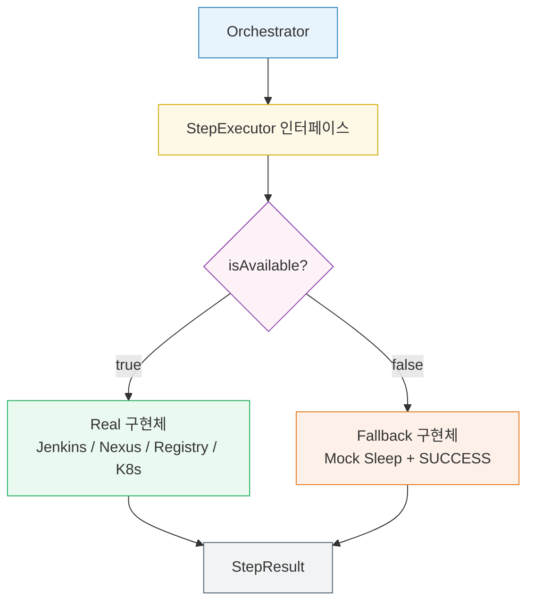

# Adapter 패턴: Real + Fallback Step Executor

## 1. 개요

배포 파이프라인은 Jenkins, Nexus, Container Registry, Kubernetes 같은 외부 인프라에 의존한다. 개발 초기나 데모 환경에서는 이 인프라가 모두 갖춰져 있지 않은 경우가 많다. 외부 의존성을 직접 호출하는 코드를 작성하면 인프라가 없을 때 전체 흐름을 테스트하거나 시연하기 어려워진다.

Adapter 패턴은 이 문제를 해결한다. 각 외부 시스템 호출을 `StepExecutor` 인터페이스 뒤에 숨기고, 인프라 가용성에 따라 Real 구현체와 Fallback(Mock) 구현체를 교체한다. 오케스트레이터는 인프라 존재 여부를 알 필요 없이 동일한 인터페이스로 각 단계를 실행한다.



---

## 2. 이 프로젝트에서의 적용

### StepExecutor 인터페이스

모든 단계 구현체가 따르는 계약이다. `execute` 메서드 하나와 가용성 확인 메서드 하나로 이루어진다.

```java
public interface StepExecutor {
    StepResult execute(DeployStep step);
    boolean isAvailable();
}
```

`isAvailable()`은 외부 시스템에 경량 헬스체크(HTTP ping, 커넥션 테스트 등)를 수행한다. 실패하면 오케스트레이터가 Fallback으로 전환한다.

### Real 구현체

| 구현체 | 대상 시스템 | 주요 동작 |
|--------|------------|-----------|
| `JenkinsCloneAndBuildStep` | Jenkins | Job 트리거 → 빌드 완료 폴링 |
| `NexusDownloadStep` | Nexus Repository | 아티팩트 다운로드 URL 생성 및 검증 |
| `RegistryImagePullStep` | Container Registry | 이미지 존재 확인 및 Pull 명령 전송 |
| `RealDeployStep` | Kubernetes / 배포 대상 | 매니페스트 적용 후 롤아웃 상태 확인 |

각 Real 구현체는 `isAvailable()` 내부에서 외부 시스템 연결 가능 여부를 확인한다. 예를 들어 `JenkinsCloneAndBuildStep`은 Jenkins REST API `/api/json`으로 헬스 요청을 보내고, 응답이 없으면 `false`를 반환한다.

### Fallback 구현체

Real 구현체가 `isAvailable() = false`를 반환하면 대응하는 Fallback이 실행된다. Fallback은 실제 작업을 수행하지 않고, 의도적인 지연(sleep) 후 성공을 반환하여 전체 흐름이 끊기지 않게 한다.

```java
public class FallbackJenkinsStep implements StepExecutor {

    @Override
    public boolean isAvailable() {
        return true; // Fallback은 항상 가용
    }

    @Override
    public StepResult execute(DeployStep step) {
        log.info("[FALLBACK] Jenkins 미연결 — Mock 빌드 시뮬레이션");
        sleep(2_000); // 빌드 시간 시뮬레이션
        return StepResult.success("mock-artifact-1.0.0.jar");
    }
}
```

### 오케스트레이터에서의 선택 로직

```java
StepExecutor executor = real.isAvailable() ? real : fallback;
StepResult result = executor.execute(step);
```

선택 로직은 오케스트레이터 한 곳에만 존재한다. 각 단계 구현체는 자신이 Real인지 Fallback인지 알 필요가 없다.

---

## 3. 왜 이 패턴인가

**인프라 없이도 전체 흐름 시연이 가능하다.** Jenkins나 Nexus가 없는 환경에서도 Fallback이 각 단계를 통과시키므로, 이벤트 발행→SAGA 오케스트레이션→상태 추적 전 흐름을 데모할 수 있다. 발표나 개발 초기 단계에서 유용하다.

**점진적 통합이 자연스럽다.** Jenkins를 먼저 연결하면 `JenkinsCloneAndBuildStep`이 Real로 동작하고, Nexus는 아직 Fallback으로 남아 있어도 된다. 단계별로 실제 시스템을 붙여가면서 전체 파이프라인을 완성할 수 있다.

**오케스트레이터와 인프라가 분리된다.** SAGA 오케스트레이터는 각 외부 시스템의 API 세부 사항을 모른다. 외부 시스템이 바뀌어도 해당 `StepExecutor` 구현체만 교체하면 오케스트레이터 코드는 변경하지 않아도 된다.

---

## 4. [FAIL] 마커 처리

`[FAIL]` 마커는 파이프라인 메시지 본문에 포함된 의도적 실패 신호다. 이 마커 처리도 `StepExecutor` 계층에서 담당한다. Real과 Fallback 모두 `execute()` 진입 시점에 마커를 확인하고, 마커가 있으면 실제 외부 호출 없이 즉시 `StepResult.failure()`를 반환한다.

```java
@Override
public StepResult execute(DeployStep step) {
    if (step.getPayload().contains("[FAIL]")) {
        log.warn("[FAIL 마커 감지] 단계 강제 실패 처리: {}", step.getName());
        return StepResult.failure("FAIL marker detected");
    }
    // 이후 실제 실행 또는 Mock 실행
}
```

이 방식은 SAGA 보상 트랜잭션 흐름을 인프라 없이도 테스트할 수 있게 한다. 특정 단계 메시지에 `[FAIL]`을 포함하면 그 단계부터 보상 이벤트가 역순으로 발행되는 전체 롤백 시나리오를 재현할 수 있다.

---

## 5. 보안 및 설정

### SSRF 방지 — AdapterInputValidator

모든 Real 어댑터(Jenkins, Nexus, Registry, GitLab)는 외부 입력을 URL 경로에 포함하기 전에 `AdapterInputValidator`로 검증한다. 두 가지 검증을 수행한다.

- `validatePathParam(value, paramName)`: 화이트리스트 정규식(`^[a-zA-Z0-9_./-]+$`)으로 허용 문자만 통과시키고, `../` 같은 경로 순회를 차단한다.
- `validateBaseUrl(url)`: 다운로드 URL이 허용된 호스트에서 온 것인지 확인한다.

URL 조립에는 문자열 연결 대신 `UriComponentsBuilder.pathSegment()`를 사용해 자동 인코딩을 보장한다.

### @Profile("mock") — Fallback 분리

Mock 스텝 구현체(`MockCloneStep`, `MockBuildStep` 등)에 `@Profile("mock")`을 추가해 프로덕션 환경에서 Mock 빈이 로드되지 않도록 했다. 개발/데모 환경에서만 `spring.profiles.active=mock`을 설정해 Fallback을 활성화한다.

### RestTemplate 타임아웃

모든 어댑터가 사용하는 `RestTemplate`에 connectTimeout(3초)과 readTimeout(10초)을 설정했다. 외부 시스템 장애 시 스레드가 무한 대기하는 것을 방지한다.

---

## 관련 패턴

- `03-transactional-outbox.md` — 단계 결과를 Outbox를 통해 발행하는 방법
- `01-async-accepted.md` — 오케스트레이터가 비동기 수락 응답을 처리하는 방법

---


