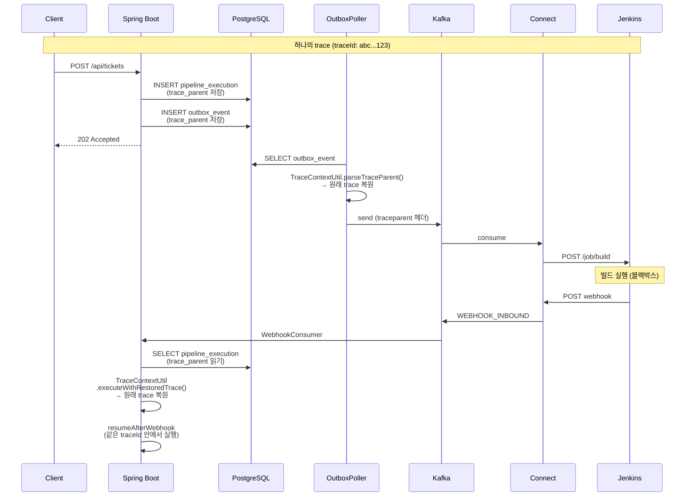

# E2E TraceId 전파 (Pipeline 전체 흐름)

## 1. 문제 — 어디서 trace가 끊겼는가

티켓 생성(POST) → OutboxPoller → Redpanda Connect → Jenkins → webhook resume까지의 전체 흐름이 하나의 traceId로 묶여야 한다. Outbox 패턴의 스레드 경계 문제는 이미 해결했지만([03-otel-instrumentation.md §4-0](../../infra/01-monitoring/03-otel-instrumentation.md)), 두 곳에서 여전히 trace context가 소실되고 있었다.

**끊어지는 지점 1: CompletableFuture.runAsync**

`PipelineEventConsumer`가 Kafka 메시지를 수신한 뒤 `CompletableFuture.runAsync()`로 파이프라인을 실행한다. 이때 사용하는 `Executors.newFixedThreadPool(4)`는 plain Executor라서 OTel의 스레드 로컬 context가 전파되지 않는다. Kafka Consumer 스레드에 존재하던 traceId가 파이프라인 실행 스레드로 넘어가지 못한다.

**끊어지는 지점 2: Jenkins webhook 수신 후 resume**

Jenkins는 OTel을 지원하지 않으므로 webhook 콜백에 traceparent를 포함하지 않는다. `resumeAfterWebhook()`이 새 HTTP 요청 스레드에서 호출되면 원래 파이프라인의 traceId와 무관한 새 trace가 시작된다. `WebhookTimeoutChecker`의 timeout 처리도 동일한 문제를 가진다.

비즈니스 연결(executionId)은 정상이었다. Jenkins param → webhook payload → resumeAfterWebhook으로 파이프라인 로직 자체는 문제없이 동작한다. 끊어지는 것은 오직 OTel traceId(관측성)뿐이었다.

---

## 2. 해결 전략 — Parent Restore (단일 연속 trace)

### 2-1. 왜 Parent Restore인가

OTel에서 비동기 경로의 trace 연결은 두 가지 방식이 있다.

| 방식 | 장점 | 단점 | 적합 시나리오 |
|------|------|------|-------------|
| **Parent Restore** | Tempo에서 하나의 타임라인으로 시각화, E2E SLO 측정 가능 | 장시간 trace는 Tempo `trace_idle_period`(기본 10s) 초과 시 블록 경계 문제 발생 가능 | PoC/학습, 빌드 수 분 이내 |
| **Span Link** | trace 분리로 Tempo 저장 안정적, 독립 SLO 측정 가능 | 두 trace 간 탐색이 번거로움, 하나의 타임라인으로 보기 어려움 | 프로덕션, 빌드 15분 이상 |

이 프로젝트는 PoC/학습 환경이고 Jenkins 빌드가 수 분 이내이므로 Parent Restore가 적합하다. DB에 traceparent를 저장하고, 비동기 경로에서 복원하여 원래 trace에 연결한다. Debezium Outbox의 `tracingspancontext` 컬럼 패턴과 Dapr의 payload 내장 traceparent 패턴을 참고했다.

### 2-2. 전체 흐름 (수정 후)



---

## 3. 구현 상세

### 3-1. Fix 1: Context.taskWrapping (PipelineEventConsumer)

`Context.taskWrapping()`은 OTel이 제공하는 Executor 래퍼다. `Runnable`이 submit될 때 현재 스레드의 OTel Context를 캡처하고, 실행 스레드에서 자동으로 복원한다.

```java
// Before — plain Executor, context 소실
private static final Executor PIPELINE_EXECUTOR = Executors.newFixedThreadPool(4, ...);

// After — OTel context 자동 전파
private static final Executor PIPELINE_EXECUTOR = Context.taskWrapping(
        Executors.newFixedThreadPool(4, ...)
);
```

`Context.taskWrapping()`은 데코레이터 패턴이다. 내부적으로 `Runnable`을 `Context.current().wrap(runnable)`로 감싸서 submit한다. Executor의 ThreadFactory나 기존 동작은 그대로 유지된다.

### 3-2. Fix 2: TraceContextUtil (공통 유틸)

기존에 `EventPublisher.captureTraceParent()`와 `OutboxPoller.parseTraceParent()`가 각각 private 메서드로 존재했다. 파이프라인 생성, OutboxPoller, resumeAfterWebhook, WebhookTimeoutChecker 4곳에서 동일한 로직이 필요하므로 `common.tracing.TraceContextUtil`로 추출했다.

```java
public final class TraceContextUtil {
    /** 현재 span의 trace context를 W3C traceparent 형식으로 캡처 */
    public static String captureTraceParent() { ... }

    /** W3C traceparent 문자열을 SpanContext로 파싱 */
    public static SpanContext parseTraceParent(String traceParent) { ... }

    /** 저장된 traceParent로 context를 복원하고 새 span 안에서 action을 실행 */
    public static void executeWithRestoredTrace(
            String traceParent, String spanName,
            Map<String, String> attributes, Runnable action) { ... }
}
```

`executeWithRestoredTrace()`는 3단계로 동작한다.

1. `parseTraceParent()`로 SpanContext 복원. null이면 새 trace로 실행(graceful degradation).
2. `spanBuilder().setParent(Context.current().with(Span.wrap(parentContext)))` — 복원된 context를 parent로 새 span 생성.
3. `span.makeCurrent()` + action 실행 — 스레드 로컬에 설정하여 action 내부의 OTel 자동 계측도 같은 trace에 연결.

### 3-3. Fix 3: pipeline_execution에 trace_parent 저장

Outbox 테이블에는 이미 `trace_parent` 컬럼이 있었다. 그런데 Outbox의 traceparent는 Kafka 발행까지만 유효하다. Jenkins webhook 수신 후 resume 시점에는 Outbox 이벤트가 이미 SENT 처리되어 있으므로 traceparent를 꺼낼 수 없다.

해결책은 `pipeline_execution` 테이블에도 `trace_parent`를 저장하는 것이다. 파이프라인 생성 시점(HTTP 요청 스레드)에서 캡처하고, resume/timeout 시점에서 DB 조회로 복원한다.

```sql
-- V16__add_trace_parent_to_pipeline_execution.sql
ALTER TABLE pipeline_execution ADD COLUMN trace_parent VARCHAR(55);
```

```java
// PipelineService.java — 파이프라인 생성 시 캡처
execution.setTraceParent(TraceContextUtil.captureTraceParent());
executionMapper.insert(execution);
```

### 3-4. Fix 4: resumeAfterWebhook에서 trace 복원

`PipelineEngine.resumeAfterWebhook()`에서 DB에서 execution을 조회한 뒤, 저장된 `traceParent`로 원래 trace를 복원하고 그 안에서 파이프라인 로직을 실행한다.

```java
public void resumeAfterWebhook(UUID executionId, int stepOrder,
                                String result, String buildLog) {
    var execution = executionMapper.findById(executionId);
    // ... validation ...

    TraceContextUtil.executeWithRestoredTrace(
            execution.getTraceParent()
            , "PipelineEngine.resumeAfterWebhook"
            , Map.of("pipeline.execution.id", executionId.toString()
                    , "pipeline.step.order", String.valueOf(stepOrder))
            , () -> doResumeAfterWebhook(execution, step, ...)
    );
}
```

### 3-5. Fix 5: WebhookTimeoutChecker에서도 trace 복원

webhook이 도착하지 않아 timeout 처리할 때도 같은 패턴으로 원래 trace에 연결한다. 정상 경로(webhook 도착)와 실패 경로(timeout) 모두 동일한 trace에 속하게 된다.

---

## 4. 수정 파일 요약

| # | 파일 | 변경 |
|---|------|------|
| 1 | `PipelineEventConsumer.java` | `Context.taskWrapping()` 래핑 |
| 2 | `TraceContextUtil.java` (신규) | captureTraceParent, parseTraceParent, executeWithRestoredTrace |
| 3 | `OutboxPoller.java` | 기존 parseTraceParent 제거 → TraceContextUtil 사용 |
| 4 | `EventPublisher.java` | 기존 captureTraceParent 제거 → TraceContextUtil 사용 |
| 5 | `V16__add_trace_parent_to_pipeline_execution.sql` (신규) | trace_parent 컬럼 추가 |
| 6 | `PipelineExecution.java` | traceParent 필드 추가 |
| 7 | `PipelineExecutionMapper.xml` | INSERT/SELECT에 trace_parent 반영 |
| 8 | `PipelineService.java` | execution 생성 시 traceParent 캡처 |
| 9 | `PipelineEngine.java` | resumeAfterWebhook에서 trace 복원 |
| 10 | `WebhookTimeoutChecker.java` | timeout 처리 시 trace 복원 |
| 11 | `build.gradle` | `-Dotel.service.name=redpanda-playground` 추가 (unknown_service 해결) |

---

## 5. 검증 결과 (2026-03-17)

### 5-1. Tempo 검증 — traceId: `bb82a6b6b9fa0493f1d2362febba80b8`

Grafana Tempo(`http://34.22.78.240:23000`) → Explore → TraceQL → traceId 입력으로 확인.

```
redpanda-playground: POST /api/tickets/{ticketId}/pipeline/start
├── DB spans (SELECT ticket, INSERT pipeline_execution, INSERT outbox_event...)
├── OutboxPoller.publish (PIPELINE_EXECUTION_STARTED)          ← Outbox → Kafka + traceparent 헤더
├── playground.pipeline.commands.execution process             ← ✅ Kafka consumer도 같은 trace!
│   ├── DB spans (PipelineEngine 실행)
│   ├── OutboxPoller.publish (STEP_CHANGED)
│   ├── OutboxPoller.publish (JENKINS_BUILD_COMMAND)           ← Connect로 전달
│   └── OutboxPoller.publish (STEP_CHANGED)
├── playground.pipeline.events.step-changed process            ← ✅ 이벤트 consumer도 연결
├── PipelineEngine.resumeAfterWebhook                          ← ✅ webhook resume trace 복원
│   ├── DB spans (UPDATE step, INSERT outbox...)
│   ├── OutboxPoller.publish (STEP_CHANGED)
│   └── OutboxPoller.publish (EXECUTION_COMPLETED)
├── playground.pipeline.events.completed process               ← ✅ 완료 이벤트도 연결
└── GET (health check 등)
```

모든 스팬이 `redpanda-playground` 서비스명으로 통일됨. `unknown_service:java` 해결.

### 5-2. DB 검증

```sql
-- pipeline_execution.trace_parent 저장 확인
SELECT id, trace_parent FROM pipeline_execution WHERE id = 'cf409c90-...';
-- 결과: 00-bb82a6b6b9fa0493f1d2362febba80b8-5c0e46830a682857-01

-- outbox_event traceId 일관성 확인
SELECT id, event_type, substring(trace_parent from 4 for 32) as trace_id
FROM outbox_event WHERE id > 436 ORDER BY id;
```

| outbox id | event_type | traceId | 분석 |
|-----------|------------|---------|------|
| 439 | PIPELINE_EXECUTION_STARTED | `bb82a6b6...` | POST trace ✅ |
| 440 | PIPELINE_STEP_CHANGED | `bb82a6b6...` | PipelineEngine ✅ (traceparent 헤더로 연결) |
| 441 | JENKINS_BUILD_COMMAND | `bb82a6b6...` | Jenkins 빌드 명령 ✅ |
| 442-443 | STEP_CHANGED | `bb82a6b6...` | 스텝 상태 변경 ✅ |
| 444 | PIPELINE_EXECUTION_COMPLETED | `bb82a6b6...` | 완료 ✅ |

**모든 outbox 이벤트가 동일한 traceId** — traceparent 헤더 수동 삽입으로 Kafka 경계도 연결됨.

### 5-3. 검증 방법 (재현)

```bash
# 1. 앱 시작
SPRING_PROFILES_ACTIVE=gcp \
OTEL_EXPORTER_OTLP_ENDPOINT=http://34.22.78.240:4318 \
OTEL_EXPORTER_OTLP_PROTOCOL=http/protobuf \
./gradlew :app:bootRun

# 2. 티켓 생성 + 파이프라인 시작
curl -s -X POST 'http://localhost:8080/api/tickets' \
  -H 'Content-Type: application/json' \
  -d '{"name":"test","sources":[{"sourceType":"GIT","repoUrl":"https://github.com/test/repo","branch":"main"}]}'
curl -s -X POST 'http://localhost:8080/api/tickets/{id}/pipeline/start'

# 3. DB에서 traceId 확인
psql -c "SELECT id, substring(trace_parent from 4 for 32) FROM pipeline_execution ORDER BY created_at DESC LIMIT 1;"

# 4. Grafana Tempo에서 확인
# http://34.22.78.240:23000 → Explore → TraceQL → traceId 입력
```

---

## 6. 알려진 한계와 후속 작업

### 6-1. Connect 스팬 — kafka_franz → legacy kafka input 전환으로 해결

**문제**: Benthos `kafka_franz` input(v4.43.0~v4.83.0 최신)에는 `extract_tracing_map` 기능이 미구현이다. [PR #2836](https://github.com/redpanda-data/connect/pull/2836)이 2024년 9월에 올라왔으나 1년 넘게 머지되지 않았다. v4.68.0(2025-10)에서 `kafka_franz`가 deprecated되고 새 `redpanda` input으로 통합됐으나, `redpanda` input도 trace extraction을 지원하지 않는다.

**해결**: `jenkins-command.yaml`의 input을 legacy `kafka`(sarama 기반)로 전환했다. `kafka` input은 `extract_tracing_map: root = @`를 지원하여, Kafka 메시지 헤더의 `traceparent`를 읽어 Connect 스팬을 같은 trace의 자식으로 생성한다.

```yaml
# jenkins-command.yaml — 핵심 변경
input:
  kafka:                              # kafka_franz → kafka 전환
    addresses:
      - redpanda:9092
    topics:
      - playground.pipeline.commands.jenkins
    consumer_group: connect-jenkins-command-v7
    start_from_oldest: true
    extract_tracing_map: root = @     # Kafka 헤더에서 traceparent 추출 → parent span 연결
```

추가로 로그에 traceparent 기록, Jenkins HTTP 호출에도 traceparent 헤더를 전달한다.

**검증 결과 (traceId: `b63a663033bc22503e8085aaeb8f8307`):**

Tempo에서 하나의 trace에 두 서비스 스팬이 모두 포함됨:
```
Services: {'redpanda-playground', 'redpanda-connect'}

redpanda-playground: POST /api/tickets/{ticketId}/pipeline/start
├── DB spans, OutboxPoller.publish, Kafka consumer spans...
├── PipelineEngine.resumeAfterWebhook + DB spans...
redpanda-connect: input_kafka          ← Connect Kafka 소비
├── redpanda-connect: mapping          ← Bloblang 처리
├── redpanda-connect: log              ← Jenkins API 호출 로그
├── redpanda-connect: branch           ← HTTP 분기
├── redpanda-connect: http             ← Jenkins HTTP POST
├── redpanda-connect: http_request     ← HTTP 요청
├── redpanda-connect: switch           ← 결과 분기
└── redpanda-connect: mapping          ← 결과 처리
```

**deprecated 리스크**: `kafka` input은 v4.68.0에서 deprecated됐지만 제거 일정은 없다. v4.83.0(최신)에서도 동작한다. PR #2836 머지 또는 `redpanda` input에 tracing 추가 시 전환하면 된다.

### 6-2. 앱이 로컬에서만 실행되는 경우 (Tempo에 앱 trace 미수집)

앱이 로컬에서 실행 중이고 OTel exporter가 GCP Alloy를 가리키지 않으면, **앱의 스팬은 Tempo에 적재되지 않는다**. 하지만 Connect는 GCP Docker Compose에서 항상 실행 중이고, 자체 tracer(`open_telemetry_collector → alloy:4318`)로 독립 export하기 때문에 **Connect 스팬만 Tempo에 별도 trace로 적재된다**.

이 상태에서 Tempo를 보면:
- `redpanda-connect: input_kafka_franz` — Connect가 Kafka에서 메시지를 소비한 trace
- `redpanda-connect: input_http_server_post` — Jenkins가 webhook을 Connect에 보낸 trace

이 두 trace에는 Spring Boot 앱의 스팬이 없다(앱이 export하지 않으므로). 비즈니스 흐름을 추적하려면 Loki에서 `executionId`로 검색하는 것이 유일한 방법이다.

```
# Loki — executionId로 Connect 로그와 앱 로그를 함께 조회
{service_name=~"redpanda-playground|redpanda-connect"} |= "executionId=<UUID>"
```

반대로 앱이 GCP Alloy로 export하면, 앱 trace에 OutboxPoller → Kafka consumer → PipelineEngine → webhook resume까지 모든 스팬이 포함되어 Connect 없이도 파이프라인 흐름을 추적할 수 있다.

### 6-3. 프로덕션 전환 시 Parent Restore → Span Link

빌드 시간이 15분 이상으로 늘어나면 Tempo의 `trace_idle_period`(기본 10s)와 블록 경계 문제로 trace가 불안정해질 수 있다. 이 경우 Parent Restore 대신 Span Link 방식으로 전환하는 것을 권장한다.

```java
// Span Link 방식 (프로덕션 대안)
SpanContext parentContext = TraceContextUtil.parseTraceParent(traceParent);
Span span = tracer.spanBuilder("PipelineEngine.resumeAfterWebhook")
        .addLink(parentContext)  // parent가 아닌 link로 연결
        .startSpan();
```

Span Link를 사용하면 webhook resume가 독립된 trace로 생성되되, 원래 trace에 대한 참조(link)를 가진다. Tempo에서 link를 클릭하여 원래 trace로 이동할 수 있다.
