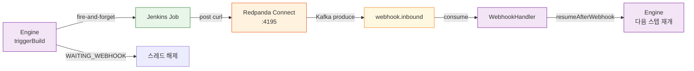

# Redpanda Playground 데모 시나리오

Redpanda Playground를 백엔드 팀에게 설명하기 위한 순차적 데모 스크립트입니다. 각 단계마다 **왜 이렇게 구현했는지**를 설명하고, 코드와 실행 결과를 함께 보여줍니다.

## 준비 단계

### 1. 인프라 시작 (5분)

```bash
# 터미널 1: Core 인프라 (Redpanda, PostgreSQL, Schema Registry)
cd docker
docker compose up -d

# 터미널 1: Full 인프라 (+ Jenkins, GitLab, Nexus, Registry, Connect)
docker compose -f docker-compose.infra.yml up -d

# 확인
docker ps | grep redpanda
docker ps | grep postgres
docker ps | grep jenkins
docker ps | grep connect
```

**확인 항목:**
- Redpanda: localhost:29092 접속 가능
- PostgreSQL: localhost:25432 접속 가능
- Schema Registry: localhost:28081/ui
- Redpanda Connect: localhost:4195 (Jenkins webhook 수신: /webhook/jenkins)
- Jenkins: localhost:29080 (데모 7에 필요)

> **네트워크**: 모든 컨테이너는 `playground-net` 공유 네트워크에서 통신합니다.

### 2. Spring Boot 실행 (3분)

```bash
# 터미널 2: 백엔드
./gradlew clean build
./gradlew bootRun

# 로그에서 확인
# Started PlaygroundApplication in X seconds
# Embedded Server started on port(s): 8080
```

**확인 항목:**
- 서버 로그에 "Started" 메시지
- http://localhost:8080/actuator/health 응답 `UP`

### 3. React 개발 서버 실행 (2분)

```bash
# 터미널 3: 프론트엔드
cd frontend
npm install
npm run dev

# 로그에서 확인
# Local: http://localhost:5173
```

**확인 항목:**
- 브라우저에서 http://localhost:5173 접속 가능
- UI가 정상 렌더링됨

---

## 데모 1: 티켓 생성 및 목록 확인 (3분)

**목표:** Event Sourcing으로 티켓이 Kafka에 발행되는 과정 보여주기

### 시연 내용

1. **React UI에서 티켓 생성**
   - 화면: http://localhost:5173/tickets
   - "새 티켓" 버튼 클릭
   - 입력:
     ```
     이름: Production Deploy v2.0
     설명: Deploy to AWS prod
     소스: GIT + NEXUS 선택
     ```
   - "생성" 버튼 클릭

2. **API 요청 확인**
   ```bash
   curl -X POST http://localhost:8080/api/tickets \
     -H "Content-Type: application/json" \
     -d '{
       "name": "Production Deploy v2.0",
       "description": "Deploy to AWS prod",
       "sources": [
         {"type": "GIT", "url": "https://github.com/org/repo"},
         {"type": "NEXUS", "artifactId": "app-2.0.war"}
       ]
     }'
   ```

3. **응답 확인**
   ```json
   {
     "id": 1,
     "name": "Production Deploy v2.0",
     "status": "DRAFT",
     "createdAt": "2024-01-09T12:00:00Z"
   }
   ```

4. **목록에서 확인**
   - 화면 새로고침
   - 생성된 티켓이 목록에 표시됨

### 핵심 설명 포인트

- **왜 즉시 응답인가?** 티켓 생성은 동기이지만, 파이프라인 생성은 비동기입니다. ticket 도메인과 pipeline 도메인이 완전히 분리되어 있기 때문입니다.
- **어디에 데이터가 저장되는가?** PostgreSQL에 ticket 레코드와 outbox 레코드가 동일 트랜잭션으로 저장됩니다. 이것이 메시지 손실을 방지합니다.
- **Kafka는 언제 관여하는가?** OutboxPoller가 500ms마다 미발행 메시지를 찾아서 Kafka로 발행합니다.

---

## 데모 2: 파이프라인 시작 및 SSE 실시간 추적 (5분)

**목표:** 202 Accepted 비동기 응답과 SSE 스트리밍으로 실시간 상태 추적 보여주기

### 시연 내용

1. **파이프라인 시작 버튼 클릭**
   - UI: 티켓 상세 화면 → "파이프라인 시작" 버튼
   - 버튼 클릭 후 즉시 "202 Accepted" 응답 받음 (로그 확인)

2. **실시간 진행 상황 추적**
   - UI: PipelineTimeline 컴포넌트가 자동으로 갱신됨
   - 단계별 진행 상황:
     ```
     BUILD    [████████░░] 45초
     PUSH     [██████░░░░] 30초
     DEPLOY   [████░░░░░░] 60초
     HEALTH   [░░░░░░░░░░] 대기 중
     ```

3. **HTTP 요청 확인**
   ```bash
   curl -i -X POST http://localhost:8080/api/tickets/1/pipeline/start

   # 응답
   HTTP/1.1 202 Accepted
   Location: /api/tickets/1/pipeline
   ```

4. **SSE 스트림 확인 (브라우저 DevTools)**
   - Network 탭 → /api/tickets/1/pipeline/events
   - Type: EventStream
   - 메시지 예:
     ```
     data: {"stepId":1,"name":"BUILD","status":"RUNNING"}
     data: {"stepId":1,"name":"BUILD","status":"COMPLETED","duration":45000}
     data: {"stepId":2,"name":"PUSH","status":"RUNNING"}
     ...
     ```

### 핵심 설명 포인트

- **왜 202 Accepted인가?** 파이프라인은 오래 걸립니다. 즉시 응답해야 사용자 경험이 좋습니다.
- **SSE는 왜 WebSocket이 아닌가?** 단방향 통신(서버 → 클라이언트)이므로 HTTP와 호환되는 SSE가 더 간단합니다. 프록시/로드밸런서 설정도 쉽습니다.
- **멱등성은 어디서 보장되는가?** correlationId + eventType으로 Consumer가 중복 메시지를 감지합니다.

---

## 데모 3: Redpanda Console에서 메시지 확인 (3분)

**목표:** Kafka 토픽에 실제로 Avro 메시지가 저장되는 모습 보여주기

### 시연 내용

1. **Redpanda Console 접속**
   - URL: http://localhost:28080
   - 좌측 메뉴: "Topics"

2. **playground.ticket 토픽 확인**
   - 토픽명 클릭
   - "Messages" 탭
   - Avro 형식의 TicketCreatedEvent 메시지 확인:
     ```json
     {
       "ticketId": 1,
       "name": "Production Deploy v2.0",
       "description": "Deploy to AWS prod",
       "sources": [
         {"type": "GIT", "url": "..."}
       ],
       "correlationId": "uuid-xxx",
       "timestamp": 1704067200000
     }
     ```

3. **playground.pipeline 토픽 확인**
   - PipelineStartedEvent, PipelineStepStartedEvent, PipelineStepCompletedEvent 확인
   - 각 메시지의 순서와 타임스탬프 확인

4. **Schema Registry 확인**
   - URL: http://localhost:28081/ui
   - Subject 목록에서 Avro 스키마 확인
   - 호환성 모드, 버전 확인

### 핵심 설명 포인트

- **왜 Avro인가?** JSON보다 더 컴팩트하고, 스키마 버전 관리가 자동입니다.
- **파티션은 몇 개인가?** 3개입니다. 병렬 처리를 위해서입니다.
- **보관 기간은?** 7일입니다. 컨슈머 지연 복구와 감사 추적을 위해 충분합니다.

---

## 데모 4: Springwolf AsyncAPI 명세서 (2분)

**목표:** 이벤트 기반 API 명세를 자동으로 생성하는 모습 보여주기

### 시연 내용

1. **AsyncAPI UI 접속**
   - URL: http://localhost:8080/springwolf/asyncapi-ui.html

2. **발행 채널 (Publish)**
   - playground.ticket
   - playground.pipeline
   - playground.webhook.inbound
   - playground.audit

3. **구독 채널 (Subscribe)**
   - Kafka 토픽 목록 자동 생성
   - 각 채널의 Avro 스키마 표시

4. **메시지 정의**
   - TicketCreatedEvent 스키마 확인
   - 필드별 타입, 필수 여부 확인

### 핵심 설명 포인트

- **왜 자동 생성인가?** 마이크로서비스는 이벤트 계약이 중요합니다. 코드와 명세를 일치시키기 위해 자동 생성을 사용합니다.
- **팀 커뮤니케이션:** 다른 팀이 어떤 이벤트를 구독할 수 있는지 한눈에 볼 수 있습니다.

---

## 데모 5: SAGA 보상 트랜잭션 및 실패 시뮬레이션 (5분)

**목표:** 파이프라인 스텝 실패 시 SAGA 보상 트랜잭션으로 완료된 스텝을 롤백하는 과정 보여주기

### 시연 내용

1. **실패 시뮬레이션 버튼 클릭**
   - UI: 티켓 상세 화면 → "실패 시뮬레이션" 버튼 (주황색, bug_report 아이콘)
   - 랜덤 스텝에 `[FAIL]` 마커가 주입됨 (첫 번째 스텝 제외 — 보상 대상 확보)
   - API:
     ```bash
     curl -X POST http://localhost:8080/api/tickets/{id}/pipeline/start-with-failure
     ```

2. **실패 과정 관찰**
   - UI에서 스텝 진행: Clone → Build → Deploy 순서
   - `[FAIL]` 마커가 달린 스텝 도달 시 의도적 실패 발생
   - Spring Boot 로그:
     ```
     [FAIL SIMULATION] Pipeline started with failure injection: executionId=xxx, failStep=Deploy to Server [FAIL]
     [Real] FAIL 마커 감지 - 의도적 실패 발생
     Step failed: Deploy to Server [FAIL]
     ```

3. **SAGA 보상 트랜잭션 확인**
   - 로그:
     ```
     [SAGA] Starting compensation for execution=xxx, failedStep=3
     [SAGA] All steps compensated successfully for execution=xxx
     ```
   - 티켓 상태: DEPLOYING → FAILED
   - DB에서 확인:
     ```sql
     SELECT step_order, step_name, status FROM pipeline_step
     WHERE execution_id = 'xxx' ORDER BY step_order;
     -- Step 1: SUCCESS, Step 2: SUCCESS, Step 3: FAILED
     ```

4. **정상 실행과 비교**
   - 같은 티켓에서 "파이프라인 시작" 버튼 (정상 버전) 클릭
   - 모든 스텝 SUCCESS → 티켓 DEPLOYED

### 핵심 설명 포인트

- **왜 첫 번째 스텝은 실패 대상에서 제외하는가?** 보상 트랜잭션은 이미 완료된 스텝을 역순으로 롤백한다. 첫 번째 스텝이 실패하면 보상할 대상이 없어서 데모가 의미 없다.
- **SagaCompensator의 역할:** 실패 스텝 이전에 성공한 모든 스텝의 보상 로직을 역순으로 실행한다.
- **왜 Choreography가 아닌 Orchestrator인가?** PipelineEngine이 스텝 실행 순서와 실패 처리를 직접 제어한다. 각 스텝이 독립적으로 이벤트를 발행하는 Choreography보다 실패 추적과 보상이 명확하다.

---

## 데모 6: ArchUnit 패키지 격리 테스트 (2분)

**목표:** 아키텍처 경계 강제를 자동으로 검증하는 모습 보여주기

### 시연 내용

1. **테스트 코드 보기**
   ```bash
   cat src/test/java/architecture/ArchitectureTest.java
   ```

2. **테스트 실행**
   ```bash
   ./gradlew test -k ArchitectureTest

   # 결과
   ArchitectureTest > ticket와 pipeline은 직접 호출하지 않아야 함... PASSED
   ArchitectureTest > ticket이 pipeline을 import하지 않아야 함... PASSED
   ArchitectureTest > pipeline.event만 ticket을 참조할 수 있음... PASSED
   ```

3. **위반 시나리오 (선택사항)**
   - 의도적으로 ticket.service에서 pipeline.service 호출 추가
   - 테스트 재실행 → 실패
   - 원복

### 핵심 설명 포인트

- **왜 패키지 격리인가?** 마이크로서비스는 조직 경계(team ownership)를 반영해야 합니다. 패키지 경계를 강제하면 시간이 지나면서 강의존성이 쌓이는 것을 방지합니다.
- **코드 리뷰에서:** "이 변경이 ArchUnit을 위반하는가?"를 자동으로 검사합니다.
- **TPS 적용:** TPS는 더 큰 모듈 경계(gateway ↔ module)에 ArchUnit을 적용합니다.

---

## 데모 7: Jenkins Break-and-Resume 이벤트 기반 실행 (5분)

**목표:** Jenkins 빌드를 fire-and-forget으로 트리거하고, webhook 콜백으로 파이프라인을 재개하는 Break-and-Resume 패턴 보여주기

### 사전 조건

```bash
# Full 인프라 기동 (Jenkins + Redpanda Connect 포함)
cd docker
docker compose up -d
docker compose -f docker-compose.infra.yml up -d

# Jenkins 초기 설정 (Job 생성 + webhook curl 포함)
make setup-all

# Jenkins 연결 확인
curl -u admin:9615 http://localhost:29080/api/json
```

### 시연 내용

1. **파이프라인 시작 후 WAITING_WEBHOOK 관찰**
   - UI에서 티켓 상세 → "Start Pipeline" 클릭
   - 동기 스텝(Nexus Download, Registry Pull) 먼저 완료
   - Jenkins 스텝 도달 시 **WAITING_WEBHOOK** 상태로 전환 (노란색 배지)
   - Spring Boot 로그 확인:
     ```
     Jenkins build triggered: playground-build (fire-and-forget)
     Step WAITING_WEBHOOK: executionId=xxx, stepOrder=1
     ```

2. **Jenkins Job 실행 → Webhook 콜백 관찰**
   - Jenkins UI (http://localhost:29080) 에서 빌드 진행 확인
   - Job 완료 시 post 블록에서 webhook 전송:
     ```
     Sending webhook to playground-connect:4195/jenkins-webhook/webhook/jenkins
     ```
   - Redpanda Console에서 `playground.webhook.inbound` 토픽에 메시지 도착 확인

3. **파이프라인 자동 재개 확인**
   - UI에서 WAITING_WEBHOOK → SUCCESS로 자동 전환
   - 다음 스텝이 이어서 실행됨
   - Spring Boot 로그:
     ```
     Jenkins webhook processed: executionId=xxx, stepOrder=1, result=SUCCESS
     Resuming pipeline from step 2
     ```

4. **타임아웃 동작 확인 (선택)**
   - Jenkins 컨테이너 중지: `docker stop jenkins`
   - 파이프라인 시작 → WAITING_WEBHOOK 상태 유지
   - 5분 후 WebhookTimeoutChecker가 자동으로 FAILED 처리
   - 로그: `Webhook timeout: stepId=xxx exceeded 5 minutes`

### 핵심 설명 포인트

- **왜 폴링이 아닌 이벤트인가?** 기존 방식은 빌드 트리거 후 최대 75초간 스레드를 블로킹하며 결과를 폴링했습니다. Break-and-Resume은 스레드를 즉시 해제하고 webhook 콜백으로 재개합니다.
- **Redpanda Connect는 무엇인가?** HTTP→Kafka 브릿지입니다. Jenkins가 REST로 보낸 JSON을 Kafka 토픽으로 변환합니다. Spring 애플리케이션에 별도 HTTP 엔드포인트가 필요 없습니다.
- **멱등성은?** `processed_event` 테이블에 `jenkins:{executionId}:{stepOrder}` 키로 중복을 방지합니다.
- **Mock 폴백**: Jenkins 미연결 시 기존 동기식 Mock으로 자동 폴백합니다 (WAITING_WEBHOOK 없이 바로 SUCCESS).



---

## 데모 순서 정리

| 데모 | 시간 | 주제 | 대상 청중 |
|------|------|------|---------|
| 1 | 3분 | 이벤트 발행 | 모두 |
| 2 | 5분 | 비동기 응답 + SSE | 모두 |
| 3 | 3분 | 메시지 저장소 | Backend 팀 |
| 4 | 2분 | API 명세 자동화 | 팀 리드 |
| 5 | 3분 | 재시도 및 DLQ | Backend 팀 |
| 6 | 2분 | 아키텍처 강제 | 팀 리드/아키텍트 |
| 7 | 5분 | Jenkins Break-and-Resume | Backend 팀/아키텍트 |

**전체 소요 시간:** 약 25분 (준비 10분 + 데모 25분)

---

## 트러블슈팅

### 문제: 파이프라인이 시작되지 않음

**진단:**
```bash
# 1. Kafka Consumer 상태 확인
docker exec -it redpanda rpk group describe playground-group

# 2. Kafka 로그 확인
docker logs redpanda | grep -i error

# 3. Spring Boot 로그 확인
./gradlew bootRun | grep -i consumer
```

### 문제: SSE 연결 끊김

**확인 항목:**
- 브라우저 DevTools → Network → /pipeline/events
- Spring Boot 로그에서 "SseEmitter closed" 메시지
- 파이프라인 실행 시간이 기본 타임아웃(1시간)을 초과했는지 확인

### 문제: Avro 메시지가 보이지 않음

**확인:**
```bash
# Schema Registry에 스키마 등록 확인
curl http://localhost:28081/subjects

# Redpanda에 메시지 확인
docker exec -it redpanda rpk topic consume playground.ticket -n 10
```

---

## 데모 후 Q&A 포인트

1. **"이건 마이크로서비스인가?"**
   - 아니오. 단일 모놀리식 애플리케이션입니다. 하지만 도메인 간 통신이 이벤트 기반입니다. 나중에 독립적인 서비스로 분리할 수 있는 구조입니다.

2. **"왜 OutboxPoller는 500ms마다 실행되는가?"**
   - 트레이드오프입니다. 더 자주 실행하면(100ms) 메시지 지연이 줄어들지만 DB 부하가 증가합니다. 더 드물게 실행하면(5초) 부하는 줄어들지만 지연이 증가합니다. 500ms는 대부분의 배포 시스템에 적당합니다.

3. **"멱등성을 보장하려면 correlationId는 어디서 생성되는가?"**
   - 첫 번째 요청 시점(TicketCreateRequest)에서 생성됩니다. 이후 모든 파생 이벤트가 같은 correlationId를 전달합니다.

4. **"Saga는 어디에 있는가?"**
   - PipelineEngine이 Orchestrator 역할을 하고, SagaCompensator가 실패 시 완료된 스텝을 역순으로 보상합니다. UI의 "실패 시뮬레이션" 버튼으로 동작을 확인할 수 있습니다.

5. **"프로덕션 배포는 어떻게 하는가?"**
   - Dockerfile은 제공하지 않습니다. 이것은 학습용 데모입니다. 실제 배포는 docker-compose 설정을 참고해서 Kubernetes manifests로 변환하면 됩니다.
