# 도메인 온보딩 가이드

이 문서는 redpanda-playground 프로젝트의 핵심 도메인 3개(Ticket, Pipeline, Webhook)를 온보딩 관점에서 통합 정리한 가이드다.
기존 `architecture.md`나 `patterns.md`가 아키텍처와 패턴 중심이라면, 이 문서는 **"이 도메인이 뭘 하는 건지"**를 빠르게 파악하는 데 초점을 맞춘다.

---

### 전체 흐름

세 도메인은 데이터가 흐르는 순서대로 연결된다. Ticket이 생성되면 Pipeline이 실행되고, 외부 시스템의 콜백은 Webhook을 통해 Pipeline에 전달된다.

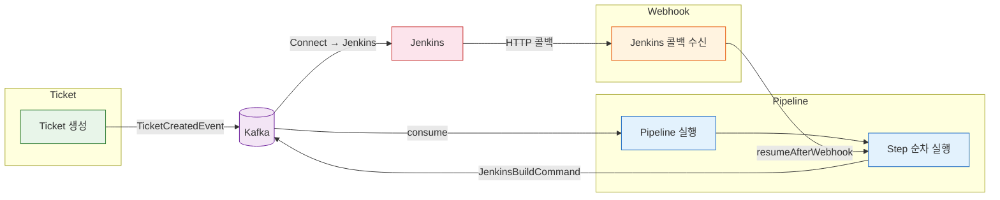

### 읽기 순서

데이터 흐름을 따라 순서대로 읽으면 자연스럽게 전체 그림이 그려진다.

| 순서 | 섹션 | 한 줄 소개 |
|:---:|------|-----------|
| 1 | [Ticket 도메인](#ticket-도메인-리뷰) | 배포 대상을 정의하는 시작점. Ticket과 TicketSource(GIT/NEXUS/HARBOR)의 관계, 상태 전이, 이벤트 발행까지 다룬다. |
| 2 | [Pipeline 도메인](#pipeline-도메인-리뷰) | Ticket을 실제로 배포하는 SAGA Orchestrator. Break-and-Resume 패턴으로 Jenkins 같은 비동기 외부 시스템과 협업하는 방법을 설명한다. |
| 3 | [Webhook 도메인](#webhook-도메인-리뷰) | 외부 시스템의 완료 콜백을 수신해서 Pipeline에 전달하는 브릿지. Redpanda Connect가 HTTP와 Kafka를 연결하는 구조를 다룬다. |

### 관련 문서

도메인 리뷰를 읽은 뒤 더 깊이 알고 싶다면 아래 문서를 참조한다.

| 주제 | 문서 |
|------|------|
| 전체 아키텍처 | [architecture.md](architecture.md) |
| 202 Accepted 패턴 | [patterns.md](patterns.md#async-accepted) |
| SAGA Orchestrator 패턴 | [patterns.md](patterns.md#saga-orchestrator) |
| Break-and-Resume 패턴 | [patterns.md](patterns.md#break-and-resume) |
| Redpanda Connect 브릿지 | [patterns.md](patterns.md#redpanda-connect) |
| 인프라 개요 | [../infra/docs/01-project-overview.md](../infra/docs/01-project-overview.md) |

---

## Ticket 도메인 리뷰

> **한 줄 요약**: Ticket은 "무엇을 배포할 것인가"를 정의하는 도메인이다. 배포 소스(Git 저장소, Nexus 아티팩트, Harbor 이미지)를 묶어서 하나의 배포 단위를 만든다.

---

### 왜 필요한가

배포 파이프라인을 실행하려면 "어디서 코드를 가져오고, 어떤 아티팩트를 쓸 것인지"가 먼저 정의되어야 한다. Ticket이 없으면 파이프라인은 무엇을 배포해야 하는지 알 수 없다. Ticket은 배포 대상의 메타데이터를 한곳에 모아 파이프라인의 입력값으로 제공하는 역할을 한다.

또한 Ticket은 하나의 배포 요청에 여러 종류의 소스를 조합할 수 있게 해준다. 예를 들어 Git 저장소에서 빌드한 결과물과 Nexus에서 가져온 의존 라이브러리, Harbor에서 풀한 베이스 이미지를 하나의 Ticket으로 묶을 수 있다. 이 조합이 파이프라인의 스텝 구성을 결정한다.

---

### 핵심 개념

#### 도메인 모델

Ticket과 TicketSource는 1:N 관계다. 하나의 Ticket에 여러 소스를 연결할 수 있고, 소스 타입에 따라 서로 다른 필드를 사용하는 다형적 구조를 갖는다.

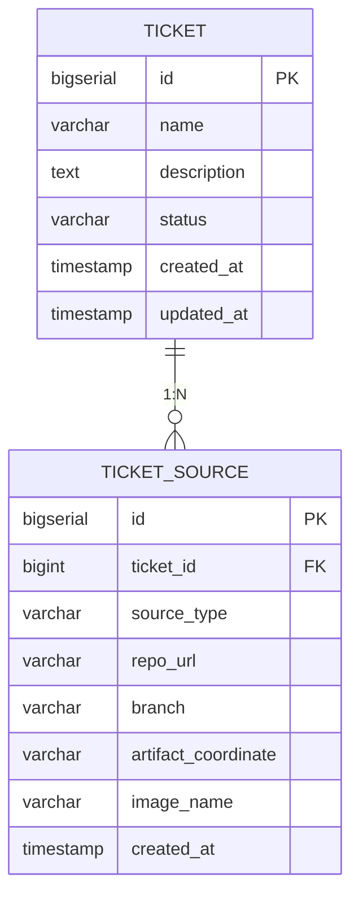

#### SourceType별 사용 필드

SourceType은 배포 소스의 종류를 구분하는 열거형이다. 각 타입마다 의미 있는 필드가 다르다.

| SourceType | 사용 필드 | 예시 | 생성되는 파이프라인 스텝 |
|:---:|------|------|------|
| `GIT` | `repoUrl`, `branch` | `http://gitlab/repo#main` | GIT_CLONE + BUILD |
| `NEXUS` | `artifactCoordinate` | `com.example:app:1.0.0:jar` | ARTIFACT_DOWNLOAD |
| `HARBOR` | `imageName` | `playground/app:latest` | IMAGE_PULL |

GIT 소스는 코드를 클론하고 빌드하는 두 단계가 필요하기 때문에 스텝이 2개 생성된다. NEXUS와 HARBOR는 이미 빌드된 결과물을 가져오는 것이므로 각각 1개 스텝이면 충분하다.

#### 상태 전이

Ticket의 상태는 파이프라인 실행과 연동된다. 파이프라인이 시작되면 DEPLOYING으로 잠기고, 완료 결과에 따라 DEPLOYED 또는 FAILED로 전이한다.

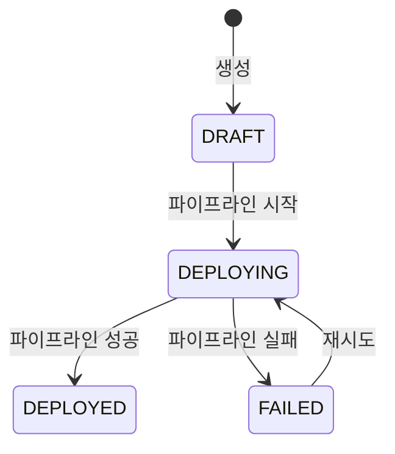

DEPLOYING 상태에서는 Ticket 수정과 삭제가 차단된다. 배포 중에 소스가 바뀌면 실행 중인 파이프라인과 불일치가 생기기 때문이다. 이 검증은 `Ticket.validateModifiable()`에서 수행한다.

---

### 동작 흐름

Ticket 생성부터 이벤트 발행까지의 흐름을 시퀀스 다이어그램으로 나타낸다.

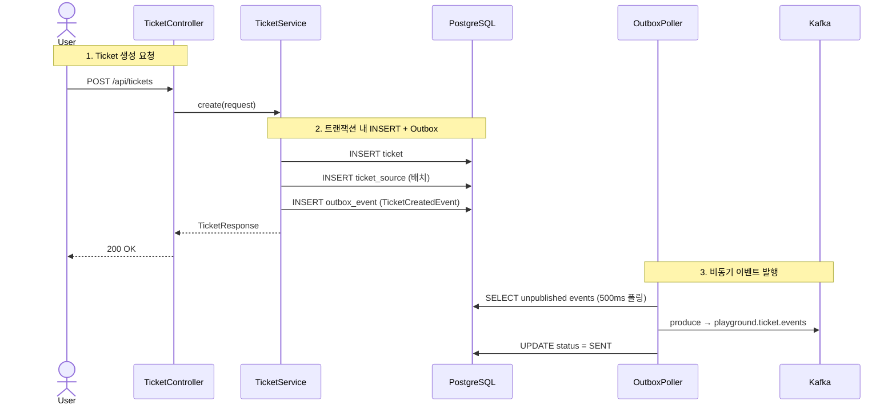

핵심은 2단계에서 비즈니스 데이터(ticket, ticket_source)와 이벤트(outbox_event)가 **같은 트랜잭션**에 저장된다는 점이다. 이렇게 하면 서비스가 INSERT 직후 크래시하더라도 이벤트가 유실되지 않는다. Transactional Outbox 패턴에 대한 자세한 설명은 [architecture.md](architecture.md)를 참조한다.

---

### 코드 가이드

아래 표는 Ticket 도메인의 주요 클래스와 역할이다. 모든 경로는 `app/src/main/java/.../ticket/` 기준이다.

| 계층 | 클래스 | 역할 |
|------|--------|------|
| API | `api/TicketController` | REST 엔드포인트 5개. 요청 검증 후 Service 위임 |
| Service | `service/TicketService` | 비즈니스 로직. 트랜잭션 관리, Outbox 이벤트 발행, 감사 이벤트 발행 |
| Domain | `domain/Ticket` | 도메인 모델. `validateModifiable()`로 DEPLOYING 상태에서 수정 차단 |
| Domain | `domain/TicketSource` | 배포 소스 모델. sourceType에 따라 사용 필드 결정 |
| Domain | `domain/TicketStatus` | 상태 열거형: DRAFT, READY, DEPLOYING, DEPLOYED, FAILED |
| Domain | `domain/SourceType` | 소스 종류 열거형: GIT, NEXUS, HARBOR |
| Mapper | `mapper/TicketMapper` | MyBatis CRUD (ticket 테이블) |
| Mapper | `mapper/TicketSourceMapper` | MyBatis CRUD (ticket_source 테이블). `insertBatch`로 일괄 등록 |
| Event | `event/TicketStatusEventConsumer` | 파이프라인 완료 이벤트를 수신해서 Ticket 상태를 DEPLOYED/FAILED로 갱신 |

#### 이벤트 발행

TicketService는 생성 시 `TicketCreatedEvent`를 Outbox에 기록한다. 이 이벤트는 Avro로 직렬화되며, 다음 필드를 포함한다.

- `ticketId`: 생성된 Ticket의 ID
- `name`: Ticket 이름
- `sourceTypes`: 연결된 소스 타입 목록 (예: `[GIT, NEXUS]`)
- `EventMetadata`: eventId, correlationId, eventType, timestamp, source

**토픽**: `playground.ticket.events` (3 파티션, 7일 보존)

**파티션 키**: `String.valueOf(ticketId)` — 같은 Ticket의 이벤트는 같은 파티션으로 전달되어 순서가 보장된다.

---

### Ticket API 엔드포인트

| Method | Path | 설명 | 응답 |
|--------|------|------|------|
| `GET` | `/api/tickets` | 전체 Ticket 목록 조회 | `List<TicketListResponse>` |
| `GET` | `/api/tickets/{id}` | 단건 조회 (소스 포함) | `TicketResponse` |
| `POST` | `/api/tickets` | 신규 생성 | `TicketResponse` (200) |
| `PUT` | `/api/tickets/{id}` | 수정 (DEPLOYING이면 거부) | `TicketResponse` |
| `DELETE` | `/api/tickets/{id}` | 삭제 (DEPLOYING이면 거부) | 204 No Content |

생성 요청의 `sources` 필드에는 최소 1개 이상의 소스가 필요하다. 소스가 없으면 파이프라인을 구성할 수 없기 때문이다.

---

### Ticket 관련 문서

- [Pipeline 도메인](#pipeline-도메인-리뷰) — Ticket이 만든 소스 정보가 파이프라인 스텝으로 변환되는 과정
- [architecture.md](architecture.md) — Transactional Outbox, 이벤트 직렬화 상세
- [patterns.md](patterns.md#async-accepted) — 202 Accepted 응답 패턴

---

## Pipeline 도메인 리뷰

> **한 줄 요약**: Pipeline은 Ticket에 정의된 배포 소스를 실제로 빌드하고 배포하는 실행 엔진이다. SAGA Orchestrator 패턴으로 스텝을 순차 실행하며, 실패 시 역순 보상을 수행한다.

---

### 왜 필요한가

배포는 단일 작업이 아니라 여러 단계의 조합이다. Git 클론, 빌드, 아티팩트 다운로드, 이미지 풀, 최종 배포까지 각 단계는 서로 다른 외부 시스템과 통신하며, 일부는 수 분이 걸리는 비동기 작업이다. Pipeline이 없으면 이 복잡한 실행 흐름을 추적하거나, 중간에 실패했을 때 이미 완료된 단계를 되돌리는 것이 불가능하다.

Pipeline 도메인은 세 가지 문제를 해결한다.

1. **실행 순서 제어**: 소스 타입에 따라 적절한 스텝을 생성하고 순서대로 실행한다.
2. **비동기 대기**: Jenkins 같은 외부 시스템의 완료를 기다리는 동안 스레드를 점유하지 않는다 (Break-and-Resume).
3. **실패 보상**: 중간 스텝이 실패하면 이미 성공한 스텝을 역순으로 되돌린다 (SAGA Compensation).

---

### 핵심 개념

#### 도메인 모델

PipelineExecution은 한 번의 배포 시도를 나타내고, PipelineStep은 그 안의 개별 작업 단위다. 하나의 Execution에 여러 Step이 1:N으로 연결된다.

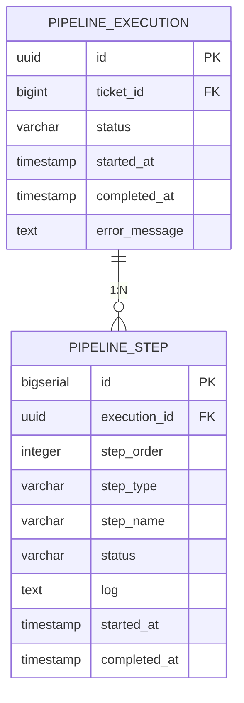

#### 스텝 구성 규칙

PipelineService는 Ticket의 소스 타입을 보고 어떤 스텝을 만들지 결정한다. 예를 들어 GIT + HARBOR 소스를 가진 Ticket이면 다음 스텝이 생성된다.

| 순서 | StepType | StepName | 소스 |
|:---:|:---:|------|------|
| 1 | GIT_CLONE | Clone: http://gitlab/repo#main | GIT |
| 2 | BUILD | Build: http://gitlab/repo#main | GIT |
| 3 | IMAGE_PULL | Pull: playground/app:latest | HARBOR |
| 4 | DEPLOY | Deploy: ... | (항상 마지막) |

DEPLOY 스텝은 소스 타입과 무관하게 항상 마지막에 추가된다.

#### 상태 전이

**PipelineExecution 상태**:

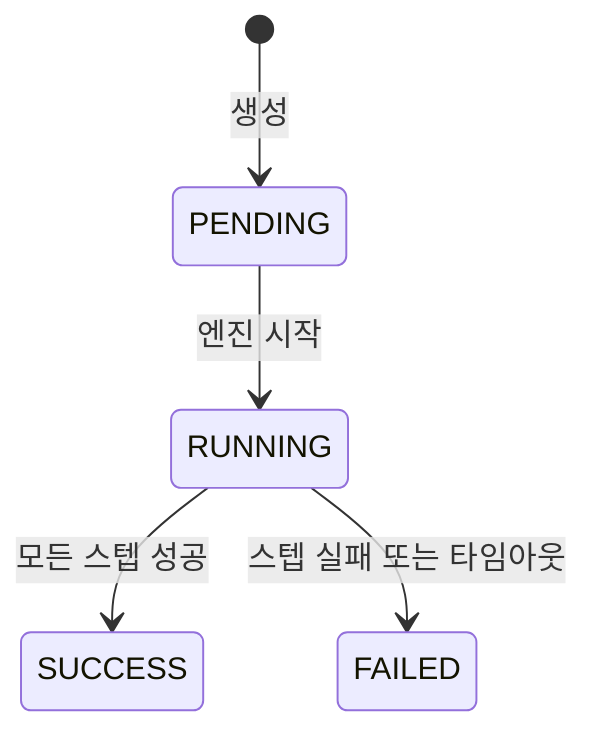

**PipelineStep 상태**:

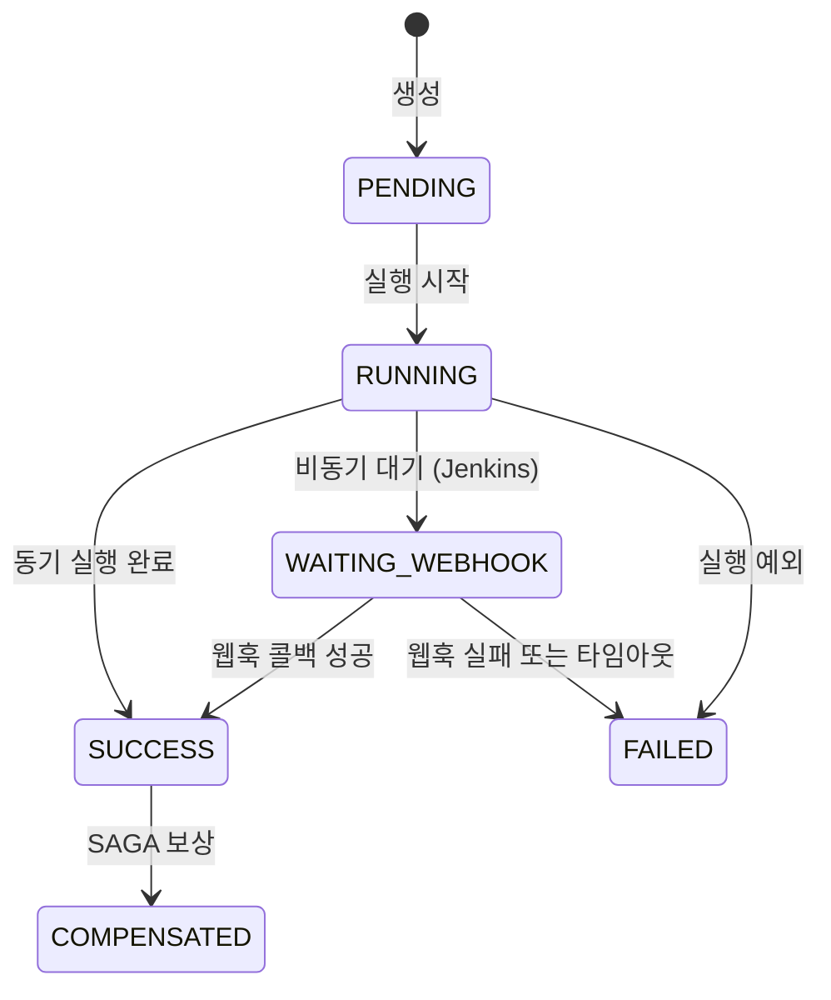

WAITING_WEBHOOK 상태는 Break-and-Resume 패턴의 핵심이다. 이 상태에 진입하면 엔진은 스레드를 반납하고, 외부 콜백이 도착할 때까지 파이프라인 실행이 중단된다. 자세한 내용은 [patterns.md](patterns.md#break-and-resume)를 참조한다.

#### 실행기(Executor) 매핑

각 StepType마다 전담 실행기가 있다. 실행기는 동기(즉시 완료)와 비동기(웹훅 대기) 두 종류로 나뉜다.

| StepType | 실행기 | 동작 방식 |
|------|--------|------|
| GIT_CLONE | `JenkinsCloneAndBuildStep` | Kafka로 Jenkins 빌드 커맨드 발행 → 웹훅 대기 |
| BUILD | `JenkinsCloneAndBuildStep` | 위와 동일 (Clone과 Build가 같은 Jenkins Job) |
| ARTIFACT_DOWNLOAD | `NexusDownloadStep` | NexusAdapter로 동기 조회 + 다운로드 |
| IMAGE_PULL | `RegistryImagePullStep` | RegistryAdapter로 동기 조회 |
| DEPLOY | `RealDeployStep` | Kafka로 Jenkins 배포 커맨드 발행 → 웹훅 대기 |

동기 실행기는 결과를 즉시 반환하고, 비동기 실행기는 `step.waitingForWebhook = true`를 설정한 뒤 반환한다. 이 플래그는 transient 필드라 DB에 저장되지 않으며, 엔진이 루프를 중단할지 판단하는 데만 쓰인다.

---

### 동작 흐름

#### 파이프라인 시작과 실행

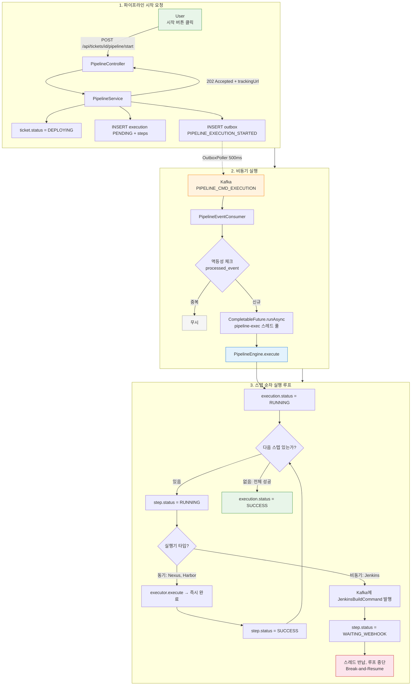

202 Accepted 응답에는 `trackingUrl`이 포함된다. 프론트엔드는 이 URL로 SSE를 연결해서 스텝 진행 상태를 실시간으로 수신한다.

##### CompletableFuture.runAsync를 사용하는 이유

PipelineEventConsumer가 Kafka 메시지를 수신한 뒤, 파이프라인 엔진을 직접 호출하지 않고 `CompletableFuture.runAsync`로 전용 스레드풀(`pipeline-exec-*`)에 위임하는 이유는 Kafka 리스너 스레드를 보호하기 위해서다.

파이프라인 실행은 동기 스텝(Nexus 다운로드, Harbor 조회)만으로도 수 초가 걸리고, 비동기 스텝(Jenkins)까지 포함하면 웹훅 콜백이 올 때까지 대기해야 한다. 이 작업을 리스너 스레드에서 직접 실행하면 두 가지 문제가 발생한다.

1. **폴링 중단**: Spring Kafka의 리스너 스레드는 `poll()` → `process()` → `poll()` 루프를 반복한다. `process()`가 오래 걸리면 다음 `poll()`이 지연되어 브로커가 컨슈머를 죽은 것으로 판단하고 **리밸런싱**을 일으킨다(`max.poll.interval.ms` 초과).
2. **처리량 병목**: 리스너 스레드 수(`concurrency`)만큼만 동시 처리가 가능하다. 파이프라인처럼 장시간 실행되는 작업이 스레드를 점유하면 다른 메시지 소비가 막힌다.

`CompletableFuture.runAsync`로 분리하면 리스너 스레드는 메시지를 수신하고 즉시 반환하므로 폴링 주기가 유지된다. 파이프라인 실행은 고정 크기 4의 전용 풀에서 독립적으로 진행되며, 풀 크기로 동시 실행 수를 제한해서 리소스 경쟁을 방지한다.

#### 토픽 흐름 상세

위 다이어그램의 "2. 비동기 실행"은 `OutboxPoller → Kafka → Consumer`로 압축되어 있지만, 실제로는 엔진이 스텝을 실행하면서 여러 토픽을 발행하고 소비하는 양방향 흐름이 발생한다.

| Topics 상수 | 실제 토픽명 | 방향 | Producer → Consumer | 용도 |
|------|------|:----:|------|------|
| `PIPELINE_CMD_EXECUTION` | `playground.pipeline.commands.execution` | → | OutboxPoller → PipelineEventConsumer | 엔진 기동 커맨드 |
| `PIPELINE_CMD_JENKINS` | `playground.pipeline.commands.jenkins` | → | PipelineCommandProducer → Redpanda Connect | Jenkins 빌드/배포 커맨드 |
| `WEBHOOK_INBOUND` | `playground.webhook.inbound` | ← | Redpanda Connect → WebhookEventConsumer | Jenkins 콜백 결과 수신 |
| `PIPELINE_EVT_STEP_CHANGED` | `playground.pipeline.events.step-changed` | → | PipelineEventProducer → PipelineSseConsumer | 스텝 상태 변경 → SSE 브로드캐스트 |
| `PIPELINE_EVT_COMPLETED` | `playground.pipeline.events.completed` | → | PipelineEventProducer → PipelineSseConsumer | 실행 완료 → SSE 종료 신호 |

`commands.execution` 하나로 시작하지만, 엔진이 루프를 돌면서 최소 4개 토픽이 추가로 관여한다. 특히 Jenkins 스텝은 커맨드가 `commands.jenkins`로 나가고 결과가 `webhook.inbound`로 돌아오는 비대칭 경로를 탄다. 나가는 토픽과 들어오는 토픽이 다르기 때문에 엔진은 스레드를 반납하고 콜백을 기다릴 수 있다(Break-and-Resume).

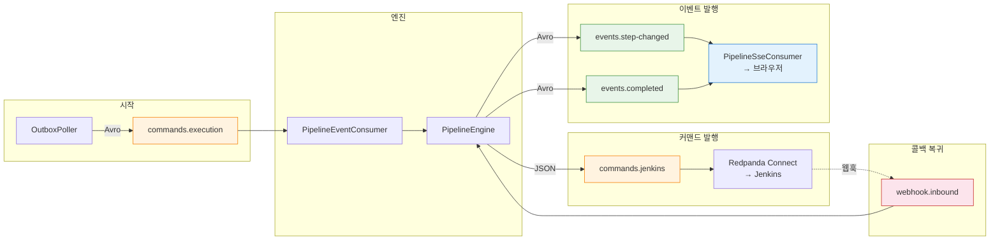

#### Break-and-Resume: 웹훅 콜백 후 재개

Jenkins 빌드가 완료되면 웹훅 콜백이 도착하고, 파이프라인은 중단된 지점부터 다시 실행을 이어간다.

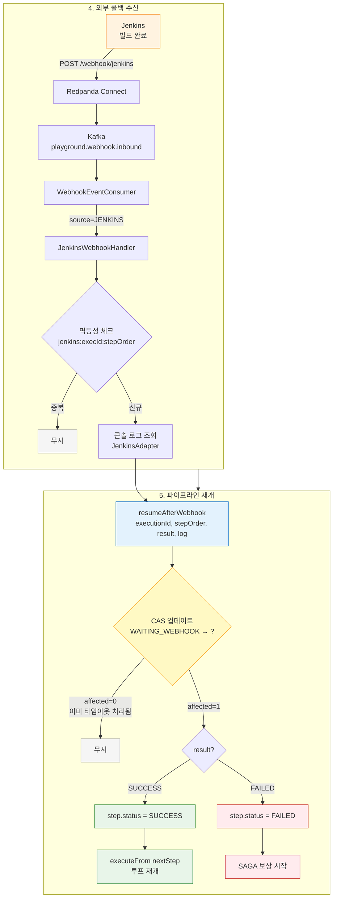

CAS(Compare-And-Swap)는 `updateStatusIfCurrent` 쿼리로 구현된다. 이 쿼리는 현재 상태가 WAITING_WEBHOOK인 경우에만 업데이트를 수행하고, 영향받은 행 수를 반환한다. 행 수가 0이면 이미 타임아웃 체커가 처리한 것이므로 콜백은 무시된다.

#### SAGA 보상 흐름

어떤 스텝에서 실패가 발생하면, SagaCompensator가 이미 성공한 스텝을 역순으로 되돌린다.

```mermaid
graph TD
    subgraph SAGA["6. SAGA 보상 (예: 스텝 3에서 실패)"]
        A["PipelineEngine<br>스텝 3 실패 감지"] --> B["SagaCompensator.compensate<br>failedStepOrder=3"]
        B --> C["스텝 2: executor.compensate"]
        C --> D{보상 성공?}
        D -->|성공| E["step 2 .status = COMPENSATED"]
        D -->|실패| F["step 2 .status = FAILED<br>MANUAL INTERVENTION"]
        E --> G["스텝 1: executor.compensate"]
        F --> G
        G --> H{보상 성공?}
        H -->|성공| I["step 1 .status = COMPENSATED"]
        H -->|실패| J["step 1 .status = FAILED<br>MANUAL INTERVENTION"]
        I --> K["execution.status = FAILED"]
        J --> K
        K --> L["ticket.status = FAILED"]
        L --> M["PIPELINE_EXECUTION_COMPLETED 발행"]
    end

    style A fill:#FFEBEE,stroke:#C62828,color:#333
    style E fill:#E8F5E9,stroke:#388E3C,color:#333
    style F fill:#FFEBEE,stroke:#C62828,color:#333
    style I fill:#E8F5E9,stroke:#388E3C,color:#333
    style J fill:#FFEBEE,stroke:#C62828,color:#333
    style K fill:#FFEBEE,stroke:#C62828,color:#333
    style M fill:#FFF3E0,stroke:#F57C00,color:#333
```

보상은 best-effort 방식이다. 개별 보상이 실패해도 나머지 보상은 계속 진행된다. 보상 실패한 스텝은 FAILED 상태로 남아 수동 개입이 필요함을 표시한다. SAGA 패턴의 설계 결정에 대한 자세한 내용은 [patterns.md](patterns.md#saga-orchestrator)를 참조한다.

#### 웹훅 타임아웃

WebhookTimeoutChecker는 30초 간격으로 WAITING_WEBHOOK 상태가 5분 이상 지속된 스텝을 찾아 실패 처리한다.

| 항목 | 값 |
|------|-----|
| 체크 주기 | 30초 (`@Scheduled(fixedDelay)`) |
| 타임아웃 기준 | 5분 |
| 경합 방지 | CAS (`updateStatusIfCurrent`) |

타임아웃 체커와 웹훅 콜백이 동시에 같은 스텝을 처리하려 할 때, CAS 덕분에 둘 중 하나만 성공한다. 실패한 쪽은 affected rows = 0을 확인하고 아무 작업도 하지 않는다.

---

### 실시간 SSE

프론트엔드는 파이프라인 시작 후 SSE(Server-Sent Events)로 스텝 진행 상태를 실시간 수신한다.

1. PipelineEngine이 스텝 상태를 변경할 때마다 `PipelineStepChangedEvent`를 Kafka에 발행한다.
2. PipelineSseConsumer가 이 이벤트를 소비해서 Avro → JSON으로 변환한다.
3. SseEmitterRegistry를 통해 해당 ticketId를 구독 중인 브라우저에 이벤트를 푸시한다.
4. 파이프라인 완료 시 `PipelineExecutionCompletedEvent`가 도착하면 SSE 연결을 종료한다.

이 구조 덕분에 브라우저가 폴링하지 않아도 스텝 하나하나의 진행이 실시간으로 표시된다.

---

### 코드 가이드

모든 경로는 `app/src/main/java/.../pipeline/` 기준이다.

| 계층 | 클래스 | 역할 |
|------|--------|------|
| API | `api/PipelineController` | 시작, 조회, 히스토리 엔드포인트 |
| API | `api/PipelineSseController` | SSE 스트림 엔드포인트 |
| Service | `service/PipelineService` | 스텝 생성, Execution 관리, 실패 주입 |
| Engine | `engine/PipelineEngine` | SAGA Orchestrator. `execute()`, `executeFrom()`, `resumeAfterWebhook()` |
| Engine | `engine/SagaCompensator` | 역순 보상 실행 |
| Engine | `engine/WebhookTimeoutChecker` | 5분 타임아웃 스캔 (30초 간격) |
| Step | `step/JenkinsCloneAndBuildStep` | Git Clone + Build 실행기 (비동기, 웹훅 대기) |
| Step | `step/NexusDownloadStep` | Nexus 아티팩트 다운로드 (동기) |
| Step | `step/RegistryImagePullStep` | Harbor 이미지 조회 (동기) |
| Step | `step/RealDeployStep` | 최종 배포 실행기 (비동기, 웹훅 대기) |
| Event | `event/PipelineEventConsumer` | PIPELINE_EXECUTION_STARTED 소비 → 엔진 실행 |
| Event | `event/PipelineEventProducer` | 스텝 변경, 실행 완료 이벤트 발행 |
| Event | `event/PipelineCommandProducer` | Jenkins 빌드 커맨드 발행 |
| SSE | `sse/PipelineSseConsumer` | 이벤트 소비 → SSE 브로드캐스트 |
| SSE | `sse/SseEmitterRegistry` | SSE 연결 관리 (ticketId 기준) |
| Mapper | `mapper/PipelineExecutionMapper` | MyBatis CRUD |
| Mapper | `mapper/PipelineStepMapper` | MyBatis CRUD + CAS 쿼리 (`updateStatusIfCurrent`) |

#### 실패 주입 (데모용)

`POST /api/tickets/{id}/pipeline/start-with-failure`를 호출하면 `injectRandomFailure()`가 무작위 스텝의 이름에 `[FAIL]` 마커를 추가한다. 실행기는 이 마커를 감지하면 의도적으로 예외를 던져 SAGA 보상 흐름을 시연한다. `[SLOW]` 마커는 10초 지연을 추가해서 SSE 실시간 전달을 테스트할 때 쓴다.

---

### Pipeline API 엔드포인트

| Method | Path | 설명 | 응답 |
|--------|------|------|------|
| `POST` | `/api/tickets/{id}/pipeline/start` | 파이프라인 시작 | 202 Accepted + `PipelineExecutionResponse` |
| `POST` | `/api/tickets/{id}/pipeline/start-with-failure` | 실패 주입 시작 (SAGA 데모) | 202 Accepted |
| `GET` | `/api/tickets/{id}/pipeline` | 최신 실행 조회 | `PipelineExecutionResponse` |
| `GET` | `/api/tickets/{id}/pipeline/history` | 실행 이력 목록 | `List<PipelineExecutionResponse>` |
| `GET` | `/api/tickets/{id}/pipeline/events` | SSE 스트림 | `text/event-stream` |

---

### Pipeline 관련 문서

- [Ticket 도메인](#ticket-도메인-리뷰) — 파이프라인의 입력이 되는 Ticket 도메인
- [Webhook 도메인](#webhook-도메인-리뷰) — Jenkins 콜백이 파이프라인에 도달하는 경로
- [patterns.md](patterns.md#saga-orchestrator) — SAGA 패턴 설계 결정과 트레이드오프
- [patterns.md](patterns.md#break-and-resume) — Break-and-Resume 패턴 상세
- [patterns.md](patterns.md#async-accepted) — 202 Accepted 응답 패턴

---

## Webhook 도메인 리뷰

> **한 줄 요약**: Webhook은 외부 시스템(Jenkins)의 완료 콜백을 수신해서 중단된 파이프라인을 재개하는 브릿지 도메인이다.

---

### 왜 필요한가

Jenkins 빌드는 수 분이 걸릴 수 있다. 파이프라인 엔진이 빌드 완료를 동기적으로 기다리면 스레드가 낭비되고, 동시 실행 가능한 파이프라인 수가 스레드 풀 크기에 제한된다. 그래서 엔진은 빌드 요청을 보낸 뒤 스레드를 반납하고(Break), Jenkins가 빌드를 끝내면 콜백을 보내서 엔진을 깨운다(Resume).

문제는 Jenkins가 직접 스프링 애플리케이션에 HTTP를 보내지 않는다는 점이다. Jenkins의 콜백 URL은 고정이고, 내부 서비스 주소는 변할 수 있으며, Jenkins가 Kafka 프로토콜을 지원하지도 않는다. Webhook 도메인은 이 간극을 **Redpanda Connect**로 메운다. Jenkins → HTTP → Redpanda Connect → Kafka → WebhookEventConsumer → PipelineEngine 순서로 콜백이 전달된다.

---

### 핵심 개념

#### Redpanda Connect 브릿지

Redpanda Connect는 HTTP와 Kafka 사이의 양방향 브릿지 역할을 한다. 이 프로젝트에서는 두 개의 스트림 설정을 사용한다.

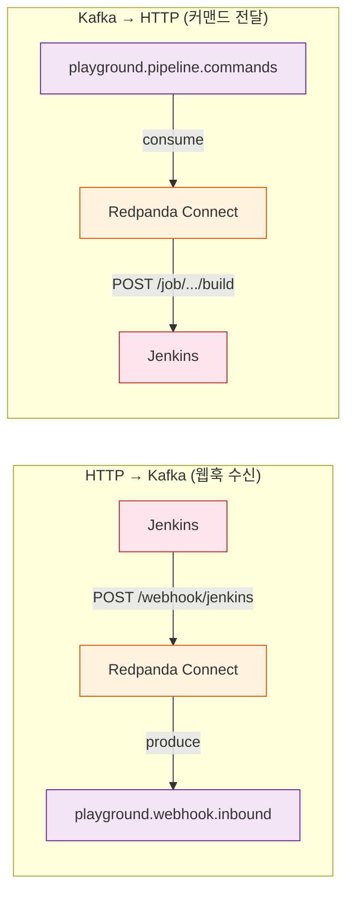

**HTTP → Kafka** (`infra/docker/shared/connect/jenkins-webhook.yaml`): Jenkins의 POST 웹훅을 수신해서 `playground.webhook.inbound` 토픽에 발행한다. 원본 페이로드를 `{ webhookSource: "JENKINS", payload: {...}, headers: {...} }` 형태로 감싸서 소스 식별이 가능하게 만든다.

**Kafka → HTTP** (`infra/docker/shared/connect/jenkins-command.yaml`): `playground.pipeline.commands` 토픽에서 `JENKINS_BUILD_COMMAND` 이벤트를 소비해서 Jenkins REST API(`POST /job/{jobName}/buildWithParameters`)를 호출한다. Bloblang 필터로 이벤트 타입을 걸러내고, Basic Auth로 Jenkins에 인증한다.

Connect 브릿지의 설계 결정에 대한 자세한 내용은 [patterns.md](patterns.md#redpanda-connect)를 참조한다.

#### 멱등성 보장

Kafka 컨슈머는 재전달(redelivery)이 발생할 수 있다. 같은 웹훅 콜백이 두 번 처리되면 파이프라인 엔진이 이미 SUCCESS인 스텝을 다시 처리하려 시도할 수 있다. 이를 방지하기 위해 JenkinsWebhookHandler는 `processed_event` 테이블에 `(correlationId, eventType)` 복합 키로 중복 체크를 수행한다.

- **correlationId**: `jenkins:{executionId}:{stepOrder}` 형식
- **eventType**: `WEBHOOK_RECEIVED`

이미 처리된 조합이면 핸들러가 즉시 반환한다.

#### CAS 경쟁 방지

웹훅 콜백과 타임아웃 체커가 동시에 같은 스텝을 처리하려 할 수 있다. 이 경쟁 조건은 PipelineStepMapper의 `updateStatusIfCurrent` 쿼리로 해결한다.

```sql
UPDATE pipeline_step
SET status = #{newStatus}, log = #{log}, completed_at = #{completedAt}
WHERE id = #{stepId} AND status = #{currentStatus}
```

이 쿼리는 현재 상태가 `WAITING_WEBHOOK`인 경우에만 업데이트를 수행한다. 영향받은 행 수가 0이면 이미 다른 쪽(타임아웃 체커 또는 콜백)이 처리한 것이므로, 중복 처리를 피할 수 있다.

---

### 동작 흐름

전체 웹훅 수신부터 파이프라인 재개까지의 흐름이다.

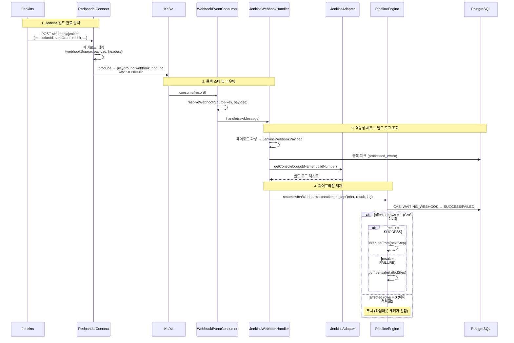

#### 웹훅 소스 라우팅

WebhookEventConsumer는 Kafka 레코드의 키 또는 페이로드에서 `webhookSource`를 추출한 뒤, 해당 소스에 맞는 핸들러로 라우팅한다. 현재는 JENKINS만 지원하지만, 새로운 외부 시스템(예: ArgoCD, GitHub Actions)을 추가할 때 핸들러만 등록하면 되는 확장 가능한 구조다.

라우팅 로직은 `resolveWebhookSource()`에 있다. Kafka 키를 우선 사용하고, 키가 없으면 페이로드에서 `webhookSource` 필드를 파싱하는 폴백 전략을 따른다.

#### 빌드 로그 수집

JenkinsWebhookHandler는 웹훅 페이로드에서 `jobName`과 `buildNumber`를 추출한 뒤, JenkinsAdapter를 통해 Jenkins 콘솔 로그를 조회한다. 이 로그는 PipelineStep의 `log` 필드에 저장되어 프론트엔드에서 빌드 결과를 확인할 수 있게 한다.

로그 형식은 다음과 같다.

```
=== Jenkins deploy-job #42 SUCCESS (15234ms) ===
Started by upstream project...
Building in workspace /var/jenkins_home/workspace/deploy-job
...
Finished: SUCCESS
```

콘솔 로그 조회에 실패하면 간략한 요약(`Jenkins build #42 SUCCESS in 15234ms`)으로 대체한다.

---

### 에러 처리

#### 재시도 정책

WebhookEventConsumer는 4회 재시도(지수 백오프: 1초 → 2초 → 4초 → 8초)를 수행한다. 모든 재시도가 실패하면 메시지를 DLT(Dead Letter Topic, `playground.webhook.inbound-dlt`)로 이동시킨다. DLT 핸들러는 토픽, 키, 파티션, 오프셋을 로깅해서 수동 복구 시 참조할 수 있게 한다.

#### 타임아웃

WebhookTimeoutChecker(Pipeline 도메인에 위치)가 WAITING_WEBHOOK 상태의 스텝을 30초 간격으로 스캔하고, 5분 이상 경과한 스텝을 FAILED로 전이시킨다. 타임아웃과 콜백이 동시에 도착하는 경우 CAS로 안전하게 하나만 처리된다.

---

### 코드 가이드

모든 경로는 `app/src/main/java/.../webhook/` 기준이다.

| 계층 | 클래스 | 역할 |
|------|--------|------|
| Consumer | `WebhookEventConsumer` | `playground.webhook.inbound` 소비, 웹훅 소스별 핸들러 라우팅, 재시도 + DLT |
| Handler | `handler/JenkinsWebhookHandler` | 페이로드 파싱, 멱등성 체크, 빌드 로그 조회, PipelineEngine 재개 호출 |
| DTO | `dto/JenkinsWebhookPayload` | Jenkins 콜백 데이터 (record): executionId, stepOrder, jobName, buildNumber, result, duration, url |
| Config | `infra/docker/shared/connect/jenkins-webhook.yaml` | HTTP → Kafka 브릿지 설정 |
| Config | `infra/docker/shared/connect/jenkins-command.yaml` | Kafka → HTTP 브릿지 설정 (커맨드 방향) |

#### 타 도메인 연결점

Webhook 도메인이 다른 도메인과 만나는 지점은 정확히 두 곳이다.

1. **JenkinsWebhookHandler → PipelineEngine.resumeAfterWebhook()**: 콜백 결과를 파이프라인에 전달한다.
2. **JenkinsAdapter** (common-kafka 모듈): Jenkins REST API 호출을 담당하는 어댑터로, 빌드 로그 조회에 사용된다.

---

### Webhook Kafka 토픽 정리

| 토픽 | 파티션 | 보존 | 용도 |
|------|:---:|------|------|
| `playground.webhook.inbound` | 3 | 3일 | Jenkins 콜백 수신 |
| `playground.webhook.inbound-retry` | - | - | 재시도 토픽 |
| `playground.webhook.inbound-dlt` | - | - | Dead Letter Topic |
| `playground.pipeline.commands` | - | - | Jenkins 빌드 커맨드 (Webhook 입장에서는 반대 방향) |

---

### Webhook API 엔드포인트

Webhook 도메인은 자체 REST API를 노출하지 않는다. 외부 시스템의 HTTP 콜백은 Redpanda Connect가 수신하며(`http://localhost:4197/webhook/jenkins`), 스프링 애플리케이션은 Kafka 컨슈머로만 웹훅을 처리한다.

이 구조의 장점은 외부 콜백 포맷이 바뀌어도 Connect의 Bloblang 변환만 수정하면 되고, 스프링 애플리케이션 코드는 변경하지 않아도 된다는 것이다.

---

### Webhook 관련 문서

- [Pipeline 도메인](#pipeline-도메인-리뷰) — 웹훅이 재개하는 파이프라인의 동작 방식
- [Ticket 도메인](#ticket-도메인-리뷰) — 파이프라인의 입력이 되는 Ticket 도메인
- [patterns.md](patterns.md#redpanda-connect) — Connect 브릿지 설정과 Bloblang 상세
- [patterns.md](patterns.md#break-and-resume) — Break-and-Resume 패턴과 CAS 동기화
