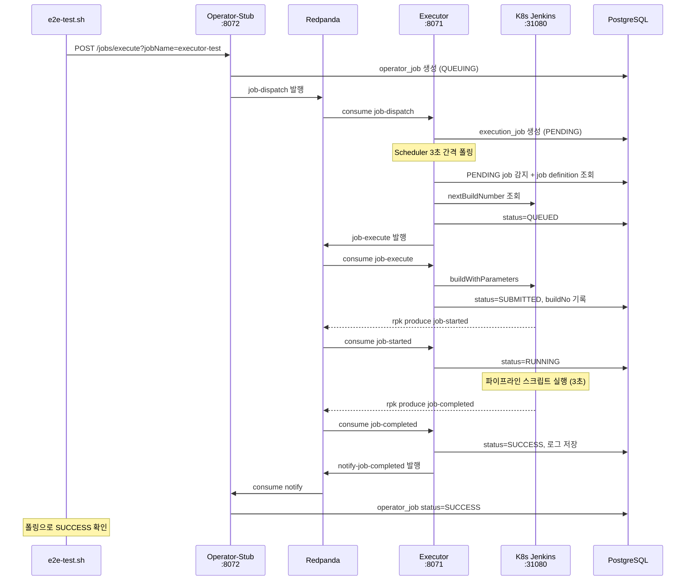
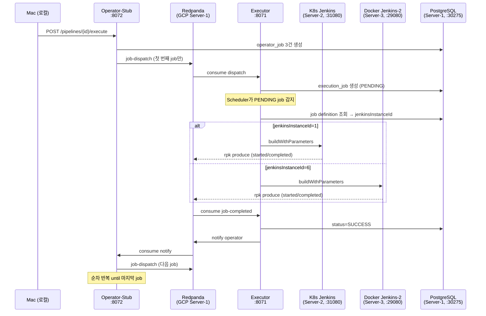

# Executor E2E 테스트 결과 보고서

> 이 문서는 `operator-stub` 기반 토폴로지에서 작성된 historical 보고서다.
> 2026-04-09 이후 현재 저장소의 live 구조는 `operator` + `executor`이며, `operator-stub` 디렉토리는 제거됐다.
> 본문에서 나오는 `operator-stub`, `operator_stub.operator_job`, `make operator-stub`는 현재 구조와 직접 일치하지 않는다.

## 개요

Executor PoC의 E2E 테스트 전체 결과를 기록한다. 단일 job Happy Path(TC-01)부터 멀티 파이프라인 × 멀티 Jenkins 교차 실행(TC-09)까지, 10개의 시나리오로 executor의 디스패치, 실행, 재시도, 순차 실행, 중복 방지, 멀티 Jenkins 기능을 검증한다.

## E2E 테스트 전체 흐름

테스트는 operator-stub이 실제 운영 환경의 operator 역할을 대행하는 구조이다. 사용자가 파이프라인 또는 단독 job 실행을 요청하면, operator-stub → Redpanda → executor → Jenkins → Redpanda → executor → operator-stub 순으로 이벤트가 순환한다.

### 단독 Job 실행 흐름 (TC-01 기준)



각 단계에서 Kafka 토픽이 모듈 간 결합을 끊어주는 역할을 한다. executor 내부의 상태 전이는 `PENDING → QUEUED → SUBMITTED → RUNNING → SUCCESS/FAILURE`이며, 각 전이마다 DB에 기록된다.

### 파이프라인 순차 실행 흐름 (TC-08 기준)

파이프라인은 여러 job을 순차적으로 실행한다. operator-stub이 첫 번째 job만 디스패치하고, executor가 완료를 통보하면 operator-stub의 `JobCompletionListener`가 다음 job을 디스패치한다.



## 테스트 환경

| 구성 요소 | 위치 | 주소 |
|----------|------|------|
| Executor | Mac 로컬 | `localhost:8071` |
| Operator-Stub | Mac 로컬 | `localhost:8072` |
| K8s Jenkins (id=1) | dev-server-2 | `34.47.74.0:31080` |
| Docker Jenkins-2 (id=6) | dev-server-3 | `34.22.78.240:29080` |
| Redpanda | dev-server-1 | `34.47.83.38:31092` |
| PostgreSQL | dev-server-1 | `34.47.83.38:30275` |

### Jenkins Job 구성

| Jenkins | Job Path | 파라미터 | Webhook |
|---------|----------|---------|---------|
| K8s Jenkins | `1/3/1`, `1/3/3` | EXECUTION_JOB_ID, JOB_ID | rpk → Redpanda (Helm values로 설정) |
| Docker Jenkins-2 | `1/4/2` | EXECUTION_JOB_ID, JOB_ID | rpk → Redpanda (커스텀 이미지 + init.groovy.d) |

### DB Job 정의

| job_id | project_id | preset_id | Jenkins 인스턴스 |
|--------|-----------|-----------|-----------------|
| 1 | 1 | 3 (default) | K8s Jenkins (id=1) |
| 2 | 1 | 4 (jenkins-2) | Docker Jenkins-2 (id=6) |
| 3 | 1 | 3 (default) | K8s Jenkins (id=1) |

## 테스트 시나리오

### TC-01: Happy Path (단독 Job)

단일 job을 트리거하여 전체 라이프사이클이 정상 동작하는지 검증한다. executor의 가장 기본적인 E2E 시나리오이다.

**흐름**: operator-stub → Kafka dispatch → executor 수신 → Jenkins 트리거 → webhook 콜백 → executor SUCCESS → operator 통보

**검증 항목**:
- executor job status = SUCCESS
- operator job status = SUCCESS
- 로그 파일 존재 (`/tmp/executor-logs/{jobPath}/{id}_0`)
- outbox event status = SENT

**자동화**: 완전 자동 (`make test-e2e tc01`)

### TC-02: 빌드 실패 (Build Failure)

Jenkins 파이프라인 스크립트에 의도적 에러를 삽입하여, 빌드 실패가 executor까지 정확히 전파되는지 검증한다.

**흐름**: job 트리거 → Jenkins 빌드 실패 → webhook `result=FAILURE` → executor FAILURE → operator FAILURE

**검증 항목**:
- executor job status = FAILURE
- operator job status = FAILURE
- 로그 파일에 에러 내용 포함

**자동화**: 수동 (Jenkins 파이프라인 스크립트 변경 필요)

### TC-03: 트리거 재시도 (Jenkins Scale-Down)

Jenkins를 0 replica로 scale down한 상태에서 job을 트리거하여, executor의 재시도 로직이 동작하는지 검증한다.

**흐름**: Jenkins down → job 트리거 → nextBuildNumber 조회 실패 → retryCnt 증가 → status PENDING 유지 → Jenkins 복구 후 재시도

**검증 항목**:
- retryCnt >= 1
- status = PENDING (Jenkins down 상태에서)

**자동화**: 반자동 (Jenkins scale down/up 확인 필요)

### TC-05: 중복 방지 (Duplicate Prevention)

동일 job이 이미 RUNNING 상태일 때 동일한 job을 다시 트리거하면 중복 실행이 방지되는지 검증한다. `DispatchEvaluatorService`의 `existsByJobIdAndStatusIn(ACTIVE_STATUSES)` 체크가 핵심이다.

**흐름**: job A 트리거 (long-running) → job A RUNNING → job B 트리거 (같은 jobId) → executor가 중복 감지하여 스킵

**검증 항목**:
- job A가 RUNNING/QUEUED 상태
- executor 로그에 "duplicate skip" 메시지

**자동화**: 수동 (Jenkins 파이프라인에 `sleep 120` 필요)

### TC-06: 멱등성 (Idempotency)

consumer group offset을 리셋하여 동일한 메시지를 재소비시켰을 때, executor가 이미 처리된 job을 무시하는지 검증한다.

**흐름**: TC-01 실행 후 → offset 리셋 → 동일 메시지 재소비 → "Duplicate job ignored" 로그

**검증 항목**:
- executor 로그에 "Duplicate job ignored" 메시지

**자동화**: 완전 자동 (`make test-e2e tc06`)

### TC-07: 멀티 트리거 (3 Parallel Jobs)

3개의 job을 동시에 트리거하여 concurrency 제어가 동작하는지 검증한다. `max_executors=2` 설정에 의해 동시 실행이 제한되어야 한다.

**흐름**: job 1, 2, 3 동시 트리거 → 일부는 RUNNING, 나머지는 PENDING/QUEUED

**검증 항목**:
- 최소 1개 job이 RUNNING/QUEUED/SUCCESS
- concurrency 제한 관찰 (PENDING이 존재하거나 동시 RUNNING이 2 이하)

**자동화**: 완전 자동 (`make test-e2e tc07`)

---

### TC-08: 혼합 파이프라인 (Mixed Pipeline, Multi-Jenkins)

단일 파이프라인 내에서 job마다 다른 Jenkins 인스턴스를 사용하여 순차 실행한다.

**파이프라인 구성**: `mixed-3-multi-jenkins`

| 순서 | jobId | Jenkins | 역할 |
|------|-------|---------|------|
| 1 | 1 | K8s Jenkins (id=1) | 첫 번째 빌드 |
| 2 | 2 | Docker Jenkins-2 (id=6) | Jenkins 인스턴스 전환 |
| 3 | 3 | K8s Jenkins (id=1) | 원래 Jenkins로 복귀 |

**기대 결과**: 3개 job 모두 SUCCESS, 두 Jenkins 모두 사용됨, 로그 파일 3개 생성

### TC-09: 멀티 파이프라인 동시 실행

2개의 혼합 파이프라인을 동시에 트리거하여 총 6개 job이 2대의 Jenkins에서 실행된다.

**파이프라인 구성**:

| 파이프라인 | 순서 1 | 순서 2 | 순서 3 |
|-----------|--------|--------|--------|
| A (`mixed-3-multi-jenkins`) | jobId=1, J1 | jobId=2, J2 | jobId=3, J1 |
| B (`mixed-3-jenkins2-first`) | jobId=2, J2 | jobId=1, J1 | jobId=3, J2 |

**기대 결과**: 6개 job 모두 SUCCESS

### TC-10: 파이프라인 중간 실패 전파

Docker Jenkins-2를 중단한 상태에서 혼합 파이프라인을 실행하여, 중간 job 실패 시 후속 job이 실행되지 않는 것을 검증한다.

**기대 결과**: job1=SUCCESS, job2=FAILURE (retry 초과), job3=PENDING (미실행)

## 실행 결과

### TC-01: PASS (2026-04-07)

```
=== TC-01: Happy Path ===
[PASS] Executor job status: SUCCESS
[PASS] Operator job status: SUCCESS
[PASS] Log file exists: /tmp/executor-logs/1/3/1/58_0
[PASS] Outbox event sent (count=3)
```

### TC-02 ~ TC-07: 미실행

TC-02, TC-05는 Jenkins 파이프라인 수동 변경이 필요하다. TC-03은 Jenkins scale down/up이 필요하다. TC-06, TC-07은 자동화 가능하지만 이번 세션에서는 멀티 파이프라인 검증에 집중했다.

| TC | 상태 | 실행 방법 |
|----|------|----------|
| TC-02 | 미실행 | `make test-e2e tc02` (수동: Jenkins 스크립트 변경) |
| TC-03 | 미실행 | `make test-e2e tc03` (반자동: scale down 확인) |
| TC-05 | 미실행 | `make test-e2e tc05` (수동: Jenkins 스크립트 변경) |
| TC-06 | 미실행 | `make test-e2e tc06` (자동) |
| TC-07 | 미실행 | `make test-e2e tc07` (자동) |

### TC-08: PASS (2026-04-08)

```
=== TC-08: Mixed Pipeline (Multi-Jenkins) ===
[PASS] All jobs reached terminal state
Pipeline summary:
  order=1 jobName=executor-test status=SUCCESS jenkinsId=1
  order=2 jobName=executor-test status=SUCCESS jenkinsId=6
  order=3 jobName=executor-test status=SUCCESS jenkinsId=1
[PASS] SUCCESS job count: 3
[PASS] Jenkins-1 used
[PASS] Jenkins-2 used
[PASS] Log files exist (count=3)
```

### TC-09: PASS (2026-04-08)

```
=== TC-09: Multi-Pipeline Parallel (2 Pipelines) ===
[PASS] Pipeline A completed
[PASS] Pipeline B completed
Pipeline A summary:
  order=1 jobName=executor-test status=SUCCESS jenkinsId=1
  order=2 jobName=executor-test status=SUCCESS jenkinsId=6
  order=3 jobName=executor-test status=SUCCESS jenkinsId=1
Pipeline B summary:
  order=1 jobName=executor-test status=SUCCESS jenkinsId=6
  order=2 jobName=executor-test status=SUCCESS jenkinsId=1
  order=3 jobName=executor-test status=SUCCESS jenkinsId=6
[PASS] Pipeline A SUCCESS count: 3
[PASS] Pipeline B SUCCESS count: 3
```

### TC-10: 미실행

수동 확인 필요 (Jenkins-2 stop/start). `make test-e2e tc10`으로 실행 가능.

## 디버깅 과정에서 발견된 이슈

테스트 과정에서 5개의 버그와 3개의 설정 문제를 발견하고 수정했다.

### 코드 버그

| 이슈 | 원인 | 수정 |
|------|------|------|
| `jobId=0L` 하드코딩 | `OperatorStubController.executeSingleJob()`에서 fixture 조회 없이 0L 전달 | `TestPipelineFixtures.findJobByName()` 추가하여 동적 조회 |
| E2E outbox 쿼리 실패 | `sent=true` 컬럼 참조 (실제는 `status='SENT'`) | 쿼리를 `status='SENT'`로 수정 |
| E2E 로그 경로 하드코딩 | `executor-test/{id}_0` 고정 (실제는 Jenkins path 기반) | `find` 명령으로 동적 검색 |
| `print_pipeline_summary` unbound var | `$2` 미전달 시 `set -u`에서 에러 | `${2:-}` 기본값 처리 |

### 인프라/설정 이슈

| 이슈 | 원인 | 수정 |
|------|------|------|
| Jenkins pod Completed | GCP 서버 재시작 후 pod 미복구 | `kubectl delete pod` → StatefulSet이 재생성 |
| Jenkins job 파라미터 미정의 | `1/3/1` config.xml에 파라미터 없음 | config.xml에 EXECUTION_JOB_ID, JOB_ID 추가 |
| config.xml 줄바꿈 소실 | `curl -d @file`이 newline 제거 | `--data-binary @file` 사용 |
| Docker Jenkins-2 webhook 미작동 | 구버전 groovy + rpk 경로 불일치 + absoluteUrl 에러 + DNS 미설정 | 커스텀 이미지 빌드 + rpk symlink + groovy 수정 + /etc/hosts 추가 |
| DB Jenkins-2 URL 불일치 | `support_tool.url`이 `34.47.74.0:29080` (잘못된 IP) | `34.22.78.240:29080`으로 UPDATE |

### Docker Jenkins-2 설정 교훈

커스텀 이미지(`playground-jenkins:custom`)로 빌드해도 다음 수동 설정이 필요하다:

1. **rpk symlink**: `/var/jenkins_home/rpk` → `/usr/local/bin/rpk` (groovy가 하드코딩된 경로 참조)
2. **/etc/hosts**: 호스트 OS에 `10.178.0.2 redpanda-0` 추가 (rpk가 advertise 주소로 연결)
3. **webhook-listener.groovy 수정**: `run.absoluteUrl` → `""` (Root URL 미설정 시 예외 방지)
4. **폴더 + job 생성**: 새 볼륨이므로 API로 폴더 구조 재생성 필요

## 수정된 파일

| 파일 | 변경 내용 |
|------|----------|
| `operator-stub/.../OperatorStubController.java` | `executeSingleJob()`에서 fixture 기반 jobId 조회 |
| `operator-stub/.../TestPipelineFixtures.java` | `findJobByName()` 추가, 혼합 파이프라인 2개 추가 |
| `scripts/e2e-test.sh` | TC-08/09/10 추가, 파이프라인 헬퍼 함수, 로그 경로/outbox 수정 |

## 실행 방법

### 사전 조건

1. GCP 서버 3대 기동 (`gcloud compute instances start dev-server-3 dev-server dev-server-2 --zone=asia-northeast3-a`)
2. Jenkins pod 정상 확인 (`kubectl get pods -n rp-jenkins`)
3. Docker Jenkins-2 기동 확인 (`docker ps | grep jenkins` on dev-server-3)
4. 로컬에서 executor + operator-stub 실행:
   ```bash
   cd redpanda-playground
   make executor        # 터미널 1 (port 8071)
   make operator-stub   # 터미널 2 (port 8072, 별도 터미널에서)
   ```

### 테스트 실행

```bash
cd redpanda-playground

# 인프라 상태 확인
make test-e2e check

# === 단독 Job 테스트 ===
make test-e2e tc01    # Happy Path (자동)
make test-e2e tc02    # 빌드 실패 (수동: Jenkins 스크립트 변경)
make test-e2e tc03    # 트리거 재시도 (반자동: Jenkins scale down)
make test-e2e tc05    # 중복 방지 (수동: Jenkins 스크립트 변경)
make test-e2e tc06    # 멱등성 (자동)
make test-e2e tc07    # 멀티 트리거 (자동)

# === 파이프라인 테스트 ===
make test-e2e tc08    # 혼합 파이프라인, Multi-Jenkins (자동)
make test-e2e tc09    # 멀티 파이프라인 동시 실행 (자동)
make test-e2e tc10    # 파이프라인 중간 실패 전파 (반자동)

# === 그룹 실행 ===
make test-e2e auto      # 자동화 가능: tc01, tc06, tc07
make test-e2e pipeline  # 파이프라인: tc08, tc09
make test-e2e all       # 전체 (수동 포함)
```

### clean_db 설명

각 TC 시작 시 `clean_db`로 `executor.execution_job`, `executor.outbox_event`, `operator_stub.operator_job` 테이블을 전부 DELETE한다. executor의 중복 방지 로직(`existsByJobIdAndStatusIn`)이 이전 테스트의 잔존 레코드를 "이미 실행 중"으로 판단하는 것을 방지하기 위함이다. 또한 outbox 검증 시 이전 이벤트가 카운트에 포함되는 오염도 방지한다.
