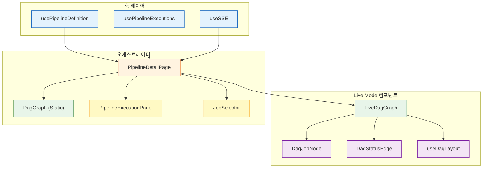
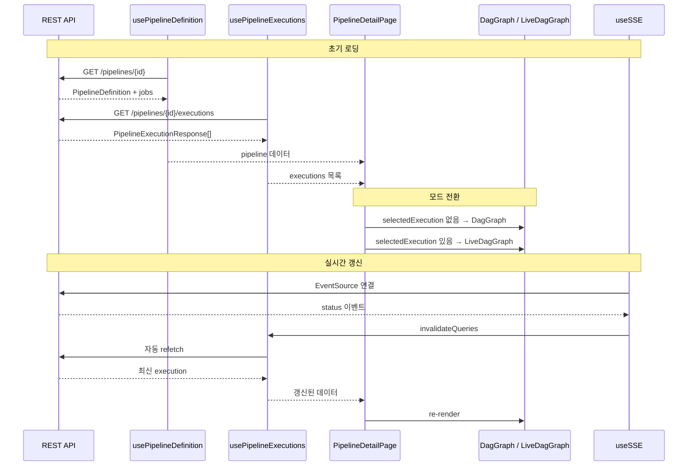

# DAG 프론트엔드 구현 가이드

## 1. 개요

Redpanda Playground의 파이프라인 DAG는 두 가지 렌더링 모드를 제공한다. 파이프라인 정의를 편집할 때는 **Static Mode**가, 실행을 모니터링할 때는 **Live Mode**가 활성화되는 구조이며, PipelineDetailPage가 `selectedExecution` 상태 유무에 따라 둘 사이를 전환한다.

**Static Mode** (`DagGraph.tsx`)는 순수 SVG 기반으로 동작하며 자체 위상정렬 알고리즘으로 노드를 배치한다. 외부 라이브러리 의존 없이 `<foreignObject>`와 `<line>`만으로 그래프를 그리기 때문에 번들 크기가 작고, 편집 모드에서 불필요한 상호작용 오버헤드를 제거할 수 있다.

**Live Mode** (`LiveDagGraph.tsx`)는 React Flow + Dagre 조합을 사용한다. 실행 상태에 따라 노드 색상과 애니메이션이 실시간으로 바뀌어야 하므로, 커스텀 노드/엣지 타입과 자동 레이아웃 엔진이 필요하기 때문이다.

데이터는 API에서 시작하여 React Query 훅을 거쳐 컴포넌트에 도달한다. `pipelineDefinitionApi` -> `usePipelineDefinition` / `usePipelineExecutions` -> `PipelineDetailPage` -> `DagGraph` 또는 `LiveDagGraph` 순서로 흐른다.



---

## 2. 컴포넌트 아키텍처

### PipelineDetailPage: 오케스트레이터

PipelineDetailPage는 DAG 시스템의 중앙 제어 지점이다. 이 페이지는 파이프라인 정의 조회, Job 구성 편집, 실행 트리거, 실행 모니터링을 모두 담당하며, 각 기능을 하위 컴포넌트에 위임하는 역할을 맡는다.

핵심 상태는 `selectedExecutionId`로, 이 값의 존재 여부가 Static/Live 모드 전환을 결정한다. PipelineDetailPage의 396~400행에서 분기가 일어난다:

```tsx
{selectedExecution ? (
  <LiveDagGraph jobs={dagJobs} execution={selectedExecution} />
) : (
  <DagGraph jobs={dagJobs} />
)}
```

`selectedExecution`이 없으면 편집용 Static DAG를 보여주고, 특정 실행을 선택하면 해당 실행의 Job 상태가 반영된 Live DAG로 전환되는 것이다.

### 데이터 변환 파이프라인

서버 응답(`PipelineJobResponse`)은 ID 기반 의존성(`dependsOnJobIds: number[]`)을 사용하지만, DAG 컴포넌트는 이름 기반 의존성(`dependsOn: string[]`)을 기대한다. PipelineDetailPage의 88~96행에서 이 변환이 이루어진다:

```tsx
const dagJobs = mappings.map((m) => ({
  id: m.jobId,
  jobName: m.jobName,
  jobType: m.jobType,
  executionOrder: m.executionOrder,
  dependsOn: mappings
    .filter((other) => m.dependsOnJobIds.includes(other.jobId))
    .map((other) => other.jobName),
}));
```

ID를 이름으로 변환하는 이유는, DAG 렌더링에서 노드 식별자로 `jobName`을 사용하기 때문이다. Dagre와 React Flow 모두 문자열 ID로 노드를 참조하므로, 의미 있는 이름을 식별자로 쓰는 편이 디버깅에 유리하다.

### 최신 실행 자동 선택

실행 목록이 로드되면 useEffect가 자동으로 적절한 실행을 선택한다. RUNNING이나 PENDING 상태의 실행이 있으면 그것을 우선 선택하고, 없으면 `startedAt` 기준으로 가장 최근 실행을 선택한다. 실행 완료 후 새 실행을 트리거하면 `setSelectedExecutionId(null)`로 초기화하여 useEffect가 다시 RUNNING 실행을 잡아내도록 한다.



---

## 3. DAG 렌더링 -- Static Mode

### 위상정렬 알고리즘

DagGraph.tsx의 `topoSort` 함수는 Kahn's Algorithm의 변형을 사용한다. 일반적인 Kahn's는 단일 큐에서 순서를 결정하지만, 여기서는 **라운드 단위 배치**가 목적이므로 각 반복에서 in-degree가 0인 노드를 한꺼번에 수집하여 같은 열(round)에 배치한다.

```typescript
function topoSort(jobs: PipelineJobLocal[]): NodePosition[] {
  if (jobs.length === 0) return [];

  const nameToJob = new Map(jobs.map((j) => [j.jobName, j]));
  const inDegree = new Map<string, number>();
  const adj = new Map<string, string[]>();

  for (const job of jobs) {
    inDegree.set(job.jobName, 0);
    adj.set(job.jobName, []);
  }

  for (const job of jobs) {
    for (const dep of job.dependsOn) {
      if (adj.has(dep)) {
        adj.get(dep)!.push(job.jobName);
        inDegree.set(job.jobName, (inDegree.get(job.jobName) ?? 0) + 1);
      }
    }
  }

  const rounds: string[][] = [];
  const visited = new Set<string>();

  while (visited.size < jobs.length) {
    const round: string[] = [];
    for (const [name, deg] of inDegree) {
      if (!visited.has(name) && deg === 0) {
        round.push(name);
      }
    }
    if (round.length === 0) break; // 순환 감지
    for (const name of round) {
      visited.add(name);
      for (const next of adj.get(name) ?? []) {
        inDegree.set(next, (inDegree.get(next) ?? 0) - 1);
      }
    }
    rounds.push(round);
  }

  const NODE_W = 180, NODE_H = 70, GAP_X = 60, GAP_Y = 30;
  const positions: NodePosition[] = [];
  for (let r = 0; r < rounds.length; r++) {
    for (let i = 0; i < rounds[r].length; i++) {
      positions.push({
        job: nameToJob.get(rounds[r][i])!,
        x: r * (NODE_W + GAP_X),
        y: i * (NODE_H + GAP_Y),
        round: r,
      });
    }
  }
  return positions;
}
```

라운드 0에는 의존성이 없는 루트 노드들이, 라운드 1에는 루트에만 의존하는 노드들이 배치되는 식이다. `x = round * (NODE_W + GAP_X)`로 수평 위치를, `y = index * (NODE_H + GAP_Y)`로 같은 라운드 내 수직 위치를 결정한다.

### SVG 렌더링

노드는 `<foreignObject>` 안에 HTML div로 렌더링된다. SVG 네이티브 텍스트 대신 HTML을 쓰는 이유는 `truncate`, `rounded-lg` 같은 Tailwind 유틸리티를 그대로 활용할 수 있기 때문이다. 간선은 `<line>` 요소에 SVG marker(`#arrow`)를 붙여 화살표로 표현한다.

React Flow 대신 자체 SVG를 선택한 설계 의도는 편집 모드의 특성에 있다. 노드 드래그, 줌, 패닝 같은 상호작용이 불필요한 상황에서 React Flow의 이벤트 시스템과 상태 관리는 순수한 오버헤드일 뿐이다.

---

## 4. DAG 렌더링 -- Live Mode

### 4.1 useDagLayout 훅

Live Mode의 레이아웃은 `@dagrejs/dagre` 라이브러리가 담당한다. `useDagLayout` 훅은 Job 목록과 실행 정보를 받아 React Flow가 이해하는 노드/엣지 배열을 반환한다.

```typescript
export function useDagLayout(
  jobs: PipelineJobLocal[]
  , execution?: PipelineExecutionResponse
) {
  return useMemo(() => {
    const jobStatusMap = new Map<string, JobExecutionResponse>();
    if (execution?.jobExecutions) {
      for (const je of execution.jobExecutions) {
        jobStatusMap.set(je.jobName, je);
      }
    }
    return buildLayout(jobs, jobStatusMap);
  }, [jobs, execution]);
}
```

`buildLayout` 내부에서는 Dagre 그래프를 `rankdir: 'LR'`(좌에서 우), `nodesep: 50`, `ranksep: 100`으로 설정한다. 각 Job을 노드로, 의존 관계를 간선으로 등록한 뒤 `dagre.layout(g)`를 호출하면 Dagre가 최적 좌표를 계산해 준다.

Dagre가 반환하는 좌표는 노드 중심점이므로, React Flow에 전달할 때 `pos.x - NODE_WIDTH / 2`, `pos.y - NODE_HEIGHT / 2`로 좌상단 좌표로 변환해야 한다. 간선에는 `getEdgeStyle(fromStatus, toStatus)`로 상태별 색상과 애니메이션을 적용한 뒤 `MarkerType.ArrowClosed`로 화살표를 붙인다.

`useMemo`의 의존성 배열이 `[jobs, execution]`이므로, SSE 이벤트로 execution이 갱신될 때마다 레이아웃이 재계산된다. Dagre 레이아웃 계산은 O(V+E) 수준이라 수십 개 노드에서는 성능 부담이 없다.

### 4.2 DagJobNode (커스텀 노드)

DagJobNode는 React Flow의 커스텀 노드 컴포넌트로, Job의 실행 상태에 따라 시각적 피드백을 제공한다. `dagStyles.ts`의 `getNodeStyle` 함수가 상태별 스타일을 매핑하며, 그 결과는 다음과 같다:

| Status | 아이콘 | 테두리 | 배경 | 애니메이션 |
|--------|--------|--------|------|-----------|
| PENDING | `hourglass_empty` | slate-400 | slate-50 | -- |
| RUNNING | `sync` | blue-500 | blue-50 | spin (아이콘), `dag-node-running` (노드) |
| SUCCESS | `check_circle` | emerald-500 | emerald-50 | -- |
| FAILED | `error` | red-500 | red-50 | -- |
| COMPENSATED | `undo` | orange-500 | orange-50 | `dag-node-compensated` (pulse) |
| SKIPPED | `skip_next` | slate-300 (dashed) | slate-50 (opacity-60) | -- |
| WAITING_WEBHOOK | `webhook` | purple-500 | purple-50 | `dag-node-running` (spin) |

상태가 없을 때(`status === undefined`)는 Job 타입에 따라 기본 스타일이 적용된다. BUILD는 blue 계열, DEPLOY는 green 계열, 나머지는 slate 계열이다.

노드 내부에는 Job 이름, 타입, 재시도 횟수(`retryCount > 0`일 때만 표시), 소요 시간이 표시된다. 소요 시간은 `formatDuration` 함수가 `startedAt`과 `completedAt`의 차이를 계산하며, 실행 중이면 `Date.now()`를 종료 시점으로 사용하여 경과 시간을 보여준다:

```typescript
function formatDuration(start?: string, end?: string): string | null {
  if (!start) return null;
  const s = new Date(start).getTime();
  const e = end ? new Date(end).getTime() : Date.now();
  const sec = Math.round((e - s) / 1000);
  if (sec < 60) return `${sec}s`;
  return `${Math.floor(sec / 60)}m ${sec % 60}s`;
}
```

좌측 Handle(`type="target"`)과 우측 Handle(`type="source"`)이 React Flow의 간선 연결점 역할을 한다.

### 4.3 DagStatusEdge (커스텀 엣지)

DagStatusEdge는 간선의 시각적 표현을 담당한다. `getBezierPath`로 곡선 경로를 생성하고, `data`에 포함된 `fromStatus`/`toStatus`를 기반으로 스타일을 결정한다.

`getEdgeStyle` 함수의 우선순위 기반 색상 결정 로직은 다음과 같다:

```typescript
export function getEdgeStyle(fromStatus?: string, toStatus?: string): DagEdgeStyle {
  if (toStatus === 'COMPENSATED') {
    return { stroke: '#f97316', animated: false, className: 'dag-edge-compensating' };
  }
  if (toStatus === 'RUNNING' || toStatus === 'WAITING_WEBHOOK') {
    return { stroke: '#3b82f6', animated: true };
  }
  if (fromStatus === 'SUCCESS' && toStatus === 'SUCCESS') {
    return { stroke: '#10b981', animated: false };
  }
  if (toStatus === 'FAILED') {
    return { stroke: '#ef4444', animated: false };
  }
  if (fromStatus === 'SUCCESS') {
    return { stroke: '#10b981', animated: false };
  }
  return { stroke: '#94a3b8', animated: false };
}
```

조건 순서가 의미를 갖는다. COMPENSATED가 최우선이고, RUNNING/WAITING_WEBHOOK 간선은 `animated: true`로 움직이는 점선 효과를 준다. COMPENSATED 간선에는 `dag-edge-compensating` CSS 클래스가 적용되어 별도의 시각 효과(역방향 애니메이션)를 표현할 수 있다.

### 4.4 SAGA 보상 배너

LiveDagGraph.tsx는 SAGA 보상 트랜잭션의 진행 상태를 배너로 알려준다. 조건 판별 로직은 두 가지 상태의 조합으로 결정된다:

- **"SAGA 보상 처리 중..."**: 실행이 아직 RUNNING/PENDING이면서 COMPENSATED 상태의 Job이 하나라도 존재할 때. 보상 트랜잭션이 진행되고 있으나 아직 완료되지 않았음을 의미한다.
- **"SAGA 보상 처리 완료"**: 실행이 종료(RUNNING/PENDING이 아님)되었고 COMPENSATED Job이 존재할 때. 보상이 모두 끝났음을 알린다.

배너는 그래프 상단 중앙에 `absolute` 포지셔닝으로 오버레이되며, orange 계열 스타일로 주의를 끈다.

---

## 5. 실시간 업데이트

### SSE + React Query Invalidation 패턴

실시간 갱신은 SSE(Server-Sent Events)와 React Query의 캐시 무효화를 조합하여 구현되어 있다. SSE는 "언제 다시 가져올지"를 알려주는 트리거 역할만 하고, 실제 데이터는 항상 REST API에서 가져온다. 이 설계 덕분에 SSE 이벤트가 누락되더라도 데이터 정합성이 깨지지 않으며, REST API가 유일한 진실의 원천(Single Source of Truth)으로 유지된다.

### useSSE 훅

```typescript
export function useSSE({ ticketId, enabled }: UseSSEOptions) {
  const queryClient = useQueryClient();
  const esRef = useRef<EventSource | null>(null);
  const retryDelayRef = useRef(INITIAL_DELAY);

  useEffect(() => {
    if (!enabled) return;

    let cancelled = false;
    let reconnectTimer: ReturnType<typeof setTimeout>;

    function connect() {
      if (cancelled) return;
      const es = new EventSource(`/api/tickets/${ticketId}/pipeline/events`);
      esRef.current = es;

      es.addEventListener('status', () => {
        queryClient.invalidateQueries({ queryKey: ['pipeline', ticketId] });
      });

      es.addEventListener('completed', () => {
        queryClient.invalidateQueries({ queryKey: ['pipeline', ticketId] });
        queryClient.invalidateQueries({ queryKey: ['ticket', ticketId] });
        es.close();
      });

      es.onopen = () => {
        retryDelayRef.current = INITIAL_DELAY;
      };

      es.onerror = () => {
        es.close();
        if (cancelled) return;
        const delay = retryDelayRef.current;
        retryDelayRef.current = Math.min(delay * 2, MAX_RECONNECT_DELAY);
        reconnectTimer = setTimeout(connect, delay);
      };
    }

    connect();

    return () => {
      cancelled = true;
      clearTimeout(reconnectTimer);
      esRef.current?.close();
      esRef.current = null;
    };
  }, [ticketId, enabled, queryClient]);
}
```

두 가지 이벤트 타입을 처리한다. `status` 이벤트는 Job 상태가 변경될 때마다 발생하며, 파이프라인 관련 쿼리를 무효화하여 React Query가 최신 실행 데이터를 다시 가져오게 한다. `completed` 이벤트는 파이프라인 실행이 완전히 종료되었을 때 발생하며, 추가로 ticket 쿼리도 무효화한 뒤 EventSource를 닫는다.

재연결은 지수 백오프를 사용한다. 초기 지연 1초에서 시작하여 실패할 때마다 두 배로 증가하되 최대 30초를 넘지 않는다. 연결이 성공하면(`onopen`) 지연을 1초로 리셋한다. cleanup 함수에서 `cancelled = true`를 설정하여 컴포넌트 언마운트 후 재연결 시도를 방지한다.

### 폴링 폴백

SSE가 지원되지 않거나 연결이 불안정한 환경을 대비하여, `usePipelineExecutions` 훅에 `refetchInterval: 5000`(5초)이 설정되어 있다. SSE가 정상 작동하면 이 폴링은 사실상 중복 요청이지만, SSE 연결이 끊어진 상태에서도 UI가 갱신될 수 있도록 보장하는 안전망 역할을 한다.

---

## 6. 파이프라인 관리 UI

### JobSelector

JobSelector는 좌우 2열 Grid 레이아웃으로 구성된다. 좌측에는 등록 가능한 전체 Job 목록이, 우측에는 현재 파이프라인에 선택된 Job과 의존성 편집 UI가 표시된다. 의존성은 `dependsOnJobIds` 배열로 관리되며, 선택된 Job 간의 관계만 설정할 수 있다.

### ParameterInputModal

파이프라인에 포함된 Job들의 `parameterSchemas`를 수집하여 동적 폼을 생성한다. PipelineDetailPage 183행에서 `(pipeline?.jobs ?? []).flatMap((j) => j.parameterSchemas ?? [])`로 전체 스키마를 모은 뒤, 스키마가 하나라도 존재하면 실행 버튼 클릭 시 모달이 열린다. 스키마가 비어 있으면 파라미터 입력 없이 바로 실행한다.

### PipelineExecutionPanel

실행 이력을 카드 형태로 나열하며, `onSelectExecution` 콜백으로 특정 실행을 선택하면 Live DAG로 전환된다. 실행 상태 배지(`StatusBadge`)와 시작/종료 시각이 각 카드에 표시된다. `usePipelineExecutions`의 5초 폴링 덕분에 새 실행이 생기면 자동으로 목록에 반영된다.

---

## 7. 참조

### 관련 문서

- 백엔드 DAG 엔진: `docs/pipeline/dag/README.md`
- 프론트엔드 아키텍처: `docs/frontend/01-architecture.md`
- UI 스타일링 가이드: `docs/frontend/02-ui-styling-guide.md`

### API 엔드포인트

| Method | Path | 용도 |
|--------|------|------|
| GET | `/pipelines` | 파이프라인 목록 조회 |
| GET | `/pipelines/{id}` | 파이프라인 상세 (Job 포함) |
| POST | `/pipelines` | 파이프라인 생성 |
| PUT | `/pipelines/{id}/mappings` | Job 매핑 갱신 |
| POST | `/pipelines/{id}/execute` | 파이프라인 실행 |
| DELETE | `/pipelines/{id}` | 파이프라인 삭제 |
| GET | `/pipelines/{id}/executions` | 실행 이력 조회 |
| GET | `/pipelines/executions/{executionId}` | 단일 실행 조회 |
| SSE | `/api/tickets/{ticketId}/pipeline/events` | 실시간 이벤트 스트림 |

### 파일 참조

| 파일 | 줄 수 | 역할 |
|------|-------|------|
| `components/DagGraph.tsx` | 172 | Static SVG DAG (자체 위상정렬) |
| `components/LiveDagGraph.tsx` | 66 | React Flow 래퍼 + SAGA 배너 |
| `components/dag/DagJobNode.tsx` | 59 | 커스텀 노드 (상태별 시각화) |
| `components/dag/DagStatusEdge.tsx` | 35 | 커스텀 엣지 (상태별 색상) |
| `components/dag/dagStyles.ts` | 69 | 노드/엣지 스타일 매핑 |
| `hooks/useDagLayout.ts` | 89 | Dagre 레이아웃 계산 |
| `hooks/useSSE.ts` | 62 | SSE 연결 + 지수 백오프 재연결 |
| `hooks/usePipelineDefinition.ts` | 73 | React Query CRUD 훅 |
| `pages/PipelineDetailPage.tsx` | 408 | 메인 오케스트레이터 |
| `api/pipelineDefinitionApi.ts` | 89 | API 클라이언트 + 타입 정의 |
