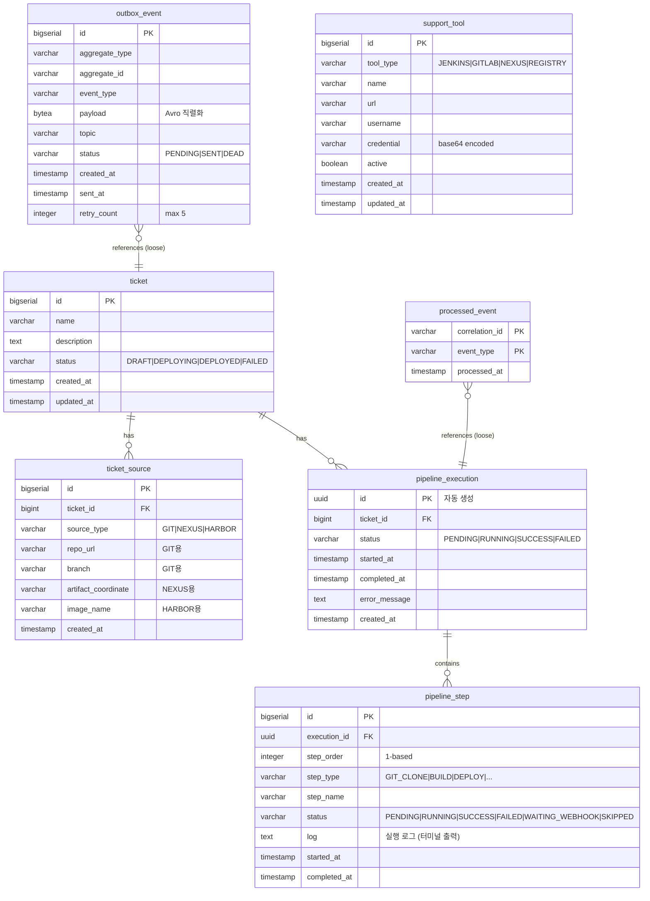

# Backend Deep Dive

이 문서는 Redpanda Playground 백엔드의 데이터베이스 설계, 핵심 기능 흐름, 이벤트/메시지 설계를 정리한다. 전체 프로젝트 개요는 [project-deep-dive.md](./project-deep-dive.md)를 참조한다.

---

## 1. 데이터베이스 설계

### ERD



### 테이블별 역할

**ticket + ticket_source**: 배포 대상을 정의한다. `source_type`에 따라 어떤 필드가 채워지는지 달라지는 다형적 설계다. GIT이면 `repo_url`/`branch`, NEXUS이면 `artifact_coordinate`, HARBOR이면 `image_name`을 사용한다. 이 소스 유형이 파이프라인 스텝 생성의 기준이 된다. 참고로 `SourceType`(GIT/NEXUS/HARBOR — 배포 소스 유형)과 `ToolType`(JENKINS/GITLAB/NEXUS/REGISTRY — 외부 도구 유형)은 별개의 enum이다.

**pipeline_execution + pipeline_step**: 파이프라인 실행 이력이다. `step_order`는 1부터 시작하며, SAGA 보상 시 역순 반복과 웹훅 재개 시 다음 스텝 인덱싱에 사용된다. `log` 필드에는 각 스텝의 실행 출력이 저장되어 프론트엔드 터미널 뷰에 표시된다.

**outbox_event**: Transactional Outbox 패턴의 핵심 테이블이다. `payload`는 BYTEA(바이너리)로, Avro 직렬화된 바이트가 직접 저장된다. `status = 'PENDING'`에 대한 부분 인덱스가 있어 폴러의 스캔 성능을 최적화한다. 5회 재시도 초과 시 `DEAD`로 표시된다.

**processed_event**: 멱등성 보장 테이블이다. `(correlation_id, event_type)` 복합 PK로 동일 이벤트의 중복 처리를 차단한다. 같은 `correlation_id`라도 다른 `event_type`은 별도 레코드로 허용된다.

**support_tool**: 외부 도구(Jenkins, GitLab, Nexus, Registry) 연결 정보를 런타임에 관리한다. `application.yml`에 하드코딩하지 않고 DB에서 관리하기 때문에, 앱 재시작 없이 도구를 추가/수정할 수 있다.

### Flyway 마이그레이션

| 버전 | 테이블 | 설명 |
|------|--------|------|
| V1 | `ticket`, `ticket_source` | 티켓 + 소스 관리. CASCADE 삭제. `uuid-ossp` 확장 필요 (`docker/init-db/01-init.sql`에서 설정) |
| V2 | `pipeline_execution`, `pipeline_step` | 파이프라인 실행 이력. UUID PK |
| V3 | `outbox_event` | Transactional Outbox. 부분 인덱스 |
| V4 | `processed_event` | 멱등성 보장. 복합 PK |
| V5 | `support_tool` | 외부 도구 + 시드 데이터 4건 |

---

## 2. 핵심 기능 흐름

> 상세: [docs/architecture/02-event-flow.md](../architecture/02-event-flow.md)

### 2-1. 티켓 생성 → 파이프라인 실행

```
POST /api/tickets
  → TicketService.create()
  → ticket INSERT + ticket_source INSERT (1:N)
  → 201 Created

POST /api/tickets/{id}/pipeline/start
  → PipelineService.startPipeline()
    1. 티켓 상태 → DEPLOYING
    2. PipelineExecution + Steps 생성 (소스 유형 기반)
    3. Outbox INSERT (PIPELINE_EXECUTION_STARTED 이벤트)
    4. 202 Accepted + trackingUrl 응답

[비동기]
  OutboxPoller (500ms 폴링)
    → outbox_event 조회 (최대 50건)
    → KafkaTemplate.send() (byte[] 직렬화)
    → playground.pipeline.commands 토픽 발행
    → outbox_event 상태 → SENT

  PipelineEventConsumer
    → 이벤트 수신 → 멱등성 체크
    → PipelineEngine.execute() (비동기 스레드풀)
```

202 Accepted 패턴을 사용하는 이유는, 파이프라인 실행이 수 분 이상 걸릴 수 있기 때문이다. 클라이언트는 응답과 함께 받은 SSE 엔드포인트로 진행 상태를 실시간 구독한다.

### 2-2. 파이프라인 실행 엔진

`PipelineEngine`이 SAGA Orchestrator 역할을 한다. 스텝 타입별 실행기(executor)가 매핑되어 있다:

| StepType | Executor | 동작 |
|----------|----------|------|
| GIT_CLONE | JenkinsCloneAndBuildStep | Jenkins Job 트리거 → 웹훅 대기 |
| BUILD | JenkinsCloneAndBuildStep | Jenkins Job 트리거 → 웹훅 대기 |
| ARTIFACT_DOWNLOAD | NexusDownloadStep | Nexus REST API로 아티팩트 검색 |
| IMAGE_PULL | RegistryImagePullStep | Docker Registry API로 이미지 존재 확인 |
| DEPLOY | RealDeployStep | Jenkins 배포 Job 트리거 → 웹훅 대기 |

실행 흐름:

```
PipelineEngine.execute(execution)
  → executeFrom(execution, fromIndex=0, startTime)
    for each step (순차):
      1. step.status → RUNNING
      2. executor.execute(execution, step)
      3-a. waitingForWebhook == true → 스레드 해제 (return)
      3-b. 성공 → step.status → SUCCESS → 다음 스텝
      3-c. 실패 → SagaCompensator.compensate() → execution.status → FAILED
    all steps done → execution.status → SUCCESS

  각 스텝 완료 시:
    → PipelineEventProducer → playground.pipeline.events 토픽
    → PipelineSseConsumer → SseEmitterRegistry.send() → 브라우저 SSE
```

### 2-3. Break-and-Resume (Jenkins 통합)

Jenkins처럼 오래 걸리는 외부 작업은 스레드를 점유하면 안 된다. 이 프로젝트는 "Break-and-Resume" 패턴으로 이 문제를 해결한다.

> 상세: [docs/patterns/05-break-and-resume.md](../patterns/05-break-and-resume.md)

```
[PipelineEngine]
  step.execute() → Jenkins Job 트리거 (fire-and-forget)
  step.waitingForWebhook = true
  → 엔진이 return → 스레드 해제

[Jenkins]
  빌드 완료 → POST http://playground-connect:4197/webhook/jenkins

[Redpanda Connect: jenkins-webhook.yaml]
  HTTP 수신 → payload 매핑 → playground.webhook.inbound 토픽 발행
  (전송만 담당, 비즈니스 로직 없음)

[WebhookEventConsumer]
  토픽 소비 → key 기반 라우팅 (JENKINS)
  → JenkinsWebhookHandler
    → 멱등성 체크
    → PipelineEngine.resumeAfterWebhook(executionId, stepOrder, result, buildLog)

[PipelineEngine.resumeAfterWebhook()]
  CAS: stepMapper.updateStatusIfCurrent(WAITING_WEBHOOK → SUCCESS/FAILED)
  → 성공: executeFrom(execution, nextStepIndex) → 다음 스텝부터 재개
  → 실패: SagaCompensator.compensate() → 보상 실행
```

CAS(Compare-And-Swap)가 중요한 이유: 웹훅 콜백과 타임아웃 체커가 동시에 같은 스텝의 상태를 변경하려 할 수 있다. `updateStatusIfCurrent`로 선착순 1건만 성공하도록 경쟁 조건을 방지한다.

### 2-4. SAGA 보상 (실패 시뮬레이션)

> 상세: [docs/patterns/02-saga-orchestrator.md](../patterns/02-saga-orchestrator.md)

```
POST /api/tickets/{id}/pipeline/start-with-failure
  → PipelineService에서 injectRandomFailure()
  → 랜덤 스텝에 [FAIL] 마커 삽입

해당 스텝 실행 시:
  → executor가 [FAIL] 감지 → 예외 발생
  → PipelineEngine이 catch
  → SagaCompensator.compensate(execution, failedStepOrder, stepExecutors)
    → 완료된 스텝을 역순(failedStepOrder-2 → 0) 반복
    → status == SUCCESS인 스텝만 보상
    → executor.compensate(execution, step)
      → 성공: step.status → SKIPPED ("Compensated after saga rollback")
      → 실패: step.status → FAILED ("COMPENSATION_FAILED: ...") + 수동 개입 로그
  → execution.status → FAILED
  → SSE로 각 보상 결과 실시간 알림
```

보상은 best-effort다. 개별 보상 실패가 전체 보상 루프를 중단시키지 않는다. `COMPENSATION_FAILED` 상태와 로그 메시지가 운영자에게 수동 개입이 필요하다는 신호다.

---

## 3. 이벤트/메시지 설계

> 상세: [docs/patterns/07-topic-message-design.md](../patterns/07-topic-message-design.md)

### 토픽 목록

| 토픽 | 파티션 | 보관 | 직렬화 | 용도 |
|------|--------|------|--------|------|
| `playground.pipeline.commands` | 3 | 7일 | Avro | 파이프라인 실행 커맨드 |
| `playground.pipeline.events` | 3 | 7일 | Avro | 스텝 변경/완료 이벤트 |
| `playground.ticket.events` | 3 | 7일 | Avro | 티켓 생성 이벤트 |
| `playground.webhook.inbound` | 2 | 3일 | JSON (Connect 수신) | 외부 웹훅 수신 |
| `playground.audit.events` | 1 | 30일 | Avro | 감사 이벤트 |
| `playground.dlq` | 1 | 30일 | - | Dead Letter Queue |

네이밍 규칙은 `playground.{도메인}.{유형}`이다. 파이프라인/티켓 토픽은 3 파티션으로 병렬 처리하고, 감사/DLQ는 순서 보장이 중요하므로 1 파티션이다. 웹훅은 보관 기간이 짧다(3일) — 처리 후 재참조할 일이 거의 없기 때문이다.

### Avro 스키마 구조

모든 도메인 이벤트는 `EventMetadata`를 내장(composition)한다:

```
EventMetadata (공통)
├── eventId: string       # CloudEvents ce-id (UUID)
├── correlationId: string # 관련 이벤트 연결 (멱등성 키)
├── eventType: string     # 이벤트 유형 식별자
├── timestamp: long       # 생성 시각 (ms)
└── source: string        # 발행 서비스/컴포넌트
```

도메인별 스키마:

| 스키마 | 핵심 필드 |
|--------|----------|
| PipelineExecutionStartedEvent | metadata, executionId, ticketId, steps(string[]) |
| PipelineExecutionCompletedEvent | metadata, executionId, ticketId, status, durationMs, errorMessage |
| PipelineStepChangedEvent | metadata, executionId, ticketId, stepName, stepType, status, log |
| TicketCreatedEvent | metadata, ticketId, name, sourceTypes(SourceType[]) |
| WebhookEvent | metadata, webhookSource, payload(raw JSON), headers(map) |
| AuditEvent | metadata, actor, action, resourceType, resourceId, details |
| JenkinsBuildCommand | metadata, executionId, ticketId, stepOrder, jobName, params |

직렬화 방식의 특이점: `application.yml`에서 Producer는 `ByteArraySerializer`, Consumer는 `ByteArrayDeserializer`를 사용한다. Avro 직렬화/역직렬화를 코드에서 직접 수행하며(`AvroSerializer` 유틸), Schema Registry 기반 자동 serde를 쓰지 않는다. Outbox 테이블의 `payload`가 BYTEA인 것도 이 때문이다.

### CloudEvents 헤더 규칙

`CloudEventsHeaderInterceptor`가 Producer의 모든 메시지에 CloudEvents 헤더를 추가한다. OutboxPoller에서도 `ce_type`과 `eventType` 헤더를 직접 설정한다.
