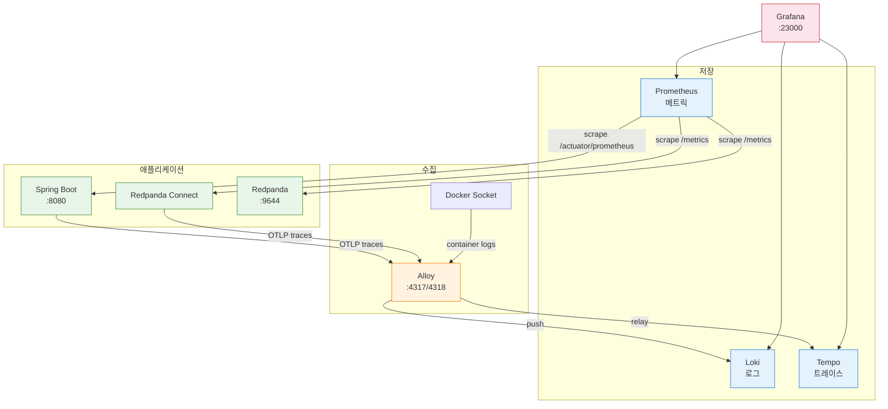

# Monitoring Guide

이 문서는 Redpanda Playground의 분산 모니터링 환경(Grafana, Loki, Tempo, Alloy, Prometheus)의 구성, 설정, 사용법을 정리한다. 전체 프로젝트 개요는 [project-deep-dive.md](./project-deep-dive.md)를 참조한다.

---

## 1. 아키텍처



각 컴포넌트의 역할은 다음과 같다.

| 서비스 | 포트 | 메모리 | 역할 |
|--------|------|--------|------|
| Grafana | `localhost:23000` | 256MB | 대시보드 UI, 로그/트레이스/메트릭 탐색 |
| Loki | 내부 3100 | 256MB | 로그 저장/쿼리 (LogQL), 3일 보존 |
| Tempo | 내부 3200 | 1GB | 트레이스 저장/쿼리 (TraceQL), 3일 보존 |
| Alloy | `localhost:24317-24318` | 192MB | Docker 로그 수집 + OTLP 릴레이 |
| Prometheus | `localhost:29090` | 256MB | 메트릭 스크래핑, 15초 간격, 3일 보존 |

전체 약 2GB 메모리를 사용한다. Tempo는 WAL replay 시 메모리를 많이 소모하므로 256MB에서 1GB로 올렸다(256MB/512MB에서 OOM killed 발생).

---

## 2. 시작하기

### 2-1. 전제 조건

Core 인프라(Redpanda, PostgreSQL, Connect)가 먼저 실행되어야 한다. `playground-net` 네트워크를 공유하기 때문이다.

```bash
make infra          # Core 인프라 시작
make monitoring     # 모니터링 스택 시작
```

### 2-2. 접속 URL

```
Grafana:    http://localhost:23000   (로그인 불필요, 익명 Admin)
Prometheus: http://localhost:29090
Alloy UI:   http://localhost:24312
```

### 2-3. 중지

```bash
make monitoring-down   # 모니터링만 중지
make infra-down        # 전체 중지 (모니터링 포함)
```

---

## 3. 컴포넌트 개념

### 3-1. Loki — 로그 집계 시스템

Loki는 Grafana Labs가 만든 로그 집계 시스템이다. "Prometheus처럼 동작하는 로그 시스템"이라고 불린다. Elasticsearch(ELK 스택)와 같은 역할을 하지만 설계 철학이 다르다.

Elasticsearch는 로그 본문 전체를 full-text 인덱싱한다. 검색은 빠르지만 인덱스 구축에 CPU/메모리/디스크를 많이 쓴다. 반면 Loki는 **라벨만 인덱싱**하고 로그 본문은 압축 저장만 한다. `{container="playground-connect"}`처럼 라벨로 스트림을 선택한 뒤, 필요하면 `|= "ERROR"` 같은 필터로 본문을 순차 검색한다. 인덱스가 작아서 256MB 메모리로도 충분히 돌아간다.

이 프로젝트에서 Loki에 들어오는 로그의 라벨 구조는 다음과 같다.

```
{container="playground-connect", compose_project="docker", compose_service="connect"}
{container="playground-redpanda", compose_project="docker", compose_service="redpanda"}
```

Loki 자체는 로그를 수집하지 않는다. 로그를 밀어넣어 주는 클라이언트(Alloy, Promtail 등)가 필요하다. 이 프로젝트에서는 Alloy가 그 역할을 한다.

### 3-2. Alloy — 통합 텔레메트리 수집기

Alloy는 Grafana Labs가 만든 OpenTelemetry Collector 기반의 통합 수집기다. 기존 Grafana Agent(promtail, agent 등 여러 바이너리)를 하나로 통합한 것이다.

왜 Alloy를 쓰는가? Docker 컨테이너는 stdout/stderr로만 로그를 출력한다. Redpanda Connect처럼 파일 로깅 옵션이 없는 애플리케이션도 많다. Alloy가 Docker 소켓(`/var/run/docker.sock`)을 마운트하여 모든 컨테이너의 stdout을 실시간으로 읽고 Loki에 전송한다. 이것이 Docker 환경에서 로그를 중앙 수집하는 표준적인 방법이다.

Alloy는 이 프로젝트에서 2가지 역할을 한다.

1. **로그 수집**: Docker 소켓 → playground-* 컨테이너 로그 수집 → Loki 전송
2. **OTLP 릴레이**: Spring Boot/Connect가 보낸 트레이스를 수신 → 노이즈 필터링 → Tempo 전송

설정은 HCL 유사 문법의 `.alloy` 파일을 사용한다. 컴포넌트를 파이프라인처럼 연결하는 구조다.

```
[Docker Socket] → discovery.docker → loki.source.docker → loki.process → loki.write → [Loki]
[OTLP 수신]    → otelcol.receiver.otlp → otelcol.processor.filter → otelcol.exporter.otlphttp → [Tempo]
```

Alloy UI(`localhost:24312`)에서 파이프라인 상태와 각 컴포넌트의 처리량을 시각적으로 확인할 수 있다.

### 3-3. Loki와 `docker logs`의 차이

`docker logs` 명령도 컨테이너 로그를 보여주지만, 한계가 있다.

| | `docker logs` | Loki (Grafana) |
|---|---|---|
| 검색 | `grep`으로 텍스트 매칭 | LogQL로 라벨+패턴 필터링 |
| 시간 범위 | `--since`/`--until` 수준 | 초 단위 정밀 시간 범위 |
| 여러 컨테이너 | 컨테이너마다 개별 실행 | `{container=~"playground.*"}`로 한번에 |
| 트레이스 연결 | 불가 | traceId 클릭 → Tempo 점프 |
| 보존 | Docker 재시작 시 소멸 가능 | 3일 보존 (설정 가능) |
| 호스트 파일 | macOS Docker Desktop에서 접근 불가 | Grafana 웹 UI로 접근 |

---

## 4. 데이터 흐름별 설정

### 4-1. 로그 (Docker → Alloy → Loki)

Alloy가 Docker 소켓(`/var/run/docker.sock`)을 통해 `playground-*` 컨테이너의 로그를 자동 수집하여 Loki로 전송한다. 별도 설정 없이 컨테이너가 기동되면 로그가 쌓인다.

설정 파일: `docker/monitoring/alloy-config.alloy`

주의사항:
- **GitLab 제외**: GitLab은 로그량이 과도하여(~1MB/s) Loki 인제스트 제한을 초과하므로 수집 대상에서 drop했다.
- **Java 멀티라인**: 스택트레이스를 하나의 로그 엔트리로 조인한다. `^\\d{4}-\\d{2}-\\d{2}` 패턴으로 새 로그 라인을 인식한다.
- **Spring Boot 로그 미수집**: Spring Boot는 호스트에서 실행되므로 Docker 로그 수집 대상이 아니다. 트레이스/메트릭은 정상 수집된다.
- **Connect 로그 파일 접근 불가**: Connect는 stdout-only 출력이고 파일 로깅을 지원하지 않는다. Docker Desktop macOS에서는 컨테이너 로그 파일(`/var/lib/docker/containers/...`)이 VM 내부에 있어 호스트에서 직접 접근할 수 없다. Loki를 통한 Grafana 검색이 유일한 중앙 로그 접근 방법이다.

### 4-2. 트레이스 (OTel → Alloy → Tempo)

두 경로로 트레이스가 수집된다.

**Spring Boot → Tempo:**
OTel Java Agent가 Spring MVC, Kafka Producer/Consumer, JDBC를 자동 계측한다. `build.gradle`의 `bootRun` 태스크에서 `lib/opentelemetry-javaagent.jar`가 존재하면 자동으로 attach된다.

```
Spring Boot → OTLP HTTP (localhost:24318) → Alloy → Tempo
```

**Redpanda Connect → Tempo:**
`observability.yaml`에 `open_telemetry_collector` tracer가 설정되어 있다. Connect가 메시지를 처리할 때 자동으로 스팬을 생성하며, Kafka 메시지의 `traceparent` 헤더와 연결된다.

```
Connect → OTLP HTTP (alloy:4318) → Alloy → Tempo
```

**노이즈 트레이스 필터링 (2단계 전략):**

반복 실행되는 스케줄링 및 인프라 트레이스는 Tempo 저장소를 낭비하므로 2단계로 제거한다.

1단계 — OTel Agent에서 `OTEL_INSTRUMENTATION_SPRING_SCHEDULING_ENABLED=false`로 `@Scheduled` 계측을 비활성화한다. OutboxPoller(500ms)와 WebhookTimeoutChecker(30s) 메서드의 루트 스팬이 생성되지 않는다. 왜 Alloy가 아닌 Agent에서 비활성화하는가? Alloy의 span-level 필터(`otelcol.processor.filter`)로 루트 스팬만 드롭하면 자식 스팬(JDBC 등)이 남아 Tempo에서 `<root span not yet received>`가 표시된다.

2단계 — Alloy 필터로 남은 노이즈 스팬을 드롭한다. 스케줄링 비활성화 후에도 JDBC 자동 계측이 독립 root 스팬을 생성하기 때문이다. 모두 자식 없는 단독 스팬이므로 orphan 문제 없이 안전하게 드롭된다.

```alloy
otelcol.processor.filter "noise" {
  traces {
    span = [
      "IsMatch(name, \"SELECT playground.outbox_event.*\")",   # Outbox 폴링 JDBC
      "IsMatch(name, \"UPDATE playground.outbox_event.*\")",   # Outbox 상태 업데이트
      "name == \"playground\"",                                # DB 커넥션 체크
      "name == \"GET /actuator/prometheus\"",                  # Prometheus 스크래핑
    ]
  }
}
```

`@Scheduled` 에러 모니터링은 Loki(로그)와 Prometheus(에러 메트릭)로 대체한다.

### 4-3. 메트릭 (Prometheus scrape)

Prometheus가 15초 간격으로 4개 타겟을 스크래핑한다.

| Job | 타겟 | 메트릭 경로 |
|-----|------|------------|
| `spring-boot` | `host.docker.internal:8080` | `/actuator/prometheus` |
| `redpanda` | `redpanda:9644` | `/metrics` |
| `connect-command` | `connect:4195` | `/metrics` |
| `connect-webhook` | `connect:4198` | `/metrics` |

설정 파일: `docker/monitoring/prometheus.yml`

---

## 5. Grafana 사용법

### 5-1. 로그 탐색 (Loki)

1. Grafana > **Explore** (좌측 나침반 아이콘)
2. 상단 데이터소스 → **Loki** 선택
3. 쿼리 예시:

```logql
# 모든 playground 컨테이너 로그
{container=~"playground.*"}

# Connect만
{container="playground-connect"}

# ERROR 레벨만
{container=~"playground.*"} |= "ERROR"

# 특정 execution_id 추적
{container=~"playground.*"} |= "9aacb626-bbbe-467d"
```

### 5-2. 트레이스 탐색 (Tempo)

1. Grafana > **Explore**
2. 상단 데이터소스 → **Tempo** 선택
3. **Search** 탭에서:
   - Service Name: `redpanda-playground` 또는 `redpanda-connect`
   - 시간 범위 조정 (Last 1 hour)
4. 트레이스 클릭 → **워터폴 뷰**로 스팬 타이밍/호출 흐름 확인

TraceQL 쿼리 예시:
```
{resource.service.name = "redpanda-playground"}
{span.http.route = "/api/tickets"}
{duration > 500ms}
```

### 5-3. 메트릭 탐색 (Prometheus)

1. Grafana > **Explore**
2. 상단 데이터소스 → **Prometheus** 선택
3. 쿼리 예시:

```promql
# 모든 타겟 상태
up

# Spring Boot HTTP 요청 수
http_server_requests_seconds_count

# Kafka 컨슈머 레코드 수
kafka_consumer_records_consumed_total

# Redpanda 파티션 수
redpanda_kafka_partitions
```

### 5-4. 로그 → 트레이스 연결

Loki 데이터소스에 Derived Field가 설정되어 있어, 로그에서 `traceId=...` 패턴을 발견하면 Tempo로 자동 링크된다. 로그 라인의 traceId 링크를 클릭하면 해당 트레이스로 점프한다.

---

## 6. OTel Java Agent 설정

### 6-1. 자동 attach 원리

`app/build.gradle`의 `bootRun` 태스크에서 `lib/opentelemetry-javaagent.jar` 파일 존재 여부를 체크한다. 파일이 있으면 `-javaagent` JVM 인자와 OTLP 환경변수를 자동 설정한다. IntelliJ에서 bootRun을 실행해도 동일하게 동작한다.

```groovy
tasks.named('bootRun') {
    def agentJar = rootProject.file('lib/opentelemetry-javaagent.jar')
    if (agentJar.exists()) {
        jvmArgs "-javaagent:${agentJar.absolutePath}"
        environment 'OTEL_SERVICE_NAME', 'redpanda-playground'
        // ...
    }
}
```

### 6-2. Agent 다운로드

JAR은 `.gitignore`에 추가되어 있으므로, 새 환경에서는 직접 다운로드해야 한다.

```bash
mkdir -p lib
curl -sL https://github.com/open-telemetry/opentelemetry-java-instrumentation/releases/latest/download/opentelemetry-javaagent.jar \
  -o lib/opentelemetry-javaagent.jar
```

### 6-3. Agent 비활성화

JAR 파일을 삭제하거나 이름을 바꾸면 Agent 없이 실행된다.

```bash
mv lib/opentelemetry-javaagent.jar lib/opentelemetry-javaagent.jar.bak
```

### 6-4. 자동 계측과 수동 계측의 경계

OTel Java Agent는 프레임워크 경계를 자동으로 계측한다. 하지만 애플리케이션이 의도적으로 만든 비동기 경계는 자동으로 넘지 못한다. 어디까지가 자동이고 어디서부터 수동 코드가 필요한지 구분해야 한다.

**자동 계측 (코드 변경 없이 Agent가 처리):**

| 경계 | 동작 | trace 연결 |
|------|------|-----------|
| HTTP 요청 → 서비스 로직 | Spring MVC 스팬 자동 생성 | 하나의 trace 안에서 연결 |
| 서비스 로직 → JDBC 쿼리 | SQL 스팬 자동 생성 | 부모 스팬의 자식으로 연결 |
| KafkaTemplate.send() | Producer 스팬 생성 + `traceparent` 헤더 삽입 | Kafka 메시지로 전파 |
| @KafkaListener 수신 | Consumer 스팬 생성 + `traceparent` 헤더에서 context 복원 | Producer trace에 연결 |

Agent가 이것들을 자동 처리할 수 있는 이유는, 프레임워크 API 호출 시점에 현재 스레드의 trace context가 살아 있기 때문이다. HTTP 요청 스레드에서 KafkaTemplate.send()를 호출하면 Agent가 현재 context를 읽어 Kafka 헤더에 넣을 수 있다.

**수동 계측이 필요한 경우 (Agent가 자동으로 못 하는 것):**

| 경계 | 왜 자동이 안 되는가 | 해결 |
|------|---------------------|------|
| Outbox 패턴 (DB → 별도 스레드 → Kafka) | DB에 저장 후 다른 스레드에서 폴링하므로 원래 trace context가 소멸 | traceparent를 DB에 함께 저장, 폴링 시 복원 |
| 외부 시스템 콜백 (Jenkins webhook) | Jenkins가 trace context를 전파하지 않음 | 연결 불가 (블랙박스) |
| 커스텀 스레드풀 / CompletableFuture | 스레드 전환 시 context가 전파되지 않을 수 있음 | `Context.current().wrap()` 사용 |

핵심 원리: **trace context는 스레드 로컬에 존재한다.** 같은 스레드 안에서 일어나는 프레임워크 호출은 Agent가 자동 연결한다. 그러나 DB 저장 → 별도 스레드 폴링처럼 스레드 경계를 넘으면서 동시에 프레임워크가 아닌 커스텀 로직으로 연결되는 경우, context를 명시적으로 저장/복원하는 코드가 필요하다.

이 프로젝트에서 수동 계측이 필요한 유일한 지점이 Outbox 패턴이며, `EventPublisher`에서 traceparent를 캡처하고 `OutboxPoller`에서 복원하는 코드로 해결했다 (섹션 9 참조).

**비활성화한 자동 계측:**

- **Spring Scheduling** (`OTEL_INSTRUMENTATION_SPRING_SCHEDULING_ENABLED=false`): OutboxPoller(500ms)와 WebhookTimeoutChecker(30s)가 반복 실행되어 대량의 노이즈 트레이스를 생성하므로 비활성화했다. OutboxPoller는 수동 계측으로 대체했고, WebhookTimeoutChecker 에러는 Loki/Prometheus로 모니터링한다.

---

## 7. Connect 관측성 설정

### 7-1. streams 모드와 observability.yaml

Redpanda Connect는 `streams --chilled` 모드로 실행된다. 이 모드에서 `tracer`, `logger`, `metrics`, `http`는 파이프라인별이 아닌 서비스 전역 설정이다. 따라서 `-o` 플래그로 별도 파일(`observability.yaml`)에 둔다.

```bash
# docker-compose.yml의 command
redpanda-connect streams --chilled \
  -o /etc/connect/observability.yaml \
  /etc/connect/jenkins-command.yaml \
  /etc/connect/jenkins-webhook.yaml \
  /etc/connect/gitlab-webhook.yaml
```

설정 파일: `docker/connect/observability.yaml`

### 7-2. Connect 메트릭

Prometheus가 Connect의 `/metrics` 엔드포인트를 스크래핑한다. 주요 메트릭:

| 메트릭 | 설명 |
|--------|------|
| `input_received_total` | 입력 메시지 수 |
| `output_sent_total` | 출력 메시지 수 |
| `output_error_total` | 출력 에러 수 |
| `processor_batch_duration_ns` | 프로세서 처리 시간 |

---

## 8. 설정 파일 맵

```
docker/
├── docker-compose.monitoring.yml     # 모니터링 5개 서비스 정의
├── connect/
│   └── observability.yaml            # Connect 전역 관측성 (tracer/logger/metrics)
└── monitoring/
    ├── alloy-config.alloy            # Docker 로그 수집 + OTLP 릴레이
    ├── loki-config.yaml              # Loki filesystem 모드
    ├── tempo-config.yaml             # Tempo filesystem 모드
    ├── prometheus.yml                # 스크래핑 대상
    └── grafana/
        └── provisioning/
            ├── datasources/
            │   └── datasources.yaml  # Loki, Tempo, Prometheus 자동 등록
            └── dashboards/
                └── dashboards.yaml   # 대시보드 프로바이더
```

---

## 9. Outbox E2E 트레이스 연결

Outbox 패턴에서 HTTP 요청과 Kafka 발행이 별도 스레드에서 실행되어 trace가 끊기는 문제를 해결했다. `outbox_event` 테이블에 W3C `traceparent`를 저장하고, OutboxPoller가 발행 시 해당 context를 복원한다.

```
[HTTP POST /api/tickets]
  └─ [INSERT outbox_event (traceparent 저장)]
  └─ [OutboxPoller.publish (traceparent 복원)]    ← 같은 trace
      └─ [KafkaTemplate.send]                     ← traceparent 헤더 전파
          └─ [Connect kafka_franz consume]         ← trace 계속
              └─ [HTTP POST Jenkins]
```

구현:
- `EventPublisher.publish()`: 현재 활성 스팬의 traceId+spanId를 W3C traceparent 형식(`00-{traceId}-{spanId}-01`)으로 캡처하여 outbox 이벤트에 저장한다.
- `OutboxPoller.publishWithTraceContext()`: 저장된 traceparent를 `SpanContext.createFromRemoteParent()`로 파싱하고, 해당 context 하위에 `OutboxPoller.publish` 스팬을 생성한 뒤 Kafka 발행을 실행한다. OTel Agent가 KafkaTemplate을 자동 계측하므로 Kafka 메시지에 `traceparent` 헤더가 전파되고, Connect가 이를 이어받는다.
- OTel Agent 없이 실행하면 `Span.current().getSpanContext().isValid()`가 false를 반환하여 traceparent를 저장하지 않는다. 기존 동작과 동일하다.

---

## 10. 알려진 제약사항

### Jenkins 블랙박스

Connect → Jenkins HTTP 호출 후 Jenkins 내부는 추적 불가하다. Jenkins가 빌드를 완료하고 webhook 콜백을 보내면 새 trace가 시작된다.

### Spring Boot 로그 미수집

Spring Boot는 Docker 컨테이너가 아닌 호스트에서 실행되므로 Alloy가 로그를 수집하지 못한다. 트레이스와 메트릭은 OTLP/Prometheus로 정상 수집된다. 로그는 터미널 또는 IntelliJ 콘솔에서 확인한다.

---

## 11. 트러블슈팅

### Tempo에 트레이스가 안 보일 때

1. `lib/opentelemetry-javaagent.jar` 파일이 존재하는지 확인
2. Spring Boot 시작 로그에서 `[otel.javaagent]` 로그가 출력되는지 확인
3. Alloy가 실행 중인지 확인: `docker ps | grep alloy`
4. Alloy → Tempo 연결 확인: `docker logs playground-alloy 2>&1 | grep -i error`
5. Alloy 메트릭으로 수신/전송 통계 확인: `curl http://localhost:24312/metrics | grep otelcol_`
6. Tempo가 OOM으로 재시작된 경우 WAL 데이터가 블록으로 플러시되지 않았을 수 있다. `docker compose -f docker-compose.monitoring.yml restart tempo`로 WAL을 강제 플러시한다.

### Tempo OOM (exit 137)

Tempo는 WAL replay 시 메모리를 많이 소모한다. `docker logs playground-tempo`에서 로그 없이 종료되면 OOM killed를 의심한다. `docker-compose.monitoring.yml`의 memory limit을 확인한다. 현재 1GB로 설정되어 있으며, 256MB와 512MB에서 반복 OOM이 발생했다.

### Grafana에서 Tempo Bad Gateway

Tempo 컨테이너가 중단되었을 가능성이 높다. `docker ps`로 상태를 확인하고, 재시작 후 healthy 상태가 될 때까지 기다린다(약 10초).

### Loki 인제스트 에러

`ingestion rate limit exceeded` 에러가 발생하면 `loki-config.yaml`의 `ingestion_rate_mb`를 올린다. 현재 10MB/s로 설정되어 있다.

### Prometheus 타겟이 DOWN일 때

`http://localhost:29090` > Status > Targets에서 실패 원인을 확인한다. Spring Boot가 꺼져 있으면 `spring-boot` 타겟이 DOWN으로 표시되는데, 이건 정상이다.

### Connect tracer가 동작하지 않을 때

Connect 로그에서 `field tracer not recognised` 경고가 나오면, tracer 설정이 파이프라인 YAML에 들어간 것이다. streams 모드에서는 `observability.yaml`(-o 플래그)에만 넣어야 한다.

---

## 12. 향후 개선

### Tail-based Sampling

현재는 Alloy의 `otelcol.processor.filter`로 특정 스팬을 이름 기반으로 드롭하는 방식이다. `07_Observability` PoC에서는 OTel Collector의 `tail_sampling` 프로세서로 더 정교한 전략을 구현했다.

```yaml
# 07_Observability PoC의 OTel Collector 설정
processors:
  tail_sampling:
    decision_wait: 5s
    policies:
      - name: error-policy        # 에러 트레이스는 항상 저장
        type: status_code
        status_code: { status_codes: [ERROR] }
      - name: latency-policy      # 500ms 초과는 저장
        type: latency
        latency: { threshold_ms: 500 }
      - name: probabilistic       # 나머지는 10% 샘플링
        type: probabilistic
        probabilistic: { sampling_percentage: 10 }
```

현재 Alloy는 `tail_sampling` 프로세서를 지원하지 않아 적용하지 못했다. 트레이스 볼륨이 증가하면 Alloy 대신 OTel Collector를 도입하여 tail-based sampling을 적용하는 것을 검토한다. 장점은 앱의 SDK sampling 비율을 100%로 유지하면서(전수 수집) Collector에서 중요한 트레이스만 선별 저장할 수 있다는 것이다.

### Kafka Observation API vs OTel Agent

Spring Kafka의 `observation-enabled: true` 설정은 Micrometer Observation API를 통해 Kafka Producer/Consumer를 계측한다. 하지만 OTel Java Agent가 이미 Kafka 클라이언트 라이브러리 레벨에서 자동 계측하고 있으므로, 둘을 동시에 활성화하면 중복 스팬이 생성될 수 있다. 현재는 OTel Agent만 사용한다.
