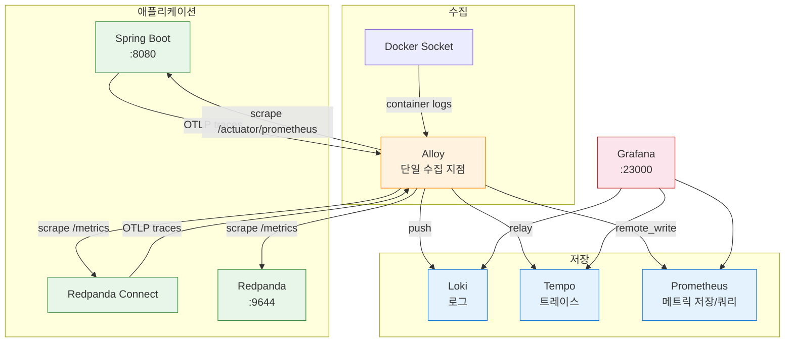

# Monitoring Architecture Overview

이 문서는 Redpanda Playground 분산 모니터링 환경의 전체 아키텍처, 컴포넌트 역할, 시작 방법을 다룬다. 데이터 흐름별 설정은 [02-setup-and-usage.md](./02-setup-and-usage.md), OTel 계측은 [03-otel-instrumentation.md](./03-otel-instrumentation.md), 트러블슈팅은 [07-troubleshooting.md](./07-troubleshooting.md)을 참조한다.

---

## 1. 아키텍처



모든 텔레메트리 신호(로그, 트레이스, 메트릭)가 Alloy를 단일 수집 지점으로 거쳐 각 백엔드로 라우팅된다.

---

## 2. 시작하기

### 2-1. 전제 조건

Core 인프라(Redpanda, PostgreSQL, Connect)가 먼저 실행되어야 한다. `playground-net` 네트워크를 공유하기 때문이다.

```bash
make infra          # Core 인프라 시작
make monitoring     # 모니터링 스택 시작
```

### 2-2. 접속 URL

```
Grafana:    http://localhost:23000   (로그인 불필요, 익명 Admin)
Prometheus: http://localhost:29090
Alloy UI:   http://localhost:24312
```

### 2-3. 중지

```bash
make monitoring-down   # 모니터링만 중지
make infra-down        # 전체 중지 (모니터링 포함)
```

---

## 3. 컴포넌트 개념

### 3-1. 설정 파일 매핑

각 컴포넌트가 어떤 파일로 설정되고 이 프로젝트에서 어떤 역할을 담당하는지 정리한다.

| 컴포넌트 | 서비스 정의 | 설정 파일 | 이 프로젝트에서 하는 일 |
|----------|------------|----------|----------------------|
| Loki | `docker-compose.monitoring.yml` | `monitoring/loki-config.yaml` | Alloy가 보낸 로그를 filesystem 모드로 저장, 3일 보존 |
| Tempo | `docker-compose.monitoring.yml` | `monitoring/tempo-config.yaml` | Alloy가 릴레이한 OTLP 트레이스를 저장, WAL → 블록 플러시 |
| Alloy | `docker-compose.monitoring.yml` | `monitoring/alloy-config.alloy` | 단일 수집 지점: 로그 + OTLP 릴레이 + 메트릭 스크래핑 |
| Prometheus | `docker-compose.monitoring.yml` | `monitoring/prometheus.yml` (비어 있음) | Alloy의 remote_write를 수신하여 TSDB에 저장, PromQL 쿼리 |
| Grafana | `docker-compose.monitoring.yml` | `monitoring/grafana/provisioning/` | 데이터소스 3개 자동 등록, Derived Field로 로그↔트레이스 연결 |
| OTel Agent | `app/build.gradle` (bootRun) | 환경변수 (OTEL_*) | Spring Boot HTTP/JDBC/Kafka 자동 계측, Alloy로 OTLP 전송 |
| Connect tracer | `docker-compose.yml` (command) | `connect/observability.yaml` | Connect 메시지 처리 스팬 생성, Alloy로 OTLP 전송 |

### 3-2. 포트 및 메모리

| 서비스 | 포트 | 메모리 | 역할 |
|--------|------|--------|------|
| Grafana | `localhost:23000` | 256MB | 대시보드 UI, 로그/트레이스/메트릭 탐색 |
| Loki | 내부 3100 | 256MB | 로그 저장/쿼리 (LogQL), 3일 보존 |
| Tempo | 내부 3200 | 1GB | 트레이스 저장/쿼리 (TraceQL), 3일 보존 |
| Alloy | `localhost:24317-24318` | 192MB | 단일 수집 지점: 로그 + OTLP 릴레이 + 메트릭 스크래핑 |
| Prometheus | `localhost:29090` | 256MB | 메트릭 저장(TSDB) + 쿼리(PromQL), 3일 보존 |

전체 약 2GB 메모리를 사용한다. Tempo는 WAL replay 시 메모리를 많이 소모하므로 256MB에서 1GB로 올렸다(256MB/512MB에서 OOM killed 발생).

### 3-3. Loki — 로그 집계 시스템

Loki는 Grafana Labs가 만든 로그 집계 시스템이다. "Prometheus처럼 동작하는 로그 시스템"이라고 불린다. Elasticsearch(ELK 스택)와 같은 역할을 하지만 설계 철학이 다르다.

Elasticsearch는 로그 본문 전체를 full-text 인덱싱한다. 검색은 빠르지만 인덱스 구축에 CPU/메모리/디스크를 많이 쓴다. 반면 Loki는 **라벨만 인덱싱**하고 로그 본문은 압축 저장만 한다. `{container="playground-connect"}`처럼 라벨로 스트림을 선택한 뒤, 필요하면 `|= "ERROR"` 같은 필터로 본문을 순차 검색한다. 인덱스가 작아서 256MB 메모리로도 충분히 돌아간다.

이 프로젝트에서 Loki에 들어오는 로그의 라벨 구조는 다음과 같다.

```
{container="playground-connect", compose_project="docker", compose_service="connect"}
{container="playground-redpanda", compose_project="docker", compose_service="redpanda"}
```

Loki 자체는 로그를 수집하지 않는다. 로그를 밀어넣어 주는 클라이언트(Alloy, Promtail 등)가 필요하다. 이 프로젝트에서는 Alloy가 그 역할을 한다.

### 3-4. Alloy — 통합 텔레메트리 수집기

Alloy는 Grafana Labs가 만든 OpenTelemetry Collector 기반의 통합 수집기다. 기존 Grafana Agent(promtail, agent 등 여러 바이너리)를 하나로 통합한 것이다.

왜 Alloy를 쓰는가? Docker 컨테이너는 stdout/stderr로만 로그를 출력한다. Redpanda Connect처럼 파일 로깅 옵션이 없는 애플리케이션도 많다. Alloy가 Docker 소켓(`/var/run/docker.sock`)을 마운트하여 모든 컨테이너의 stdout을 실시간으로 읽고 Loki에 전송한다. 이것이 Docker 환경에서 로그를 중앙 수집하는 표준적인 방법이다.

Alloy는 이 프로젝트에서 3가지 역할을 한다. 모든 텔레메트리 신호가 Alloy를 거쳐 각 백엔드로 라우팅되는 "단일 수집 지점" 구조다.

1. **로그 수집**: Docker 소켓 → playground-* 컨테이너 로그 수집 → trace_id Structured Metadata 추출 → Loki 전송
2. **OTLP 릴레이**: Spring Boot/Connect가 보낸 트레이스를 수신 → 노이즈 필터링 → Tempo 전송
3. **메트릭 스크래핑**: 4개 타겟(Spring Boot, Redpanda, Connect×2)을 직접 스크래핑 → remote_write로 Prometheus에 전송

설정은 HCL 유사 문법의 `.alloy` 파일을 사용한다. 컴포넌트를 파이프라인처럼 연결하는 구조다.

#### Alloy 파이프라인 구조

```
[Docker Socket] → discovery.docker → loki.source.docker → loki.process "multiline" → loki.process "extract_trace" → loki.write → [Loki]
[OTLP 수신]    → otelcol.receiver.otlp → otelcol.processor.filter → otelcol.exporter.otlphttp → [Tempo]
[메트릭 타겟]  → prometheus.scrape × 4 → prometheus.remote_write → [Prometheus]
```

Alloy UI(`localhost:24312`)에서 파이프라인 상태와 각 컴포넌트의 처리량을 시각적으로 확인할 수 있다.

### 3-5. Alloy 수집 범위 — 단일 호스트 vs 멀티 호스트

현재 이 프로젝트는 단일 호스트(Docker Compose)에서 실행되므로 Alloy 하나로 모든 텔레메트리를 수집한다. 하지만 미들웨어를 서버별로 분산 배포하면 수집 전략이 달라진다. 신호 유형마다 네트워크 특성이 다르기 때문이다.

**신호별 수집 범위:**

| 신호 | 수집 방식 | 원격 서버 수집 가능 여부 |
|------|----------|----------------------|
| 로그 (Docker Socket) | `/var/run/docker.sock` 마운트 | ❌ 로컬만. 원격 서버에 Alloy 별도 배포 필요 |
| 트레이스 (OTLP) | 앱이 Alloy 엔드포인트로 push | ✅ 네트워크 도달 가능하면 어디든 |
| 메트릭 (prometheus.scrape) | Alloy가 타겟을 pull | ✅ 네트워크 도달 가능하면 어디든 |

**멀티 호스트 배포 시 구성 패턴:**

미들웨어를 여러 서버에 분산할 경우, 두 가지 패턴이 있다.

① **서버마다 Alloy 배포** (권장): 각 서버에 Alloy를 사이드카로 배포하고, 로컬 Docker 로그를 수집한 뒤 중앙 Loki/Tempo/Prometheus로 전송한다. 메트릭도 각 Alloy가 로컬 타겟을 스크래핑한다. 네트워크 장애 시에도 로컬 버퍼링이 가능하다.

```
[서버 A: Redpanda]     [서버 B: PostgreSQL]     [서버 C: App + Grafana]
  Alloy → Loki/Tempo      Alloy → Loki/Tempo      Alloy(중앙) + Loki + Tempo + Prometheus + Grafana
```

② **중앙 Alloy에서 원격 스크래핑**: 로그는 각 서버에 Alloy가 필요하지만, 메트릭과 트레이스는 중앙 Alloy 하나로 수집할 수 있다. `prometheus.scrape`의 타겟에 원격 서버 IP를 넣고, 앱은 중앙 Alloy의 OTLP 엔드포인트로 트레이스를 보내면 된다. 단, Docker 소켓은 원격 노출(`tcp://`)이 보안상 권장되지 않아 로그만큼은 각 서버에 수집기가 필요하다.

현재 `alloy-config.alloy`의 `prometheus.scrape` 타겟 주소를 원격 서버 IP로 변경하면 바로 원격 스크래핑이 동작한다. 로그 수집만 추가 Alloy 배포가 필요하다.

### 3-6. Loki와 `docker logs`의 차이

`docker logs` 명령도 컨테이너 로그를 보여주지만, 한계가 있다.

| | `docker logs` | Loki (Grafana) |
|---|---|---|
| 검색 | `grep`으로 텍스트 매칭 | LogQL로 라벨+패턴 필터링 |
| 시간 범위 | `--since`/`--until` 수준 | 초 단위 정밀 시간 범위 |
| 여러 컨테이너 | 컨테이너마다 개별 실행 | `{container=~"playground.*"}`로 한번에 |
| 트레이스 연결 | 불가 | traceId 클릭 → Tempo 점프 |
| 보존 | Docker 재시작 시 소멸 가능 | 3일 보존 (설정 가능) |
| 호스트 파일 | macOS Docker Desktop에서 접근 불가 | Grafana 웹 UI로 접근 |

`docker logs`의 구체적 한계를 풀어보면 이렇다. 첫째, 단일 컨테이너만 볼 수 있어 멀티 컨테이너 로그를 시간순으로 합쳐보는 것이 불가능하다. `docker compose logs`로 여러 컨테이너를 볼 수 있지만 라벨 필터링이나 패턴 검색은 `grep`에 의존해야 한다. 둘째, macOS Docker Desktop 환경에서는 컨테이너 로그 파일(`/var/lib/docker/containers/...`)이 Linux VM 내부에 존재하여 호스트에서 직접 접근할 수 없다. 셋째, `docker compose down` 후 `up`하면 이전 로그가 소멸한다. 넷째, 로그에서 trace ID를 발견해도 Tempo UI를 수동으로 열고 검색해야 하므로 컨텍스트 전환 비용이 크다.

Loki는 이 한계를 각각 해결한다. `{container=~"playground.*"}`로 모든 컨테이너 로그를 한번에 합쳐보고, Derived Field 클릭 한 번으로 Tempo 트레이스로 점프하며, Docker 재시작과 무관하게 설정된 기간(현재 3일) 동안 로그를 보존한다.
