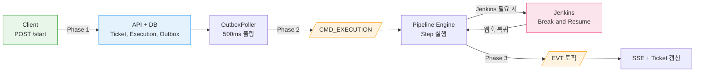
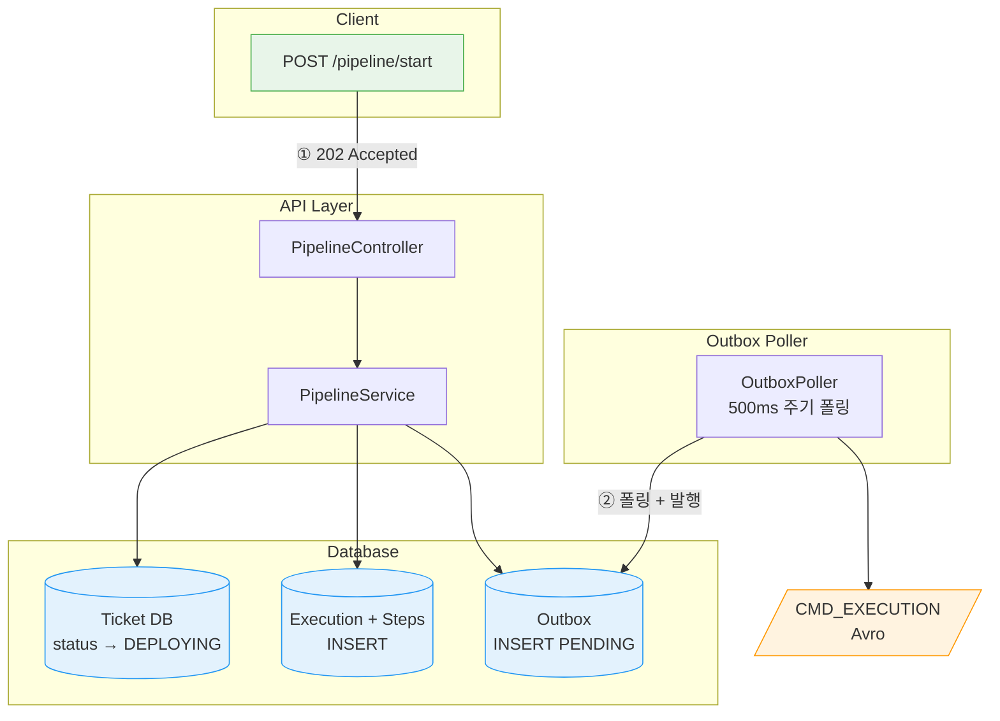
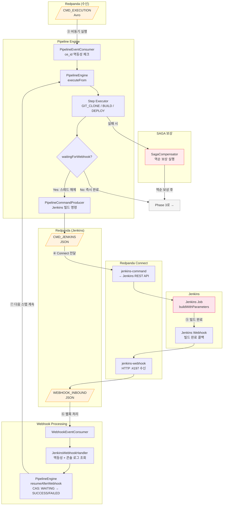
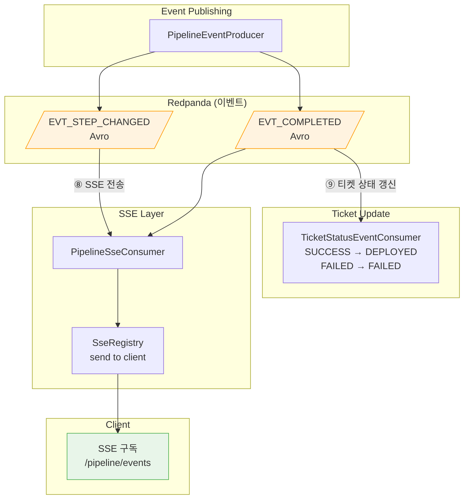
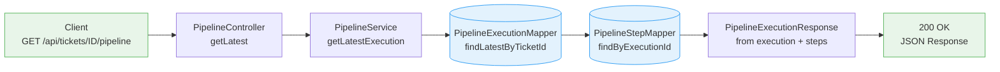
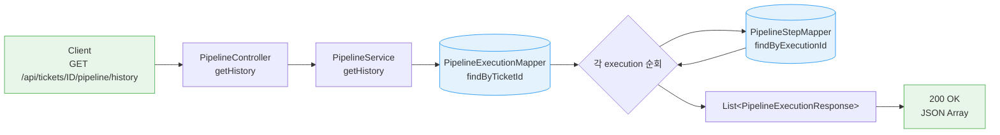

# Pipeline 흐름도

파이프라인 실행의 전체 흐름을 Mermaid graph로 표현한다. 각 흐름은 독립적인 다이어그램으로 분리하여 한 눈에 파악할 수 있도록 했다.

---

## Pipeline Start 흐름

파이프라인 시작 요청부터 Jenkins 빌드 완료, SSE 실시간 알림까지의 전체 흐름이다. Break-and-Resume 패턴으로 Jenkins 웹훅 대기 중 스레드를 해제하고, 웹훅 수신 시 이어서 실행한다.

### 개요

전체 흐름을 고수준으로 요약한 다이어그램이다. 각 번호는 아래 Phase 상세 다이어그램과 대응한다.

### Phase 1: 요청 접수 ~ Outbox 발행 (①~②)

클라이언트 요청을 받아 DB에 Ticket/Execution/Outbox를 기록하고, OutboxPoller가 Kafka 토픽으로 발행하는 구간이다.

### Phase 2: 엔진 실행 ~ Jenkins Break-and-Resume (③~⑦)

CMD_EXECUTION을 소비하여 스텝을 순차 실행한다. Jenkins 빌드가 필요한 스텝은 스레드를 해제(Break)하고 웹훅 수신 시 재개(Resume)한다. 실패 시 SAGA 보상이 역순으로 실행된다.

### Phase 3: 이벤트 발행 ~ SSE/티켓 갱신 (⑧~⑨)

스텝 완료 또는 전체 완료 이벤트를 발행하여 SSE로 클라이언트에 실시간 전달하고, 티켓 상태를 최종 갱신한다.

---

## 최근 실행이력 조회

특정 티켓의 가장 최근 파이프라인 실행 결과를 스텝 목록과 함께 반환한다.

---

## 모든 실행이력 조회

특정 티켓의 전체 파이프라인 실행 이력을 조회한다. 각 실행마다 소속 스텝 목록을 포함한다.

