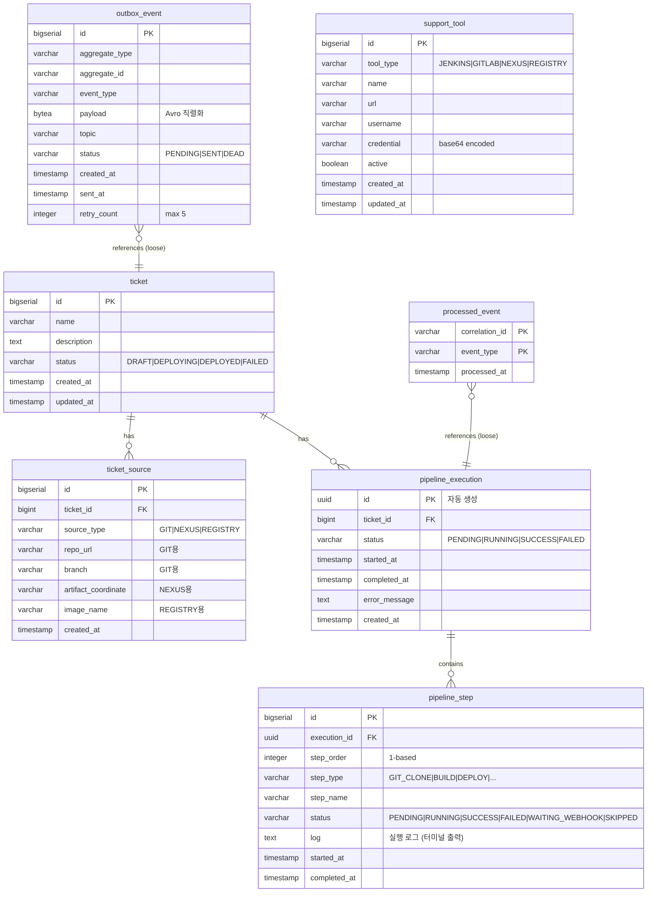

# Redpanda Playground — Deep Dive Guide

이 문서는 프로젝트 전체를 하나의 흐름으로 이해하기 위한 종합 가이드다. 각 섹션에서 기존 `docs/` 문서를 교차 참조하되, 여기서는 전체 그림을 잡는 데 집중한다.

---

## 1. 프로젝트 목적과 범위

### 왜 만들었는가

TPS(CI/CD 플랫폼)에서 사용하는 이벤트 기반 아키텍처 패턴을 학습용으로 축소 구현한 PoC 프로젝트다. 실무에서는 수십 개 마이크로서비스가 엮이지만, 이 프로젝트는 단일 Spring Boot 앱 안에서 도메인 경계를 나누고 Kafka(Redpanda)로 비동기 통신하는 구조를 보여준다. "모놀리스 안의 이벤트 드리븐"이라고 볼 수 있다.

### 어떤 시나리오를 시뮬레이션하는가

배포 요청(티켓) 생성부터 파이프라인 실행까지의 전체 사이클:

1. **티켓 생성**: 어떤 소스(Git 저장소, Nexus 아티팩트, Docker 이미지)를 배포할지 선택
2. **파이프라인 실행**: 소스 유형에 따라 Clone → Build → Deploy 스텝이 자동 생성되고 순차 실행
3. **실시간 모니터링**: SSE로 각 스텝의 진행 상태를 브라우저에 실시간 전달
4. **실패 복구**: 스텝 실패 시 SAGA 패턴으로 완료된 스텝을 역순 보상

### 기술 선택 이유

| 기술 | 이유 |
|------|------|
| **Redpanda** | Kafka API 호환이면서 JVM 없이 단일 바이너리로 실행되므로 로컬 개발이 가볍다. Schema Registry도 내장이라 별도 컨테이너가 불필요하다. |
| **Avro** | 스키마 진화(schema evolution)를 지원하고, 바이너리 직렬화로 메시지 크기가 작다. 실무에서 Kafka + Avro는 사실상 표준 조합이다. |
| **Spring Boot 3.4 + MyBatis** | TPS 실무 스택과 동일. JPA 대신 MyBatis를 쓰는 이유는 복잡한 쿼리 제어가 필요한 엔터프라이즈 환경의 관례를 따르기 위함이다. |
| **React 19 + TanStack Query** | 서버 상태 관리에 특화된 조합. SSE와의 연동에서 캐시 무효화(invalidation)로 UI를 갱신하는 패턴을 실습한다. |

---

## 2. 시스템 아키텍처

> 상세: [docs/architecture/01-architecture.md](../architecture/01-architecture.md)

### 전체 구성도

```
[Frontend: React 19 + Vite 6]
  │
  ├── REST API ─────────────── [Spring Boot 3.4 :8080]
  │                               ├── ticket/       (CRUD)
  │                               ├── pipeline/     (실행 엔진)
  │                               ├── supporttool/  (도구 관리)
  │                               ├── webhook/      (웹훅 수신)
  │                               └── common/       (outbox, idempotency)
  │
  ├── SSE Stream ───────────── PipelineSseConsumer → SseEmitterRegistry
  │
  [Redpanda :29092]             [PostgreSQL :25432]
  │  6개 토픽                     7개 테이블
  │
  [Redpanda Connect :4195/4197]
  │  HTTP↔Kafka 브릿지
  │
  [Jenkins :29080] [GitLab :29180] [Nexus :28881] [Registry :25050]
```

### 컨테이너 구성

두 개의 Docker Compose 파일로 나뉜다:

**docker-compose.yml** (핵심 — 항상 필요):

| 서비스 | 이미지 | 포트 | 메모리 | 역할 |
|--------|--------|------|--------|------|
| redpanda | redpanda:v25.x | 29092, 28081 | - | 메시지 브로커 + Schema Registry |
| console | console:v2.8.0 | 28080 | 256M | 토픽/메시지 모니터링 UI |
| connect | connect:4.43.0 | 4195, 4197 | 128M | HTTP↔Kafka 브릿지 |
| postgres | postgres:16-alpine | 25432 | 256M | 메인 DB |

**docker-compose.infra.yml** (데모용 — 실제 외부 도구 시뮬레이션):

| 서비스 | 이미지 | 포트 | 메모리 | 역할 |
|--------|--------|------|--------|------|
| jenkins | 커스텀 빌드 | 29080 | 1536M | CI/CD 빌드 서버 |
| gitlab | gitlab-ce:17.4 | 29180 | 4096M | 소스 코드 저장소 |
| nexus | nexus3:3.72 | 28881 | 1228M | 아티팩트 저장소 |
| registry | registry:2 | 25050 | 128M | 컨테이너 이미지 저장소 |
| registry-ui | docker-registry-ui:2.5 | 25051 | 30M | Registry 웹 UI |

### 네트워크 흐름

모든 컨테이너는 `playground-net` 공유 네트워크에서 통신한다. 양쪽 Docker Compose 파일이 같은 네트워크를 사용하기 때문에 Jenkins에서 Redpanda Connect(`playground-connect:4197`)로 웹훅을 보낼 수 있다.

---

## 3. 데이터베이스 설계

### ERD



### 테이블별 역할

**ticket + ticket_source**: 배포 대상을 정의한다. `source_type`에 따라 어떤 필드가 채워지는지 달라지는 다형적 설계다. GIT이면 `repo_url`/`branch`, NEXUS이면 `artifact_coordinate`, REGISTRY이면 `image_name`을 사용한다. 이 소스 유형이 파이프라인 스텝 생성의 기준이 된다.

**pipeline_execution + pipeline_step**: 파이프라인 실행 이력이다. `step_order`는 1부터 시작하며, SAGA 보상 시 역순 반복과 웹훅 재개 시 다음 스텝 인덱싱에 사용된다. `log` 필드에는 각 스텝의 실행 출력이 저장되어 프론트엔드 터미널 뷰에 표시된다.

**outbox_event**: Transactional Outbox 패턴의 핵심 테이블이다. `payload`는 BYTEA(바이너리)로, Avro 직렬화된 바이트가 직접 저장된다. `status = 'PENDING'`에 대한 부분 인덱스가 있어 폴러의 스캔 성능을 최적화한다. 5회 재시도 초과 시 `DEAD`로 표시된다.

**processed_event**: 멱등성 보장 테이블이다. `(correlation_id, event_type)` 복합 PK로 동일 이벤트의 중복 처리를 차단한다. 같은 `correlation_id`라도 다른 `event_type`은 별도 레코드로 허용된다.

**support_tool**: 외부 도구(Jenkins, GitLab, Nexus, Registry) 연결 정보를 런타임에 관리한다. `application.yml`에 하드코딩하지 않고 DB에서 관리하기 때문에, 앱 재시작 없이 도구를 추가/수정할 수 있다.

### Flyway 마이그레이션

| 버전 | 테이블 | 설명 |
|------|--------|------|
| V1 | `ticket`, `ticket_source` | 티켓 + 소스 관리. CASCADE 삭제 |
| V2 | `pipeline_execution`, `pipeline_step` | 파이프라인 실행 이력. UUID PK |
| V3 | `outbox_event` | Transactional Outbox. 부분 인덱스 |
| V4 | `processed_event` | 멱등성 보장. 복합 PK |
| V5 | `support_tool` | 외부 도구 + 시드 데이터 4건 |

---

## 4. 핵심 기능 흐름

> 상세: [docs/architecture/02-event-flow.md](../architecture/02-event-flow.md)

### 4-1. 티켓 생성 → 파이프라인 실행

```
POST /api/tickets
  → TicketService.create()
  → ticket INSERT + ticket_source INSERT (1:N)
  → 201 Created

POST /api/tickets/{id}/pipeline/start
  → PipelineService.startPipeline()
    1. 티켓 상태 → DEPLOYING
    2. PipelineExecution + Steps 생성 (소스 유형 기반)
    3. Outbox INSERT (PIPELINE_EXECUTION_STARTED 이벤트)
    4. 202 Accepted + trackingUrl 응답

[비동기]
  OutboxPoller (500ms 폴링)
    → outbox_event 조회 (최대 50건)
    → KafkaTemplate.send() (byte[] 직렬화)
    → playground.pipeline.commands 토픽 발행
    → outbox_event 상태 → SENT

  PipelineEventConsumer
    → 이벤트 수신 → 멱등성 체크
    → PipelineEngine.execute() (비동기 스레드풀)
```

202 Accepted 패턴을 사용하는 이유는, 파이프라인 실행이 수 분 이상 걸릴 수 있기 때문이다. 클라이언트는 응답과 함께 받은 SSE 엔드포인트로 진행 상태를 실시간 구독한다.

### 4-2. 파이프라인 실행 엔진

`PipelineEngine`이 SAGA Orchestrator 역할을 한다. 스텝 타입별 실행기(executor)가 매핑되어 있다:

| StepType | Executor | 동작 |
|----------|----------|------|
| GIT_CLONE | JenkinsCloneAndBuildStep | Jenkins Job 트리거 → 웹훅 대기 |
| BUILD | JenkinsCloneAndBuildStep | Jenkins Job 트리거 → 웹훅 대기 |
| ARTIFACT_DOWNLOAD | NexusDownloadStep | Nexus REST API로 아티팩트 검색 |
| IMAGE_PULL | RegistryImagePullStep | Docker Registry API로 이미지 존재 확인 |
| DEPLOY | RealDeployStep | Jenkins 배포 Job 트리거 → 웹훅 대기 |

실행 흐름:

```
PipelineEngine.execute(execution)
  → executeFrom(execution, fromIndex=0, startTime)
    for each step (순차):
      1. step.status → RUNNING
      2. executor.execute(execution, step)
      3-a. waitingForWebhook == true → 스레드 해제 (return)
      3-b. 성공 → step.status → SUCCESS → 다음 스텝
      3-c. 실패 → SagaCompensator.compensate() → execution.status → FAILED
    all steps done → execution.status → SUCCESS

  각 스텝 완료 시:
    → PipelineEventProducer → playground.pipeline.events 토픽
    → PipelineSseConsumer → SseEmitterRegistry.send() → 브라우저 SSE
```

### 4-3. Break-and-Resume (Jenkins 통합)

Jenkins처럼 오래 걸리는 외부 작업은 스레드를 점유하면 안 된다. 이 프로젝트는 "Break-and-Resume" 패턴으로 이 문제를 해결한다.

> 상세: [docs/patterns/05-break-and-resume.md](../patterns/05-break-and-resume.md)

```
[PipelineEngine]
  step.execute() → Jenkins Job 트리거 (fire-and-forget)
  step.waitingForWebhook = true
  → 엔진이 return → 스레드 해제

[Jenkins]
  빌드 완료 → POST http://playground-connect:4197/webhook/jenkins

[Redpanda Connect: jenkins-webhook.yaml]
  HTTP 수신 → payload 매핑 → playground.webhook.inbound 토픽 발행
  (전송만 담당, 비즈니스 로직 없음)

[WebhookEventConsumer]
  토픽 소비 → key 기반 라우팅 (JENKINS)
  → JenkinsWebhookHandler
    → 멱등성 체크
    → PipelineEngine.resumeAfterWebhook(executionId, stepOrder, result, buildLog)

[PipelineEngine.resumeAfterWebhook()]
  CAS: stepMapper.updateStatusIfCurrent(WAITING_WEBHOOK → SUCCESS/FAILED)
  → 성공: executeFrom(execution, nextStepIndex) → 다음 스텝부터 재개
  → 실패: SagaCompensator.compensate() → 보상 실행
```

CAS(Compare-And-Swap)가 중요한 이유: 웹훅 콜백과 타임아웃 체커가 동시에 같은 스텝의 상태를 변경하려 할 수 있다. `updateStatusIfCurrent`로 선착순 1건만 성공하도록 경쟁 조건을 방지한다.

### 4-4. SAGA 보상 (실패 시뮬레이션)

> 상세: [docs/patterns/02-saga-orchestrator.md](../patterns/02-saga-orchestrator.md)

```
POST /api/tickets/{id}/pipeline/start-with-failure
  → PipelineService에서 injectRandomFailure()
  → 랜덤 스텝에 [FAIL] 마커 삽입

해당 스텝 실행 시:
  → executor가 [FAIL] 감지 → 예외 발생
  → PipelineEngine이 catch
  → SagaCompensator.compensate(execution, failedStepOrder, stepExecutors)
    → 완료된 스텝을 역순(failedStepOrder-2 → 0) 반복
    → status == SUCCESS인 스텝만 보상
    → executor.compensate(execution, step)
      → 성공: step.status → SKIPPED ("Compensated after saga rollback")
      → 실패: step.status → FAILED ("COMPENSATION_FAILED: ...") + 수동 개입 로그
  → execution.status → FAILED
  → SSE로 각 보상 결과 실시간 알림
```

보상은 best-effort다. 개별 보상 실패가 전체 보상 루프를 중단시키지 않는다. `COMPENSATION_FAILED` 상태와 로그 메시지가 운영자에게 수동 개입이 필요하다는 신호다.

---

## 5. 이벤트/메시지 설계

> 상세: [docs/patterns/07-topic-message-design.md](../patterns/07-topic-message-design.md)

### 토픽 목록

| 토픽 | 파티션 | 보관 | 직렬화 | 용도 |
|------|--------|------|--------|------|
| `playground.pipeline.commands` | 3 | 7일 | Avro | 파이프라인 실행 커맨드 |
| `playground.pipeline.events` | 3 | 7일 | Avro | 스텝 변경/완료 이벤트 |
| `playground.ticket.events` | 3 | 7일 | Avro | 티켓 생성 이벤트 |
| `playground.webhook.inbound` | 2 | 3일 | JSON | 외부 웹훅 수신 |
| `playground.audit.events` | 1 | 30일 | Avro | 감사 이벤트 |
| `playground.dlq` | 1 | 30일 | - | Dead Letter Queue |

네이밍 규칙은 `playground.{도메인}.{유형}`이다. 파이프라인/티켓 토픽은 3 파티션으로 병렬 처리하고, 감사/DLQ는 순서 보장이 중요하므로 1 파티션이다. 웹훅은 보관 기간이 짧다(3일) — 처리 후 재참조할 일이 거의 없기 때문이다.

### Avro 스키마 구조

모든 도메인 이벤트는 `EventMetadata`를 내장(composition)한다:

```
EventMetadata (공통)
├── eventId: string       # CloudEvents ce-id (UUID)
├── correlationId: string # 관련 이벤트 연결 (멱등성 키)
├── eventType: string     # 이벤트 유형 식별자
├── timestamp: long       # 생성 시각 (ms)
└── source: string        # 발행 서비스/컴포넌트
```

도메인별 스키마:

| 스키마 | 핵심 필드 |
|--------|----------|
| PipelineExecutionStartedEvent | metadata, executionId, ticketId, steps(string[]) |
| PipelineExecutionCompletedEvent | metadata, executionId, ticketId, status |
| PipelineStepChangedEvent | metadata, executionId, stepOrder, stepType, status, log |
| TicketCreatedEvent | metadata, ticketId, name |
| WebhookEvent | metadata, webhookSource, payload(raw JSON), headers(map) |
| AuditEvent | metadata + 감사 정보 |
| JenkinsBuildCommand | metadata, executionId, stepOrder, jobName, parameters |

직렬화 방식의 특이점: `application.yml`에서 Producer는 `ByteArraySerializer`, Consumer는 `ByteArrayDeserializer`를 사용한다. Avro 직렬화/역직렬화를 코드에서 직접 수행하며(`AvroSerializer` 유틸), Schema Registry 기반 자동 serde를 쓰지 않는다. Outbox 테이블의 `payload`가 BYTEA인 것도 이 때문이다.

### CloudEvents 헤더 규칙

`CloudEventsHeaderInterceptor`가 Producer의 모든 메시지에 CloudEvents 헤더를 추가한다. OutboxPoller에서도 `ce_type`과 `eventType` 헤더를 직접 설정한다.

---

## 6. 적용 패턴 요약

| # | 패턴 | 핵심 한 줄 | 상세 |
|---|------|-----------|------|
| 1 | **202 Accepted** | 긴 작업은 즉시 응답 + 추적 URL 제공 | [docs/patterns/01-async-accepted.md](../patterns/01-async-accepted.md) |
| 2 | **SAGA Orchestrator** | PipelineEngine이 오케스트레이터, 실패 시 완료 스텝 역순 보상 | [docs/patterns/02-saga-orchestrator.md](../patterns/02-saga-orchestrator.md) |
| 3 | **Transactional Outbox** | DB 트랜잭션 + 이벤트 발행 원자성, 500ms 폴링 | [docs/patterns/03-transactional-outbox.md](../patterns/03-transactional-outbox.md) |
| 4 | **SSE 실시간 알림** | 서버→클라이언트 단방향 스트리밍, TanStack Query 캐시 무효화 | [docs/patterns/04-sse-realtime.md](../patterns/04-sse-realtime.md) |
| 5 | **Break-and-Resume** | 웹훅 대기 시 스레드 해제, CAS로 경쟁 조건 방지 | [docs/patterns/05-break-and-resume.md](../patterns/05-break-and-resume.md) |
| 6 | **Redpanda Connect** | HTTP↔Kafka 브릿지 (전송만, 비즈니스 로직 없음) | [docs/patterns/06-redpanda-connect.md](../patterns/06-redpanda-connect.md) |
| 7 | **토픽/메시지 설계** | 도메인별 토픽, EventMetadata 공통 스키마, CloudEvents | [docs/patterns/07-topic-message-design.md](../patterns/07-topic-message-design.md) |
| 8 | **Adapter/Fallback** | 외부 시스템별 어댑터 분리, ToolRegistry 기반 동적 해석 | [docs/patterns/08-adapter-fallback.md](../patterns/08-adapter-fallback.md) |
| 9 | **Idempotency** | (correlationId, eventType) 복합 키, preemptive acquire | [docs/patterns/09-idempotency.md](../patterns/09-idempotency.md) |

---

## 7. 프론트엔드 구조

### 기술 스택

React 19 + Vite 6 + TypeScript 5.6 + TanStack Query 5 + Tailwind CSS 4 + React Router 7. UI 라이브러리나 폼 라이브러리 없이 최소 의존성으로 구성했다. Tailwind 4는 Vite 플러그인 방식이라 PostCSS 설정이 필요 없다.

### 페이지 구성 (4 pages)

| 페이지 | 컴포넌트 | 역할 |
|--------|----------|------|
| 도구 관리 | `ToolListPage` | 외부 도구(Jenkins/GitLab/Nexus/Registry) CRUD, 연결 테스트 |
| 티켓 목록 | `TicketListPage` | 배포 티켓 목록 조회 |
| 티켓 생성 | `TicketCreatePage` | 소스 선택(SourceSelector) + 티켓 생성 |
| 티켓 상세 | `TicketDetailPage` | 파이프라인 실행/모니터링, SSE 실시간 로그 |

### 핵심 훅

| 훅 | 역할 |
|----|------|
| `useTickets` | 티켓 CRUD (TanStack Query) |
| `useTools` | 도구 CRUD + 연결 테스트 (TanStack Query) |
| `usePipeline` | 파이프라인 최신/이력 조회 + 시작/실패 시뮬레이션 (TanStack Query Mutation) |
| `useSources` | 소스 브라우징 — GitLab 프로젝트/브랜치, Nexus 아티팩트, Registry 이미지 조회 |
| `useSSE` | SSE 연결 관리, 지수 백오프 재연결(1s→30s), 이벤트 수신 시 Query 캐시 무효화 |

### SSE + TanStack Query 연동 패턴

`useSSE`는 이벤트 데이터를 자체 저장하지 않는다. 대신 이벤트를 수신하면 `queryClient.invalidateQueries()`를 호출해서 관련 쿼리를 다시 fetch하게 만든다. 이렇게 하면 SSE와 REST 데이터의 일관성이 자동으로 유지된다.

```
SSE 이벤트 수신
  → "status" 이벤트: pipeline 쿼리 무효화 → UI 갱신
  → "completed" 이벤트: pipeline + ticket 쿼리 무효화 → EventSource 종료
```

`TicketDetailPage`에서 `isRunning` 상태(`RUNNING`, `PENDING`, 또는 스텝이 `WAITING_WEBHOOK`)일 때만 SSE를 활성화한다.

---

## 8. 개발 환경 & 실행 방법

### 사전 요구

- Java 17 (Corretto 17 권장)
- Docker + Docker Compose
- Node.js (프론트엔드)
- Yarn 4.x (패키지 매니저)

### make 명령어

| 명령어 | 설명 |
|--------|------|
| `make infra` | Core 인프라 시작 (Redpanda, PostgreSQL, Console, Connect) |
| `make infra-all` | 전체 인프라 (Core + Jenkins, GitLab, Nexus, Registry) |
| `make infra-down` | 전체 인프라 중지 |
| `make backend` | Spring Boot 실행 |
| `make frontend` | React 개발 서버 실행 |
| `make build` | 백엔드 빌드 (테스트 제외) |
| `make test` | 백엔드 테스트 |
| `make setup-all` | 미들웨어 셋업 (GitLab/Nexus/Registry/Jenkins에 샘플 데이터 등록) |
| `make demo-deploy` | 데모 시나리오 실행 (티켓 생성 → 파이프라인 → 결과 확인) |
| `make dev` | 개발 환경 실행 안내 (URL 표시) |

### 포트 맵

| 서비스 | 포트 | URL |
|--------|------|-----|
| Spring Boot | 8080 | http://localhost:8080 |
| Frontend (Vite) | 5173 | http://localhost:5173 |
| Redpanda Console | 28080 | http://localhost:28080 |
| AsyncAPI (Springwolf) | 8080 | http://localhost:8080/springwolf/asyncapi-ui.html |
| Jenkins | 29080 | http://localhost:29080 (admin/9615) |
| GitLab | 29180 | http://localhost:29180 (root/playground1234!) |
| Nexus | 28881 | http://localhost:28881 |
| Registry UI | 25051 | http://localhost:25051 |
| Redpanda (Kafka) | 29092 | - |
| Schema Registry | 28081 | - |
| PostgreSQL | 25432 | - |

### 데모 시나리오

**성공 시나리오**:
```bash
# 1. 인프라 시작
make infra-all

# 2. 미들웨어 셋업 (샘플 데이터)
make setup-all

# 3. 백엔드 + 프론트엔드 (별도 터미널)
make backend
make frontend

# 4. 브라우저에서 http://localhost:5173
#    도구 → 티켓 생성 → 파이프라인 시작 → SSE로 실시간 모니터링
```

**실패 시뮬레이션**:
- 티켓 상세 페이지에서 "실패 시뮬레이션" 버튼 클릭
- 랜덤 스텝에서 의도적 실패 발생
- SAGA 보상이 역순으로 실행되는 과정을 SSE로 실시간 관찰

> 상세: [docs/demo/01-demo-script.md](../demo/01-demo-script.md)
