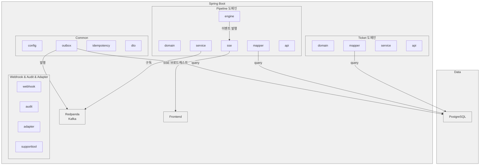

# Redpanda Playground — Deep Dive Guide

이 문서는 프로젝트 전체를 하나의 흐름으로 이해하기 위한 종합 가이드다. 각 섹션에서 기존 `docs/` 문서를 교차 참조하되, 여기서는 전체 그림을 잡는 데 집중한다.

---

## 1. 프로젝트 목적과 범위

### 왜 만들었는가

TPS(CI/CD 플랫폼)에서 사용하는 이벤트 기반 아키텍처 패턴을 학습용으로 축소 구현한 PoC 프로젝트다. 실무에서는 수십 개 마이크로서비스가 엮이지만, 이 프로젝트는 단일 Spring Boot 앱 안에서 도메인 경계를 나누고 Kafka(Redpanda)로 비동기 통신하는 구조를 보여준다. "모놀리스 안의 이벤트 드리븐"이라고 볼 수 있다.

### 어떤 시나리오를 시뮬레이션하는가

배포 요청(티켓) 생성부터 파이프라인 실행까지의 전체 사이클:

1. **티켓 생성**: 어떤 소스(Git 저장소, Nexus 아티팩트, Harbor 이미지)를 배포할지 선택
2. **파이프라인 실행**: 소스 유형에 따라 Clone → Build → Deploy 스텝이 자동 생성되고 순차 실행
3. **실시간 모니터링**: SSE로 각 스텝의 진행 상태를 브라우저에 실시간 전달
4. **실패 복구**: 스텝 실패 시 SAGA 패턴으로 완료된 스텝을 역순 보상

### 기술 선택 이유

| 기술 | 이유 |
|------|------|
| **Redpanda** | Kafka API 호환이면서 JVM 없이 단일 바이너리로 실행되므로 로컬 개발이 가볍다. Schema Registry도 내장이라 별도 컨테이너가 불필요하다. |
| **Avro** | 스키마 진화(schema evolution)를 지원하고, 바이너리 직렬화로 메시지 크기가 작다. 실무에서 Kafka + Avro는 사실상 표준 조합이다. |
| **Spring Boot 3.4 + MyBatis** | TPS 실무 스택과 동일. JPA 대신 MyBatis를 쓰는 이유는 복잡한 쿼리 제어가 필요한 엔터프라이즈 환경의 관례를 따르기 위함이다. |
| **React 19 + TanStack Query** | 서버 상태 관리에 특화된 조합. SSE와의 연동에서 캐시 무효화(invalidation)로 UI를 갱신하는 패턴을 실습한다. |

---

## 2. 시스템 아키텍처

> 패키지 구조, 컴포넌트 관계, 설정 항목은 이 문서의 하단 섹션에서 다룬다.

### 전체 구성도

```
[Frontend: React 19 + Vite 6]
  │
  ├── REST API ─────────────── [Spring Boot 3.4 :8080]
  │                               ├── ticket/       (CRUD)
  │                               ├── pipeline/     (실행 엔진)
  │                               ├── supporttool/  (도구 관리)
  │                               ├── webhook/      (웹훅 수신)
  │                               └── common/       (outbox, idempotency)
  │
  ├── SSE Stream ───────────── PipelineSseConsumer → SseEmitterRegistry
  │
  [Redpanda :29092]             [PostgreSQL :25432]
  │  6개 토픽                     8개 테이블
  │
  [Redpanda Connect :24195/4197]
  │  HTTP↔Kafka 브릿지
  │
  [Jenkins :29080] [GitLab :29180] [Nexus :28881] [Registry :25050]
```

### 컨테이너 구성

두 개의 Docker Compose 파일로 나뉜다:

**docker-compose.yml** (핵심 — 항상 필요):

| 서비스 | 이미지 | 포트 | 메모리 | 역할 |
|--------|--------|------|--------|------|
| redpanda | redpanda:v24.3.1 | 29092, 28081, 29644 | - | 메시지 브로커 + Schema Registry + Admin |
| console | console:v2.8.0 | 28080 | 256M | 토픽/메시지 모니터링 UI |
| connect | connect:4.43.0 | 24195, 4197 | 128M | HTTP↔Kafka 브릿지 |
| postgres | postgres:16-alpine | 25432 | 256M | 메인 DB |

**docker-compose.infra.yml** (데모용 — 실제 외부 도구 시뮬레이션):

| 서비스 | 이미지 | 포트 | 메모리 | 역할 |
|--------|--------|------|--------|------|
| jenkins | 커스텀 빌드 | 29080 | 1536M | CI/CD 빌드 서버 |
| gitlab | gitlab-ce:17.4 | 29180 | 4096M | 소스 코드 저장소 |
| nexus | nexus3:3.72 | 28881 | 1228M | 아티팩트 저장소 |
| registry | registry:2 | 25050 | 128M | 컨테이너 이미지 저장소 |
| registry-ui | docker-registry-ui:2.5 | 25051 | 30M | Registry 웹 UI |

### 네트워크 흐름

모든 컨테이너는 `playground-net` 공유 네트워크에서 통신한다. 양쪽 Docker Compose 파일이 같은 네트워크를 사용하기 때문에 Jenkins에서 Redpanda Connect(`playground-connect:4197`)로 웹훅을 보낼 수 있다.

---

## 3. 백엔드 상세

DB 설계(ERD, 테이블 역할, Flyway), 핵심 기능 흐름(티켓→파이프라인, 실행 엔진, Break-and-Resume, SAGA 보상), 이벤트/메시지 설계(토픽, Avro 스키마, CloudEvents)는 별도 문서로 분리했다.

> 상세: [backend-deep-dive.md](./backend-deep-dive.md)

---

## 6. 적용 패턴 요약

| # | 패턴 | 핵심 한 줄 | 상세 |
|---|------|-----------|------|
| 1 | **202 Accepted** | 긴 작업은 즉시 응답 + 추적 URL 제공 | [docs/patterns/01-async-accepted.md](../patterns/01-async-accepted.md) |
| 2 | **SAGA Orchestrator** | PipelineEngine이 오케스트레이터, 실패 시 완료 스텝 역순 보상 | [docs/patterns/02-saga-orchestrator.md](../patterns/02-saga-orchestrator.md) |
| 3 | **Transactional Outbox** | DB 트랜잭션 + 이벤트 발행 원자성, 500ms 폴링 | [docs/patterns/03-transactional-outbox.md](../patterns/03-transactional-outbox.md) |
| 4 | **SSE 실시간 알림** | 서버→클라이언트 단방향 스트리밍, TanStack Query 캐시 무효화 | [docs/patterns/04-sse-realtime.md](../patterns/04-sse-realtime.md) |
| 5 | **Break-and-Resume** | 웹훅 대기 시 스레드 해제, CAS로 경쟁 조건 방지 | [docs/patterns/05-break-and-resume.md](../patterns/05-break-and-resume.md) |
| 6 | **Redpanda Connect** | HTTP↔Kafka 브릿지 (전송만, 비즈니스 로직 없음) | [docs/patterns/06-redpanda-connect.md](../patterns/06-redpanda-connect.md) |
| 7 | **토픽/메시지 설계** | 도메인별 토픽, EventMetadata 공통 스키마, CloudEvents | [docs/patterns/07-topic-message-design.md](../patterns/07-topic-message-design.md) |
| 8 | **Adapter/Fallback** | 외부 시스템별 어댑터 분리, ToolRegistry 기반 동적 해석 | [docs/patterns/08-adapter-fallback.md](../patterns/08-adapter-fallback.md) |
| 9 | **Idempotency** | (correlationId, eventType) 복합 키, preemptive acquire | [docs/patterns/09-idempotency.md](../patterns/09-idempotency.md) |

---

## 7. 프론트엔드 상세

기술 스택, 페이지 구성, 핵심 훅, SSE + TanStack Query 연동 패턴은 별도 문서로 분리했다.

> 상세: [frontend-deep-dive.md](./frontend-deep-dive.md)

---

## 8. 개발 환경 & 실행 방법

### 사전 요구

- Java 17 (Corretto 17 권장)
- Docker + Docker Compose
- Node.js (프론트엔드)
- Yarn 4.x (패키지 매니저)

### make 명령어

| 명령어 | 설명 |
|--------|------|
| `make infra` | Core 인프라 시작 (Redpanda, PostgreSQL, Console, Connect) |
| `make infra-all` | 전체 인프라 (Core + Jenkins, GitLab, Nexus, Registry) |
| `make infra-down` | 전체 인프라 중지 |
| `make backend` | Spring Boot 실행 |
| `make frontend` | React 개발 서버 실행 |
| `make build` | 백엔드 빌드 (테스트 제외) |
| `make test` | 백엔드 테스트 |
| `make setup-all` | 미들웨어 셋업 (GitLab/Nexus/Registry/Jenkins에 샘플 데이터 등록) |
| `make demo-deploy` | 데모 시나리오 실행 (티켓 생성 → 파이프라인 → 결과 확인) |
| `make dev` | 개발 환경 실행 안내 (URL 표시) |

### 포트 맵

| 서비스 | 포트 | URL |
|--------|------|-----|
| Spring Boot | 8080 | http://localhost:8080 |
| Frontend (Vite) | 5173 | http://localhost:5173 |
| Redpanda Console | 28080 | http://localhost:28080 |
| AsyncAPI (Springwolf) | 8080 | http://localhost:8080/springwolf/asyncapi-ui.html |
| Jenkins | 29080 | http://localhost:29080 (admin/admin) |
| GitLab | 29180 | http://localhost:29180 (root/playground1234!) |
| Nexus | 28881 | http://localhost:28881 |
| Registry UI | 25051 | http://localhost:25051 |
| Redpanda (Kafka) | 29092 | - |
| Schema Registry | 28081 | - |
| Redpanda Admin | 29644 | - |
| Redpanda Connect | 24195 | - |
| PostgreSQL | 25432 | - |

### 데모 시나리오

**성공 시나리오**:
```bash
# 1. 인프라 시작
make infra-all

# 2. 미들웨어 셋업 (샘플 데이터)
make setup-all

# 3. 백엔드 + 프론트엔드 (별도 터미널)
make backend
make frontend

# 4. 브라우저에서 http://localhost:5173
#    도구 → 티켓 생성 → 파이프라인 시작 → SSE로 실시간 모니터링
```

**실패 시뮬레이션**:
- 티켓 상세 페이지에서 "실패 시뮬레이션" 버튼 클릭
- 랜덤 스텝에서 의도적 실패 발생
- SAGA 보상이 역순으로 실행되는 과정을 SSE로 실시간 관찰

> 상세: [docs/demo/01-demo-script.md](../demo/01-demo-script.md)

---

## 9. 패키지 구조

### 1. ticket (배포 티켓 도메인)

**ticket/domain**
- Ticket: 배포 대상 정의 (이름, 설명, 상태)
- TicketSource: 배포 소스 (GIT, NEXUS, HARBOR)
- TicketStatus: DRAFT, READY, DEPLOYING, DEPLOYED, FAILED

**ticket/mapper**
- TicketMapper: MyBatis SQL 매핑 (insert/select/update/delete)
- TicketSourceMapper: 소스 CRUD

**ticket/service**
- TicketCommandService: 티켓 생성/수정/삭제 (Outbox 발행)
- TicketQueryService: 목록/상세 조회

**ticket/api**
- TicketController: REST API (GET/POST/PUT/DELETE)

**ticket/dto**
- TicketCreateRequest/Response, TicketUpdateRequest/Response, TicketListResponse

### 2. pipeline (배포 파이프라인 도메인)

**pipeline/domain**
- Pipeline: 티켓 기반 자동 생성되는 실행 단위
- PipelineStep: 단계별 작업 (BUILD, PUSH, DEPLOY, HEALTH_CHECK)
- PipelineStatus: PENDING, RUNNING, SUCCESS, FAILED
- StepEvent: 단계별 상태 변화 이벤트

**pipeline/mapper**
- PipelineMapper: 파이프라인 CRUD
- PipelineStepMapper: 단계 조회/수정

**pipeline/service**
- PipelineCommandService: 파이프라인 시작 (202 Accepted 응답)
- PipelineQueryService: 상태/이력/이벤트 조회
- PipelineEventConsumer: `playground.ticket.events` 구독하여 파이프라인 자동 생성

**pipeline/engine**
- PipelineEngine: 상태 머신으로 단계 실행 및 이벤트 발행
- StepExecutor: 각 단계별 실행 로직 (Jenkins 연동 또는 Mock 폴백)

**pipeline/event**
- PipelineStartedEvent, StepStartedEvent, StepCompletedEvent, PipelineCompletedEvent

**pipeline/sse**
- PipelineSseController: GET /api/tickets/{id}/pipeline/events (Server-Sent Events)
- SseEmitterRegistry: 클라이언트별 이벤트 스트림 관리 및 SSE 브로드캐스트

**pipeline/api**
- PipelineController: pipeline 관련 REST API

**pipeline/dto**
- PipelineStartRequest/Response, PipelineStatusResponse, StepEventResponse

### 3. common (공통 인프라)

**common/config**
- KafkaConsumerConfig, KafkaProducerConfig, AvroConfig

**common/outbox**
- OutboxEvent: 발행할 이벤트 데이터
- OutboxMapper: 폴링용 SQL (FOR UPDATE SKIP LOCKED)
- OutboxPoller: 주기적 폴링 (500ms) 및 발행
- OutboxPublisher: Kafka 발행

**common/idempotency**
- IdempotentEventRecord: (correlationId, eventType) 복합 키로 중복 감지
- IdempotencyMapper: 조회 및 기록
- IdempotencyFilter: 메서드 인터셉터

**common/dto**
- ApiResponse<T>: 표준 응답
- ErrorResponse: 오류 응답

**common/exception**
- BusinessException: 비즈니스 예외
- InvalidStateException: 상태 오류

### 4. common-kafka (Kafka 공통 모듈)

Kafka 관련 직렬화/역직렬화, CloudEvents 헤더, Schema Registry 연동 등 공통 인프라를 별도 모듈로 분리한다.

### 5. webhook

HTTP 수신은 Redpanda Connect가 담당하고(`docker/connect/jenkins-webhook.yaml`), Spring 애플리케이션은 Kafka Consumer로만 처리한다.

**webhook**
- WebhookEventConsumer: `playground.webhook.inbound` 토픽 구독, key 기반 소스별 라우팅

**webhook/handler**
- JenkinsWebhookHandler: Jenkins webhook 파싱, 멱등성 체크, PipelineEngine.resumeAfterWebhook() 호출

**webhook/dto**
- JenkinsWebhookPayload: Jenkins Job 완료 콜백 페이로드 (executionId, stepOrder, result, duration 등)

### 6. audit

**audit/event**
- AuditEvent: 감사 로그 이벤트
- AuditEventListener: 모든 도메인 이벤트 구독하여 `playground.audit.events` 발행

### 7. adapter (외부 시스템 어댑터)

Jenkins, GitLab, Nexus, Registry 등 외부 시스템과의 통신을 추상화한다. 각 어댑터는 인터페이스를 구현하여 교체 가능하다.

### 8. supporttool (도구 관리)

외부 도구(Jenkins, GitLab, Nexus, Registry) 연결 정보를 런타임에 관리한다. `application.yml`에 하드코딩하지 않고 DB에서 관리하기 때문에, 앱 재시작 없이 도구를 추가/수정할 수 있다.

---

## 10. 컴포넌트 다이어그램



---

## 11. 설정 가능한 항목

| 항목 | 기본값 | 설정처 |
|------|--------|--------|
| Outbox 폴링 주기 | 500ms | application.yml |
| Kafka Consumer Group | playground-group | application.yml |
| Avro Schema Registry | http://localhost:28081 | application.yml |
| SSE 타임아웃 | 1시간 | SseEmitterRegistry |
| Webhook 타임아웃 | 5분 | WebhookTimeoutChecker.TIMEOUT_MINUTES |
| 타임아웃 체크 주기 | 30초 | WebhookTimeoutChecker @Scheduled fixedDelay |
| Docker 네트워크 | playground-net | docker-compose.yml, docker-compose.infra.yml |
| Connect webhook 엔드포인트 | :4197/webhook/jenkins | jenkins-webhook.yaml |
| Connect jenkins-command | kafka → http://jenkins:8080 | jenkins-command.yaml |
