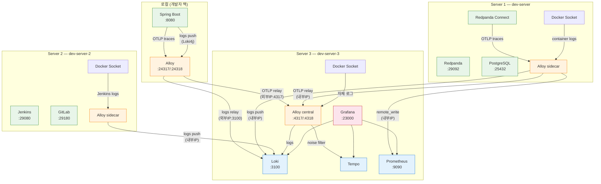

# Monitoring Architecture Overview

이 문서는 Redpanda Playground 모니터링 환경의 전체 아키텍처를 다룬다. GCP 3노드 분산 배포와 로컬 단일 호스트, 두 환경 모두를 설명한다. 데이터 흐름별 설정은 [02-setup-and-usage.md](./02-setup-and-usage.md), OTel 계측은 [03-otel-instrumentation.md](./03-otel-instrumentation.md), 트러블슈팅은 [07-troubleshooting.md](./07-troubleshooting.md)을 참조한다.

---

## 1. 물리 배치

GCP `asia-northeast3-a` 리전의 3대 VM에 미들웨어를 분산 배포한다. 모니터링 백엔드(Server 3)가 가장 먼저 기동되어야 나머지 서버의 Alloy sidecar가 연결할 수 있다.

| VM | 내부 IP | 외부 IP | 서비스 | 메모리 할당 |
|----|---------|---------|--------|------------|
| **dev-server** (Server 1) | `10.178.0.2` | `34.47.83.38` | Redpanda, Console, Connect, PostgreSQL, **Alloy sidecar** | ~3GB |
| **dev-server-2** (Server 2) | `10.178.0.3` | `34.47.74.0` | Jenkins, GitLab, **Alloy sidecar** | ~5.7GB |
| **dev-server-3** (Server 3) | `10.178.0.4` | `34.22.78.240` | Loki, Tempo, Prometheus, Grafana, **Alloy central** | ~2GB |

로컬 Spring Boot 앱은 개발자 맥에서 실행되며, `SPRING_PROFILES_ACTIVE=gcp` 프로필로 GCP 미들웨어에 연결한다.

---

## 2. 아키텍처

### GCP (3서버 분산)



GCP에서는 **Alloy sidecar + central 패턴**을 사용한다. 로컬 개발자 맥에서도 `docker/local/`의 Alloy가 실행되어 Spring Boot OTLP 트레이스를 수신한 뒤 Server 3 central로 릴레이한다. 각 GCP 서버에는 Alloy sidecar가 Docker 소켓으로 로컬 로그를 수집하고, Server 3의 central Alloy가 모든 OTLP 트레이스를 수신하여 노이즈 필터링을 한 곳에서 처리한다. 필터 규칙 변경 시 Server 3 Alloy만 재시작하면 된다.

---

## 3. 데이터 흐름

### 3-1. 로그

Docker 소켓(`/var/run/docker.sock`)은 같은 호스트에서만 마운트할 수 있다. 따라서 컨테이너 로그를 수집하려면 각 서버에 Alloy가 필요하다.

**Server 1** — Redpanda, Connect, PostgreSQL 로그를 수집한다. Alloy sidecar가 Docker 소켓으로 `playground-*` 컨테이너의 stdout을 읽고, Java 멀티라인 스택트레이스를 조인한 뒤, 로그 본문에서 `traceId=xxx` 패턴을 정규식으로 추출하여 Loki Structured Metadata에 저장한다. 처리된 로그는 VPC 내부 IP로 Server 3 Loki에 push한다.

```
Docker Socket → discovery.docker → discovery.relabel(playground-* keep)
  → loki.source.docker → loki.process "multiline"(스택트레이스 조인)
  → loki.process "extract_trace"(traceId → Structured Metadata)
  → loki.write → Server 3 Loki (10.178.0.4:3100)
```

**Server 2** — Jenkins 컨테이너만 수집한다. GitLab은 로그량이 과도하여(~1MB/s) Loki 인제스트 제한을 초과하므로 relabel에서 drop한다. Jenkins는 Java 기반이므로 멀티라인 조인을 적용하지만, trace_id 추출은 하지 않는다(Jenkins는 OTel 미지원).

```
Docker Socket → discovery.relabel(jenkins keep, gitlab drop)
  → loki.source.docker → loki.process "multiline"
  → loki.write → Server 3 Loki (10.178.0.4:3100)
```

**Server 3** — 모니터링 컴포넌트(Loki, Tempo, Grafana 등) 자체의 로그를 수집한다. Server 1과 동일한 파이프라인이지만 전송 대상이 같은 Docker 네트워크의 Loki(`loki:3100`)다.

```
Docker Socket → discovery.relabel(playground-* keep)
  → loki.source.docker → loki.process "multiline"
  → loki.process "extract_trace"
  → loki.write → Loki (loki:3100, 같은 Docker 네트워크)
```

**로컬 Spring Boot** — 호스트에서 실행되므로 Docker 소켓으로 수집할 수 없다. Loki4j Logback Appender가 로컬 Alloy의 `loki.source.api` 엔드포인트(`localhost:23100`)로 push하면, Alloy가 Server 3 Loki로 전달한다.

```
Spring Boot (Loki4j) → localhost:23100 → Alloy loki.source.api
  → loki.write → Server 3 Loki (34.22.78.240:3100, allow-loki 방화벽)
```

### 3-2. 트레이스

OTel Java Agent와 Connect tracer가 OTLP 프로토콜로 트레이스를 전송한다. 모든 트레이스는 최종적으로 Server 3 central Alloy를 거치며, 이곳에서 노이즈 스팬을 필터링한 뒤 Tempo에 저장한다.

**Server 1 (Connect)** — Connect의 `observability.yaml`에 설정된 `open_telemetry_collector` tracer가 메시지 처리 시 스팬을 생성한다. Server 1 Alloy sidecar가 OTLP로 수신한 뒤, 노이즈 필터 없이 Server 3 central Alloy로 릴레이한다. 필터링은 central에서 일괄 처리한다.

```
Connect tracer → Alloy sidecar (OTLP :4317)
  → otelcol.receiver.otlp → otelcol.exporter.otlphttp
  → Server 3 Alloy central (10.178.0.4:4318)
```

**로컬 Spring Boot** — OTel Java Agent가 Spring MVC, Kafka Producer/Consumer, JDBC를 자동 계측한다. 트레이스는 로컬 Alloy의 OTLP 엔드포인트(`localhost:24317`)로 전송되고, Alloy가 Server 3 central로 릴레이한다.

```
Spring Boot (OTel Agent) → localhost:24317 → 로컬 Alloy
  → otelcol.exporter.otlphttp → Server 3 Alloy central (34.22.78.240:4317, allow-otel 방화벽)
```

**Server 3 (central)** — 모든 서버와 로컬에서 수신한 트레이스를 노이즈 필터링한 뒤 Tempo에 전달한다. 필터를 central 한 곳에만 두면 규칙 변경 시 Server 3만 재시작하면 된다.

```
otelcol.receiver.otlp (모든 소스 수신)
  → otelcol.processor.filter "noise" (outbox 폴링, DB 체크, actuator scrape 드롭)
  → otelcol.exporter.otlphttp → Tempo (tempo:4318, 같은 Docker 네트워크)
```

**Server 2** — 트레이스 수집 없음. Jenkins는 OTel/traceparent를 지원하지 않는다.

### 3-3. 메트릭

Prometheus의 전통적인 모델은 Prometheus가 직접 타겟을 pull(스크래핑)한다. 하지만 이 프로젝트에서는 타겟(Redpanda, Connect)이 Server 1에, Prometheus가 Server 3에 있다. 서버가 분리되어 있으므로 **Alloy가 대리 스크래핑**을 수행한다. Alloy sidecar가 같은 서버의 타겟을 15초 간격으로 pull한 뒤, `remote_write`로 Server 3 Prometheus에 push한다. Prometheus 자체의 `prometheus.yml`에는 `scrape_configs`가 비어 있고, `--web.enable-remote-write-receiver` 플래그로 Alloy의 push를 수신만 한다.

**Server 1** — Redpanda, Connect, node_exporter의 `/metrics` 엔드포인트를 스크래핑한다. Connect는 단일 인스턴스(4195)로 모든 파이프라인을 처리한다.

```
prometheus.scrape "redpanda"         → redpanda:9644/metrics        (15초 간격)
prometheus.scrape "connect_command"  → connect:4195/metrics         (15초 간격)
prometheus.scrape "node"             → 10.178.0.2:9100/metrics      (15초 간격, 서버 리소스)
  → prometheus.remote_write → Server 3 Prometheus (10.178.0.4:9090/api/v1/write)
```

**로컬 Spring Boot** — 로컬 환경에서는 Alloy가 `host.docker.internal:8080/actuator/prometheus`를 스크래핑한다. GCP 환경에서는 Spring Boot가 로컬 맥에서 실행되므로 현재 메트릭 미수집 상태다(추후 원격 스크래핑 또는 pushgateway 도입 가능).

**Server 2** — 메트릭 스크래핑 없음. Jenkins는 Prometheus exporter를 기본 제공하지 않는다.

---

## 4. 시작하기

### 4-1. GCP 환경

전체 기동 순서는 Server 3(모니터링) → Server 1(Core) → Server 2(CI/CD) → 로컬 앱이다.

```bash
# 1. GCP VM 시작
gcloud compute instances start dev-server --zone=asia-northeast3-a
gcloud compute instances start dev-server-2 dev-server-3 --zone=asia-northeast3-a

# 2. K8s 노드 Ready 확인 (30초~1분 대기)
gcloud compute ssh dev-server --zone=asia-northeast3-a --command="kubectl get nodes"

# 3. Docker Compose 기동 (순서 중요)
gcloud compute ssh dev-server-3 --zone=asia-northeast3-a \
  --command="cd ~/deploy/server-3 && docker compose up -d"
gcloud compute ssh dev-server --zone=asia-northeast3-a \
  --command="cd ~/deploy/server-1 && docker compose up -d"
gcloud compute ssh dev-server-2 --zone=asia-northeast3-a \
  --command="cd ~/deploy/server-2 && docker compose up -d"
```

### 4-2. 로컬 환경

로컬 Docker Compose로 모든 서비스를 단일 호스트에서 실행한다. compose 파일은 `docker/local/`에 위치한다.

```bash
cd docker/local
docker compose up -d                                       # Core (Redpanda, Console, Connect)
docker compose -f docker-compose.db.yml up -d              # PostgreSQL
docker compose -f docker-compose.monitoring.yml up -d      # 모니터링 스택
```

로컬 환경에서는 모든 서비스가 `playground-net` Docker 네트워크를 공유하므로 Alloy 하나가 모든 텔레메트리를 처리한다.

### 4-3. 접속 URL

| 서비스 | GCP | 로컬 |
|--------|-----|------|
| Grafana | `http://34.22.78.240:23000` | `http://localhost:23000` |
| Prometheus | `http://34.22.78.240:9090` | `http://localhost:29090` |
| Alloy UI (Server 1) | `http://34.47.83.38:24312` | — |
| Alloy UI (Server 3/로컬) | `http://34.22.78.240:24312` | `http://localhost:24312` |

GCP Grafana는 익명 Admin 접근이 허용되어 있다(PoC 환경).

---

## 5. 컴포넌트 상세

### 5-1. 설정 파일 매핑

| 컴포넌트 | GCP 위치 | 로컬 위치 | 설정 파일 | 역할 |
|----------|---------|----------|----------|------|
| Loki | Server 3 | `docker-compose.monitoring.yml` | `monitoring/loki-config.yaml` | 로그 저장 (filesystem 모드, 3일 보존) |
| Tempo | Server 3 | `docker-compose.monitoring.yml` | `monitoring/tempo-config.yaml` | OTLP 트레이스 저장 (WAL → 블록 플러시) |
| Alloy central | Server 3 | `docker-compose.monitoring.yml` | `monitoring/alloy-config.alloy` | OTLP 수신 + 노이즈 필터 + 자체 로그 수집 |
| Alloy sidecar | Server 1, 2 | (로컬은 central 겸용) | 서버별 `monitoring/alloy-config.alloy` | 로컬 로그 + OTLP 릴레이 + 메트릭 스크래핑 |
| Prometheus | Server 3 | `docker-compose.monitoring.yml` | `monitoring/prometheus.yml` | Alloy remote_write 수신, TSDB 저장, PromQL |
| Grafana | Server 3 | `docker-compose.monitoring.yml` | `monitoring/grafana/provisioning/` | 데이터소스 자동 등록, 로그↔트레이스 연결 |
| OTel Agent | 로컬 Spring Boot | `app/build.gradle` | 환경변수 (OTEL_*) | HTTP/JDBC/Kafka 자동 계측 → OTLP 전송 |
| Connect tracer | Server 1 | `docker-compose.yml` | `connect/observability.yaml` | Connect 스팬 생성 → Alloy sidecar |

### 5-2. 포트 및 메모리

**GCP 환경 (서버별):**

| 서비스 | 서버 | 포트 | 메모리 | 비고 |
|--------|------|------|--------|------|
| Alloy sidecar | Server 1 | 24312 (UI) | 192MB | 로그 + OTLP 릴레이 + 메트릭 |
| Alloy sidecar | Server 2 | 24312 (UI) | 128MB | Jenkins 로그만 |
| Alloy central | Server 3 | 4317 (gRPC), 4318 (HTTP), 24312 (UI) | 256MB | OTLP 수신 + 노이즈 필터 |
| Loki | Server 3 | 3100 | 256MB | 로그 저장/쿼리 |
| Tempo | Server 3 | 내부 3200 | 1GB | WAL replay 시 OOM 방지 |
| Prometheus | Server 3 | 9090 | 256MB | 메트릭 TSDB |
| Grafana | Server 3 | 23000 | 256MB | 대시보드 UI |

Server 3 모니터링 스택 합계 약 2GB. Tempo에 1GB를 할당한 이유는 256MB/512MB에서 WAL replay 시 OOM killed가 발생했기 때문이다.

### 5-3. 방화벽 규칙 (모니터링 관련)

로컬 Spring Boot가 GCP 모니터링에 텔레메트리를 전송하려면 다음 방화벽이 열려 있어야 한다.

| 규칙 | 포트 | 용도 |
|------|------|------|
| `allow-loki` | tcp:3100 | 로컬 → Server 3 Loki (로그 push) |
| `allow-otel` | tcp:4317, tcp:4318 | 로컬 → Server 3 Alloy central (OTLP gRPC/HTTP) |

VPC 내부 통신(10.178.0.0/24)은 `default-allow-internal` 규칙으로 이미 허용되어 있으므로 서버 간 Alloy→Loki/Prometheus 전송에 추가 규칙이 필요 없다.

---

## 6. Alloy sidecar + central 패턴

### 6-1. 왜 서버마다 Alloy가 필요한가

Docker 소켓(`/var/run/docker.sock`)은 같은 호스트에서만 마운트할 수 있다. 원격 Docker 소켓 노출(`tcp://`)은 보안상 권장되지 않는다. 따라서 컨테이너 로그를 수집하려면 각 서버에 Alloy sidecar를 배치해야 한다.

반면 트레이스(OTLP)와 메트릭(remote_write, scrape)은 네트워크 프로토콜이므로 원격에서도 수집 가능하다. 그래서 Server 1 sidecar는 로그 수집뿐 아니라 메트릭 스크래핑과 OTLP 릴레이도 겸한다.

### 6-2. 노이즈 필터를 central에 집중하는 이유

OTLP 트레이스의 노이즈 필터를 Server 3 central Alloy에만 두면, 필터 규칙 수정 시 Server 3 Alloy만 재시작하면 된다. sidecar에 필터를 분산하면 규칙 변경 시 모든 서버를 업데이트해야 한다.

현재 필터링되는 노이즈 스팬:
- `SELECT playground.outbox_event.*` — outbox 폴링 쿼리
- `UPDATE playground.outbox_event.*` — outbox 상태 갱신
- `playground` — DB 커넥션 체크
- `GET /actuator/prometheus` — Prometheus 스크래핑

### 6-3. 서버별 Alloy 역할 요약

| | Server 1 sidecar | Server 2 sidecar | Server 3 central |
|---|---|---|---|
| 로그 수집 | Redpanda, Connect, PostgreSQL | Jenkins (GitLab drop) | Loki, Tempo, Grafana 등 자체 |
| OTLP 수신 | Connect tracer → relay | — | 전체 수신 + 노이즈 필터 → Tempo |
| 메트릭 스크래핑 | Redpanda, Connect ×2 | — | — |
| 전송 대상 | Server 3 (내부IP) | Server 3 (내부IP) | 로컬 Loki/Tempo |

### 6-4. Docker Compose vs K8s에서의 로그 수집

로컬(단일 호스트)과 GCP(3서버) 모두 Docker Compose로 Alloy를 실행하며, `/var/run/docker.sock`을 마운트하여 컨테이너 로그를 수집한다. 로컬은 Alloy 1개가 모든 역할을 겸하고, GCP는 서버당 Alloy 1개(sidecar 2 + central 1)를 배치한다. 이 "호스트당 수집기 1개" 구조는 K8s DaemonSet 패턴과 동일한 개념이다. 차이는 로그 수집 소스뿐이다.

| 환경 | 수집 소스 | Alloy 배포 | 설정 |
|------|----------|-----------|------|
| **로컬 Docker Compose** | `/var/run/docker.sock` | 1개 (모든 역할 겸용) | `loki.source.docker` |
| **GCP Docker Compose (현재)** | `/var/run/docker.sock` | 서버당 1개 (sidecar ×2 + central ×1) | `loki.source.docker` |
| **K8s DaemonSet (이관 시)** | `/var/log/pods/*/*/*.log` | 노드당 1개 (DaemonSet) | `local.file_match` + `loki.source.file` |

Docker 소켓 방식은 Docker 런타임에서만 동작한다. K8s는 1.24부터 dockershim을 제거했으므로 containerd가 직접 CRI 역할을 하며, 이 경우 `/var/run/docker.sock`이 존재하지 않거나 K8s Pod 로그를 포함하지 않는다. 대신 K8s가 모든 Pod 로그를 `/var/log/pods/`에 파일로 노출하기 때문에 Alloy DaemonSet이 이 경로를 글로브 매칭으로 수집한다.

현재 GCP 클러스터(dev-server: containerd 2.2.2, worker: containerd 1.7.28)에서 미들웨어를 K8s로 이관한다면, Alloy를 `rp-mgm` 네임스페이스에 DaemonSet으로 배포하고 수집 소스만 파일 기반으로 변경하면 된다. "노드당 1개 수집기 → 중앙 백엔드 전송"이라는 구조 자체는 바뀌지 않는다.

---

## 7. 로컬 vs GCP 차이

| 항목 | 로컬 (`docker/local/`) | GCP (`docker/deploy/server-*`) |
|------|----------------------|-------------------------------|
| Alloy 배치 | 1개 (모든 역할 겸용) | 3개 (sidecar ×2 + central ×1) |
| 네트워크 | `playground-net` Docker 네트워크 | VPC 내부 IP (10.178.0.0/24) |
| OTLP 포트 | `localhost:24317-24318` | `34.22.78.240:4317-4318` (외부) |
| Grafana URL | `localhost:23000` | `34.22.78.240:23000` |
| Prometheus | `localhost:29090` | `34.22.78.240:9090` |
| 설정 파일 참조 | `../shared/monitoring/` | `./monitoring/` (self-contained) |
| Spring Boot 프로필 | `default` | `gcp` |

로컬 compose 파일은 `docker/local/`에, 공통 설정(monitoring, connect 등)은 `docker/shared/`에 위치한다. GCP deploy 디렉토리(`docker/deploy/server-*`)는 scp로 서버에 복사하는 self-contained 구조이므로 각 서버 디렉토리에 필요한 설정이 모두 포함되어 있다.

---

## 8. 컴포넌트 개념

### 8-1. Loki — 로그 집계 시스템

Loki는 Grafana Labs가 만든 로그 집계 시스템이다. Elasticsearch가 로그 본문 전체를 full-text 인덱싱하는 것과 달리 Loki는 **라벨만 인덱싱**하고 로그 본문은 압축 저장만 한다. `{container="playground-connect"}`처럼 라벨로 스트림을 선택한 뒤, `|= "ERROR"` 같은 필터로 본문을 순차 검색하는 방식이다. 인덱스가 작아서 256MB 메모리로도 충분히 돌아간다.

GCP 환경에서 Loki에 들어오는 로그의 라벨 구조:

```
{container="playground-connect", source="server-1"}   ← Server 1 Alloy sidecar
{container="playground-jenkins", source="server-2"}    ← Server 2 Alloy sidecar
{container="playground-loki", source="server-3"}       ← Server 3 Alloy central
```

### 8-2. Alloy — 통합 텔레메트리 수집기

Alloy는 Grafana Labs가 만든 OpenTelemetry Collector 기반의 통합 수집기다. 기존 Grafana Agent(promtail, agent 등 여러 바이너리)를 하나로 통합한 것이다.

Docker 컨테이너는 stdout/stderr로만 로그를 출력한다. Redpanda Connect처럼 파일 로깅 옵션이 없는 애플리케이션도 많다. Alloy가 Docker 소켓을 마운트하여 모든 컨테이너의 stdout을 실시간으로 읽는다. 이것이 Docker 환경에서 로그를 중앙 수집하는 표준적인 방법이다.

#### Alloy 파이프라인 (Server 1 sidecar 기준)

```
[Docker Socket] → discovery.docker → discovery.relabel → loki.source.docker
                → loki.process "multiline" → loki.process "extract_trace" → loki.write → [Server 3 Loki]

[Connect OTLP]  → otelcol.receiver.otlp → otelcol.exporter.otlphttp → [Server 3 Alloy central]

[메트릭 타겟]    → prometheus.scrape (Redpanda, Connect×2) → prometheus.remote_write → [Server 3 Prometheus]
```

Alloy UI(`서버IP:24312`)에서 파이프라인 상태와 각 컴포넌트의 처리량을 시각적으로 확인할 수 있다.

### 8-3. Loki와 `docker logs`의 차이

`docker logs` 명령도 컨테이너 로그를 보여주지만, 분산 환경에서는 한계가 뚜렷하다.

| | `docker logs` | Loki (Grafana) |
|---|---|---|
| 범위 | 단일 서버, 단일 컨테이너 | 3대 서버 전체 로그를 한 곳에서 |
| 검색 | `grep`으로 텍스트 매칭 | LogQL로 라벨+패턴 필터링 |
| 시간 범위 | `--since`/`--until` 수준 | 초 단위 정밀 시간 범위 |
| 여러 컨테이너 | 서버마다 SSH → `docker logs` | `{container=~"playground.*"}`로 한번에 |
| 트레이스 연결 | 불가 | traceId 클릭 → Tempo 점프 |
| 보존 | Docker 재시작 시 소멸 가능 | 3일 보존 (설정 가능) |

GCP 환경에서는 이 차이가 더 크다. `docker logs`로 3대 서버 로그를 보려면 각 서버에 SSH 접속 후 개별 확인해야 하지만, Grafana에서는 모든 서버의 로그를 단일 쿼리로 합쳐볼 수 있다.
