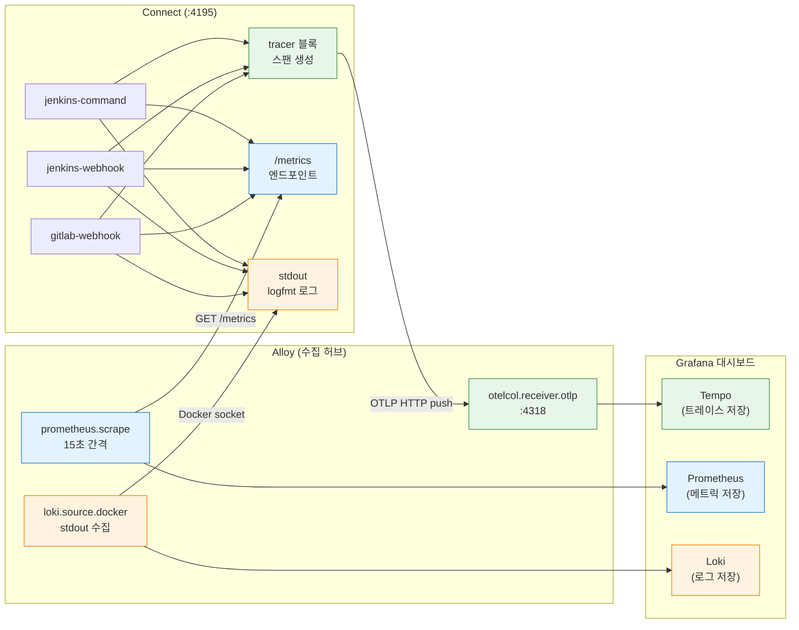
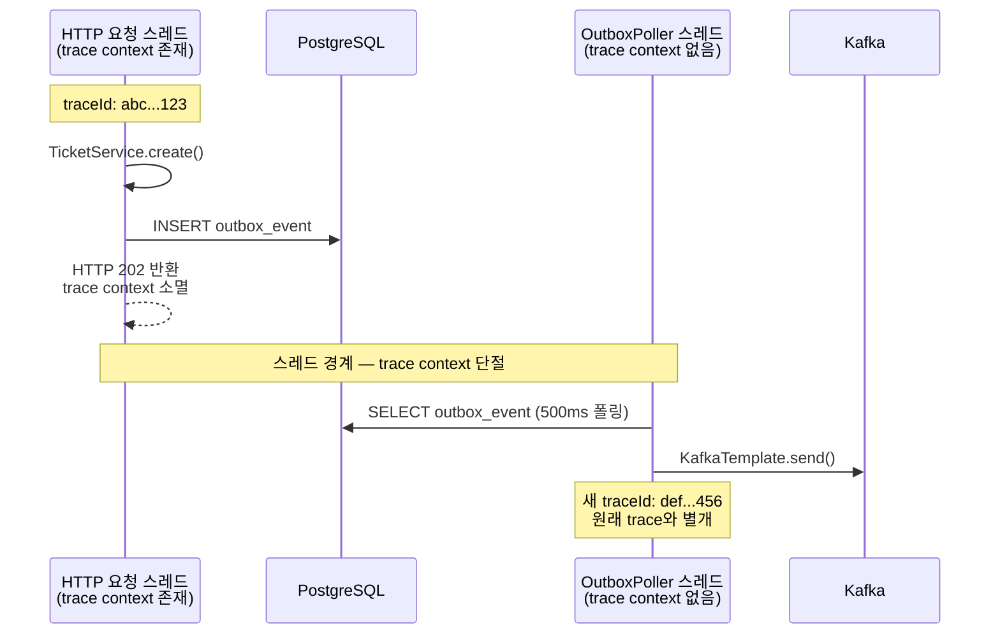
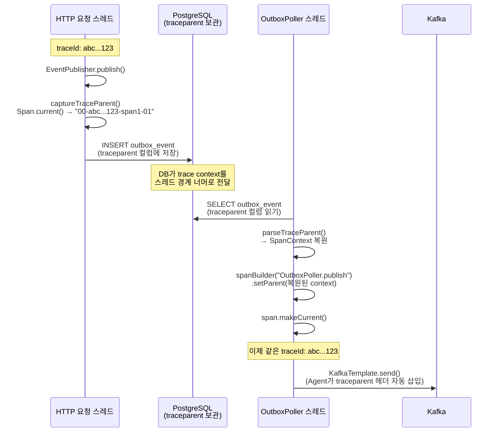
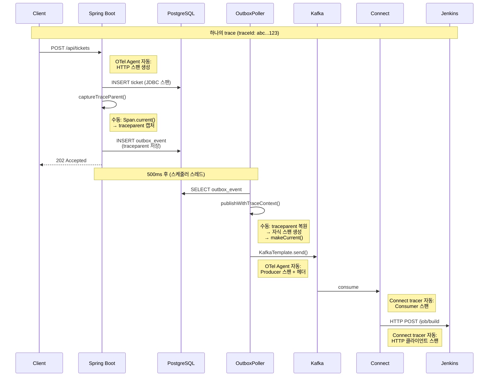
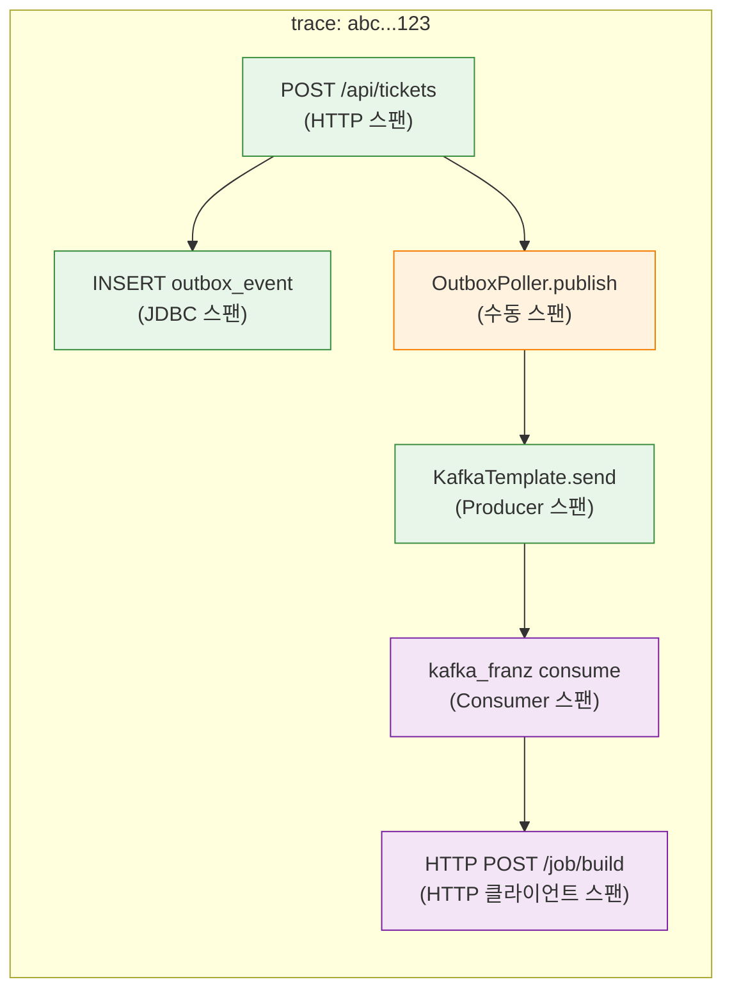
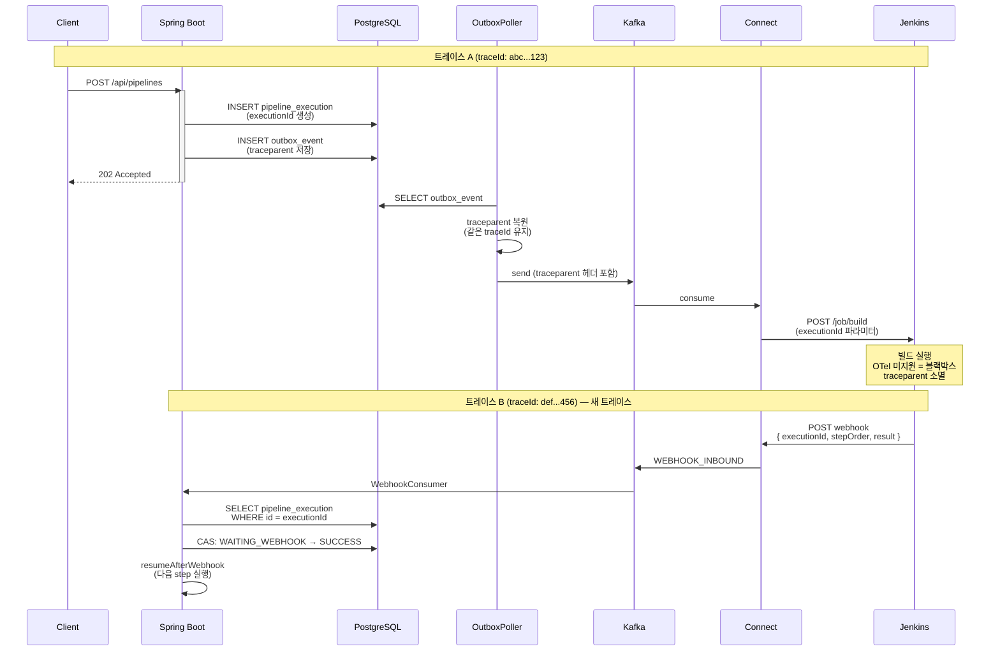

# OTel Instrumentation

이 문서는 Spring Boot OTel 계측 설정, Connect 관측성 설정, Alloy 설정 파일 상세, Outbox E2E 트레이스 연결, 그리고 향후 개선 방향을 다룬다. 아키텍처 개요는 [01-architecture-overview.md](./01-architecture-overview.md), 데이터 흐름 설정은 [02-setup-and-usage.md](./02-setup-and-usage.md), 문제 발생 시 [07-troubleshooting.md](./07-troubleshooting.md)을 참조한다.

---

## 1. Spring Boot OTel 계측 설정

### 1-1. 계측 방식: Spring Boot Starter (주) + Java Agent (선택)

이 프로젝트는 `opentelemetry-spring-boot-starter`를 **주 계측 방식**으로 사용한다. Starter는 Spring Boot Auto-Configuration으로 `TracerProvider`, `SpanExporter` 등을 등록하고, Spring AOP 기반으로 MVC, JDBC, Kafka를 자동 계측한다. 별도 JVM 인자 없이 의존성 추가만으로 동작한다.

```groovy
// build.gradle (root) — BOM으로 버전 통합 관리
mavenBom 'io.opentelemetry.instrumentation:opentelemetry-instrumentation-bom:2.12.0'

// app/build.gradle — Starter 의존성
implementation 'io.opentelemetry.instrumentation:opentelemetry-spring-boot-starter'
```

Java Agent(`-javaagent` JAR)는 **선택적 보강 수단**이다. `lib/opentelemetry-javaagent.jar` 파일이 존재하면 `bootRun` 태스크가 자동으로 `-javaagent` JVM 인자를 추가한다. Agent가 있으면 바이트코드 계측이 Starter의 AOP 계측보다 우선 적용되고, Agent가 없으면 Starter만으로 동작한다. 둘을 동시에 사용해도 Agent가 Starter를 감지하여 중복 계측을 자동 회피한다.

```groovy
tasks.named('bootRun') {
    def agentJar = rootProject.file('lib/opentelemetry-javaagent.jar')
    if (agentJar.exists()) {
        jvmArgs "-javaagent:${agentJar.absolutePath}"
        environment 'OTEL_SERVICE_NAME', 'redpanda-playground'
        // ...
    }
}
```

| 비교 | Spring Boot Starter | Java Agent |
|------|---------------------|------------|
| 설치 | Gradle 의존성 추가 | JAR 다운로드 + JVM 인자 |
| 계측 방식 | Spring AOP (프록시) | 바이트코드 조작 |
| 계측 범위 | Spring 관리 빈 (MVC, JDBC, Kafka 등) | 모든 라이브러리 (Netty, gRPC, JDBC 드라이버 등) |
| 장점 | 설정 간단, 앱과 동일 생명주기 | 더 넓은 계측 범위, 코드 변경 없음 |
| 이 프로젝트 | 항상 활성 | 선택적 (JAR 존재 시만) |

### 1-2. Java Agent 다운로드 (선택)

JAR은 `.gitignore`에 추가되어 있으므로, 필요 시 직접 다운로드한다. Agent 없이도 Starter만으로 계측이 동작한다.

```bash
mkdir -p lib
curl -sL https://github.com/open-telemetry/opentelemetry-java-instrumentation/releases/latest/download/opentelemetry-javaagent.jar \
  -o lib/opentelemetry-javaagent.jar
```

Agent를 비활성화하려면 JAR 파일을 삭제하거나 이름을 바꾸면 된다.

```bash
mv lib/opentelemetry-javaagent.jar lib/opentelemetry-javaagent.jar.bak
```

### 1-3. 자동 계측과 수동 계측의 경계

OTel Spring Boot Starter(또는 Agent)는 프레임워크 경계를 자동으로 계측한다. 하지만 애플리케이션이 의도적으로 만든 비동기 경계는 자동으로 넘지 못한다. 어디까지가 자동이고 어디서부터 수동 코드가 필요한지 구분해야 한다.

**자동 계측 (코드 변경 없이 Starter/Agent가 처리):**

| 경계 | 동작 | trace 연결 |
|------|------|-----------|
| HTTP 요청 → 서비스 로직 | Spring MVC 스팬 자동 생성 | 하나의 trace 안에서 연결 |
| 서비스 로직 → JDBC 쿼리 | SQL 스팬 자동 생성 | 부모 스팬의 자식으로 연결 |
| KafkaTemplate.send() | Producer 스팬 생성 + `traceparent` 헤더 삽입 | Kafka 메시지로 전파 |
| @KafkaListener 수신 | Consumer 스팬 생성 + `traceparent` 헤더에서 context 복원 | Producer trace에 연결 |

자동 처리가 가능한 이유는, 프레임워크 API 호출 시점에 현재 스레드의 trace context가 살아 있기 때문이다. HTTP 요청 스레드에서 KafkaTemplate.send()를 호출하면 Starter가 현재 context를 읽어 Kafka 헤더에 넣을 수 있다.

**수동 계측이 필요한 경우 (자동으로 못 하는 것):**

| 경계 | 왜 자동이 안 되는가 | 해결 |
|------|---------------------|------|
| Outbox 패턴 (DB → 별도 스레드 → Kafka) | DB에 저장 후 다른 스레드에서 폴링하므로 원래 trace context가 소멸 | traceparent를 DB에 함께 저장, 폴링 시 복원 |
| 외부 시스템 콜백 (Jenkins webhook) | Jenkins가 trace context를 전파하지 않음 | 연결 불가 (블랙박스) |
| 커스텀 스레드풀 / CompletableFuture | 스레드 전환 시 context가 전파되지 않을 수 있음 | `Context.current().wrap()` 사용 |

핵심 원리: **trace context는 스레드 로컬에 존재한다.** 같은 스레드 안에서 일어나는 프레임워크 호출은 자동 연결된다. 그러나 DB 저장 → 별도 스레드 폴링처럼 스레드 경계를 넘으면서 동시에 프레임워크가 아닌 커스텀 로직으로 연결되는 경우, context를 명시적으로 저장/복원하는 코드가 필요하다.

이 프로젝트에서 수동 계측이 필요한 유일한 지점이 Outbox 패턴이며, `EventPublisher`에서 traceparent를 캡처하고 `OutboxPoller`에서 복원하는 코드로 해결했다 (섹션 4 참조). 수동 스팬 생성 시에도 Starter가 등록한 동일한 `Tracer` API를 사용하므로 별도 설정이 필요 없다.

**비활성화한 자동 계측:**

- **Spring Scheduling** (`OTEL_INSTRUMENTATION_SPRING_SCHEDULING_ENABLED=false`): OutboxPoller(500ms)와 WebhookTimeoutChecker(30s)가 반복 실행되어 대량의 노이즈 트레이스를 생성하므로 비활성화했다. 이 설정은 Agent 사용 시에만 적용된다 — Starter는 @Scheduled를 계측하지 않으므로 Agent 없이 실행할 때는 이 문제가 발생하지 않는다. OutboxPoller는 수동 계측으로 대체했고, WebhookTimeoutChecker 에러는 Loki/Prometheus로 모니터링한다.

### 1-4. 설정 파일 상세

Spring Boot의 관측성은 3가지 신호(트레이스, 메트릭, 로그)를 각각 다른 방식으로 내보낸다. 각 신호마다 필요한 의존성과 설정 파일이 다르다. 중요한 점은 **Spring Boot는 Alloy의 존재를 모른다**는 것이다. 앱은 설정된 URL로 보내거나 엔드포인트를 노출할 뿐이고, 그 상대가 Alloy인지 Tempo/Loki/Prometheus 직접인지는 인프라 배선(포트 매핑)이 결정한다.

**build.gradle — 관측성 의존성 3개**

```groovy
// app/build.gradle

// [트레이스] OTel Spring Boot Starter — 자동 계측 + OTLP endpoint로 push
implementation 'io.opentelemetry.instrumentation:opentelemetry-spring-boot-starter'

// [메트릭] Micrometer Prometheus Registry — /actuator/prometheus 엔드포인트 노출
implementation 'io.micrometer:micrometer-registry-prometheus'

// [로그] Loki4j Logback Appender — Loki API 호환 엔드포인트로 push
implementation 'com.github.loki4j:loki-logback-appender:1.6.0'
```

세 의존성의 역할 분담:

| 신호 | 의존성 | 앱이 하는 일 | 상대가 누구인지 앱이 아는가? |
|------|--------|------------|--------------------------|
| 트레이스 | `opentelemetry-spring-boot-starter` | OTLP 프로토콜로 설정된 endpoint에 push | 모른다 — OTLP 수신자면 누구든 됨 |
| 메트릭 | `micrometer-registry-prometheus` | `/actuator/prometheus`에서 Prometheus 포맷으로 대기 | 모른다 — 누가 스크래핑하든 상관없음 |
| 로그 | `loki-logback-appender` | `/loki/api/v1/push`로 JSON 로그 push | 모른다 — Loki API 호환이면 누구든 됨 |

이 프로젝트에서는 세 신호 모두 Alloy가 받도록 포트를 배선했다. 하지만 `endpoint`를 Tempo 직접 주소로 바꾸면 Alloy 없이도 동작하고, 의존성은 동일하게 필요하다. 의존성은 **데이터를 만들거나 노출하는 역할**이지, 수집 인프라에 종속되지 않는다.

`micrometer-registry-prometheus`가 없으면 `/actuator/prometheus` 엔드포인트 자체가 존재하지 않아 누구도 메트릭을 가져갈 수 없다.

`loki-logback-appender`가 필요한 이유는 호스트에서 실행되는 Spring Boot가 Docker 컨테이너가 아니기 때문이다. Docker 소켓을 통한 로그 수집이 불가능하므로, Loki4j가 Loki API 호환 엔드포인트로 push하는 것이 유일한 경로다. 현재 이 엔드포인트가 Alloy를 가리키고 있을 뿐이다.

**application.yml — OTel 내보내기 설정**

```yaml
otel:
  service:
    name: redpanda-playground          # Tempo에서 서비스 식별자
  exporter:
    otlp:
      endpoint: http://localhost:24318 # OTLP 수신자 (현재 Alloy가 받도록 배선)
      protocol: http/protobuf          # gRPC 대신 HTTP 사용 (방화벽 친화적)
  metrics:
    exporter: none    # 메트릭은 /actuator/prometheus에서 pull 방식으로 노출
  logs:
    exporter: none    # 로그는 Loki4j Logback Appender가 별도 경로로 push
```

`endpoint`가 `localhost:24318`인 이유는 Spring Boot가 호스트에서 실행되고, Docker의 Alloy 컨테이너가 `24318:4318`로 포트 매핑되어 있기 때문이다. 이 URL을 Tempo 주소(`localhost:23200`)로 바꾸면 Alloy를 거치지 않고 직접 전송할 수도 있다. `metrics`와 `logs` exporter를 `none`으로 설정한 것은 각각 전용 채널(Prometheus 스크래핑, Loki4j push)이 이미 존재하므로 OTLP로 중복 전송할 필요가 없기 때문이다.

**application-gcp.yml — GCP 환경 오버라이드**

```yaml
otel:
  exporter:
    otlp:
      endpoint: http://34.22.78.240:4318  # Server 3 중앙 Alloy (직접 전송)
```

GCP에서는 Spring Boot가 Server 2에서 실행되고 Alloy가 Server 3에서 실행되므로, `localhost` 대신 Server 3의 외부 IP로 직접 전송한다. `service.name`과 `protocol`은 기본 프로필 값을 그대로 상속한다.

**build.gradle — OTel autoconfigure 활성화 (JVM arg)**

```groovy
tasks.named('bootRun') {
    // OTel SDK autoconfigure 활성화
    // application.yml의 otel.java.global-autoconfigure.enabled는 OTel SDK가 읽지 못한다.
    // OTel SDK는 JVM 시스템 프로퍼티(-D)만 인식하므로 build.gradle에서 직접 전달해야 한다.
    jvmArgs "-Dotel.java.global-autoconfigure.enabled=true"
}
```

이 설정이 없으면 앱 로그에 `AutoConfiguredOpenTelemetrySdk found on classpath but automatic configuration is disabled`가 출력되고, MDC에 traceId가 주입되지 않는다.

**logback-spring.xml — traceId가 로그에 묶이는 원리**

```xml
<!-- OTel Logback MDC — CONSOLE을 감싸서 MDC에 trace_id/span_id 자동 주입 -->
<appender name="OTEL_CONSOLE"
          class="io.opentelemetry.instrumentation.logback.mdc.v1_0.OpenTelemetryAppender">
    <appender-ref ref="CONSOLE"/>
</appender>

<!-- Loki4j — 항상 정의 (gcp 프로필에서만 root에 등록) -->
<appender name="LOKI" class="com.github.loki4j.logback.Loki4jAppender">
    <http>
        <url>http://localhost:23100/loki/api/v1/push</url>
    </http>
    <format>
        <message>
            <pattern>{"traceId":"%mdc{trace_id:-}","spanId":"%mdc{span_id:-}",...}</pattern>
        </message>
    </format>
</appender>

<!-- 프로필별 root 분기 — springProfile을 root 안에 넣으면 appender-ref가 인식 안 됨 -->
<springProfile name="!gcp">
    <root level="INFO">
        <appender-ref ref="OTEL_CONSOLE"/>
    </root>
</springProfile>
<springProfile name="gcp">
    <root level="INFO">
        <appender-ref ref="OTEL_CONSOLE"/>
        <appender-ref ref="LOKI"/>
    </root>
</springProfile>
```

traceId가 로그에 포함되는 과정:

1. `build.gradle`의 `-Dotel.java.global-autoconfigure.enabled=true`로 OTel SDK가 `TracerProvider`를 초기화한다
2. `OpenTelemetryAppender`가 로그 이벤트 발생 시 현재 스팬의 `trace_id`와 `span_id`를 MDC에 주입한다
3. Logback이 `%mdc{trace_id}`로 MDC 값을 꺼내 JSON 로그 메시지에 포함한다
4. Loki4j Appender가 이 JSON 로그를 Loki API 호환 엔드포인트로 push한다

> **MDC 키 이름 주의**: OTel Starter는 `trace_id`/`span_id`(밑줄)를 사용한다. `traceId`/`spanId`(카멜케이스)로 적으면 빈 값이 나온다.

> **logback-spring.xml 구조 주의**: `<root>` 안에 `<springProfile>`을 넣어서 `<appender-ref>`를 분기하면 인식되지 않는다. 반드시 `<springProfile>`로 `<root>` 자체를 분기해야 한다.

---

## 2. Connect 관측성 설정

### 2-1. streams 모드와 observability.yaml

Redpanda Connect는 `streams --chilled` 모드로 실행된다. 이 모드에서 `tracer`, `logger`, `metrics`, `http`는 파이프라인별이 아닌 서비스 전역 설정이다. 따라서 `-o` 플래그로 별도 파일(`observability.yaml`)에 둔다.

```bash
# docker-compose.yml의 command
redpanda-connect streams --chilled \
  -o /etc/connect/observability.yaml \
  /etc/connect/jenkins-command.yaml \
  /etc/connect/jenkins-webhook.yaml \
  /etc/connect/gitlab-webhook.yaml
```

설정 파일: `docker/connect/observability.yaml`

streams 모드에서 tracer 설정을 파이프라인 YAML에 넣으면 `field tracer not recognised` 경고가 발생한다. 반드시 `-o` 플래그 파일에만 넣어야 한다.

### 2-2. Connect 메트릭

`observability.yaml`에서 `metrics: { prometheus: {} }`를 선언하면, Connect가 `http.address`(4195 포트)에서 Prometheus 포맷의 `/metrics` 엔드포인트를 노출한다. Connect 자체가 메트릭을 어딘가에 push하는 것이 아니라, "누가 와서 가져가라"는 pull 방식이다.

수집 흐름은 다음과 같다:

```
Connect(:4195/metrics)  ←── Alloy가 15초마다 GET 요청 (prometheus.scrape)
                             │
                             └──→ Prometheus(:9090)에 remote_write
                                    │
                                    └──→ Grafana에서 PromQL로 조회
```

Alloy가 Connect 인스턴스(`connect:4195`) 하나를 스크래핑한다. Connect는 단일 인스턴스로 모든 파이프라인을 처리하므로 타겟이 1개다. Prometheus는 직접 스크래핑하지 않고 Alloy가 보내주는 값을 저장만 한다.

**주요 메트릭과 활용법:**

| 메트릭 | 타입 | 의미 | Grafana에서 확인하는 방법 |
|--------|------|------|------------------------|
| `input_received` | Counter | 파이프라인이 Kafka/HTTP에서 읽어들인 메시지 누적 수 | `rate(input_received[5m])` — 초당 입력 처리량 |
| `output_sent` | Counter | 파이프라인이 출력(Kafka/HTTP)으로 보낸 메시지 누적 수 | `rate(output_sent[5m])` — 초당 출력 처리량 |
| `output_error` | Counter | 출력 전송 실패 횟수 (연결 거부, 타임아웃 등) | `increase(output_error[1h]) > 0` — 에러 발생 알림 |
| `processor_latency_ns` | Histogram | 프로세서(bloblang 등)가 메시지 하나를 변환하는 데 걸린 시간(나노초) | `histogram_quantile(0.99, ...)` — P99 처리 지연 |

이 메트릭들은 streams 모드에서 파이프라인 이름(`path` 라벨)별로 분리된다. 예를 들어 `input_received{path="jenkins-command"}`와 `input_received{path="jenkins-webhook"}`를 비교하면 어떤 파이프라인에 트래픽이 집중되는지 알 수 있다.

`input_received`와 `output_sent`의 차이가 벌어지면 메시지가 프로세서에서 드롭되거나 필터링되고 있다는 뜻이다. `output_error`가 증가하면 다운스트림(Jenkins, Kafka 등)에 연결 문제가 있다는 신호다.

### 2-3. Connect 관측성 데이터 흐름

Connect 하나의 인스턴스에서 3가지 관측성 신호(트레이스, 메트릭, 로그)가 각각 다른 경로로 수집된다.



- **초록 경로 (트레이스)**: Connect가 스팬을 생성하여 Alloy에 push → Alloy가 Tempo에 전달
- **파랑 경로 (메트릭)**: Alloy가 Connect의 `/metrics`를 주기적으로 pull → Prometheus에 remote_write
- **주황 경로 (로그)**: Connect의 stdout을 Docker 소켓을 통해 Alloy가 수집 → Loki에 전달

`observability.yaml`은 4개 블록으로 구성된다. 각 블록이 어떤 역할을 하는지 설명한다.

```yaml
# docker/shared/connect/observability.yaml

logger:
  level: INFO
  format: logfmt               # 구조화된 key=value 형식 (Docker 로그로 수집)
  add_timestamp: true
  static_fields:
    service: redpanda-connect   # 모든 로그에 service 필드 추가

metrics:
  prometheus: {}                # /metrics 엔드포인트 활성화 (Alloy가 스크래핑)

http:
  enabled: true
  address: "0.0.0.0:4195"      # REST API + 메트릭 + 헬스체크 공유 포트

tracer:
  open_telemetry_collector:
    http:
      - address: alloy:4318    # OTLP HTTP로 Alloy에 전송
    tags:
      service.name: redpanda-connect  # Tempo에서 서비스 구분
```

**logger 블록** — Connect 프로세스의 내부 로그 출력 방식을 설정한다. Connect는 자체적으로 로그를 어딘가에 전송하지 않고, stdout으로 출력만 한다. 이 stdout 로그를 누가 수집하느냐는 인프라(Docker/Alloy) 영역이다.

`format: logfmt`은 `ts=2026-03-16T14:35:31 level=info msg="Pipeline started" service=redpanda-connect` 같은 key=value 형식으로 출력한다. JSON 포맷도 선택할 수 있지만, logfmt이 사람이 읽기 쉽고 grep으로 필터링하기도 편하다. `static_fields`의 `service: redpanda-connect`는 모든 로그 라인에 자동으로 `service=redpanda-connect`를 추가한다. Alloy가 Docker 소켓으로 이 로그를 수집한 뒤 Loki에 전달하면, Grafana에서 `{container="playground-connect"}`로 조회할 수 있다.

**tracer 블록** — Connect가 메시지를 처리할 때마다 "어디서 얼마나 걸렸는지"를 스팬(span)으로 기록한다. 예를 들어 jenkins-command 파이프라인이 Kafka에서 메시지를 읽고(input), bloblang으로 변환하고(processor), Jenkins에 HTTP POST하는(output) 과정을 각각 별도 스팬으로 생성한다. Grafana Tempo에서 이 스팬들을 이어 붙이면 "이 메시지가 어떤 경로로 흘렀고, 어디서 병목이 생겼는지" 한눈에 보인다.

이 스팬 데이터를 OTLP HTTP 프로토콜로 `alloy:4318`에 push한다. `alloy`는 같은 Docker 네트워크 안의 Alloy 컨테이너 호스트네임이다. Connect는 "Alloy에 보낸다"는 사실만 알고, 그 뒤에서 Alloy가 Tempo로 전달하는 것은 Connect와 무관하다. Spring Boot의 트레이스 전송과 동일한 원리인데, Spring Boot는 호스트에서 실행되므로 `localhost:24318`(Docker 포트 매핑)을 쓰고, Connect는 Docker 내부에서 실행되므로 컨테이너명 `alloy:4318`을 직접 쓰는 차이만 있다.

GCP 환경에서도 Connect는 동일하게 `alloy:4318`을 사용한다. Server 1에 Connect와 함께 Alloy 사이드카가 같은 Docker 네트워크에 있으므로 설정 변경이 필요 없다. 사이드카 Alloy가 받은 트레이스를 Server 3 중앙 Alloy로 릴레이하는 구조다.

**metrics 블록** — `prometheus: {}`라고 빈 객체만 선언하면 Connect가 "메트릭을 Prometheus 포맷으로 준비해두겠다"는 뜻이다. 별도 설정 없이 기본값만으로 `/metrics` 엔드포인트가 활성화된다. Connect가 메트릭을 어딘가에 보내는 것이 아니라, HTTP 포트(4195)에서 `/metrics` 경로로 요청이 오면 현재까지의 메트릭을 응답하는 pull 방식이다.

이 엔드포인트를 누가 가져가느냐는 Connect가 모른다. 이 프로젝트에서는 Alloy의 `prometheus.scrape "connect_command"`가 15초마다 `connect:4195/metrics`를 GET 요청해서 값을 수집한다. 메트릭의 상세 의미와 PromQL 예시는 위 섹션 2-2를 참조한다.

**http 블록** — Connect가 여는 단 하나의 HTTP 서버 포트다. 이 포트 하나에 여러 기능이 묶여 있다:

| 경로 | 기능 | 누가 사용하는가 |
|------|------|----------------|
| `/ready` | 헬스체크 (컨테이너 liveness/readiness) | Docker, K8s |
| `/metrics` | Prometheus 메트릭 (metrics 블록이 활성화한 것) | Alloy |
| `/streams/*` | 파이프라인 CRUD REST API (streams 모드 전용) | 관리자/디버깅 |

이 프로젝트에서 Connect는 **인스턴스 1개**(`playground-connect`, 포트 4195)가 `streams --chilled` 모드로 **파이프라인 3개**(jenkins-command, jenkins-webhook, gitlab-webhook)를 동시에 실행한다. 파이프라인별 메트릭은 `path` 라벨로 구분되므로 인스턴스를 나눌 필요가 없다. Alloy는 `connect:4195` 하나만 스크래핑 타겟으로 등록한다.

---

## 3. Alloy 설정 파일 상세

Alloy는 "앱은 OTLP만 알면 된다" 원칙의 핵심이다. 로그, 트레이스, 메트릭 세 가지 신호가 모두 Alloy를 거쳐 각 백엔드(Loki, Tempo, Prometheus)로 라우팅된다. `alloy-config.alloy` 파일의 각 블록을 데이터 흐름별로 설명한다.

설정 파일: `docker/shared/monitoring/alloy-config.alloy` (로컬 개발 기준, 전체 기능 포함)

> **shared vs deploy**: `shared/`는 로컬 docker-compose 개발용 설정으로, 하나의 Alloy가 모든 수집 기능을 담당한다. GCP `deploy/` 환경은 서버 3대에 역할이 분산되어 각 서버의 Alloy가 필요한 블록만 포함한다. 이 문서는 `shared/` 기준으로 전체 기능을 설명하고, 환경별 차이는 아래 테이블을 참조한다.

**환경별 Alloy 설정 비교:**

| 설정 파일 | 역할 | Docker 로그 | Spring Boot<br/>로그 수신 | OTLP 트레이스 | 메트릭 스크래핑 | 전송 대상 |
|----------|------|:-----------:|:------------------------:|:-------------:|:--------------:|----------|
| `shared/` | 로컬 올인원 | O | O (`loki.source.api`) | O (노이즈 필터 포함) | O (4타겟) | 같은 네트워크의 Loki/Tempo/Prometheus |
| `deploy/local/` | 로컬→GCP 릴레이 | X | O (`loki.source.api`) | O (릴레이만) | O (Spring Boot만) | Server 3 외부IP (`34.22.78.240`) |
| `deploy/server-1/` | Redpanda+Connect 사이드카 | O | X | O (릴레이만) | O (Redpanda+Connect) | Server 3 내부IP (`10.178.0.4`) |
| `deploy/server-2/` | Jenkins 사이드카 | O (Jenkins만) | X | X | X | Server 3 내부IP (`10.178.0.4`) |
| `deploy/server-3/` | **중앙 수집기** | O (자체 컨테이너) | X | O (**노이즈 필터 포함**) | X | 같은 네트워크의 Loki/Tempo |

핵심 설계 원칙은 **노이즈 필터를 Server 3 한 곳에만 두는 것**이다. Server 1과 Local의 사이드카 Alloy는 트레이스를 필터 없이 그대로 Server 3로 릴레이하고, Server 3 Alloy가 모든 트레이스를 한 곳에서 필터링한다. 이렇게 하면 필터 규칙을 변경할 때 사이드카 설정을 건드리지 않고 Server 3 설정만 수정하면 된다.

`loki.source.api`(Spring Boot 로그 수신)가 `shared/`와 `deploy/local/`에 있는 이유는, Spring Boot가 호스트에서 실행되어 Docker 소켓으로 로그를 수집할 수 없기 때문이다. Loki4j Logback Appender가 `localhost:23100`으로 push하면 Alloy가 받아서 Loki로 전달한다. `deploy/local/`은 Server 3 Loki 외부IP로 직접 전송하고, `shared/`는 같은 Docker 네트워크의 Loki로 전달하는 차이가 있다. Loki4j는 `gcp` 프로필에서만 활성화되므로 `SPRING_PROFILES_ACTIVE=gcp`로 실행해야 한다(`make backend`).

### 3-0. Alloy 설정 문법 (River)

Alloy 설정 파일은 **River**라는 자체 문법을 사용한다. Terraform의 HCL과 유사한 블록 기반 선언형 언어다. YAML이나 JSON과 달리 블록 간 참조(연결)를 표현식으로 지원하는 것이 특징이다.

#### 블록 구조

River의 기본 단위는 **컴포넌트 블록**이다. 하나의 블록이 하나의 수집/가공/전송 단계를 담당한다.

```alloy
컴포넌트_타입 "라벨" {
  속성_이름 = 값

  중첩_블록 {
    속성 = 값
  }
}
```

실제 예시로 분해하면:

```alloy
loki.source.docker "containers" {
// ^^^^^^^^^^^^^^^^^^  ^^^^^^^^^^^^
// 컴포넌트 타입         라벨
//
// 컴포넌트 타입: "어떤 종류의 작업을 하는가"
//   → loki.source.docker = Docker 소켓에서 로그를 읽는 컴포넌트
//
// 라벨: "같은 타입의 여러 인스턴스를 구분하는 이름"
//   → 예: prometheus.scrape "spring_boot" / prometheus.scrape "redpanda"
//     같은 타입이지만 라벨로 구분하여 여러 스크래핑 타겟 선언 가능

  host       = "unix:///var/run/docker.sock"    // 문자열 속성
  targets    = discovery.relabel.playground_only.output  // 다른 블록의 출력 참조
  forward_to = [loki.process.multiline.receiver]         // 배열 — 다음 블록으로 연결
}
```

#### 데이터 타입

```alloy
// 문자열
endpoint = "http://tempo:4318"

// 숫자
scrape_interval = "15s"     // 시간 단위 포함 문자열 (River는 duration을 문자열로 표현)

// 배열 — 여러 대상에 동시에 보낼 때
forward_to = [loki.process.multiline.receiver, loki.write.default.receiver]

// 객체 배열 — 스크래핑 타겟 선언
targets = [{ __address__ = "redpanda:9644" }]

// 중첩 블록 — 하위 설정 그룹핑
http {
  endpoint = "0.0.0.0:4318"
}
```

#### 컴포넌트 타입 네이밍 규칙

컴포넌트 타입은 `네임스페이스.역할.세부` 형태로 구성된다. 이름만 읽으면 "무엇을 어떻게 하는지" 파악할 수 있다.

```
loki.source.docker
^^^^  ^^^^^^  ^^^^^^
│     │       └─ 세부: Docker 소켓에서 (어디서)
│     └─ 역할: 데이터를 읽어들이는 입력 (무엇을)
└─ 네임스페이스: 로그 처리 계열 (어떤 신호)
```

**네임스페이스별 정리:**

| 네임스페이스 | 담당 신호 | 역할 키워드 | 의미 |
|-------------|----------|-----------|------|
| `discovery` | (공통) | `docker` | Docker 소켓에서 컨테이너 목록 감지 |
| `discovery` | (공통) | `relabel` | 감지된 타겟에 keep/drop 필터, 라벨 가공 |
| `loki` | 로그 | `source` | 로그 입력 — `docker`(소켓 읽기), `api`(HTTP 수신) |
| `loki` | 로그 | `process` | 로그 가공 — 멀티라인 합치기, 정규식 추출 |
| `loki` | 로그 | `write` | 로그 출력 — Loki API로 push |
| `otelcol` | 트레이스 | `receiver` | OTLP 입력 — gRPC/HTTP로 스팬 수신 |
| `otelcol` | 트레이스 | `processor` | OTLP 가공 — 필터, 배치, 샘플링 |
| `otelcol` | 트레이스 | `exporter` | OTLP 출력 — Tempo/다른 Alloy로 전송 |
| `prometheus` | 메트릭 | `scrape` | 메트릭 입력 — 타겟의 /metrics를 GET (pull) |
| `prometheus` | 메트릭 | `remote_write` | 메트릭 출력 — Prometheus remote_write API로 push |

패턴이 보인다: 각 네임스페이스가 **입력(source/receiver/scrape) → 가공(process/processor) → 출력(write/exporter/remote_write)** 3단계 파이프라인을 따른다.

#### 블록 간 연결 (파이프라인 구성)

River의 핵심은 블록 간 **참조 표현식**으로 파이프라인을 구성하는 것이다. 한 블록의 출력을 다음 블록의 입력에 연결한다.

```alloy
// ① loki 계열: forward_to 속성으로 연결
//    참조 형식: 컴포넌트_타입.라벨.receiver
loki.source.docker "containers" {
  forward_to = [loki.process.multiline.receiver]
  //            ^^^^^^^^^^^^^^^^^^^^^^^^^^^^^
  //            loki.process "multiline" 블록의 receiver 포트를 참조
}

loki.process "multiline" {
  // ... 가공 로직 ...
  forward_to = [loki.process.extract_trace.receiver]  // 다음 단계로 전달
}

loki.process "extract_trace" {
  // ... 가공 로직 ...
  forward_to = [loki.write.default.receiver]  // 최종 출력으로 전달
}

// ② otelcol 계열: output 블록 + input 참조
//    참조 형식: 컴포넌트_타입.라벨.input
otelcol.receiver.otlp "default" {
  output {
    traces = [otelcol.processor.filter.noise.input]
    //        ^^^^^^^^^^^^^^^^^^^^^^^^^^^^^^^^^^^^
    //        otelcol.processor.filter "noise" 블록의 input 포트를 참조
  }
}

// ③ prometheus 계열: forward_to (loki와 동일)
prometheus.scrape "spring_boot" {
  forward_to = [prometheus.remote_write.default.receiver]
}
```

loki/prometheus는 `forward_to` → `.receiver`, otelcol은 `output` → `.input`으로 문법이 다르지만 의미는 동일하다. `forward_to`는 배열이므로 하나의 출력을 **여러 대상에 동시에** 보낼 수도 있다(팬아웃).

#### 참조 표현식 읽는 법

```alloy
forward_to = [loki.process.multiline.receiver]
```

이 표현식을 풀어 읽으면:

```
loki.process  .  multiline  .  receiver
^^^^^^^^^^^      ^^^^^^^^^     ^^^^^^^^
컴포넌트 타입     라벨          내보내는 포트
(어떤 블록?)     (어떤 인스턴스?)  (그 블록의 입력 포트)
```

`discovery.relabel.playground_only.output`도 같은 구조다 — `discovery.relabel` 타입의 `playground_only` 라벨 블록이 내보내는 `output` 결과를 참조한다.

#### 파일 내 블록 순서

River에서 블록의 **물리적 순서는 중요하지 않다.** 참조 표현식으로 연결 관계가 결정되므로, `loki.write`를 파일 맨 위에 두고 `loki.source.docker`를 맨 아래에 둬도 동작은 동일하다. 다만 가독성을 위해 이 프로젝트에서는 데이터 흐름 순서(입력 → 가공 → 출력)로 배치했다.

### 3-1. Docker 로그 수집 파이프라인

Docker 소켓에서 컨테이너를 자동 발견하고, 로그를 수집하여 Loki로 전송하는 파이프라인이다.

```
discovery.docker → discovery.relabel → loki.source.docker
  → loki.process.multiline → loki.process.extract_trace → loki.write
```

**discovery.docker**: Docker 소켓(`/var/run/docker.sock`)에 접속하여 실행 중인 컨테이너 목록을 실시간으로 감지한다. 새 컨테이너가 뜨면 자동으로 수집 대상에 추가된다.

**discovery.relabel**: 두 가지 필터링 규칙을 적용한다.

```alloy
// playground- 접두사 컨테이너만 keep
rule {
  source_labels = ["__meta_docker_container_name"]
  regex         = "/playground-.*"
  action        = "keep"
}

// GitLab은 로그량이 과도하여 drop
rule {
  source_labels = ["__meta_docker_container_name"]
  regex         = "/playground-gitlab"
  action        = "drop"
}
```

`playground-` 접두사를 사용하는 이유는 모니터링 스택 자체(Alloy, Loki, Tempo, Prometheus, Grafana)의 로그를 수집하면 재귀 루프가 발생하기 때문이다. GitLab 컨테이너는 Rails/Puma/Sidekiq 등의 내부 로그가 방대하여 Loki 인제스트 제한(4MB/s)을 초과하므로 드롭한다.

**loki.process.multiline**: Docker 컨테이너의 로그는 기본적으로 **줄 단위**로 수집된다. 문제는 Java 예외 스택트레이스가 여러 줄에 걸쳐 출력된다는 것이다. 멀티라인 처리가 없으면 하나의 예외가 Loki에서 10~20개의 별도 로그 엔트리로 쪼개져서, 검색도 어렵고 가독성도 떨어진다. `stage.multiline`은 "새 로그 라인의 시작"을 정규식으로 판별하여, 그 사이의 줄들을 하나의 엔트리로 합친다.

```alloy
stage.multiline {
  firstline     = "^\\d{4}-\\d{2}-\\d{2}|^\\[|^ts=|^level="
  max_wait_time = "3s"    // 3초간 다음 firstline이 없으면 현재 블록 확정
  max_lines     = 128
}
```

`firstline` 정규식의 각 패턴이 어떤 로그를 매칭하는지:

| 패턴 | 매칭 대상 | 실제 로그 예시 |
|------|----------|--------------|
| `^\\d{4}-\\d{2}-\\d{2}` | Spring Boot 로그 (날짜로 시작) | `2026-03-16 14:35:31 [INFO] [main] c.s.p.Application - Started` |
| `^\\[` | Spring Boot 로그 (대괄호로 시작하는 변형) | `[2026-03-16 14:35:31.123] INFO ...` |
| `^ts=` | Connect의 logfmt | `ts=2026-03-16T14:35:31 level=info msg="Pipeline started"` |
| `^level=` | Redpanda 브로커 로그 | `level=info msg="Kafka API request"` |

**실제 Spring Boot 스택트레이스에서의 동작 예시:**

```
2026-03-16 14:35:31 [ERROR] [http-1] c.s.p.pipeline.engine.PipelineEngine - Step execution failed   ← firstline 매칭 ✓ (새 엔트리 시작)
org.springframework.web.client.ResourceAccessException: I/O error on POST request                    ← 매칭 안 됨 → 위에 합침
    at org.springframework.web.client.RestTemplate.doExecute(RestTemplate.java:785)                  ← 매칭 안 됨 → 위에 합침
    at org.springframework.web.client.RestTemplate.execute(RestTemplate.java:711)                    ← 매칭 안 됨 → 위에 합침
Caused by: java.net.ConnectException: Connection refused                                             ← 매칭 안 됨 → 위에 합침
    at java.net.PlainSocketImpl.socketConnect(Native Method)                                         ← 매칭 안 됨 → 위에 합침
2026-03-16 14:35:31 [INFO] [scheduling-1] c.s.p.common.outbox.OutboxPoller - Published 3 events     ← firstline 매칭 ✓ (새 엔트리 시작 → 이전 블록 확정)
```

위 예시에서 첫 번째 `2026-03-16`으로 시작하는 ERROR 줄부터 `PlainSocketImpl` 줄까지 6줄이 **하나의 Loki 엔트리**로 합쳐진다. 다음 `2026-03-16`으로 시작하는 INFO 줄이 나타나면 이전 블록이 확정되고 새 엔트리가 시작된다.

`max_wait_time = "3s"`는 마지막 줄 이후 3초간 새로운 firstline이 나타나지 않으면 현재 블록을 확정한다는 뜻이다. 로그 출력이 끊긴 구간에서 스택트레이스가 무한정 대기하지 않도록 하는 안전장치다.

**loki.process.extract_trace**: 로그 본문에서 `traceId=xxx` 패턴을 정규식으로 추출하여 Loki Structured Metadata에 저장한다.

```alloy
stage.regex {
  expression = "traceId=(?P<trace_id>\\w+)"
}
stage.structured_metadata {
  values = { trace_id = "trace_id" }
}
```

**실제 Spring Boot 로그에서의 추출 과정:**

Spring Boot 로그의 JSON 메시지 본문에 `traceId` 필드가 포함되어 있다(logback-spring.xml의 `%mdc{traceId:-}`가 삽입한 값). Docker 컨테이너 로그로 수집된 경우에도 동일하게 적용된다.

```
// 실제 Docker 컨테이너 로그 (Spring Boot가 컨테이너로 실행될 때)
2026-03-16 14:35:31 [INFO] [http-1] c.s.p.ticket.TicketService - Ticket created traceId=a1b2c3d4e5f6a7b8c9d0e1f2a3b4c5d6 spanId=1a2b3c4d5e6f7a8b

// 정규식 매칭 결과:
//   traceId=(?P<trace_id>\w+)
//          ^^^^^^^^^^^^^^^^^^^^^^^^^^^^^^^^
//   캡처 그룹 trace_id = "a1b2c3d4e5f6a7b8c9d0e1f2a3b4c5d6"
```

`stage.regex`가 로그 본문 전체에서 `traceId=` 뒤의 연속된 영숫자(`\w+`)를 `trace_id`라는 이름으로 캡처한다. `stage.structured_metadata`가 이 캡처된 값을 Loki Structured Metadata에 `trace_id` 키로 저장한다. traceId가 없는 로그(예: 스케줄러 로그, 라이브러리 초기화 로그)는 정규식이 매칭되지 않아 `trace_id` 메타데이터 없이 저장된다.

Structured Metadata를 사용하는 이유는 카디널리티 때문이다. traceId는 요청마다 고유한 값이므로 Loki 라벨로 올리면 스트림 수가 폭발한다. Structured Metadata는 인덱싱되지 않지만 쿼리 시 필터링이 가능하여, 카디널리티 문제 없이 trace_id로 로그를 검색할 수 있다. Grafana의 Loki → Tempo 점프 기능도 이 값을 사용한다.

```
// Grafana Loki에서 특정 트레이스의 로그 조회
{service_name="redpanda-playground"} | trace_id = "a1b2c3d4e5f6a7b8c9d0e1f2a3b4c5d6"
```

### 3-2. Spring Boot 로그 수신

```alloy
loki.source.api "spring_boot" {
  http {
    listen_address = "0.0.0.0"
    listen_port    = 3100    // Docker 포트 매핑: 23100:3100
  }
  forward_to = [loki.write.default.receiver]
}
```

호스트에서 실행되는 Spring Boot는 Docker 컨테이너가 아니므로 Docker 소켓을 통한 로그 수집이 불가능하다. 대신 Loki4j Logback Appender가 이 HTTP 엔드포인트로 로그를 push한다. Alloy가 받아서 `loki.write`로 전달하므로 Docker 컨테이너 로그와 동일한 Loki 인스턴스에 저장된다.

직접 Loki에 push하지 않고 Alloy를 경유하는 이유는, 수집 경로를 하나로 통일하면 나중에 필터링이나 라벨 가공을 Alloy 한 곳에서만 변경할 수 있기 때문이다.

### 3-3. OTLP 수신 → 노이즈 필터 → Tempo 전송

Spring Boot(OTel Starter/Agent)와 Connect(tracer.otel)가 보내는 트레이스를 수신하고, 노이즈를 제거한 뒤 Tempo로 전달한다.

```alloy
otelcol.receiver.otlp "default" {
  grpc { endpoint = "0.0.0.0:4317" }
  http { endpoint = "0.0.0.0:4318" }
  output {
    traces = [otelcol.processor.filter.noise.input]
  }
}
```

gRPC(4317)와 HTTP(4318) 두 프로토콜을 모두 수신한다. Spring Boot는 `http/protobuf` 프로토콜로 4318 포트를, Connect도 OTLP HTTP로 4318 포트를 사용한다.

**노이즈 필터 — 4가지 드롭 규칙:**

```alloy
otelcol.processor.filter "noise" {
  error_mode = "ignore"
  traces {
    span = [
      "IsMatch(name, \"SELECT playground.outbox_event.*\")",
      "IsMatch(name, \"UPDATE playground.outbox_event.*\")",
      "name == \"playground\"",
      "name == \"GET /actuator/prometheus\"",
    ]
  }
}
```

| 규칙 | 대상 | 드롭하는 이유 |
|------|------|--------------|
| `SELECT outbox_event` | OutboxPoller의 500ms 주기 폴링 JDBC 쿼리 | @Scheduled 계측 비활성화 후에도 JDBC 자동 계측으로 root 스팬 생성 |
| `UPDATE outbox_event` | 발행 완료 후 상태 업데이트 JDBC 쿼리 | 위와 동일, 비즈니스 가치 없는 반복 쿼리 |
| `playground` | DB 커넥션 풀 체크 (db.statement 비어 있음) | HikariCP 헬스체크, 내용 없는 스팬 |
| `GET /actuator/prometheus` | Alloy의 15초 간격 메트릭 스크래핑 | 모니터링이 모니터링을 트레이싱하는 재귀 |

이 스팬들은 모두 **자식이 없는 단독 스팬**(leaf span)이므로 드롭해도 다른 트레이스의 연결이 끊기지 않는다. @Scheduled 제거가 2단계인 이유는, 1단계(Agent 설정)로 Spring Scheduling 스팬 자체를 비활성화했지만, 그 안에서 호출하는 JDBC 쿼리는 JDBC 계측이 별도로 잡아내기 때문이다. 결국 스케줄러 스팬은 사라졌지만 JDBC 스팬이 부모 없이 root 스팬으로 남게 되어, 2단계(Alloy 필터)로 제거한다.

### 3-4. 메트릭 스크래핑

```alloy
prometheus.scrape "spring_boot" {
  targets         = [{ __address__ = "host.docker.internal:8080" }]
  metrics_path    = "/actuator/prometheus"
  scrape_interval = "15s"
}
prometheus.scrape "redpanda" {
  targets         = [{ __address__ = "redpanda:9644" }]
}
prometheus.scrape "connect_command" {
  targets         = [{ __address__ = "connect:4195" }]
}
prometheus.scrape "node" {
  targets         = [{ __address__ = "<host-ip>:9100", server = "<server-name>" }]
}
prometheus.remote_write "default" {
  endpoint { url = "http://prometheus:9090/api/v1/write" }
}
```

Alloy가 4개 타겟을 15초 간격으로 스크래핑하고 `remote_write`로 Prometheus에 전송한다. Prometheus 자체는 스크래핑을 하지 않고 **저장(TSDB) + 쿼리(PromQL)만 담당**한다. 이 구조의 장점은 스크래핑 설정을 Alloy 한 곳에서 관리할 수 있다는 것이다 — Prometheus의 `prometheus.yml`에 `scrape_configs`를 넣지 않아도 된다.

- `host.docker.internal:8080`: 호스트에서 실행되는 Spring Boot의 Actuator
- `redpanda:9644`: Redpanda 브로커의 내장 메트릭 (admin API 포트)
- `connect:4195`: Connect 단일 인스턴스 메트릭 (모든 파이프라인 포함)
- `<host-ip>:9100`: node_exporter 서버 리소스 메트릭 (CPU, 메모리, 디스크)

### 3-5. Grafana 상관관계 설정 (datasources.yaml)

세 데이터소스 간의 점프를 가능하게 하는 Grafana provisioning 설정이다.

```yaml
# docker/shared/monitoring/grafana/provisioning/datasources/datasources.yaml

# Loki → Tempo: 로그에서 트레이스로 점프
- name: Loki
  jsonData:
    derivedFields:
      - name: TraceID
        datasourceUid: tempo
        matcherRegex: "traceId=(\\w+)"   # 로그 본문에서 traceId 추출
        url: "$${__value.raw}"           # 추출된 값으로 Tempo 쿼리

# Tempo → Loki: 트레이스에서 로그로 역점프
- name: Tempo
  jsonData:
    tracesToLogs:
      datasourceUid: loki
      filterByTraceID: true              # trace_id로 로그 필터링
      mappedTags:
        - key: service.name
          value: service_name            # OTel 태그 → Loki 라벨 매핑
    serviceMap:
      datasourceUid: prometheus          # 서비스 맵 시각화에 Prometheus 메트릭 사용
```

**Loki → Tempo** (`derivedFields`): Loki Explore에서 로그를 볼 때, 로그 본문에서 `traceId=abc123` 패턴을 정규식으로 매칭한다. 매칭된 값이 Tempo 링크로 변환되어 클릭 한 번으로 해당 트레이스 전체를 볼 수 있다.

**Tempo → Loki** (`tracesToLogs`): Tempo에서 트레이스를 볼 때, 스팬 옆에 "Logs" 버튼이 나타난다. 클릭하면 해당 `traceId`로 Loki를 쿼리하여 같은 요청의 로그를 보여준다. `service.name` → `service_name` 매핑은 OTel의 리소스 어트리뷰트 이름(점 표기)을 Loki 라벨 이름(밑줄 표기)으로 변환하는 것이다.

**Tempo → Prometheus** (`serviceMap`): Tempo의 Service Graph 뷰에서 서비스 간 호출 관계를 시각화할 때 Prometheus의 `traces_service_graph_*` 메트릭을 사용한다.

---

## 4. Outbox E2E 트레이스 연결

### 4-0. 문제: Outbox 패턴에서 트레이스가 끊기는 이유

OTel의 trace context는 **스레드 로컬**에 존재한다. 같은 스레드 안에서 일어나는 프레임워크 호출(HTTP → JDBC → KafkaTemplate)은 Agent가 자동으로 연결한다. 그러나 Outbox 패턴은 의도적으로 스레드 경계를 넘는다.



HTTP 요청의 trace와 Kafka 발행의 trace가 분리되면 Tempo에서 하나의 비즈니스 흐름을 추적할 수 없다. 이 문제를 해결하기 위해 **DB에 traceparent를 저장하고 폴링 시 복원**하는 수동 계측을 구현했다.

### 4-0-1. 해결 전략: DB를 trace context 전달 매체로 사용



### 4-0-2. E2E 트레이스 전체 흐름



### 4-0-3. 구현 상세: EventPublisher (traceparent 캡처)

`EventPublisher.publish()`는 비즈니스 로직이 호출하는 유일한 진입점이다. outbox INSERT 전에 현재 활성 스팬의 trace context를 W3C traceparent 형식으로 캡처한다.

```java
// EventPublisher.java
public void publish(String aggregateType, String aggregateId,
                    String eventType, byte[] payload,
                    String topic, String correlationId) {
    OutboxEvent event = OutboxEvent.of(aggregateType, aggregateId,
                                        eventType, payload, topic, correlationId);
    event.setTraceParent(captureTraceParent());  // ← trace context를 DB에 저장
    outboxMapper.insert(event);
}

private String captureTraceParent() {
    SpanContext ctx = Span.current().getSpanContext();
    if (!ctx.isValid()) {       // OTel Agent 없으면 invalid → null 반환
        return null;
    }
    // W3C traceparent 형식: version-traceId(32hex)-spanId(16hex)-flags
    return String.format("00-%s-%s-01", ctx.getTraceId(), ctx.getSpanId());
}
```

**왜 `Span.current()`인가**: OTel Agent가 HTTP 요청을 처리할 때 스레드 로컬에 현재 스팬을 설정한다. `Span.current()`는 이 스레드 로컬에서 활성 스팬을 꺼낸다. HTTP 요청 스레드 안에서 호출되므로 해당 HTTP 스팬의 traceId와 spanId를 얻을 수 있다.

**OTel Agent 없이 실행하면**: `Span.current()`가 `Span.getInvalid()`를 반환하고, `isValid()`가 false이므로 traceparent를 저장하지 않는다. 기존 동작과 완전히 동일하다.

### 4-0-4. 구현 상세: OutboxEvent 엔티티

```java
// OutboxEvent.java
@Getter @Setter @Builder
public class OutboxEvent {
    private Long id;
    private String aggregateType;
    private String aggregateId;
    private String eventType;
    private byte[] payload;
    private String topic;
    private String status;          // PENDING → SENT / DEAD
    private Integer retryCount;
    private String correlationId;
    private String traceParent;     // ← "00-{traceId}-{spanId}-01" 또는 null
}
```

DB 스키마에서 `trace_parent`는 VARCHAR 컬럼이다. 값 예시: `00-abcdef1234567890abcdef1234567890-1234567890abcdef-01`.

### 4-0-5. 구현 상세: OutboxPoller (traceparent 복원 → 자식 스팬 생성)

OutboxPoller의 `publishWithTraceContext()`가 핵심이다. 3단계로 동작한다.

**단계 1: traceparent 파싱**

```java
private SpanContext parseTraceParent(String traceParent) {
    if (traceParent == null || traceParent.isEmpty()) return null;
    String[] parts = traceParent.split("-");     // ["00", traceId, spanId, "01"]
    if (parts.length < 4) return null;
    return SpanContext.createFromRemoteParent(
            parts[1],                            // traceId (32hex)
            parts[2],                            // spanId (16hex)
            TraceFlags.getSampled(),             // 샘플링 활성
            TraceState.getDefault()
    );
}
```

`createFromRemoteParent`는 "원격 서비스에서 전달받은 parent context"를 나타낸다. 실제로는 같은 앱이지만 스레드가 다르므로 remote parent로 취급한다.

**단계 2: 자식 스팬 생성 + 현재 context로 설정**

```java
private void publishWithTraceContext(ProducerRecord<String, byte[]> record,
                                      OutboxEvent event) throws Exception {
    SpanContext parentContext = parseTraceParent(event.getTraceParent());
    if (parentContext == null) {
        // traceparent 없음 → 새 trace로 발행 (OTel Agent 없이 실행한 경우)
        kafkaTemplate.send(record).get(5, TimeUnit.SECONDS);
        return;
    }

    // traceparent 있음 → 원래 HTTP 요청 trace의 자식 스팬 생성
    Tracer tracer = GlobalOpenTelemetry.getTracer("outbox-poller");
    Span span = tracer.spanBuilder("OutboxPoller.publish")
            .setParent(Context.current().with(Span.wrap(parentContext)))  // ← 핵심: parent 연결
            .setAttribute("outbox.event.id", event.getId())
            .setAttribute("outbox.event.type", event.getEventType())
            .startSpan();

    try (Scope ignored = span.makeCurrent()) {   // ← 이 스팬을 스레드 로컬에 설정
        kafkaTemplate.send(record).get(5, TimeUnit.SECONDS);
        // ↑ OTel Agent가 KafkaTemplate.send()를 자동 계측
        //   makeCurrent()로 설정된 스팬을 parent로 사용
        //   Kafka 메시지 헤더에 traceparent 자동 삽입
    } catch (Exception e) {
        span.setStatus(StatusCode.ERROR, e.getMessage());
        span.recordException(e);
        throw e;
    } finally {
        span.end();
    }
}
```

**`span.makeCurrent()`가 핵심인 이유**: 이 호출이 생성한 스팬을 스레드 로컬의 현재 스팬으로 설정한다. 이후 같은 `try` 블록 안에서 `KafkaTemplate.send()`가 호출되면, OTel Agent가 자동으로 현재 스팬(OutboxPoller.publish)을 parent로 잡고 Kafka Producer 스팬을 자식으로 생성한다. 그리고 Kafka 메시지 헤더에 `traceparent`를 삽입하여 Connect가 이어받을 수 있게 한다.

**단계 3: OTel Agent 자동 전파 (코드 변경 없음)**

`makeCurrent()` 이후의 `kafkaTemplate.send()` 호출에서 다음이 자동으로 일어난다:

```
kafkaTemplate.send(record)
  → OTel Agent bytecode instrumentation
  → 현재 스레드의 Span (OutboxPoller.publish)을 parent로 Kafka Producer 스팬 생성
  → ProducerRecord 헤더에 traceparent 삽입
  → Kafka 메시지 전송

Connect가 메시지 소비 시:
  → Kafka 메시지 헤더에서 traceparent 읽기
  → Connect tracer가 자식 스팬 생성
  → HTTP POST Jenkins 호출 시 traceparent 전파
```

### 4-0-6. Tempo에서의 결과

위 과정이 정상 동작하면 Tempo에서 하나의 trace에 다음 스팬들이 연결된다.



| 색상 | 의미 |
|------|------|
| 녹색 | OTel Agent 자동 계측 (Spring Boot) |
| 주황 | 수동 계측 (EventPublisher + OutboxPoller) |
| 보라 | Connect tracer 자동 계측 |

수동 계측은 `EventPublisher.captureTraceParent()`와 `OutboxPoller.publishWithTraceContext()` 두 메서드뿐이다. 나머지는 모두 OTel Agent와 Connect tracer가 자동으로 처리한다.

### 4-1. Jenkins webhook에서 트레이스가 끊기는 이유

Outbox 패턴으로 HTTP → Kafka → Connect → Jenkins 호출까지는 하나의 트레이스로 연결된다. 하지만 Jenkins가 빌드 완료 후 webhook을 보낼 때는 **traceparent를 포함하지 않는다.** Jenkins는 OTel을 지원하지 않는 외부 시스템이므로, 여기서 트레이스가 끊긴다.



트레이스 A와 B는 OTel 관점에서 **완전히 별개의 트레이스**다. Tempo에서 각각 독립된 트레이스로 보인다. 두 트레이스를 이어주는 유일한 키는 `executionId`다.

### 4-2. executionId로 비즈니스 레벨 연결

두 트레이스를 이어주는 것은 OTel의 traceId가 아니라 애플리케이션이 만든 `executionId`(UUID)다.

**요청 → Jenkins 호출 (트레이스 A):**

1. HTTP 요청 시 `PipelineExecution`을 생성하고 `executionId`를 부여한다
2. Jenkins에 빌드를 요청할 때 이 `executionId`를 파라미터로 전달한다
3. 파이프라인 step 상태를 `WAITING_WEBHOOK`으로 설정하고 스레드를 반환한다 (Break-and-Resume)

**Jenkins → 파이프라인 재개 (트레이스 B):**

```java
// JenkinsWebhookHandler.java
JenkinsWebhookPayload payload = objectMapper.readValue(payloadStr, ...);

// executionId + stepOrder로 원래 파이프라인을 찾아서 재개
pipelineEngine.resumeAfterWebhook(
    UUID.fromString(payload.executionId())   // ← 비즈니스 키로 원래 실행 복구
    , payload.stepOrder()
    , payload.result()
    , buildLog
);
```

`resumeAfterWebhook`은 DB에서 `executionId`로 `PipelineExecution`을 조회하여 파이프라인을 이어서 실행한다. 이때 CAS(Compare-And-Swap) 연산으로 `WAITING_WEBHOOK → SUCCESS/FAILED` 상태 전환을 수행하여, 동시에 도착할 수 있는 타임아웃 체커와의 경합을 방지한다.

**왜 traceId가 아닌 executionId인가:**

| 방식 | 가능 여부 | 이유 |
|------|----------|------|
| traceparent로 연결 | 불가능 | Jenkins가 OTel을 지원하지 않아 trace context를 콜백에 포함하지 않음 |
| executionId로 연결 | 가능 | 앱이 직접 만든 비즈니스 키이므로 Jenkins 파라미터 → webhook payload로 왕복 가능 |

### 4-3. Grafana에서 두 트레이스 추적하기

Tempo에서는 트레이스 A, B가 자동으로 연결되지 않는다. 하나의 파이프라인 요청을 끝까지 추적하려면 Loki에서 `executionId`로 검색하는 것이 가장 효과적이다.

```
# Loki 쿼리 — executionId로 양쪽 트레이스의 로그를 한번에 조회
{service_name="redpanda-playground"} |= "executionId=<UUID>"
```

이 쿼리 결과에서 각 로그의 `traceId`를 클릭하면 Tempo로 점프할 수 있다. 트레이스 A의 traceId와 트레이스 B의 traceId가 서로 다르지만, 같은 `executionId`를 공유하므로 비즈니스 흐름을 완전히 추적할 수 있다.

---

## 5. 향후 개선

### 5-1. Tail-based Sampling

현재는 Alloy의 `otelcol.processor.filter`로 특정 스팬을 이름 기반으로 드롭하는 방식이다. `07_Observability` PoC에서는 OTel Collector의 `tail_sampling` 프로세서로 더 정교한 전략을 구현했다.

```yaml
# 07_Observability PoC의 OTel Collector 설정
processors:
  tail_sampling:
    decision_wait: 5s
    policies:
      - name: error-policy        # 에러 트레이스는 항상 저장
        type: status_code
        status_code: { status_codes: [ERROR] }
      - name: latency-policy      # 500ms 초과는 저장
        type: latency
        latency: { threshold_ms: 500 }
      - name: probabilistic       # 나머지는 10% 샘플링
        type: probabilistic
        probabilistic: { sampling_percentage: 10 }
```

현재 Alloy는 `tail_sampling` 프로세서를 지원하지 않아 적용하지 못했다. 트레이스 볼륨이 증가하면 Alloy 대신 OTel Collector를 도입하여 tail-based sampling을 적용하는 것을 검토한다. 장점은 앱의 SDK sampling 비율을 100%로 유지하면서(전수 수집) Collector에서 중요한 트레이스만 선별 저장할 수 있다는 것이다.

### 5-2. Kafka Observation API vs OTel Agent

Spring Kafka의 `observation-enabled: true` 설정은 Micrometer Observation API를 통해 Kafka Producer/Consumer를 계측한다. 하지만 OTel Java Agent가 이미 Kafka 클라이언트 라이브러리 레벨에서 자동 계측하고 있으므로, 둘을 동시에 활성화하면 중복 스팬이 생성될 수 있다. 현재는 OTel Agent만 사용한다.

### 5-3. Alloy 대안

| 대안 | 장점 | 단점 |
|------|------|------|
| Promtail | Loki 공식 클라이언트, 설정 간단 | 로그만 수집. 트레이스/메트릭은 별도 도구 필요 |
| Fluent Bit | 경량(~5MB), 다양한 output 플러그인 | Loki 플러그인이 커뮤니티 기반, OTLP 릴레이 제한적 |
| OTel Collector | CNCF 표준, tail_sampling 지원 | Docker 로그 수집이 약함(filelog receiver만), 설정 복잡 |
| 직접 조합 (Promtail + OTel Collector + Prometheus) | 각 도구가 전문 영역 담당 | 3개 바이너리 운영, 설정 분산, 메모리 총합 증가 |

Alloy는 "Promtail + OTel Collector + Prometheus Agent"를 하나로 합친 것이다. 단일 호스트 PoC에서는 Alloy가 가장 간결하다.
