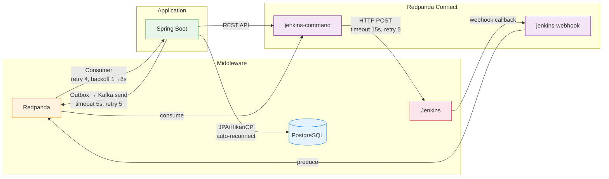
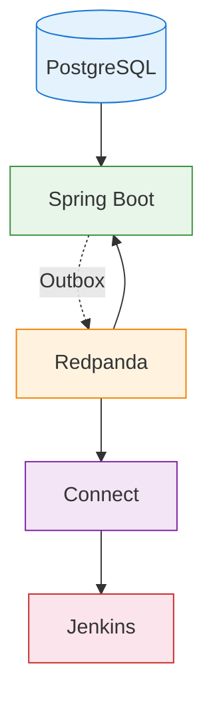

# 장애 시나리오와 복구 절차

이 문서는 Redpanda Playground의 **Application ↔ Redpanda ↔ Connect ↔ Middleware** 통신 경로에서 발생할 수 있는 장애 시나리오와 복구 절차를 다룬다. 모니터링 컴포넌트(Alloy/Loki/Tempo/Prometheus) 자체의 트러블슈팅은 [07-troubleshooting.md](./07-troubleshooting.md)를 참조한다. 알림 설정은 [05-dashboards-and-alerts.md](./05-dashboards-and-alerts.md)를 참조한다.

---

## 1. 통신 경로 개요



### 타임아웃/재시도 요약

| 컴포넌트 | 소스 | 타임아웃 | 재시도 | 백오프 | 실패 시 동작 |
|----------|------|---------|--------|--------|-------------|
| OutboxPoller | `app/.../outbox/OutboxPoller.java` | 5s (Kafka send) | 5회 | increment count | DEAD 마킹 |
| PipelineEventConsumer | `app/.../event/PipelineEventConsumer.java` | - | 4회 (@RetryableTopic) | 1s→2s→4s→8s | DLT (-dlt) |
| KafkaErrorConfig | `common-kafka/.../config/KafkaErrorConfig.java` | - | 3회 (7s total) | 1s→2s→4s | DLQ (Topics.DLQ) |
| WebhookEventConsumer | `app/.../webhook/WebhookEventConsumer.java` | - | 4회 | 1s→2s→4s→8s | DLT, null fallback |
| JenkinsAdapter | `app/.../adapter/JenkinsAdapter.java` | ~30s (default) | 0 | - | null 반환 |
| ConnectStreamsClient | `app/.../client/ConnectStreamsClient.java` | default | 0 | - | false 반환 |
| ConnectorRestoreListener | `app/.../service/ConnectorRestoreListener.java` | - | 5회 | 2s→4s→8s→16s→32s | ERROR 로그 후 포기 |
| WebhookTimeoutChecker | `app/.../engine/WebhookTimeoutChecker.java` | 5분 | - | 30s 폴링 | FAILED + SAGA 보상 |
| PipelineEngine.resumeAfterWebhook | `app/.../engine/PipelineEngine.java` | - | - | - | CAS 실패 시 skip |
| jenkins-command.yaml | `docker/connect/jenkins-command.yaml` | 15s (HTTP) | 5회 | 2s→30s | DLQ (playground.dlq) |
| jenkins-webhook.yaml | `docker/connect/jenkins-webhook.yaml` | 5s (input) | 5회 | 500ms→10s | - |

**비재시도 예외** (KafkaErrorConfig): `IllegalArgumentException`, `AvroSerializationException` — Avro poison pill은 재시도 없이 DLT 직행.

---

## 2. 시나리오 A: 통신 실패 (서버 정상)

서버는 살아 있지만 네트워크 문제나 설정 오류로 통신이 실패하는 경우다.

### 2-1. App ↔ Redpanda 네트워크 단절

Spring Boot가 Redpanda에 연결하지 못하면 두 가지 경로가 영향받는다. Producer(OutboxPoller) 쪽은 Kafka send가 타임아웃(5s)되며 재시도 5회 후 DEAD 마킹한다. Consumer 쪽은 poll이 실패하며 KafkaErrorConfig의 재시도 정책(3회, 1→2→4s)을 따른다.

**증상:**
- Spring Boot 로그: `org.apache.kafka.common.errors.TimeoutException`
- OutboxPoller: 처리되지 않은 이벤트가 outbox 테이블에 누적
- Consumer: `@RetryableTopic` 재시도 후 DLT 토픽으로 이동

**진단:**
```bash
# Redpanda 브로커 응답 확인
docker exec playground-redpanda rpk cluster health

# Spring Boot → Redpanda 연결 확인 (bootstrap server)
docker exec playground-redpanda rpk topic list

# Outbox 누적 확인
docker exec playground-postgres psql -U playground -d playground -c \
  "SELECT status, COUNT(*) FROM outbox_events GROUP BY status;"
```

**복구:**
네트워크 복구 후 자동 회복된다. OutboxPoller는 다음 폴링 주기(기본값)에 미처리 이벤트를 재발행한다. DEAD 상태 이벤트는 수동 재처리가 필요하다.

```bash
# DEAD 이벤트 확인
docker exec playground-postgres psql -U playground -d playground -c \
  "SELECT id, aggregate_type, event_type, retry_count FROM outbox_events WHERE status = 'DEAD';"
```

---

### 2-2. App ↔ PostgreSQL 네트워크 단절

HikariCP 커넥션 풀이 고갈되면 모든 DB 의존 기능이 중단된다. API 응답이 500 에러를 반환하고 Outbox INSERT도 실패한다.

**증상:**
- Spring Boot 로그: `HikariPool-1 - Connection is not available, request timed out after 30000ms`
- actuator health: `db` 컴포넌트 DOWN

**진단:**
```bash
# PostgreSQL 컨테이너 상태
docker inspect --format='{{.State.Health.Status}}' playground-postgres

# DB 연결 가능 여부
docker exec playground-postgres pg_isready -U playground

# Spring Boot health에서 DB 상태
curl -s http://localhost:8080/actuator/health | jq '.components.db'
```

**복구:**
네트워크 복구 후 HikariCP가 자동으로 유효한 커넥션을 재확보한다. Spring Boot 재시작이 필요하지 않다.

---

### 2-3. Connect ↔ Jenkins HTTP 타임아웃

jenkins-command 파이프라인이 Jenkins API에 HTTP POST를 보내는데, 응답이 15초 내에 오지 않으면 타임아웃된다. 5회 재시도(2s→30s 백오프) 후 실패하면 DLQ(`playground.dlq`)로 이동한다.

**증상:**
- Connect 로그: `context deadline exceeded`
- DLQ에 메시지 누적

**진단:**
```bash
# Connect 로그 확인
docker logs playground-connect --tail 50 2>&1 | grep -i "deadline\|timeout\|error"

# DLQ 메시지 확인
docker exec playground-redpanda rpk topic consume playground.dlq --num 5

# Jenkins 응답 직접 테스트
curl -v -o /dev/null -w "%{http_code} %{time_total}s" \
  http://localhost:9080/job/test/build
```

**복구:**
Jenkins 응답이 정상화되면 Connect가 새 메시지를 정상 처리한다. DLQ에 쌓인 메시지는 수동 재처리가 필요하다.

```bash
# DLQ 메시지 수 확인
docker exec playground-redpanda rpk topic describe playground.dlq
```

---

### 2-4. App ↔ Connect API 통신 실패

ConnectStreamsClient가 Connect REST API에 요청을 보내는데, 실패하면 재시도 없이 `false`를 반환한다. ConnectorRestoreListener는 5회 재시도(2s→32s 지수 백오프)를 시도한 후 ERROR 로그를 남기고 포기한다.

**증상:**
- Spring Boot 로그: ConnectStreamsClient에서 `false` 반환
- ConnectorRestoreListener: `ERROR` 레벨 로그 후 복구 포기

**진단:**
```bash
# Connect ready 상태
curl -s http://localhost:4195/ready

# Connect 메트릭
curl -s http://localhost:4195/metrics | grep -E "input_received|output_error"
```

**복구:**
Connect가 정상화되면 다음 호출부터 성공한다. ConnectorRestoreListener가 포기한 경우 Spring Boot를 재시작하여 리스너를 재실행한다.

---

## 3. 시나리오 B: 내부 처리 실패

서버 간 통신은 정상이지만 데이터 처리 로직에서 에러가 발생하는 경우다.

### 3-1. Avro 직렬화/역직렬화 실패

스키마 불일치나 잘못된 바이트 배열로 Avro 역직렬화가 실패하면 `AvroSerializationException`이 발생한다. KafkaErrorConfig에서 이 예외를 비재시도 대상으로 지정했으므로, 재시도 없이 즉시 DLT로 이동한다.

**증상:**
- Spring Boot 로그: `AvroSerializationException` 또는 `SerializationException`
- DLT 토픽에 해당 메시지 적재

**진단:**
```bash
# DLT 토픽 확인 (토픽명-dlt 패턴)
docker exec playground-redpanda rpk topic list | grep dlt

# 특정 DLT 메시지 확인
docker exec playground-redpanda rpk topic consume pipeline-events-dlt --num 3
```

**복구:**
스키마를 수정한 후 DLT 메시지를 원본 토픽으로 재발행한다. 재발행 전에 Consumer가 새 스키마를 인식하도록 Spring Boot를 재시작해야 할 수 있다.

---

### 3-2. JSON 파싱 실패 (Webhook)

Jenkins 웹훅 콜백이 예상과 다른 JSON 형식을 보내면 파싱이 실패한다. WebhookEventConsumer는 4회 재시도(1→8s) 후 DLT로 이동하며, 파싱 실패 시 null fallback을 반환한다.

**증상:**
- Spring Boot 로그: `JsonProcessingException` 또는 `MismatchedInputException`
- 파이프라인이 webhook 응답을 기다리며 멈춤

**진단:**
```bash
# Spring Boot 로그에서 JSON 관련 에러
# (Spring Boot는 호스트 실행이므로 콘솔/IDE에서 확인)

# 웹훅 토픽의 최근 메시지 확인
docker exec playground-redpanda rpk topic consume pipeline-webhook-events --num 3
```

**복구:**
Jenkins 웹훅 설정을 확인하고, 필요시 webhook 페이로드 형식을 수정한다. 파싱 실패로 멈춘 파이프라인은 WebhookTimeoutChecker가 5분 후 FAILED 처리한다.

---

### 3-3. CAS 경쟁 조건 (Webhook vs Timeout)

WebhookTimeoutChecker(30s 폴링)와 PipelineEngine.resumeAfterWebhook이 동시에 같은 파이프라인 상태를 변경하려 할 때 CAS(Compare-And-Swap) 경쟁이 발생한다. resumeAfterWebhook은 CAS 실패 시 skip하고, TimeoutChecker가 이미 FAILED로 변경했다면 해당 파이프라인은 실패로 확정된다.

**증상:**
- 파이프라인이 webhook을 정상 수신했는데도 FAILED 상태
- Spring Boot 로그: CAS 실패 관련 메시지

**진단:**
```bash
# 파이프라인 상태 확인
docker exec playground-postgres psql -U playground -d playground -c \
  "SELECT id, status, updated_at FROM pipeline_executions WHERE status = 'FAILED' ORDER BY updated_at DESC LIMIT 5;"
```

**복구:**
정상적인 동시성 제어 동작이므로 별도 복구가 필요하지 않다. 타임아웃(5분)이 비즈니스 요건에 비해 짧다면 WebhookTimeoutChecker의 타임아웃을 늘려야 한다.

---

### 3-4. Outbox 이벤트 발행 실패

OutboxPoller가 Kafka send에 실패하면 해당 이벤트의 retry_count를 증가시키고 다음 폴링에서 재시도한다. 5회(MAX_RETRIES) 실패 후 DEAD 상태로 마킹하여 더 이상 폴링하지 않는다.

**증상:**
- outbox_events 테이블에 `status = 'DEAD'` 레코드 증가
- 해당 이벤트에 대응하는 Consumer가 메시지를 받지 못함

**진단:**
```bash
# DEAD 이벤트 목록
docker exec playground-postgres psql -U playground -d playground -c \
  "SELECT id, aggregate_type, event_type, retry_count, created_at
   FROM outbox_events WHERE status = 'DEAD' ORDER BY created_at DESC;"

# 전체 Outbox 상태 분포
docker exec playground-postgres psql -U playground -d playground -c \
  "SELECT status, COUNT(*) FROM outbox_events GROUP BY status;"
```

**복구:**
Kafka 연결이 정상화된 후 DEAD 이벤트를 PENDING으로 리셋하면 다음 폴링에서 재발행한다.

```sql
-- 주의: Kafka 연결이 정상인지 먼저 확인
UPDATE outbox_events SET status = 'PENDING', retry_count = 0
WHERE status = 'DEAD';
```

---

## 4. 시나리오 C: 서버 다운

컴포넌트가 완전히 죽은 경우다. 의존 관계를 고려한 복구 순서가 중요하다.

### 4-1. Redpanda 브로커 다운

Redpanda가 다운되면 전체 메시징이 중단된다. Producer(OutboxPoller)가 메시지를 발행하지 못해 outbox 테이블에 레코드가 쌓이고, Consumer는 poll이 실패하며, Connect 파이프라인도 멈춘다.

**진단:**
```bash
# 헬스 상태
docker inspect --format='{{.State.Health.Status}}' playground-redpanda

# 로그 확인
docker logs playground-redpanda --tail 50

# Prometheus로 브로커 up 확인 (모니터링 스택이 살아 있을 때)
curl -s 'http://localhost:29090/api/v1/query?query=up{job="redpanda"}' | jq '.data.result'
```

**복구:**
```bash
# 1. Redpanda 재시작
docker compose restart redpanda

# 2. healthy 대기
watch docker inspect --format='{{.State.Health.Status}}' playground-redpanda

# 3. 클러스터 상태 확인
docker exec playground-redpanda rpk cluster health

# 4. Connect 재시작 (Redpanda가 올라온 후)
docker compose restart connect

# 5. Outbox 미처리 이벤트 자동 발행 확인
docker exec playground-postgres psql -U playground -d playground -c \
  "SELECT COUNT(*) FROM outbox_events WHERE status = 'PENDING';"
```

Redpanda 재시작 후 Connect가 자동 재연결을 시도한다. 대부분 자동 복구되지만, 재연결이 안 될 경우 Connect도 함께 재시작해야 한다.

---

### 4-2. Redpanda Connect 다운

Connect가 다운되면 Jenkins 커맨드 실행과 웹훅 수신이 중단된다. 이 파이프라인을 통해 들어오는 트리거가 없으므로 새 파이프라인 실행이 시작되지 않는다. Connect 다운 중 Jenkins가 보낸 웹훅 콜백은 수신되지 않으며 재전송이 필요하다.

**진단:**
```bash
# ready 확인
curl -s http://localhost:4195/ready

# 로그 확인
docker logs playground-connect --tail 50

# 에러 메트릭
curl -s http://localhost:4195/metrics | grep output_error
```

**복구:**
```bash
# 재시작
docker compose restart connect

# 재시작 후 확인
curl -s http://localhost:4195/ready
curl -s http://localhost:4195/metrics | grep input_received
```

---

### 4-3. Jenkins 다운

Jenkins가 다운되면 Connect의 jenkins-command 파이프라인이 HTTP 요청에 실패한다. 15초 타임아웃 후 5회 재시도(2s→30s 백오프)를 시도하며, 모두 실패하면 DLQ로 이동한다. 웹훅 콜백도 발생하지 않으므로 진행 중인 파이프라인은 WebhookTimeoutChecker에 의해 5분 후 FAILED 처리된다.

**진단:**
```bash
# Jenkins 응답 확인
curl -v -o /dev/null -w "%{http_code}" http://localhost:9080/

# Connect 로그에서 Jenkins 관련 에러
docker logs playground-connect --tail 50 2>&1 | grep -i "jenkins\|deadline\|refused"

# DLQ 누적 확인
docker exec playground-redpanda rpk topic consume playground.dlq --num 5
```

**복구:**
```bash
# Jenkins 재시작
docker compose restart jenkins

# Jenkins 정상 기동 확인 (UI 접근 가능)
curl -s -o /dev/null -w "%{http_code}" http://localhost:9080/

# DLQ 메시지는 수동 재처리 필요
docker exec playground-redpanda rpk topic describe playground.dlq
```

Jenkins 복구 후 Connect는 새 메시지를 정상 처리한다. DLQ에 쌓인 메시지와 FAILED 처리된 파이프라인은 수동 재처리가 필요하다.

---

### 4-4. PostgreSQL 다운

PostgreSQL이 다운되면 Spring Boot의 모든 DB 작업이 실패한다. JPA 조회, Outbox INSERT, 이벤트 저장이 모두 불가능해진다.

**진단:**
```bash
# 컨테이너 상태
docker inspect --format='{{.State.Health.Status}}' playground-postgres

# 로그
docker logs playground-postgres --tail 30

# actuator에서 DB 상태
curl -s http://localhost:8080/actuator/health | jq '.components.db'
```

**복구:**
```bash
# 1. PostgreSQL 재시작
docker compose restart postgres

# 2. 연결 확인
docker exec playground-postgres pg_isready -U playground

# 3. HikariCP 자동 복구 확인 (Spring Boot 재시작 불필요)
curl -s http://localhost:8080/actuator/health | jq '.components.db'

# 4. Flyway 마이그레이션 상태 확인
docker exec playground-postgres psql -U playground -d playground -c \
  "SELECT version, description, success FROM flyway_schema_history ORDER BY installed_rank;"
```

HikariCP가 자동으로 유효한 커넥션을 재확보하므로 Spring Boot 재시작이 필요하지 않다.

---

## 5. 복구 순서 가이드

복합 장애 시 의존 관계를 고려한 복구 순서가 중요하다.



### 복구 순서

| 순서 | 컴포넌트 | 이유 | 확인 명령어 |
|------|----------|------|------------|
| 1 | PostgreSQL | Spring Boot Flyway 마이그레이션 의존 | `pg_isready -U playground` |
| 2 | Redpanda | Connect, Spring Boot Producer/Consumer 의존 | `rpk cluster health` |
| 3 | Connect | Jenkins 커맨드 파이프라인 의존 | `curl localhost:4195/ready` |
| 4 | Spring Boot | 위 3개가 모두 올라온 후 기동 | `curl localhost:8080/actuator/health` |

### 전체 스택 재시작 (호스트 재부팅 후)

```bash
# 1. 코어 인프라
make infra
# 또는: docker compose up -d

# 2. 인프라 헬스 확인
docker compose ps
docker exec playground-redpanda rpk cluster health
docker exec playground-postgres pg_isready -U playground

# 3. Spring Boot (인프라가 올라온 후)
./gradlew :app:bootRun &

# 4. 모니터링 스택
make monitoring
# 또는: docker compose -f docker-compose.monitoring.yml up -d

# 5. 전체 상태 확인
curl -s http://localhost:8080/actuator/health
curl -s http://localhost:4195/ready
curl -s http://localhost:23000/api/health
```
