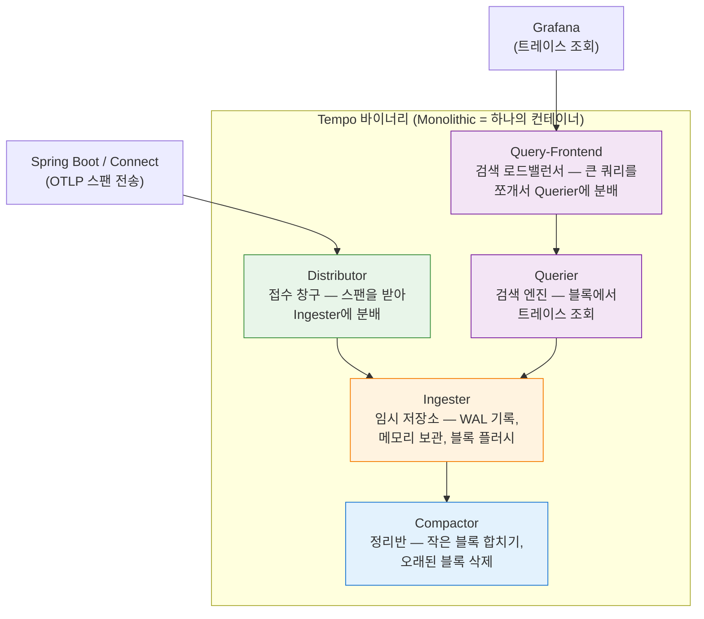

# Tempo 자원 측정 가이드

이 문서는 Redpanda Playground에서 Tempo가 소비하는 CPU, 메모리, 디스크 자원을 측정하는 방법과 최적화 전략을 정리한다. Tempo는 이 프로젝트에서 가장 자원 민감한 컴포넌트다. 256MB와 512MB 메모리 설정에서 WAL replay 중 OOM으로 강제 종료된 경험이 있으며, 현재 1GB로 설정되어 있다. 알림 설정은 [05-dashboards-and-alerts.md](./05-dashboards-and-alerts.md)를, 장애 대응은 [04-failure-scenarios.md](./04-failure-scenarios.md)를 참조한다.

---

## 1. 왜 Tempo 자원 측정이 중요한가

Tempo는 트레이스 데이터를 WAL(Write-Ahead Log)에 먼저 기록한 후, 일정 조건이 되면 블록으로 플러시한다. 재시작 시에는 WAL을 전부 replay하여 인메모리 상태를 복원하는데, 이 과정에서 메모리 사용량이 급격히 증가한다. 트레이스 양이 많을수록 WAL 크기가 커지고, replay에 필요한 메모리도 늘어난다.

일반적인 자원 관리와 달리 Tempo는 평시 메모리 사용량이 낮더라도 재시작 순간에 피크가 발생한다. 따라서 limit을 평시 사용량 기준으로 설정하면 재시작 시 OOM이 발생한다. 이것이 256MB/512MB에서 문제가 생긴 원인이다.

---

## 2. 측정 항목과 도구

| 항목 | 측정 도구 | 명령어 / 메트릭 |
|------|----------|----------------|
| CPU | `docker stats`, Prometheus | `container_cpu_usage_seconds_total{name="playground-tempo"}` |
| RAM (실시간) | `docker stats` | `container_memory_usage_bytes{name="playground-tempo"}` |
| RAM (피크) | `docker stats` + 재시작 모니터링 | WAL replay 중 `docker stats` 관찰 |
| 디스크 — 트레이스 블록 | `docker exec` | `du -sh /var/tempo/traces/` |
| 디스크 — WAL | `docker exec` | `du -sh /var/tempo/wal/` |
| 활성 트레이스 수 | Prometheus | `tempo_ingester_traces_created_total` |
| 스팬 수신률 | Prometheus | `rate(tempo_distributor_spans_received_total[1m])` |
| 블록 플러시 현황 | Prometheus | `tempo_ingester_blocks_flushed_total` |

### 2-1. docker stats 활용

`docker stats`는 실시간 자원 사용량을 터미널에서 바로 확인할 수 있는 가장 간편한 도구다.

```bash
# 실시간 스트리밍 (Ctrl+C로 종료)
docker stats playground-tempo

# 스냅샷 (한 번만 출력)
docker stats playground-tempo --no-stream

# 포맷 지정 (측정 자동화에 유용)
docker stats playground-tempo --no-stream \
  --format "{{.CPUPerc}}\t{{.MemUsage}}\t{{.MemPerc}}"
```

### 2-2. Prometheus 메트릭 활용

Alloy가 정상 동작 중이라면 Prometheus에서 Tempo 자원 메트릭을 쿼리할 수 있다. Grafana Explore에서 아래 쿼리를 사용한다.

```promql
# 메모리 사용량 (바이트)
container_memory_usage_bytes{name="playground-tempo"}

# 메모리 사용률 (%)
container_memory_usage_bytes{name="playground-tempo"}
/ container_spec_memory_limit_bytes{name="playground-tempo"} * 100

# CPU 사용률 (1분 평균)
rate(container_cpu_usage_seconds_total{name="playground-tempo"}[1m]) * 100

# 스팬 수신률 (초당)
rate(tempo_distributor_spans_received_total[1m])

# 활성 트레이스 수 (현재 WAL에 있는 트레이스)
tempo_ingester_live_traces
```

### 2-3. Tempo 내부 상태 직접 확인

```bash
# 트레이스 블록 저장 디렉토리 크기
docker exec playground-tempo du -sh /var/tempo/traces/

# WAL 디렉토리 크기 (재시작 시 replay 대상)
docker exec playground-tempo du -sh /var/tempo/wal/

# 하위 구조 확인
docker exec playground-tempo find /var/tempo -maxdepth 3 -type d

# Tempo 자체 메트릭 엔드포인트
curl -s http://localhost:3200/metrics | grep -E "tempo_ingester|tempo_distributor"
```

---

## 3. 유스케이스별 측정 시나리오

측정은 환경이 다르면 결과가 달라지므로, 동일한 조건에서 반복 측정해야 유의미한 데이터가 된다. 아래 시나리오는 부하 증가에 따른 자원 변화를 관찰하기 위한 것이다.

### 3-1. 시나리오 A — 유휴 상태 (기준선)

트레이스가 전혀 들어오지 않는 상태에서의 기준 자원 사용량을 측정한다. 이 값이 Tempo 자체 오버헤드이며, 이후 시나리오와 비교할 때 기준점이 된다.

**측정 방법:**
```bash
# 1. 모니터링 스택만 실행, Spring Boot와 Connect는 중지
# 2. 5분 대기 (WAL replay 완료 및 안정화)
# 3. 스냅샷 측정
docker stats playground-tempo --no-stream \
  --format "CPU: {{.CPUPerc}}, MEM: {{.MemUsage}}, MEM%: {{.MemPerc}}"

# 기대값 (1GB limit 기준):
# CPU: ~0.1%
# MEM: ~100-150MB (Tempo Go 런타임 + 캐시)
```

### 3-2. 시나리오 B — 단일 파이프라인 실행 (일반 사용)

파이프라인 한 건을 실행하면 약 3스텝, 15개 스팬이 생성된다. 이것이 일반적인 사용 패턴이다.

**측정 방법:**
```bash
# 1. 파이프라인 실행 (예: Jenkins 커맨드 트리거)
curl -X POST http://localhost:8080/api/pipelines/{id}/execute

# 2. 트레이스 수신 확인
curl -s http://localhost:3200/metrics | grep tempo_distributor_spans_received_total

# 3. 실행 중 메모리 관찰 (10초 간격)
watch -n 10 'docker stats playground-tempo --no-stream \
  --format "{{.MemUsage}} ({{.MemPerc}})"'

# 4. 완료 후 스냅샷
docker stats playground-tempo --no-stream
```

### 3-3. 시나리오 C — 동시 5개 파이프라인 (피크 시뮬레이션)

동시에 여러 파이프라인이 실행될 때의 자원 사용량을 측정한다. 스팬 수가 많아질수록 Tempo WAL 크기와 메모리 사용량이 증가한다.

**측정 방법:**
```bash
# 1. 5개 파이프라인 동시 실행 (백그라운드)
for i in {1..5}; do
  curl -s -X POST http://localhost:8080/api/pipelines/${PIPELINE_ID}/execute &
done
wait

# 2. 피크 메모리 관찰 (5초 간격으로 1분)
for i in {1..12}; do
  echo -n "$(date +%H:%M:%S) "
  docker stats playground-tempo --no-stream \
    --format "MEM: {{.MemUsage}} | CPU: {{.CPUPerc}}"
  sleep 5
done

# 3. WAL 크기 확인
docker exec playground-tempo du -sh /var/tempo/wal/
```

### 3-4. 시나리오 D — 1시간 지속 부하 (디스크 증가율 측정)

장시간 운영 시 디스크 사용량이 어떻게 증가하는지 측정하여 용량 계획에 활용한다.

**측정 방법:**
```bash
# 측정 스크립트: 10분마다 디스크 사용량 기록
#!/bin/bash
echo "time,wal_size,traces_size,live_traces" > tempo_disk_log.csv
for i in {1..6}; do
  WAL=$(docker exec playground-tempo du -sb /var/tempo/wal/ | cut -f1)
  TRACES=$(docker exec playground-tempo du -sb /var/tempo/traces/ | cut -f1)
  LIVE=$(curl -s http://localhost:3200/metrics \
    | grep "^tempo_ingester_live_traces " | awk '{print $2}')
  echo "$(date +%H:%M),$WAL,$TRACES,$LIVE" >> tempo_disk_log.csv
  echo "$(date +%H:%M) WAL: $((WAL/1024/1024))MB, Traces: $((TRACES/1024/1024))MB, Live: $LIVE"
  sleep 600
done
```

---

## 4. 측정 방법론

### 4-1. 재시작 시 WAL Replay 메모리 피크 측정

WAL replay는 가장 중요한 측정 시나리오다. 트레이스 데이터가 쌓인 상태에서 Tempo를 재시작하면 메모리 사용량이 순간적으로 급증한다.

```bash
# 1. WAL 크기 사전 확인
docker exec playground-tempo du -sb /var/tempo/wal/

# 2. Tempo 재시작
docker compose -f docker-compose.monitoring.yml restart tempo

# 3. 재시작 직후부터 메모리 피크까지 2초 간격으로 관찰
#!/bin/bash
echo "WAL Replay 메모리 측정 시작"
until docker exec playground-tempo test -f /proc/1/status 2>/dev/null; do
  sleep 0.5
done

peak_mem=0
for i in {1..60}; do
  mem=$(docker stats playground-tempo --no-stream \
    --format "{{.MemUsage}}" | awk '{print $1}')
  echo "$(date +%H:%M:%S) MEM: $mem"
  sleep 2
done
```

### 4-2. 블록 플러시 타이밍 관찰

Tempo는 WAL 데이터를 블록으로 플러시할 때 메모리를 일시적으로 더 사용한다. 플러시 타이밍을 알면 메모리 피크 패턴을 예측할 수 있다.

```bash
# 플러시 이벤트 로그 모니터링
docker logs playground-tempo -f 2>&1 | grep -E "flush|block|compaction"

# 플러시 횟수 메트릭
curl -s http://localhost:3200/metrics | grep tempo_ingester_blocks_flushed_total
```

### 4-3. 노이즈 스팬 필터링 효과 측정

Alloy에서 노이즈 스팬(actuator health check 등)을 필터링하고 있다면, 필터링 전후 스팬 수와 메모리 사용량을 비교하면 효과를 정량화할 수 있다.

```bash
# 현재 수신 스팬 수 확인
curl -s http://localhost:3200/metrics \
  | grep tempo_distributor_spans_received_total

# Alloy에서 필터링된 스팬 수 확인
curl -s http://localhost:24312/metrics \
  | grep otelcol_processor_dropped_spans_total
```

---

## 5. 최적화 전략

### 5-1. 노이즈 스팬 필터링

Alloy의 `otelcol.processor.filter` 컴포넌트로 불필요한 스팬을 Tempo에 보내기 전에 제거한다. actuator health check, prometheus scrape 등의 내부 트래픽은 트레이스 가치가 없으면서 자원을 소모한다.

**`monitoring/alloy-config.alloy`에서 이미 설정된 경우 확인:**
```alloy
otelcol.processor.filter "drop_health" {
  error_mode = "ignore"
  traces {
    span = [
      // actuator health check 제거
      "attributes[\"http.route\"] == \"/actuator/health\"",
      // prometheus scrape 제거
      "attributes[\"http.route\"] == \"/actuator/prometheus\"",
    ]
  }
  output {
    traces = [otelcol.exporter.otlp.tempo.input]
  }
}
```

필터링 효과는 `tempo_distributor_spans_received_total`이 감소하는 것으로 확인할 수 있다. health check가 30초마다 발생하면 하루 2,880개 스팬이 절감된다.

### 5-2. Tail-based Sampling 도입 예상 효과

Head-based sampling(현재)은 모든 요청을 샘플링한다. Tail-based sampling을 도입하면 에러가 없는 빠른 요청의 트레이스를 버리고 에러/느린 요청만 보존할 수 있다.

Alloy에서 `otelcol.connector.spanmetrics`와 tail sampling processor를 조합하면 구현 가능하다. 예상 절감률은 트래픽 패턴에 따라 다르지만, 정상 트래픽이 대부분인 환경에서는 70-90% 스팬 절감이 가능하다.

### 5-3. 리텐션 조정에 따른 디스크 절감

현재 리텐션은 72시간(3일)이다. 리텐션을 줄이면 디스크 사용량이 선형적으로 감소한다.

| 리텐션 | 예상 디스크 (상대) | 적합한 환경 |
|--------|----------------|-----------|
| 72h (현재) | 100% | PoC 기본값 |
| 48h | ~67% | 디스크가 부족할 때 |
| 24h | ~33% | 매우 제한된 환경 |
| 168h (7일) | ~233% | 장기 분석이 필요할 때 |

**`monitoring/tempo-config.yaml`에서 변경:**
```yaml
compactor:
  compaction:
    block_retention: 48h  # 72h → 48h
```

변경 후 Tempo 재시작이 필요하다. 기존 블록은 새 리텐션 기간이 지나면 자동 삭제된다.

### 5-4. WAL 튜닝

WAL 관련 설정을 조정하면 메모리와 디스크 간 트레이드오프를 조절할 수 있다.

**`monitoring/tempo-config.yaml`:**
```yaml
ingester:
  # WAL 블록 최대 크기 (기본 500MB — 공식 소스코드 기준)
  # 줄이면 더 자주 플러시 → WAL 크기 감소 → replay 메모리 감소
  # 단, 플러시 빈도 증가 → 디스크 I/O 증가
  max_block_bytes: 52428800  # 50MB (PoC용 축소)

  # WAL 블록 최대 유지 시간 (기본 30m)
  # 줄이면 더 자주 플러시 → WAL 크기 감소
  max_block_duration: 15m

  # 트레이스 idle 타임아웃 후 플러시 (기본 10m)
  trace_idle_period: 5m
```

**`max_block_bytes`를 줄였을 때 효과:**
- WAL 크기 감소 → 재시작 시 replay 메모리 감소
- 플러시 빈도 증가 → 디스크 I/O 증가, 블록 파일 수 증가
- 공식 기본값은 500MB다. PoC에서는 기본값을 유지하되, OOM이 반복되면 50MB로 줄여보는 것을 권장한다.

### 5-5. 블록 컴팩션 조정

Tempo는 소규모 블록을 주기적으로 합쳐 더 큰 블록으로 만든다. 컴팩션은 디스크 사용량을 최적화하지만 CPU와 메모리를 추가로 소모한다.

```yaml
compactor:
  compaction:
    # 컴팩션 주기 (기본 30s)
    compaction_cycle: 60s  # 주기를 늘려 리소스 사용 분산

    # 최대 컴팩션 대상 블록 크기
    max_compaction_objects: 1000000
```

---

## 6. OOM 방지 가이드

### 6-1. 메모리 Limit 산정 공식

Tempo 메모리 limit은 다음 요소를 합산하여 결정한다.

```
메모리 limit = Go 런타임 기본값 + WAL 피크 + 작업 메모리 + 여유

Go 런타임 기본값: ~100-150MB
WAL 피크: WAL 크기 × 2~3배 (replay 시 파싱 오버헤드)
작업 메모리: 동시 수신 스팬 × 스팬당 ~1KB
여유: 위 합계의 20%
```

**예시 계산 (현재 프로젝트):**
- Go 런타임: ~120MB
- WAL 크기: 측정 필요 (50MB 가정)
- WAL 피크: 50MB × 3 = 150MB
- 작업 메모리: 소량 (PoC 규모)
- 여유: (120 + 150) × 0.2 = 54MB
- 권장 limit: ~324MB → 여유 있게 512MB~1GB

이 계산에서 WAL 크기가 핵심 변수다. WAL 크기를 측정하지 않고 limit을 낮게 설정하면 OOM이 발생한다. 256MB에서 OOM이 발생한 것은 WAL replay 시 150MB 이상을 사용했기 때문이다.

### 6-2. WAL Replay 메모리 예측

WAL replay 시 메모리 사용량은 WAL 파일 크기에 비례한다. 실제 측정 없이 예측하려면 다음 방법을 사용한다.

```bash
# WAL 디렉토리 크기 확인
WAL_SIZE=$(docker exec playground-tempo du -sb /var/tempo/wal/ | cut -f1)
echo "WAL size: $((WAL_SIZE/1024/1024))MB"

# replay 예상 메모리 (WAL 크기의 2.5배 + Go 런타임 150MB)
EXPECTED_MEM=$(( (WAL_SIZE * 5 / 2 / 1024 / 1024) + 150 ))
echo "예상 replay 메모리: ${EXPECTED_MEM}MB"
echo "권장 limit: $((EXPECTED_MEM + EXPECTED_MEM / 5))MB (20% 여유)"
```

### 6-3. OOM 징후 조기 감지

exit code 137은 커널이 OOM killer로 프로세스를 강제 종료했다는 신호다.

```bash
# 종료 코드 확인
docker inspect playground-tempo --format='{{.State.ExitCode}}'
# 137이면 OOM

# 메모리 사용량 트렌드 관찰 (재시작 후)
for i in {1..30}; do
  mem=$(docker stats playground-tempo --no-stream \
    --format "{{.MemPerc}}" 2>/dev/null)
  echo "$(date +%H:%M:%S) $mem"
  # 80% 넘으면 경고
  pct=$(echo $mem | tr -d '%')
  if (( $(echo "$pct > 80" | bc -l) )); then
    echo "경고: 메모리 80% 초과"
  fi
  sleep 5
done
```

**Prometheus 알림 활용:** [05-dashboards-and-alerts.md](./05-dashboards-and-alerts.md)의 `TempoHighMemory` 알림을 설정하면 800MB 초과 시 5분 내에 알림을 받을 수 있다.

---

## 7. 실측 결과 — 2026-03-16

### 환경

| 항목 | 값 |
|------|---|
| 호스트 | GCP dev-server-3 (e2-medium, 2 vCPU / 4GB RAM) |
| Tempo 버전 | 2.7.1 |
| 배포 방식 | Docker Compose (monolithic mode) |
| 메모리 limit | 1 GiB |
| 리텐션 | 72h |
| 노이즈 필터링 | Alloy에서 적용 (actuator health, prometheus scrape 제거) |
| 상태 | 유휴 — Spring Boot 미실행, 트레이스 수신 없음 |

### 시나리오 A — 유휴 상태 (기준선)

| 항목 | 측정값 | 비고 |
|------|--------|------|
| CPU | 0.03% | Go 런타임 idle |
| 메모리 | 32 MiB / 1 GiB (3.1%) | limit 대비 극히 소량 |
| Network I/O | 578 KB in / 24.9 KB out | Alloy health check 등 최소 트래픽 |
| Block I/O | 65.7 MB read / 2.47 MB write | 초기 WAL replay + 블록 읽기 |
| WAL 디스크 | 16 KB | 트레이스 미수신으로 거의 비어 있음 |
| Traces 디스크 | 2.5 MB | 이전 세션의 잔여 블록 |
| /var/tempo/ 전체 | ~2.5 MB | WAL + traces + 메타데이터 |

**분석:**

유휴 상태에서 메모리 32 MiB는 Go 런타임 최소 오버헤드다. 섹션 6-1의 메모리 산정 공식에서 "Go 런타임 기본값 ~100-150MB"로 추정했지만, 실제로는 트레이스가 없으면 32 MiB로 훨씬 낮다. WAL이 16 KB에 불과하므로 replay 피크도 무시할 수준이며, 현재 1 GiB limit은 유휴 상태 대비 약 32배 여유가 있다.

이 수치가 낮은 이유는 Spring Boot가 실행되지 않아 트레이스가 전혀 수신되지 않기 때문이다. 실제 운영 시에는 파이프라인 실행에 따라 WAL 크기와 메모리 사용량이 증가한다.

### 시나리오 B~D — 부하 상태 (미측정)

파이프라인 실행 후 데이터는 아직 측정하지 못했다. Spring Boot를 기동하고 파이프라인을 실행한 후 섹션 3의 시나리오 B~D 절차대로 재측정이 필요하다. 측정 시 아래 항목을 기록한다.

| 시나리오 | 메모리 (평시) | 메모리 (피크) | CPU | WAL 크기 | 상태 |
|----------|-------------|-------------|-----|---------|------|
| A. 유휴 | 32 MiB | 32 MiB | 0.03% | 16 KB | 측정 완료 |
| B. 단일 파이프라인 | - | - | - | - | 미측정 |
| C. 동시 5개 | - | - | - | - | 미측정 |
| D. 1시간 지속 | - | - | - | - | 미측정 |
| WAL Replay | - | - | - | - | 미측정 |

> WAL이 16 KB로 매우 작아 replay 피크가 미미할 것으로 예상된다. 실제 부하 후 WAL 크기가 수십 MB로 증가하면 replay 시 메모리가 WAL의 2~3배까지 필요하므로, 부하 테스트 후 재측정이 중요하다.

---

## 8. Grafana Tempo 공식 리소스 요구사항

Grafana 공식 사이징 가이드([docs/tempo/plan/size](https://grafana.com/docs/tempo/latest/set-up-for-tracing/setup-tempo/plan/size/))는 **수신 트레이스 데이터 MB/s** 단위로 컴포넌트별 리소스를 산정한다. spans/sec로 환산하면 평균 압축 스팬 크기가 200~500 bytes이므로, **1 MB/s ≈ 2,000~3,300 spans/sec**이다.

### 8-1. Tempo 내부 컴포넌트 이해

Tempo는 하나의 Go 바이너리 안에 5개의 내부 컴포넌트(역할)를 포함한다. 별도 프로세스가 아니라 **하나의 프로그램 안의 모듈**이다. 배포 모드에 따라 이 5개를 하나의 컨테이너에서 실행하거나(Monolithic), 각각 별도 컨테이너로 분리한다(Microservices).



| 컴포넌트 | 역할 | 자원 특성 |
|----------|------|----------|
| **Distributor** | 클라이언트에서 스팬을 수신하여 해시 링 기반으로 Ingester에 분배 | CPU/메모리 가벼움 — 데이터를 잠깐 들고 넘길 뿐 |
| **Ingester** | WAL에 기록하고 메모리에 보관하다가 조건 충족 시 블록으로 플러시 | **메모리 가장 민감** — OOM의 주범. WAL replay 시 메모리 급증 |
| **Compactor** | 플러시된 작은 블록을 합쳐 큰 블록으로 만들고, 리텐션 초과 블록 삭제 | I/O 중심 — CPU/메모리는 적당, 디스크 읽기/쓰기 많음 |
| **Query-Frontend** | Grafana의 검색 쿼리를 시간 범위별로 분할하여 Querier에 병렬 위임 | 쿼리 부하에 비례 |
| **Querier** | 실제로 블록 파일을 읽어 트레이스를 찾아 반환 | 쿼리 복잡도와 블록 수에 비례 |

**이 프로젝트(Monolithic)에서 왜 중요한가:** `docker stats playground-tempo`에 표시되는 메모리는 5개 역할의 합산이다. OOM이 발생할 때 "어떤 역할이 메모리를 많이 쓰는가?"를 알면 최적화 방향이 보인다. 256MB/512MB에서 OOM이 발생한 것은 **Ingester의 WAL replay** 때문이었다. Microservices 모드였다면 Ingester만 4GB로 올리고 나머지는 1GB로 유지할 수 있지만, Monolithic에서는 전체 컨테이너 limit을 올려야 한다.

### 8-1-1. 공식 컴포넌트별 사이징 (Microservices mode)

아래 표는 Microservices 모드로 배포할 때 각 컴포넌트를 **별도 컨테이너**로 분리한 경우의 리소스 권장값이다. Monolithic에서는 이 값을 직접 적용할 수 없지만, "메모리를 누가 많이 쓰는가"를 이해하는 데 유용하다.

| 컴포넌트 | 레플리카 기준 | CPU | 메모리 | 비고 |
|----------|-------------|-----|--------|------|
| Distributor | 1 per 10 MB/s | 2 cores | 2 GB | 수신 분배, 가벼움 |
| Ingester | 1 per 3~5 MB/s | 2.5 cores | 4~20 GB | WAL 관리, 메모리 민감 |
| Querier | 1 per 1~2 MB/s | 가변 | 4~20 GB | 쿼리 부하에 비례 |
| Query-Frontend | 2 (HA 최소) | 가변 | 4~20 GB | 수직 확장 권장 |
| Compactor | 1 per 3~5 MB/s | 1 core | 4~20 GB | I/O bound |

메모리 범위(4~20 GB)가 넓은 이유는 트레이스 구성(스팬 크기, 속성 밀도, 카디널리티)에 따라 실제 사용량이 크게 달라지기 때문이다. 공식 문서는 "Tempo is under continuous development. These requirements can change with each release"라고 명시한다.

### 8-1-2. 배포 방식에 따른 자원 사용량 차이

Tempo 프로세스 자체의 자원 사용량은 Docker Compose와 K8s에서 **동일**하다. 같은 설정, 같은 트래픽이면 Go 바이너리가 소비하는 CPU/메모리는 배포 방식과 무관하다. 차이가 나는 것은 인프라 오버헤드 쪽이다.

| 항목 | Docker Compose (이 프로젝트) | K8s |
|------|---------------------------|-----|
| Tempo 자체 메모리 | 동일 | 동일 |
| 메모리 limit 메커니즘 | `mem_limit` (cgroup v2) | `resources.limits.memory` (cgroup v2) |
| OOM 동작 | Docker가 컨테이너 kill (exit 137), `restart: unless-stopped`로 재시작 | K8s가 Pod OOMKilled → 자동 재시작, 반복 시 CrashLoopBackOff |
| 디스크 I/O | Docker volume (호스트 디렉토리) — WAL write 빠름 | PVC 종류에 따라 다름. hostPath는 동일, NFS/네트워크 스토리지는 느림 |
| 오케스트레이션 오버헤드 | 없음 | kubelet, kube-proxy 등이 노드 레벨에서 소비 (Tempo와 무관) |

이 문서의 측정값과 최적화 전략(WAL 튜닝, 리텐션, 노이즈 필터링 등)은 K8s에서도 그대로 적용 가능하다. 배포 방식보다 **WAL 크기, 스팬 수신률, 리텐션 설정**이 자원 사용량을 결정하는 핵심 변수다. K8s에서 주의할 점은 PVC가 네트워크 스토리지일 경우 WAL write/replay 성능이 저하될 수 있다는 것이다.

### 8-2. 공식 기본 설정값 (소스: `modules/overrides/config.go`)

Tempo 바이너리에 컴파일된 기본값으로, 리소스 소비 패턴을 결정하는 핵심 파라미터다.

| 파라미터 | 기본값 | 영향 |
|----------|--------|------|
| `ingestion_rate_limit_bytes` | 15 MB/s | 테넌트당 수신 속도 제한 |
| `ingestion_burst_size_bytes` | 20 MB | 순간 버스트 허용량 |
| `max_bytes_per_trace` | 5 MB | 단일 트레이스 최대 크기, ingester 메모리 보호 |
| `max_local_traces_per_user` | 10,000 | ingester당 테넌트별 활성 트레이스 상한 |
| `max_block_bytes` | **500 MB** | 블록 컷 임계값 (WAL 디스크 크기 결정) |
| `max_block_duration` | 30m | 시간 기반 블록 컷 |
| `trace_idle_period` | 5s | idle 트레이스 WAL 플러시 |
| `complete_block_timeout` | 15m | 플러시된 블록 ingester 유지 시간 |
| `replication_factor` | 3 | ingester 링 복제 (스토리지 x3) |

> 이 프로젝트의 기존 문서에서 `max_block_bytes` 기본값을 130MB로 기재했으나, 공식 소스코드 기준 **500MB**가 맞다. 섹션 5-4의 설명도 이에 맞춰 읽어야 한다.

### 8-3. 배포 모드별 특성

| 항목 | Monolithic (이 프로젝트) | Scalable Monolithic | Microservices |
|------|------------------------|---------------------|---------------|
| 구조 | 단일 바이너리, 모든 컴포넌트 내장 | 동일 바이너리 N개, DNS 디스커버리 | distributor, ingester, compactor, querier 분리 |
| 적합 환경 | PoC, 개발, 소규모 단일 테넌트 | 중규모, monolithic과 microservices 중간 | 프로덕션, 대규모, 멀티 테넌트 |
| 수평 확장 | 불가 | 전체 인스턴스 단위 | 컴포넌트별 독립 확장 |
| 스토리지 | filesystem (로컬 디스크) | 오브젝트 스토리지 권장 | GCS/S3/Azure Blob 필수 |
| 위험 | 지속적 고부하 시 OOM, 크래시 시 트레이스 유실 | 일부 개선 | 컴포넌트별 장애 격리 |

공식 문서는 monolithic mode에 대해 "modest volumes of trace data"에 적합하며, 부하가 증가하면 "resource usage problems, OOM errors, and missed traces on crash"가 발생할 수 있다고 경고한다.

### 8-4. 규모별 권장 스펙

#### 소규모 — 개발/PoC (1~5명, ~100~500 spans/sec, ~0.05~0.25 MB/s)

Monolithic mode가 적합하다. Kubernetes라면 아래 정도가 공식 가이드와 커뮤니티 경험을 종합한 권장값이다.

```yaml
resources:
  requests:
    cpu: 500m
    memory: 1Gi
  limits:
    cpu: "2"
    memory: 2Gi
persistence:
  size: 10Gi  # WAL + 로컬 블록
```

Docker Compose(이 프로젝트)라면 `mem_limit: 1g`~`2g`가 적절하다. 유휴 시 32 MiB만 사용하지만, WAL replay 피크와 스팬 수신 시 메모리가 급증하므로 여유가 필요하다.

#### 중규모 — 소규모 프로덕션 (~1,000 spans/sec, ~0.3~0.5 MB/s)

Monolithic 또는 scalable-single-binary로 커버 가능하다. Microservices mode라면 공식 가이드 기준 최소 구성은 다음과 같다.

| 컴포넌트 | 레플리카 | CPU | 메모리 |
|----------|---------|-----|--------|
| Distributor | 1 | 2 cores | 2 GB |
| Ingester | 1 | 2.5 cores | 4 GB |
| Querier | 1 | 1~2 cores | 4 GB |
| Query-Frontend | 2 (HA) | 1 core each | 4 GB each |
| Compactor | 1 | 1 core | 4 GB |

#### 대규모 — 프로덕션 (~10,000 spans/sec, ~3~5 MB/s)

| 컴포넌트 | 레플리카 | CPU | 메모리 |
|----------|---------|-----|--------|
| Distributor | 1 | 2 cores | 2 GB |
| Ingester | 2 | 2.5 cores each | 8~16 GB each |
| Querier | 3~5 | 가변 | 8 GB each |
| Query-Frontend | 2 (HA) | 4 cores each | 8 GB each |
| Compactor | 1~2 | 1 core each | 8 GB each |

### 8-5. 스토리지 산정 공식

```
일일 스토리지 = 수신률(MB/s) × 86,400 × 압축률
총 스토리지 = 일일 스토리지 × 리텐션(일)
```

Parquet 압축률은 약 30%(70% 절감)이다. 예시: 1 MB/s 수신, 7일 리텐션이면 raw 605 GB → 압축 후 **~180 GB**.

이 프로젝트(~0.01 MB/s 이하, 72h 리텐션)에서는 수 MB~수백 MB 수준으로, 로컬 filesystem으로 충분하다.

### 8-6. Querier 메모리 튜닝 공식

공식 문서([backend_search](https://grafana.com/docs/tempo/latest/operations/backend_search/))는 querier 메모리를 다음과 같이 설명한다.

> "Querier memory request roughly translates to job size times the concurrent work and some buffer."

핵심 파라미터:
- `query_frontend.search.target_bytes_per_job`: 권장 100~200 MB (Grafana Labs 테스트 기준)
- `querier.frontend_worker.parallelism`: 병렬도 감소 → 메모리 감소
- `querier.max_concurrent_queries`: 동시 쿼리 제한

### 8-7. 이 프로젝트와 비교

| 항목 | 이 프로젝트 (PoC) | 공식 기본값 | 비고 |
|------|------------------|-----------|------|
| 메모리 limit | 1 GiB | 소규모 권장 1~2 GiB | 적합. 실측 3.1% 사용(유휴) |
| `max_block_bytes` | 기본값 | 500 MB | OOM 시 축소 검토 |
| `max_block_duration` | 기본값 | 30m | PoC에 적합 |
| 리텐션 | 72h | — | PoC에 적합. 프로덕션은 168h+ |
| 스토리지 | filesystem | — | PoC OK. 프로덕션은 오브젝트 스토리지 |
| `replication_factor` | 1 (monolithic) | 3 (microservices) | monolithic은 복제 없음 |

현재 설정(1 GiB limit)은 공식 소규모 권장(1~2 GiB)의 하한이다. 유휴 상태 실측 기준 32배 여유가 있지만, WAL replay 피크와 부하 시 메모리 급증을 고려하면 적절한 수준이다. 256 MB/512 MB에서 OOM이 발생한 경험과 공식 ingester 메모리 범위(4~20 GB)를 감안하면, 1 GiB 유지가 합리적이며 부하 테스트 후 필요시 2 GiB로 상향하면 된다.

### 8-8. 공식 Helm Chart 기본값 참고

`tempo-distributed` Helm chart([values.yaml](https://github.com/grafana/helm-charts/blob/main/charts/tempo-distributed/values.yaml))는 리소스 requests/limits를 **비워둔 채** 출시한다. 사용자가 위 사이징 가이드를 참고해 직접 설정해야 한다.

| 항목 | Helm 기본값 |
|------|-----------|
| Ingester 레플리카 | 3 (StatefulSet) |
| Distributor 레플리카 | 1 |
| Querier 레플리카 | 1 |
| Ingester WAL PVC | 10 Gi |
| Metrics-Generator WAL PVC | 10 Gi |
| resources | `{}` (미설정) |

---

## 9. 권장 설정 비교

| 항목 | PoC (현재) | GCP 3서버 배포 | 프로덕션 참고값 |
|------|-----------|--------------|---------------|
| 메모리 limit | 1GB | 1GB (server-3 전용) | 4-20GB (ingester) |
| WAL `max_block_bytes` | 기본값 (500MB) | 기본값 | 500MB |
| WAL `max_block_duration` | 기본값 (30m) | 기본값 | 30m |
| 리텐션 | 72h | 72h | 168h-720h |
| 노이즈 스팬 필터링 | Alloy에서 적용 | Alloy에서 적용 | Alloy 또는 Otel Collector |
| Tail-based sampling | 미적용 | 미적용 | 권장 (70% 절감) |
| 스토리지 백엔드 | filesystem (로컬) | filesystem (로컬) | GCS/S3 |

### GCP 3서버 배포에서의 고려사항

GCP 배포에서는 server-3이 모니터링 전용 서버다. Alloy는 server-2(app)에서도 실행되어 로컬 메트릭을 수집한 후 server-3의 중앙 Alloy로 전송한다. 이 구조에서 Tempo는 server-3에만 존재하므로 메모리 limit을 올려도 다른 서비스에 영향이 없다.

```yaml
# docker-compose.monitoring.yml (GCP server-3 기준)
tempo:
  mem_limit: 2g  # server-3 전용이므로 여유 확보 가능
  environment:
    - GOGC=75  # Go GC 튜닝: 메모리 압박 시 더 자주 GC
```

`GOGC=75`는 Go GC가 힙의 75%가 채워지면 GC를 실행하게 한다. 기본값 100보다 더 자주 GC하여 메모리 피크를 낮출 수 있지만, CPU 사용량이 증가한다는 트레이드오프가 있다.
