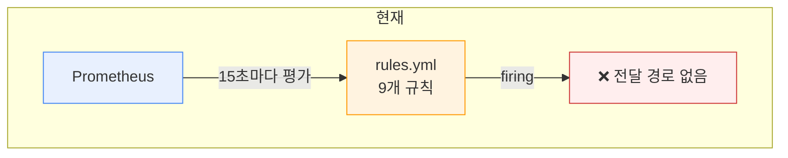
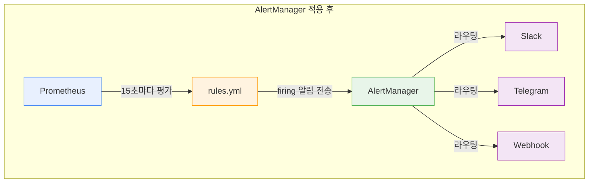
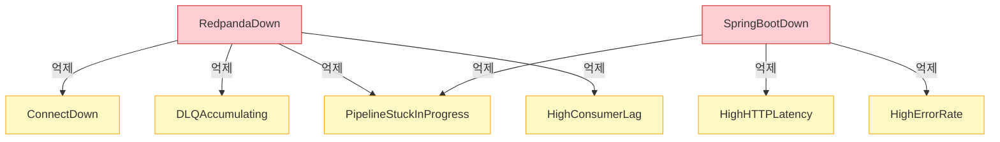

# AlertManager 개념과 적용 가이드

이 문서는 Prometheus AlertManager의 핵심 개념을 정리하고, redpanda-playground 프로젝트에 적용했을 때 어떤 구조가 되는지를 다룬다. 현재 프로젝트에는 알림 규칙 9개가 정의되어 있지만 AlertManager가 없어서 알림이 어디에도 전달되지 않는다. 이 간극을 이해하고 해소하는 것이 목적이다.

---

## 1. 현재 알림 구조의 한계

`prometheus-rules.yml`에 9개 알림 규칙이 정의되어 있고, Prometheus는 15초마다 이 규칙을 평가한다. 문제는 규칙이 firing 상태가 되어도 **알림을 받을 곳이 없다**는 점이다. Prometheus 자체는 알림을 전송하는 기능이 없기 때문이다. Prometheus UI(`/alerts`)에서 firing 여부를 직접 확인할 수는 있지만, 누군가 화면을 계속 보고 있지 않는 한 장애를 놓치게 된다.

### 현재 구조



### AlertManager 적용 후 구조



Prometheus가 규칙을 평가하고 AlertManager가 알림을 라우팅하는 것은 의도적인 관심사 분리다. Prometheus는 "무엇이 문제인가"를 판단하고, AlertManager는 "누구에게 어떻게 알릴 것인가"를 결정한다. 이 분리 덕분에 알림 규칙을 수정하지 않고도 수신 채널을 바꿀 수 있다.

---

## 2. AlertManager란

AlertManager는 Prometheus 생태계에서 알림 전송을 전담하는 독립 컴포넌트다. Prometheus가 보낸 firing 알림을 받아서 **중복 제거, 그룹화, 라우팅, 억제, 침묵** 처리를 거친 뒤 최종 수신자에게 전달한다.

왜 별도 컴포넌트가 필요한가? Prometheus 서버가 여러 대일 때 같은 알림이 중복 발생할 수 있고, 장애 하나가 연쇄적으로 수십 개 알림을 트리거할 수 있기 때문이다. AlertManager가 이런 노이즈를 정리해서 사람이 실제로 대응해야 하는 알림만 전달한다.

### 핵심 개념 요약

| 개념 | 역할 | 비유 |
|------|------|------|
| **Route Tree** | 라벨 기반으로 알림을 수신자에게 분배 | 우편물 분류 시스템 |
| **Receiver** | 실제 알림을 보내는 채널 (Slack, Email 등) | 우편함 |
| **group_by** | 동일 유형 알림을 하나로 묶음 | "서버 3대 다운" → 메시지 1개 |
| **Inhibition** | 상위 장애 시 하위 알림 자동 억제 | DB 다운이면 쿼리 타임아웃 알림 불필요 |
| **Silence** | 유지보수 중 특정 알림 일시 중지 | 방해 금지 모드 |

---

## 3. 핵심 개념 상세

### 3-1. 라우팅 (Route Tree)

AlertManager의 라우팅은 트리 구조로 동작한다. 최상위 route가 기본 수신자를 정의하고, 하위 route가 라벨 매칭으로 특정 알림을 다른 수신자에게 보낸다. 알림은 트리 위에서 아래로 매칭되며, 첫 번째로 일치하는 route가 처리한다(`continue: false`가 기본값).

```yaml
route:
  receiver: default-slack          # 매칭 안 되면 여기로
  group_by: [alertname, severity]  # 같은 alertname+severity는 하나로 묶음
  group_wait: 30s                  # 첫 알림 후 30초 대기 (그룹 수집 시간)
  group_interval: 5m               # 같은 그룹에 새 알림 추가 시 5분 간격
  repeat_interval: 4h              # 해결 안 되면 4시간마다 재알림
  routes:
    - match:
        severity: critical
      receiver: critical-channel   # critical은 별도 채널로
      group_wait: 10s              # critical은 더 빨리 알림
```

**group_wait, group_interval, repeat_interval의 관계:**

이 세 값은 알림 빈도를 제어한다. `group_wait`는 첫 알림이 들어온 뒤 같은 그룹의 다른 알림을 모으기 위해 대기하는 시간이다. 예를 들어 30초로 설정하면 RedpandaDown과 ConnectDown이 거의 동시에 firing되었을 때 30초 안에 도착한 알림을 하나의 메시지로 묶어서 보낸다. `group_interval`은 이미 알림을 보낸 그룹에 새 알림이 추가되었을 때 다음 알림까지 최소 대기 시간이다. `repeat_interval`은 알림이 여전히 firing 상태일 때 같은 내용을 반복해서 보내는 주기다. 이 값이 너무 짧으면 알림 폭풍이, 너무 길면 장애 인지 지연이 발생한다.

### 3-2. 수신자 (Receivers)

수신자는 알림이 최종 전달되는 채널이다. AlertManager는 Slack, Email(SMTP), PagerDuty, OpsGenie, Webhook 등을 기본 지원한다. 하나의 receiver에 여러 채널을 동시 설정할 수도 있다.

이 프로젝트에서 실용적인 선택지는 두 가지다:

| 채널 | 설정 난이도 | PoC 적합성 | 이유 |
|------|-----------|-----------|------|
| **Slack Incoming Webhook** | 낮음 | 적합 | URL 하나로 설정 완료, 무료 |
| **Telegram Bot** | 낮음 | 적합 | BotFather로 봇 생성 → chat_id + token |
| Email (SMTP) | 중간 | 비추천 | SMTP 서버 설정 필요, PoC에 과함 |
| PagerDuty | 높음 | 비추천 | 유료, 온콜 로테이션 없는 1인 프로젝트 |

Telegram은 AlertManager가 기본 지원하지 않으므로 webhook receiver로 별도 어댑터를 두거나, [prometheus-bot](https://github.com/inCaller/prometheus_bot) 같은 서드파티를 사용해야 한다. PoC에서는 Slack webhook이 가장 간단하다.

### 3-3. 억제 (Inhibition)

억제는 상위 장애가 발생했을 때 그로 인해 파생되는 하위 알림을 자동으로 숨기는 기능이다. 왜 필요한가? Redpanda 브로커가 다운되면 Connect도 당연히 실패하고, DLQ 적재도, 파이프라인 정체도 동시에 발생한다. 이 상황에서 4개 알림이 동시에 울리면 원인(Redpanda 다운)이 아닌 증상(Connect 다운, DLQ 적재)에 주의가 분산된다.

억제 규칙은 "source 알림이 firing이면 target 알림을 숨긴다"로 정의한다:

```yaml
inhibit_rules:
  - source_matchers:
      - alertname = "RedpandaDown"
    target_matchers:
      - alertname =~ "ConnectDown|DLQAccumulating"
    # source와 target의 이 라벨 값이 같을 때만 억제
    equal: []
```

이 프로젝트의 9개 규칙에서 도출할 수 있는 억제 관계는 섹션 4-3에서 상세히 다룬다.

### 3-4. 침묵 (Silences)

침묵은 특정 시간 동안 라벨 조건에 맞는 알림을 일시 중지하는 기능이다. 계획된 유지보수(Redpanda 롤링 재시작, Docker Compose 재배포 등) 중에 예상된 알림이 울리지 않게 할 때 사용한다.

침묵은 설정 파일이 아닌 AlertManager UI(`:9093/#/silences`) 또는 API로 생성한다. 시작 시간과 종료 시간을 지정하므로 유지보수가 끝나면 자동으로 해제된다. 설정 파일에 넣지 않는 이유는, 침묵은 일시적이고 상황에 따라 달라지는 운영 행위이기 때문이다.

```bash
# amtool로 2시간 침묵 생성 예시
amtool silence add alertname="RedpandaDown" \
  --comment="Rolling restart" \
  --duration=2h
```

---

## 4. 이 프로젝트에 적용하면

### 4-1. 아키텍처 변경

현재 모니터링 스택(Loki, Tempo, Alloy, Prometheus, Grafana)에 AlertManager 컨테이너 하나를 추가하고, Prometheus가 AlertManager 엔드포인트를 알도록 설정하면 된다. 변경 범위는 3개 파일이다:

| 파일 | 변경 내용 |
|------|----------|
| `docker-compose.monitoring.yml` | `alertmanager` 서비스 추가 |
| `prometheus.yml` | `alerting` 섹션에 AlertManager 주소 추가 |
| `monitoring/alertmanager.yml` | 신규 — 라우팅, 수신자, 억제 규칙 정의 |

기존 `prometheus-rules.yml`은 수정할 필요가 없다. 이미 severity 라벨이 잘 설정되어 있어서 AlertManager 라우팅에 바로 사용할 수 있다.

### 4-2. 라우팅 설계 (기존 9개 규칙 기반)

현재 규칙들의 severity 분포를 먼저 정리하면:

| severity | 알림 | 그룹 |
|----------|------|------|
| **critical** | RedpandaDown, ConnectDown, HighErrorRate | availability, performance |
| **warning** | SpringBootDown, HighConsumerLag, HighHTTPLatency, TempoHighMemory, DLQAccumulating, PipelineStuckInProgress | availability, performance, resources, business |

라우팅 전략은 단순하게 severity 기반으로 나눈다:

- **critical** → 즉시 알림 (group_wait: 10s), 1시간마다 반복
- **warning** → 5분 그룹화 후 알림 (group_wait: 5m), 4시간마다 반복

PoC 규모에서 알림 9개를 더 세분화할 필요는 없다. severity 2단계 분리만으로 충분하다.

### 4-3. 억제 규칙 설계

이 프로젝트의 서비스 의존 관계를 기반으로 억제 규칙을 설계한다:



**설계 근거:**

- **RedpandaDown → ConnectDown, DLQAccumulating, PipelineStuckInProgress, HighConsumerLag**: Redpanda가 다운되면 Connect는 메시지를 읽을 수 없고, DLQ 적재도 불가능하며, 파이프라인은 정체되고, Consumer Lag은 무한히 증가한다. 이 4개 알림은 모두 Redpanda 다운의 증상이다.
- **SpringBootDown → HighHTTPLatency, HighErrorRate**: Spring Boot 앱이 아예 다운되면 HTTP 메트릭 자체가 수집되지 않거나 비정상 값이 나온다. 앱 다운이 원인이므로 지연/에러율 알림은 불필요하다.
- **SpringBootDown → PipelineStuckInProgress**: Spring Boot가 Producer 역할을 하므로, 앱 다운 시 메시지 생성이 중단되어 파이프라인이 정체된 것처럼 보일 수 있다.

### 4-4. 예시 설정 파일 (alertmanager.yml)

아래 설정은 Slack webhook 기반이다. `SLACK_WEBHOOK_URL`과 `SLACK_CHANNEL`을 실제 값으로 교체하면 바로 사용할 수 있다.

```yaml
# monitoring/alertmanager.yml
global:
  resolve_timeout: 5m               # firing → resolved 전환 후 5분 대기

route:
  receiver: default-slack
  group_by: [alertname, severity]
  group_wait: 30s
  group_interval: 5m
  repeat_interval: 4h

  routes:
    # critical 알림: 즉시, 1시간 반복
    - match:
        severity: critical
      receiver: critical-slack
      group_wait: 10s
      repeat_interval: 1h

    # warning 알림: 5분 그룹화, 4시간 반복
    - match:
        severity: warning
      receiver: default-slack
      group_wait: 5m
      repeat_interval: 4h

receivers:
  - name: critical-slack
    slack_configs:
      - api_url: "https://hooks.slack.com/services/YOUR/WEBHOOK/URL"
        channel: "#alerts-critical"
        title: "{{ .GroupLabels.alertname }} ({{ .GroupLabels.severity }})"
        text: >-
          {{ range .Alerts }}
          *{{ .Annotations.summary }}*
          {{ .Annotations.description }}
          {{ end }}
        send_resolved: true

  - name: default-slack
    slack_configs:
      - api_url: "https://hooks.slack.com/services/YOUR/WEBHOOK/URL"
        channel: "#alerts-warning"
        title: "{{ .GroupLabels.alertname }} ({{ .GroupLabels.severity }})"
        text: >-
          {{ range .Alerts }}
          *{{ .Annotations.summary }}*
          {{ .Annotations.description }}
          {{ end }}
        send_resolved: true

inhibit_rules:
  # Redpanda 다운 → Connect/파이프라인/컨슈머 관련 알림 억제
  - source_matchers:
      - alertname = "RedpandaDown"
    target_matchers:
      - alertname =~ "ConnectDown|DLQAccumulating|PipelineStuckInProgress|HighConsumerLag"

  # Spring Boot 다운 → HTTP 지연/에러율 알림 억제
  - source_matchers:
      - alertname = "SpringBootDown"
    target_matchers:
      - alertname =~ "HighHTTPLatency|HighErrorRate"

  # Spring Boot 다운 → 파이프라인 정체 억제 (앱이 Producer 역할)
  - source_matchers:
      - alertname = "SpringBootDown"
    target_matchers:
      - alertname = "PipelineStuckInProgress"
```

### 4-5. Docker Compose 추가 설정

**`docker-compose.monitoring.yml`에 추가할 서비스:**

```yaml
  # --------------------------------------------------------------------------
  # AlertManager — 알림 라우팅/그룹화/억제
  # --------------------------------------------------------------------------
  # Prometheus가 평가한 firing 알림을 받아서 중복 제거, 그룹화, 라우팅 후
  # Slack/Telegram 등 수신자에게 전달한다.
  # --------------------------------------------------------------------------
  alertmanager:
    image: prom/alertmanager:v0.27.0
    container_name: playground-alertmanager
    command:
      - --config.file=/etc/alertmanager/alertmanager.yml
      - --storage.path=/alertmanager
    ports:
      - "${ALERTMANAGER_PORT:-29093}:9093"
    volumes:
      - ./monitoring/alertmanager.yml:/etc/alertmanager/alertmanager.yml:ro
      - alertmanager-data:/alertmanager
    healthcheck:
      test: ["CMD-SHELL", "wget -qO- http://localhost:9093/-/healthy || exit 1"]
      interval: 10s
      timeout: 5s
      retries: 5
    deploy:
      resources:
        limits:
          memory: 64M    # AlertManager는 매우 가벼움
```

**volumes 섹션에 추가:**

```yaml
  alertmanager-data:
```

**`prometheus.yml`에 추가할 섹션:**

```yaml
# 기존 global, rule_files 아래에 추가
alerting:
  alertmanagers:
    - static_configs:
        - targets:
            - alertmanager:9093
```

이 설정으로 Prometheus는 firing 알림을 AlertManager에 HTTP POST로 전달한다. AlertManager는 `alertmanager.yml`의 라우팅/억제 규칙에 따라 처리 후 수신자에게 전송한다.

---

## 5. AlertManager vs Grafana Alerting

현재 `05-dashboards-and-alerts.md`에서 Grafana Alerting을 대안으로 언급하고 있다. 두 접근법은 동일한 문제(알림 전달)를 해결하지만 방식이 다르다.

| 기준 | AlertManager | Grafana Alerting |
|------|-------------|-----------------|
| **설정 방식** | YAML 파일 (IaC 친화적) | UI 클릭 또는 Provisioning YAML |
| **알림 규칙 위치** | Prometheus rules.yml (변경 없음) | Grafana 자체 규칙 또는 Prometheus 규칙 연동 |
| **억제(Inhibition)** | 네이티브 지원 | 미지원 (Notification Policy로 부분 대체) |
| **침묵(Silence)** | 네이티브 지원 (UI + API) | 지원 (Mute Timings) |
| **고가용성** | 클러스터 모드 (Gossip) | Grafana HA 필요 |
| **추가 컨테이너** | 필요 (alertmanager) | 불필요 (Grafana에 내장) |
| **설정 복잡도** | 중간 (YAML 작성) | 낮음 (UI에서 설정) |
| **프로덕션 표준** | 사실상 표준 | 소규모 팀에서 충분 |

### 이 프로젝트에서의 권장

**PoC 단계 (현재) → Grafana Alerting을 권장한다.** 이유는 추가 컨테이너 없이 이미 있는 Grafana에서 바로 설정할 수 있고, UI로 시행착오를 빠르게 반복할 수 있기 때문이다. 알림 규칙 9개, 운영자 1명인 환경에서 억제 규칙의 부재는 큰 문제가 되지 않는다.

**GCP 배포 또는 팀 운영 전환 시 → AlertManager를 권장한다.** IaC로 관리할 수 있고, 억제 규칙으로 알림 폭풍을 제어할 수 있으며, Prometheus HA 구성과 자연스럽게 통합되기 때문이다. 이 문서의 섹션 4 설정을 그대로 적용하면 된다.

두 접근법은 배타적이지 않다. Grafana는 AlertManager를 데이터소스로 추가하여 AlertManager의 알림 상태를 Grafana UI에서 볼 수 있다. 프로덕션에서는 "AlertManager가 라우팅 + Grafana가 시각화" 조합을 많이 쓴다.

---

## 6. 도입 시 체크리스트

AlertManager를 이 프로젝트에 실제로 도입할 때 필요한 작업 목록이다. 순서대로 진행하면 된다.

### 설정 파일

- [ ] `monitoring/alertmanager.yml` 작성 (섹션 4-4 참조)
- [ ] `docker-compose.monitoring.yml`에 alertmanager 서비스 추가 (섹션 4-5 참조)
- [ ] `prometheus.yml`에 `alerting` 섹션 추가 (섹션 4-5 참조)
- [ ] volumes에 `alertmanager-data` 추가

### 수신자 설정

- [ ] Slack workspace에서 Incoming Webhook URL 생성
- [ ] `alertmanager.yml`의 `api_url`에 실제 URL 입력
- [ ] 채널 이름 확인 (`#alerts-critical`, `#alerts-warning` 또는 실제 채널)

### 검증

- [ ] `docker compose -f docker-compose.monitoring.yml up -d` 재시작
- [ ] AlertManager UI 접근 확인 (`localhost:29093`)
- [ ] Prometheus UI → Status → Alertmanagers에서 연결 확인
- [ ] 테스트 알림 발생시켜 Slack 수신 확인 (예: Spring Boot 컨테이너 중지)
- [ ] 억제 규칙 테스트 (Redpanda 중지 후 ConnectDown 알림이 억제되는지 확인)

### 선택 사항

- [ ] Grafana에서 AlertManager 데이터소스 추가 (Grafana → Data Sources → Alertmanager)
- [ ] AlertManager 자체 메트릭을 Alloy가 스크래핑하도록 설정 (`alertmanager:9093/metrics`)

---

## 참조

- [05-dashboards-and-alerts.md](./05-dashboards-and-alerts.md) — 기존 9개 알림 규칙 정의 및 Grafana Alerting 언급
- [prometheus-rules.yml](../../../docker/shared/monitoring/prometheus-rules.yml) — 실제 규칙 파일 (로컬)
- [Prometheus Alerting 공식 문서](https://prometheus.io/docs/alerting/latest/overview/)
- [AlertManager Configuration 공식 문서](https://prometheus.io/docs/alerting/latest/configuration/)
