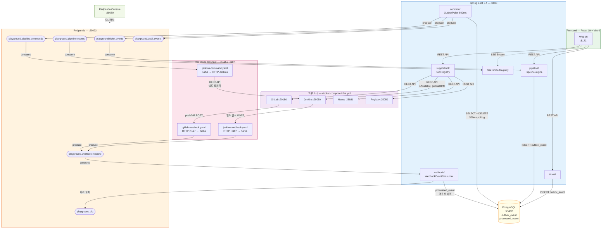

# Redpanda Playground - 프로젝트 개요

## 문서 읽기 순서

| 순서 | 문서 | 내용 |
|------|------|------|
| 1 | **01-project-overview.md** (이 문서) | 프로젝트 목적, 도메인, 인프라 구성 |
| 2 | [02-redpanda-guide.md](02-redpanda-guide.md) | Redpanda 운영 가이드 (Kafka와 차이, rpk CLI, Console) |
| 3 | [03-connect-streams.md](03-connect-streams.md) | Redpanda Connect Streams 모드 |
| 4 | [04-jenkins.md](04-jenkins.md) | Jenkins 설정 및 Webhook 발송 전략 |

---

## 목적

TPS 트럼본(배포 플랫폼)의 간소화 버전으로, Redpanda 도입에 대한 구조와 주요 정책을 백엔드 팀에게 코드로 설명한다.

## 핵심 도메인

### Ticket (배포 티켓)
- 배포 대상을 정의하는 단위
- 이름, 설명, 상태, 소스 목록을 가짐
- 상태: DRAFT → READY → DEPLOYING → DEPLOYED / FAILED

### TicketSource (배포 소스)
- 티켓에 연결된 배포 소스 (1:N)
- 유형: GIT (소스 빌드), NEXUS (war/jar), HARBOR (Docker 이미지)
- 복합 소스 허용 (GIT + NEXUS 동시 선택 가능)

### Pipeline (배포 파이프라인)
- 티켓의 소스를 기반으로 자동 생성되는 배포 실행 단위
- 소스 유형별 단계(Step) 자동 구성
- 실시간 상태 추적 (SSE)

---

## 기술 정책

### 이벤트 기반 아키텍처
- 도메인 간 직접 의존 금지 (ticket ↔ pipeline)
- Outbox 패턴으로 메시지 발행 보장
- Consumer 멱등성 (correlationId + eventType 복합 키)

### 토픽 설계

```java
// Topics.java (common-kafka 모듈)에서 상수 정의
public static final String PIPELINE_COMMANDS = "playground.pipeline.commands";
public static final String PIPELINE_EVENTS   = "playground.pipeline.events";
public static final String TICKET_EVENTS     = "playground.ticket.events";
public static final String WEBHOOK_INBOUND   = "playground.webhook.inbound";
public static final String AUDIT_EVENTS      = "playground.audit.events";
public static final String DLQ               = "playground.dlq";
```

| 토픽 | 용도 |
|------|------|
| playground.pipeline.commands | 파이프라인 실행 커맨드 |
| playground.pipeline.events | 파이프라인 스텝/완료 이벤트 |
| playground.ticket.events | 티켓 생성 이벤트 |
| playground.webhook.inbound | 외부 webhook 수신 |
| playground.audit.events | 감사 로그 |
| playground.dlq | Dead Letter Queue |

### SupportTool (개발지원도구)
- 외부 도구(Jenkins, GitLab, Nexus, Registry) 연결 정보를 DB에 중앙 관리
- 어댑터는 `ToolRegistry`를 통해 런타임에 URL/인증 정보를 동적 조회
- 인증 정보는 평문 저장, API 응답 시 `hasCredential` boolean으로 마스킹
- 연결 테스트: ToolType별 health check 엔드포인트 호출
- 프론트엔드: `/tools` 페이지에서 CRUD + 연결 테스트

### AsyncAPI
- Springwolf로 이벤트 명세 자동 생성
- UI: http://localhost:8080/springwolf/asyncapi-ui.html

---

## 전체 아키텍처



### 데이터 흐름 요약

| 방향 | 흐름 | 미들웨어 |
|------|------|---------|
| **Event (외부→앱)** | Jenkins/GitLab → Connect HTTP :4197 → `playground.webhook.inbound` → WebhookEventConsumer | Connect가 HTTP→Kafka 변환 |
| **Command (앱→외부)** | PipelineEngine → Outbox → `playground.pipeline.commands` → Connect → Jenkins REST | Connect가 Kafka→HTTP 변환 |
| **Query (앱→외부)** | ToolRegistry → Jenkins/GitLab/Nexus REST API 직접 호출 | 미들웨어 없음 (동기) |
| **Domain Event** | TicketService → Outbox → `playground.ticket.events` → PipelineEngine | Outbox 폴러가 DB→Kafka 변환 |
| **Realtime** | `playground.pipeline.events` → PipelineSseConsumer → SseEmitterRegistry → 브라우저 | SSE 단방향 스트리밍 |

---

## 인프라 구성

```
┌─────────────────────────────────────────────────────────┐
│  docker-compose.yml (핵심 인프라)                        │
│                                                         │
│  ┌──────────┐  ┌──────────┐  ┌──────────┐  ┌────────┐  │
│  │ Redpanda │  │ Console  │  │ Connect  │  │Postgres│  │
│  │ :29092   │  │ :28080   │  │ :4195    │  │ :25432 │  │
│  │ Kafka+SR │  │ Web UI   │  │ Streams  │  │  DB    │  │
│  └──────────┘  └──────────┘  └──────────┘  └────────┘  │
│                                                         │
├─────────────────────────────────────────────────────────┤
│  docker-compose.infra.yml (외부 도구)                    │
│                                                         │
│  ┌──────────┐  ┌──────────┐  ┌──────────┐  ┌────────┐  │
│  │ Jenkins  │  │  GitLab  │  │  Nexus   │  │Registry│  │
│  │ :29080   │  │ :29180   │  │ :28881   │  │ :25050 │  │
│  │ CI/CD    │  │ Git Repo │  │ Artifact │  │ Docker │  │
│  └──────────┘  └──────────┘  └──────────┘  └────────┘  │
│                                            ┌────────┐   │
│                    Spring Boot App ←SSE→   │Reg. UI │   │
│                    :8080                   │ :25051 │   │
│                                            └────────┘   │
└─────────────────────────────────────────────────────────┘
```

### docker-compose.yml — 핵심 서비스

| 서비스 | 이미지 | 포트 | 역할 | 메모리 |
|--------|--------|------|------|--------|
| `redpanda` | redpandadata/redpanda | 29092 (Kafka), 28081 (SR), 29644 (Admin) | 메시지 브로커 + Schema Registry | 2G (--memory) |
| `console` | redpandadata/console:v2.8.0 | 28080 | 토픽/메시지/그룹 웹 UI | 256M |
| `connect` | redpandadata/connect:4.43.0 | 4195 (API), 4197 (Webhook) | HTTP↔Kafka 브릿지 (Streams 모드) | 128M |
| `postgres` | postgres:16-alpine | 25432 | 애플리케이션 DB (Outbox 포함) | 256M |

### docker-compose.infra.yml — 외부 도구

| 서비스 | 이미지 | 포트 | 역할 | 메모리 |
|--------|--------|------|------|--------|
| `jenkins` | jenkins/jenkins:lts-jdk17 (커스텀) | 29080 | CI/CD 빌드/배포 시뮬레이션 | 1536M |
| `gitlab` | gitlab/gitlab-ce:17.4.0 | 29180 (HTTP), 29122 (SSH) | Git 저장소 | 4096M |
| `nexus` | sonatype/nexus3:3.72.0 | 28881 | 아티팩트 저장소 | 1228M |
| `registry` | registry:2 | 25050 | Docker 이미지 레지스트리 | 128M |
| `registry-ui` | joxit/docker-registry-ui:2.5 | 25051 | Registry 웹 UI | 30M |

### 미들웨어 접속 정보

| 미들웨어 | 주소 | 계정 | 용도 | 문서 |
|----------|------|------|------|------|
| **Spring Boot** | http://localhost:8080 | - | 백엔드 API | [backend-deep-dive.md](../guide/backend-deep-dive.md) |
| **Frontend (Vite)** | http://localhost:5173 | - | React UI | [frontend-deep-dive.md](../guide/frontend-deep-dive.md) |
| **Redpanda (Kafka)** | localhost:29092 | 인증 없음 | 메시지 브로커 | [02-redpanda-guide.md](02-redpanda-guide.md) |
| **Schema Registry** | http://localhost:28081 | 인증 없음 | Avro 스키마 관리 | [02-redpanda-guide.md](02-redpanda-guide.md) |
| **Redpanda Console** | http://localhost:28080 | 인증 없음 | 토픽/메시지/그룹 웹 UI | [02-redpanda-guide.md](02-redpanda-guide.md) |
| **Redpanda Connect API** | http://localhost:4195 | 인증 없음 | Streams REST API | [03-connect-streams.md](03-connect-streams.md) |
| **Connect Webhook** | http://localhost:4197 | 인증 없음 | Webhook 수신 포트 | [03-connect-streams.md](03-connect-streams.md) |
| **PostgreSQL** | localhost:25432 | `playground` / `playground` | 앱 DB | - |
| **Jenkins** | http://localhost:29080 | `admin` / `admin` | CI/CD | [04-jenkins.md](04-jenkins.md) |
| **GitLab** | http://localhost:29180 | `root` / `playground1234!` | Git 저장소 | - |
| **Nexus** | http://localhost:28881 | `admin` / 초기 비번 자동생성 | 아티팩트 저장소 | - |
| **Registry** | http://localhost:25050 | 인증 없음 | Docker 이미지 레지스트리 | - |
| **Registry UI** | http://localhost:25051 | 인증 없음 | Registry 웹 UI | - |
| **AsyncAPI (Springwolf)** | http://localhost:8080/springwolf/asyncapi-ui.html | - | 이벤트 명세 | - |

---

## 프로젝트에서 배울 수 있는 Redpanda 활용 패턴

| 패턴 | 이 프로젝트의 적용 | 실무 확장 |
|------|-------------------|----------|
| **Schema Registry 내장 활용** | Avro 스키마를 Schema Registry에 등록하지 않고 ByteArray로 직접 관리 | 프로덕션에서는 자동 serde + 호환성 검증을 활용하는 것이 안전하다 |
| **Redpanda Connect 브릿지** | Jenkins HTTP → Kafka 토픽 변환 | 외부 시스템(Slack, GitHub 등)의 webhook을 Kafka로 통합할 때 동일 패턴 |
| **Console로 이벤트 추적** | 데모 시 토픽 메시지 실시간 확인 | 장애 시 메시지 내용/순서 확인, 컨슈머 래그 모니터링 |
| **rpk로 운영** | `rpk topic list`, `rpk group describe` | 토픽 설정 변경, 오프셋 리셋, 파티션 재배분 |
| **단일 바이너리 경량 인프라** | Docker Compose 1개 컨테이너로 Kafka+SR 대체 | CI/CD 파이프라인에서 통합 테스트 인프라로 활용 (Testcontainers와 조합) |
