# 아키텍처 패턴 인덱스 — Redpanda Playground

이 문서는 Redpanda Playground 프로젝트에 적용된 아키텍처 패턴 전체를 한 곳에서 조망하기 위한 인덱스다. 각 패턴이 어떤 문제를 해결하는지, 코드베이스 어디에 적용됐는지, 상세 문서가 있는 경우 링크를 제공한다.

---

## 전체 패턴 목록

| # | 패턴 | 적용 위치 | 문서 | 상태 |
|---|------|----------|------|------|
| 01 | Pattern Index | - | 이 문서 | ✅ |
| 02 | 202 Accepted (비동기 응답) | PipelineController | `01-202-accepted.md` | ✅ |
| 03 | SAGA Orchestration | DagExecutionCoordinator, PipelineEngine | `02-saga-orchestrator.md` | ✅ |
| 04 | Transactional Outbox | EventPublisher → outbox_event → Kafka | `03-transactional-outbox.md` | ✅ |
| 05 | SSE (Server-Sent Events) | 실시간 파이프라인 진행률 | `04-sse-realtime.md` | ✅ |
| 06 | Break-and-Resume | Jenkins webhook 대기 | `05-break-and-resume.md` | ✅ |
| 07 | Redpanda Connect | Protocol 변환 파이프라인 | `06-redpanda-connect.md` | ✅ |
| 08 | Topic/Message Design (Avro) | 6개 토픽 + Schema Registry | `07-topic-message-design.md` | ✅ |
| 09 | Adapter + Fallback | StepExecutor Real/Mock 교체 | `08-adapter-fallback.md` | ✅ |
| 10 | Idempotent Consumer | processed_event 테이블 | `09-idempotency.md` | ✅ |
| 11 | Dynamic Connector | SupportToolService → Connect Streams API | `10-dynamic-connector.md` | ✅ |
| 12 | E2E Trace Propagation | CompletableFuture + webhook traceId 복원 | `11-e2e-trace-propagation.md` | ✅ |
| 13 | Crash Recovery | @PostConstruct RUNNING 실행 복구 | `12-crash-recovery.md` | ✅ |
| 14 | Failure Policy | STOP_ALL / SKIP_DOWNSTREAM / CONTINUE | `13-failure-policy.md` | ✅ |
| 15 | Job Retry (Exponential Backoff) | DAG Job 재시도 | `14-job-retry.md` | ✅ |
| 16 | Strategy Pattern | JobExecutorRegistry | - | 📝 아래 설명 |
| 17 | Parameter Injection | ParameterResolver | - | 📝 아래 설명 |
| 18 | CQRS (커맨드/이벤트 분리) | PIPELINE_COMMANDS / PIPELINE_EVENTS 토픽 | - | 📝 아래 설명 |
| 19 | Per-execution Lock | 실행별 ReentrantLock | `pipeline/dag/01-concepts.md` §1.6 | 📎 참조 |

---

## 문서화된 패턴 요약

**202 Accepted** — 파이프라인 시작 요청을 받자마자 202를 반환하고, 실제 실행은 Redpanda를 통해 비동기로 진행한다. 클라이언트는 응답 본문의 `trackingUrl`을 통해 SSE로 진행 상황을 구독한다. `PipelineController.startPipeline()`에서 적용된다.

**SAGA Orchestration** — 빌드 → 테스트 → 배포처럼 여러 외부 시스템을 거치는 분산 트랜잭션을 2PC 없이 조율한다. 각 스텝은 독립 로컬 트랜잭션으로 실행되고, 실패 시 이미 완료된 스텝을 보상 트랜잭션으로 되돌린다. `DagExecutionCoordinator`가 오케스트레이터 역할을 맡는다.

**Transactional Outbox** — DB 커밋과 Kafka produce를 원자적으로 묶는다. 이벤트를 Kafka에 직접 발행하는 대신 동일 DB의 `outbox_event` 테이블에 삽입하고, OutboxPoller가 주기적으로 PENDING 레코드를 읽어 Kafka에 전달한다. DB 커밋 후 Kafka 장애가 발생해도 이벤트가 유실되지 않는다.

**SSE (Server-Sent Events)** — 파이프라인 진행 상태를 클라이언트에 실시간으로 push한다. 파이프라인 이벤트는 서버 → 클라이언트 단방향이므로 WebSocket보다 단순한 SSE가 적합하다. Spring의 `SseEmitter`와 브라우저 표준 `EventSource` API를 사용한다.

**Break-and-Resume** — Jenkins 빌드처럼 수 분이 걸리는 외부 작업을 폴링 없이 처리한다. 빌드를 트리거하고 스레드를 즉시 해제한 뒤, Jenkins가 완료 시점에 webhook을 보내면 그때 파이프라인 실행을 재개한다. 대기 중 서버 스레드를 점유하지 않는다.

**Redpanda Connect** — Kafka 클라이언트 라이브러리를 탑재할 수 없는 Jenkins(Groovy)가 HTTP POST 하나로 Kafka 토픽에 이벤트를 발행할 수 있게 해주는 브릿지다. 프로토콜 변환과 재연결 로직은 Connect가 담당한다.

**Topic/Message Design (Avro)** — 6개 토픽을 `playground.{domain}.{type}` 네이밍 규칙으로 설계하고 Avro 스키마로 계약을 강제한다. Schema Registry가 스키마 진화(하위 호환)를 관리하여 프로듀서와 컨슈머를 독립적으로 배포할 수 있게 한다.

**Adapter + Fallback** — 각 외부 시스템 호출을 `StepExecutor` 인터페이스 뒤에 숨긴다. 인프라가 없는 개발·데모 환경에서는 Fallback(Mock) 구현체가 슬립 후 SUCCESS를 반환하고, 인프라가 갖춰지면 Real 구현체로 교체된다. 오케스트레이터는 인프라 가용성을 알 필요가 없다.

**Idempotent Consumer** — Kafka의 at-least-once 전달로 인해 같은 메시지가 두 번 도착할 수 있다. `processed_event` 테이블에 `(correlation_id, event_type)` 복합 유니크 키를 저장해 중복 메시지를 탐지하고 건너뛴다.

**Dynamic Connector** — UI에서 Jenkins 인스턴스를 등록하면 Connect Streams REST API를 통해 런타임에 webhook 수신 파이프라인이 자동 생성된다. 커넥터 설정은 DB에 영속화되어 재시작 시 복원된다.

**E2E Trace Propagation** — `CompletableFuture.runAsync()` 스레드 경계와 Jenkins webhook 콜백에서 OTel traceId가 소실되는 두 지점을 해결한다. OTel Context-aware Executor로 스레드 간 전파를 유지하고, executionId를 통해 webhook 수신 시 원래 span을 복원한다.

**Crash Recovery** — 앱 비정상 종료 후 재시작 시 `@PostConstruct`에서 DB의 RUNNING 상태 실행을 탐지해 DAG 상태를 재구성하고 실행을 이어간다. webhook 대기 중이던 Job은 FAILED 처리 후 보상을 시작한다.

**Failure Policy** — DAG 실행 중 Job 실패 시 세 가지 전략을 선택할 수 있다. STOP_ALL은 새 dispatch를 중단하고 보상을 실행하며, SKIP_DOWNSTREAM은 실패한 Job의 하위 브랜치만 건너뛰고 독립 브랜치는 계속 진행한다. CONTINUE는 실패를 무시하고 모든 Job을 끝까지 실행한다.

**Job Retry (Exponential Backoff)** — 일시적 오류(네트워크 타임아웃, Jenkins 과부하)로 실패한 Job을 즉시 FAILED 처리하지 않고 재시도한다. `ScheduledExecutorService`로 1초, 2초, 4초 지수 백오프 지연 후 재실행하며, 최대 재시도 횟수 초과 시에만 실패로 확정한다.

---

## 미문서화 패턴 설명

### 16. Strategy Pattern (JobExecutorRegistry)

`JobExecutorRegistry`는 `PipelineJobType`을 키로 `PipelineJobExecutor` 구현체를 매핑하는 레지스트리다. BUILD 타입이 들어오면 `JenkinsCloneAndBuildStep`을, DEPLOY 타입이 들어오면 `JenkinsDeployStep`을 반환하는 방식으로 동작한다.

```java
// JobExecutorRegistry 조회 예시
PipelineJobExecutor executor = registry.getExecutor(job.getJobType());
executor.execute(jobExecution, context);
```

새 Job 타입을 추가할 때 오케스트레이터 코드를 건드리지 않고 `PipelineJobExecutor` 구현체 하나를 추가한 뒤 레지스트리에 등록하면 된다. 분기 조건이 코드에 흩어지지 않고 레지스트리에 집중되어 있어 확장 시 영향 범위가 최소화된다.

### 17. Parameter Injection (ParameterResolver)

`ParameterResolver`는 파이프라인 실행 시 동적 파라미터를 `JobExecution`에 주입한다. 파이프라인 정의 단계에서는 `parameterSchemaJson`으로 어떤 파라미터를 받을지 스키마를 선언하고, 실행 시에는 `parametersJson`에 실제 값을 전달한다. Resolver는 스키마를 검증하고 Job별 파라미터를 병합한 뒤 Jenkins 빌드 트리거 시 환경변수로 전달한다.

```
실행 요청 parametersJson
    → ParameterResolver.resolve(schema, values)
    → JobExecution.resolvedParams
    → Jenkins triggerBuild(envVars)
```

이 구조 덕분에 동일한 파이프라인 정의를 브랜치명, 배포 환경, 이미지 태그를 달리해 재사용할 수 있다.

### 18. CQRS (커맨드/이벤트 분리)

완전한 CQRS(읽기/쓰기 모델 분리)를 구현하지는 않았지만, 토픽 수준에서 커맨드와 이벤트를 분리하는 원칙을 적용했다. `playground.pipeline.commands` 토픽은 "파이프라인을 시작하라"는 의도를 담은 커맨드 메시지를 전달하고, `playground.pipeline.events` 토픽은 "파이프라인이 완료됐다"는 사실을 담은 이벤트 메시지를 전달한다. 커맨드는 처리 전에 무효화될 수 있지만 이벤트는 이미 발생한 사실이므로 변경되지 않는다는 의미 차이를 토픽 이름에 명시적으로 드러낸 것이다.

---

## 패턴 간 관계도

```mermaid
graph LR
    A["API Request\nPOST /pipeline/start"]
    B["202 Accepted"]
    C["Outbox\noutbox_event"]
    D["Redpanda\nKafka"]
    E["Idempotent\nConsumer"]
    F["Pipeline Engine\nDAG Executor"]
    G["SAGA\nOrchestration"]
    H["Break-and-Resume\nJenkins Webhook"]
    I["Strategy\nJobExecutorRegistry"]
    J["Failure Policy\n+ Job Retry"]
    K["Crash Recovery\n@PostConstruct"]
    L["SSE\nClient Push"]
    M["Redpanda Connect\nHTTP→Kafka Bridge"]
    N["Jenkins"]

    A -->|"① 즉시 반환"| B
    A -->|"② 커맨드 발행"| C
    C -->|"Outbox Poller"| D
    D -->|"at-least-once"| E
    E -->|"중복 제거 후"| F
    F --> G
    G --> I
    I -->|"Job 실행"| H
    H -->|"webhook"| M
    M --> D
    G --> J
    J -->|"retry / compensate"| G
    K -.->|"재시작 복구"| F
    F -->|"이벤트 발행"| L

    style A fill:#e8f4fd,stroke:#2980b9,color:#333
    style B fill:#eafaf1,stroke:#27ae60,color:#333
    style C fill:#fef9e7,stroke:#d4ac0d,color:#333
    style D fill:#fdf2f8,stroke:#8e44ad,color:#333
    style E fill:#fef9e7,stroke:#d4ac0d,color:#333
    style F fill:#e8f4fd,stroke:#2980b9,color:#333
    style G fill:#fdecea,stroke:#c0392b,color:#333
    style H fill:#eafaf1,stroke:#27ae60,color:#333
    style I fill:#fef9e7,stroke:#d4ac0d,color:#333
    style J fill:#fdecea,stroke:#c0392b,color:#333
    style K fill:#f4f4f4,stroke:#7f8c8d,color:#333
    style L fill:#eafaf1,stroke:#27ae60,color:#333
    style M fill:#fdf2f8,stroke:#8e44ad,color:#333
    style N fill:#f4f4f4,stroke:#7f8c8d,color:#333
```



---

> 각 패턴 문서는 `docs/patterns/` 디렉토리에, DAG 엔진 내부 개념(Kahn's Algorithm, Per-execution Lock 등)은 `docs/pipeline/dag/` 디렉토리에 위치한다.
