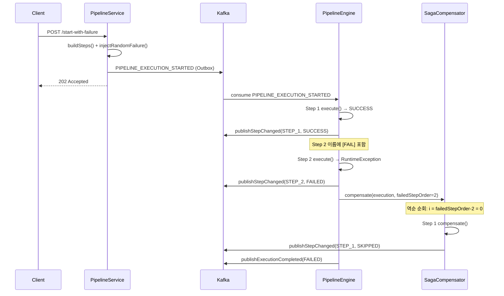

# SAGA Orchestrator 패턴 (보상 트랜잭션)

## 1. 분산 트랜잭션에서 왜 SAGA가 필요한가

단일 DB 트랜잭션은 ACID를 보장한다. 그러나 배포 파이프라인처럼 Git 클론 → 아티팩트 다운로드 → 이미지 풀 → 배포 순서로 여러 외부 시스템을 거치면, 단일 트랜잭션으로 묶을 수 없다. 각 스텝이 다른 프로세스(Jenkins, Nexus, Harbor)를 호출하기 때문이다.

**2PC(2-Phase Commit)** 는 이 문제의 고전적 해법이지만, 실제 운영에서는 세 가지 이유로 쓰기 어렵다.

1. **코디네이터 장애 = 전체 블로킹**: Prepare 단계에서 코디네이터가 죽으면 모든 참여자가 잠금을 풀지 못한 채 대기한다.
2. **외부 시스템은 XA를 지원하지 않는다**: Jenkins REST API나 Nexus HTTP API는 분산 트랜잭션 프로토콜을 제공하지 않는다.
3. **긴 작업에는 적합하지 않다**: 빌드처럼 수 분이 걸리는 작업을 Prepare 상태로 잠금을 유지할 수 없다.

SAGA는 각 스텝을 독립적인 로컬 트랜잭션으로 실행하고, 실패 시 이미 완료된 스텝을 **보상 트랜잭션(compensating transaction)** 으로 되돌린다. 잠금 없이, 비동기로, 외부 API도 참여할 수 있다는 점이 핵심이다.

---

## 2. Choreography vs Orchestrator

SAGA를 구현하는 방식은 두 가지다.

| 구분 | Choreography | Orchestrator |
|------|-------------|-------------|
| 제어 위치 | 각 서비스가 이벤트를 보고 직접 판단 | 중앙 오케스트레이터가 순서를 지시 |
| 흐름 파악 | 이벤트 추적 없이는 전체 흐름 불명확 | 오케스트레이터 코드 하나로 전체 흐름 파악 |
| 결합도 | 서비스들이 이벤트 스키마에 묵시적으로 결합 | 오케스트레이터가 각 스텝을 명시적으로 호출 |
| 디버깅 | 분산 추적 없이 어디서 멈췄는지 확인 어려움 | 오케스트레이터 로그 하나로 진행 상황 확인 |

이 프로젝트에서 Orchestrator를 선택한 이유는 **가시성** 때문이다. 파이프라인 실행은 "어느 스텝이 실행 중인가"를 사용자가 SSE로 실시간으로 봐야 한다. 오케스트레이터 방식은 `PipelineEngine` 하나에서 상태를 직접 업데이트하므로, 이벤트를 쫓아다니지 않아도 현재 상태를 정확히 알 수 있다. 또한 보상 순서도 `SagaCompensator`에 명시적으로 정의되어 있어 "어떤 스텝이 왜 롤백됐는가"를 코드에서 바로 읽을 수 있다.

---

## 3. 이 프로젝트에서의 적용

### PipelineEngine: SAGA 오케스트레이터

`PipelineEngine`은 스텝을 순서대로 실행하는 중앙 오케스트레이터다. 각 스텝 실행 전후에 상태를 DB에 기록하고 Kafka 이벤트를 발행한다. 스텝이 예외를 던지면 즉시 `SagaCompensator.compensate()`를 호출한다.

```java
// PipelineEngine.executeFrom() — 핵심 루프
for (int i = fromIndex; i < steps.size(); i++) {
    try {
        executor.execute(execution, step);         // 스텝 실행
        // ...SUCCESS 상태 기록...
    } catch (Exception e) {
        // ...FAILED 상태 기록...
        sagaCompensator.compensate(execution, step.getStepOrder(), stepExecutors);  // SAGA 보상 시작
        return;
    }
}
```

Break-and-Resume 패턴과 연동도 된다. Jenkins 빌드처럼 웹훅을 기다려야 하는 스텝은 `step.isWaitingForWebhook() == true`를 설정하고 스레드를 해제한다. 웹훅 콜백이 도착하면 `resumeAfterWebhook()`이 `executeFrom(execution, stepOrder, ...)`을 다시 호출해 다음 스텝부터 이어간다. 실패 콜백이면 마찬가지로 `SagaCompensator`를 호출한다.

### SagaCompensator: 역순 보상

`SagaCompensator`는 실패한 스텝의 이전 스텝들을 역순으로 순회하며 각 `PipelineStepExecutor.compensate()`를 호출한다.

```java
// SagaCompensator.compensate() — 역순 순회
for (int i = failedStepOrder - 2; i >= 0; i--) {
    PipelineStep step = steps.get(i);
    if (step.getStatus() != StepStatus.SUCCESS) continue;  // 완료된 스텝만 보상

    try {
        executor.compensate(execution, step);  // 부작용 되돌리기
        stepMapper.updateStatus(step.getId(), StepStatus.SKIPPED.name(), "Compensated after saga rollback", ...);
    } catch (Exception ce) {
        // 보상 실패 → COMPENSATION_FAILED 상태 기록, 계속 진행 (수동 개입 필요)
        stepMapper.updateStatus(step.getId(), StepStatus.FAILED.name(), "COMPENSATION_FAILED: " + ce.getMessage(), ...);
    }
}
```

보상 실패가 발생해도 루프를 멈추지 않는다. 다른 스텝은 최대한 보상을 시도하고, 실패한 항목은 `COMPENSATION_FAILED` 로그를 남겨 운영자가 수동으로 처리할 수 있게 한다.

### 실패 시뮬레이션: `POST /start-with-failure`

SAGA 보상 흐름을 직접 확인하려면 `POST /api/tickets/{ticketId}/pipeline/start-with-failure`를 호출한다. `PipelineService.injectRandomFailure()`가 첫 번째 스텝을 제외한 나머지 중 하나의 이름에 `[FAIL]` 마커를 붙인다. 첫 번째 스텝을 제외하는 이유는 보상 대상이 없으면 SAGA 동작을 확인할 수 없기 때문이다.

`[FAIL]` 마커가 붙은 스텝을 실행하는 `MockDeployStep` 또는 `RealDeployStep`은 스텝명에 `[FAIL]`이 포함되면 `RuntimeException`을 던진다. 이 예외가 `PipelineEngine`의 catch 블록으로 전파되어 보상이 시작된다.

---

## 4. 코드 흐름



---

## 5. 보상 전략

각 `PipelineStepExecutor` 구현체의 보상 전략은 스텝 성격에 따라 다르다.

| 스텝 | 실행 효과 | 보상 전략 | 구현 |
|------|----------|----------|------|
| `GIT_CLONE` (JenkinsCloneAndBuildStep) | Jenkins 빌드 큐 등록 | Jenkins 잡 취소 또는 no-op | default (no-op) |
| `BUILD` (JenkinsCloneAndBuildStep) | Jenkins 빌드 실행 | 빌드 취소 또는 결과물 삭제 | default (no-op) |
| `ARTIFACT_DOWNLOAD` (NexusDownloadStep) | Nexus에서 아티팩트 다운로드 | 읽기 전용 → no-op 안전 | default (no-op) |
| `IMAGE_PULL` (RegistryImagePullStep) | Harbor에서 이미지 풀 | 읽기 전용 → no-op 안전 | default (no-op) |
| `DEPLOY` (RealDeployStep) | 서버에 배포 실행 | rollback Jenkins 잡 트리거 또는 undeploy API 호출 | `compensate()` 오버라이드 (현재 로그만) |

읽기 전용이거나 멱등한 스텝은 `PipelineStepExecutor` 인터페이스의 `default void compensate()`가 no-op으로 처리한다. 부작용이 있는 스텝(실제 배포)만 `compensate()`를 오버라이드해 외부 시스템에 롤백을 요청하면 된다.

---

## 6. 주의사항 / 트레이드오프

**보상은 실행 취소가 아니다.** `Step 1`이 파일을 생성했다면 보상은 그 파일을 삭제하는 별도 작업이다. 원자적 롤백이 아니라 "되돌리는 새 작업"이므로, 보상과 원본 사이에 다른 프로세스가 개입하면 불일치가 생길 수 있다.

**보상 자체가 실패할 수 있다.** `SagaCompensator`는 보상 실패 시 `COMPENSATION_FAILED`를 기록하고 다음 스텝 보상을 계속 시도한다. 이 상태가 남아 있으면 운영자가 직접 확인하고 처리해야 한다. 자동 재시도를 넣으면 idempotent한 보상 구현이 전제되어야 한다.

**최종 일관성(Eventual Consistency).** 보상이 완료되는 순간까지 시스템은 부분적으로 적용된 상태다. DB의 `pipeline_step` 테이블에는 `SUCCESS`와 `SKIPPED`(보상 완료), `FAILED`(보상 실패) 상태가 혼재할 수 있다.

**격리 수준이 없다.** 2PC와 달리 SAGA는 ACID의 I(Isolation)를 보장하지 않는다. Step 1이 완료된 직후 다른 프로세스가 그 결과를 읽을 수 있고, 이후 보상이 실행되면 이미 읽어간 데이터와 불일치가 발생한다. 이를 방지하려면 Semantic Lock이나 Pessimistic View 같은 SAGA 대응 격리 패턴을 별도로 적용해야 한다.
