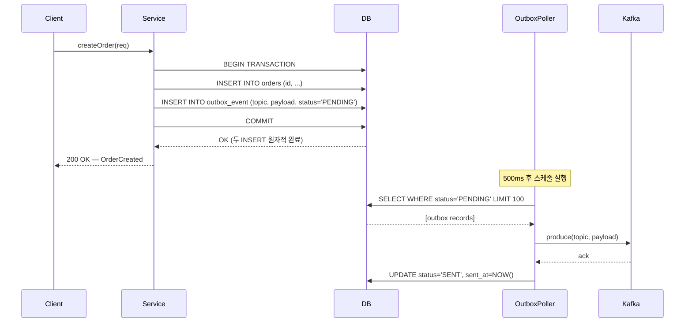

# Transactional Outbox 패턴

## 1. 개요

마이크로서비스가 DB에 상태를 저장하고 Kafka에 이벤트를 발행하는 두 작업은 서로 다른 리소스를 건드린다.
DB 트랜잭션과 Kafka produce는 하나의 원자적 단위로 묶을 수 없기 때문에, 순서대로 실행하면 둘 사이에서 실패가 발생할 때 일관성이 깨진다.

DB 커밋 후 Kafka produce를 직접 호출하는 방식은 두 가지 위험을 가진다.
첫째, DB는 커밋됐지만 Kafka produce가 네트워크 오류로 실패하면 이벤트가 영구 유실된다.
둘째, Kafka produce가 먼저 성공했지만 DB 커밋이 롤백되면 존재하지 않는 상태에 대한 이벤트가 발행된다.
어느 쪽이든 downstream consumer는 비즈니스 실제 상태와 다른 이벤트를 처리하게 된다.

Kafka produce를 트랜잭션 이전에 호출하는 방식도 마찬가지다. produce 성공 후 DB 커밋이 실패하면 이벤트는 이미 전송됐고 취소할 수 없다. Kafka는 메시지를 보낸 순간부터 consumer가 읽을 수 있는 구조이기 때문에 "발행 취소"가 불가능하다.

Transactional Outbox는 이 딜레마를 "Kafka 발행 자체를 DB 트랜잭션의 일부로 끌어들이는" 방식으로 해결한다.
이벤트를 Kafka에 직접 보내는 대신, 동일한 DB의 `outbox_event` 테이블에 이벤트 레코드를 삽입한다.
도메인 엔티티 저장과 outbox 레코드 삽입이 같은 `BEGIN...COMMIT` 안에서 일어나므로, 두 쓰기는 원자적으로 성공하거나 실패한다.
이후 별도 프로세스(Poller 또는 CDC 커넥터)가 `PENDING` 상태의 레코드를 읽어 Kafka에 전달하고 상태를 `SENT`로 갱신한다.

핵심 보장은 **at-least-once delivery**다. 폴러가 produce에 실패해도 outbox 레코드가 `PENDING`으로 남아 있어 재시도할 수 있다.
중복 발행 가능성은 존재하지만, 이벤트 유실보다 중복이 훨씬 다루기 쉽다. Consumer가 멱등성을 갖추면 중복은 무해하다.

---

## 2. 이 프로젝트에서의 적용

### outbox_event 테이블 구조

```sql
CREATE TABLE outbox_event (
    id          BIGSERIAL PRIMARY KEY,
    topic       VARCHAR(255) NOT NULL,   -- Kafka 토픽명
    payload     TEXT         NOT NULL,   -- JSON 직렬화 이벤트
    status      VARCHAR(20)  NOT NULL DEFAULT 'PENDING',
    created_at  TIMESTAMP    NOT NULL DEFAULT NOW(),
    sent_at     TIMESTAMP
);

-- 폴러가 사용하는 인덱스: status='PENDING' 조건 + id 정렬
CREATE INDEX idx_outbox_status_id ON outbox_event(status, id);
```

`status` 컬럼은 `PENDING` / `SENT` 두 값만 가진다.
`SENT`로 전환된 레코드는 폴러의 조회 범위에서 제외되므로 시간이 지날수록 인덱스 스캔 범위가 좁아진다.
`sent_at` 컬럼은 운영 모니터링에서 "평균 발행 지연"을 계산하는 데 활용한다.

### DB 트랜잭션 내 outbox 삽입

비즈니스 로직을 담은 서비스 메서드는 `@Transactional`로 감싸져 있다.
`eventPublisher.publish()` 호출은 Kafka와 직접 통신하지 않는다. 이미 열려 있는 트랜잭션에 참여해 `outbox_event` 테이블에 `INSERT`만 수행한다.
따라서 Kafka가 다운돼 있어도, 브로커 연결 설정이 잘못됐어도 비즈니스 로직은 정상 완료된다.

```java
@Transactional
public Order createOrder(CreateOrderRequest req) {
    Order order = orderRepository.save(new Order(req)); // 도메인 저장
    eventPublisher.publish("order.created", new OrderCreatedEvent(order)); // outbox INSERT
    return order;
    // 여기서 커밋 — order + outbox_event 동시 커밋
}
```

### OutboxPoller 동작

`OutboxPoller`는 `@Scheduled(fixedDelay = 500)`으로 500ms마다 실행된다. 폴링 주기를 500ms로 설정한 이유는 학습 목적에서 지연을 체감할 수 있는 범위로 두었기 때문이며, 프로덕션에서는 50~100ms가 더 일반적이다.

폴러의 실행 흐름은 다음과 같다.

1. `SELECT * FROM outbox_event WHERE status = 'PENDING' ORDER BY id LIMIT 100` 으로 미발행 레코드를 배치로 조회한다. `LIMIT`을 두는 이유는 장애 후 재시작 시 밀린 레코드가 많을 때 폴러가 한 번에 모든 레코드를 메모리에 올리지 않도록 하기 위해서다.
2. 각 레코드를 Kafka에 produce한다. `KafkaTemplate.send().get()`으로 동기 확인해 브로커 ack를 보장한다.
3. produce 성공 시 `UPDATE outbox_event SET status = 'SENT', sent_at = NOW() WHERE id = ?`를 실행한다.
4. produce 실패 시 레코드를 `PENDING`으로 유지하고 예외를 로깅한 뒤 다음 주기에 재시도한다.

다중 인스턴스 환경이라면 같은 레코드를 두 폴러가 동시에 처리하는 중복 produce 위험이 있다. 이 경우 `SELECT ... FOR UPDATE SKIP LOCKED`를 사용해 한 폴러가 잠금을 잡은 레코드를 다른 폴러가 건너뛰도록 해야 한다.

### eventPublisher.publish() 내부 동작

```java
@Component
@RequiredArgsConstructor
public class EventPublisher {
    private final OutboxEventRepository outboxRepo;
    private final ObjectMapper objectMapper;

    public void publish(String topic, Object event) {
        String payload = objectMapper.writeValueAsString(event);
        outboxRepo.save(OutboxEvent.pending(topic, payload)); // DB INSERT만 수행
        // Kafka 호출 없음 — 폴러가 별도로 처리
    }
}
```

`publish()`가 반환되는 시점에 Kafka 발행은 아직 일어나지 않았다. 호출자는 이 사실을 알 필요 없다. "이벤트를 반드시 발행하겠다는 약속"만 DB에 기록된 것이다.

---

## 3. 코드 흐름



`Service`와 `Poller`는 완전히 분리된 실행 흐름이다.
Client는 Kafka 발행 결과를 기다리지 않고 DB 커밋 직후 응답을 받는다.
Kafka가 일시적으로 다운돼 있어도 Client 요청은 성공하고, Kafka 복구 후 폴러가 밀린 레코드를 순서대로 처리한다.

---

## 4. 폴링 vs CDC 비교

두 방식 모두 outbox 테이블에 기록된 이벤트를 Kafka로 전달한다는 목적은 같다. 다른 점은 "어떻게 변경을 감지하는가"다.

**폴링(Polling)** 은 앱 안에서 주기적으로 `SELECT`를 실행한다. 추가 인프라 없이 스프링 스케줄러만으로 구현 가능하며, 디버깅과 운영이 단순하다. 단점은 폴링 주기만큼 고정 지연이 발생하고, 트래픽이 없는 시간대에도 주기적으로 DB 쿼리가 실행된다는 것이다.

**CDC(Change Data Capture)** 는 DB의 WAL(Write-Ahead Log)을 직접 스트리밍한다. Debezium 같은 커넥터가 WAL에서 `outbox_event` 테이블의 INSERT를 감지해 Kafka에 바로 전송하므로 지연이 수십 ms 이내다. `status` 컬럼을 `SENT`로 갱신할 필요도 없다. 대신 Kafka Connect + Debezium 클러스터를 별도로 운영해야 하고, DB의 WAL 보존 설정도 조정해야 한다.

| 구분 | 폴링 | CDC |
|------|------|-----|
| 구현 복잡도 | 낮음 (스케줄러 + SELECT) | 높음 (Debezium + Kafka Connect) |
| 지연 | 폴링 주기 고정 (이 프로젝트 500ms) | 거의 실시간 (수십 ms) |
| DB 부하 | 주기적 SELECT 부하 발생 | WAL 읽기 (SELECT 없음) |
| 운영 복잡도 | 앱 내 관리, 단순 | 외부 커넥터 운영 필요 |
| 다중 인스턴스 | SKIP LOCKED 필요 | 커넥터가 단일 진입점 |
| 적합한 규모 | 초당 수십 건 이하 | 초당 수백 건 이상 |

이 프로젝트는 패턴 학습 목적이므로 폴링 방식을 사용한다. 운영 부담 없이 핵심 개념을 빠르게 검증하기 좋기 때문이다.

---

## 5. 트레이드오프

**지연(Latency)**: 비즈니스 이벤트가 Kafka에 도달하는 최소 시간은 폴링 주기(500ms)에 produce 왕복 시간을 더한 값이다. 이 지연은 결정론적이다. 폴링 주기를 짧게 설정하면 지연은 줄지만 DB 쿼리 빈도가 올라간다. 실시간 요구사항이 강한 서비스에서는 폴링이 구조적 한계를 갖는다.

**DB 부하**: 폴러가 500ms마다 SELECT를 실행하므로 이벤트가 없는 시간에도 DB 부하가 지속된다. `(status, id)` 복합 인덱스가 없으면 전체 테이블 스캔이 발생할 수 있다. SENT 레코드가 계속 쌓이면 테이블이 커져 인덱스 효율이 낮아지므로, 오래된 SENT 레코드를 주기적으로 아카이빙하거나 삭제하는 정리 작업이 필요하다.

**중복 발행 가능성**: produce는 성공했지만 `UPDATE status='SENT'`가 실패하면, 다음 폴링 주기에 같은 레코드를 다시 produce한다. Consumer는 반드시 멱등성을 갖춰야 한다. 가장 간단한 방법은 `outbox_event.id`를 Kafka 메시지 헤더에 포함해 Consumer가 처리 이력을 확인하는 것이다.

**운영 단순성**: 폴링 방식의 진짜 장점은 별도 인프라 없이 앱 하나로 at-least-once 발행 보장을 구현할 수 있다는 점이다. CDC 인프라를 운영할 역량이나 필요성이 생기기 전까지는 폴링이 합리적이고 충분한 선택이다. 먼저 폴링으로 패턴을 이해하고, 트래픽이 늘면 CDC로 전환하는 점진적 접근이 권장된다.
