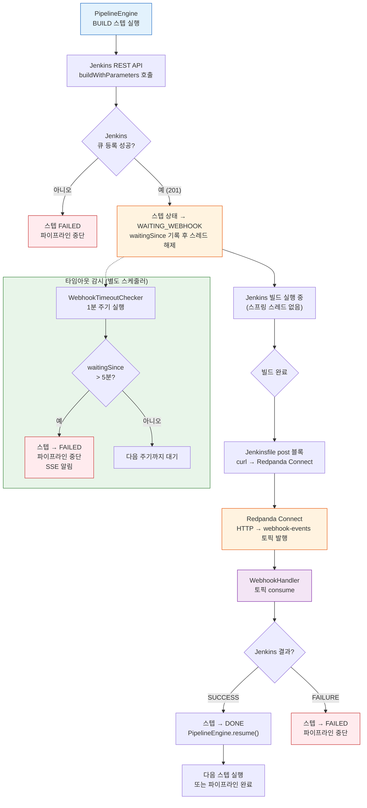

# Break-and-Resume 패턴 (Webhook Callback)

## 1. 개요 — 왜 폴링 대신 이벤트 기반인가

외부 시스템(Jenkins 같은 CI 서버)에 작업을 위임할 때 가장 단순한 방법은 폴링이다. 주기적으로 "끝났어?" 라고 물어보는 방식인데, 이는 세 가지 문제를 만든다.

첫째, **스레드 블로킹**이다. Jenkins 빌드는 수십 초에서 수 분까지 걸린다. 폴링 루프를 스레드 안에서 돌리면 그 스레드는 CPU도 쓰지 않은 채 잠만 자면서 서버 리소스를 점유한다. 동시에 100개의 파이프라인이 실행 중이라면 100개 스레드가 전부 잠든 상태로 대기한다.

둘째, **불필요한 API 호출**이다. 빌드가 2분 걸리는데 5초마다 폴링하면 24번의 요청 중 23번은 "아직 안 끝났음"을 확인하는 데 낭비된다. Jenkins 서버에 부하를 주고, 네트워크 비용이 발생한다.

셋째, **반응 지연**이다. 빌드가 완료된 순간과 서버가 그 사실을 아는 순간 사이에 최대 폴링 간격만큼의 지연이 생긴다.

**Break-and-Resume 패턴**은 이 문제를 역전시킨다. "끝나면 나한테 알려줘"라고 요청하고 스레드를 해제한다. Jenkins가 완료되는 시점에 webhook을 보내면 그때 다시 파이프라인 실행을 재개한다. 두 번의 실행 사이에 서버 측 스레드는 완전히 자유롭다.

---

## 2. 이 프로젝트에서의 적용

### PipelineEngine — 빌드 트리거와 스레드 해제

`PipelineEngine`이 `BUILD` 스텝에 도달하면 Jenkins REST API를 호출해 빌드를 시작한다. 이 호출은 fire-and-forget이다. Jenkins가 큐에 빌드를 등록했다는 응답(201 Created)을 받는 순간 엔진은 다음을 수행하고 메서드를 반환한다.

```
1. 현재 스텝 상태를 WAITING_WEBHOOK으로 DB에 저장
2. 관련 컨텍스트(ticketId, stepId, 타임아웃 기한)를 DB에 기록
3. 스레드 해제 (return)
```

이 시점에서 파이프라인은 "일시 정지" 상태다. 스레드는 없지만 DB에 상태가 보존되어 있으므로 언제든 재개할 수 있다.

### Jenkins → Redpanda Connect → Kafka

Jenkins의 `Jenkinsfile` 안에는 빌드 완료 후 webhook을 전송하는 `post` 블록이 있다.

```groovy
post {
    always {
        script {
            def result = currentBuild.result ?: 'SUCCESS'
            sh """
                curl -s -X POST http://redpanda-connect:4197/webhook \
                  -H 'Content-Type: application/json' \
                  -d '{"ticketId":"${params.TICKET_ID}","result":"${result}"}'
            """
        }
    }
}
```

curl 요청은 Redpanda Connect의 HTTP 입력 엔드포인트로 전달된다. Redpanda Connect는 HTTP 요청을 `webhook-events` Kafka 토픽으로 변환해 발행한다. 이 변환은 설정만으로 동작하며 별도 애플리케이션 코드가 필요 없다.

### WebhookHandler — Kafka 소비와 파이프라인 재개

`WebhookHandler`는 `webhook-events` 토픽을 구독하는 Kafka 컨슈머다. 메시지를 수신하면 다음 순서로 처리한다.

```
1. ticketId로 WAITING_WEBHOOK 상태의 스텝을 조회
2. Jenkins 결과(SUCCESS/FAILURE)를 스텝 상태로 변환
3. 스텝 상태를 DONE 또는 FAILED로 업데이트
4. 다음 스텝이 있으면 PipelineEngine.resume(ticketId) 호출
```

`resume()` 호출이 있어야 비로소 파이프라인이 다시 앞으로 나아간다. 이 구조 덕분에 Jenkins와 Spring Boot 사이의 결합은 "webhook URL 하나"로 최소화된다.

### WebhookTimeoutChecker — 5분 타임아웃 보호

webhook이 도착하지 않는 상황은 반드시 처리해야 한다. Jenkins 서버가 다운되거나 네트워크 오류로 curl이 실패하면 파이프라인은 영원히 WAITING_WEBHOOK 상태에 머문다.

`WebhookTimeoutChecker`는 스케줄러로 동작한다. 1분마다 DB를 조회해 `waitingSince` 시각이 5분을 초과한 WAITING_WEBHOOK 스텝을 찾고, 해당 스텝과 파이프라인 전체를 FAILED 상태로 전환한다. SSE로 클라이언트에게 타임아웃 실패 이벤트가 전송되고 스트림이 종료된다.

---

## 3. 코드 흐름



흐름에서 핵심은 `E` 박스 이후다. 스프링 스레드는 WAITING_WEBHOOK을 저장하고 즉시 반환한다. Jenkins 빌드가 진행되는 동안(수십 초~수 분) 서버 측에서 이 파이프라인을 위해 점유된 스레드는 없다. webhook이 도착하는 순간 Kafka 컨슈머 스레드가 한 번 더 깨어나 파이프라인을 재개한다.

---

## 4. 타임아웃 처리

타임아웃 감시는 단순히 "5분 후 실패"가 아니라 세 가지 상황을 커버한다.

**Jenkins 서버 다운.** Jenkins가 아예 응답하지 않으면 빌드 트리거 단계(C 분기)에서 이미 실패 처리된다. 타임아웃 감시 대상이 아니다.

**빌드는 시작됐지만 webhook 전송 실패.** curl 명령 자체가 실패하거나 Redpanda Connect가 일시 다운된 경우다. 빌드는 성공했으나 서버는 그 사실을 모른다. 5분 타임아웃이 이 상황을 처리한다.

**빌드 시간이 5분을 초과하는 경우.** 정상적인 긴 빌드도 타임아웃 대상이 될 수 있다. 이를 방지하려면 `WebhookTimeoutChecker`의 임계값을 빌드 유형별로 다르게 설정하거나, 스텝 생성 시 예상 빌드 시간을 기반으로 개별 타임아웃 기한을 DB에 저장해야 한다.

타임아웃으로 FAILED 처리된 이후 webhook이 늦게 도착하는 경우도 있다. 이때 `WebhookHandler`는 이미 FAILED 상태가 된 스텝을 조회하고 처리를 건너뛴다. 상태 확인은 멱등성 보호의 핵심 게이트다.

---

## 5. 트레이드오프

**장점: 스레드 효율.** 폴링 방식 대비 파이프라인당 점유 스레드가 제로에 가깝다. 수백 개의 파이프라인이 WAITING_WEBHOOK 상태에 있어도 서버 리소스에 거의 영향이 없다.

**장점: 반응성.** Jenkins 빌드가 완료되는 즉시 webhook이 전송된다. 폴링 간격만큼의 지연 없이 SSE로 결과가 전달된다.

**단점: 외부 시스템 의존성.** Jenkins의 `post` 블록이 webhook을 보내도록 `Jenkinsfile`이 올바르게 작성되어 있어야 한다. Jenkins 관리자와의 협의가 필요하며, Jenkinsfile이 잘못되면 파이프라인이 항상 타임아웃으로 실패한다.

**단점: Redpanda Connect 가용성.** Jenkins와 Spring Boot 사이에 Redpanda Connect가 추가된다. Connect가 다운되면 webhook이 소실된다. Connect 재시작 후 재전송을 보장하려면 Jenkins 측에서 재시도 로직이 필요하다.

**단점: 디버깅 복잡도.** 실패 원인이 Jenkins 빌드 자체인지, curl 전송인지, Connect 변환인지, Kafka 소비인지 추적하려면 각 단계의 로그를 별도로 확인해야 한다. 분산 추적(correlationId를 webhook 페이로드에 포함)을 설계 초기부터 넣지 않으면 운영 시 원인 파악이 어렵다.

**판단 기준.** 빌드 시간이 짧고(30초 이내) 파이프라인 수가 적다면(동시 10개 이하) 폴링이 구현 단순성 면에서 낫다. 빌드가 길거나 파이프라인이 많아질 전망이라면 Break-and-Resume이 확장성과 리소스 효율 면에서 명확하게 우위다.
