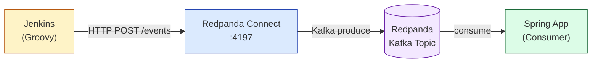

# 06. Redpanda Connect (HTTP → Kafka 브릿지)

## 1. 개요

Redpanda Connect는 외부 시스템이 Kafka 프로토콜을 직접 구현하지 않아도 이벤트를 토픽에 발행할 수 있게 해주는 데이터 파이프라인 도구다. HTTP, gRPC, 파일, AWS S3 등 다양한 입력 소스를 Kafka 토픽으로 연결하거나, 반대로 Kafka 토픽에서 데이터를 꺼내 외부 시스템으로 전달하는 역할을 한다.

**직접 Kafka produce와의 차이점:**

직접 produce 방식은 클라이언트가 Kafka 프로토콜(바이너리 TCP)을 구현한 라이브러리를 사용해야 한다. Java의 `KafkaProducer`, Go의 `franz-go` 같은 것들이 여기에 해당한다. 이 방식은 성능이 뛰어나지만, 해당 언어/환경에서 Kafka 클라이언트를 사용할 수 없을 때는 대안이 필요하다.

Redpanda Connect를 브릿지로 두면 클라이언트는 HTTP POST 한 번으로 끝난다. Kafka 클라이언트 설정, 재연결 로직, 파티션 전략 같은 복잡성은 Connect가 흡수한다.



## 2. 이 프로젝트에서의 적용

### 흐름

Jenkins 파이프라인이 빌드·배포 이벤트를 발생시키면 이를 Kafka 토픽으로 흘려보내야 한다. Jenkins는 Groovy 환경에서 실행되며, 공식 Kafka 클라이언트가 없다. `httpRequest` 스텝은 기본 제공되므로 HTTP POST로 이벤트를 보내는 것이 가장 자연스럽다.

Redpanda Connect가 `:4197` 포트에서 HTTP 요청을 받아 `ci-events` 토픽으로 전달한다. Spring 앱은 별도 webhook 엔드포인트를 구현할 필요 없이 기존 Kafka 컨슈머로 이벤트를 수신한다.

### Jenkins 파이프라인 예시

```groovy
// Jenkinsfile
post {
    always {
        script {
            def payload = """{
                "jobName": "${env.JOB_NAME}",
                "buildNumber": "${env.BUILD_NUMBER}",
                "result": "${currentBuild.result}",
                "timestamp": "${System.currentTimeMillis()}"
            }"""
            httpRequest(
                url: 'http://redpanda-connect:4197/events',
                httpMode: 'POST',
                contentType: 'APPLICATION_JSON',
                requestBody: payload
            )
        }
    }
}
```

### Spring 앱 측

Spring 앱은 Kafka 컨슈머만 구현하면 된다. Jenkins가 HTTP로 보내는지, Spring 앱이 직접 produce하는지는 관심사가 아니다.

```java
@KafkaListener(topics = "ci-events", groupId = "ci-monitor")
public void handleCiEvent(String message) {
    log.info("CI 이벤트 수신: {}", message);
    // 빌드 결과 처리
}
```

## 3. 설정 예시 (connect.yaml)

```yaml
# connect.yaml
input:
  http_server:
    address: "0.0.0.0:4197"
    path: "/events"
    allowed_verbs:
      - POST
    timeout: "5s"

pipeline:
  processors:
    - bloblang: |
        root = this
        root.received_at = now()

output:
  kafka_franz:
    seed_brokers:
      - "redpanda:9092"
    topic: "ci-events"
    compression: lz4
    batching:
      count: 10
      period: "100ms"
```

**핵심 필드 설명:**

- `http_server.address`: Connect가 리슨할 주소. 컨테이너 내부에서는 `0.0.0.0`으로 바인딩해야 외부에서 접근 가능하다.
- `http_server.path`: 요청을 받을 경로. 여러 파이프라인을 분리하고 싶으면 path별로 별도 yaml을 구성한다.
- `pipeline.processors.bloblang`: Benthos/Connect의 변환 언어. 필드 추가, 필터링, 라우팅을 처리한다. 위 예시는 수신 시각을 메타데이터로 추가한다.
- `kafka_franz`: 순수 Go 구현의 Kafka 클라이언트를 사용한다. `sarama` 기반의 `kafka` output보다 성능이 좋고, Redpanda와의 호환성이 높다.
- `batching`: 소량의 메시지도 일정 개수나 시간이 차면 묶어서 produce해 처리량을 높인다.

### docker-compose 통합

```yaml
services:
  redpanda-connect:
    image: redpandadata/connect:latest
    ports:
      - "4197:4197"
    volumes:
      - ./connect.yaml:/connect.yaml
    command: run /connect.yaml
    depends_on:
      - redpanda
```

## 4. 왜 Connect인가?

Jenkins는 Kafka 클라이언트가 없다. 이것이 핵심 이유다.

Jenkins 파이프라인은 Groovy로 작성되며, JVM 위에서 실행되므로 이론상 Java Kafka 클라이언트를 사용할 수 있다. 하지만 Jenkins 플러그인 의존성 관리는 복잡하고, 파이프라인 스크립트에서 외부 라이브러리를 직접 추가하는 것은 권장되지 않는다. Jenkins 관리자가 클러스터 설정을 잠가두면 선택지가 더 좁아진다.

HTTP는 언어나 런타임에 관계없이 어디서나 사용할 수 있는 범용 프로토콜이다. `curl`, `httpRequest`, `fetch`, `requests` — 어떤 환경에서든 HTTP 클라이언트는 존재한다. Connect를 HTTP 엔드포인트로 노출하면 **모든 HTTP 가능 시스템이 Kafka 프로듀서가 된다.**

이 패턴은 GitHub Actions, GitLab CI, 배치 스크립트, 레거시 모노리스처럼 Kafka 클라이언트를 내장하기 어려운 시스템을 Kafka 생태계에 연결할 때 반복적으로 등장한다.

## 5. 트레이드오프

| 항목 | Connect 브릿지 방식 | 직접 Produce 방식 |
|------|-------------------|--------------------|
| 클라이언트 요구사항 | HTTP만 가능하면 충분 | Kafka 클라이언트 라이브러리 필수 |
| 레이턴시 | HTTP 왕복 + Kafka produce (2홉) | Kafka produce (1홉) |
| 신뢰성 | Connect 장애 시 이벤트 유실 가능 | 클라이언트가 직접 재시도 제어 |
| 운영 복잡도 | Connect 인스턴스 추가 관리 필요 | 클라이언트 라이브러리 버전 관리 |
| 변환/라우팅 | bloblang으로 파이프라인 내 처리 | 애플리케이션 코드에서 처리 |

**신뢰성 보완:** Connect가 Kafka에 write하기 전에 다운되면 HTTP 응답이 실패로 돌아오므로 Jenkins는 재시도할 수 있다. Connect가 Kafka write를 완료했지만 HTTP 응답 전에 다운되면 Jenkins는 실패로 인식하고 재시도하지만 이벤트는 이미 토픽에 있다. 이 중복을 방지하려면 이벤트에 고유 ID를 포함하고 컨슈머에서 멱등성을 보장해야 한다.

**언제 직접 produce를 써야 하나:** 클라이언트가 Java, Go, Python처럼 성숙한 Kafka 클라이언트가 있는 환경이고, 레이턴시가 중요하거나, 파티션 키 전략을 세밀하게 제어해야 한다면 직접 produce가 낫다. Connect는 "Kafka를 못 쓰는 외부 시스템을 연결할 때" 가장 빛을 발한다.
