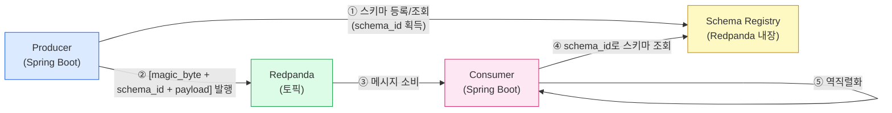

# 토픽/메시지 설계 (Avro 스키마)

## 1. 개요 — 왜 토픽 설계가 중요한가

토픽은 이벤트 브로커에서 데이터가 흐르는 경로이자 계약이다. 토픽 이름이 의미를 잃으면 어떤 컨슈머가 어떤 메시지를 읽어야 하는지 코드를 열지 않고는 알 수 없다. 파티션 수를 잘못 설정하면 순서 보장이 깨지거나 병렬 처리 효율이 떨어진다. 메시지 포맷에 스키마 규칙이 없으면 프로듀서 팀과 컨슈머 팀이 각자 다른 구조를 기대하는 상황이 생기고, 필드 하나를 바꿀 때마다 모든 컨슈머를 동시에 배포해야 하는 강결합이 발생한다.

이 문서는 Redpanda Playground 프로젝트가 6개 토픽을 어떤 규칙으로 설계했는지, 그리고 Avro 스키마와 Schema Registry가 그 계약을 어떻게 강제하는지 설명한다.

---

## 2. 토픽 네이밍 규칙

모든 토픽은 `playground.{domain}.{type}` 형식을 따른다.

| 토픽 | 도메인 | 타입 | 직렬화 |
|------|--------|------|--------|
| `playground.ticket.events` | ticket | events | Avro |
| `playground.pipeline.commands` | pipeline | commands | Avro |
| `playground.pipeline.events` | pipeline | events | Avro |
| `playground.webhook.inbound` | webhook | inbound | JSON |
| `playground.audit.events` | audit | events | Avro |
| `playground.dlq` | (공통) | - | - |

**프리픽스 `playground.`** 는 같은 Redpanda 클러스터에 여러 프로젝트가 공존할 때 토픽 간 충돌을 막는다. 개발/스테이징 환경에서 단일 클러스터를 공유하는 경우에도 `playground-dev.ticket.events`처럼 프리픽스만 바꿔 격리할 수 있어 네이밍 규칙을 지키는 것만으로 환경 분리가 가능하다.

**도메인 세그먼트**는 ArchUnit이 강제하는 도메인 경계와 일치한다. `ticket` 도메인 코드만 `playground.ticket.events`에 발행하고, `pipeline` 도메인 코드만 `playground.pipeline.*`을 소유한다. 이 규칙을 지키면 어떤 서비스가 어떤 토픽의 오너인지 항상 명확하다.

**타입 세그먼트**는 메시지의 성격을 구분한다. `events`는 "이미 일어난 사실"이므로 프로듀서가 결과에 책임을 지지 않는다. `commands`는 "수행해 달라는 요청"이므로 컨슈머가 처리 책임을 진다. `inbound`는 외부 시스템에서 들어온 원본 데이터로, 도메인 이벤트로 변환되기 전 단계임을 나타낸다.

### 도메인별 분리 이유

`pipeline.commands`와 `pipeline.events`를 하나의 토픽으로 합치면 컨슈머 그룹이 자신에게 불필요한 메시지를 필터링해야 한다. 필터링은 곧 불필요한 역직렬화 비용이고, 컨슈머 로직에 "내가 처리할 메시지인가?"를 판단하는 분기가 생긴다. 도메인과 타입으로 분리된 토픽은 컨슈머가 구독 시점에 이미 관심 데이터만 받도록 설계되어 있어 이 분기가 사라진다.

---

## 3. 파티션 전략

### 토픽별 파티션 수

| 토픽 | 파티션 수 | 이유 |
|------|-----------|------|
| `playground.ticket.events` | 3 | 티켓은 여러 ID가 독립적으로 생성되므로 병렬 처리 이득이 있다. 3개는 소규모 클러스터의 실용적 출발점이다. |
| `playground.pipeline.commands` | 3 | 파이프라인 커맨드는 `executionId` 단위로 순서가 보장되어야 하며, 동시에 여러 파이프라인이 독립 실행된다. |
| `playground.pipeline.events` | 3 | 커맨드 토픽과 동일한 `executionId` 키를 사용해 같은 실행의 이벤트가 같은 파티션에 쌓이도록 한다. |
| `playground.webhook.inbound` | 2 | 웹훅 수신량은 Jenkins 빌드 수와 비례하며 상대적으로 적다. Connect가 단순 포워딩만 하므로 2개로 충분하다. |
| `playground.audit.events` | 1 | 감사 이벤트는 발생 순서 자체가 감사의 의미를 가진다. 단일 파티션으로 전역 순서를 보장한다. |
| `playground.dlq` | 1 | Dead Letter Queue는 처리 실패 메시지를 모아두는 보조 토픽이다. 순차 분석을 위해 단일 파티션이 적합하다. |

### 파티션 키 선택

파티션 키는 "같은 키를 가진 메시지는 항상 같은 파티션으로"라는 규칙으로 순서를 보장한다. 잘못된 키를 선택하면 파티션이 불균등하게 채워지거나 순서 보장이 필요한 곳에서 순서가 깨진다.

- **`playground.ticket.events`**: `ticketId`를 키로 사용한다. 같은 티켓에 대한 이벤트 순서를 보장하면서도 서로 다른 티켓은 다른 파티션으로 분산된다.
- **`playground.pipeline.commands` / `playground.pipeline.events`**: `executionId`를 키로 사용한다. 하나의 파이프라인 실행(`executionId`)에 속한 커맨드와 이벤트가 단일 파티션에서 순서대로 처리되어야 SAGA 보상 로직이 올바르게 동작한다.
- **`playground.webhook.inbound`**: Jenkins 빌드 ID 또는 `executionId`를 키로 사용한다. 같은 빌드의 웹훅이 같은 컨슈머 인스턴스로 라우팅되어 `resumeAfterWebhook()` 처리가 일관성을 유지한다.
- **`playground.audit.events`**: 단일 파티션이므로 키가 순서에 영향을 주지 않는다. `resourceId`를 키로 설정해 특정 리소스의 감사 이력 조회 시 파티션 지역성을 활용할 수 있다.

---

## 4. Avro 스키마 설계

### EventMetadata — 공통 헤더

모든 Avro 이벤트는 `EventMetadata`를 첫 번째 필드로 포함한다. 공통 헤더를 별도 레코드로 분리한 이유는 컨슈머가 어떤 토픽의 메시지든 헤더 구조를 예측할 수 있어야 라우팅, 멱등성 체크, 분산 추적을 공통 로직으로 처리할 수 있기 때문이다.

```json
{
  "type": "record",
  "name": "EventMetadata",
  "namespace": "com.study.playground.avro.common",
  "fields": [
    {"name": "eventId",       "type": "string", "doc": "이벤트 고유 식별자 (UUID). CloudEvents ce-id에 대응."},
    {"name": "correlationId", "type": "string", "doc": "요청 추적용 ID. 멱등성 체크의 기준 키."},
    {"name": "eventType",     "type": "string", "doc": "이벤트 타입 문자열. 예: TICKET_CREATED"},
    {"name": "timestamp",     "type": {"type": "long", "logicalType": "timestamp-millis"}},
    {"name": "source",        "type": "string", "doc": "발행 서비스 식별자. 예: playground-api"}
  ]
}
```

각 필드의 역할은 다음과 같다.

- **`eventId`**: 이 이벤트 인스턴스의 고유 식별자다. 동일한 비즈니스 사건이 재시도로 두 번 발행되면 `eventId`는 달라지지만 `correlationId`는 같다.
- **`correlationId`**: 멱등성 체크의 기준이다. `processed_event` 테이블의 `(correlationId, eventType)` 복합 키가 이미 존재하면 중복 메시지로 판단해 처리를 건너뛴다.
- **`eventType`**: 이벤트 타입 문자열로, 컨슈머가 메시지 타입에 따라 핸들러를 선택할 때 사용한다.
- **`timestamp`**: `timestamp-millis` 논리 타입을 사용해 Avro가 long으로 직렬화하되 의미는 밀리초 타임스탬프임을 명시한다.
- **`source`**: 어떤 서비스가 발행했는지 식별한다. 멀티 서비스 환경에서 이벤트 출처 추적에 필수적이다.

### 도메인 이벤트 구조 예시

```json
// TicketCreatedEvent — playground.ticket.events
{
  "type": "record",
  "name": "TicketCreatedEvent",
  "namespace": "com.study.playground.avro.ticket",
  "fields": [
    {"name": "metadata",     "type": "com.study.playground.avro.common.EventMetadata"},
    {"name": "ticketId",     "type": "long"},
    {"name": "name",         "type": "string"},
    {"name": "sourceTypes",  "type": {"type": "array", "items": "com.study.playground.avro.common.SourceType"}}
  ]
}

// PipelineExecutionStartedEvent — playground.pipeline.events
{
  "type": "record",
  "name": "PipelineExecutionStartedEvent",
  "namespace": "com.study.playground.avro.pipeline",
  "fields": [
    {"name": "metadata",     "type": "com.study.playground.avro.common.EventMetadata"},
    {"name": "executionId",  "type": "string"},
    {"name": "ticketId",     "type": "long"},
    {"name": "steps",        "type": {"type": "array", "items": "string"}}
  ]
}
```

### 왜 JSON이 아닌 Avro인가

JSON은 사람이 읽기 쉽고 별도 도구 없이 파싱할 수 있다는 장점이 있다. 그러나 이벤트 브로커 환경에서는 세 가지 이유로 Avro가 더 적합하다.

**첫째, 스키마 진화(Schema Evolution)를 관리할 수 있다.** Avro는 `BACKWARD`, `FORWARD`, `FULL` 호환성 규칙을 Schema Registry에서 강제한다. 새 필드를 추가할 때 `default` 값을 제공하면 구버전 컨슈머가 새 메시지를 읽을 수 있고, 새 컨슈머가 구 메시지를 읽을 수도 있다. JSON이라면 이 규칙을 코드 리뷰와 팀 약속으로만 지켜야 한다.

**둘째, 직렬화 크기가 컴팩트하다.** JSON은 필드 이름을 매 메시지마다 문자열로 포함하지만, Avro는 필드 이름을 스키마 ID로 대체해 페이로드를 최소화한다. 토픽에 초당 수천 건의 이벤트가 쌓이는 환경에서 이 차이는 브로커 디스크와 네트워크 비용에 직접 영향을 준다.

**셋째, 컴파일 타임 타입 안전성을 제공한다.** Avro Gradle 플러그인이 `.avsc` 파일로부터 Java 클래스를 생성하므로, 프로듀서가 `ticketId` 필드에 `String`을 넣으면 컴파일 오류가 발생한다. JSON 기반이라면 이 오류가 런타임에서야 드러난다.

`playground.webhook.inbound`가 JSON을 유지하는 이유는 Redpanda Connect가 외부 Jenkins에서 받은 원본 HTTP 페이로드를 그대로 포워딩하기 때문이다. 외부 시스템의 JSON 구조를 Avro로 강제하려면 Connect 파이프라인에 변환 로직이 필요하고, 이는 Connect가 "전송만 담당"한다는 역할 분리 원칙에 위배된다. 원본을 보존하고 Spring 컨슈머가 도메인 이벤트로 변환하는 것이 올바른 경계다.

### Schema Registry 역할



Redpanda는 Schema Registry를 내장하므로 별도 컨테이너 없이 `http://localhost:8081`로 접근 가능하다. 프로듀서는 처음 메시지를 보낼 때 스키마를 등록하고 `schema_id`(정수)를 받는다. 이후 메시지 페이로드 앞에 5바이트(magic byte 1 + schema_id 4)를 붙여 발행한다. 컨슈머는 이 5바이트를 읽어 Schema Registry에서 스키마를 가져온 뒤 역직렬화한다. 스키마가 Registry에 없으면 역직렬화 자체가 실패하므로, 미등록 스키마로 발행하는 사고가 런타임에서 즉시 드러난다.

---

## 5. 메시지 보관 정책 (Retention)

보관 정책은 "컨슈머 장애 복구에 얼마나 여유를 줄 것인가"와 "디스크 비용" 사이의 트레이드오프다.

| 토픽 | 보관 기간 | 이유 |
|------|-----------|------|
| `playground.ticket.events` | 7일 | 티켓 생성 이벤트는 다운스트림 컨슈머가 재처리해야 할 경우를 대비해 일주일의 여유를 둔다. |
| `playground.pipeline.commands` | 1일 | 커맨드는 처리된 후 의미가 없다. 실행 이력은 DB에 있으므로 짧은 보관으로 충분하다. |
| `playground.pipeline.events` | 7일 | SSE 구독 전 발생한 이벤트를 재처리하거나 감사 목적으로 조회할 수 있도록 보관한다. |
| `playground.webhook.inbound` | 3일 | Jenkins 콜백은 재처리 가능성이 낮지만 디버깅을 위해 짧게 보관한다. |
| `playground.audit.events` | 30일 | 감사 이벤트는 규정 준수 목적으로 장기 보관이 필요하다. |
| `playground.dlq` | 14일 | 실패 메시지를 분석하고 수동 재처리하는 데 충분한 시간을 확보한다. |

Redpanda는 `retention.ms`(시간 기반)와 `retention.bytes`(크기 기반) 두 가지 정책을 지원하며, 둘 다 설정하면 먼저 도달하는 조건에 따라 삭제된다. 이 프로젝트는 학습 환경이므로 기간 기반만 설정한다. 프로덕션에서 `playground.audit.events`처럼 보관 기간이 긴 토픽은 크기 상한도 함께 설정해 디스크 폭발을 방지해야 한다.

---

## 6. 주의사항 — 스키마 변경 시 호환성

스키마를 변경할 때 호환성 규칙을 위반하면 컨슈머가 역직렬화에 실패하고 메시지가 DLQ로 이동한다. Schema Registry의 호환성 모드는 기본적으로 `BACKWARD`이며, 이 모드에서 허용되는 변경과 금지되는 변경은 다음과 같다.

**허용되는 변경 (BACKWARD 호환)**
- `default` 값을 가진 새 필드 추가. 구버전 컨슈머는 이 필드를 무시하고, 신버전 컨슈머는 default로 채운다.
- 기존 필드에 `null` union 추가. `"type": "string"` → `"type": ["null", "string"]`

**금지되는 변경**
- 기존 필드 삭제. 구버전 메시지를 읽는 컨슈머가 해당 필드를 찾지 못한다.
- `default` 없는 새 필드 추가. 구버전 메시지에 해당 필드가 없으므로 역직렬화 실패.
- 필드 타입 변경 (`string` → `long`). 이미 발행된 메시지의 바이트 구조가 달라진다.
- 필드 이름 변경. Avro는 필드를 이름으로 매핑하므로 이름이 달라지면 새 필드로 인식된다.

**브랜치별 Schema Registry 전략**: `feature` 브랜치에서는 `testCompatibility` API로 호환성 검사만 수행하고 실제 등록은 하지 않는다. `develop`/`main` 브랜치 빌드 시에만 Schema Registry에 등록한다. 이 규칙은 실험적 스키마 변경이 공유 Registry를 오염시키는 것을 방지한다.

---

## 참고

- `src/main/avro/` — 전체 `.avsc` 스키마 파일
- `docs/patterns/03-transactional-outbox.md` — 이벤트 발행 원자성 보장
- `PROJECT_SPEC.md` — 토픽 목록 및 도메인 격리 규칙
