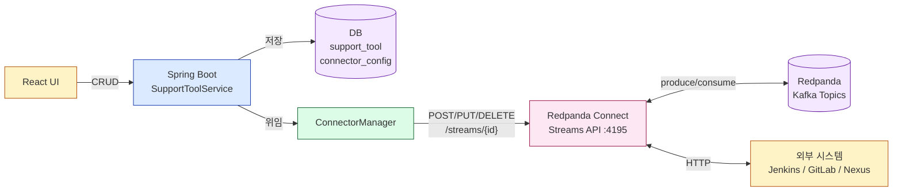
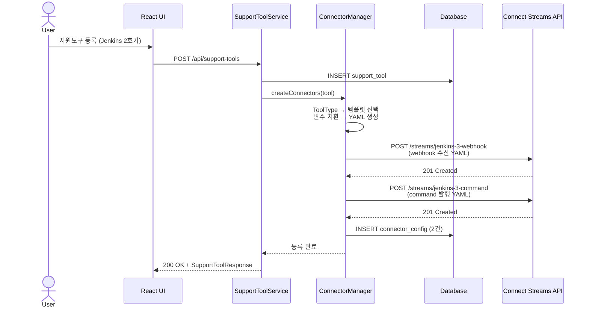
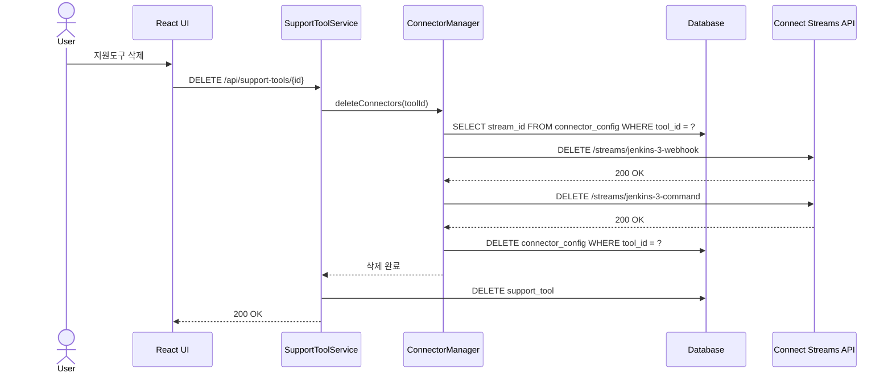
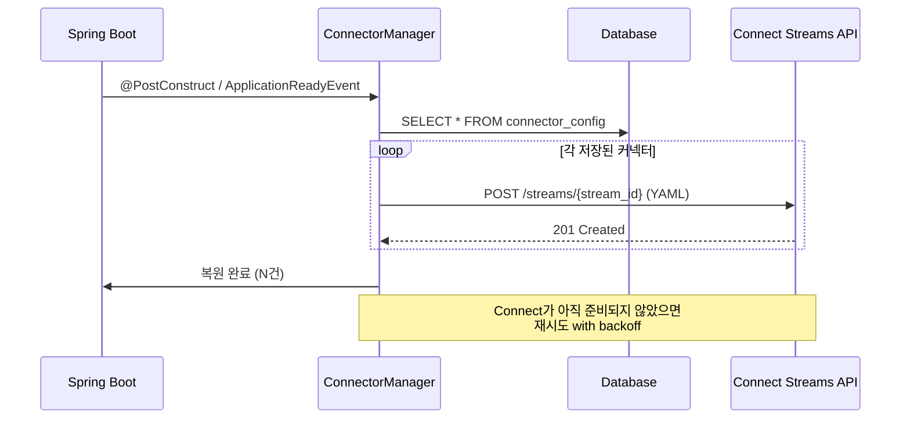

# 동적 커넥터 관리 패턴

> **[DEPRECATED]** 이 문서는 더 이상 사용되지 않는 Redpanda Connect 기반 아키텍처를 설명한다. 현재는 `JenkinsCommandConsumer`가 `commands.jenkins` 토픽에서 직접 소비하여 Jenkins REST API를 호출하고, Jenkins가 `rpk` CLI로 `webhook.inbound` 토픽에 직접 produce한다. Connect Streams API를 통한 동적 커넥터 관리 기능은 제거되었다.

## 1. 개요

Redpanda Connect를 Streams 모드로 운영하면 여러 파이프라인을 하나의 프로세스에서 관리할 수 있다. 현재 이 프로젝트는 3개의 정적 YAML 파일(`jenkins-webhook`, `gitlab-webhook`, `jenkins-command`)을 docker-compose 기동 시 로드하는 방식으로 동작한다. 새로운 외부 도구(Nexus, ArgoCD 등)를 추가하려면 YAML 파일을 수동으로 작성하고 컨테이너를 재기동해야 한다.

문제는 지원도구 관리(`SupportToolService`)와 커넥터 관리가 분리되어 있다는 점이다. UI에서 Jenkins 인스턴스를 등록해도 해당 인스턴스의 webhook 수신 파이프라인이나 command 발행 파이프라인이 자동으로 생성되지 않는다. 운영자가 YAML을 직접 작성하고, docker-compose를 재기동하는 수동 과정이 개입한다.

동적 커넥터 관리 패턴은 이 간극을 메운다. 지원도구 CRUD 이벤트에 연동하여 Connect Streams REST API로 커넥터를 런타임에 생성·수정·삭제하고, DB에 설정을 영속화하여 재시작 시에도 복원하는 구조다.



---

## 2. 현재 구조

### 정적 파이프라인 3개

| 파일 | 방향 | 역할 |
|------|------|------|
| `jenkins-webhook.yaml` | HTTP → Kafka | Jenkins webhook을 `:4195/jenkins-webhook/webhook/jenkins`로 수신하여 `playground.webhook.inbound` 토픽에 발행 |
| `gitlab-webhook.yaml` | HTTP → Kafka | GitLab webhook을 `:4195/gitlab-webhook/webhook/gitlab`로 수신하여 같은 토픽에 발행 |
| `jenkins-command.yaml` | Kafka → HTTP | `playground.pipeline.commands` 토픽에서 `JENKINS_BUILD_COMMAND` 이벤트를 소비하여 Jenkins REST API로 빌드 트리거 |

이 3개는 docker-compose에서 볼륨 마운트(`/etc/connect/*.yaml`)로 Streams 모드에 로드된다. 파일 기반 스트림이므로 REST API로 삭제할 수 없고, 컨테이너 재시작 후에도 항상 존재한다.

### 지원도구 CRUD

`SupportToolService`는 DB 테이블(`support_tool`)을 통해 외부 도구의 연결 정보(URL, 인증, 타입)를 관리한다. `testConnection()`으로 헬스체크까지 지원하지만, 커넥터 생성과는 연동되지 않는다. 도구를 등록하는 것과 그 도구의 파이프라인을 생성하는 것이 별개 작업인 셈이다.

---

## 3. 동적 관리 설계

### 핵심 아이디어

지원도구 등록 시점에 해당 도구 유형(`ToolType`)에 맞는 YAML 템플릿을 채워 Connect Streams REST API로 등록한다. 삭제 시점에는 API로 스트림을 제거한다. 설정은 DB에 영속화하여 애플리케이션 재시작 시 일괄 복원한다.

### ConnectorManager 역할

`SupportToolService`와 Connect Streams API 사이를 중재하는 컴포넌트다. 직접적인 HTTP 호출 로직을 캡슐화하여 `SupportToolService`가 커넥터 관리 상세를 알 필요 없게 한다.

```
SupportToolService  ──→  ConnectorManager  ──→  Connect Streams API
       │                       │
       └── support_tool ──────└── connector_config (DB)
```

### YAML 템플릿 기반 생성

커넥터 유형별로 YAML 템플릿을 정의하고, 지원도구의 연결 정보(URL, 인증, 토픽명)를 주입하여 완성된 YAML을 만든다. 템플릿은 코드 내 상수 또는 리소스 파일로 관리한다.

변수 치환 대상:

| 변수 | 출처 | 예시 |
|------|------|------|
| `${tool.url}` | SupportTool.url | `http://jenkins:8080` |
| `${tool.username}` | SupportTool.username | `admin` |
| `${tool.credential}` | SupportTool.credential (복호화) | API 토큰 |
| `${tool.id}` | SupportTool.id | `3` |
| `${webhook.path}` | ToolType 기반 생성 | `/webhook/jenkins-3` |

### 영속화 전략

Connect Streams REST API로 등록한 스트림은 컨테이너 재시작 시 소멸한다. 이를 해결하기 위해 `connector_config` 테이블에 스트림 ID와 YAML 설정을 저장한다.

```sql
-- V9__create_connector_config.sql
CREATE TABLE connector_config (
    id          BIGSERIAL PRIMARY KEY,
    stream_id   VARCHAR(100) UNIQUE NOT NULL,  -- Connect 스트림 ID (e.g. jenkins-3-webhook)
    tool_id     BIGINT NOT NULL,               -- support_tool FK
    yaml_config TEXT NOT NULL,                  -- 변수 치환 완료된 YAML
    direction   VARCHAR(20) NOT NULL,           -- INBOUND / OUTBOUND
    created_at  TIMESTAMP NOT NULL DEFAULT NOW(),
    FOREIGN KEY (tool_id) REFERENCES support_tool(id) ON DELETE CASCADE
);
```

---

## 4. 코드 흐름

### 등록 흐름



스트림 ID는 `{toolType}-{toolId}-{direction}` 형식으로 생성한다(예: `jenkins-3-webhook`, `jenkins-3-command`). 파일 기반 스트림과 이름이 충돌하지 않도록 도구 ID를 포함한다.

### 삭제 흐름



### 기동 시 복원 흐름



Connect 컨테이너가 Spring Boot보다 늦게 기동될 수 있으므로, 복원 로직은 지수 백오프 재시도를 포함해야 한다.

---

## 5. 커넥터 유형별 YAML 템플릿

### Webhook 수신 (HTTP → Kafka)

Jenkins, GitLab, Nexus 등 외부 시스템이 webhook을 보낼 때 수신하는 파이프라인이다. 기존 `jenkins-webhook.yaml`과 동일한 구조에서 경로와 소스 식별자만 달라진다.

```yaml
# 템플릿: webhook-inbound
input:
  http_server:
    path: /webhook/${tool.type}-${tool.id}
    allowed_verbs:
      - POST

pipeline:
  processors:
    - mapping: |
        root.webhookSource = "${tool.type}"
        root.toolId = ${tool.id}
        root.payload = content().string()
        root.headers = @
        root.receivedAt = now()

output:
  kafka_franz:
    seed_brokers:
      - redpanda:9092
    topic: playground.webhook.inbound
    key: ${! json("webhookSource") }
```

Streams 모드에서 `http_server`의 `address`는 무시되고 공유 포트(4195)에 등록되므로, `path`만 고유하면 충돌하지 않는다.

### Command 발행 (Kafka → HTTP)

Spring 앱이 Kafka에 발행한 command를 소비하여 외부 시스템 REST API를 호출하는 파이프라인이다. ToolType별로 HTTP 요청 형식이 달라지므로 템플릿도 분기된다.

**Jenkins Command:**

```yaml
# 템플릿: jenkins-command
input:
  kafka_franz:
    seed_brokers:
      - redpanda:9092
    topics:
      - playground.pipeline.commands
    consumer_group: connect-${tool.type}-${tool.id}-command
    start_from_oldest: false

pipeline:
  processors:
    - mapping: |
        let event_type = @eventType.string()
        let target_tool = @targetToolId.string()
        root = if $event_type != "JENKINS_BUILD_COMMAND" || $target_tool != "${tool.id}" {
          deleted()
        } else { this }
    - mapping: |
        let job = this.jobName
        let query = this.params.key_values().map_each(kv -> "%s=%s".format(kv.key, kv.value)).join("&")
        meta jenkins_path = "/job/%s/buildWithParameters?%s".format($job, $query)
        root = ""

output:
  http_client:
    url: "${tool.url}${! meta(\"jenkins_path\") }"
    verb: POST
    headers:
      Content-Type: application/x-www-form-urlencoded
    basic_auth:
      enabled: true
      username: "${tool.username}"
      password: "${tool.credential}"
    retries: 3
    retry_period: "5s"
```

정적 `jenkins-command.yaml`과의 차이점은 consumer group에 도구 ID를 포함하여 격리하고, `targetToolId` 헤더로 특정 도구에만 반응하도록 필터링한다는 것이다. 여러 Jenkins 인스턴스가 동일 토픽을 소비하더라도 각자 자기 메시지만 처리한다.

**GitLab Command:**

```yaml
# 템플릿: gitlab-command
input:
  kafka_franz:
    seed_brokers:
      - redpanda:9092
    topics:
      - playground.pipeline.commands
    consumer_group: connect-gitlab-${tool.id}-command
    start_from_oldest: false

pipeline:
  processors:
    - mapping: |
        let event_type = @eventType.string()
        let target_tool = @targetToolId.string()
        root = if $event_type != "GITLAB_PIPELINE_COMMAND" || $target_tool != "${tool.id}" {
          deleted()
        } else { this }

output:
  http_client:
    url: "${tool.url}/api/v4/projects/${! this.projectId }/pipeline"
    verb: POST
    headers:
      Content-Type: application/json
      Private-Token: "${tool.credential}"
    retries: 3
```

**Nexus Command:**

```yaml
# 템플릿: nexus-command (아티팩트 조회 트리거)
input:
  kafka_franz:
    seed_brokers:
      - redpanda:9092
    topics:
      - playground.pipeline.commands
    consumer_group: connect-nexus-${tool.id}-command
    start_from_oldest: false

pipeline:
  processors:
    - mapping: |
        let event_type = @eventType.string()
        let target_tool = @targetToolId.string()
        root = if $event_type != "NEXUS_SEARCH_COMMAND" || $target_tool != "${tool.id}" {
          deleted()
        } else { this }

output:
  http_client:
    url: "${tool.url}/service/rest/v1/search?repository=${! this.repository }&name=${! this.componentName }"
    verb: GET
    headers:
      Accept: application/json
    basic_auth:
      enabled: true
      username: "${tool.username}"
      password: "${tool.credential}"
```

---

## 6. 트레이드오프

### 정적 vs 동적

| 항목 | 정적 (파일 기반) | 동적 (API 기반) |
|------|-----------------|----------------|
| 설정 관리 | YAML 파일 + docker-compose | DB + REST API |
| 추가/변경 | 파일 수정 → 재기동 | API 호출 → 즉시 반영 |
| 영속성 | 파일이므로 자연스럽게 영속 | 휘발성 — DB 영속화 필요 |
| 삭제 보호 | API로 삭제 불가 (안전) | API로 즉시 삭제 가능 |
| 버전 관리 | Git 추적 가능 | DB 레코드 (Git 외부) |
| 적합한 경우 | 변하지 않는 기본 파이프라인 | 사용자가 런타임에 추가하는 파이프라인 |

### 혼용 전략

두 방식을 배타적으로 사용할 필요는 없다. 이 프로젝트에서 권장하는 전략은 다음과 같다.

**파일 기반 (기본):** 프로젝트에 내장된 기본 도구의 파이프라인. 현재의 3개 YAML이 여기에 해당한다. docker-compose와 함께 항상 존재하며, Git으로 버전 관리된다. 이 파이프라인은 "프로젝트가 동작하기 위한 최소 인프라"에 해당하므로 정적으로 유지하는 것이 안전하다.

**API 기반 (동적):** 사용자가 UI에서 추가하는 도구의 파이프라인. `SupportToolService.create()` 시점에 `ConnectorManager`가 Connect API로 등록하고, DB에 설정을 저장한다. 컨테이너 재시작 시 `@PostConstruct`에서 DB를 읽어 복원한다.

두 방식이 같은 토픽을 사용할 수 있다. webhook 수신 파이프라인은 모두 `playground.webhook.inbound`에 발행하고, `webhookSource` 필드로 출처를 구분한다. command 파이프라인은 모두 `playground.pipeline.commands`에서 소비하되, `eventType`과 `targetToolId` 헤더로 자기 메시지만 필터링한다.

### 주의사항

1. **포트 공유**: Streams 모드에서 동적으로 추가된 `http_server` input도 공유 포트(4195)에 등록된다. path가 겹치면 기존 스트림이 덮어씌워지므로 path에 도구 ID를 포함하여 고유성을 보장한다.

2. **인증 정보 노출**: YAML 템플릿에 credential이 평문으로 들어간다. Connect Streams API의 `GET /streams/{id}`로 설정을 조회하면 인증 정보가 노출될 수 있다. Connect API 접근을 내부 네트워크로 제한하거나, Connect의 환경변수 참조(`${CREDENTIAL}`) 방식을 사용하는 것을 고려해야 한다.

3. **복원 순서**: Spring Boot가 Connect보다 먼저 기동되면 복원 API 호출이 실패한다. `ApplicationReadyEvent` + 재시도 로직(지수 백오프, 최대 5회)으로 대응한다.

4. **Dry-run 검증**: 동적 등록 전 `POST /streams/{id}?dry_run=true`로 YAML 유효성을 먼저 검증한다. 잘못된 설정이 등록되어 스트림이 즉시 실패하는 것을 방지한다.

---

## 7. 구현 상세

### 파일 구조

```
app/src/main/
├── java/com/study/playground/connector/
│   ├── domain/ConnectorConfig.java          # DB 엔티티
│   ├── mapper/ConnectorConfigMapper.java    # MyBatis 인터페이스
│   ├── client/ConnectStreamsClient.java      # Connect REST API 클라이언트
│   └── service/
│       ├── ConnectorManager.java            # 핵심 오케스트레이터
│       └── ConnectorRestoreListener.java    # 기동 시 복원
└── resources/
    ├── db/migration/V9__create_connector_config.sql
    ├── mapper/ConnectorConfigMapper.xml
    └── connect-templates/
        ├── webhook-inbound.yaml             # 공용 webhook 수신
        ├── jenkins-command.yaml             # Jenkins 빌드 트리거
        ├── gitlab-command.yaml              # GitLab 파이프라인 트리거
        └── nexus-command.yaml               # Nexus 아티팩트 조회
```

### 설계 결정

| 결정 | 선택 | 이유 |
|------|------|------|
| 패키지 위치 | `connector` 패키지 | adapter, pipeline과 동일한 단일 책임 패키지 패턴 |
| YAML 템플릿 | `resources/connect-templates/` 리소스 파일 | 20-30줄 YAML을 Java 상수로 넣으면 가독성 저하 |
| 변수 치환 | `String.replace()` | 학습 프로젝트에 템플릿 엔진은 과잉. 5개 변수만 치환 |
| REGISTRY 타입 | 커넥터 생성 스킵 | webhook/command 패턴에 맞지 않음 |
| 부분 실패 | 보상 삭제 후 예외 전파 | webhook 성공 + command 실패 시 webhook 롤백 |
| 기동 복원 | `ApplicationReadyEvent` + 지수 백오프 | Connect가 Spring보다 늦게 뜰 수 있음 |
| 실패 격리 | try/catch graceful degradation | 커넥터 실패가 도구 CRUD를 차단하지 않음 |

### 템플릿 변수

실제 구현에서 플레이스홀더는 `${TOOL_TYPE}`, `${TOOL_ID}`, `${TOOL_URL}`, `${TOOL_USERNAME}`, `${TOOL_CREDENTIAL}` 형식을 사용한다. 설계 문서의 `${tool.type}` 형식과 다른 이유는, `String.replace()`로 단순 치환할 때 Java 프로퍼티 표현식(`${tool.type}`)이 Redpanda Connect의 자체 변수 문법(`${! ... }`)과 혼동될 수 있어서 대문자 프리픽스(`TOOL_`)로 네임스페이스를 분리했기 때문이다.

### ConnectStreamsClient

`JenkinsAdapter`와 동일한 패턴(RestTemplate + try/catch + boolean 반환)으로 구현했다. `Content-Type: application/yaml`로 YAML 본문을 전송하고, 실패 시 false를 반환하며 예외를 전파하지 않는다. Connect 서버 주소는 `app.connect.url` 프로퍼티로 설정한다(기본값: `http://localhost:4195`).

### ConnectorManager 핵심 흐름

**createConnectors(tool):** REGISTRY면 즉시 반환한다. 그 외에는 webhook 템플릿과 command 템플릿(ToolType별)을 로드하여 변수를 치환하고, Connect API에 순차 등록한다. command 등록 실패 시 이미 등록한 webhook을 보상 삭제한 뒤 예외를 던진다. 양쪽 모두 성공하면 `connector_config` 테이블에 2건을 INSERT한다.

**deleteConnectors(toolId):** DB에서 해당 도구의 커넥터 목록을 조회하고, 각각 Connect API DELETE를 호출한 뒤(best-effort) DB 레코드를 삭제한다.

**restoreConnectors():** DB의 모든 커넥터 설정을 조회하여 Connect API에 재등록한다. 성공/실패 카운트를 로깅한다.

### ConnectorRestoreListener

`ApplicationReadyEvent`를 수신하면 별도 스레드에서 복원을 시도한다. 지수 백오프(2s → 4s → 8s → 16s → 32s, 최대 5회)로 Connect 컨테이너 준비를 기다리며, 최종 실패 시 에러 로그만 남기고 앱 기동을 차단하지 않는다.

### SupportToolService 변경점

`ConnectorManager`를 필드로 주입받아 `create()` 후 `connectorManager.createConnectors(tool)`, `delete()` 전 `connectorManager.deleteConnectors(id)`를 호출한다. 둘 다 try/catch로 감싸서 커넥터 실패가 도구 CRUD에 영향을 주지 않도록 했다.

### 검증 방법

```bash
# 1. 빌드
./gradlew build

# 2. 도구 등록 → 동적 스트림 확인
curl -X POST http://localhost:8080/api/support-tools \
  -H 'Content-Type: application/json' \
  -d '{"toolType":"JENKINS","name":"Jenkins 2호기","url":"http://jenkins2:8080","username":"admin","credential":"token","active":true}'

curl http://localhost:4195/streams  # 동적 스트림 2개 확인

# 3. 도구 삭제 → 스트림 제거 확인
curl -X DELETE http://localhost:8080/api/support-tools/{id}
curl http://localhost:4195/streams  # 동적 스트림 사라짐

# 4. 복원: 앱 재시작 후 GET /streams에서 복원 확인
```

---

## 참조

- **HTTP→Kafka 브릿지 기본 개념**: `docs/#6-redpanda-connect`
- **Streams 모드 + REST API 기술 상세**: `infra/docs/03-connect-streams.md`
- **정적 파이프라인 YAML**: `infra/docker/shared/connect/jenkins-webhook.yaml`, `gitlab-webhook.yaml`, `jenkins-command.yaml`
- **지원도구 CRUD**: `SupportToolService.java`
- **구현 소스**: `connector/` 패키지 (domain, mapper, client, service)

---

