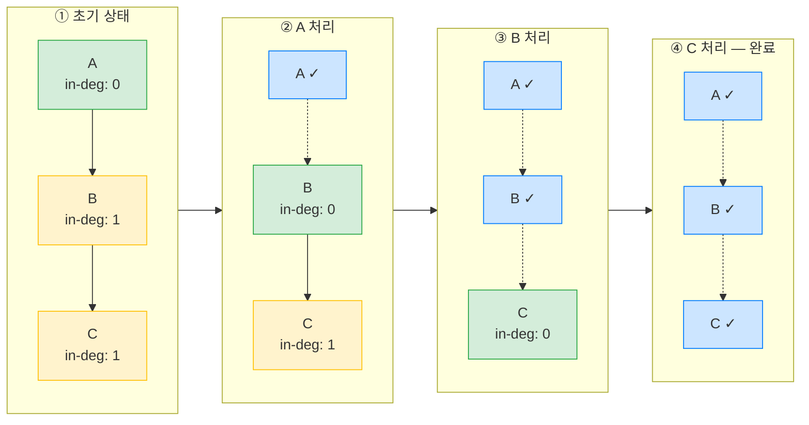

# 핵심 개념과 대안 비교

DAG 엔진을 구성하는 7가지 핵심 개념을 설명한다. 각 개념마다 정의, 대안과의 비교, 이 프로젝트에서 해당 방식을 선택한 구체적 이유를 다룬다.

---

## 1.1 DAG (Directed Acyclic Graph)

방향 비순환 그래프(DAG)는 노드와 방향이 있는 엣지로 구성되며, 어떤 노드에서 출발해도 자기 자신으로 돌아오는 경로가 존재하지 않는 그래프다. 파이프라인에서 노드는 개별 Job을, 엣지는 Job 간 의존성을 나타낸다. "빌드가 끝나야 테스트를 시작한다"는 관계를 BUILD → TEST 엣지 하나로 표현할 수 있다.

위상 정렬(topological sort)은 DAG의 모든 엣지가 앞에서 뒤로만 향하도록 노드를 일렬로 나열하는 것이다. 의존성이 있는 Job은 반드시 선행 Job 뒤에 배치되므로, 위상 정렬 순서대로 실행하면 의존성 위반이 발생하지 않는다.

### 대안 비교

| 구조 | 특징 | 한계 |
|------|------|------|
| Tree | 각 노드가 하나의 부모만 가짐 | 합류(join) 불가 — "빌드와 이미지풀이 모두 끝난 후 배포"를 표현할 수 없음 |
| DAG | 다중 부모 허용, 순환 금지 | fork-join을 자연스럽게 표현하며 종료가 보장됨 |
| 일반 Graph | 순환 허용 | 종료 보장 불가 — 무한 루프에 빠질 위험이 있어 별도 종료 조건이 필요함 |

### 선택 이유

CI/CD 파이프라인에서 "빌드 후 테스트", "빌드와 이미지풀을 병렬 수행한 뒤 배포"는 fork-join 패턴이다. Tree는 합류를 표현할 수 없고, 일반 Graph는 종료를 보장하지 못한다. DAG만이 fork-join을 자연스럽게 모델링하면서 위상 정렬로 실행 순서를 확정할 수 있기 때문에 선택했다.

---

## 1.2 Kahn's Algorithm

Kahn's Algorithm은 BFS 기반 위상정렬 알고리즘이다. 진입 차수(in-degree)가 0인 노드, 즉 선행 의존성이 없는 노드를 큐에 넣고 처리한다. 노드를 큐에서 꺼낼 때마다 해당 노드가 가리키는 후속 노드의 진입 차수를 1 감소시키고, 진입 차수가 0이 된 노드를 다시 큐에 추가하는 과정을 반복한다. 모든 노드를 처리했는데도 큐에 들어가지 못한 노드가 남아 있으면 사이클이 존재한다는 의미다. 시간 복잡도는 O(V + E)로, 노드 수 V와 엣지 수 E에 비례한다.

### 대안 비교

DFS 기반 위상정렬은 재귀적으로 그래프를 탐색하며, 백 엣지(back edge) 발견으로 사이클을 감지한다. 구현이 간결하지만, 사이클에 어떤 노드가 참여하는지 알아내려면 추가 작업이 필요하다. 반면 Kahn's Algorithm은 알고리즘 종료 후 처리되지 않은 채 남은 노드가 곧 사이클 참여 노드이므로, 별도 로직 없이 사이클 구성 노드 목록을 즉시 얻을 수 있다.

### 선택 이유

CI/CD 파이프라인에서 사이클은 설정 오류인데, 운영자에게 "Job A → B → C → A 순환이 감지되었습니다: [A, B, C]"처럼 구체적인 에러 메시지를 제공하는 것이 디버깅에 결정적이다. Kahn's Algorithm은 이 정보를 알고리즘의 자연스러운 부산물로 제공하기 때문에 선택했다.

### 단계별 진행

초록 노드는 큐에 들어갈 준비가 된 노드, 파란 노드는 처리 완료된 노드를 나타낸다.

---

## 1.3 SAGA Pattern

SAGA 패턴은 분산 트랜잭션을 로컬 트랜잭션의 연쇄로 분해하고, 중간에 실패가 발생하면 이미 커밋된 단계를 역순으로 보상(compensate)하는 패턴이다. 예를 들어 GIT_CLONE → BUILD → PUSH_IMAGE 순서로 진행하다가 PUSH_IMAGE에서 실패하면, BUILD의 아티팩트를 삭제하고, GIT_CLONE의 워크스페이스를 정리하는 보상 트랜잭션을 역순으로 실행한다.

SAGA에는 두 가지 조정 방식이 있다. Orchestration 방식은 중앙 조정자(Orchestrator)가 각 단계의 실행과 보상 순서를 직접 제어한다. Choreography 방식은 각 서비스가 이벤트를 발행하고, 다른 서비스가 이벤트를 구독하여 자율적으로 보상을 수행한다. 이 프로젝트는 Orchestration 방식을 채택했다.

### 대안 비교

2PC(Two-Phase Commit)는 트랜잭션 매니저가 모든 참여자에게 prepare를 요청하고, 전원 동의 시 commit을 보내는 프로토콜이다. 강한 일관성을 보장하지만 모든 참여자가 동일한 트랜잭션 매니저를 인식해야 하며, prepare 단계에서 분산 Lock이 걸려 가용성이 떨어진다. 이기종 시스템에서는 사실상 적용이 불가능하다.

SAGA는 최종 일관성(eventual consistency)만 보장하므로 보상 로직을 직접 구현해야 하는 부담이 있다. 그러나 각 단계가 독립적인 로컬 트랜잭션이므로 이기종 시스템 간에도 작동한다.

### 선택 이유

Jenkins 빌드 롤백, Nexus 아티팩트 삭제, Registry 이미지 제거는 각각 독립적인 외부 시스템이어서 공통 트랜잭션 매니저가 존재하지 않는다. 2PC를 적용할 수 없는 환경이므로 SAGA가 유일한 현실적 선택지다.

보상 순서에 역위상정렬을 사용하는 이유도 명확하다. BUILD가 GIT_CLONE에 의존한다면, 보상 시에는 BUILD의 아티팩트를 먼저 제거한 뒤 GIT_CLONE의 워크스페이스를 정리해야 한다. 의존하는 쪽의 산출물을 먼저 제거하지 않으면 참조가 꼬일 수 있기 때문이다.

---

## 1.4 Break-and-Resume Pattern

Break-and-Resume는 장시간 실행되는 외부 작업에 대해 스레드를 점유하지 않고, 작업 완료 시 외부 신호(콜백, 웹훅)를 받아 흐름을 재개하는 패턴이다. Jenkins 빌드가 5분에서 30분까지 걸릴 수 있는 상황에서 스레드를 그대로 블로킹하면 동시 실행 가능한 파이프라인 수가 스레드 수에 묶이게 된다.

### 대안 비교

| 방식 | 장점 | 단점 |
|------|------|------|
| Polling | 구현이 단순함 | 폴링 주기만큼 완료 감지 지연, CPU/네트워크 자원 낭비 |
| Callback/Webhook | 완료 즉시 반응, 자원 효율적 | Webhook 유실 가능성에 대비 필요 |
| Reactive/Non-blocking | 자원 효율 극대화 | 외부 시스템이 reactive API를 지원해야 하고, 코드 복잡도가 높아짐 |

### 선택 이유

Jenkins는 빌드 완료 시 POST webhook을 보내는 기능을 기본 제공한다. 외부 시스템이 이미 콜백 메커니즘을 갖추고 있으므로 Webhook 방식이 가장 자연스럽다. Webhook 유실에 대비해서는 StaleExecutionCleanupScheduler가 주기적으로 오래된 RUNNING 상태의 실행을 감지하고 정리하는 안전망 역할을 한다. Reactive 방식은 Jenkins API가 reactive 프로토콜을 지원하지 않으므로 고려 대상이 아니었다.

---

## 1.5 Failure Policy (실패 전파 전략)

DAG에서 하나의 Job이 실패했을 때 나머지 Job을 어떻게 처리할지 결정하는 전략이다. 이 프로젝트는 세 가지 정책을 지원한다.

- **STOP_ALL**: 실행 중인 모든 Job을 중단하고 전체 파이프라인을 실패로 마킹한다. 자원 낭비를 최소화할 수 있으나, 이미 진행 중인 독립 Job까지 중단된다.
- **SKIP_DOWNSTREAM**: 실패한 Job의 하류(downstream) Job만 SKIPPED로 마킹하고, 실패 Job과 무관한 경로의 Job은 계속 실행한다. 독립 경로의 결과를 얻을 수 있어 부분 성공이 의미 있는 경우에 적합하다.
- **FAIL_FAST**: 새로운 Job 스케줄링을 중단하되, 이미 실행 중인 Job은 완료까지 허용한다. STOP_ALL보다 덜 공격적이면서도 추가 자원 투입을 막는 절충안이다.

### 대안 비교

마이크로서비스 아키텍처에서 흔히 쓰이는 Circuit Breaker는 연속 실패 임계치에 도달하면 호출 자체를 차단하는 패턴인데, 이는 요청-응답 모델에 특화되어 있다. Bulkhead는 스레드 풀을 분리하여 한 서비스의 장애가 전체로 전파되는 것을 막지만, 이 역시 서비스 간 통신 맥락의 패턴이다.

파이프라인은 요청-응답이 아니라 작업 그래프이므로, 실패 전파 역시 그래프의 의존성 구조를 따라야 한다. "이 Job이 실패하면 어떤 하류 Job이 영향받는가?"라는 질문에 답하려면 DAG 구조 자체를 활용하는 정책이 필요하다.

### 선택 이유

Circuit Breaker나 Bulkhead는 서비스 호출 패턴에 맞춰 설계된 것이어서 DAG 기반 파이프라인에 적용하기엔 추상화 수준이 맞지 않는다. DAG Failure Policy는 의존성 그래프를 직접 순회하여 영향 범위를 정확히 계산하므로, 파이프라인 실패 처리에 가장 적합한 접근이다.

---

## 1.6 Per-execution Lock

파이프라인 실행(Execution) 단위로 독립된 ReentrantLock을 할당하여, 해당 실행의 상태 변경을 직렬화하는 패턴이다. 하나의 실행 내에서 removeRunning → markCompleted → findReadyJobIds → markRunning이라는 상태 전이 시퀀스가 원자적으로 수행되어야 하는데, 이 네 단계 사이에 다른 스레드(예: webhook 콜백)가 끼어들면 같은 Job이 두 번 스케줄링되거나 완료된 Job이 다시 RUNNING으로 표시되는 문제가 생길 수 있다.

### 대안 비교

Global Lock(synchronized)은 구현이 단순하지만, 서로 다른 파이프라인 실행까지 하나의 Lock을 공유하게 되어 처리량 병목이 된다. 파이프라인 A의 상태 변경이 파이프라인 B의 상태 변경을 블로킹할 이유가 없음에도 대기가 발생하는 것이다.

Lock-free 방식(CAS/Atomic)은 단일 변수의 원자적 변경에는 최적이지만, 상태 머신처럼 여러 필드(runningJobs, completedJobs, jobStatuses)를 한 번에 변경해야 하는 경우에는 적용이 어렵다. 각 필드를 개별 CAS로 처리하면 중간 상태가 외부에 노출되어 정합성이 깨진다.

Striped Lock은 실행 ID를 키로 하여 실행별 독립된 Lock을 관리한다. 서로 다른 실행은 간섭 없이 병렬 처리되고, 같은 실행 내에서는 상태 전이가 직렬화된다.

### 선택 이유

상태 머신에서 removeRunning → markCompleted → findReadyJobIds → markRunning 시퀀스의 원자성이 핵심 요구사항이다. CAS로는 다중 필드 변경을 원자적으로 묶기 어렵고, Global Lock은 독립 실행 간 불필요한 경합을 만든다. Per-execution Lock은 필요한 범위에서만 직렬화를 보장하면서 실행 간 병렬성을 유지하는 균형 잡힌 선택이다.

---

## 1.7 Exponential Backoff

재시도 간격을 지수적으로 증가시키는 전략이다. 첫 재시도는 1초 후, 두 번째는 2초 후, 세 번째는 4초 후에 수행한다. 일시적 장애(네트워크 순단, Jenkins 재시작 등)에서는 초반 짧은 간격으로 빠르게 복구하고, 장기 장애에서는 간격이 넓어져 대상 시스템에 과도한 부하를 주지 않는다.

### 대안 비교

고정 간격(예: 5초마다)은 구현이 단순하지만 두 가지 문제를 안고 있다. 일시적 장애에서도 최소 5초를 기다려야 하고, 장기 장애에서는 5초마다 계속 요청을 보내 부하를 가중시킨다.

선형 증가(1초, 2초, 3초, ...)는 고정 간격보다 낫지만, 증가 속도가 느려서 장기 장애 시 여전히 부하가 집중된다.

지수 백오프에 Jitter(랜덤 지터)를 추가하면 여러 클라이언트가 동시에 재시도하는 thundering herd 문제를 방지할 수 있다. 수백 개의 클라이언트가 동일 서버에 재시도하는 환경에서는 Jitter가 필수적이다.

### 선택 이유

이 프로젝트에서 동시 실행되는 파이프라인은 기본 3개(maxConcurrentExecutions)이므로 thundering herd가 발생할 가능성이 낮다. Jitter를 추가하면 재시도 타이밍이 비결정적이 되어 디버깅이 어려워지는 단점도 있다. 동시 실행 규모가 작은 환경에서는 Jitter 없는 단순 지수 백오프가 충분하며, 예측 가능한 재시도 간격이 로그 분석에도 유리하다.

---

## 1.8 파라미터 주입 (Parameter Injection)

파이프라인 실행 시 사용자가 전달한 key-value 파라미터를 Job 설정(configJson)에 주입하는 메커니즘이다. configJson 내부의 `${PARAM_NAME}` 플레이스홀더를 실제 값으로 치환한다. 같은 파이프라인 정의를 다른 파라미터로 여러 번 실행할 수 있게 해주는 핵심 기능이다. ParameterSchema로 각 Job이 어떤 파라미터를 기대하는지 선언하고, ParameterResolver가 검증→병합→치환 3단계를 수행한다.

### 대안 비교

| 방식 | 특징 | 한계 |
|------|------|------|
| 환경변수 주입 | OS 레벨 주입, 컨테이너 친화적 | Job별 스키마 검증 불가, 타입 안전성 없음, 누락 시 런타임 에러 |
| 직접 설정 오버라이드 | configJson 자체를 실행마다 교체 | 정의 재사용 불가, 공통 설정과 가변 설정의 경계 모호 |
| 템플릿 치환 (`${PARAM}`) | 정의는 고정, 가변 부분만 플레이스홀더 | 단순 문자열 치환이라 복잡한 조건 분기 불가 |

### 선택 이유

CI/CD 파이프라인에서 가변 요소는 대부분 단순 값(브랜치명, 버전, 저장소 URL)이다. 템플릿 치환은 configJson의 구조를 유지하면서 가변 부분만 교체하므로, 같은 Definition을 "develop 브랜치 빌드"와 "release 브랜치 빌드"에 재사용할 수 있다. ParameterSchema로 필수/선택/기본값을 선언하면 실행 전에 누락 파라미터를 탐지할 수 있어 런타임 실패를 방지한다.

---

## 1.9 실행 컨텍스트 (Execution Context)

실행 컨텍스트는 하나의 파이프라인 실행 내에서 Job 간 데이터를 전달하는 공유 저장소다. PipelineExecution.contextJson에 key-value 맵으로 저장되며, 선행 Job이 `putContext(key, value)`로 결과를 기록하면 후속 Job이 파라미터 치환 시 이 값을 참조할 수 있다. 대표적인 사용 사례는 BUILD Job이 생성한 아티팩트 URL을 DEPLOY Job에 전달하는 것이다.

### 대안 비교

| 방식 | 특징 | 한계 |
|------|------|------|
| 파일 시스템 공유 | 물리 파일로 데이터 전달, 대용량 가능 | 분산 환경에서 파일 접근 어려움, 정리 부담 |
| 메시지 큐 전달 | 비동기 전달, 느슨한 결합 | Job 간 순서 보장 별도 구현 필요, 과도한 인프라 의존 |
| 구조화 DTO | 타입 안전, 컴파일 타임 검증 | Job 타입 추가마다 DTO 수정, 유연성 부족 |
| key-value 맵 (contextJson) | 스키마 없이 자유로운 데이터 전달 | 타입 안전성 없음, 키 충돌 가능 |

### 선택 이유

DAG 파이프라인에서 Job 간 전달 데이터는 대부분 단순 문자열(URL, 경로, 버전)이고 Job 타입 조합이 유동적이다. 구조화 DTO는 새 Job 타입을 추가할 때마다 수정이 필요하지만, key-value 맵은 키 네이밍 컨벤션(예: `ARTIFACT_URL_{jobId}`)만으로 충돌을 회피할 수 있다. DB에 JSON으로 직렬화되므로 크래시 복구 시에도 컨텍스트가 유실되지 않는다.

---

## 1.10 미들웨어 프리셋 (Middleware Preset)

미들웨어 프리셋은 파이프라인에서 자주 사용하는 도구 조합(Jenkins, Nexus, GitLab 등)의 접속 정보와 설정을 하나의 묶음으로 추상화한 것이다. PipelineJob.presetId로 프리셋을 참조하면, 프리셋에 정의된 URL/인증 정보가 Job 설정에 자동 반영된다. 사용자는 인프라 상세를 몰라도 프리셋 이름만 선택하여 파이프라인을 구성할 수 있다.

### 대안 비교

| 방식 | 특징 | 한계 |
|------|------|------|
| 직접 설정 | Job마다 URL/인증 정보 입력 | 중복, 오타 위험, 인프라 변경 시 전체 수정 |
| 환경변수 | 서버 레벨 설정, 코드와 분리 | Job별 다른 인프라를 사용하기 어려움 |
| 프리셋 참조 | 이름으로 선택, 상세는 프리셋이 관리 | 프리셋 관리 UI/API 추가 개발 필요 |

### 선택 이유

하나의 파이프라인에 Jenkins(빌드), Nexus(아티팩트), GitLab(소스) 등 여러 미들웨어가 관여한다. 각 Job에 직접 URL을 입력하면 인프라 이전 시 모든 Job을 수정해야 한다. 프리셋으로 한 단계 간접 참조를 두면 인프라 변경이 프리셋 한 곳에서 해결되고, 사용자는 "Jenkins-Dev" 같은 프리셋 이름만 선택하면 된다.
