# DAG 엔진 vs 파이프라인 — 분리 분석

> **문서 상태**: Phase 2 시점에 작성된 분석이다. 여기서 제안한 인터페이스 추출(DagExecutionRepository, DagJobExecutionRepository, DagJobDispatcher)은 아직 구현되지 않았다. Phase 3에서 DagEventProducer만 Event 계층으로 추가되었다. 향후 엔진을 독립 모듈로 분리할 때 이 분석을 참조한다.

DAG 엔진(`dag.engine`)은 현재 파이프라인 인프라(`pipeline.domain`, `pipeline.mapper`, `pipeline.engine`, `pipeline.event`)에 직접 의존한다. 이 문서는 두 모듈 사이의 결합 지점을 소스 코드 import 기준으로 식별하고, 분리 가능성과 전략을 분석한다.

---

## 1. 현재 결합 지점

### 1-1. Domain 결합 — Coordinator가 pipeline.domain 전체를 참조

`DagExecutionCoordinator`의 import 선언부를 보면 pipeline 패키지의 도메인 클래스를 와일드카드로 가져온다.

```java
import com.study.playground.pipeline.domain.*;       // PipelineExecution, PipelineJobExecution, PipelineStatus, JobExecutionStatus, PipelineJobType
import com.study.playground.pipeline.dag.domain.*;   // PipelineJob, FailurePolicy, PipelineDefinition
```

Coordinator가 `PipelineExecution`을 메서드 파라미터와 내부 로직 전반에서 사용하기 때문에, DAG 엔진을 독립 모듈로 추출하면 pipeline.domain 전체가 따라온다. `startExecution(PipelineExecution)`, `dispatchReadyJobs(PipelineExecution)`, `executeJob(PipelineExecution, PipelineJob, Integer)` 등 핵심 메서드의 시그니처가 모두 `PipelineExecution`에 묶여 있다.

반면 `DagExecutionState`와 `DagValidator`는 `dag.domain` 패키지(`PipelineJob`, `FailurePolicy`)만 참조하므로 pipeline.domain에 대한 직접 의존이 없다.

### 1-2. Mapper 결합 — dag.mapper 2개 + pipeline.mapper 2개의 교차 참조

Coordinator는 네 종류의 MyBatis Mapper를 주입받는다.

```java
import com.study.playground.pipeline.dag.mapper.PipelineDefinitionMapper;   // dag 패키지
import com.study.playground.pipeline.dag.mapper.PipelineJobMapper;          // dag 패키지
import com.study.playground.pipeline.mapper.PipelineExecutionMapper;        // pipeline 패키지
import com.study.playground.pipeline.mapper.PipelineJobExecutionMapper;     // pipeline 패키지
```

DAG 고유 데이터(`PipelineDefinition`, `PipelineJob`)를 관리하는 mapper와 파이프라인 공용 데이터(`PipelineExecution`, `PipelineJobExecution`)를 관리하는 mapper가 하나의 클래스에 뒤섞여 있다. Coordinator가 `executionMapper.updateStatus()`, `jobExecutionMapper.findByExecutionId()` 등을 직접 호출하면서 파이프라인의 영속성 계층에 강하게 결합된다. DAG 엔진이 "실행 상태를 어떤 테이블에 어떻게 저장하는지"까지 알고 있는 셈이다.

### 1-3. Event 결합 — PipelineEventProducer + DagEventProducer 이중 의존

```java
import com.study.playground.pipeline.event.PipelineEventProducer;   // 파이프라인 공용 이벤트
import com.study.playground.pipeline.dag.event.DagEventProducer;    // DAG 전용 이벤트
```

Coordinator는 두 이벤트 프로듀서를 모두 사용한다. `eventProducer.publishJobExecutionChanged()`로 Job 상태 변경을 알리고, `dagEventProducer.publishDagJobDispatched()`로 DAG 시각화 이벤트를 발행한다. `finalizeExecution()`에서는 `eventProducer.publishExecutionCompleted()`까지 호출하므로, DAG 엔진이 파이프라인의 이벤트 발행 책임까지 떠안고 있다. `DagEventProducer`는 dag 패키지 안에 있어 분리에 문제가 없지만, `PipelineEventProducer`는 pipeline.event 패키지에 속한다.

### 1-4. Executor 결합 — JobExecutorRegistry가 pipeline.engine에 위치

```java
import com.study.playground.pipeline.engine.JobExecutorRegistry;
```

`JobExecutorRegistry`는 `pipeline.engine` 패키지에 정의되어 있고, `PipelineJobType` → `PipelineJobExecutor` 매핑을 관리한다. Coordinator는 `jobExecutorRegistry.getExecutor(job.getJobType())`으로 Job을 실행하고, `jobExecutorRegistry.asJobTypeMap()`으로 SAGA 보상 시 executor를 조회한다. DAG 엔진이 "어떤 executor가 어떤 Job 타입을 처리하는지"를 pipeline.engine에 의존해서 알아내는 구조이므로, 엔진을 분리하면 이 레지스트리를 어디에 둘지 결정해야 한다.

### 1-5. SAGA 결합 — compensateDag()가 SagaCompensator와 별도로 자체 구현

```java
import com.study.playground.pipeline.engine.SagaCompensator;
```

Coordinator는 `SagaCompensator`를 필드로 주입받지만, 실제 DAG SAGA 보상은 `compensateDag()` 메서드에서 자체 구현한다. `SagaCompensator.compensate()`는 순차 실행 전용(failedJobOrder 기반 역순 인덱싱)이라 DAG의 역방향 위상 순서 보상에 맞지 않기 때문이다. 결과적으로 보상 로직이 두 곳(`SagaCompensator`와 `compensateDag`)에 중복되고, `sagaCompensator` 필드는 사용되지 않는 채로 남아 있다.

---

## 2. 분리 가능성 평가

| 컴포넌트 | 분리 용이성 | 예상 노력 | 이점 |
|----------|:-----------:|:---------:|------|
| `DagValidator` | 높음 | 낮음 | `dag.domain.PipelineJob`만 참조, 즉시 독립 가능 |
| `DagExecutionState` | 높음 | 낮음 | `dag.domain`만 참조, 순수 알고리즘 |
| `DagEventProducer` | 높음 | 낮음 | dag 패키지 내부 완결, Avro + EventPublisher만 의존 |
| `DagExecutionCoordinator` | 낮음 | 높음 | 4개 패키지에 걸친 12개 외부 의존성 |
| `JobExecutorRegistry` | 중간 | 중간 | 인터페이스 추출로 위치 중립화 가능 |
| `SagaCompensator` | 해당 없음 | 낮음 | DAG 보상 로직이 이미 Coordinator에 있음 |

`DagValidator`와 `DagExecutionState`는 pipeline 패키지에 대한 의존이 전혀 없으므로 즉시 독립 모듈로 추출할 수 있다. 반면 `DagExecutionCoordinator`는 도메인, 영속성, 이벤트, 실행기를 모두 직접 참조하기 때문에, 인터페이스 계층을 먼저 도입해야 분리가 가능하다.

---

## 3. 권장 분리 전략 — 인터페이스 계층 추출

핵심 아이디어는 Coordinator가 pipeline 패키지의 구체 클래스 대신 dag.engine 패키지에 정의된 인터페이스에 의존하도록 바꾸는 것이다. 구체 구현은 어댑터 패키지에서 MyBatis Mapper와 기존 프로듀서를 래핑한다.

### 3-1. 제안 인터페이스

**DagExecutionRepository** — 실행 상태 영속성을 추상화한다.

```java
package com.study.playground.pipeline.dag.engine;

import java.time.LocalDateTime;
import java.util.List;
import java.util.UUID;

public interface DagExecutionRepository {
    DagExecutionSnapshot findById(UUID executionId);
    List<DagExecutionSnapshot> findByStatus(String status);
    void updateStatus(UUID executionId, String status
            , LocalDateTime completedAt, String errorMessage);
}
```

**DagJobExecutionRepository** — Job 실행 레코드 접근을 추상화한다.

```java
package com.study.playground.pipeline.dag.engine;

import java.time.LocalDateTime;
import java.util.List;
import java.util.UUID;

public interface DagJobExecutionRepository {
    List<DagJobExecutionSnapshot> findByExecutionId(UUID executionId);
    DagJobExecutionSnapshot findByExecutionIdAndJobOrder(UUID executionId, int jobOrder);
    void updateStatus(Long id, String status, String log, LocalDateTime completedAt);
    void incrementRetryCount(Long id);
}
```

**DagJobDispatcher** — Job 실행과 보상을 추상화한다.

```java
package com.study.playground.pipeline.dag.engine;

public interface DagJobDispatcher {
    void dispatch(DagExecutionSnapshot execution
            , DagJobExecutionSnapshot jobExecution) throws Exception;
    void compensate(DagExecutionSnapshot execution
            , DagJobExecutionSnapshot jobExecution) throws Exception;
}
```

`DagExecutionSnapshot`과 `DagJobExecutionSnapshot`은 DAG 엔진이 필요로 하는 최소한의 필드만 담는 읽기 전용 record다. `PipelineExecution`의 모든 필드가 아니라 `id`, `pipelineDefinitionId`, `startedAt`, `parameters` 정도면 충분하다.

### 3-2. 현재 구조 vs 제안 구조

```mermaid
graph TB
    subgraph proposed["제안 구조"]
        direction TB
        C2[DagExecutionCoordinator]
        I1[DagExecutionRepository]
        I2[DagJobExecutionRepository]
        I3[DagJobDispatcher]
        A1[MyBatisExecutionAdapter]
        A2[MyBatisJobExecutionAdapter]
        A3[PipelineJobDispatcherAdapter]
        PM2[pipeline.mapper]
        PE2[pipeline.engine]

        C2 --> I1
        C2 --> I2
        C2 --> I3
        A1 -.-> I1
        A2 -.-> I2
        A3 -.-> I3
        A1 --> PM2
        A2 --> PM2
        A3 --> PE2
    end

    subgraph current["현재 구조"]
        direction TB
        C1[DagExecutionCoordinator]
        PM1[pipeline.mapper]
        PD1[pipeline.domain]
        PE1[pipeline.engine]
        PEV1[pipeline.event]

        C1 --> PM1
        C1 --> PD1
        C1 --> PE1
        C1 --> PEV1
    end

    style current fill:#fce4ec,stroke:#c62828,color:#333
    style proposed fill:#e8f5e9,stroke:#2e7d32,color:#333
    style C1 fill:#fff3e0,stroke:#e65100,color:#333
    style C2 fill:#fff3e0,stroke:#e65100,color:#333
    style I1 fill:#e3f2fd,stroke:#1565c0,color:#333
    style I2 fill:#e3f2fd,stroke:#1565c0,color:#333
    style I3 fill:#e3f2fd,stroke:#1565c0,color:#333
    style A1 fill:#fff9c4,stroke:#f9a825,color:#333
    style A2 fill:#fff9c4,stroke:#f9a825,color:#333
    style A3 fill:#fff9c4,stroke:#f9a825,color:#333
    style PM1 fill:#f3e5f5,stroke:#7b1fa2,color:#333
    style PD1 fill:#f3e5f5,stroke:#7b1fa2,color:#333
    style PE1 fill:#f3e5f5,stroke:#7b1fa2,color:#333
    style PEV1 fill:#f3e5f5,stroke:#7b1fa2,color:#333
    style PM2 fill:#f3e5f5,stroke:#7b1fa2,color:#333
    style PE2 fill:#f3e5f5,stroke:#7b1fa2,color:#333
```



현재 구조에서 Coordinator는 4개 pipeline 패키지에 직접 화살표를 갖는다. 제안 구조에서는 Coordinator가 인터페이스에만 의존하고, 어댑터(점선)가 인터페이스를 구현하면서 pipeline 패키지를 참조한다. 의존성 방향이 역전되어 dag.engine 패키지를 독립적으로 테스트할 수 있게 된다.

---

## 4. 실제 프로젝트 적용 시 참고 포인트

분리 작업은 세 단계로 진행하되, 각 단계가 독립적으로 배포 가능해야 한다.

### 단계 ① DagValidator + DagExecutionState 독립 테스트

이 두 클래스는 이미 pipeline.domain에 대한 의존이 없으므로, dag.domain 패키지만으로 단위 테스트를 작성할 수 있다. 순수 알고리즘이라 외부 의존성 목킹이 불필요하다.

```java
// DagValidator — Kahn's algorithm 검증
var jobs = List.of(
    createJob(1L, "Build", Set.of())
    , createJob(2L, "Test", Set.of(1L))
    , createJob(3L, "Deploy", Set.of(2L))
);
dagValidator.validate(jobs); // 순환 없음 → 통과

// DagExecutionState — ready job 탐색
var state = DagExecutionState.initialize(jobs, Map.of(1L, 1, 2L, 2, 3L, 3));
assertThat(state.findReadyJobIds()).containsExactly(1L);  // root만 ready
state.markCompleted(1L);
assertThat(state.findReadyJobIds()).containsExactly(2L);  // 의존성 충족
```

### 단계 ② DagExecutionCoordinator 골격 — 인터페이스 기반

인터페이스를 도입한 뒤, in-memory 구현체로 Coordinator의 조율 로직을 테스트한다. MyBatis나 Kafka 없이 실행 흐름 전체를 검증할 수 있다.

```java
// In-memory adapter (테스트 전용)
public class InMemoryExecutionRepository implements DagExecutionRepository {
    private final Map<UUID, DagExecutionSnapshot> store = new ConcurrentHashMap<>();

    @Override
    public DagExecutionSnapshot findById(UUID executionId) {
        return store.get(executionId);
    }

    @Override
    public List<DagExecutionSnapshot> findByStatus(String status) {
        return store.values().stream()
                .filter(e -> status.equals(e.status()))
                .toList();
    }

    @Override
    public void updateStatus(UUID executionId, String status
            , LocalDateTime completedAt, String errorMessage) {
        store.computeIfPresent(executionId, (k, v) ->
                v.withStatus(status).withError(errorMessage));
    }
}
```

이 단계에서 Coordinator가 `PipelineExecution` 대신 `DagExecutionSnapshot`을 받도록 시그니처를 변경한다. 기존 호출부(`PipelineEngine.execute()`)는 어댑터에서 변환을 처리하면 되므로 영향이 제한적이다.

### 단계 ③ 파이프라인 어댑터 연결

실제 MyBatis Mapper, Kafka EventProducer, JobExecutorRegistry를 래핑하는 어댑터를 구현하고, Spring 설정에서 조립한다.

```java
@Component
@RequiredArgsConstructor
public class MyBatisExecutionAdapter implements DagExecutionRepository {
    private final PipelineExecutionMapper executionMapper;

    @Override
    public DagExecutionSnapshot findById(UUID executionId) {
        var entity = executionMapper.findById(executionId);
        return toSnapshot(entity);
    }
    // ... 나머지 메서드
}
```

이 단계까지 완료하면 Coordinator의 import에서 `pipeline.mapper.*`와 `pipeline.domain.*`이 사라지고, 대신 `dag.engine` 패키지 내부의 인터페이스와 snapshot record만 남는다. `PipelineEngine`은 여전히 `dagCoordinator.startExecution()`을 호출하지만, 인자 타입이 `DagExecutionSnapshot`으로 바뀌므로 변환 코드 한 줄이 추가된다.

---

## 5. 참조

### 관련 문서

- [DAG Engine Guide (개요)](./README.md) — DAG 엔진의 설계 동기와 핵심 개념

### 클래스 참조 테이블

| 클래스 | 패키지 | 역할 |
|--------|--------|------|
| `DagExecutionCoordinator` | `dag.engine` | DAG 실행 조율, Job 디스패치, 완료/실패 처리 |
| `DagExecutionState` | `dag.engine` | 실행당 런타임 상태 추적 (ready job 탐색, 위상 정렬) |
| `DagValidator` | `dag.engine` | Kahn's algorithm 기반 DAG 유효성 검증 |
| `DagEventProducer` | `dag.event` | DAG Job 디스패치/완료 이벤트 Kafka 발행 |
| `PipelineDefinitionMapper` | `dag.mapper` | PipelineDefinition CRUD (MyBatis) |
| `PipelineJobMapper` | `dag.mapper` | PipelineJob 조회, 의존성 관리 (MyBatis) |
| `PipelineEngine` | `pipeline.engine` | 파이프라인 실행 진입점, DAG/순차 모드 라우팅 |
| `JobExecutorRegistry` | `pipeline.engine` | PipelineJobType → PipelineJobExecutor 매핑 |
| `SagaCompensator` | `pipeline.engine` | 순차 실행 전용 SAGA 보상 |
| `PipelineJobExecutor` | `pipeline.engine` | Job 실행/보상 인터페이스 |
| `PipelineEventProducer` | `pipeline.event` | 파이프라인 공용 이벤트 Kafka 발행 |
| `PipelineExecutionMapper` | `pipeline.mapper` | PipelineExecution CRUD (MyBatis) |
| `PipelineJobExecutionMapper` | `pipeline.mapper` | PipelineJobExecution CRUD (MyBatis) |
| `PipelineExecution` | `pipeline.domain` | 파이프라인 실행 엔티티 |
