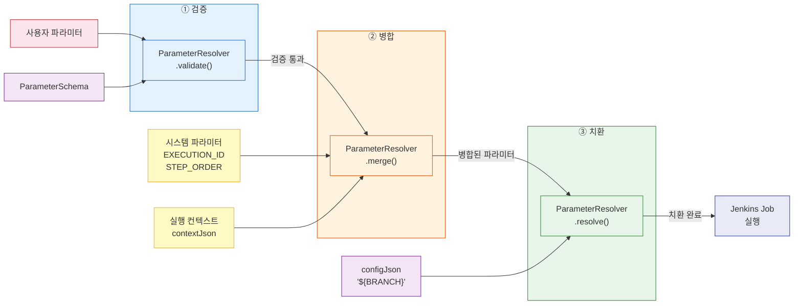

# 파라미터 시스템

파이프라인 실행 시 사용자가 전달한 파라미터를 Job 설정에 주입하는 전체 흐름을 설명한다. 같은 파이프라인 정의를 서로 다른 파라미터로 여러 번 실행할 수 있게 하는 것이 목적이다.

---

## 1. ParameterSchema — 파라미터 선언

각 PipelineJob은 자신이 기대하는 파라미터를 ParameterSchema 레코드로 선언한다. PipelineJob.parameterSchemaJson 필드에 JSON 배열로 저장되며, parameterSchemas() 메서드가 역직렬화를 수행한다.

```java
record ParameterSchema(
    String name,           // 파라미터 이름 — [A-Za-z0-9_]만 허용
    String type,           // 타입 힌트 — STRING, NUMBER, BOOLEAN (문서용, 런타임 검증 없음)
    String defaultValue,   // 사용자 미입력 시 적용할 기본값
    boolean required       // true면 반드시 제공해야 함
)
```

type 필드는 현재 런타임 검증에 사용되지 않는다. UI에서 입력 필드 타입을 결정하는 힌트 역할이고, 실제 값은 모두 문자열로 처리한다. 런타임 타입 검증이 필요해지면 validate() 단계에서 추가하면 된다.

---

## 2. 스키마 수집 — PipelineDefinition.collectParameterSchemas()

파이프라인 실행 전에 모든 Job의 스키마를 수집하여 하나의 리스트로 합친다. 사용자가 어떤 파라미터를 제공해야 하는지 전체 목록을 보여줄 때 사용한다. 동일 이름의 파라미터가 여러 Job에서 선언되면 중복 없이 하나만 포함한다.

---

## 3. 검증 — ParameterResolver.validate()

사용자가 제공한 파라미터 맵을 스키마와 대조하여 3가지를 확인한다.

1. **필수 파라미터 존재 여부**: required=true인 스키마에 대해 사용자 파라미터에 해당 키가 있는지 확인한다. 없으면 IllegalArgumentException을 발생시킨다.
2. **기본값 적용**: 사용자가 값을 제공하지 않았지만 defaultValue가 정의된 경우, 기본값을 자동 적용한다.
3. **최종 파라미터 맵 반환**: 사용자 값 + 기본값이 병합된 완전한 파라미터 맵을 반환한다.

실행 전에 검증하는 이유는 Jenkins Job이 시작된 뒤에야 파라미터 오류를 발견하면 되돌리기 어렵기 때문이다.

---

## 4. 시스템 파라미터 병합 — ParameterResolver.merge()

시스템이 자동 생성하는 파라미터(EXECUTION_ID, STEP_ORDER)와 사용자 파라미터를 병합한다. 시스템 파라미터가 항상 우선하므로, 사용자가 EXECUTION_ID를 임의 값으로 덮어쓰는 것을 방지한다.

| 파라미터 | 출처 | 용도 |
|---------|------|------|
| EXECUTION_ID | 시스템 | 실행 추적, 웹훅 콜백 식별 |
| STEP_ORDER | 시스템 | Job 실행 순서 식별 |
| 사용자 정의 | 사용자 | 브랜치명, 버전, URL 등 |

---

## 5. 플레이스홀더 치환 — ParameterResolver.resolve()

configJson이나 jenkinsScript 문자열에서 `${PARAM_NAME}` 패턴을 실제 값으로 교체한다.

- **정규식**: `\$\{([A-Za-z0-9_]+)\}`
- **치환 규칙**: 매칭된 키가 파라미터 맵에 있으면 치환하고, 없으면 원본 `${...}`을 그대로 남긴다
- **보안**: 파라미터 이름을 영숫자와 밑줄로 제한하여 `${../../etc/passwd}` 같은 경로 순회를 차단한다

### 치환 예시

configJson 원본:
```json
{
  "gitUrl": "${GIT_URL}",
  "branch": "${BRANCH}",
  "nexusUrl": "http://nexus:8081"
}
```

파라미터: `{GIT_URL: "http://gitlab/repo.git", BRANCH: "develop"}`

치환 결과:
```json
{
  "gitUrl": "http://gitlab/repo.git",
  "branch": "develop",
  "nexusUrl": "http://nexus:8081"
}
```

nexusUrl에는 플레이스홀더가 없으므로 그대로 유지된다.

---

## 6. 실행 컨텍스트와의 연동

파라미터 치환은 사용자 파라미터뿐 아니라 실행 컨텍스트(PipelineExecution.contextJson)의 값도 참조한다. DagExecutionCoordinator.executeJob()에서 실행 컨텍스트와 사용자 파라미터를 합쳐서 resolve()에 전달하므로, 선행 Job이 `putContext("ARTIFACT_URL", "...")`로 저장한 값을 후속 Job의 configJson에서 `${ARTIFACT_URL}`로 참조할 수 있다.

이 메커니즘 덕분에 BUILD Job이 생성한 아티팩트 URL을 DEPLOY Job이 별도 설정 없이 자동으로 전달받는다.

---

## 7. E2E 흐름



---

## 8. 알려진 이슈

### buildConfigXml() 파라미터 정의 누락

JenkinsAdapter.buildConfigXml()이 Jenkins Job XML을 생성할 때, parameterDefinitions에 EXECUTION_ID와 STEP_ORDER만 정의한다. configJson에서 사용하는 사용자 파라미터(GIT_URL, BRANCH 등)는 parameterDefinitions에 포함되지 않아, Jenkins가 해당 파라미터를 인식하지 못한다.

**증상**: BUILD Job에서 configJson의 파라미터가 Jenkins에 전달되지 않음
**원인**: buildConfigXml()이 정적으로 두 개 파라미터만 정의
**해결 방향**: PipelineJob.parameterSchemas()에서 스키마를 읽어 동적으로 parameterDefinitions를 생성해야 한다

> 상세: `review/09-eng-issues-tracker.md`
