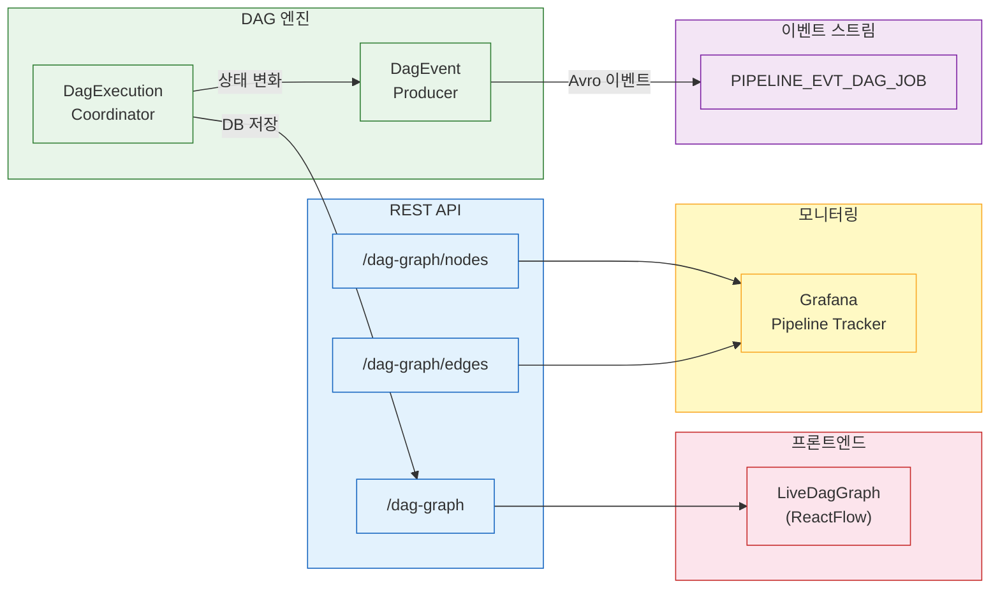

# DAG 시각화와 모니터링

파이프라인 실행 상태를 실시간으로 확인할 수 있어야 디버깅이 가능하다. 이 문서는 DAG 실행 상태를 시각화하는 세 가지 채널(REST API, Kafka 이벤트, 프론트엔드)의 구조와 흐름을 설명한다.

---

## 1. 백엔드: DagGraphResponse

DAG 실행 상태를 Node/Edge 구조로 변환하는 응답 레코드다. Grafana Node Graph 패널과 ReactFlow 양쪽에서 소비할 수 있는 공통 포맷으로 설계했다.

### 1.1 구조

```java
record DagGraphResponse(List<Node> nodes, List<Edge> edges)

record Node(
    String id,        // Job ID (문자열 변환)
    String title,     // Job 이름 — 노드에 표시되는 레이블
    String subTitle,  // Job 타입 (BUILD, DEPLOY 등) — 보조 레이블
    String mainStat,  // 실행 상태 (SUCCESS, FAILED, RUNNING 등)
    String color      // 상태별 색상 코드
)

record Edge(
    String id,        // 엣지 식별자 (e0, e1, ...)
    String source,    // 선행 Job ID — 의존성 출발점
    String target     // 후속 Job ID — 의존성 도착점
)
```

### 1.2 상태→색상 매핑

| 상태 | 색상 | 의미 |
|------|------|------|
| SUCCESS | green | 정상 완료 |
| FAILED | red | 실패 |
| RUNNING | blue | 실행 중 |
| WAITING_WEBHOOK | purple | Jenkins 웹훅 대기 중 |
| PENDING | orange | 의존성 충족 대기 |
| SKIPPED | gray | 실패 정책에 의해 건너뜀 |
| COMPENSATED | gray | SAGA 보상 완료 |

PipelineDefinitionService.getDagGraph()에서 PipelineJob 정의(의존 관계)와 PipelineJobExecution 상태를 조합하여 응답을 생성한다.

---

## 2. REST API 엔드포인트

DAG 시각화를 위한 3개 엔드포인트가 있다. Grafana Infinity 플러그인은 JSON API를 직접 호출할 수 있으므로, 별도 데이터 변환 없이 이 엔드포인트를 데이터소스로 사용한다.

| Method | Path | 반환 | 용도 |
|--------|------|------|------|
| GET | `/api/pipelines/executions/{executionId}/dag-graph` | DagGraphResponse (nodes + edges) | 전체 그래프 |
| GET | `/api/pipelines/executions/{executionId}/dag-graph/nodes` | Node 배열 | Grafana Node Graph 노드 |
| GET | `/api/pipelines/executions/{executionId}/dag-graph/edges` | Edge 배열 | Grafana Node Graph 엣지 |

nodes와 edges를 분리한 이유는 Grafana Node Graph 패널이 노드 데이터와 엣지 데이터를 별도 쿼리로 받기 때문이다. dag-graph 엔드포인트는 프론트엔드 ReactFlow용이고, nodes/edges는 Grafana용이다.

---

## 3. 이벤트 스트리밍: DagEventProducer

실행 중 상태 변화를 실시간으로 외부에 알리기 위해 Avro 이벤트를 Kafka에 발행한다.

### 3.1 이벤트 종류

| 이벤트 | 발행 시점 | 주요 필드 |
|--------|----------|----------|
| DagJobDispatchedEvent | Job이 RUNNING으로 전환될 때 | executionId, jobId, jobName, jobType, jobOrder, dispatchedAt |
| DagJobCompletedEvent | Job 실행 완료 시 | executionId, jobId, jobName, jobType, jobOrder, status, durationMs, retryCount, logSnippet |

### 3.2 토픽과 파티셔닝

- **토픽**: `Topics.PIPELINE_EVT_DAG_JOB`
- **파티션 키**: executionId

executionId를 파티션 키로 사용하면 동일 실행의 모든 이벤트가 같은 파티션에 적재된다. 소비자가 이벤트를 순서대로 처리할 수 있어 "dispatch → completed" 순서가 보장된다.

### 3.3 logSnippet 제한

DagJobCompletedEvent의 logSnippet은 전체 로그에서 마지막 500자만 잘라낸 것이다. 이벤트 크기를 제한하면서도 실패 원인 파악에 필요한 최소 정보를 포함하기 위한 설계다. 전체 로그는 PipelineJobExecution.log 필드에 별도 저장된다.

---

## 4. 프론트엔드: LiveDagGraph

ReactFlow 기반 실시간 DAG 시각화 컴포넌트다. 파이프라인 실행 상태를 그래프로 렌더링하며, 상태 변화에 따라 노드 색상이 실시간으로 변한다.

### 4.1 주요 컴포넌트

| 컴포넌트 | 역할 |
|---------|------|
| LiveDagGraph | ReactFlow 캔버스, 레이아웃 계산, 자동 리프레시 |
| DagJobNode | 커스텀 노드 — Job 이름, 타입, 상태를 표시하며 상태별 색상 적용 |
| DagStatusEdge | 커스텀 엣지 — 의존 관계를 화살표로 표시 |

### 4.2 데이터 흐름

LiveDagGraph는 `/api/pipelines/executions/{executionId}/dag-graph` 엔드포인트를 주기적으로 폴링하여 최신 상태를 반영한다. DagGraphResponse의 Node를 ReactFlow 노드로, Edge를 ReactFlow 엣지로 매핑한다.

---

## 5. Grafana: Pipeline Tracker 대시보드

Grafana에서 파이프라인 실행 상태를 모니터링하는 대시보드다.

### 5.1 구성

- **데이터소스**: Infinity 플러그인 (JSON API 직접 호출)
- **패널**: Node Graph 패널 — /dag-graph/nodes와 /dag-graph/edges를 별도 쿼리로 호출
- **갱신 주기**: 자동 리프레시 (5초 또는 수동)

### 5.2 Infinity 데이터소스 설정

Infinity 플러그인은 REST API의 JSON 응답을 Grafana 데이터프레임으로 변환한다. nodes 엔드포인트의 응답이 Grafana Node Graph 패널이 기대하는 필드(id, title, subTitle, mainStat, color)와 일치하도록 DagGraphResponse를 설계한 것이다.

---

## 6. 전체 흐름



> 상세 API 스펙: `06-api-reference.md`
> 파라미터 시스템: `04-parameter-system.md`
