# DAG Engine Guide — Redpanda Playground Pipeline

## Section 1: DAG 엔진 개요

선형 파이프라인은 Job을 순서대로 하나씩 실행하기 때문에 구현이 단순하지만, 서로 독립적인 Job(예: BUILD와 IMAGE_PULL)도 직렬로 대기해야 한다. 빌드가 5분, 이미지 풀이 3분이라면 총 8분이 걸리는 셈이다. 이 둘을 병렬로 실행하면 5분이면 충분하다. 또한 선형 구조에서는 한 Job이 실패하면 전체 파이프라인이 즉시 중단되는데, 실패한 브랜치와 무관한 독립 브랜치까지 함께 중단될 이유는 없다. 병렬 분기/합류와 독립 실패 격리를 지원하려면 Job 간 의존성을 방향 비순환 그래프(DAG)로 표현해야 한다.

이 엔진은 세 계층으로 나뉜다. 첫째, **Validation 계층**(DagValidator)은 실행 전에 DAG의 구조적 결함을 탐지한다. 존재하지 않는 Job 참조, 순환 의존성, 단절 그래프를 거부함으로써 런타임 오류를 사전에 차단하는 역할이다. 둘째, **State 계층**(DagExecutionState)은 실행 중인 DAG의 런타임 상태를 추적한다. 어떤 Job이 완료되었고, 어떤 Job이 실행 중이며, 다음에 실행 가능한 Job이 무엇인지를 판단하는 것이 이 계층의 책임이다. 셋째, **Orchestration 계층**(DagExecutionCoordinator)은 상태 변화에 반응하여 Job을 디스패치하고, 실패 정책을 적용하며, SAGA 보상을 수행한다.

PipelineDefinition과 PipelineExecution의 분리도 핵심 설계 결정이다. PipelineDefinition은 "어떤 Job을 어떤 의존 관계로 실행할지"를 정의하는 블루프린트이고, PipelineExecution은 "특정 시점에 실행한 결과"를 기록하는 런타임 인스턴스다. 같은 Definition으로 여러 번 Execution을 생성할 수 있으므로, 파이프라인 구성을 재사용할 수 있다. PipelineEngine.execute()에서 `pipelineDefinitionId`가 null이 아니면 DAG 모드로, null이면 기존 순차 모드로 분기하는데, 이 단순한 null 체크 하나로 하위 호환성을 유지한 것이다.

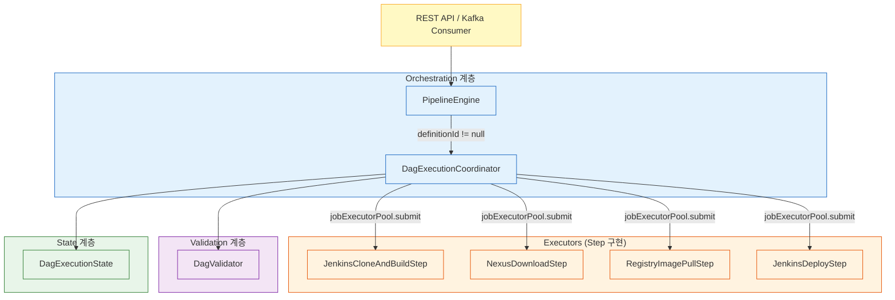

---

## Section 2: 핵심 컴포넌트

### 2.1 DagValidator — Kahn's Algorithm

DagValidator는 BFS 기반 Kahn's algorithm으로 순환 탐지와 위상 정렬을 동시에 수행한다. DFS가 아닌 BFS를 선택한 이유가 있다. DFS 기반 순환 탐지는 "순환이 있다/없다"만 알려주지만, Kahn's algorithm은 처리되지 않고 남은 노드 집합이 곧 순환에 참여하는 노드이므로 에러 메시지에 어떤 Job이 순환에 포함되었는지를 바로 보여줄 수 있기 때문이다. 실제 코드에서 `sorted.size() != jobs.size()` 조건이 성립하면 `inDegree`가 0보다 큰 채로 남은 Job 이름을 수집하여 에러 메시지에 포함한다.

검증은 3단계로 진행된다. 첫 번째 단계는 **참조 무결성 검증**으로, 각 Job의 `dependsOnJobIds`에 포함된 ID가 실제로 존재하는 Job인지 확인한다. 존재하지 않는 ID를 참조하면 `"Job '%s'이 존재하지 않는 Job ID %d에 의존합니다"` 메시지와 함께 즉시 실패한다. 두 번째 단계는 **사이클 검출**로, 진입 차수(in-degree)가 0인 노드를 큐에 넣고 BFS로 탐색하면서 후속 노드의 진입 차수를 감소시킨다. 모든 노드를 처리하지 못하면 순환이 존재하는 것이다. 세 번째 단계는 **연결성 검증**으로, 양방향 인접 리스트를 구축한 뒤 BFS로 첫 번째 노드에서 모든 노드에 도달 가능한지 확인한다. 단, 에지가 하나도 없는 경우(전체 병렬 실행)는 연결성 검증을 건너뛴다. 단절 그래프를 거부하는 이유는 서로 연결되지 않은 Job 그룹이 하나의 파이프라인에 공존하면 실행 순서의 의미가 모호해지기 때문이다.

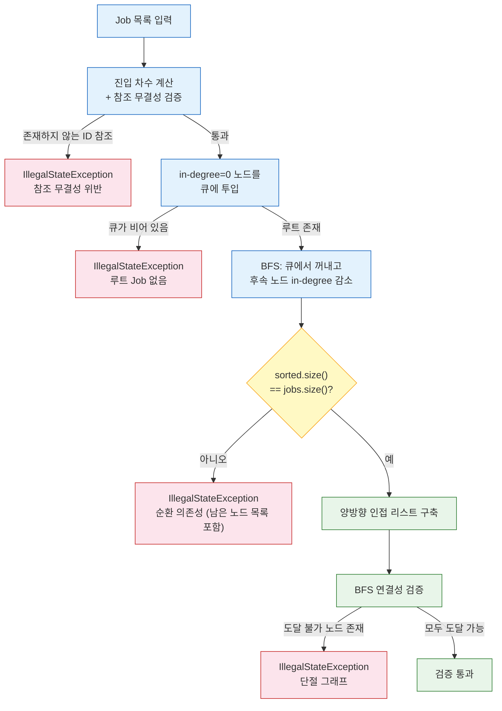

### 2.2 DagExecutionState — 상태 머신

DagExecutionState는 실행당 하나 생성되는 런타임 상태 객체다. 내부 필드는 불변과 가변으로 명확히 분리되어 있다. **불변 필드**는 `jobs`(Job ID → PipelineJob 맵), `dependencyGraph`(Job ID → 선행 Job ID 집합), `successorGraph`(Job ID → 후속 Job ID 집합), `jobIdToJobOrder`(Job ID → Job 순서 매핑)이며, 모두 `Collections.unmodifiableMap()`으로 감싸져 있어 초기화 이후 변경이 불가능하다. **가변 필드**는 `completedJobIds`, `runningJobIds`, `failedJobIds`, `skippedJobIds` 네 개의 HashSet이며, 전용 mutation 메서드(`markCompleted`, `markRunning`, `markFailed`, `markSkipped`, `removeRunning`)를 통해서만 변경할 수 있다. 외부에는 읽기 전용 뷰(`Set.copyOf`)나 방어적 복사본만 노출한다.

`successorGraph`를 `initialize()` 시점에 `dependencyGraph`로부터 사전 구축하는 것은 의도적인 설계다. `allDownstream(failedJobId)` 호출 시 실패한 Job의 전이적 하위를 BFS로 탐색하는데, 후속 그래프가 없으면 매번 전체 의존성 그래프를 역으로 뒤져야 한다. 사전 구축 덕분에 `successorGraph.getOrDefault(current, Set.of())`로 O(1)에 직접 후속 노드를 조회할 수 있다.

`findReadyJobIds()` 메서드가 실행 가능한 Job을 판단하는 로직은 간결하다. `dependencyGraph`의 모든 엔트리를 순회하면서, 이미 종료 상태(completed, running, failed, skipped)인 Job을 제외하고, 나머지 중 `completedJobIds.containsAll(entry.getValue())`가 참인 Job — 모든 선행 Job이 성공 완료된 Job — 을 ready로 판정한다. 선행 Job이 실패하거나 스킵된 경우에는 `containsAll`이 거짓이므로 자연스럽게 디스패치 대상에서 제외된다.

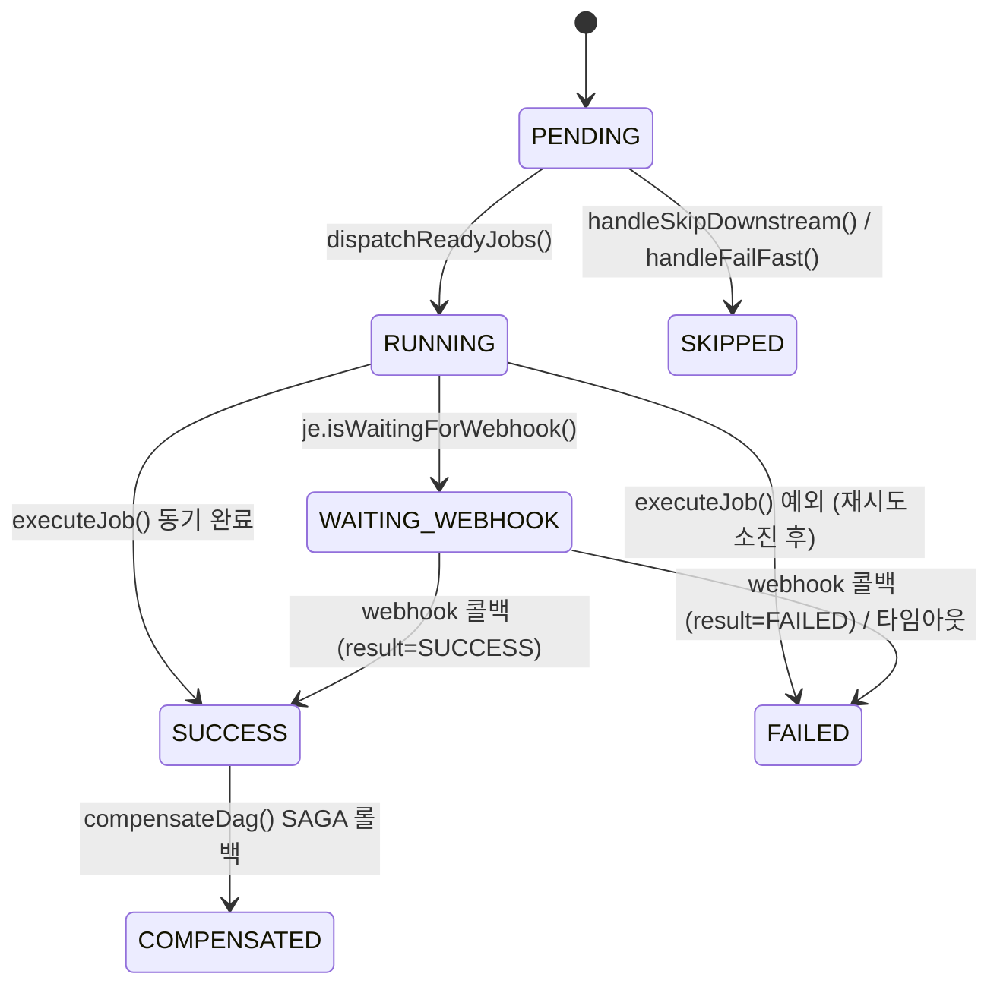

### 2.3 DagExecutionCoordinator — 오케스트레이터

DagExecutionCoordinator의 메인 루프는 이벤트 구동(event-driven) 방식으로 동작한다. `startExecution()`이 루트 Job을 디스패치하면, 각 Job 완료 시 `onJobCompleted()`가 호출되고, 그 안에서 다시 `dispatchReadyJobs()`가 새로 ready된 Job을 디스패치한다. 이 사이클이 모든 Job이 종료 상태에 도달할 때까지 반복되는 구조다.

동시성 모델은 **실행당 ReentrantLock**으로 설계되어 있다. `ConcurrentHashMap<UUID, ReentrantLock> executionLocks`에서 실행 ID별 Lock을 관리하며, `onJobCompleted()` 진입 시 해당 실행의 Lock을 획득한 뒤 상태 변경과 디스패치를 수행한다. 같은 실행에서 두 Job이 동시에 완료되더라도 Lock이 `removeRunning → markCompleted → dispatchReadyJobs` 시퀀스를 직렬화하므로 레이스 컨디션이 발생하지 않는다. 다른 실행의 Job 완료와는 Lock이 분리되어 있으므로 서로 블로킹하지 않는다.

`jobExecutorPool`은 `@Qualifier("jobExecutorPool")`로 주입되는 고정 크기 스레드 풀이다. `dispatchReadyJobs()` 내부에서 `props.maxConcurrentJobs()`로 동시 실행 가능한 Job 수를 제한하는데, 이 값은 Jenkins의 containerCap과 일치시킨다. containerCap을 초과하면 Jenkins 빌드 큐에 쌓이기만 하고 실행되지 않으므로, 스레드를 그 이상 할당하는 것은 자원 낭비일 뿐이다.

---

## Section 3: 시나리오별 워크스루

### 3.1 Linear Chain (A→B→C)

가장 단순한 DAG 형태다. A가 루트이고, B는 A에 의존하며, C는 B에 의존한다. `startExecution()` 호출 시 `DagExecutionState.initialize()`가 `dependencyGraph`를 구축하면 A의 의존성은 빈 집합이므로 `findReadyJobIds()`가 A를 반환한다. A가 `jobExecutorPool`에 제출되어 실행되고, 완료 시 `onJobCompleted(executionId, jobOrder, jobId, true)`가 호출된다. 이 메서드 안에서 `state.markCompleted(A)`를 수행한 뒤 `dispatchReadyJobs()`를 호출하면, B의 의존성 `{A}`가 `completedJobIds`에 포함되어 있으므로 B가 ready로 판정된다. B 완료 후 같은 과정으로 C가 디스패치되고, C까지 완료되면 `state.isAllDone()`이 참이 되어 `finalizeExecution()`이 호출된다.

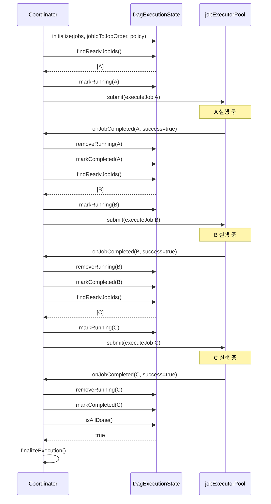

### 3.2 Parallel Fork-Join (A→[B,C]→D)

A가 루트이고, B와 C가 모두 A에만 의존하며, D는 B와 C 둘 다에 의존하는 구조다. A 완료 후 `findReadyJobIds()`를 호출하면 B와 C 모두 의존성 `{A}`가 충족되므로 동시에 ready로 판정된다. `dispatchReadyJobs()`는 `props.maxConcurrentJobs()` 이내에서 둘 다 스레드 풀에 제출한다.

B와 C가 거의 동시에 완료되는 경우가 핵심이다. B의 완료 콜백과 C의 완료 콜백이 서로 다른 스레드에서 동시에 `onJobCompleted()`를 호출하지만, 실행당 `ReentrantLock`이 이 두 호출을 직렬화한다. 먼저 Lock을 획득한 쪽(예: B)이 `markCompleted(B)`를 수행하고 `findReadyJobIds()`를 호출하면, D의 의존성 `{B, C}` 중 C가 아직 미완료이므로 D는 ready가 아니다. B 측 처리가 끝나고 Lock이 해제되면 C 측이 Lock을 획득하여 `markCompleted(C)` 후 `findReadyJobIds()`를 호출한다. 이때 `{B, C}` 모두 `completedJobIds`에 포함되므로 D가 비로소 디스패치된다. Lock 직렬화가 없었다면 두 스레드가 동시에 D를 ready로 판정하여 중복 실행될 위험이 있을 것이다.

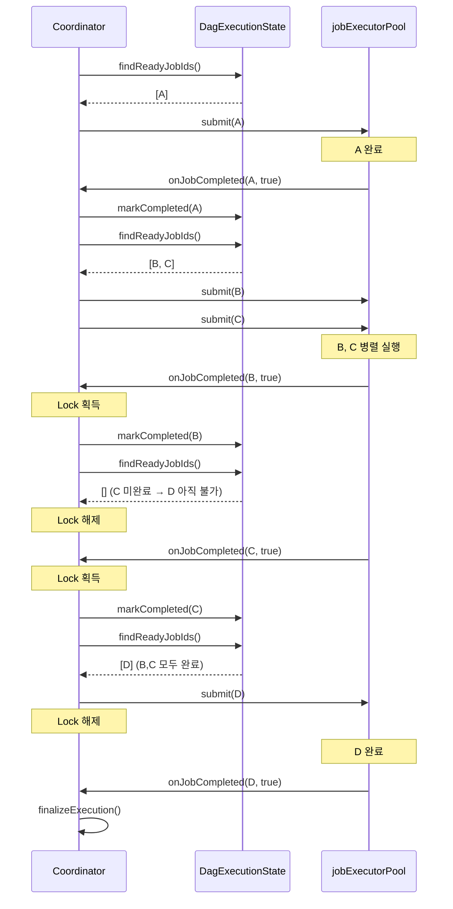

### 3.3 Diamond + SKIP_DOWNSTREAM

Diamond DAG에서 FailurePolicy가 `SKIP_DOWNSTREAM`인 경우의 동작이다. A→B, A→C, B→D, C→D 구조에서 B가 실패하면 어떻게 되는지 추적해보자.

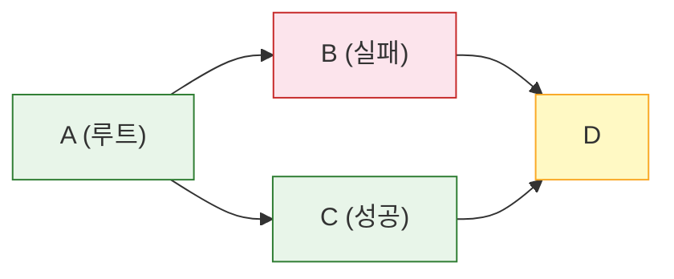

A 완료 후 B와 C가 동시에 디스패치된다. B가 실패하면 `onJobCompleted(B, false)`에서 `state.markFailed(B)` 후 `handleFailure()`가 호출된다. `state.failurePolicy()`가 `SKIP_DOWNSTREAM`이므로 `handleSkipDownstream()`으로 분기한다.

`handleSkipDownstream()` 내부에서 `state.allDownstream(B)`를 호출하면 `successorGraph`에서 B의 후속을 BFS로 탐색한다. B의 직접 후속은 D이고, D의 후속은 없으므로 결과는 `{D}`다. 그런데 D가 RUNNING 상태라면 `allDownstream()`이 RUNNING인 노드를 제외하도록 설계되어 있어, D가 이미 실행 중인 경우에는 스킵하지 않고 완료를 기다린다. D가 아직 PENDING이라면 `state.markSkipped(D)`와 DB 상태 업데이트(`SKIPPED`)가 수행된다.

한편 C는 B의 실패와 무관하게 계속 실행된다. `handleSkipDownstream()`의 마지막 부분에서 `state.isAllDone()`을 체크하고, 아직 완료되지 않았으면 `dispatchReadyJobs()`를 호출하기 때문이다. C가 성공하더라도 D는 이미 SKIPPED 상태이므로 `findReadyJobIds()`에서 제외된다. 결국 completed={A, C}, failed={B}, skipped={D}로 `isAllDone()`이 참이 되어 `finalizeExecution()`에서 SAGA 보상이 진행된다.

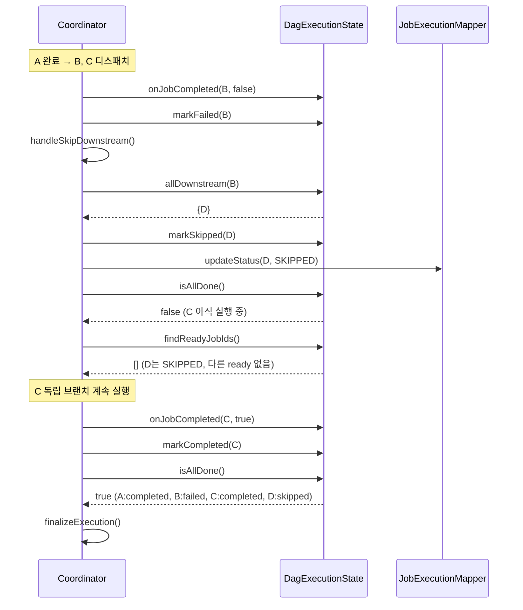

### 3.4 Webhook Break-and-Resume

Jenkins 빌드처럼 외부 시스템의 완료를 기다려야 하는 Job은 Break-and-Resume 패턴을 사용한다. `executeJob()` 내부에서 `executor.execute(execution, je)`를 호출하면, Jenkins 타입 실행기는 Jenkins에 빌드를 트리거한 뒤 `je.setWaitingForWebhook(true)`를 설정하고 즉시 반환한다. `executeJob()`은 `je.isWaitingForWebhook()` 체크에 걸려서 DB 상태를 `WAITING_WEBHOOK`로 갱신하고, `onJobCompleted()`를 호출하지 않은 채 메서드를 빠져나간다. 스레드가 풀로 반환되므로 빌드가 10분이든 1시간이든 서버 스레드를 점유하지 않는다.

이후 Jenkins 빌드가 완료되면 webhook 콜백이 도착한다. `PipelineEngine.resumeAfterWebhook()`에서 `dagCoordinator.isManaged(executionId)`를 확인하고, DAG 모드이면 `dagCoordinator.onJobCompleted()`를 호출하여 일반 완료와 동일한 경로로 합류한다. webhook과 타임아웃 체커가 동시에 상태를 변경할 수 있으므로, CAS 방식(`updateStatusIfCurrent`)으로 `WAITING_WEBHOOK` → `SUCCESS/FAILED` 전환을 원자적으로 수행한다. CAS가 실패하면(affected=0) 이미 다른 쪽이 상태를 변경한 것이므로 중복 처리 없이 반환한다.

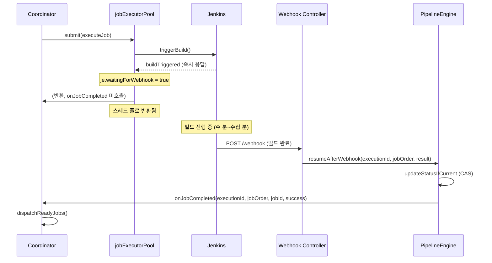

### 3.5 Crash Recovery

앱이 비정상 종료된 후 재시작하면 `@PostConstruct` 메서드인 `recoverRunningExecutions()`가 자동으로 호출된다. 이 메서드는 DB에서 `PipelineStatus.RUNNING` 상태인 실행을 모두 조회하고, `pipelineDefinitionId`가 null이 아닌 것(DAG 모드)만 복구 대상으로 삼는다.

복구 과정은 다음과 같다. 먼저 Job 목록과 의존성, 실패 정책을 DB에서 다시 로드하여 `DagExecutionState.initialize()`로 상태 객체를 재구성한다. 그 다음 기존 `JobExecution` 레코드를 순회하면서, SUCCESS인 것은 `markCompleted`, FAILED/COMPENSATED인 것은 `markFailed`, SKIPPED인 것은 `markSkipped`로 상태를 복원한다. 핵심은 RUNNING이나 WAITING_WEBHOOK 상태로 남아있는 Job의 처리다. 크래시 시점에 실행 중이었거나 webhook을 대기 중이었던 Job은 webhook이 유실되었을 가능성이 높으므로, 보수적으로 FAILED 처리한다. 필요하다면 부분 재시작(Partial Restart) API로 해당 Job부터 다시 실행할 수 있다.

상태 복원이 끝나면 세 가지 분기로 나뉜다. `isAllDone()`이 참이면 `finalizeExecution()`으로 종료 처리하고, `hasFailure()`가 참이면 `handleFailure()`로 실패 정책을 적용하며, 둘 다 아니면 `dispatchReadyJobs()`로 나머지 Job을 재개한다.

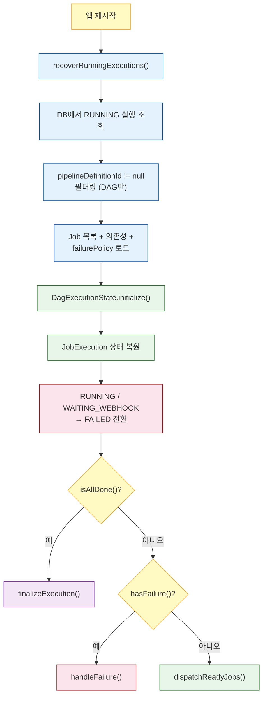

### 3.6 Retry (지수 백오프)

동기 실행 중 예외가 발생하면 즉시 실패로 처리하지 않고 재시도를 시도한다. `executeJob()`의 catch 블록에서 `je.getRetryCount()`가 `props.jobMaxRetries()` 미만이면 재시도 경로로 진입한다.

재시도 지연은 `1L << currentRetry`로 계산하는데, 이는 2의 거듭제곱 초 단위다. `retryCount=0`이면 1초, `retryCount=1`이면 2초, `retryCount=2`이면 4초가 된다. `retryScheduler`(ScheduledExecutorService)에 지연을 걸어 `executeJob()`을 다시 호출하므로, 재시도 대기 중에 스레드를 블로킹하지 않는다. 재시도 전에 `jobExecutionMapper.incrementRetryCount()`로 DB의 카운터를 먼저 증가시키고, 상태를 `PENDING`으로 되돌린다. 재시도 중에도 동일한 `executeJob()` 메서드를 타므로 webhook 대기, 성공 처리, 실패 처리 로직이 모두 동일하게 적용된다.

`props.jobMaxRetries()`에 도달하면 최종 실패로 처리한다. `FAILED` 상태로 갱신하고 `onJobCompleted(executionId, jobOrder, jobId, false)`를 호출하여 일반 실패 흐름에 합류한다. 주의할 점은 이 재시도 메커니즘이 동기 실행 예외에만 적용된다는 것이다. webhook 기반 Job(Jenkins 빌드 등)의 실패는 `onJobCompleted(false)`로 직접 들어오므로 재시도 대상이 아니다.

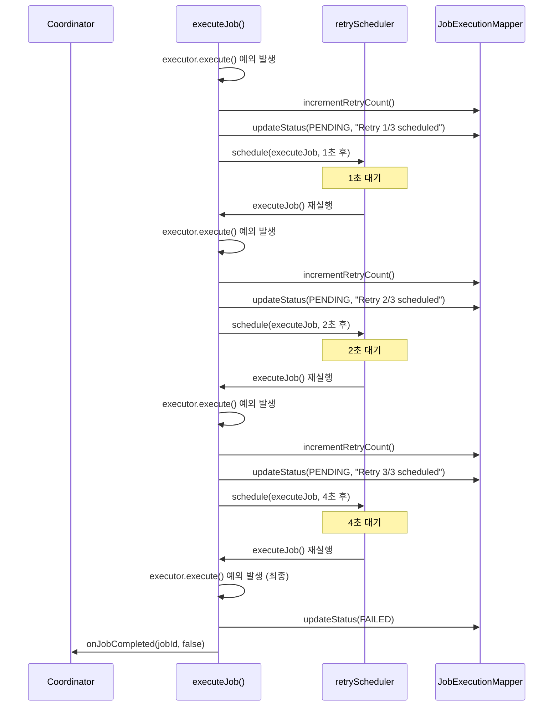

### 3.7 SAGA Compensation

`finalizeExecution()`에서 `state.hasFailure()`가 참이면 SAGA 보상이 시작된다. 보상 대상은 성공 완료된 Job만이며, 실패하거나 스킵된 Job은 보상할 필요가 없다. 보상 순서가 중요한데, `state.completedJobIdsInReverseTopologicalOrder()`가 역방향 위상 순서를 반환한다.

역위상정렬을 사용하는 이유를 예시로 설명하자면 이렇다. BUILD가 GIT_CLONE에 의존하는 구조에서 두 Job 모두 성공한 뒤 후속 DEPLOY가 실패했다고 하자. 정방향 위상 순서는 GIT_CLONE → BUILD이고, 역방향은 BUILD → GIT_CLONE이다. BUILD가 생성한 아티팩트는 GIT_CLONE이 클론한 소스에 기반하므로, BUILD의 아티팩트를 먼저 제거한 뒤 GIT_CLONE의 워크스페이스를 정리해야 참조 정합성이 유지된다. 만약 GIT_CLONE을 먼저 보상하면 BUILD 보상 시 이미 소스가 삭제된 상태에서 정리를 시도하게 되어 에러가 발생할 수 있다.

`completedJobIdsInReverseTopologicalOrder()` 내부는 완료된 Job만으로 새로운 서브그래프를 만들어 Kahn's algorithm을 수행한 뒤 `Collections.reverse()`로 뒤집는 방식이다. `successorGraph`에서 완료된 Job 사이의 에지만 추출하여 진입 차수를 계산하고, BFS 정렬 후 역순으로 반환한다.

`compensateDag()` 메서드는 역순 리스트를 순회하면서 각 Job의 `executor.compensate(execution, je)`를 호출한다. 보상이 성공하면 `COMPENSATED` 상태로 갱신하고, 보상 자체가 실패하면 `COMPENSATION_FAILED`로 기록한 뒤 "MANUAL INTERVENTION REQUIRED" 로그를 남긴다. 보상 실패는 자동 복구가 불가능한 상황이므로 운영자가 직접 개입해야 하는 셈이다.

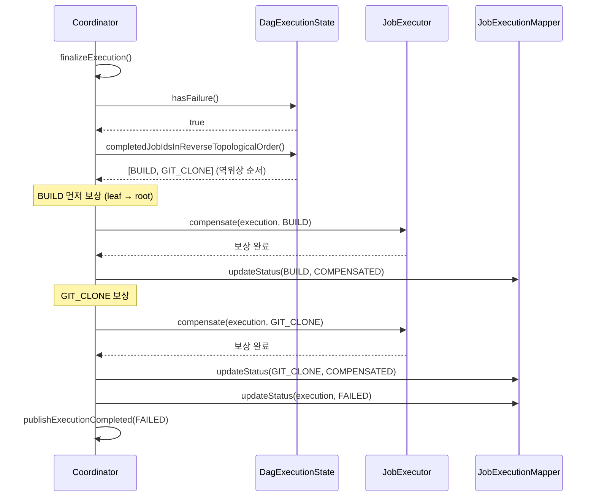

### 3.8 Partial Restart

부분 재시작은 이전 실행에서 실패한 Job부터 다시 시작하는 기능이다. `startExecution()` 내부에서 기존 `JobExecution` 레코드를 조회한 뒤, SUCCESS 상태인 Job을 `state.markCompleted()`로 사전 등록하는 로직이 이를 구현한다. 코드상 `for (var je : jobExecutions)` 루프에서 `je.getStatus() == JobExecutionStatus.SUCCESS`인 것만 골라 `state.markCompleted(je.getJobId())`를 호출하고, 이후 `dispatchReadyJobs()`를 호출하면 이미 완료된 Job은 `findReadyJobIds()`에서 제외되므로, 실패했던 Job이나 아직 실행되지 않은 Job만 디스패치 대상이 된다.

이 설계의 장점은 특별한 "재시작 모드"가 따로 존재하지 않는다는 점이다. 정상 실행과 부분 재시작이 동일한 `startExecution()` 코드 경로를 탄다. 차이는 오직 기존 JobExecution 레코드에 SUCCESS가 있느냐 없느냐뿐이다. 새 실행이면 모든 Job이 PENDING이므로 전체가 실행되고, 재시작이면 성공한 Job이 사전 등록되어 나머지만 실행되는 것이다. 크래시 복구(`recoverRunningExecutions`)에서 RUNNING/WAITING_WEBHOOK Job을 FAILED 처리한 뒤 운영자가 부분 재시작 API를 호출하면, 이전에 성공한 Job은 건너뛰고 실패 지점부터 재개할 수 있다.

---

## Section 4: 실패 정책 비교

Diamond DAG(A→[B,C]→D)에서 B가 실패하는 상황을 가정한다. A는 이미 완료된 상태이고, B와 C는 A 완료 후 동시에 디스패치되었으며, D는 B와 C 모두에 의존한다. 세 가지 FailurePolicy 각각이 이 시나리오를 어떻게 처리하는지 살펴보자.

**STOP_ALL** (기본값). B가 실패하면 `handleStopAll()`이 호출되어 새 Job 디스패치를 즉시 중단한다. 이미 RUNNING 상태인 C는 중간에 취소하지 않고 완료될 때까지 기다린다. C가 끝나면 `skipPendingJobs()`가 PENDING 상태의 D를 SKIPPED로 전환하고, `finalizeExecution()`에서 SAGA 보상이 시작된다. 데이터 파이프라인처럼 부분 실패가 전체 결과를 오염시키는 환경에 적합하지만, 실행 중인 Job 완료를 기다리므로 종료까지 시간이 걸릴 수 있다.

**SKIP_DOWNSTREAM**. B가 실패하면 `handleSkipDownstream()`이 `state.allDownstream(B)`를 BFS로 탐색하여 B의 전이적 하위 Job을 수집한다. Diamond DAG에서 B의 downstream은 {D}이므로 D만 SKIPPED 처리된다. C는 B와 독립적인 브랜치에 있으므로 계속 실행되고, C 완료 후 `isAllDone()`이 true가 되어 종료된다. CI/CD에서 테스트와 빌드를 병렬로 돌릴 때 유용한데, 한쪽이 실패해도 다른 브랜치의 결과를 얻을 수 있기 때문이다. 다만 부분 완료 상태로 끝나므로 결과 해석에 주의가 필요하다.

**FAIL_FAST**. B가 실패하면 `handleFailFast()`가 `skipPendingJobs()`를 즉시 호출하여 PENDING 상태인 C와 D를 모두 SKIPPED로 전환한다. 이미 RUNNING인 Job이 있다면 그 완료만 기다리고, 없으면 곧바로 종료한다. 비용이 민감한 환경에서 불필요한 실행을 최소화할 때 적합하나, 아직 시작되지 않은 독립 브랜치까지 건너뛰는 트레이드오프가 있다.

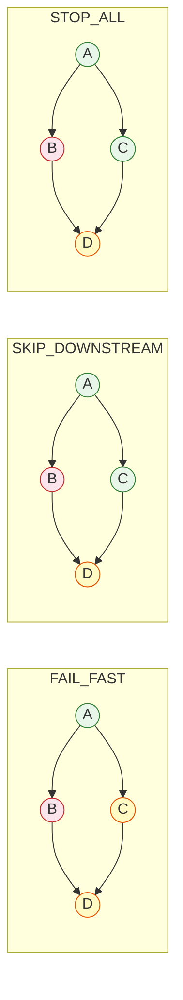

| 정책 | 동작 | 적합한 사례 | 트레이드오프 |
|------|------|-----------|------------|
| STOP_ALL | 새 디스패치 중단, 실행중 완료 대기 후 SAGA 보상 | 데이터 파이프라인 | 느린 종료 (RUNNING Job 완료 대기) |
| SKIP_DOWNSTREAM | 실패한 Job의 하위만 SKIP, 독립 브랜치 계속 | CI/CD (테스트+빌드 병렬) | 부분 완료 결과 해석 필요 |
| FAIL_FAST | 모든 PENDING 즉시 SKIP, RUNNING 완료 대기 | 비용 민감 환경 | 독립 브랜치까지 건너뜀 |

> STOP_ALL과 SKIP_DOWNSTREAM에서 C가 SUCCESS인 이유가 다르다. STOP_ALL은 C가 이미 RUNNING이라 완료를 기다린 것이고, SKIP_DOWNSTREAM은 C가 B와 독립 브랜치이므로 디스패치를 계속한 것이다. FAIL_FAST에서 C가 SKIPPED인 이유는 B 실패 시점에 C가 아직 PENDING이었다고 가정했기 때문이다. C가 이미 RUNNING이었다면 FAIL_FAST에서도 C는 완료까지 기다린다.

---

## Section 5: 동시성 모델

DagExecutionCoordinator의 동시성은 세 가지 메커니즘이 협력하여 구성된다. 전역 락 하나로 모든 것을 보호하는 방식이 아니라, 실행 단위별로 격리하면서도 내부 상태 변경의 원자성을 보장하는 설계를 택했다.

### Per-execution ReentrantLock

`executionLocks`는 `ConcurrentHashMap<UUID, ReentrantLock>` 타입이며, 각 파이프라인 실행마다 독립된 ReentrantLock을 할당한다. 실행 A의 Job 완료 콜백이 실행 B의 상태 변경을 블로킹하지 않는 것이 핵심이다. 글로벌 락을 사용하면 서로 무관한 파이프라인 실행이 직렬화되어 처리량이 급감하는데, per-execution 락은 이 문제를 근본적으로 회피한다.

`onJobCompleted()`에서 lock을 획득한 뒤 상태 변경(`markCompleted`/`markFailed`), 완료 체크(`isAllDone`), 다음 Job 디스패치(`dispatchReadyJobs`)를 일괄 수행하고 lock을 해제한다. 이 구간이 원자적이어야 하는 이유는 두 개의 webhook 콜백이 동시에 도착할 때 check-and-dispatch 로직이 중복 실행되는 것을 막기 위해서다.

### 3스레드 jobExecutorPool

`PipelineConfig`에서 `Executors.newFixedThreadPool(props.maxConcurrentJobs())`로 생성되며, 기본값은 3이다. 이 숫자를 Jenkins의 `containerCap`과 맞추는 이유는 Jenkins 에이전트가 동시에 처리할 수 있는 빌드 수를 초과하여 Job을 보내봐야 큐에서 대기만 할 뿐이기 때문이다.

`dispatchReadyJobs()`에서 `props.maxConcurrentJobs() - state.runningCount()`를 계산하여 남은 슬롯만큼만 추가 디스패치한다. ready Job이 5개여도 현재 2개가 실행 중이면 1개만 새로 디스패치하는 셈이다. 이 제한은 스레드 풀 크기와 별개로 논리적 동시성을 제어하는 역할을 한다.

### Lock reentrance 패턴

`dispatchReadyJobs()`는 두 가지 경로에서 호출된다. 하나는 `startExecution()` 내부인데, 이 시점에는 이미 lock을 보유하고 있다. 다른 하나는 `onJobCompleted()` → `dispatchReadyJobs()` 경로인데, 이 역시 lock 보유 상태에서 호출된다. 그러나 `handleSkipDownstream()`에서 `dispatchReadyJobs(execution)`을 호출하는 경우처럼, 호출 맥락에 따라 lock 보유 여부가 달라질 수 있다.

이 문제를 해결하기 위해 `dispatchReadyJobs()` 진입부에서 `lock.isHeldByCurrentThread()`를 체크한다. 현재 스레드가 이미 lock을 보유하고 있으면 재획득을 건너뛰고, 보유하지 않으면 lock을 획득한다. ReentrantLock이므로 동일 스레드의 재진입은 허용되지만, `needsLock` 플래그로 해제 시점을 명확히 구분하여 불필요한 lock/unlock 쌍을 방지한다.

```java
// DagExecutionCoordinator.dispatchReadyJobs() 핵심부
boolean needsLock = !lock.isHeldByCurrentThread();
if (needsLock) lock.lock();
try {
    // ... 상태 조회 + 디스패치 ...
} finally {
    if (needsLock) lock.unlock();
}
```

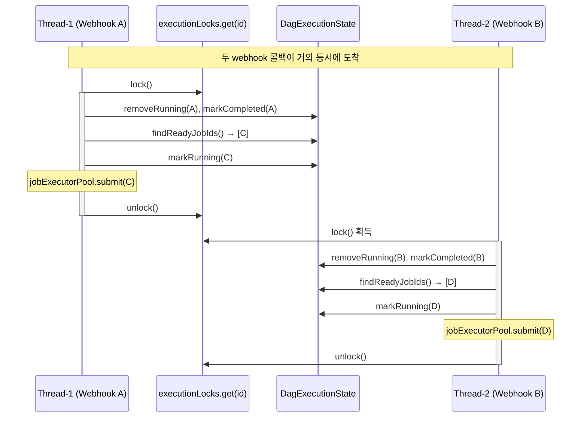

Thread-1이 lock을 보유하는 동안 Thread-2는 `lock()`에서 블로킹된다. Thread-1이 Job A 완료를 처리하고 Job C를 디스패치한 뒤 lock을 해제하면, Thread-2가 lock을 획득하여 Job B 완료를 처리하고 Job D를 디스패치한다. 만약 lock이 없었다면 두 스레드가 동시에 `findReadyJobIds()`를 호출하여 같은 Job을 중복 디스패치할 수 있었을 것이다.

---

## 관련 문서

- [01-concepts.md](01-concepts.md) — 핵심 개념과 대안 비교 (DAG, Kahn's, SAGA, Break-and-Resume 등)
- [02-code-walkthrough.md](02-code-walkthrough.md) — 11개 핵심 메서드의 실제 코드 워크스루
- [03-separation-analysis.md](03-separation-analysis.md) — DAG 엔진과 파이프라인 분리 가능성 분석
- `../review/07-phase2-dag-engine.md` — Phase 2 코드리뷰 이슈 (ENG-1~7)

