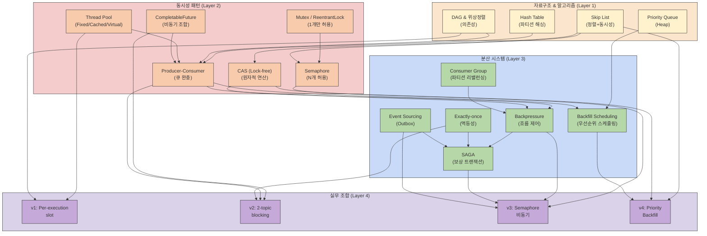

# 파이프라인 동시성 제어 — 이론 로드맵

## 왜 이 문서가 필요한가

Redpanda Playground의 파이프라인 엔진은 v1(per-execution slot) → v2(2-topic blocking) → v3(Semaphore) → v4(Priority Backfill)로 진화하면서 매 단계마다 새로운 이론이 등장했다. Semaphore를 이해하니 CAS가 나오고, 배압을 이해하니 백필 스케줄링이 나온다. 이 문서는 "다음에 뭘 공부해야 하는지" 전체 지도를 제공한다.

## 전체 지식 맵

## Layer 1: 자료구조 & 알고리즘

### Skip List

Skip List는 확률적 자료구조로, 정렬된 연결 리스트에 다단계의 "고속 레인"을 추가하여 O(log n) 탐색을 달성한다. 각 노드가 여러 레벨의 링크를 가지고 있어서, 높은 레벨에서는 많은 노드를 건너뛸 수 있다. Java의 `ConcurrentSkipListMap`이 이 구조를 사용한다.

Playground에서 Skip List는 `PriorityDispatchQueue`의 핵심 자료구조다. `createdAt`을 키로 하여 FIFO 우선순위를 자연스럽게 구현하고, 동시에 여러 스레드가 접근해도 안전하다. TreeMap을 사용하지 않는 이유는 TreeMap이 동시성 지원을 위해 synchronized 블록이 필요하기 때문이다. Skip List는 CAS(Compare-And-Swap) 기반 lock-free 알고리즘으로 동작하므로, webhook 콜백과 dispatch 로직이 동시에 접근해도 경합(contention) 없이 안전하다.

### DAG (Directed Acyclic Graph) & 위상 정렬

DAG는 방향이 있고 순환이 없는 그래프로, 의존성 관계를 표현하는 데 최적이다. 위상 정렬(Topological Sort)은 DAG에서 모든 의존성을 만족하면서 노드를 순서대로 나열하는 알고리즘이다. DFS를 이용하거나 Kahn의 알고리즘으로 구현한다.

Playground의 `DagExecutionState.findReadyJobIds()` 메서드는 위상 정렬의 변형이다. `dependsOnJobIds`가 모두 완료된 Job을 찾아서 다음 실행 대상으로 선정한다. 이 로직이 없으면 파이프라인의 Job 의존성 체인을 관리할 수 없다. 또한 DAG로 모델링하면 순환 의존성을 감지할 수 있다. Job A가 B에 의존하고 B가 A에 의존하는 상황은 DAG에서 불가능하므로, 입력 검증 단계에서 사이클 검사를 수행할 수 있다.

### Priority Queue (Heap)

Priority Queue는 최솟값 또는 최댓값을 O(1)에 접근하고, 삽입과 삭제는 O(log n)에 수행하는 자료구조다. 일반적으로 binary heap으로 구현되며, Java의 `PriorityQueue`는 min-heap 기반이다.

Playground에서 Priority Queue를 직접 사용하지는 않지만, `PriorityDispatchQueue`의 개념적 기반이다. Skip List Map이 정렬된 상태를 유지하면서도 동시성을 제공하므로, Heap 대신 Skip List를 선택했다. 하지만 "다음에 실행할 것"을 빠르게 결정해야 하는 모든 스케줄러 설계에서 Priority Queue의 원리를 이해하는 것이 중요하다.

### Hash Table & 파티션 해싱

Hash Table은 key를 해시 함수로 변환하여 버킷에 분배하는 자료구조다. 좋은 해시 함수는 버킷에 균등하게 분배하여 충돌(collision)을 최소화한다.

Playground에서 파티션 해싱은 Kafka에서 중요하다. Kafka는 메시지의 key를 `murmur2(key) % numPartitions`로 해싱하여 어느 파티션에 들어갈지 결정한다. 만약 key 분포가 편향되어 있으면 특정 파티션에 메시지가 몰린다. 이는 배압 전략 선택에 영향을 미친다. 특정 파티션이 호출량이 집중된다면, 파티션 수준의 배압을 적용해야 한다. 파티션 해싱을 이해해야 "왜 특정 파이프라인만 느린가?"를 진단할 수 있다.

## Layer 2: 동시성 패턴 (Java)

### Semaphore (Counting Semaphore)

Semaphore는 permit 카운터로 동시 접근 가능한 자원 수를 제한한다. `acquire()`는 permit을 하나 소모하고, permit이 0이면 대기한다. `release()`는 permit을 반환한다.

Mutex(Lock)가 1개만 허용하는 것과 달리, Semaphore는 N개를 허용한다. Playground의 v3 설계에서 `activePipelineSlots`가 Semaphore다. `concurrency: 3`이면 3개의 파이프라인만 동시 실행되고, 4번째 신청은 첫 번째가 완료될 때까지 기다린다.

핵심 트릭은 `acquire()`와 `release()`가 다른 클래스에서 호출될 수 있다는 점이다. `PipelineEventConsumer`에서 acquire하고, `DagExecutionCoordinator`에서 release한다. 이는 비동기 흐름에서 자연스럽게 발생한다. 자세한 내용은 [backpressure-semaphore.md](./03-backpressure-semaphore.md)를 참조한다.

### Mutex / ReentrantLock

Mutex는 한 번에 1개 스레드만 임계 구역에 진입 가능하게 한다. Java의 `synchronized` 키워드는 intrinsic lock을 사용하고, `java.util.concurrent.locks.ReentrantLock`은 explicit lock이다.

Playground의 `DagExecutionCoordinator`는 `ExecutionLock`을 사용한다. 동일한 `executionId`에 대한 동시 상태 변경을 방지하기 위함이다. Job이 완료되어 상태를 COMPLETED로 바꿀 때와, 다른 스레드가 동일 execution을 조회할 때 경합이 발생한다. Lock 없으면 상태 불일치가 생긴다.

Semaphore와 다른 점은 목적이다. Semaphore는 "몇 개까지 동시 진행 허용"이고, Mutex는 "한 번에 하나만 변경"이다. 두 가지를 함께 사용한다.

### CAS (Compare-And-Swap) — Lock-free 프로그래밍

CAS는 CPU 명령어 수준의 원자적 연산이다. "현재 값이 expected면 new로 바꿔라"를 한 번에 수행한다. 실패하면 false를 반환하고, 호출자는 재시도 또는 다른 전략을 취한다.

`AtomicInteger`, `AtomicReference`, `ConcurrentSkipListMap` 내부에서 CAS를 사용한다. ConcurrentSkipListMap은 CAS 기반으로 동작하여 lock 없이도 동시 접근이 안전하다.

CAS를 직접 사용하지 않아도, lock-free 자료구조의 원리를 이해해야 한다. "왜 synchronized 없이 ConcurrentSkipListMap이 안전한가?" 이 질문에 대답하려면 CAS 개념이 필요하다.

### CompletableFuture (비동기 조합)

CompletableFuture는 Java의 비동기 연산 조합 도구다. 콜백 체인을 피하고, `thenApply()`, `thenCompose()`, `exceptionally()` 등으로 선언적으로 흐름을 표현한다.

Playground의 v2 설계에서 `completionFuture.get()`으로 블로킹했다. 이는 비동기 프로그래밍이 아니다. get()은 완료될 때까지 스레드를 블로킹하기 때문이다. v3으로 전환하면서 이벤트 기반 아키텍처로 옮겨가며 CompletableFuture를 제거했다.

비동기 파이프라인의 "완료 신호"를 어떻게 전파하는지 이해하는 기본이다. get()으로 블로킹하면 동기 대기, thenApply()로 체인하면 비동기 콜백이다.

### Thread Pool 전략

Thread Pool은 스레드를 재사용하여 생성/소멸 오버헤드를 줄이고, 동시 스레드 수를 제어한다.

**FixedThreadPool**: 스레드 수가 고정된다. CPU 코어 수에 맞춰서 설정하면 컨텍스트 스위칭을 최소화한다. 리소스 사용이 예측 가능하다.

**CachedThreadPool**: 필요할 때 스레드를 생성하고, 60초 유휴 후 회수한다. 탄력적이지만, 부하가 높을 때 스레드가 무제한으로 증가할 수 있어 메모리 부족 위험이 있다.

**Virtual Thread (Java 21)**: OS 스레드 위에 경량 스레드를 실행한다. 블로킹 IO에 최적이다. 수천 개 동시 연결을 효율적으로 처리할 수 있다.

Playground의 `jobExecutorPool`은 CachedThreadPool이다. DAG의 Job을 병렬로 실행할 때 사용한다. 하지만 Jenkins 인스턴스가 100개로 스케일되면, CachedThreadPool의 무제한 스레드 생성이 문제가 된다. FixedThreadPool이나 Virtual Thread로 전환할 시점을 판단해야 한다.

### Producer-Consumer 패턴

Producer-Consumer 패턴은 생산자가 큐에 데이터를 넣고, 소비자가 꺼내 처리한다. 생산과 소비 속도가 다를 때, 큐가 완충 역할을 한다.

Playground 전체 구조가 이 패턴이다. REST API가 producer로 webhook을 받아 Kafka에 넣고, `PipelineEventConsumer`가 consumer로 처리한다. Kafka가 큐 역할이다.

이 패턴을 이해해야 배압의 동기를 알 수 있다. 배압은 "소비자가 생산자보다 느릴 때 어떻게 하느냐"에 대한 답이다. 소비자가 느리면 큐가 쌓인다. 큐가 무한정 커지면 메모리를 소진한다. 배압은 생산자의 속도를 제어하거나, 거부 응답을 보낸다.

## Layer 3: 분산 시스템 패턴

### Backpressure (배압)

Backpressure는 소비자가 처리 가능한 양만 생산자에게 요청하는 흐름 제어 메커니즘이다. Reactive Streams 스펙의 핵심 원리다.

Playground에서 배압의 필요성은 명확하다. Webhook 트래픽이 몰리면 파이프라인이 쌓인다. 쌓인 작업을 처리하는 데 며칠이 걸릴 수 있다. 그 동안 새 요청이 계속 들어오면 메모리 부족이 발생한다. 배압은 이를 방지한다.

Playground에서는 4가지 방식으로 배압을 구현했다: Semaphore, 파티션별 배압, concurrency 설정, 하이브리드. 각각의 트레이드오프가 있다. 자세한 내용은 backpressure 시리즈 문서를 참조한다.

### Consumer Group & Partition Rebalancing

Kafka Consumer Group은 여러 consumer가 협력하여 topic의 파티션을 나눠 처리하는 메커니즘이다. Consumer를 추가하면 자동으로 파티션이 재배분되고(rebalancing), 이전 consumer가 담당하던 파티션을 새 consumer가 인수받는다.

Playground에서 Spring Kafka가 내부적으로 consumer group을 관리한다. 특정 파티션이 느리다고 해서 consumer 수를 늘리면 rebalancing이 발생한다. 이 과정에서 메시지 처리가 일시 중단된다. 또한 rebalancing이 끝나기 전에 consumer가 다시 실패하면, 또다시 rebalancing이 발생한다. 이를 "thrashing"이라 한다.

멀티 인스턴스로 스케일아웃할 때, rebalancing이 어떻게 동작하는지 모르면 메시지 중복 소비나 유실을 예측할 수 없다.

### Exactly-once & Idempotency (멱등성)

Exactly-once 의미론은 같은 메시지를 여러 번 처리해도 결과가 동일함을 보장한다. Kafka의 정확한 정의는 복잡하지만, 핵심은 idempotency(멱등성)다.

Playground에서 `ce_id` 헤더가 idempotency key다. 같은 webhook이 여러 번 호출되어도 같은 ce_id를 가지면, 중복 처리를 감지할 수 있다. `ProcessedEventMapper`에 처리 이력을 기록하고, 기존 이력이 있으면 재처리하지 않는다.

재시도(RetryableTopic)가 있으면 같은 메시지가 여러 번 올 수 있다. 멱등성 없이 재시도하면 파이프라인이 두 번 실행되거나, Job이 중복 생성된다.

### SAGA 패턴 (보상 트랜잭션)

SAGA는 분산 환경에서 긴 트랜잭션을 여러 로컬 트랜잭션으로 분할하고, 실패 시 보상(rollback) 트랜잭션을 실행하는 패턴이다. 데이터베이스 단일 트랜잭션이 아니라, 여러 서비스 간의 보상 흐름을 조정한다.

Playground의 `DagExecutionCoordinator.finalizeExecution()`에서 execution이 실패하면 `sagaCompensationService.compensate()`를 호출한다. Jenkins 빌드가 실패했으면, 이미 배포된 아티팩트를 롤백할 수 있다. 이는 데이터베이스 rollback과 다르다. 실제 보상 동작(예: ArgoCD에서 이전 버전으로 되돌리기)을 수행해야 한다.

분산 시스템에서 "되돌리기"는 단순 rollback이 아니라 명시적 보상 동작이다.

### Event Sourcing & Outbox Pattern

Event Sourcing은 현재 상태를 저장하지 않고, 모든 상태 변경을 이벤트로 저장한다. 현재 상태는 이벤트 시퀀스를 재생해서 계산한다.

Outbox Pattern은 DB와 메시지 발행의 원자성을 보장한다. DB 트랜잭션 안에서 outbox 테이블에 이벤트를 쓰고, 별도의 프로세스가 outbox를 폴링하여 Kafka에 발행한다. DB 커밋과 Kafka 발행이 분리되어도, DB에 쓴 모든 이벤트는 Kafka에 발행된다.

"DB에 저장했는데 Kafka 발행이 실패하면?" 또는 "Kafka에 발행했는데 DB 저장이 실패하면?" 이 이중 쓰기 문제를 Outbox가 해결한다. Playground에서는 outbox 테이블에 이벤트를 쓰고, `ce_id`가 outbox의 PK다.

### Backfill Scheduling (HPC 유래)

Backfill Scheduling은 높은 우선순위 작업이 자원을 사용하지 않을 때, 낮은 우선순위 작업이 유휴 자원을 활용하는 스케줄링 알고리즘이다. 1995년 IBM의 EASY Backfill 알고리즘이 원조다. Slurm, PBS 같은 고성능 컴퓨팅(HPC) 스케줄러에 채택되었다.

Playground의 v4 설계에서 `PriorityDispatchQueue.dispatchByPriority()`가 backfill을 구현한다. 우선순위 큐를 순회하면서 이미 할당된 executor를 건너뛰고, 빈 executor에 후순위 Job을 배정한다. 예를 들어 고우선순위 Job A는 executor 1을 사용 중이고, executor 2는 비어있다면, 저우선순위 Job B를 executor 2에 배정한다. Job A가 완료되면 executor 1이 해제되고, Job C(고우선순위)는 executor 1을 획득한다.

이는 "높은 우선순위는 반드시 먼저 시작"과 다르다. 백필은 자원 효율을 높이면서도 우선순위를 존중한다. 자세한 내용은 [priority-backfill-scheduler.md](./08-priority-backfill-scheduler.md)를 참조한다.

## Layer 4: 실무 조합 — Playground 진화 맵

Playground가 진화하면서 어떤 이론이 어느 시점에 적용되었는지 정리한다. 각 버전은 이전 버전의 병목을 해결하기 위해 새 이론을 도입했다.

| 버전 | 핵심 변경 | 적용된 이론 (Layer) | 해결한 문제 |
|------|----------|-------------------|-----------|
| v1 | Per-execution slot | Thread Pool (L2), DAG (L1) | 단순 병렬 실행 |
| v2 | 2-topic blocking | CompletableFuture.get() (L2), Producer-Consumer (L2), Exactly-once (L3) | 동시 파이프라인 제한 (완료 대기) |
| v3 | Semaphore 비동기 | Semaphore (L2), Backpressure (L3), SAGA (L3), Outbox (L3) | 블로킹 제거, webhook 배압 |
| v4 | Priority Backfill | Skip List (L1), CAS (L2), Backfill Scheduling (L3), Priority Queue (L1) | 우선순위 존중 + 자원 효율 |

v1에서 v2로의 전환은 "파이프라인이 너무 오래 대기"를 해결했다. v1은 각 파이프라인마다 executor slot을 할당했는데, executor가 모두 차면 다른 파이프라인은 시작할 수 없었다. v2는 2개 topic으로 workflow를 분리하여, 첫 번째 완료 후 두 번째를 시작하는 방식으로 동시 파이프라인 수를 제한했다. 하지만 get()의 블로킹으로 인해 큰 파이프라인은 여전히 대기가 길었다.

v3에서 v2로의 전환은 "블로킹 제거"가 목표였다. Semaphore를 사용하여 동시 파이프라인 수를 제어하되, 완료를 이벤트로 신호하면서 스레드 블로킹을 제거했다. 또한 Outbox와 SAGA를 도입하여 이벤트 발행과 보상을 보장했다.

v4의 백필 스케줄링은 "우선순위와 자원 효율의 균형"을 목표다. 고우선순위 Job을 먼저 시작하되, 저우선순위 Job으로 유휴 자원을 채우는 방식이다.

## 학습 순서 추천

선행 → 후행 의존관계를 기준으로 정리한다. 위에서 아래로 학습하면 기초가 견고해진다.

### Phase 1: 기초 (1~2주)

1. **Hash Table** — Kafka 파티션 해싱의 기반. 왜 특정 파티션에 메시지가 몰리는지 이해한다.

2. **Producer-Consumer 패턴** — Kafka 전체 아키텍처의 핵심 모델. 생산자와 소비자 분리의 이점을 체득한다.

3. **DAG & 위상 정렬** — 파이프라인의 Job 의존성 관리 방식. 순환 의존성 감지의 중요성을 학습한다.

### Phase 2: 동시성 (2~3주)

4. **Mutex / Lock** — 임계 구역의 기본. 여러 스레드가 동일 자원에 접근할 때의 위험성을 인식한다.

5. **Semaphore** — Mutex의 확장. N개 동시 접근을 허용하는 방식. v3의 `activePipelineSlots`의 원리.

6. **CAS & Lock-free** — ConcurrentSkipListMap이 왜 lock 없이도 안전한지 이해한다. CPU 수준의 원자성 보장.

7. **CompletableFuture** — 비동기 조합. v2에서 v3으로 전환하면서 블로킹을 제거한 방식의 대안.

8. **Thread Pool 전략** — 스레드 생성/소멸 오버헤드를 이해하고, Fixed vs Cached vs Virtual의 선택 기준을 배운다.

### Phase 3: 분산 시스템 (3~4주)

9. **Consumer Group & Rebalancing** — Kafka 소비의 핵심. 파티션이 consumer에 자동 배분되는 메커니즘.

10. **Exactly-once & Idempotency** — 재시도 안전성. 같은 메시지가 여러 번 처리되어도 결과가 동일함을 보장한다.

11. **Outbox Pattern** — 이벤트 발행의 원자성. DB와 메시지 발행을 동일 트랜잭션으로 처리한다.

12. **SAGA** — 분산 트랜잭션의 보상. 실패 시 이전 단계를 명시적으로 되돌린다.

13. **Backpressure** — 소비자 보호 메커니즘. 4가지 방식의 트레이드오프를 이해한다.

### Phase 4: 고급 (4~5주)

14. **Skip List** — ConcurrentSkipListMap의 내부 구조. O(log n) 탐색과 동시성을 동시에 달성하는 방식.

15. **Priority Queue** — 스케줄러 설계의 기반. 최솟값/최댓값을 빠르게 추출한다.

16. **Backfill Scheduling** — HPC의 고전 알고리즘을 CI/CD에 적용. 우선순위와 자원 효율의 균형.

## 2026 최신 메타

Virtual Threads, Kafka Share Groups, Structured Concurrency, Valkey 등 2025~2026년 최신 동향은 별도 문서로 분리했다. Playground에 즉시 적용 가능한 것(Virtual Threads)부터 중장기 추적 대상(Share Groups)까지 정리되어 있다.

상세: [concurrency-2026-meta.md](./10-concurrency-2026-meta.md)

## 참조 자료

### 책

**Java Concurrency in Practice** (Brian Goetz et al.) — Layer 2 전체. Java 동시성 프로그래밍의 바이블. Mutex, Semaphore, Thread Pool, volatile, happens-before, race condition을 깊이 있게 다룬다.

**Designing Data-Intensive Applications** (Martin Kleppmann) — Layer 3 전체. 분산 시스템 입문의 필수 도서. Consumer Group, exactly-once, SAGA, Event Sourcing, Outbox를 명확하게 설명한다.

**Introduction to Algorithms** (Cormen, Leiserson, Rivest, Stein) — Layer 1. 자료구조와 알고리즘의 정석. DAG, Priority Queue, Skip List의 분석적 기초.

### 온라인

**Kafka 공식 문서**
- Consumer Group Protocol: 파티션 리밸런싱의 메커니즘
- Exactly-once Semantics: Producer, Consumer, Transaction의 조합
- Partition Assignment Strategies: Round-Robin, Range, Sticky

**Baeldung (Java tutorials)**
- Semaphore: 실제 코드 예시
- CompletableFuture: 비동기 조합 패턴
- CAS and Atomics: 원자적 연산

**Martin Fowler (분산 시스템)**
- Event Sourcing: 패턴과 트레이드오프
- SAGA: Orchestration vs Choreography
- Outbox Pattern: 원자적 발행

**SLURM 문서**
- EASY Backfill Algorithm: 원래 논문과 구현

### Playground 코드 (학습 자료)

- **DagExecutionCoordinator.java** — DAG 순회, Semaphore acquire/release, SAGA 보상, Lock 사용 예시
- **PipelineEventConsumer.java** — Producer-Consumer, Backpressure, Idempotency, RetryableTopic
- **PriorityDispatchQueue.java** — Skip List 사용, Backfill 알고리즘, CAS 기반 동시성
- **JenkinsCommandConsumer.java** — Consumer Group, 재시도 패턴
- **OutboxService.java** — Outbox Pattern 구현

## 참조 문서

- [multi-jenkins-architecture.md](./02-multi-jenkins-architecture.md) — 전체 아키텍처와 멀티 Jenkins 설계
- [priority-backfill-scheduler.md](./08-priority-backfill-scheduler.md) — 백필 스케줄러 알고리즘 상세
- [backpressure-semaphore.md](./03-backpressure-semaphore.md) — Semaphore 기반 배압 구현
- [backpressure-partition.md](./04-backpressure-partition.md) — 파티션 기반 배압
- [backpressure-concurrency.md](./05-backpressure-concurrency.md) — concurrency 설정 기반 배압
- [backpressure-hybrid.md](./06-backpressure-hybrid.md) — 하이브리드 배압 전략
- [dag-execution-engine.md](./dag-execution-engine.md) — DAG 엔진 설계 및 구현
