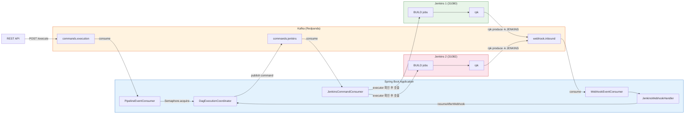
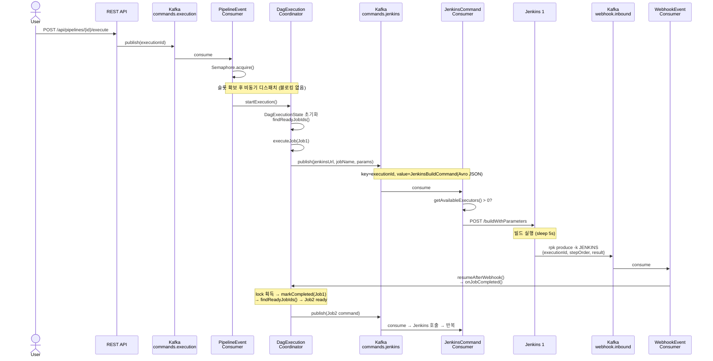
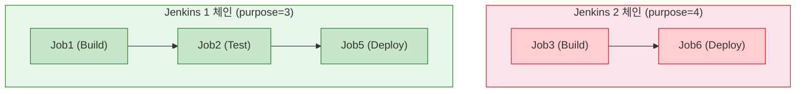

# 멀티 Jenkins 파이프라인 병렬 실행 아키텍처

## 1. 개요

Redpanda Playground의 파이프라인 실행 엔진을 단일 Jenkins에서 멀티 Jenkins로 확장하고, 파이프라인 간 병렬 실행을 지원하도록 개선했다. Redpanda Connect를 제거하고 애플리케이션이 Kafka를 직접 제어하며, Jenkins는 rpk로 Kafka에 직접 콜백을 보낸다.

**핵심 변경:**
- Connect 제거 → App이 Kafka consumer로 Jenkins 호출, Jenkins가 rpk로 콜백
- 멀티 Jenkins → Purpose(목적)의 CI_CD_TOOL 엔트리로 인스턴스 라우팅
- 파이프라인 병렬 → Semaphore로 동시 활성 수 제한, completionFuture.get() 블로킹 제거
- 이벤트 기반 executor 관리 → Job 완료 시 대기 Job 재확인, 5분 타임아웃

---

## 2. 전체 아키텍처



---

## 3. 메시지 흐름 상세

파이프라인 실행 요청부터 완료까지의 전체 메시지 흐름이다. 순서 보장은 Kafka 파티션 순서가 아닌 "이전 Job webhook 도착 → 다음 Job 커맨드 발행"이라는 인과 관계에 의존한다.



---

## 4. DAG 실행 모델

하나의 Pipeline Definition 안에 여러 독립 체인이 공존할 수 있다. 의존성이 없는 Job은 동시에 디스패치되고, 각 체인은 서로 다른 Jenkins에서 병렬 실행된다.



**실행 순서 결정 로직** (`dispatchReadyJobs()`):

1. `DagExecutionState.findReadyJobIds()` — dependsOnJobIds가 모두 완료된 Job을 찾는다
2. 각 ready Job의 `purposeId` → `JenkinsInstanceResolver.resolveForPurpose()` → Jenkins 인스턴스 해석
3. `jenkinsAdapter.getAvailableExecutors(tool)` — 해당 Jenkins의 executor 가용 확인
4. 가용하면 디스패치, 부족하면 WAITING_EXECUTOR 상태로 대기

독립 체인의 Job은 동시에 ready가 되므로 t0에 함께 디스패치된다. 의존성 체인 내에서는 이전 Job의 webhook이 도착해야 다음 Job이 ready가 된다.

---

## 5. Executor 가용성 관리

Jenkins 큐에 빌드를 쌓지 않고, executor가 가용할 때만 트리거한다. Jenkins가 다운되어도 메시지는 Kafka에 남아 복구 가능하다.

### 2단계 확인

| 단계 | 위치 | 동작 |
|------|------|------|
| Level 1 | DagExecutionCoordinator.dispatchReadyJobs() | DAG ready Job에 대해 Jenkins executor 확인. 부족하면 WAITING_EXECUTOR |
| Level 2 | JenkinsCommandConsumer.triggerJenkinsBuild() | Kafka에서 소비 후 Jenkins API 호출 전 재확인. 부족하면 retry topic |

### 이벤트 기반 대기 (폴링 없음)

Playground 전용 Jenkins이므로 모든 executor 변화가 우리 시스템의 이벤트(webhook)로 감지된다.

```
Job 완료 → onJobCompleted()
  ├─ 현재 실행의 dispatchReadyJobs() — 다음 DAG Job 디스패치
  └─ wakeUpWaitingExecutions(jenkinsUrl) — 같은 Jenkins를 기다리는 다른 실행도 재확인
```

### 타임아웃

`checkWaitingJobTimeouts()` (60초 주기)가 5분 초과 대기 Job을 FAILED로 전환한다.

### 상태 전이

```
PENDING → WAITING_EXECUTOR (executor 부족)
                ↓ (executor 해제 이벤트)
        → RUNNING → WAITING_WEBHOOK (Jenkins 빌드 중)
                         ↓ (rpk webhook)
                    → SUCCESS / FAILED
```

---

## 6. 파이프라인 병렬 실행

### 배압 (Backpressure)

Semaphore로 동시 활성 파이프라인 수를 제한한다. Consumer가 `acquire()`로 슬롯을 확보하고, 파이프라인 완료 시 `finalizeExecution()`에서 `release()`로 반환한다. 블로킹 없이 비동기로 실행하되, 동시 실행 수만 N개로 제한하는 "비대칭 제어"가 핵심이다.

Semaphore 원리, 슬롯 변화 예시, 구현 코드 상세: [03-backpressure-semaphore.md](./03-backpressure-semaphore.md)
구현 코드 전체 해설: [09-priority-backfill-implementation.md](./09-priority-backfill-implementation.md)

### 배압(Backpressure) 방식 비교

배압을 구현하는 방법은 여러 가지다. 각 방식의 상세 분석은 별도 문서에서 다룬다.

| 방식 | 제어 위치 | 블로킹 모델 | 동시 실행 보장 | 동적 조절 | 멀티 인스턴스 | 재시도 |
|------|----------|------------|--------------|----------|-------------|--------|
| **[Semaphore](./03-backpressure-semaphore.md)** | 앱 코드 (JVM) | 비동기 (execute 즉시) | 정확히 N개 | release(n) 가능 | 분산 Semaphore 필요 | acquire 블로킹 중 불가 |
| **[파티션 수 제한](./04-backpressure-partition.md)** | Kafka 인프라 | 블로킹 OK | 편향 시 불균형 | rpk로 가능하나 운영 부담 | 자연스럽게 분산 | 자동 (파티션 내 순서) |
| **[concurrency 설정](./05-backpressure-concurrency.md)** | Spring 설정 | 블로킹 OK | 정확히 N개 | 재시작 필요 | 자연스럽게 분산 | 자동 (스레드별) |
| **[하이브리드](./06-backpressure-hybrid.md)** | 앱 코드 + Spring | 비동기 | 정확히 N개 | Semaphore만 가능 | 분산 Semaphore 필요 | tryAcquire + retry topic |

현재 구현은 Semaphore 단독 방식이며, 배압 방식은 확정이 아니다. 각 방식의 트레이드오프를 검토한 후 결정한다.

### 크로스 파이프라인 executor 경쟁

Pipeline A와 B가 같은 Jenkins를 타겟할 때, executor는 글로벌하게 경쟁한다. A의 Job이 완료되면 B의 대기 Job도 `wakeUpWaitingExecutions()`로 재확인된다.

---

## 7. Jenkins Webhook (rpk)

### 기존 (Connect 경유)
```
Jenkins → HTTP POST → Redpanda Connect → Kafka(webhook.inbound)
```

### 변경 (rpk 직접)
```
Jenkins → /var/jenkins_home/rpk → Kafka(webhook.inbound)
```

Jenkins Helm values의 initScripts에 Groovy RunListener를 등록한다. 빌드 완료 시 `rpk topic produce`로 Kafka에 직접 메시지를 발행한다.

### 메시지 포맷

```json
{
  "executionId": "uuid",
  "stepOrder": 1,
  "result": "SUCCESS",
  "buildNumber": 45,
  "jobName": "BUILD/playground-job-60",
  "duration": 36485,
  "url": "http://..."
}
```

- Topic: `playground.webhook.inbound`
- Key: `JENKINS` (WebhookEventConsumer의 소스 라우팅용)

---

## 8. 인프라 구성

### Jenkins 인스턴스

| 항목 | Jenkins 1 | Jenkins 2 |
|------|-----------|-----------|
| 네임스페이스 | rp-jenkins | rp-jenkins-2 |
| NodePort | 31080 | 31082 |
| 계정 | admin / admin | admin / admin |
| rpk 경로 | /var/jenkins_home/rpk | /var/jenkins_home/rpk |
| Helm release | jenkins | jenkins-2 |

### Purpose 매핑

| Purpose | ID | CI_CD_TOOL | LIBRARY | VCS |
|---------|------|------------|---------|-----|
| default | 3 | Jenkins 1 (31080) | Nexus | GitLab |
| jenkins-2 | 4 | Jenkins 2 (31082) | Nexus | GitLab |

### Kafka Topics

| Topic | 용도 | Key |
|-------|------|-----|
| playground.pipeline.commands.execution | 파이프라인 실행 트리거 | executionId |
| playground.pipeline.commands.jenkins | Jenkins 빌드 커맨드 | executionId |
| playground.webhook.inbound | Jenkins 빌드 완료 콜백 | JENKINS |

---

## 9. 수정 파일 목록

### 신규 파일

| 파일 | 설명 |
|------|------|
| `pipeline/.../event/JenkinsCommandConsumer.java` | Kafka consumer → executor 확인 → Jenkins REST API 호출 |
| `pipeline/.../port/JenkinsInstanceResolver.java` | Purpose → Jenkins 인스턴스 해석 포트 |
| `app/.../adapter/JenkinsInstanceResolverAdapter.java` | PurposeEntry(CI_CD_TOOL) → SupportTool → JenkinsToolInfo |
| `app/.../db/migration/V42__add_max_executors_to_support_tool.sql` | support_tool에 max_executors 컬럼 추가 |

### 수정 파일

| 파일 | 변경 내용 |
|------|-----------|
| `DagExecutionCoordinator.java` | waitingJobs 관리, per-job Jenkins 해석, 크로스 파이프라인 wake-up, WAITING_EXECUTOR, 타임아웃 |
| `PipelineEventConsumer.java` | completionFuture.get() → Semaphore 비동기 |
| `PipelineCommandProducer.java` | jobExecution.getJenkinsToolInfo() 우선 사용 |
| `JenkinsAdapter.java` | 모든 public 메서드에 JenkinsToolInfo 오버로드 추가 |
| `JenkinsReconciler.java` | purposeId별 그룹핑 → 멀티 Jenkins reconcile |
| `PipelineJobExecution.java` | transient jenkinsToolInfo 필드 |
| `JobExecutionStatus.java` | WAITING_EXECUTOR enum 추가 |
| `PipelineProperties.java` | maxActivePipelines, executorWaitTimeoutMinutes 추가 |
| `PipelineConfig.java` | CachedThreadPool + activePipelineSlots Semaphore bean |
| Frontend (5개) | WAITING_EXECUTOR 상태 표시 (dagStyles, ExecutionCard, PipelineDetailPage 등) |
