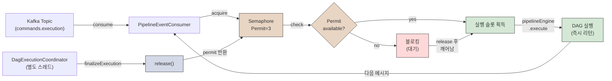

# Java Semaphore 기반 배압 (Backpressure)

## 개요

Redpanda Playground의 파이프라인 병렬 실행에서 현재 사용 중인 배압 방식이다. `java.util.concurrent.Semaphore`의 permit 카운터로 동시 활성 파이프라인 수를 제한한다. Consumer 스레드는 메시지를 빠르게 소비하되, DAG 실행은 N개까지만 허용하는 "비대칭 제어"가 핵심이다.

## 원리

### Semaphore란?

Semaphore는 동시에 접근 가능한 자원의 수를 제한하는 동시성 제어 도구다. 내부에 permit(허가증) 카운터를 갖는다.

- `acquire()` 메서드는 permit을 1개 소모한다. 남은 permit이 0이면 스레드가 블로킹된다.
- `release()` 메서드는 permit을 1개 반환한다. 블로킹된 스레드가 있으면 깨운다.

Mutex(Lock)가 "한 번에 1개"만 허용하는 것과 달리, Semaphore는 "한 번에 N개"를 허용한다. 예를 들어 permit이 3이면 3개의 스레드가 동시에 진입할 수 있고, 4번째 스레드는 누군가 release할 때까지 대기한다.

### 파이프라인에서의 동작

파이프라인 실행 흐름은 다음과 같이 진행된다.



위 흐름은 다음 특징을 보인다.

**Consumer 스레드는 빠르게 순환한다.** Kafka에서 메시지를 하나 소비하자마자 `acquire()`로 슬롯을 요청한다. 슬롯이 있으면 즉시 확보하고, 다음 메시지를 소비한다. 실제 파이프라인 실행(`pipelineEngine.execute()`)은 별도 스레드(Executor)에서 진행되므로, Consumer는 블로킹되지 않는다.

**DAG 실행은 느리게 진행된다.** 실행 중인 파이프라인이 완료되려면 Jenkins job이 끝나고, 상태 조정과 SAGA 보상이 모두 끝나야 한다. 이 시간 동안 다른 파이프라인은 들어오지 못한다.

**결과적으로 permit 수만큼 정확히 동시 실행된다.** permit이 3이면, 아무리 메시지가 들어와도 최대 3개만 병렬로 실행된다.

### 왜 배압이 필요한가?

Jenkins executor는 유한한 자원이다. 제한 없이 파이프라인을 실행하면 두 가지 문제가 생긴다.

**첫 번째는 Jenkins executor 고갈이다.** Playground의 Jenkins는 executor 슬롯이 제한되어 있다. 슬롯이 가득 차면 대부분의 Job이 WAITING_EXECUTOR 상태로 떨어진다. 문제는 시스템이 이제 의미 없는 상태 관리에만 리소스를 소모한다는 것이다. Job이 언제 실행될지 불명확하고, 프론트엔드 사용자는 무한 대기 상태를 본다.

**두 번째는 메모리 압박이다.** 각 파이프라인마다 DagExecutionState를 메모리에 유지한다. 허용되는 동시 파이프라인 수가 많아질수록 메모리 사용량이 선형으로 증가한다. 극한 상황에서는 Out of Memory 에러가 발생한다.

Semaphore가 배압(backpressure) 역할을 하여, 처리 가능한 양만 시스템에 진입시킨다. 미소비 메시지는 Kafka 토픽에 안전하게 보존된다. 실행 완료되어 permit이 반환되면, 다음 대기 중인 파이프라인이 들어온다. 이렇게 흐름 제어를 통해 시스템이 안정적으로 유지된다.

## 구현 코드

### 설정 — Semaphore Bean 등록

```java
@Configuration
@EnableConfigurationProperties(PipelineProperties.class)
public class PipelineConfig {

    @Bean(value = "jobExecutorPool", destroyMethod = "shutdown")
    public ExecutorService jobExecutorPool() {
        return Executors.newCachedThreadPool();
    }

    @Bean
    public Semaphore activePipelineSlots(PipelineProperties props) {
        return new Semaphore(props.maxActivePipelines());  // 기본값 5
    }
}
```

Semaphore를 Spring Bean으로 등록한다. 이렇게 하면 전체 애플리케이션에서 동일한 Semaphore 인스턴스를 사용한다. permit 수는 설정 파일에서 조절 가능하므로, 배포 환경에 따라 유연하게 조정할 수 있다.

### 프로퍼티

```java
@ConfigurationProperties(prefix = "pipeline")
public record PipelineProperties(
        int maxConcurrentJobs,
        int webhookTimeoutMinutes,
        int maxActivePipelines,         // ← Semaphore permit 수 (기본 5)
        int executorWaitTimeoutMinutes
) {
    public PipelineProperties {
        if (maxActivePipelines <= 0) maxActivePipelines = 5;
    }
}
```

설정 값이 유효하지 않으면 기본값으로 초기화한다. `maxActivePipelines`이 5 이하이면 그냥 진행하고, 0 이하이면 5로 설정한다. 이렇게 방어적으로 처리하면 설정 오류로 인한 런타임 장애를 방지할 수 있다.

### 진입 — 비동기 디스패치

```java
private void runPipelineAsync(PipelineExecution execution, UUID executionId) {
    try {
        activePipelineSlots.acquire();           // 슬롯 확보 (없으면 블로킹)
    } catch (InterruptedException e) {
        Thread.currentThread().interrupt();
        return;
    }

    try {
        pipelineEngine.execute(execution);       // 즉시 리턴
    } catch (Exception e) {
        activePipelineSlots.release();            // 실패 시 즉시 반환
    }
    // 정상 실행이면 release하지 않음 → finalizeExecution()에서 release
}
```

메서드가 호출되면 먼저 `acquire()`를 시도한다. 슬롯이 없으면 여기서 블로킹된다. 이 메서드가 호출되는 PipelineEventConsumer 스레드가 블로킹되지만, Consumer는 보통 스레드 풀에서 실행되므로 전체 메시지 소비에는 지장이 없다(다른 파이프라인 메시지를 처리하는 스레드가 있기 때문).

슬롯을 확보하면 `pipelineEngine.execute()`를 호출한다. 이 메서드는 즉시 리턴한다. 실제 파이프라인 실행은 Executor 스레드 풀에서 비동기로 진행된다.

예외 발생 시 catch 블록에서 슬롯을 반환한다. 정상 실행된 경우는 반환하지 않는다. 왜냐하면 실행 완료(`finalizeExecution`)에서 release할 것이기 때문이다. 이중 반환을 방지하기 위해 finally 블록에 넣지 않는다.

### 완료 — 슬롯 반환

```java
private void finalizeExecution(UUID executionId, DagExecutionState state) {
    try {
        // ... 상태 업데이트, SAGA 보상, 이벤트 발행 ...
    } finally {
        activePipelineSlots.release();           // 항상 슬롯 반환
    }
}
```

파이프라인 실행이 완료되면 반드시 슬롯을 반환해야 한다. 예외 발생 여부와 관계없이 release하기 위해 finally 블록에 넣는다. 만약 실수로 release를 빠뜨리면, permit이 하나씩 줄어들어 결국 모든 슬롯이 고갈된다.

### 슬롯 변화 예시

다음은 시간에 따른 permit 변화를 보여준다. 초기 permit은 3이고, 3개 파이프라인이 순차적으로 들어오는 시나리오다.

```
시간  | 이벤트                    | permit | 설명
-----|--------------------------|--------|------
t0   | 초기 상태                 | 3/3    | 아무것도 실행 안 됨
t1   | P1 acquire()              | 2/3    | 첫 파이프라인 슬롯 확보
t2   | P2 acquire()              | 1/3    | 두 번째 파이프라인 슬롯 확보
t3   | P3 acquire() → 블로킹      | 0/3    | 세 번째는 슬롯이 없어 대기
     | P1 → Jenkins에서 실행 중  |        | 
     | P2 → Jenkins에서 실행 중  |        | 
     | P3 → 아직 실행 안 됨       |        | 
t4   | P1 finalize() → release() | 1/3    | P1 완료, 슬롯 반환
     | P3 acquire() 깨어남        | 0/3    | P3가 대기에서 깨어나 슬롯 확보
     | P3 → Jenkins에서 실행 시작 |        | 
t5   | P2 finalize() → release() | 1/3    | P2 완료, 슬롯 반환
t6   | P3 finalize() → release() | 2/3    | P3 완료, 슬롯 반환 (유휴)
```

t3에서 P3는 `acquire()` 호출 후 블로킹된다. 하지만 P1과 P2는 이미 Jenkins에서 실행 중이므로, P3를 위한 슬롯이 생길 때까지 기다린다. t4에서 P1이 완료되고 release()가 호출되면, P3가 깨어나서 슬롯을 확보한다.

## 장점

| 항목 | 설명 |
|------|------|
| 비대칭 제어 | Consumer 스레드 1개로 소비하되, 동시 실행은 N개까지 제한 가능. 소비와 완료가 다른 스레드에서 일어나는 비동기 모델에 최적이다. Consumer가 블로킹되어도 메시지 손실이 없으므로 안전하다. |
| 구현 단순성 | Spring Bean 1개 + acquire/release 2줄로 완성된다. 추가 인프라(Redis, 분산 락 서버)가 불필요하고, 코드 복잡도가 낮다. |
| 정확한 N개 보장 | permit 수만큼 정확히 동시 실행된다. Kafka 파티션 수에 따른 편향이나 불균형이 없다. 항상 설정값 그대로 동작한다. |
| 동적 조절 가능 | `release(n)`으로 런타임에 permit을 추가할 수 있다. Jenkins 인스턴스 추가 이벤트를 구독하면 자동으로 슬롯을 확장 가능하다. |

## 한계

| 항목 | 설명 | 영향 |
|------|------|------|
| acquire() 블로킹 시 재시도 불가 | Consumer 스레드가 `acquire()`에서 멈추면, 해당 스레드로 들어오는 메시지의 재시도 처리가 불가능하다. | 슬롯 부족이 장기화되면 Consumer health check가 실패할 수 있다. Kafka broker 입장에서는 Consumer가 살아있지만 진행이 안 되는 것으로 보인다. |
| 단일 인스턴스 전제 | Java Semaphore는 JVM 내 메모리 객체다. 앱을 여러 인스턴스로 스케일아웃하면 각 인스턴스가 독립적인 Semaphore를 갖게 된다. | 멀티 인스턴스 환경에서는 전체 동시 실행이 `maxActivePipelines × 인스턴스 수`가 되므로 의도한 배압이 작동하지 않는다. Redis 분산 Semaphore가 필요하다. |
| 재시작 시 상태 유실 | permit 카운터는 메모리에만 존재한다. 앱 재시작하면 초기값으로 리셋된다. | 재시작 직전에 실행 중이던 파이프라인의 진행 상태가 손실될 수 있다. DB 기반 초기화로 부분 보완 가능하다. |
| permit 감소 위험 | release()보다 acquire()가 많으면 permit이 음수로 갈 수 있다. 이는 논리 버그를 나타낸다. | 음수 permit은 세마포어 불변식(invariant)을 위반한다. 이후 모든 acquire() 호출이 예상과 다르게 동작할 수 있다. |

acquire와 release 호출이 정확히 1:1로 맞아떨어지도록 주의해야 한다. 실무에서는 finally 블록에 release를 반드시 넣고, 모든 경로에서 acquire 전에 실패하는 경우는 release하지 않도록 처리한다.

## 적합한 상황

Semaphore 기반 배압은 다음과 같은 상황에서 효과적이다.

**단일 인스턴스 앱에서 동시 실행 수를 제한해야 할 때.** 분산 시스템이 아니고, 하나의 JVM에서만 실행된다면 Semaphore는 완벽한 선택이다. Playground는 현재 단일 인스턴스이므로 이 요구사항을 만족한다.

**소비(consume)와 완료(complete)가 비동기로 분리된 이벤트 기반 아키텍처.** Kafka Consumer가 메시지를 빠르게 읽지만, 실제 처리는 별도 스레드에서 진행되는 구조에 최적이다. Playground의 구조가 정확히 이것이다.

**Jenkins executor처럼 외부 자원의 가용성에 따라 배압을 걸어야 할 때.** 외부 서비스의 용량 부족을 감지하여 즉시 시스템 진입을 막아야 한다면, Semaphore의 동적 조절이 유용하다.

**PoC나 소규모 시스템에서 빠르게 배압을 구현해야 할 때.** 프로토타입 단계에서는 Redis 분산 락 같은 무거운 솔루션보다, 간단한 Semaphore로 충분하다. Playground는 학습 프로젝트이므로 이 범주에 해당한다.

## 참조

- [multi-jenkins-architecture.md](./02-multi-jenkins-architecture.md) — 전체 아키텍처와 멀티 Jenkins 설계
- [pipeline-flow.md](./pipeline-flow.md) — 파이프라인 실행 흐름과 상태 변이
- [dag/dag-execution.md](./dag/dag-execution.md) — DAG 실행 엔진 상세 구현
