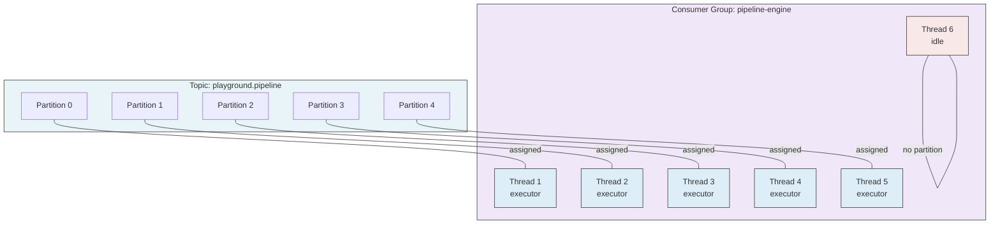
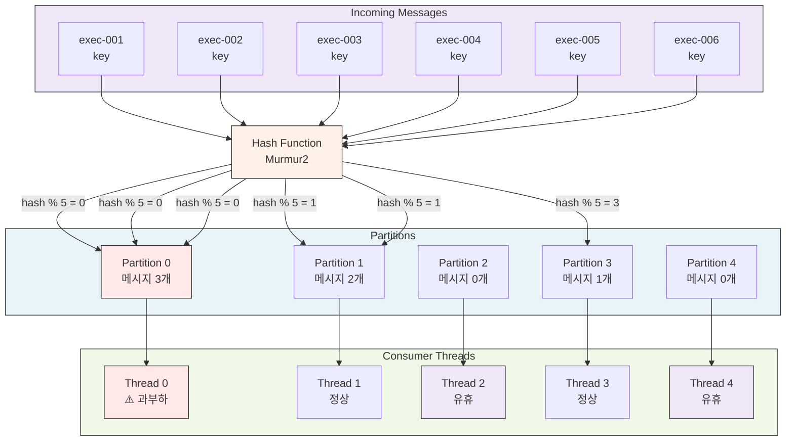

# Kafka 파티션 수 기반 배압 (Backpressure)

## 개요

Kafka Consumer Group에서 1개 파티션은 최대 1개 Consumer 스레드에 할당된다. 이 특성을 이용하여 토픽의 파티션 수 자체를 병렬성의 상한으로 사용하는 배압 방식이다. 코드 변경 없이 인프라 설정만으로 동시 처리량을 제어할 수 있다는 점이 특징이다.

## 원리

### 파티션과 Consumer의 관계

Kafka Consumer Group 내에서 하나의 파티션은 반드시 하나의 Consumer에게만 할당된다. 이는 Kafka의 기본 설계 원칙이며, 같은 파티션을 여러 Consumer가 동시에 소비할 수 없다는 의미이다. Consumer가 파티션보다 많으면 남는 Consumer는 idle 상태가 되어 할당 대기 상태로 유지된다.



### 파이프라인에서의 동작

파티션이 5개인 토픽에 파이프라인 실행 메시지가 들어오면, 메시지의 key를 기반으로 한 해싱에 의해 특정 파티션에 배정된다. 각 파티션의 Consumer 스레드는 독립적으로 메시지를 처리하므로, 최대 5개 파이프라인이 동시에 실행될 수 있다. 이는 파티션 수가 동시 처리의 자연스러운 상한선이 된다는 의미이다.

블로킹 모델(completionFuture.get())을 사용해도 문제없다. 각 스레드가 독립 파티션을 갖고 있으므로, 한 스레드가 블로킹되어 파이프라인 완료를 기다려도 다른 파티션을 담당하는 다른 스레드에는 영향을 주지 않는다. 이것이 파티션 기반 배압의 강점이다.

### key 해싱과 파티션 편향

Kafka는 메시지의 key를 내부 해싱 함수(기본적으로 Murmur2)를 통해 처리하여 파티션을 결정한다. 이론적으로 executionId가 UUID인 경우 파티션 분산이 균등할 것으로 기대되지만, 실무에서는 보장되지 않는다. 특정 시간대에 해시 충돌이나 분포 왜곡이 발생하면 일부 파티션에 메시지가 몰릴 수 있다.



파티션 0에 3개 메시지가 몰려 있는데, 다른 파티션(2, 4)은 아예 메시지가 없다. 이 경우 Partition 0을 담당하는 스레드는 과부하 상태가 되고, Thread 2와 Thread 4는 유휴 상태로 남는다. 이것이 파티션 기반 배압의 주요 한계이다.

## 구현 코드

### 토픽 생성 (rpk)

```bash
rpk topic create playground.pipeline.commands.execution \
    --partitions 5 \
    --config retention.ms=604800000
```

이 명령어는 5개 파티션을 가진 토픽을 생성한다. 7일(604800000ms) 동안 메시지를 보존한다. 파티션 수는 병렬 처리의 상한선이므로 신중하게 선택해야 한다.

### Consumer 설정 (Spring Kafka)

```java
@KafkaListener(
    topics = Topics.PIPELINE_CMD_EXECUTION,
    groupId = "pipeline-engine",
    concurrency = "5",  // 파티션 수에 맞춤
    properties = {"auto.offset.reset=earliest"}
)
public void onPipelineEvent(ConsumerRecord<String, byte[]> record) {
    PipelineExecution execution = deserialize(record.value());
    runPipelineBlocking(execution);  // 블로킹 OK — 스레드별 독립 파티션
}
```

concurrency 값을 파티션 수와 일치시키는 것이 중요하다. 5개 파티션이면 concurrency를 5로 설정하면, Spring Kafka가 정확히 5개 스레드를 생성하고 각각 1개 파티션을 할당받는다. 블로킹 호출(runPipelineBlocking)도 안전하다. 한 스레드가 블로킹되어도 다른 4개 스레드는 독립적으로 메시지를 처리하기 때문이다.

### 런타임 파티션 변경 (rpk)

```bash
# 파티션 수 증가 (줄이기는 불가능)
rpk topic alter-partitions playground.pipeline.commands.execution --num 10
```

파티션 수를 5개에서 10개로 증가시킨다. Kafka의 기본 설계상 파티션을 줄일 수는 없다. 줄이려면 토픽을 삭제하고 새로 생성해야 한다.

**주의: 파티션 수를 늘리면 기존 key의 파티션 배정이 변할 수 있다.** 예를 들어, exec-001이라는 key가 기존에는 Partition 1에 배정되었다면, 파티션이 10개로 늘어난 후에는 Partition 6에 배정될 수도 있다. 진행 중인 파이프라인의 후속 메시지(예: 상태 업데이트, 롤백)가 다른 파티션으로 가면 순서가 꼬질 수 있다. 따라서 파티션 변경은 모든 진행 중인 작업이 완료된 후에 수행해야 한다.

## 장점

| 항목 | 설명 |
|------|------|
| 인프라 레벨 제어 | 코드 변경 없이 rpk 명령어로 병렬성 조절. 애플리케이션 배포 불필요하므로 빠른 대응 가능 |
| 블로킹 모델 호환 | 스레드별 독립 파티션이므로 completionFuture.get() 블로킹이 다른 파이프라인에 영향 없음. 동기적 처리 모델에 최적화 |
| 자연스러운 분산 | 멀티 인스턴스 환경에서 Kafka Broker가 파티션을 인스턴스 간에 자동 분배. Semaphore 같은 추가 분산 인프라 불필요 |
| 상태 없음 | 토픽 설정에 상태가 내재되어 있음. 애플리케이션 인스턴스가 재시작되어도 파티션 배정은 Kafka Broker가 관리하므로 일관성 유지 |
| 스케일 아웃 용이 | 새 인스턴스를 추가하면 Kafka가 자동으로 파티션을 재분배. Consumer Group 재조정(Rebalancing)이 자동 수행 |

## 한계

| 항목 | 설명 | 영향 |
|------|------|------|
| key 해싱 편향 | 동일 파티션에 메시지가 몰리면 해당 스레드만 과부하, 나머지는 idle. 균등 분산이 보장되지 않음 | "정확히 N개 동시 실행"을 보장할 수 없음. 최악의 경우 모든 메시지가 1개 파티션에 몰릴 가능성(확률은 낮지만 이론적으로 가능) |
| 파티션 수 감소 불가 | Kafka의 기본 설계상 파티션은 늘리기만 가능, 줄이기 불가능. 줄이려면 토픽 재생성 필요 | 런타임 동적 조절에 한계. 파티션을 과다 할당했다면 성능 낭비 |
| 파티션 수 = 동시 처리 수가 아님 | 파티션은 "Consumer 할당 단위"이지 "동시 파이프라인 수"가 아님. 비동기 처리 모델에서는 1 스레드로 여러 파이프라인을 처리 가능하므로 비효율적 | 비동기 모델에서는 스레드 수를 줄일 수 있지만, 파티션 수는 늘어남. 리소스 낭비 |
| 순서 의존성 | 같은 파티션 내 메시지는 반드시 직렬 처리. 앞 파이프라인이 끝나야 뒤 파이프라인 시작 가능 | 특정 파티션의 파이프라인이 느리면 뒤 메시지가 지연됨. 파티션 편향 발생 시 전체 처리량 저하 |
| 파티션 간 순서 미보장 | 다른 파티션 메시지들은 순서가 보장되지 않음 | 같은 사용자의 연속된 요청도 순서가 섞일 수 있음 |

## Playground에서 채택하지 않은 이유

Playground의 파이프라인 실행은 비동기 모델이다. Consumer가 메시지를 소비하면 execute() 메서드가 즉시 반환(Job 객체 생성)하고, 파이프라인 실행 상태(완료, 실패 등)는 수분 후 Jenkins webhook을 통해 별도로 전달된다. 이 구조에서 파티션 수로 배압을 제어하면, Consumer 스레드 수 = 최대 동시 파이프라인 수가 되어 비효율적이다.

구체 예시: 파티션 10개, Consumer 10개 스레드가 있다고 가정하자. Consumer는 10개 메시지를 수신한 후 10개 Job을 생성하고 즉시 반환한다. 그 다음 순간부터 10개 스레드는 다음 메시지를 대기한다. 하지만 Jenkins는 아직 Job을 실행 중이다(5분 후 완료). 이 시간 동안 Consumer 스레드 10개는 모두 idle 상태이다. 비동기 모델에서는 1개 스레드로 50개, 100개 Job을 관리할 수 있는데, 파티션 기반 배압을 쓰면 10개 스레드를 낭비하는 것이다.

따라서 Playground는 Java Semaphore를 이용한 배압(backpressure-semaphore.md) 또는 Spring Kafka의 pause/resume 방식(backpressure-concurrency.md)을 사용한다.

## 적합한 상황

파티션 기반 배압이 효과적인 워크로드는 다음과 같다.

1. **동기적 처리 모델**: Consumer가 메시지를 받아 처리를 완료할 때까지 스레드가 블로킹되는 구조. 예를 들어, HTTP 동기 API 처리, 데이터베이스 쓰기 작업 완료 대기 등이 해당한다. 이 경우 파티션 수 = 병렬도이므로 배압이 자연스럽다.

2. **멀티 인스턴스 분산 환경**: 추가 인프라(Redis Semaphore 등)를 도입하지 않고 Kafka 자체의 파티션 분배 기능으로 인스턴스 간 부하 균형을 맞추고 싶을 때. Consumer Group Rebalancing이 자동 수행되므로 별도 코드 불필요.

3. **key 분포가 균등한 워크로드**: executionId처럼 균등 분산되는 key를 사용하여 파티션 편향이 발생하지 않는 경우.

4. **병렬성 변경이 드물고 장기 유지**: 한 번 파티션 수를 설정한 후 오래 유지되는 시스템. 파티션 변경의 위험(key 재배정)이 낮음.

5. **낮은 지연시간 요구하지 않음**: 파티션 편향 발생 시 일부 메시지가 지연될 수 있으므로, SLA가 엄격하지 않은 백그라운드 작업에 적합.

## 참조

- [multi-jenkins-architecture.md](./02-multi-jenkins-architecture.md) — 전체 아키텍처 설계
- [backpressure-semaphore.md](./03-backpressure-semaphore.md) — Java Semaphore를 이용한 배압 (현재 Playground 구현)
- [backpressure-concurrency.md](./05-backpressure-concurrency.md) — Spring Kafka pause/resume 배압 방식
- [backpressure-hybrid.md](./06-backpressure-hybrid.md) — 하이브리드 조합 (실무 추천)
