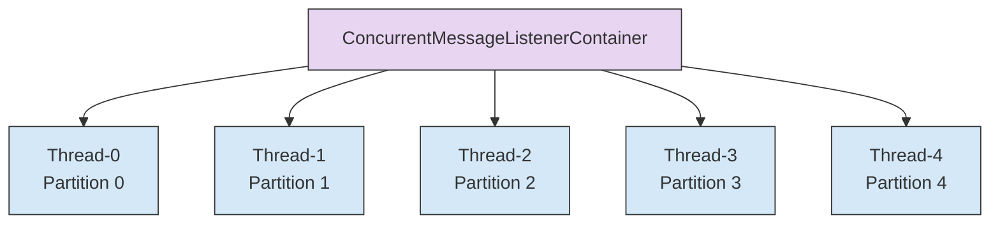

# Spring Kafka concurrency 기반 배압 (Backpressure)

## 개요

Spring Kafka의 `@KafkaListener(concurrency = "N")` 설정으로 Consumer 스레드 수를 제한하는 배압 방식이다. 설정 한 줄로 병렬성을 제어할 수 있어 구현이 간단하고, 블로킹 모델과 자연스럽게 호환된다. 각 스레드가 독립적으로 메시지를 처리하므로 한 스레드의 블로킹이 다른 스레드에 영향을 주지 않는다.

## 원리

### ConcurrentMessageListenerContainer

Spring Kafka는 concurrency 값만큼 `KafkaMessageListenerContainer`를 생성한다. 각 Container는 독립 스레드에서 poll → 처리 → poll 루프를 반복한다.



각 Container는 할당받은 파티션에서 독립적으로 메시지를 소비하고 처리한다. concurrency = 5라면 5개의 Container 인스턴스가 5개의 독립 스레드에서 동시에 실행된다.

### 블로킹 모델과의 호환

concurrency = 5로 설정하면 5개 스레드가 각각 독립 파티션을 소비한다. 하나의 스레드에서 `completionFuture.get()`으로 블로킹해도, 다른 4개 스레드는 영향 없이 계속 소비한다. 파이프라인 하나의 완료를 기다리는 동안 해당 스레드는 점유되지만, 나머지 스레드들은 병렬로 다른 파이프라인을 처리한다.

### 파이프라인에서의 동작

실제 메시지 처리 흐름은 다음과 같다:

```
Thread-0: consume(msg1) → runPipelineBlocking() → 10분 블로킹 → 완료 → consume(msg6)
Thread-1: consume(msg2) → runPipelineBlocking() → 3분 블로킹 → 완료 → consume(msg7) → ...
Thread-2: consume(msg3) → runPipelineBlocking() → 7분 블로킹 → 완료 → consume(msg8)
Thread-3: consume(msg4) → runPipelineBlocking() → 5분 블로킹 → 완료 → consume(msg9)
Thread-4: consume(msg5) → runPipelineBlocking() → 2분 블로킹 → 완료 → consume(msg10)
```

각 스레드가 파이프라인 하나를 완료할 때까지 점유하므로, concurrency = 동시 파이프라인 수가 된다. Thread-1이 3분 만에 완료되고 Thread-0이 아직 10분을 기다리고 있어도, Thread-1은 msg7을 소비하고 다시 블로킹을 시작한다. 이렇게 각 스레드는 독립적으로 동작한다.

## 구현 코드

### 기본 설정

`@KafkaListener` 애너테이션의 concurrency 파라미터로 스레드 수를 지정한다:

```java
@KafkaListener(
    topics = Topics.PIPELINE_CMD_EXECUTION,
    groupId = "pipeline-engine",
    concurrency = "5",  // ← Consumer 스레드 5개
    properties = {"auto.offset.reset=earliest"}
)
public void onPipelineEvent(ConsumerRecord<String, byte[]> record) {
    PipelineExecution execution = deserializeExecution(record.value());
    
    // 멱등성 검사 (이미 실행 중인 execution이라면 스킵)
    if (executionInProgress(execution.getExecutionId())) {
        log.warn("Execution already in progress: {}", execution.getExecutionId());
        return;
    }
    
    runPipelineBlocking(execution);  // 블로킹 OK
}

private void runPipelineBlocking(PipelineExecution execution) {
    CompletableFuture<Void> future = pipelineEngine.execute(execution);
    try {
        future.get();  // 파이프라인 완료까지 대기
    } catch (InterruptedException | ExecutionException e) {
        log.error("Pipeline execution failed: {}", execution.getExecutionId(), e);
        throw new RuntimeException(e);
    }
    // 완료 후 자동으로 다음 메시지 소비
}
```

Thread-0 ~ Thread-4가 각각 독립적으로 이 리스너 메서드를 실행한다. 한 스레드가 `future.get()`에서 블로킹되어도 다른 스레드의 poll과 처리는 영향 받지 않는다.

### application.yml로 외부화

하드코딩 대신 설정 파일로 관리하면 재컴파일 없이 스레드 수를 조절할 수 있다. 단, 재시작은 필요하다:

```yaml
spring:
  kafka:
    listener:
      concurrency: 5  # 동적 변경 불가 — 앱 재시작 필요
```

```java
@KafkaListener(
    topics = Topics.PIPELINE_CMD_EXECUTION,
    groupId = "pipeline-engine",
    concurrency = "${spring.kafka.listener.concurrency}"
)
public void onPipelineEvent(ConsumerRecord<String, byte[]> record) {
    // ...
}
```

environment 설정으로 관리하면 Docker 레이어나 Kubernetes ConfigMap에서 환경변수로 주입할 수 있다.

### concurrency vs 파티션 수

Kafka는 파티션 당 최대 1개 Consumer만 데이터를 소비할 수 있다. 따라서 concurrency와 파티션 수의 관계를 이해해야 한다:

| concurrency | 파티션 수 | 결과 | 설명 |
|-------------|----------|------|------|
| 5 | 5 | 1:1 매핑 (이상적) | 스레드 5개가 각각 파티션 1개씩 담당 |
| 5 | 3 | 스레드 2개 idle | 파티션 3개만 필요하므로 스레드 2개는 일을 못 함 |
| 3 | 5 | 라운드로빈 분배 | 3개 스레드가 5개 파티션을 번갈아가며 소비. 순차 처리 보장 안 됨 |
| 5 | 1 | 스레드 4개 idle | Kafka는 파티션 1개를 여러 Consumer로 나눌 수 없음 |

concurrency = 파티션 수인 경우가 가장 효율적이다. 파티션이 5개인데 concurrency를 10으로 설정하면 5개의 idle 스레드가 자원만 낭비한다.

## 장점

| 항목 | 설명 | 실제 이점 |
|------|------|---------|
| 설정 한 줄 | concurrency 속성 하나로 병렬성 제어 | Semaphore Bean 등록, acquire/release 코드가 필요 없음 |
| 블로킹 모델 호환 | completionFuture.get()을 사용해도 다른 스레드에 영향 없음 | 기존 직렬 코드를 최소 변경으로 병렬화 가능 |
| 정확한 N개 보장 | 동시 처리 수 = concurrency 값 | 파티션 편향과 무관하게 정확히 N개 동시 실행 |
| 멀티 인스턴스 자연 분산 | 인스턴스를 추가하면 Kafka Consumer Group 리밸런싱으로 파티션이 자동 재배분됨 | 인프라 추가 시 코드 변경 불필요 |

## 한계

| 항목 | 설명 | 실제 영향 |
|------|------|---------|
| 동적 조절 불가 | concurrency는 앱 시작 시 결정. 런타임에 스레드 수를 바꾸려면 재시작 필요 | Jenkins 추가 시 즉시 반영 불가. 배포 파이프라인 필요 |
| 스레드 자원 묶임 | 각 스레드가 파이프라인 완료까지 점유됨. 비동기 모델에서는 낭비 | 스레드 5개가 각각 수분간 블로킹 → 스레드 자원 비효율 |
| 비대칭 제어 불가 | Consumer 스레드 수 = 동시 파이프라인 수. "소비는 빠르게, 실행은 제한적으로"가 불가능 | Semaphore의 핵심 장점 (제어 분리)을 포기해야 함 |
| 파티션 수 의존 | concurrency가 파티션 수보다 크면 남는 스레드는 일을 못 함 | 파티션 수도 함께 관리해야 하는 운영 부담 |

### Playground에서 채택하지 않은 이유

Playground의 파이프라인 실행은 `execute()`가 즉시 리턴하는 비동기 모델이다. 파이프라인 완료는 수분 후 webhook으로 도착한다. 이 구조에서 concurrency로 제어하면 두 가지 선택지가 생긴다:

1. `execute()` 후 `completionFuture.get()`으로 블로킹 — 비동기 설계의 장점을 포기. 메시지 소비 대기 중에 스레드가 낭비됨
2. `execute()` 즉시 리턴 — concurrency가 의미 없어짐. 스레드가 즉시 다음 메시지를 소비하므로 동시 파이프라인 수 제한 불가능

어느 쪽이든 비동기 모델과 맞지 않는다. Semaphore는 "소비는 빠르게, 실행은 N개까지"라는 비대칭 제어가 가능하므로 Playground의 요구사항에 훨씬 적합했다. Semaphore 방식은 webhook 완료 후 카운트를 감소시키므로, 파이프라인이 진행 중인 수만 정확히 제어할 수 있다.

## 적합한 상황

concurrency 방식이 가장 효과적인 워크로드는 다음과 같다:

- 메시지 처리가 동기적으로 완료되는 워크로드. 예를 들어 데이터 검증 후 DB 저장이 1초 이내에 끝나는 경우
- 기존 직렬 코드를 최소 변경으로 병렬화하고 싶을 때. 기존 블로킹 처리 로직을 그대로 사용 가능
- 병렬성 변경이 드물어 앱 재시작이 부담되지 않는 환경. 대부분의 배치 시스템이 이에 해당
- 멀티 인스턴스 환경에서 추가 인프라 없이 분산 처리하고 싶을 때. Consumer Group 리밸런싱이 자동으로 부하를 분산

Redpanda Playground처럼 비동기 장기 작업(파이프라인 실행)을 큐잉하는 시스템에서는 Semaphore 방식이 더 낫다.

## 참조

- [multi-jenkins-architecture.md](./02-multi-jenkins-architecture.md) — 전체 아키텍처 및 멀티 Jenkins 통합
- [backpressure-semaphore.md](./03-backpressure-semaphore.md) — Java Semaphore 방식 (Playground 현재 구현)
- [backpressure-partition.md](./04-backpressure-partition.md) — Kafka 파티션 수 제한 방식
- [backpressure-hybrid.md](./06-backpressure-hybrid.md) — 하이브리드 조합 (실무 추천)
