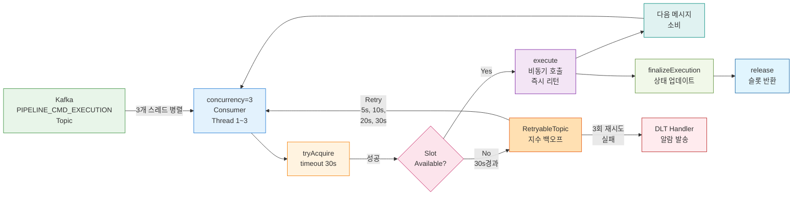

# 하이브리드 배압 (concurrency + tryAcquire + RetryableTopic)

## 개요

Spring Kafka의 concurrency 설정과 Java의 Semaphore를 조합하고, RetryableTopic을 통해 재시도 메커니즘을 더한 배압 방식이다. concurrency로 기본적인 병렬 소비를 보장하면서, Semaphore의 tryAcquire(timeout)를 사용하여 동시 활성 파이프라인 수를 제한한다. 이 방식은 Semaphore 단독으로 발생하는 "acquire() 무한 블로킹 시 재시도 불가" 라는 한계를 RetryableTopic으로 보완한다.

## 원리

### 단독 방식의 한계를 서로 보완하는 구조

하이브리드 방식은 세 가지 기술을 조합함으로써 각 단독 방식의 약점을 다른 방식의 강점으로 상쇄한다.

| 단독 방식의 한계 | 하이브리드에서 어떻게 보완되는가 |
|---|---|
| Semaphore 단독: acquire() 호출 시 무한 블로킹 → 슬롯 부족 시 스레드 영구 고착 → 재시도 메커니즘 작동 불가 | tryAcquire(timeout)으로 타임아웃 설정 → 실패 시 RetryableTopic이 메시지를 재시도 토픽으로 라우팅하여 나중에 다시 처리 |
| concurrency 단독: Consumer 스레드 수 = 동시 실행 파이프라인 수 → 비대칭 제어 불가능 | Semaphore가 소비 계층(Kafka 메시지 읽기)과 실행 계층(파이프라인 처리)을 분리 → 스레드는 적게 유지하면서 비동기 실행은 더 많이 허용 |
| concurrency로 인한 스레드 블로킹: 스레드가 하나의 파이프라인 완료를 대기하는 동안 소비 정체 | execute() 메서드를 즉시 리턴하는 비동기 호출로 설계 → 스레드가 다음 메시지를 바로 소비 → Semaphore로 동시 실행 수 제한 |

### 동작 흐름

다음 다이어그램은 메시지가 Consumer에 도착하여 파이프라인이 실행되고 완료되는 전체 흐름을 보여준다.



1. Kafka 토픽에서 메시지가 도착하면 3개의 Consumer 스레드 중 하나가 수신한다.
2. 즉시 Semaphore의 tryAcquire(30초)를 호출하여 활성 파이프라인 슬롯이 있는지 확인한다.
3. 슬롯이 있으면 true를 반환하고, 파이프라인 엔진의 execute() 메서드를 비동기로 호출한다. execute()는 즉시 리턴되므로 Consumer 스레드는 다음 메시지를 바로 소비할 수 있다.
4. 슬롯이 없으면 30초 대기 후 false를 반환한다. 이때 RetryableException을 던지면 Spring Kafka의 @RetryableTopic이 메시지를 retry topic으로 보낸다.
5. retry topic의 메시지는 지수 백오프 (5초, 10초, 20초, 30초)로 재시도된다.
6. 파이프라인이 완료되면 finalizeExecution()에서 상태를 업데이트하고, finally 블록에서 release()로 슬롯을 반환한다.
7. 3회 재시도 이후에도 실패하면 DLT (Dead Letter Topic)로 이동하여 알람이 발송된다.

### tryAcquire vs acquire의 차이

Semaphore에는 두 가지 슬롯 획득 메서드가 있다. 이 둘의 선택이 배압 동작에 큰 영향을 미친다.

| 메서드 | 동작 | 슬롯이 부족할 때의 결과 | 배압 관점 |
|---|---|---|---|
| acquire() | 슬롯이 반환될 때까지 무한 대기 | 스레드가 영구적으로 블로킹됨 → Consumer 스레드 소비 정체 | 블로킹이므로 재시도 불가능 |
| tryAcquire(30, SECONDS) | 지정된 시간 동안 대기한 후 false 리턴 | 타임아웃 후 메서드 리턴 → 예외 발생 → 재시도 메커니즘 작동 | 타임아웃이므로 재시도 가능 |

하이브리드 방식은 tryAcquire(timeout)을 사용한다. 왜냐하면 Consumer 스레드가 영원히 블로킹되지 않기 때문이다. 타임아웃 후 RetryableException을 던지면 Spring Kafka의 @RetryableTopic이 자동으로 메시지를 retry topic으로 라우팅한다. 나중에 슬롯이 확보되면 그 메시지는 다시 시도될 수 있다.

## 구현 코드

### Consumer 구현

```java
@Component
@RequiredArgsConstructor
public class PipelineEventConsumer {

    private final PipelineEngine pipelineEngine;
    private final Semaphore activePipelineSlots;

    @RetryableTopic(
        attempts = "4",
        backoff = @Backoff(delay = 5000, multiplier = 2.0, maxDelay = 30000),
        dltStrategy = DltStrategy.FAIL_ON_ERROR
    )
    @KafkaListener(
        topics = Topics.PIPELINE_CMD_EXECUTION,
        groupId = "pipeline-engine",
        concurrency = "3"  // ← Consumer 스레드 3개
    )
    public void onPipelineEvent(ConsumerRecord<String, byte[]> record) {
        // 메시지 역직렬화, 멱등성 검사 등 사전 처리
        ExecutionCreateCommand command = deserialize(record.value());
        UUID executionId = command.executionId();
        
        // 중복 실행 방지
        if (executionStore.exists(executionId)) {
            return;
        }

        // 슬롯 획득 시도: 30초 이내에 슬롯이 확보되어야 함
        if (!activePipelineSlots.tryAcquire(30, TimeUnit.SECONDS)) {
            // 슬롯 없음 → RetryableTopic이 자동으로 retry topic으로 라우팅
            throw new PipelineSlotNotAvailableException(
                "Pipeline slot not available within 30s: " + executionId);
        }

        try {
            // 파이프라인 엔진 호출: 즉시 리턴되어야 함 (비동기)
            pipelineEngine.execute(command);
        } catch (Exception e) {
            // 즉시 슬롯 반환: 파이프라인이 시작하지 못했으므로 다른 메시지에 기회 제공
            activePipelineSlots.release();
            throw e;
        }
    }

    @DltHandler
    public void onDlt(ConsumerRecord<String, byte[]> record) {
        log.error("[DLT] Pipeline failed after exhausting retries: {}", record.key());
        // 알람 발송, 수동 재처리 스케줄링, 운영팀 알림 등
    }
}
```

### Semaphore Bean 설정

```java
@Configuration
public class PipelineConfiguration {

    @Bean
    public Semaphore activePipelineSlots(PipelineProperties props) {
        return new Semaphore(props.maxActivePipelines());
    }
}
```

### 설정 파일 (application.yml)

```yaml
pipeline:
  max-active-pipelines: 5  # Semaphore의 초기 permit 수

spring:
  kafka:
    listener:
      concurrency: 3  # Consumer 스레드 수 (max-active-pipelines보다 작을 수 있음)
      ack-mode: manual_immediate
```

이 설정은 다음을 의미한다. 최대 5개의 파이프라인이 동시에 활성 상태로 실행될 수 있으며, Kafka에서는 3개의 스레드가 병렬로 메시지를 소비한다. 3개 스레드가 빠르게 소비할 수 있으므로, 충분한 속도로 5개의 비동기 파이프라인을 차례대로 실행할 수 있다.

### 파이프라인 완료 시 슬롯 반환

```java
@Service
@RequiredArgsConstructor
public class PipelineEngine {

    private final Semaphore activePipelineSlots;
    private final PipelineRepository pipelineRepository;

    public void execute(ExecutionCreateCommand command) {
        UUID executionId = command.executionId();
        
        // 파이프라인 상태를 PENDING으로 저장
        DagExecution execution = pipelineRepository.save(
            DagExecution.createPending(executionId, command.dagDefinitionId())
        );
        
        // 비동기 작업 스케줄링 (스레드풀 또는 virtual thread 사용)
        executorService.submit(() -> {
            try {
                // 실제 DAG 실행
                DagExecutionState state = executeDAG(execution);
                finalizeExecution(executionId, state);
            } catch (Exception e) {
                finalizeExecution(executionId, DagExecutionState.FAILED);
            }
        });
    }

    private void finalizeExecution(UUID executionId, DagExecutionState state) {
        try {
            // 최종 상태 업데이트
            pipelineRepository.updateState(executionId, state);
        } finally {
            // 어떤 결과이든 반드시 슬롯 반환
            activePipelineSlots.release();
        }
    }
}
```

finally 블록에서 release()를 호출하는 것이 중요하다. 파이프라인이 성공하든 실패하든, 또는 타임아웃되든 반드시 슬롯이 반환되어야 다음 메시지가 실행될 수 있기 때문이다.

### concurrency와 maxActivePipelines의 관계

이 두 설정값이 어떻게 상호작용하는지 이해하는 것이 하이브리드 방식의 핵심이다.

| concurrency | maxActivePipelines | 의미 | 특징 |
|---|---|---|---|
| 3 | 5 | 3개 스레드가 메시지를 소비하지만, 최대 5개 파이프라인이 동시 실행 | 소비 병렬성 < 실행 동시성 → 비대칭 구조의 이점 |
| 5 | 5 | 5개 스레드 각각이 1개 파이프라인씩 소비 및 실행 | 비대칭의 이점 적음, 사실상 concurrency 단독과 유사 |
| 3 | 3 | 스레드 수 = permit 수 | Semaphore가 거의 의미 없음, 스레드가 자연스럽게 제한됨 |
| 1 | 5 | 스레드 1개로 5개 파이프라인 관리 | Semaphore 단독 방식과 동일, concurrency의 이점 없음 |

concurrency < maxActivePipelines인 경우가 하이브리드 방식의 이점을 최대한 발휘한다. 예를 들어 concurrency=3, maxActivePipelines=5인 경우, 3개 스레드가 빠르게 메시지를 소비하면서도 최대 5개의 비동기 파이프라인을 효율적으로 관리할 수 있다.

## 장점

### 재시도 안전성

Semaphore 단독 방식의 가장 큰 문제는 acquire() 블로킹 시 재시도가 불가능하다는 것이다. 하이브리드 방식은 tryAcquire(timeout)으로 이를 해결한다. 타임아웃 후 RetryableException을 던지면 Spring Kafka의 @RetryableTopic이 메시지를 재시도 토픽으로 자동 라우팅한다. 초기 슬롯이 부족했던 상황이 나중에 개선되면, 그 메시지는 다시 처리될 기회를 얻는다.

### 비대칭 제어 유지

concurrency 단독 방식은 Consumer 스레드 수가 곧 동시 실행 파이프라인 수가 되므로 비대칭적 제어가 불가능하다. 하이브리드 방식은 소비 계층 (Kafka에서 메시지 읽기)과 실행 계층 (파이프라인 처리)을 명확히 분리한다. 소비 스레드는 적게 유지하면서도 비동기 실행은 더 많이 허용할 수 있다. 이는 스레드 리소스를 효율적으로 사용하면서도 처리량을 높이는 아키텍처 패턴이다.

### Consumer 건강성 보장

tryAcquire(timeout)을 사용하면 Consumer 스레드가 무한 블로킹되지 않는다. 타임아웃이 발생해도 스레드는 리턴되고 예외를 처리할 수 있다. 따라서 Kafka Consumer의 session timeout이나 heartbeat 검사에 영향을 주지 않는다. 운영 관점에서 Consumer 건강성이 보장되므로 배압 상황에서도 안정적인 시스템 운영이 가능하다.

### 이중 안전망

concurrency가 소비 병렬성을 담당하고, Semaphore가 실행 동시성을 담당한다. 두 메커니즘이 독립적으로 작동하므로 하나의 방식 오류가 다른 하나로 보완될 수 있다. 예를 들어 Semaphore 설정이 너무 크더라도 concurrency가 기본 제한을 제공하고, 반대로 concurrency가 너무 작더라도 Semaphore가 추가 제어를 할 수 있다.

## 한계

### 복잡도 증가

단독 방식은 하나의 개념 (Semaphore, concurrency, 또는 파티션 수)에 집중할 수 있다. 하이브리드 방식은 concurrency, Semaphore, RetryableTopic 세 가지를 모두 이해해야 한다. 각 컴포넌트의 상호작용을 파악해야 하므로 초기 개발 시 학습 곡선이 가팔라진다. 또한 설정값 (concurrency, maxActivePipelines, tryAcquire timeout, retry backoff)을 튜닝해야 하는데, 이들이 서로 영향을 미치므로 정확한 값을 찾기가 어렵다.

### retry topic 메시지 폭증

슬롯 부족이 지속되면 tryAcquire 타임아웃이 반복되고, RetryableTopic으로 인해 메시지가 retry topic에 축적된다. 지수 백오프로 인해 재시도 간격이 점차 길어지지만, 슬롯 문제가 근본적으로 해결되지 않으면 retry topic의 lag가 계속 증가한다. 모니터링하지 않으면 결국 DLT로 떨어지는 메시지가 크게 증가하게 되는 악순환이 생긴다.

### 동적 조절의 제한

Semaphore의 permit은 runtime에 release(n)을 호출하여 늘릴 수는 있다. 하지만 concurrency는 여전히 Kafka Consumer 재시작이 필요하다. 이는 운영 상황에서 부분적인 동적 조절만 가능하다는 뜻이다. Semaphore permit을 빠르게 늘렸을 때도, concurrency가 그에 미치지 못하면 실제 처리량 증가가 제한된다.

### 단일 인스턴스 전제

Semaphore는 JVM 내 메모리 객체이므로 여러 서버 인스턴스에서 공유되지 않는다. 따라서 단일 인스턴스 배포에서만 유효하다. 멀티 인스턴스로 확장하려면 Redis 또는 다른 분산 저장소를 사용하여 Semaphore를 구현해야 한다. 이는 추가적인 의존성과 복잡도를 낳는다.

### tryAcquire timeout 값 튜닝의 어려움

timeout 값이 너무 짧으면 (예: 1초) 슬롯이 곧 반환될 상황에서도 불필요한 타임아웃이 발생한다. 반대로 너무 길면 (예: 60초) 실제로 슬롯 부족 상황에서 Consumer 스레드가 최대 60초까지 블로킹된다. 워크로드, 파이프라인 평균 실행 시간, 피크 부하 시간 등을 고려하여 적정 값을 찾아야 한다.

## 적합한 상황

### 비동기 처리 모델을 채택했으나 재시도 안전성이 필수인 경우

파이프라인 엔진이 비동기로 설계되어 있지만, 배압으로 인해 메시지가 소실되거나 처리되지 않는 상황을 피해야 한다면 하이브리드 방식이 적합하다. RetryableTopic이 자동으로 재시도하므로 메시지 손실 위험이 최소화된다.

### 단일 인스턴스 프로덕션 환경

현재는 단일 서버로 운영하지만, 향후 멀티 인스턴스로 확장할 계획이 있다면 하이브리드 방식으로 시작하는 것이 좋다. 초기에 concurrency와 Semaphore 구조를 잘 설계해 두면, 나중에 분산 Semaphore로 전환하기가 상대적으로 쉽다.

### Semaphore 단독의 단순함으로는 부족하고, 더 견고한 배압이 필요한 경우

Semaphore 단독은 간단하지만 블로킹이라는 근본적 한계가 있다. 운영 안정성이 최우선이고, 약간의 복잡도 증가를 감수할 수 있다면 하이브리드 방식으로 안전성을 높일 수 있다.

## 멀티 인스턴스 확장

하이브리드 방식의 Semaphore는 JVM 메모리에 존재하므로, 앱을 여러 인스턴스로 스케일아웃하면 각 인스턴스가 독립 Semaphore를 갖게 된다. 글로벌 동시 실행 수를 제어할 수 없는 문제가 생긴다.

### 방법 1: Redis 분산 Semaphore (Redisson)

```java
// Redisson의 lease 기반 Semaphore — 인스턴스 장애 시 자동 복구
@Bean
public RPermitExpirableSemaphore activePipelineSlots(RedissonClient redisson) {
    RPermitExpirableSemaphore semaphore = redisson.getPermitExpirableSemaphore("pipeline:slots");
    semaphore.trySetPermits(5);  // 최초 1회만 설정
    return semaphore;
}
```

```java
// Consumer에서 사용 — lease 10분, 인스턴스 죽어도 10분 후 자동 반환
String permitId = semaphore.tryAcquire(30, 10, TimeUnit.MINUTES);
if (permitId == null) {
    throw new PipelineSlotNotAvailableException(...);
}
// finalizeExecution()에서
semaphore.release(permitId);
```

Redis가 이미 인프라에 있다면 가장 정확한 글로벌 제어를 제공한다. `RPermitExpirableSemaphore`를 사용하면 인스턴스가 acquire 후 죽어도 lease 만료로 permit이 자동 복구된다. 일반 `RSemaphore`는 이를 감지하지 못하므로 lease 기반을 권장한다.

| 장점 | 단점 |
|------|------|
| 글로벌 permit 수 정확히 제어 | Redis 인프라 추가 필요 |
| lease 기반 장애 복구 | 네트워크 지연으로 acquire/release 시간 증가 |
| tryAcquire(timeout) 지원 | Redis 장애 시 전체 파이프라인 중단 위험 |

### 방법 2: Semaphore 제거 — concurrency + 파티션으로 제어

Semaphore를 빼고 Kafka Consumer Group 리밸런싱에 의존하는 방식이다. 비대칭 제어를 포기하는 대신 추가 인프라가 불필요하다.

```
토픽: commands.execution (파티션 10개)

인스턴스 A (concurrency=3): partition 0~4  → 스레드 3개 활성
인스턴스 B (concurrency=3): partition 5~9  → 스레드 3개 활성
                                             총 6개 동시 실행
```

| 장점 | 단점 |
|------|------|
| 추가 인프라 불필요 | 비대칭 제어 포기 (스레드=파이프라인) |
| 인스턴스 추가/제거 시 자동 리밸런싱 | completionFuture.get() 블로킹으로 회귀 |

### 방법 3: 로컬 Semaphore + 인스턴스 수로 나누기

글로벌 목표 permit을 인스턴스 수로 나눠 각 인스턴스에 배분한다. 기존 코드를 그대로 유지할 수 있지만, 한쪽이 idle이면 글로벌 용량이 낭비된다.

```yaml
# 인스턴스 2개, 글로벌 목표 10개
pipeline:
  max-active-pipelines: 5  # 10 / 2
```

| 장점 | 단점 |
|------|------|
| 추가 인프라 없음, 코드 변경 없음 | 인스턴스 수 변경 시 설정도 변경 필요 |
| 단순함 유지 | 정확한 글로벌 N개 보장 불가 |

### 선택 기준

```
Redis가 이미 있는가?
  ├─ Yes → 방법 1 (RPermitExpirableSemaphore)
  └─ No
       ├─ 비대칭 제어 포기 가능?
       │    ├─ Yes → 방법 2 (concurrency + 파티션)
       │    └─ No  → 방법 3 또는 Redis 도입 검토
       └─ 인스턴스 수가 고정?
            ├─ Yes → 방법 3 (로컬 나누기)
            └─ No  → 방법 1 (동적 스케일링에 적합)
```

## 참조

- [multi-jenkins-architecture.md](./02-multi-jenkins-architecture.md) — 전체 멀티 Jenkins 아키텍처 및 배압이 적용되는 맥락
- [backpressure-semaphore.md](./03-backpressure-semaphore.md) — Java Semaphore 단독 방식 (장점, 한계, 구현 패턴)
- [backpressure-partition.md](./04-backpressure-partition.md) — Kafka 파티션 수 제한 방식 (기초적, 확장성 제약)
- [backpressure-concurrency.md](./05-backpressure-concurrency.md) — Spring Kafka concurrency 단독 방식 (메커니즘, 스레드 관리)
- [concurrency-theory-roadmap.md](./01-concurrency-theory-roadmap.md) — 동시성 제어 이론 학습 로드맵
