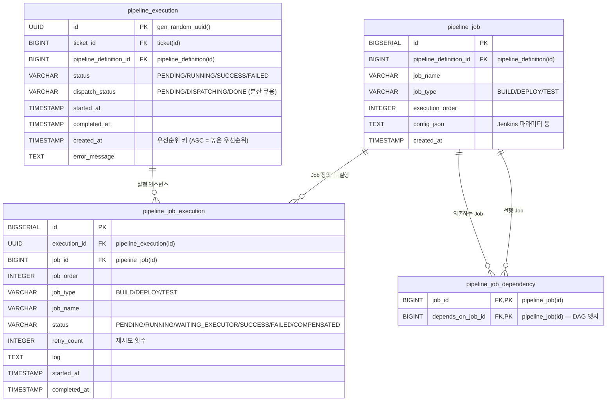
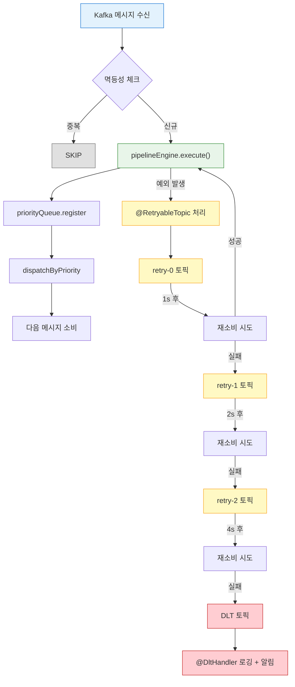
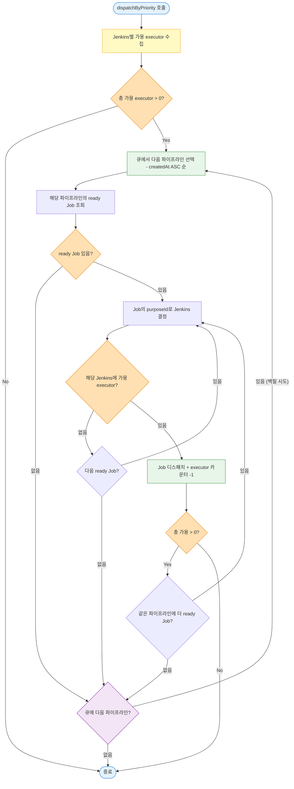
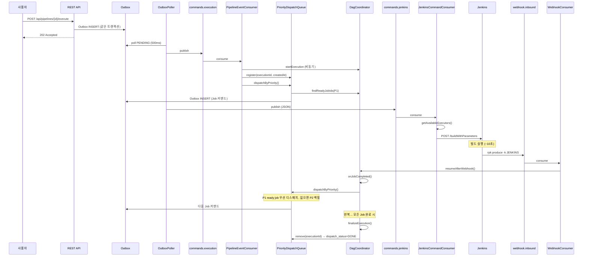
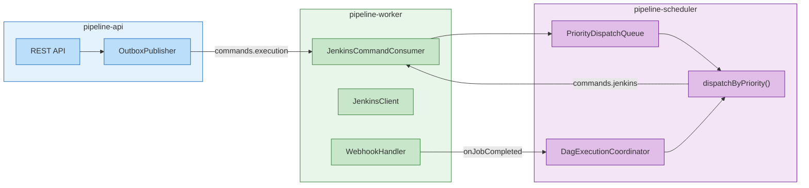
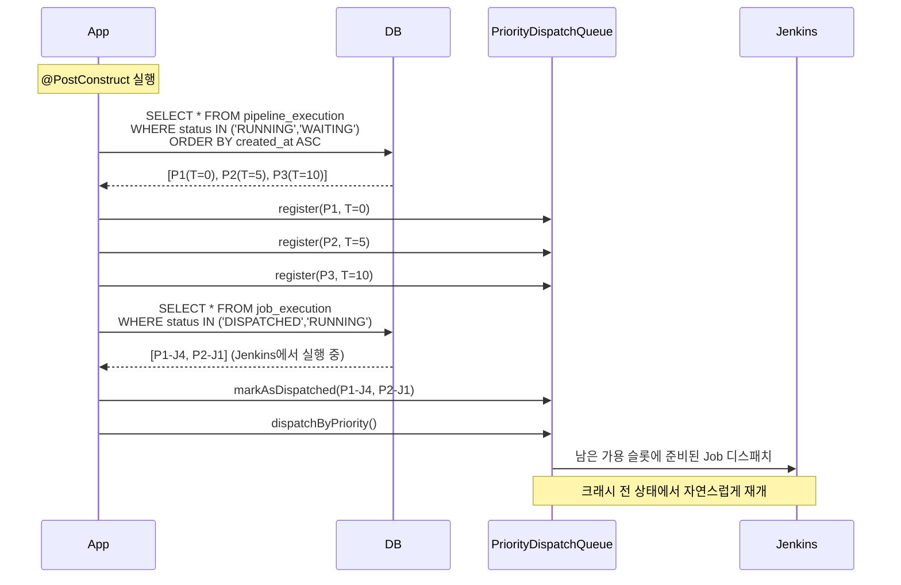

# 우선순위 백필 스케줄러 (Priority Backfill Scheduler)

## 1. 개요

Redpanda Playground의 파이프라인 실행 모델은 세 차례 진화를 거쳤다. 각 버전은 당시의 문제를 해결했지만 동시에 새로운 한계를 드러냈다.

**v1 — Per-execution slot**: 파이프라인 실행마다 `maxConcurrentJobs` 슬롯을 독립적으로 관리했다. 설계가 단순하다는 장점이 있었지만, 글로벌 executor 수를 전혀 제어하지 못해 Jenkins에 과부하를 줄 수 있었고 파이프라인 간 실행 순서 보장도 없었다.

**v2 — 2-topic blocking**: `completionFuture.get()`으로 P1이 완전히 끝날 때까지 P2 소비를 막는 방식이다. 실행 순서는 보장되지만 P1이 진행 중일 때 남은 executor 슬롯이 비어 있어도 P2가 진입하지 못한다. executor 활용률이 낮고, 하나의 파이프라인 지연이 전체 처리량을 떨어뜨린다.

**v3 — Semaphore**: 전역 세마포어로 동시 실행 파이프라인 수를 제한해 활용률을 높였다. 그러나 소비 순서가 Kafka 파티션 오프셋에 의존하므로 우선순위 정렬이 불가능하다.

**Priority Backfill**은 이 세 가지 한계를 모두 해결하는 새로운 모델이다. 핵심 아이디어는 다음과 같다. 가장 먼저 등록된 파이프라인의 Job이 executor 슬롯을 우선 선점하되, 해당 파이프라인의 준비된 Job이 없어서 슬롯이 비는 상황이 생기면 후순위 파이프라인의 Job이 그 빈자리를 채운다(backfill). 이 덕분에 우선순위 정렬과 높은 executor 활용률을 동시에 달성한다.

### 백필 스케줄러란?

**비유부터.** 식당에 3인용 테이블이 있다. 5명 단체(P1)가 먼저 왔고, 뒤에 3명 단체(P2)가 대기 중이다. 엄격 순차 방식에서는 P1 5명이 모두 식사를 마쳐야 P2가 앉는다. 하지만 P1 중 2명이 화장실에 갔다면? 2자리가 비어 있는데 P2는 그냥 기다린다. 백필 방식에서는 P1의 2자리가 비는 순간 P2 중 2명이 먼저 앉아서 식사를 시작한다. P1 멤버가 돌아오면 다음 빈자리는 P1이 우선이다.

**정의.** 백필 스케줄링은 HPC에서 유래한 자원 할당 전략으로, 우선순위를 보장하면서 유휴 자원을 후순위 작업이 채우는 방식이다. EASY/Conservative 등 변종과 이론적 배경은 [07-backfill-scheduling-theory.md](./07-backfill-scheduling-theory.md)에서 상세히 다룬다.

**파이프라인에 적용.** CI/CD 파이프라인은 DAG 의존성 때문에 모든 Job이 항상 실행 가능한 것이 아니다. P1의 5개 Job 중 3개가 실행 중이고 나머지 2개가 의존성 대기 상태라면, executor 2자리가 비어 있다. 이때 P2의 ready job이 그 빈자리를 채우는 것이 백필이다.

```
엄격 순차:
  P1: [J1,J2,J3] ··대기·· [J4,J5]  → P1 완료 → P2 시작
  executor:   ███ ____ ██            ███
  활용률: ~60%

백필:
  P1: [J1,J2,J3] ··대기·· [J4,J5]
  P2:             [J1,J2]  [J3]      → P2가 P1 빈자리 채움
  executor:   ███ ██__ ████
  활용률: ~90%
```

"Priority"가 붙는 이유는 P1에 새 ready job이 생기면 P2보다 P1이 무조건 먼저 배정받기 때문이다. 백필은 "빈자리가 있을 때만" 발생하며, 선순위 파이프라인의 실행을 절대 방해하지 않는다.


## 2. 기존 방식 비교

| 방식 | 우선순위 | executor 활용률 | 가용성 | 멀티 모듈 |
|------|---------|----------------|--------|----------|
| Per-execution slot | ❌ 없음 | 낮음 (글로벌 미제어) | ❌ 인메모리 | ❌ |
| 2-topic blocking | ✅ FIFO | 낮음 (P1 완료 후 P2 진입) | ✅ Kafka offset | ❌ |
| Semaphore | ❌ 없음 | 높음 | △ 재기동 시 재구성 필요 | ❌ |
| Hybrid | ❌ 없음 | 높음 | ✅ | △ |
| **Priority Backfill** | ✅ FIFO | **최고** (백필로 빈 슬롯 최소화) | ✅ DB 기반 재구성 | ✅ |

2-topic blocking 대비 가장 큰 차이점은 executor 활용률이다. 동일한 3 파이프라인 × 5 Job × executor 3 시나리오에서 2-topic blocking은 총 90초, Priority Backfill은 약 45초가 소요된다(7절에서 상세 비교).


## 3. 핵심 설계

### 3-1. ConcurrentSkipListMap

`ConcurrentSkipListMap`은 Java의 `java.util.concurrent` 패키지에 포함된 동시성 안전 정렬 맵이다. 내부적으로 **Skip List** 자료구조를 사용한다.

**Skip List란?** 정렬된 연결 리스트에 다단계 "고속 레인"을 추가한 확률적 자료구조다. 일반 연결 리스트의 탐색이 O(n)인 반면, Skip List는 O(log n)을 달성한다. 각 노드가 확률적으로 여러 레벨의 포인터를 갖고, 상위 레벨에서 빠르게 건너뛰다가 하위 레벨에서 정밀 탐색하는 구조다.

```
Level 3:  head ────────────────────────────── 50 ────────── tail
Level 2:  head ──────── 20 ────────────────── 50 ── 70 ── tail
Level 1:  head ── 10 ── 20 ── 30 ── 40 ── 50 ── 70 ── 80 ── tail
```

**왜 TreeMap이 아닌 ConcurrentSkipListMap인가?**

| 속성 | TreeMap | ConcurrentSkipListMap |
|------|---------|----------------------|
| 동시성 | 외부 동기화 필요 (`synchronized`) | Lock-free (CAS 기반) |
| 정렬 보장 | Red-Black Tree | Skip List |
| 순회 중 수정 | ConcurrentModificationException | 안전 (weakly consistent) |
| 성능 (동시 접근) | Lock 경합으로 성능 저하 | Lock-free로 높은 처리량 |

파이프라인 시스템에서 `dispatchByPriority()`가 큐를 순회하는 동안, webhook 콜백이 다른 스레드에서 `register()`나 `remove()`를 호출할 수 있다. `ConcurrentSkipListMap`은 이 시나리오에서 lock 없이 안전하게 동작한다.

### 단일 JVM 한계와 멀티 인스턴스 전략

`ConcurrentSkipListMap`은 인메모리 자료구조이므로, 앱을 2대 이상 배포하면 각 인스턴스가 독립된 큐를 갖게 된다. 이 경우 인스턴스 A가 P1을 우선 처리하는 동안 인스턴스 B가 P3을 먼저 디스패치하는 우선순위 불일치가 발생한다.

**현재 규모(단일 인스턴스)에서는 문제없다.** 멀티 인스턴스가 필요해지는 시점에 다음 3단계로 전환할 수 있다.

| 전략 | 글로벌 우선순위 | 구현 난이도 | 인프라 추가 | 적용 시점 |
|------|---------------|-----------|-----------|----------|
| **현재: ConcurrentSkipListMap** | ✅ (단일 인스턴스) | 없음 | 없음 | 지금 |
| **DB 기반 분산 큐** | ✅ | 중간 | 없음 (기존 PostgreSQL) | 인스턴스 2대 이상 |
| **Redis Sorted Set** | ✅ | 중간 | Redis 추가 | 저지연 필요 시 |
| Kafka 파티션 | ❌ 파티션 간 미보장 | 낮음 | 없음 | 우선순위 포기 가능 시만 |

> Kafka 파티션 방식은 파티션 내 순서만 보장하고 파티션 간 글로벌 순서를 보장하지 못하므로, 우선순위 백필에는 적합하지 않다. 멀티 인스턴스에서 글로벌 우선순위가 필요하면 DB 또는 Redis 방식이 필수다.

**DB 기반 분산 큐 (권장).** `pipeline_execution` 테이블에 `dispatch_status` 컬럼을 추가하고, `SELECT ... FOR UPDATE SKIP LOCKED`로 분산 락을 건다. 각 인스턴스가 DB를 진실의 원천으로 사용하므로 글로벌 우선순위가 보장된다. 인메모리 큐는 DB 캐시 역할만 한다. 별도 인프라 추가 없이 기존 PostgreSQL만으로 구현 가능하다는 것이 장점이다.



분산 큐에서 핵심 역할을 하는 컬럼은 세 가지다:
- `pipeline_execution.created_at` — 우선순위 정렬 키. ASC로 정렬하면 가장 오래된 파이프라인이 최우선
- `pipeline_execution.dispatch_status` — 분산 락 대상. `PENDING`인 행만 `FOR UPDATE SKIP LOCKED` 대상
- `pipeline_job_execution.status` — Job 상태. `PENDING`이면서 의존 Job이 모두 `SUCCESS`인 것이 ready job

```sql
-- 분산 큐 패턴: 가장 오래된 미처리 실행을 원자적으로 선택
-- SKIP LOCKED: 다른 인스턴스가 잡고 있는 행은 건너뛰어 경합 없이 분배
SELECT * FROM pipeline_execution
WHERE status = 'RUNNING' AND dispatch_status = 'PENDING'
ORDER BY created_at ASC
LIMIT 1
FOR UPDATE SKIP LOCKED;
```

```
Instance A: SELECT ... FOR UPDATE SKIP LOCKED → P1 획득 → P1 Job 디스패치
Instance B: SELECT ... FOR UPDATE SKIP LOCKED → P1은 A가 잠금 → SKIP → P2 획득
→ 글로벌 우선순위 보장: P1이 항상 먼저, P2가 백필
```

**DB 방식의 알려진 이슈와 완화.**

| 이슈 | 원인 | 영향 수준 | 완화 방법 |
|------|------|----------|----------|
| 폴링 지연 | webhook → DB 조회 → 디스패치 사이 수~수십 ms | 낮음 | 이벤트 트리거 방식 유지 (webhook에서 직접 호출), 폴링은 안전망으로만 |
| DB 부하 | `FOR UPDATE SKIP LOCKED` 매 webhook마다 호출 | 낮음~중간 | ready job 있을 때만 호출 + 인메모리 캐시 병행 |
| Lock 경합 | 여러 인스턴스가 같은 행 선점 시도 | 인스턴스 10대+ 시 | `SKIP LOCKED`가 잠긴 행 건너뜀, 심각해지면 Redis 전환 |
| 트랜잭션 시간 | 디스패치 로직이 트랜잭션 내에서 오래 걸림 | 중간 | 디스패치 결정만 트랜잭션 내, Kafka 발행은 트랜잭션 밖 |
| DB 단일 장애점 | PostgreSQL 다운 시 스케줄링 중단 | 낮음 | 현재도 DB 의존, HA(Primary-Replica)로 해결 |

현재 규모(단일 인스턴스, 파이프라인 수십 건/일)에서는 이 이슈들이 실질적 문제가 되지 않는다. K8s replica 2~3대까지는 DB 방식으로 충분하고, 인스턴스 10대 이상 또는 디스패치 지연 100ms 이하가 요구되는 시점에 Redis 전환을 검토한다.

**Redis Sorted Set.** `ZADD pipeline:queue {createdAt_score} {executionId}`로 중앙 집중 우선순위 큐를 구성한다. `ZPOPMIN`으로 가장 높은 우선순위를 원자적으로 꺼낸다. DB 폴링 대비 지연이 낮고, `ConcurrentSkipListMap`과 API가 유사해 전환 비용이 적다. 단, Redis라는 추가 인프라 의존이 생긴다.

**전환 전략.** 모든 구현체를 `PipelineScheduler` 인터페이스 뒤에 숨긴다.

```java
// 현재 (단일 인스턴스)
@Profile("single")
class LocalPipelineScheduler implements PipelineScheduler {
    private final ConcurrentSkipListMap<LocalDateTime, UUID> queue;
}

// 멀티 인스턴스 (K8s 2+ replicas)
@Profile("distributed")
class DbPipelineScheduler implements PipelineScheduler {
    private final PipelineExecutionMapper mapper; // SELECT ... FOR UPDATE SKIP LOCKED
}
```

`@Profile`로 배포 환경에 따라 구현체를 전환한다. 나머지 코드(Consumer, Coordinator, Worker)는 인터페이스만 의존하므로 변경 없이 전환 가능하다.

### 3-2. PriorityDispatchQueue

우선순위 관리의 핵심은 `ConcurrentSkipListMap<LocalDateTime, UUID>`이다. 키가 파이프라인 시작 시각(createdAt)이므로 자연스럽게 FIFO 우선순위가 적용된다. 동시성 환경에서도 정렬 순서가 보장되어 별도의 잠금 없이 안전하게 순회할 수 있다.

Job이 완료되거나 새 파이프라인이 등록될 때마다 `dispatchByPriority()`를 호출한다. 이 메서드는 큐를 순서대로 순회하면서 준비된 Job에 executor를 배정한다.

다음은 PriorityDispatchQueue의 내부 동작을 시간순으로 보여준다.

```
═══ T=0s: 3개 파이프라인 등록 ═══

ConcurrentSkipListMap (createdAt ASC):
┌────────────────┬────────────────┬────────────────┐
│ key: 00:00:00  │ key: 00:00:01  │ key: 00:00:02  │
│ val: P1 (UUID) │ val: P2 (UUID) │ val: P3 (UUID) │
│ priority: 1st  │ priority: 2nd  │ priority: 3rd  │
└────────────────┴────────────────┴────────────────┘
         ↑ 순회 시작점 (가장 높은 우선순위)

dispatchByPriority() 호출:
  available executors = 3
  → P1 순회: ready [J1,J2,J3] → 3개 디스패치 → available = 0 → STOP
  → P2, P3: 도달하지 못함 (executor 소진)

═══ T=20s: P1-J2 완료, P1 DAG 대기 ═══

ConcurrentSkipListMap (변화 없음):
┌────────────────┬────────────────┬────────────────┐
│ P1 (1st)       │ P2 (2nd)       │ P3 (3rd)       │
│ ready: []      │ ready: [J1,J2] │ ready: [J1,J2] │
│ running: [J3,J4]│               │                │
└────────────────┴────────────────┴────────────────┘

dispatchByPriority() 호출:
  available executors = 1 (P1-J2 완료로 1개 반환)
  → P1 순회: ready = [] (J5는 J4 완료 대기) → 스킵
  → P2 순회: ready [J1] → 1개 디스패치 → available = 0 → STOP
       ★ 백필 발생! P2-J1이 P1의 빈자리를 채움

═══ T=25s: P1-J3 완료 ═══

dispatchByPriority() 호출:
  available executors = 1
  → P1 순회: ready [J5] (J4+J2 완료 → 조건 충족) → 1개 디스패치 (우선!)
  → P2: 도달하지 못함 (executor 소진)
       ★ P1이 우선권 행사! P2보다 P1-J5가 먼저 배정

═══ T=35s: P1-J4 완료 ═══

dispatchByPriority() 호출:
  available executors = 1
  → P1 순회: ready = [] → 스킵
  → P2 순회: ready [J2] → 디스패치 (백필)

═══ T=40s: P1-J5 완료 → P1 종료 ═══

ConcurrentSkipListMap에서 P1 제거:
┌────────────────┬────────────────┐
│ P2 (1st로 승격)│ P3 (2nd로 승격)│
│ ready: [J3]    │ ready: [J1,J2] │
└────────────────┴────────────────┘

dispatchByPriority() 호출:
  available executors = 1
  → P2 순회 (이제 최우선): ready [J3] → 디스패치
  → P3: 도달 못함
```

이 흐름의 핵심은 세 가지다. 첫째, `ConcurrentSkipListMap`이 `createdAt` 키로 자동 정렬되어 항상 가장 오래된 파이프라인부터 순회한다. 둘째, 순회 중 `ready = []`이면 다음 파이프라인으로 넘어가는 것이 백필의 트리거다. 셋째, 파이프라인 완료 시 `remove()`로 큐에서 제거하면 후순위가 자동 승격된다.

### 3-3. Consumer 모델

기존 블로킹 방식과 달리 `@KafkaListener`는 즉시 반환한다. 파이프라인 실행은 비동기로 시작되며, 실행 순서는 DB 분산 큐(`dispatch_status`)와 `DagExecutionCoordinator.dispatchByPriority()`가 제어한다.

```java
@RetryableTopic(
    attempts = "4"
    , backoff = @Backoff(delay = 1000, multiplier = 2.0, maxDelay = 8000)
    , dltStrategy = DltStrategy.FAIL_ON_ERROR
    , dltTopicSuffix = "-dlt"
    , retryTopicSuffix = "-retry"
)
@KafkaListener(topics = Topics.PIPELINE_CMD_EXECUTION
        , groupId = "pipeline-engine"
        , concurrency = "3")
public void onPipelineEvent(ConsumerRecord<String, byte[]> record) {
    // 멱등성 체크 (ce_id 헤더)
    var eventId = extractHeader(record, CE_ID_HEADER)
            .orElseThrow(() -> new IllegalStateException("Missing ce_id header"));
    if (isDuplicateEvent(eventId)) return;

    var event = avroSerializer.deserialize(record.value(), ...);
    var execution = executionMapper.findById(UUID.fromString(event.getExecutionId()));
    execution.setJobExecutions(jobExecutionMapper.findByExecutionId(execution.getId()));

    pipelineEngine.execute(execution);       // 즉시 리턴 — 블로킹 없음
    // 큐 등록 + dispatchByPriority()는 startExecution() 내부에서 호출
}
```

Consumer는 이벤트 수신 → 파이프라인 엔진 위임만 담당한다. Semaphore는 제거되었다. DB 분산 큐가 파이프라인 순서를 관리하고, Jenkins executor 가용 체크가 실제 Job 제출 시점을 제어하므로 Semaphore의 역할이 중복되었기 때문이다. Jenkins Queue에 넣지 않는 이유는 Jenkins 장애 시 내부 큐의 Job이 소실되기 때문이다. App DB 큐에서 보관하고, 실제 가용할 때만 제출한다.

`concurrency = "3"`으로 Consumer 스레드 3개를 생성하여 멀티 인스턴스 환경에서도 병렬 소비가 가능하다.

### 3-3-1. Jenkins executor 슬롯 — 유일한 게이트

시스템의 슬롯 제어는 Jenkins executor 가용 체크 하나로 통합되었다. `dispatchByPriority()`가 Jenkins 인스턴스별 가용 executor를 확인하고, 여유가 있을 때만 Job을 제출한다.

```
    ┌─────────┐    ┌─────────┐     ┌─────────┐
    │ P1 (DAG)│    │ P2 (DAG)│     │ P3 (DAG)│
    │ J1→J2→J5│    │ J1→J2   │     │ J1→J2   │
    │ J3→J4↗  │    │         │     │         │
    └────┬────┘    └────┬────┘     └────┬────┘
         │              │               │
         ▼              ▼               ▼
┌──────────────────────────────────────────────┐
│        Jenkins executor 슬롯 (이중 체크)       │
│                                               │
│  ① Jenkins API 체크:                          │
│     GET /computer/api/json → total - busy     │
│     Jenkins 1: ■ ■ □  (3개 중 2개 사용)        │
│     Jenkins 2: ■ □    (2개 중 1개 사용)        │
│                                               │
│  ② 앱 레벨 체크:                               │
│     countRunningJobsForJenkins(url)            │
│     vs maxExecutorsPerJenkins 설정             │
│                                               │
│  가용 슬롯 = min(①, ②)                         │
│  K8s dynamic agent(①=0) → ②만 사용            │
│                                               │
│  dispatchByPriority()가 판단:                   │
│  "P1 ready job + 슬롯 가용 → 디스패치"          │
│  "P1 ready job 없음 → P2로 넘어감 = 백필"       │
└──────────────────────────────────────────────┘
```

| 슬롯 종류 | 확인 위치 | 확인 대상 | 부족 시 동작 |
|----------|----------|----------|-------------|
| **Jenkins API** | `jenkinsAdapter.getAvailableExecutors()` | Jenkins 실제 가용 executor (total - busy) | K8s dynamic은 폴백 |
| **앱 레벨** | `countRunningJobsForJenkins()` | 앱에서 디스패치한 running job 수 vs `maxExecutorsPerJenkins` | `WAITING_EXECUTOR` → webhook 도착 시 재시도 |

Jenkins Queue에 넣지 않는 이유: Jenkins가 장애로 죽으면 내부 대기 큐의 Job이 소실된다. App DB 큐에서 보관하고, 실제 가용할 때만 제출한다.

### 3-4. Consumer 재시도 및 DLQ 흐름

`pipelineEngine.execute()` 실행 중 예외 발생 시 `@RetryableTopic`이 메시지를 재시도 토픽으로 라우팅한다. 지수 백오프로 재시도하고, 최대 횟수를 초과하면 DLT(Dead Letter Topic)로 이동한다.



| 단계 | 토픽 | 대기 시간 |
|------|------|----------|
| 원본 | `commands.execution` | 즉시 소비 |
| 재시도 1 | `commands.execution-retry-0` | 5초 |
| 재시도 2 | `commands.execution-retry-1` | 10초 |
| 재시도 3 | `commands.execution-retry-2` | 20초 |
| DLT | `commands.execution-dlt` | 수동 재처리 |

DLT에 도달한 메시지는 `@DltHandler`가 로깅하고, 운영자가 원인을 분석한 뒤 수동 재처리(`rpk topic produce`)하거나 API로 재실행한다.

### 3-5. dispatchByPriority() 알고리즘

```java
public void dispatchByPriority() {
    // 1단계: Jenkins 인스턴스별 가용 executor 수 수집
    Map<UUID, Integer> availableByJenkins = jenkinsRegistry.getAll()
        .stream()
        .collect(toMap(
            JenkinsInstance::id
            , j -> j.maxExecutors() - j.runningJobs()
        ));

    int totalAvailable = availableByJenkins.values().stream()
        .mapToInt(Integer::intValue).sum();

    if (totalAvailable == 0) return;

    // 2단계: createdAt ASC 순으로 파이프라인 순회
    for (Map.Entry<LocalDateTime, UUID> entry : queue.entrySet()) {
        if (totalAvailable == 0) break;

        UUID executionId = entry.getValue();

        // 3단계: 해당 파이프라인의 준비된 Job 목록 조회
        List<JobExecution> readyJobs = jobRepository
            .findReadyJobs(executionId);

        // 4단계: Job별로 대상 Jenkins executor 확인 후 디스패치
        for (JobExecution job : readyJobs) {
            UUID jenkinsId = purposeResolver.resolve(job.purposeId());
            int available = availableByJenkins.getOrDefault(jenkinsId, 0);

            if (available == 0) continue;

            jenkinsCommandProducer.send(job);
            availableByJenkins.put(jenkinsId, available - 1);
            totalAvailable--;

            if (totalAvailable == 0) return;
        }
        // readyJobs가 비었으면 → 다음 파이프라인으로 (백필 발생 지점)
    }
}
```




## 4. 전체 실행 흐름 (시작부터 완료까지)

파이프라인 실행 요청이 들어와서 모든 Job이 완료될 때까지의 전체 흐름이다.




## 5. 시나리오 시뮬레이션

### 5-1. 3 파이프라인 × 5 Job × Jenkins executor 3

각 Job의 실행 시간은 10초, DAG 의존성은 순차(J1->J2->J3 직렬, J4는 J1 완료 후, J5는 J2와 J4 완료 후)로 가정한다.

```
시간    executor-1      executor-2      executor-3      이벤트
------  -------         -------         -------         -------
T=0s    [P1-J1]         [P1-J2]         [P1-J3]         P1,P2,P3 등록
                                                        dispatchByPriority() 호출
                                                        P1 준비 Job: J1,J2,J3 → 3슬롯 P1 선점
                                                        P2,P3: 슬롯 없음, 대기

T=10s   [P1-J4]         [P1-J2 진행중]  [P1-J3 진행중]  P1-J1 완료
                                                        dispatchByPriority() 호출
                                                        P1 준비: J4 (J1 완료 조건 충족) → 우선 디스패치
                                                        P2,P3: 여전히 슬롯 없음

T=20s   [P1-J4 진행중]  [P2-J1 백필!]   [P1-J5 대기중]  P1-J2 완료
                                                        dispatchByPriority() 호출
                                                        P1 준비: J5는 J4 완료 필요 → 준비 안됨
                                                        P1 ready job 없음 → P2로 넘어감
                                                        ★ P2-J1 백필! (빈 슬롯 활용)

T=25s   [P1-J5 우선!]   [P2-J1 진행중]  [P3-J1 백필!]   P1-J3 완료
                                                        dispatchByPriority() 호출
                                                        P1 준비: J5 (J4+J2 완료) → 우선 디스패치
                                                        남은 슬롯 1개 → P3-J1 백필

T=30s   [P1-J5 진행중]  [P2-J2]         [P3-J1 진행중]  P1-J4 완료
                                                        P1 ready 없음 → P2-J2 백필

... (이하 P1 종료 후 P2,P3가 executor 채우며 완주)
```

핵심 관찰: T=20s에 P1의 DAG 의존성 대기로 준비된 Job이 없어진 순간 P2가 빈 슬롯을 채운다. 이 시점 이후 executor는 한 번도 비지 않는다.

### 5-2. 토픽별 메시지 흐름

```
토픽                    메시지 흐름
-------------------     -----------------------------------------------------------
[commands.execution]    P1  P2  P3
                        ─── ─── ───  (3개 모두 즉시 소비, 블로킹 없음)

[commands.jenkins]      P1-J1 P1-J2 P1-J3 ·· P1-J4 ·· P2-J1(백필) ·· P1-J5 P2-J2 P3-J1
                        ─────T=0s────────── ─T=10s─ ────T=20s───── ─────T=25s──────────

[webhook.inbound]       ···· P1-J1✓ P1-J2✓ P1-J3✓ ···· P1-J4✓ ···· P2-J1✓ P1-J3✓ ··
                        ──────T=10s──────── ─────T=20s──── ────────T=30s──────────

dispatchByPriority()    T=0  T=10  T=20  T=25  T=30  T=35  ...
호출 시점               ↑    ↑     ↑     ↑     ↑     ↑     (webhook 수신 시마다)
```

`commands.execution`과 `commands.jenkins`가 분리되어 있으므로 파이프라인 수신과 Job 디스패치 속도가 독립적이다. P1이 실행 중이라도 P2, P3는 이미 소비되어 메모리에 올라와 있고, `dispatchByPriority()`가 호출될 때마다 즉시 백필을 시도할 수 있다.


## 6. 아키텍처 (멀티 모듈 대응)

현재 코드는 `pipeline` 단일 모듈에 모두 위치하지만, Priority Backfill 설계는 자연스럽게 3개 모듈 경계를 따른다.



`pipeline-scheduler`와 `pipeline-worker`의 경계를 명확히 하기 위해 다음 인터페이스를 정의한다. 현재는 구현체가 같은 모듈에 있어도 무방하고, 나중에 모듈을 분리할 때 이 인터페이스를 기준으로 패키지 경계를 나누면 된다.

```java
/**
 * 파이프라인 스케줄러의 공개 계약.
 * pipeline-scheduler 모듈이 이 인터페이스를 구현하고,
 * pipeline-worker는 이 인터페이스만 의존한다.
 */
public interface PipelineScheduler {

    /** 새 파이프라인을 우선순위 큐에 등록한다. */
    void register(UUID executionId, LocalDateTime priority);

    /** Job 완료 이벤트를 수신해 DAG 상태를 갱신하고 재디스패치를 시도한다. */
    void onJobCompleted(UUID executionId, int jobOrder, Long jobId, boolean success);

    /** 현재 가용 executor 슬롯에 맞춰 준비된 Job을 우선순위 순으로 디스패치한다. */
    void dispatchByPriority();
}
```


## 7. 가용성

### 7-1. 크래시 복구

`PriorityDispatchQueue`는 인메모리 자료구조지만 DB로부터 완전히 재구성할 수 있다. 앱 재기동 시 `@PostConstruct`가 다음 순서로 큐를 복원한다.

1. `pipeline_execution WHERE status IN ('RUNNING', 'WAITING') ORDER BY created_at ASC` 조회
2. 각 실행을 `createdAt` 순서대로 큐에 등록
3. `dispatchByPriority()` 호출로 즉시 재개

우선순위 정보의 출처가 DB의 `created_at` 컬럼이므로, 앱이 죽어도 우선순위 순서는 유실되지 않는다.



### 7-2. 우선순위 정보 출처

우선순위는 항상 DB의 `pipeline_execution.created_at`에서 읽는다. 2-topic blocking 방식이 Kafka offset 순서에 의존하는 것과 달리, 이 방식은 Kafka가 재시작되거나 컨슈머 그룹이 재조정되어도 우선순위가 흔들리지 않는다.

### 7-3. Kafka 장애

Outbox 패턴으로 메시지를 DB에 먼저 기록한다. Kafka가 다운된 동안 메시지는 outbox 테이블에 `PENDING` 상태로 남고, Kafka가 복구되면 OutboxPoller가 재전송한다. 메시지 유실 없이 At-Least-Once 전달이 보장된다.

### 7-4. Jenkins 다운

특정 Jenkins 인스턴스가 다운되면 `dispatchByPriority()`는 해당 인스턴스의 `availableExecutors = 0`으로 계산해 자동으로 건너뛴다. Jenkins가 복구되면 이후 webhook 수신 시 `dispatchByPriority()`가 재호출되고, 해당 인스턴스의 가용 슬롯이 다시 집계되어 Job이 디스패치된다. 별도의 헬스체크 폴링 없이 webhook-driven 방식으로 자연스럽게 복구된다.


## 8. 2-토픽 블로킹과의 비교

동일 조건(3 파이프라인, 5 Job, executor 3개, Job당 10초) 기준이다.

**2-토픽 블로킹 방식 — 총 소요 시간 90초**

```
      0s       10s      20s      30s      40s      50s      60s      70s      80s      90s
      |         |        |        |        |        |        |        |        |        |
P1    ████████████████████████████████████  (30s, executor 최대 활용)
P2                                         ████████████████████████████████████  (P1 완료 후)
P3                                                                               ████████████
      ^                                    ^                                     ^
      P1 시작                              P2 시작 (P1 완료 대기)                P3 시작

executor 활용률: ~33% (P2, P3 대기 시 executor 유휴)
```

**Priority Backfill — 총 소요 시간 약 45초**

```
      0s       10s      20s      30s      40s      45s
      |         |        |        |        |        |
P1    ████████████████████████████████████████  (J1~J5 완료)
P2         ──────────────████████████████████  (T=20s에 백필 시작)
P3              ────────────────████████████████  (T=25s에 백필 시작)
               ^         ^
               P2 백필   P3 백필 (P1 DAG 대기 중 빈 슬롯 채움)

executor 활용률: ~80%+ (빈 슬롯을 후순위 파이프라인이 즉시 채움)
```

처리량 차이는 DAG 의존성이 복잡할수록, 파이프라인 수가 많을수록 커진다. 각 파이프라인이 DAG 대기로 executor를 비워두는 시간이 길수록 백필의 효과가 극대화되기 때문이다.


## 9. 구현 로드맵

**Phase 1 — PriorityDispatchQueue 구현 (핵심)**

- `ConcurrentSkipListMap` 기반 큐 구현
- `dispatchByPriority()` 알고리즘 구현
- Jenkins 인스턴스별 가용 executor 집계 로직
- `@PostConstruct` 재구성 로직
- 단위 테스트: 백필 시나리오, 크래시 복구 시나리오

**Phase 2 — Consumer 모델 변경 (블로킹 제거)**

- `completionFuture.get()` 제거, 비동기 실행으로 전환
- Semaphore 제거 → DB 분산 큐(dispatch_status)와 Jenkins executor 가용 체크로 대체
- webhook 수신 시 `dispatchByPriority()` 호출 연결
- 통합 테스트: 3 파이프라인 동시 실행 시나리오

**Phase 3 — 멀티 모듈 인터페이스 분리 (선택, 규모 확장 시)**

- `PipelineScheduler` 인터페이스 추출
- `pipeline-scheduler`, `pipeline-worker`, `pipeline-api` 모듈로 분리
- 모듈 간 의존성 방향 검증 (worker -> scheduler 단방향)
- 각 모듈 독립 배포 및 스케일아웃 검증

Phase 3는 단일 앱으로도 충분히 운영 가능하다. 처리량이 늘어 `pipeline-worker`만 수평 확장해야 하는 상황이 오면 그때 분리해도 늦지 않다. 그 이전에 인터페이스를 명확히 정의해 두는 것(Phase 1~2에서 `PipelineScheduler` 인터페이스 선언)만으로도 미래의 모듈 분리를 크게 단순화할 수 있다.
