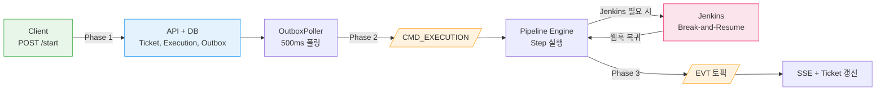
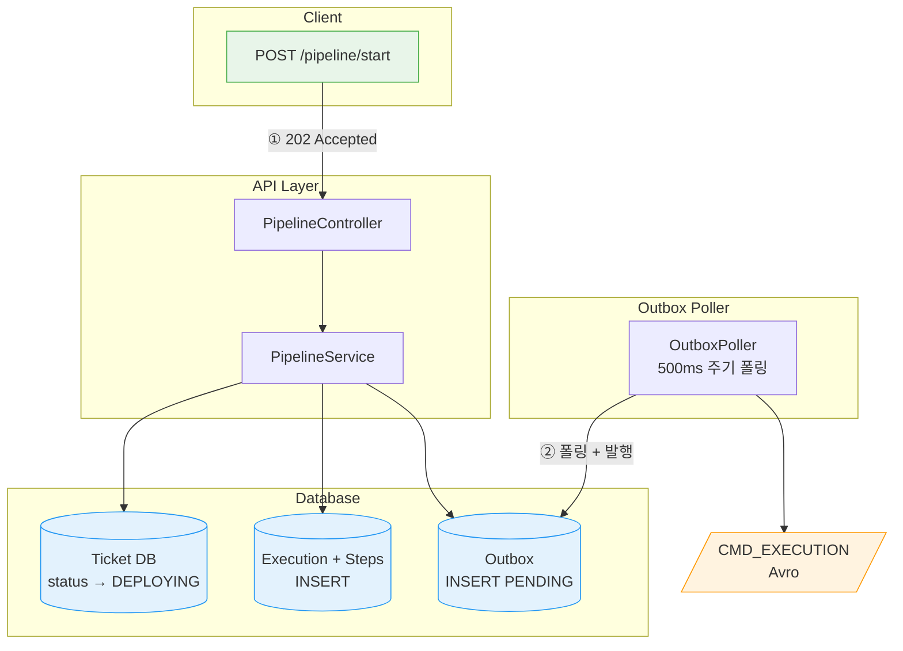
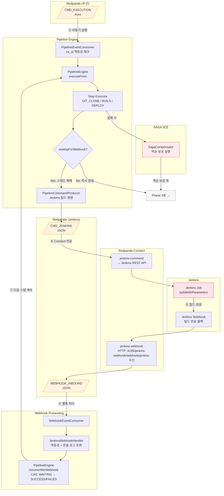
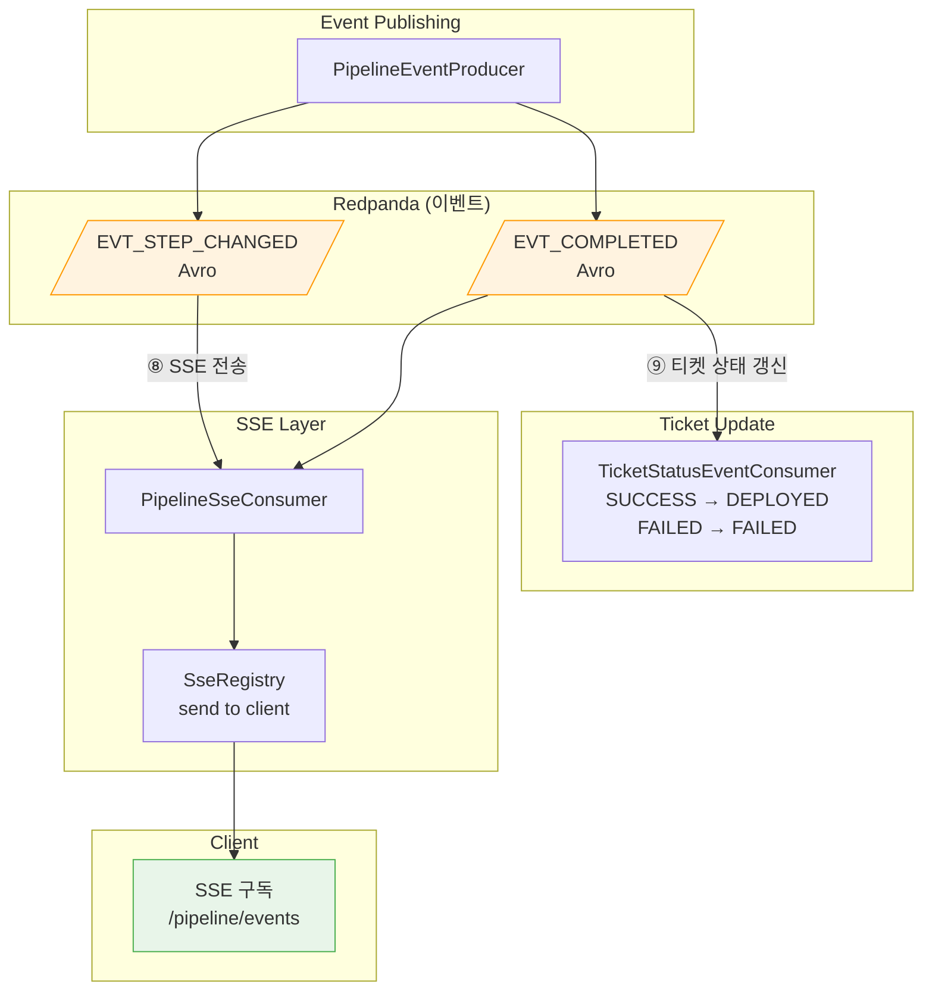
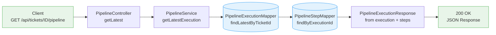
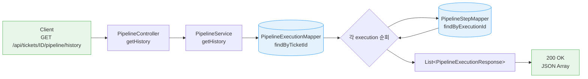
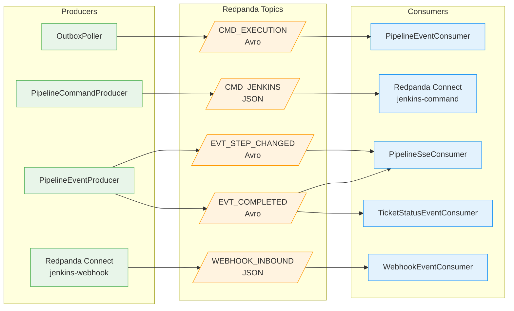
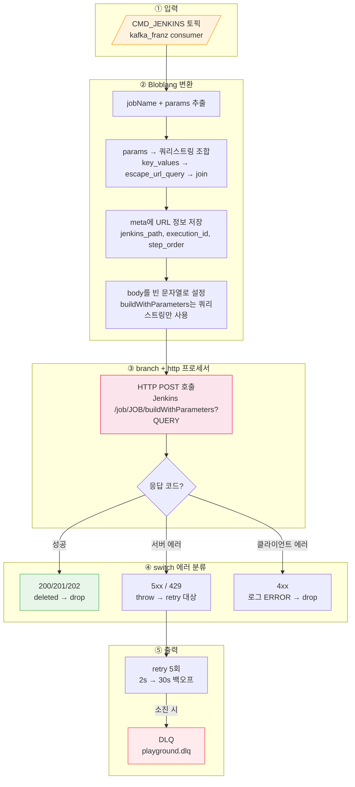
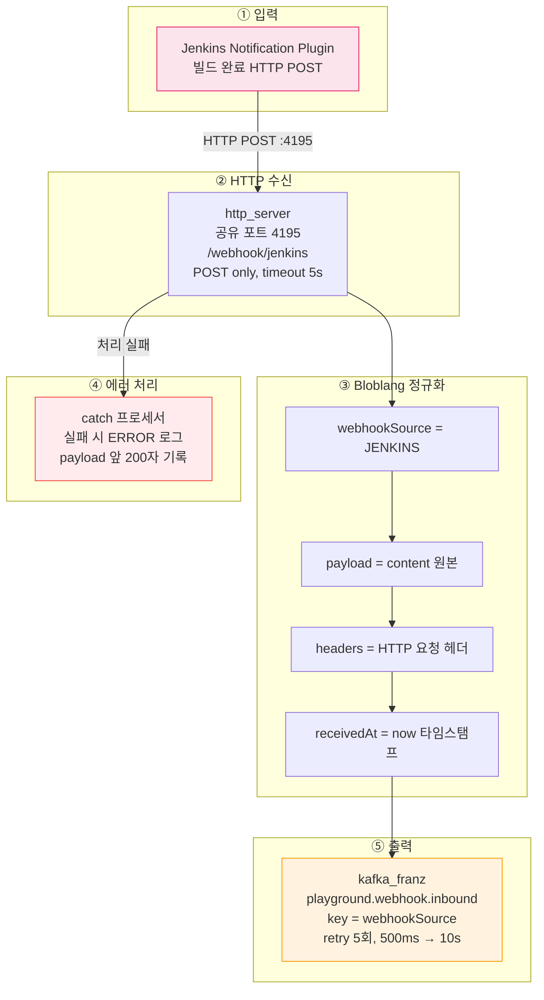

# 파이프라인 흐름

파이프라인 실행의 전체 흐름을 Mermaid graph로 표현한다. 각 흐름은 독립적인 다이어그램으로 분리하여 한 눈에 파악할 수 있도록 했다. 토픽과 커넥터의 입출력도 함께 정리하여, 각 토픽이 어디서 생산되고 어디서 소비되는지 한눈에 파악할 수 있다.

---

## Pipeline Start 흐름

파이프라인 시작 요청부터 Jenkins 빌드 완료, SSE 실시간 알림까지의 전체 흐름이다. Break-and-Resume 패턴으로 Jenkins 웹훅 대기 중 스레드를 해제하고, 웹훅 수신 시 이어서 실행한다.

### 개요

전체 흐름을 고수준으로 요약한 다이어그램이다. 각 번호는 아래 Phase 상세 다이어그램과 대응한다.



### Phase 1: 요청 접수 ~ Outbox 발행

클라이언트 요청을 받아 DB에 Ticket/Execution/Outbox를 기록하고, OutboxPoller가 Kafka 토픽으로 발행하는 구간이다.



### Phase 2: 엔진 실행 ~ Jenkins Break-and-Resume

CMD_EXECUTION을 소비하여 스텝을 순차 실행한다. Jenkins 빌드가 필요한 스텝은 스레드를 해제(Break)하고 웹훅 수신 시 재개(Resume)한다. 실패 시 SAGA 보상이 역순으로 실행된다.



### Phase 3: 이벤트 발행 ~ SSE/티켓 갱신

스텝 완료 또는 전체 완료 이벤트를 발행하여 SSE로 클라이언트에 실시간 전달하고, 티켓 상태를 최종 갱신한다.



---

## Job 실행 방식

Job은 두 가지 경로로 실행된다. 어느 경로든 Jenkins Job에는 `EXECUTION_ID`와 `STEP_ORDER` 파라미터가 내장되어 있어서, 빌드 완료 webhook이 돌아올 때 어떤 실행의 몇 번째 스텝인지 식별할 수 있다.

### Jenkins Job 네이밍 규칙

사용자가 입력한 Job 이름(예: "Build: http://gitlab/repo#main")은 UI 표시용이다. Jenkins에 등록되는 실제 Job 이름은 DB PK 기반의 `playground-job-{id}` 형식을 사용한다. URL이나 특수문자가 Jenkins API 경로 인코딩 문제를 일으키기 때문이다.

| 구분 | 이름 | 용도 |
|------|------|------|
| `PipelineJobExecution.jobName` | "Build: http://gitlab/repo#main" | 사용자에게 보여주는 표시 이름 |
| Jenkins Job 이름 | `playground-job-5` | Jenkins API 호출에 사용하는 실제 이름 |
| 범용 Job (per-Job 없을 때) | `playground-build`, `playground-deploy` | setup-jenkins.sh로 미리 등록된 기본 Job |

### Jenkins 내장 파라미터

`buildConfigXml()`이 모든 Job의 config.xml에 다음 두 파라미터를 자동 포함한다. 사용자가 설정하는 값이 아니라, 파이프라인 엔진이 트리거 시 자동 주입하는 인프라 파라미터다.

| 파라미터 | 용도 | 예시 |
|---------|------|------|
| `EXECUTION_ID` | 어떤 파이프라인 실행인지 식별 | `550e8400-e29b-...` |
| `STEP_ORDER` | 그 실행 안에서 몇 번째 스텝인지 식별 | `1`, `2`, `3` |

이 두 값이 webhook 콜백에 포함되어 돌아오므로, 엔진이 정확히 해당 스텝을 재개(Break-and-Resume)할 수 있다.

### Job 단독 실행

파이프라인 정의 없이 단일 Job을 즉시 실행하는 경로다. `PipelineExecution`(definitionId=null) 1건과 `PipelineJobExecution` 1건이 생성된다.

```
사용자: POST /api/jobs/5/execute

① JobService.execute(5)
   → PipelineExecution 생성 (id=abc-123, definitionId=null)
   → PipelineJobExecution 1건:
       jobOrder=1, jobId=5, jobName="my-build", jobType=BUILD

② Outbox → Kafka (PIPELINE_CMD_EXECUTION)

③ PipelineEventConsumer → PipelineEngine.start(abc-123)

④ JenkinsCloneAndBuildStep.execute()
   → jenkinsJobName = "playground-job-5"  (jobId=5)
   → Jenkins 트리거 파라미터:
       EXECUTION_ID = "abc-123"
       STEP_ORDER   = 1
       GIT_URL      = "http://playground-gitlab:29180/root/repo"
       BRANCH       = "main"

⑤ Jenkins 빌드 완료 → webhook:
   { executionId: "abc-123", stepOrder: 1, result: "SUCCESS" }

⑥ PipelineEngine.resumeAfterWebhook("abc-123", 1, "SUCCESS", log)
   → 다음 스텝 없음 → SUCCESS
```

### 파이프라인 실행 (복수 Job)

파이프라인 정의에 속한 Job들을 DAG 순서대로 실행하는 경로다. `PipelineExecution` 1건과 Job 수만큼의 `PipelineJobExecution`이 생성된다.

```
사용자: POST /api/pipeline-definitions/10/execute

① PipelineDefinitionService.execute(10)
   → PipelineExecution 생성 (id=def-456, definitionId=10)
   → PipelineJobExecution 3건:
       jobOrder=1, jobId=5,  jobName="Build-A",   jobType=BUILD
       jobOrder=2, jobId=8,  jobName="Download-B", jobType=ARTIFACT_DOWNLOAD
       jobOrder=3, jobId=12, jobName="Deploy-All",  jobType=DEPLOY

② Outbox → Kafka → PipelineEngine.start(def-456)

③ DAG 분석 → Step 1이 루트 → 실행
   JenkinsCloneAndBuildStep.execute():
       jenkinsJobName = "playground-job-5"
       EXECUTION_ID = "def-456"
       STEP_ORDER   = 1
       GIT_URL      = "..."
       BRANCH       = "main"

④ Jenkins webhook: { executionId: "def-456", stepOrder: 1, result: "SUCCESS" }
   → 엔진: "1번 끝남" → DAG에서 다음 ready 스텝 → 2번

⑤ NexusDownloadStep.execute(): (현재 스텁, 동기 완료)
       STEP_ORDER = 2
   → 즉시 완료 → 3번 진행

⑥ JenkinsDeployStep.execute():
       jenkinsJobName = "playground-job-12"
       EXECUTION_ID = "def-456"
       STEP_ORDER   = 3
       DEPLOY_TARGET = "..."

⑦ Jenkins webhook: { executionId: "def-456", stepOrder: 3, result: "SUCCESS" }
   → 엔진: "3번 끝남, 모든 스텝 완료" → SUCCESS
```

두 경로의 핵심 차이는 `PipelineJobExecution`의 수다. Job 단독은 항상 1건(STEP_ORDER=1 고정), 파이프라인은 N건(각각 고유한 STEP_ORDER)이다. DAG 파이프라인에서 병렬 실행 시에도 각 스텝의 STEP_ORDER가 다르므로, webhook이 동시에 돌아와도 엔진이 정확히 매칭할 수 있다.

---

## 조회 흐름

### 최근 실행이력 조회

특정 티켓의 가장 최근 파이프라인 실행 결과를 스텝 목록과 함께 반환한다.



### 모든 실행이력 조회

특정 티켓의 전체 파이프라인 실행 이력을 조회한다. 각 실행마다 소속 스텝 목록을 포함한다.



---

## 토픽 흐름 개요

5개 토픽 간의 데이터 흐름을 보여준다. 왼쪽이 이벤트의 시작점(Producer), 오른쪽이 최종 소비자(Consumer)다.



---

## 토픽별 상세

### 요약 테이블

| 토픽 | 정식 이름 | 직렬화 | Producer | Consumer | 파티션 키 |
|------|----------|--------|----------|----------|-----------|
| CMD_EXECUTION | `playground.pipeline.commands.execution` | Avro | OutboxPoller | PipelineEventConsumer | executionId |
| CMD_JENKINS | `playground.pipeline.commands.jenkins` | JSON | PipelineCommandProducer | Redpanda Connect | executionId |
| EVT_STEP_CHANGED | `playground.pipeline.events.step-changed` | Avro | PipelineEventProducer | PipelineSseConsumer | executionId |
| EVT_COMPLETED | `playground.pipeline.events.completed` | Avro | PipelineEventProducer | PipelineSseConsumer, TicketStatusEventConsumer | executionId |
| WEBHOOK_INBOUND | `playground.webhook.inbound` | JSON | Redpanda Connect | WebhookEventConsumer | webhookSource |

CMD_JENKINS만 JSON 직렬화를 사용하는 이유는 Redpanda Connect의 Bloblang 프로세서가 Avro 바이너리를 직접 파싱할 수 없어서다. 나머지 토픽은 스키마 검증이 가능한 Avro를 사용한다.

---

### CMD_EXECUTION — 파이프라인 실행 시작 명령

파이프라인 시작 API 호출 시 Outbox 테이블에 적재되고, OutboxPoller가 500ms 주기로 폴링하여 이 토픽으로 발행한다.

**Avro 스키마: `PipelineExecutionStartedEvent`**

| 필드 | 타입 | 설명 |
|------|------|------|
| executionId | string | 파이프라인 실행 UUID |
| ticketId | long | 대상 티켓 ID |
| steps | array\<string\> | 스텝 이름 목록 |

**Consumer 동작 (PipelineEventConsumer)**
- Consumer Group: `pipeline-engine`
- 멱등성: CloudEvents `ce_id` 헤더(= outbox PK)로 중복 체크
- 실행: 4-thread 전용 풀(`pipeline-exec-*`)에서 비동기로 PipelineEngine.execute() 호출
- 재시도: @RetryableTopic (4회, 1s→2s→4s→8s 지수 백오프)

---

### CMD_JENKINS — Jenkins 빌드 명령

PipelineEngine이 GIT_CLONE, BUILD, DEPLOY 스텝을 만나면 PipelineCommandProducer를 통해 이 토픽에 Jenkins 빌드 명령을 발행한다. Redpanda Connect가 소비하여 Jenkins REST API를 호출한다.

**Avro 스키마: `JenkinsBuildCommand`** (JSON 직렬화)

| 필드 | 타입 | 설명 |
|------|------|------|
| executionId | string | 파이프라인 실행 UUID |
| ticketId | long | 대상 티켓 ID |
| stepOrder | int | 스텝 순서 (1-based) |
| jenkinsUrl | string | Jenkins 서버 URL |
| jobName | string | Jenkins 잡 이름 |
| params | map\<string, string\> | 빌드 파라미터 |

**입력 예시**
```json
{
  "executionId": "550e8400-e29b-41d4-a716-446655440000",
  "ticketId": 42,
  "stepOrder": 1,
  "jenkinsUrl": "http://34.47.83.38:29080",
  "jobName": "clone-and-build",
  "params": {"REPO_URL": "https://github.com/test/repo", "BRANCH": "main"}
}
```

---

### EVT_STEP_CHANGED — 스텝 상태 변경 이벤트

PipelineEngine이 스텝 상태를 변경할 때마다 PipelineEventProducer를 통해 발행한다. RUNNING, SUCCESS, FAILED, COMPENSATED, WAITING_WEBHOOK 등 모든 상태 전이를 포함한다.

**Avro 스키마: `PipelineStepChangedEvent`**

| 필드 | 타입 | 설명 |
|------|------|------|
| executionId | string | 파이프라인 실행 UUID |
| ticketId | long | 대상 티켓 ID |
| stepName | string | 스텝 이름 |
| stepType | string | 스텝 유형 (GIT_CLONE, BUILD 등) |
| status | string | 변경된 상태 |
| log | string? | 실행 로그 (nullable) |

**Consumer 동작 (PipelineSseConsumer)**
- Consumer Group: `pipeline-sse`
- SSE 이벤트 타입: `"status"`
- SseRegistry를 통해 해당 ticketId를 구독 중인 클라이언트에 JSON 전송

---

### EVT_COMPLETED — 파이프라인 실행 완료 이벤트

모든 스텝이 완료되거나 실패 시 PipelineEventProducer가 발행한다. 두 개의 Consumer가 독립적으로 소비한다.

**Avro 스키마: `PipelineExecutionCompletedEvent`**

| 필드 | 타입 | 설명 |
|------|------|------|
| executionId | string | 파이프라인 실행 UUID |
| ticketId | long | 대상 티켓 ID |
| status | PipelineStatus (enum) | PENDING, RUNNING, SUCCESS, FAILED |
| durationMs | long | 총 실행 시간 (ms) |
| errorMessage | string? | 에러 메시지 (nullable) |

**Consumer 동작**
1. **PipelineSseConsumer** (Group: `pipeline-sse`)
   - SSE 이벤트 타입: `"completed"`
   - 전송 후 `sseRegistry.complete(ticketId)` 호출하여 SSE 스트림 종료
2. **TicketStatusEventConsumer** (Group: `ticket-status-updater`)
   - 멱등성: `ce_id` 헤더로 중복 체크
   - 상태 매핑: SUCCESS → DEPLOYED, FAILED → FAILED
   - TicketMapper.updateStatus()로 DB 갱신

---

### WEBHOOK_INBOUND — 외부 웹훅 수신

Redpanda Connect의 jenkins-webhook 커넥터가 Jenkins로부터 HTTP POST를 수신하여 이 토픽에 발행한다.

**메시지 구조** (JSON)

| 필드 | 타입 | 설명 |
|------|------|------|
| webhookSource | string | 웹훅 출처 (예: "JENKINS") |
| payload | object | 원본 웹훅 데이터 |
| headers | object | HTTP 요청 헤더 |
| receivedAt | string | 수신 시각 |

**payload 내부 구조 (JenkinsWebhookPayload)**

| 필드 | 타입 | 설명 |
|------|------|------|
| executionId | string | 파이프라인 실행 UUID |
| stepOrder | int | 스텝 순서 (1-based) |
| jobName | string | Jenkins 잡 이름 |
| buildNumber | int | 빌드 번호 |
| result | string | "SUCCESS", "FAILURE" 등 |
| duration | long | 빌드 소요 시간 (ms) |
| url | string | Jenkins 빌드 URL |

**Consumer 동작 (WebhookEventConsumer)**
- Consumer Group: `webhook-processor`
- 소스 판별: record.key > payload.webhookSource 우선순위
- JENKINS → JenkinsWebhookHandler.handle()
- 멱등성: `webhook:{executionId}:{stepOrder}` 이벤트 ID

---

## 커넥터별 상세

### Jenkins Command 커넥터 (Redpanda → Jenkins API)

Redpanda 토픽의 빌드 명령을 Jenkins REST API 호출로 변환한다. Spring Boot가 아닌 Connect로 구현하는 이유는 단순 HTTP 변환이기 때문이다. KafkaListener + WebClient + 재시도 코드 대신 YAML 설정만으로 동일한 결과를 얻고, 애플리케이션 재배포 없이 수정할 수 있다.

**파일**: `infra/docker/shared/connect/jenkins-command.yaml`

#### Jenkins URL 설정 방식

Jenkins URL은 메시지에 내장된다. `PipelineCommandProducer`가 커맨드 발행 시 DB(`support_tool` 테이블)에서 active Jenkins의 URL을 조회하여 `jenkinsUrl` 필드에 포함한다. 커넥터는 메시지의 `jenkinsUrl`을 메타데이터로 추출하여 HTTP 호출에 사용한다.

| 구성 요소 | 역할 |
|----------|------|
| `PipelineCommandProducer` | DB에서 `ToolType.JENKINS` active 조회 → `jenkinsUrl` 필드에 설정 |
| 커넥터 Bloblang | `meta jenkins_url = this.jenkinsUrl`로 메타데이터 추출 |
| HTTP 호출 | `${! meta("jenkins_url") }${! meta("jenkins_path") }`로 URL 조합 |

인증 정보(`username`/`credential`)는 메시지에 포함하지 않는다. 커넥터 템플릿의 `${TOOL_USERNAME}`, `${TOOL_CREDENTIAL}` 또는 환경변수로 주입하며, `support_tool.auth_type`에 따라 Basic Auth/Private-Token 등 헤더 구성 방식이 결정된다.

#### 전체 흐름



#### 데이터 재가공 과정

Bloblang mapping 프로세서가 JSON 메시지를 Jenkins REST API URL로 변환한다. `params` 맵의 각 key-value를 URL 쿼리스트링으로 조합하고, 본문은 비운다(Jenkins buildWithParameters는 쿼리스트링으로 파라미터를 받기 때문).

**Before — CMD_JENKINS 토픽 메시지**

```json
{
  "executionId": "550e8400-e29b-41d4-a716-446655440000",
  "ticketId": 42,
  "stepOrder": 1,
  "jobName": "clone-and-build",
  "params": {
    "REPO_URL": "https://github.com/test/repo",
    "BRANCH": "main"
  }
}
```

**After — Bloblang 변환 결과 → HTTP 요청**

변환 핵심: `params` 맵을 `key_values().escape_url_query().join("&")`로 쿼리스트링으로 조합하고, `meta jenkins_path`에 저장한다. `root`는 빈 문자열로 설정하여 본문을 비운다.

```json
{
  "_meta": {
    "jenkins_url": "http://34.47.83.38:29080",
    "jenkins_path": "/job/clone-and-build/buildWithParameters?REPO_URL=https%3A%2F%2Fgithub.com%2Ftest%2Frepo&BRANCH=main",
    "execution_id": "550e8400-e29b-41d4-a716-446655440000",
    "step_order": "1"
  },
  "_http_request": {
    "method": "POST",
    "url": "${jenkins_url}/job/clone-and-build/buildWithParameters?REPO_URL=https%3A%2F%2Fgithub.com%2Ftest%2Frepo&BRANCH=main",
    "auth": "Basic (admin / JENKINS_TOKEN)",
    "headers": {
      "Content-Type": "application/x-www-form-urlencoded",
      "X-Execution-Id": "550e8400-e29b-41d4-a716-446655440000",
      "X-Step-Order": "1"
    },
    "body": "",
    "timeout": "15s",
    "success_codes": [200, 201, 202]
  }
}
```

> `_meta`와 `_http_request`는 설명을 위한 논리적 구분이다. 실제로는 Bloblang이 meta 필드를 설정하고 branch 프로세서가 HTTP 호출을 수행한다.

#### 에러 분류 전략

`branch` 프로세서의 `result_map`에서 `errored()` 함수로 HTTP 응답 성공/실패를 판별한다. 실패 시 `error()` 문자열에 상태 코드가 포함되어 있으므로 `switch` 프로세서에서 패턴 매칭으로 분류한다.

| 응답 코드 | 동작 | 이유 |
|----------|------|------|
| 200/201/202 | `deleted()` → drop | 성공, 더 처리할 내용 없음 |
| 5xx, 429 | `throw()` → retry 5회 | 서버 일시 장애, 레이트리밋 — 재시도로 복구 가능 |
| 4xx | 로그 ERROR → drop | 잘못된 요청 — 재시도 무의미 |
| retry 소진 | fallback → DLQ | `playground.dlq`에 원본 보존, 수동 재처리 대상 |

무한 재시도하지 않는 이유는 Jenkins 장기 다운 시 컨슈머 Lag이 무한 증가하고, WebhookTimeoutChecker가 5분 후 파이프라인을 FAILED로 전환하기 때문이다.

---

### Jenkins Webhook 커넥터 (Jenkins → Redpanda)

Jenkins 빌드 완료 시 Notification Plugin이 보내는 HTTP POST를 Redpanda 토픽에 발행한다. GitLab 웹훅(port 4196)과 별도 파일로 분리했지만 동일 토픽(`playground.webhook.inbound`)으로 발행하며, 다운스트림은 `webhookSource` 필드로 구분한다.

**파일**: `infra/docker/shared/connect/jenkins-webhook.yaml`

#### 전체 흐름



#### 데이터 재가공 과정

Bloblang mapping 프로세서가 Jenkins의 원본 HTTP 요청을 표준 웹훅 스키마로 정규화한다. GitLab 웹훅 커넥터도 동일한 스키마를 사용하므로 다운스트림 `WebhookEventConsumer`는 소스에 무관하게 동일한 구조를 소비할 수 있다.

**Before — Jenkins Notification Plugin HTTP POST**

```json
{
  "_request": "POST /webhook/jenkins HTTP/1.1",
  "_headers": {
    "Host": "connect:4195",
    "Content-Type": "application/json",
    "X-Jenkins-Job": "clone-and-build"
  },
  "executionId": "550e8400-e29b-41d4-a716-446655440000",
  "stepOrder": 1,
  "jobName": "clone-and-build",
  "buildNumber": 57,
  "result": "SUCCESS",
  "duration": 34200,
  "url": "http://34.47.83.38:29080/job/clone-and-build/57/"
}
```

> `_request`와 `_headers`는 HTTP 요청 컨텍스트를 보여주기 위한 표기다. 실제 JSON body는 `executionId`부터 시작한다.

**After — 정규화된 WEBHOOK_INBOUND 메시지**

`content().string()`으로 원본 body를 문자열 그대로 보존하고, `webhookSource`와 `headers`, `receivedAt`을 감싸는 wrapper 구조로 변환한다. 파티션 키는 `"JENKINS"`다.

```json
{
  "webhookSource": "JENKINS",
  "payload": "{\"executionId\":\"550e8400-e29b-41d4-a716-446655440000\",\"stepOrder\":1,\"jobName\":\"clone-and-build\",\"buildNumber\":57,\"result\":\"SUCCESS\",\"duration\":34200,\"url\":\"http://34.47.83.38:29080/job/clone-and-build/57/\"}",
  "headers": {
    "Content-Type": "application/json",
    "X-Jenkins-Job": "clone-and-build"
  },
  "receivedAt": "2026-03-15T12:34:56.789Z"
}
```

`payload`는 원본 JSON을 **문자열**(`content().string()`)로 저장한다. 파싱하지 않고 문자열로 보존하는 이유는 Connect가 페이로드 구조를 알 필요가 없기 때문이다. 실제 파싱은 다운스트림의 `JenkinsWebhookHandler`가 담당한다.

웹훅 유실 시 파이프라인이 `WAITING_WEBHOOK` 상태에서 영구 대기할 수 있으므로, Kafka 발행 실패에 대해 5회 재시도(500ms → 10s 백오프)를 설정했다.

---

## 참조 파일 목록

### Backend 핵심 파일

| 파일 | 역할 |
|------|------|
| `pipeline/api/PipelineController.java` | REST API 엔드포인트 (start, getLatest, getHistory) |
| `pipeline/service/PipelineService.java` | 비즈니스 로직, Outbox 이벤트 적재 |
| `pipeline/engine/PipelineEngine.java` | 스텝 순차 실행, Break-and-Resume |
| `pipeline/engine/SagaCompensator.java` | 역순 보상 트랜잭션 |
| `pipeline/dag/engine/DagExecutionCoordinator.java` | DAG 실행 조율기 (ReentrantLock, 스레드 풀 디스패치) |
| `pipeline/dag/engine/DagValidator.java` | DAG 검증 (Kahn's Algorithm, 순환/연결성 탐지) |
| `pipeline/dag/event/DagEventProducer.java` | DAG Job dispatch/completion 이벤트 발행 |
| `pipeline/event/PipelineEventConsumer.java` | CMD_EXECUTION 소비 → 엔진 구동 |
| `pipeline/event/PipelineEventProducer.java` | EVT_STEP_CHANGED/COMPLETED 발행 |
| `pipeline/event/PipelineCommandProducer.java` | CMD_JENKINS 발행 |
| `pipeline/sse/PipelineSseConsumer.java` | 이벤트 → SSE 전송 |
| `webhook/WebhookEventConsumer.java` | WEBHOOK_INBOUND 소비 |
| `webhook/handler/JenkinsWebhookHandler.java` | Jenkins 웹훅 데이터 처리 |
| `ticket/event/TicketStatusEventConsumer.java` | 완료 이벤트 → 티켓 상태 갱신 |
| `common/outbox/OutboxPoller.java` | Outbox 폴링 + Kafka 발행 (500ms) |
| `kafka/topic/Topics.java` | 토픽 이름 상수 |

### Avro 스키마

| 파일 | 이벤트 |
|------|--------|
| `PipelineExecutionStartedEvent.avsc` | 파이프라인 시작 명령 |
| `JenkinsBuildCommand.avsc` | Jenkins 빌드 명령 |
| `PipelineStepChangedEvent.avsc` | 스텝 상태 변경 |
| `PipelineExecutionCompletedEvent.avsc` | 실행 완료 |
| `PipelineStatus.avsc` | 상태 enum (PENDING, RUNNING, SUCCESS, FAILED) |

### Redpanda Connect

| 파일 | 역할 |
|------|------|
| `infra/docker/shared/connect/jenkins-command.yaml` | 토픽 → Jenkins REST API |
| `infra/docker/shared/connect/jenkins-webhook.yaml` | Jenkins HTTP 웹훅 → 토픽 |
