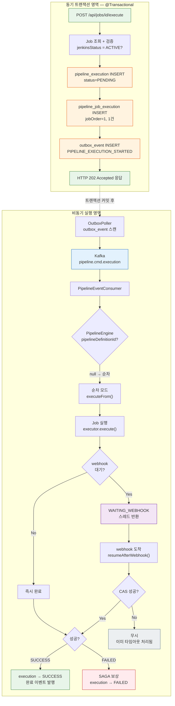
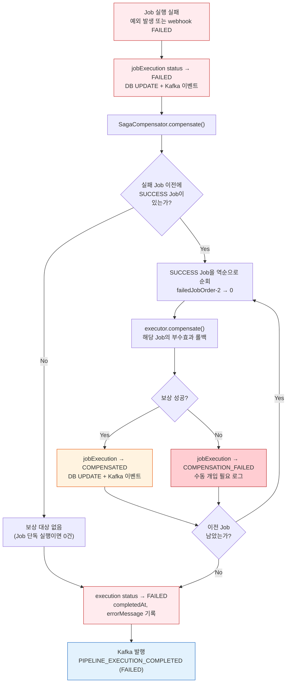

# Job 단독 실행 API 흐름

> **API**: `POST /api/jobs/{id}/execute`
> **서비스**: `JobService.execute(Long id, Map<String, String> userParams)`
> **목적**: 파이프라인 정의 없이 단일 Job을 즉시 실행한다.

## 전체 흐름도



---

## Step 1: Job 조회 및 검증

**파일**: `JobService.java:152~159`

```
클라이언트 → POST /api/jobs/3/execute { "params": { "VERSION": "1.0" } }
  → JobController.execute()
  → JobService.execute(3, {"VERSION": "1.0"})
  → jobMapper.findById(3)  -- pipeline_job 테이블 조회
```

Job이 없으면 404를 반환한다. jenkinsScript가 있는 Job이면 `jenkinsStatus`가 `ACTIVE`인지 확인한다. Jenkins 파이프라인이 아직 등록 중(`PENDING`)이거나 실패(`FAILED`)하면 실행을 거부한다.

이 검증이 필요한 이유는 BUILD/DEPLOY Job이 Jenkins API를 호출하는데, Jenkins에 파이프라인이 없으면 실행 자체가 불가능하기 때문이다.

---

## Step 2: PipelineExecution 레코드 생성

**파일**: `JobService.java:162~175`

```
pipeline_execution 테이블 INSERT:
  id                     = UUID (새로 발급)
  pipeline_definition_id = null  ← Job 단독 실행임을 표시
  status                 = PENDING
  started_at             = now()
  trace_parent           = 현재 OTel trace context 캡처
  parameters_json        = {"VERSION": "1.0"}  (있을 때만)
```

Job 단독 실행이지만 `pipeline_execution` 레코드를 만드는 이유는 이후 모든 인프라(PipelineEngine, 이벤트, SSE, Grafana)가 이 테이블을 기준으로 동작하기 때문이다. `pipelineDefinitionId = null`로 "파이프라인 정의에서 온 것이 아닌 단독 실행"임을 구분한다.

---

## Step 3: PipelineJobExecution 레코드 생성

**파일**: `JobService.java:178~184`

```
pipeline_job_execution 테이블 INSERT:
  execution_id = Step 2에서 만든 UUID
  job_order    = 1  ← 단일 Job이므로 항상 1
  job_type     = BUILD (또는 DEPLOY 등 해당 Job의 타입)
  job_name     = "sample-build"
  job_id       = 3  ← pipeline_job.id 참조
  status       = PENDING
```

파이프라인 실행에서는 N건이 들어가지만, Job 단독 실행에서는 항상 1건만 생성된다.

---

## Step 4: Outbox 이벤트 INSERT

**파일**: `JobService.java:187~201`

```
outbox_event 테이블 INSERT:
  aggregate_type = "PIPELINE"
  aggregate_id   = execution UUID
  event_type     = "PIPELINE_EXECUTION_STARTED"
  payload        = Avro 직렬화된 PipelineExecutionStartedEvent
  topic          = "pipeline.cmd.execution"
  partition_key  = execution UUID
```

Kafka로 직접 발행하지 않고 outbox 테이블에 INSERT하는 이유는 **Transactional Outbox 패턴** 때문이다. Step 2~4가 하나의 DB 트랜잭션(`@Transactional`)으로 묶여 있어서, 커밋 실패 시 이벤트도 함께 롤백된다. 메시지 유실이 없다.

---

## Step 5: 트랜잭션 커밋 → 클라이언트 응답

**파일**: `JobService.java:203`

```
HTTP 202 Accepted 응답:
{
  "executionId": "a1b2c3d4-...",
  "status": "PENDING"
}
```

클라이언트는 즉시 응답을 받는다. 실제 Job 실행은 비동기로 진행된다. 이 시점에서 DB에는 3개 레코드가 있고(execution, job_execution, outbox), Kafka에는 아직 아무것도 없다.

---

## Step 6: OutboxPoller → Kafka 발행

**파일**: `OutboxPoller` (스케줄러)

```
OutboxPoller (@Scheduled)
  → outbox_event 테이블에서 미발행 이벤트 조회
  → Kafka 토픽 "pipeline.cmd.execution"으로 발행
  → outbox_event 상태를 SENT로 갱신
```

폴링 주기마다 outbox를 스캔하여 Kafka로 전달한다. 폴러가 실패해도 outbox 레코드가 남아있으므로 재시도가 보장된다.

---

## Step 7: PipelineEventConsumer → PipelineEngine

**파일**: `PipelineEventConsumer.java`

```
Kafka 토픽 "pipeline.cmd.execution" 수신
  → Avro 역직렬화 → PipelineExecutionStartedEvent
  → executionMapper.findById(executionId) — DB에서 실행 레코드 조회
  → PipelineEngine.execute(execution) 호출
```

---

## Step 8: PipelineEngine 분기 → 순차 모드

**파일**: `PipelineEngine.java:76~91`

```
PipelineEngine.execute(execution)
  → pipelineDefinitionId == null  ← Job 단독 실행
  → 순차 모드 진입
  → execution status → RUNNING (DB UPDATE)
  → executeFrom(execution, 0, startTime)
```

`pipelineDefinitionId`가 있으면 DAG 모드로 가지만, Job 단독 실행은 null이므로 순차 모드로 진입한다.

---

## Step 9: Job 실행

**파일**: `PipelineEngine.java:104~150`

```
executeFrom():
  ① jobExecution status → RUNNING (DB UPDATE + Kafka 상태 이벤트)
  ② jobExecutors.get(BUILD).execute(execution, jobExecution)
     → Jenkins API 호출 등 실제 작업 수행
  ③ 분기:
     ┌─ webhook 대기 Job (BUILD, DEPLOY)
     │   → status → WAITING_WEBHOOK
     │   → 스레드 반환 (Step 10으로)
     │
     └─ 즉시 완료 Job (ARTIFACT_DOWNLOAD, IMAGE_PULL)
         → status → SUCCESS
         → Step 11로
```

---

## Step 10: (webhook 대기 Job인 경우) Break-and-Resume

**파일**: `PipelineEngine.java:166~242`

```
Jenkins 빌드 완료
  → Jenkins가 Redpanda Connect로 webhook 전송
  → Connect가 Kafka 토픽에 발행
  → WebhookEventConsumer가 수신
  → PipelineEngine.resumeAfterWebhook(executionId, jobOrder, result, buildLog)
  → CAS: WAITING_WEBHOOK → SUCCESS 또는 FAILED (DB UPDATE)
  → 성공이면 다음 Job 진행 (Job 단독이므로 Step 11로)
  → 실패면 SAGA 보상 → Step 12로
```

CAS(Compare-And-Swap)를 쓰는 이유는 WebhookTimeoutChecker가 동시에 FAILED로 바꿀 수 있기 때문이다. 먼저 상태를 바꾼 쪽만 후속 처리를 진행한다.

---

## Step 11: 실행 성공 완료

**파일**: `PipelineEngine.java:267~280`

```
execution status → SUCCESS (DB UPDATE)
  → completedAt = now()
  → Kafka 토픽에 PIPELINE_EXECUTION_COMPLETED 이벤트 발행
    (Grafana 대시보드, SSE 알림 등이 이 이벤트를 소비)
```

---

## Step 12: (실패 시) SAGA 보상 + 실패 처리

**파일**: `PipelineEngine.java:252~265`

### 보상 흐름도



Job 단독 실행에서는 Job이 1건이므로, 실패 시 보상 대상이 0건(이전에 성공한 Job이 없음)인 경우가 대부분이다. 순차 모드에서 여러 Job이 있을 때만 실제 보상이 발생한다.

```
SagaCompensator.compensate()
  → 이미 SUCCESS인 Job을 역순으로 보상(롤백)
  → (Job 단독 실행이면 보상 대상이 0~1건)
execution status → FAILED (DB UPDATE)
  → errorMessage 기록
  → Kafka 토픽에 PIPELINE_EXECUTION_COMPLETED (FAILED) 이벤트 발행
```

---

## 전체 흐름 요약

```
클라이언트
  │
  ▼
JobController ──── POST /api/jobs/{id}/execute
  │
  ▼
JobService.execute()  ─── @Transactional ───────────────┐
  │  ① pipeline_execution INSERT (PENDING)              │
  │  ② pipeline_job_execution INSERT (PENDING, 1건)     │
  │  ③ outbox_event INSERT                              │
  │  ④ HTTP 202 응답                                    │
  └─────────────────────────────────────────────────────┘
                                                    커밋
  ▼ (비동기)
OutboxPoller → Kafka "pipeline.cmd.execution"
  ▼
PipelineEventConsumer
  ▼
PipelineEngine.execute()
  → 순차 모드 (pipelineDefinitionId == null)
  → Job 실행
  ▼
  ┌─ 즉시 완료 ──→ SUCCESS
  └─ webhook 대기 → WAITING_WEBHOOK → webhook 도착 → SUCCESS or FAILED
```

---

## 부록: DAG 엔진과의 관계

Job 단독 실행은 DAG 엔진을 사용하지 않는다. 하지만 같은 `PipelineEngine`을 공유하므로, DAG 엔진이 어떻게 동작하는지 이해하면 전체 구조가 명확해진다.

### PipelineEngine의 분기 로직

```
PipelineEngine.execute(execution)
  ├─ pipelineDefinitionId != null → DagExecutionCoordinator (DAG 모드)
  └─ pipelineDefinitionId == null → executeFrom() (순차 모드) ← Job 단독 실행
```

### 순차 모드 vs DAG 모드

| | 순차 모드 (Job 단독) | DAG 모드 (Pipeline) |
|---|---|---|
| **실행 구조** | 단일 스레드 for 루프 | 스레드풀 병렬 실행 |
| **상태 관리** | DB만 사용 | `DagExecutionState` 메모리 캐시 + DB |
| **동시성 제어** | 불필요 (단일 스레드) | 실행별 `ReentrantLock` |
| **의존성** | 없음 (jobOrder 순서) | `dependencyGraph` + `successorGraph` |
| **실패 정책** | SAGA 보상 (고정) | STOP_ALL / SKIP_DOWNSTREAM / FAIL_FAST |
| **재시도** | 없음 | exponential backoff (`2^retryCount`초) |
| **크래시 복구** | 없음 | `@PostConstruct`로 RUNNING 실행 자동 재개 |

### DAG 엔진 핵심 구조

DAG 엔진은 3개 클래스로 구성된다.

**`DagExecutionState`** — 실행당 1개 생성되는 런타임 상태 객체. 불변 필드(Job 목록, 의존성 그래프)와 가변 필드(완료/실행중/실패 집합)를 분리한다.

```
DagExecutionState:
  불변: jobs, dependencyGraph, successorGraph, jobIdToJobOrder
  가변: completedJobIds, runningJobIds, failedJobIds, skippedJobIds
```

**`DagExecutionCoordinator`** — DAG 실행의 오케스트레이터. 핵심 루프는 아래와 같다.

```
startExecution() → dispatchReadyJobs()
  → executeJob() (스레드풀)
  → onJobCompleted()
  → dispatchReadyJobs()  ← 다음 ready Job 탐색
  → ... 반복 ...
  → isAllDone() → finalizeExecution()
```

**`DagValidator`** — 순환 참조를 탐지하는 검증기. 실행 전에 반드시 호출한다.

### Ready Job 탐색 알고리즘

`findReadyJobIds()`는 의존성 그래프를 순회하며 실행 가능한 Job을 찾는다.

```
모든 Job에 대해:
  ① 이미 완료/실행중/실패/SKIP → 건너뜀
  ② 의존하는 모든 Job이 completedJobIds에 포함 → ready
```

루트 Job(의존성 없는 Job)은 첫 호출에서 바로 ready가 된다. 이후 Job이 완료될 때마다 `onJobCompleted()` → `dispatchReadyJobs()`가 호출되어 새로 ready된 Job을 탐색한다.
