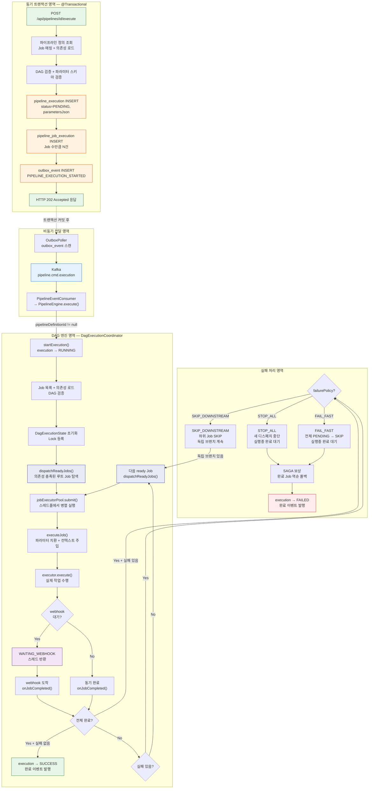
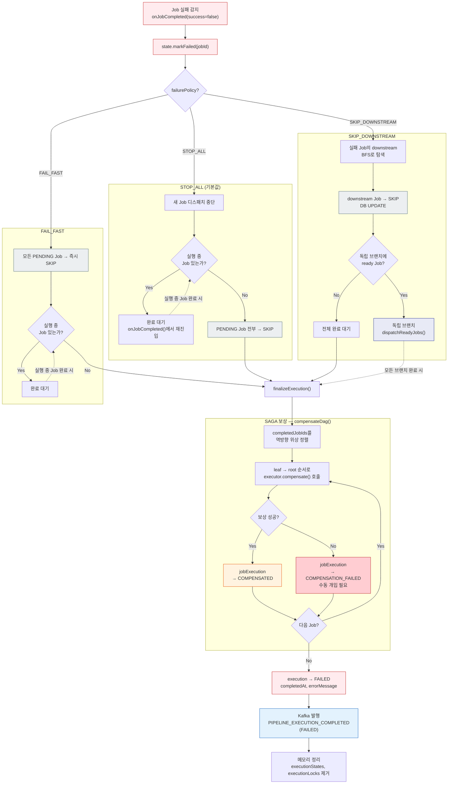

# Pipeline 실행 API 흐름 (DAG 모드)

> **API**: `POST /api/pipelines/{id}/execute`
> **서비스**: `PipelineDefinitionService.execute(Long id, Map<String, String> userParams)`
> **목적**: 파이프라인 정의에 매핑된 모든 Job을 DAG 의존성 순서대로 실행한다.

## 전체 흐름도



---

## Step 1: 파이프라인 정의 조회 및 검증

**파일**: `PipelineDefinitionService.java:143~155`

```
클라이언트 → POST /api/pipelines/5/execute { "params": { "VERSION": "2.0" } }
  → PipelineDefinitionController.execute()
  → PipelineDefinitionService.execute(5, {"VERSION": "2.0"})
  → definitionMapper.findById(5)  -- pipeline_definition 조회
  → loadJobDependencies()         -- pipeline_job_mapping + 의존성 로드
  → dagValidator.validate(jobs)   -- 순환 참조 검사
  → ParameterResolver.validate()  -- 파라미터 스키마 검증 + 기본값 적용
```

파이프라인에 Job이 없으면 예외를 던진다. DAG 검증에서 순환 참조가 발견되면 실행을 거부한다. 파라미터 스키마에 `required: true`인 키가 누락되면 예외를 던진다.

---

## Step 2: PipelineExecution 레코드 생성

**파일**: `PipelineDefinitionService.java:158~167`

```
pipeline_execution 테이블 INSERT:
  id                       = UUID (새로 발급)
  pipeline_definition_id   = 5  ← DAG 모드임을 표시
  status                   = PENDING
  started_at               = now()
  trace_parent             = 현재 OTel trace context 캡처
  parameters_json          = {"VERSION": "2.0"}
```

Job 단독 실행과의 차이는 `pipelineDefinitionId`가 null이 아닌 실제 값이라는 점이다. 이 값이 있으면 이후 `PipelineEngine`에서 DAG 모드로 분기한다.

---

## Step 3: PipelineJobExecution 레코드 N건 생성

**파일**: `PipelineDefinitionService.java:170~181`

```
pipeline_job_execution 테이블 INSERT (N건):
  execution_id = Step 2에서 만든 UUID
  job_order    = 1, 2, 3, ... (매핑 순서)
  job_type     = BUILD, DEPLOY 등
  job_name     = 각 Job의 이름
  job_id       = pipeline_job.id 참조
  status       = PENDING (전부)
```

파이프라인 정의에 매핑된 Job 수만큼 생성된다. 예를 들어 BUILD → DEPLOY 두 Job이 매핑되어 있으면 2건이 INSERT된다.

---

## Step 4: Outbox 이벤트 INSERT

**파일**: `PipelineDefinitionService.java:184~199`

```
outbox_event 테이블 INSERT:
  aggregate_type = "PIPELINE"
  aggregate_id   = execution UUID
  event_type     = "PIPELINE_EXECUTION_STARTED"
  payload        = Avro 직렬화된 PipelineExecutionStartedEvent
  topic          = "pipeline.cmd.execution"
  partition_key  = execution UUID
```

Step 2~4가 하나의 `@Transactional`로 묶여 있다. 커밋 실패 시 전부 롤백된다.

---

## Step 5: 트랜잭션 커밋 → 클라이언트 응답

**파일**: `PipelineDefinitionService.java:201`

```
HTTP 202 Accepted 응답:
{
  "executionId": "a1b2c3d4-...",
  "status": "PENDING"
}
```

여기까지 동기 영역이다. 이후는 전부 비동기로 진행된다.

---

## Step 6: OutboxPoller → Kafka 발행

```
OutboxPoller (@Scheduled)
  → outbox_event 테이블에서 미발행 이벤트 조회
  → Kafka 토픽 "pipeline.cmd.execution"으로 발행
  → outbox_event 상태를 SENT로 갱신
```

---

## Step 7: PipelineEventConsumer → PipelineEngine → DAG 분기

**파일**: `PipelineEngine.java:76~91`

```
PipelineEventConsumer가 Kafka 메시지 수신
  → PipelineEngine.execute(execution)
  → pipelineDefinitionId != null  ← DAG 모드
  → dagCoordinator.startExecution(execution)
```

Job 단독 실행과 여기서 갈린다. `pipelineDefinitionId`가 있으면 `DagExecutionCoordinator`에 위임한다.

---

## Step 8: DagExecutionCoordinator.startExecution()

**파일**: `DagExecutionCoordinator.java:180~237`

```
① execution status → RUNNING (DB UPDATE)
② Job 목록 + 의존성 로드 (DB 조회)
③ DAG 검증 (순환 참조 재확인)
④ JobExecution → Job ID ↔ Job Order 매핑 구축
⑤ failurePolicy 로드 (STOP_ALL / SKIP_DOWNSTREAM / FAIL_FAST)
⑥ DagExecutionState 초기화 + ConcurrentHashMap에 등록
⑦ ReentrantLock 등록 (실행별 동시성 제어)
⑧ dispatchReadyJobs() — 루트 Job(의존성 없는 Job) 디스패치
```

`DagExecutionState`는 메모리 캐시 역할이다. DB가 진실의 원천이고, 이 객체는 "어떤 Job이 ready인지" 빠르게 판단하기 위한 런타임 상태다.

---

## Step 9: dispatchReadyJobs() — 의존성 충족된 Job 병렬 실행

**파일**: `DagExecutionCoordinator.java:402~445`

```
dispatchReadyJobs():
  → state.findReadyJobIds()  — 의존성이 모두 완료된 PENDING Job 탐색
  → maxConcurrentJobs 제한 적용 (동시 실행 슬롯)
  → 각 ready Job에 대해:
      state.markRunning(jobId)
      dagEventProducer.publishDagJobDispatched()  — 디스패치 이벤트
      jobExecutorPool.submit(() -> executeJob())  — 스레드풀에서 비동기 실행
```

Job 단독 실행과의 핵심 차이다. 순차 모드는 for 루프로 하나씩 실행하지만, DAG 모드는 **의존성이 충족된 Job을 스레드풀에서 병렬 실행**한다.

---

## Step 10: executeJob() — 파라미터 치환 + 실제 실행

**파일**: `DagExecutionCoordinator.java:447~556`

```
executeJob():
  ① 사용자 파라미터(userParams) → jobExecution에 주입
  ② 실행 컨텍스트(contextJson) → jobExecution에 주입
     - DEPLOY Job이면 의존 BUILD Job의 ARTIFACT_URL 자동 주입
  ③ configJson의 ${PARAM} 플레이스홀더를 치환 → resolvedConfigJson
  ④ jobExecution status → RUNNING (DB UPDATE + Kafka 이벤트)
  ⑤ executor.execute(execution, jobExecution)  — 실제 작업 수행
  ⑥ 분기:
     ┌─ webhook 대기 → WAITING_WEBHOOK, 스레드 반환
     ├─ 동기 성공 → SUCCESS → onJobCompleted(success=true)
     └─ 예외 발생 → 재시도 가능하면 retryScheduler에 스케줄링
                   → 재시도 소진 → FAILED → onJobCompleted(success=false)
```

재시도는 `2^retryCount` 초 간격(1초, 2초, 4초...)으로 exponential backoff한다. `jobMaxRetries` 설정값까지 재시도한 후 최종 실패 처리한다.

---

## Step 11: onJobCompleted() — 완료 후 다음 Job 디스패치

**파일**: `DagExecutionCoordinator.java:249~315`

```
onJobCompleted(executionId, jobOrder, jobId, success):
  → Lock 획득 (동일 실행의 동시성 직렬화)
  → 성공이면:
      state.markCompleted(jobId)
      BUILD Job이면 → ARTIFACT_URL을 contextJson에 저장
  → 실패면:
      state.markFailed(jobId)
  → DAG Job 완료 이벤트 발행
  → 전체 완료(isAllDone) 체크:
      ┌─ 전체 완료 + 실패 없음 → Step 12 (SUCCESS)
      ├─ 전체 완료 + 실패 있음 → Step 13 (SAGA 보상)
      └─ 미완료:
          ├─ 실패 있음 → failurePolicy에 따라 분기 (Step 13)
          └─ 실패 없음 → dispatchReadyJobs() (Step 9로 루프)
```

이 단계가 DAG 엔진의 핵심 루프다. Job 완료 → 상태 갱신 → 다음 ready Job 탐색 → 디스패치를 반복하며, 모든 Job이 끝나면 최종 판정한다.

---

## Step 12: 실행 성공 완료

**파일**: `DagExecutionCoordinator.java:637~666`

```
finalizeExecution():
  → execution status → SUCCESS (DB UPDATE)
  → completedAt = now()
  → Kafka에 PIPELINE_EXECUTION_COMPLETED (SUCCESS) 이벤트 발행
  → executionStates, executionLocks에서 제거 (메모리 정리)
```

---

## Step 13: 실패 시 — failurePolicy에 따른 분기

**파일**: `DagExecutionCoordinator.java:561~635`

### 실패 정책 분기 흐름도



### 실패 정책별 동작 예시

BUILD_A, BUILD_B → DEPLOY 구조에서 BUILD_B가 실패한 경우:

```
STOP_ALL:
  BUILD_A 실행중 → 완료 대기 → DEPLOY SKIP → SAGA 보상(BUILD_A)

SKIP_DOWNSTREAM:
  BUILD_B의 downstream(DEPLOY) SKIP
  BUILD_A가 실행중이면 계속 실행 (독립적이므로)
  전부 끝나면 SAGA 보상(BUILD_A만 — DEPLOY는 SKIP이라 보상 불필요)

FAIL_FAST:
  DEPLOY 즉시 SKIP
  BUILD_A 실행중 → 완료 대기 → SAGA 보상(BUILD_A)
```

### SAGA 보상 순서

DAG 모드의 보상은 `SagaCompensator`를 사용하지 않고 `compensateDag()`에서 직접 처리한다. 순차 모드의 `SagaCompensator`는 리스트 인덱스 기반 역순이지만, DAG는 **역방향 위상 정렬**이 필요하기 때문이다.

```
실행 순서:   BUILD_A → BUILD_B → DEPLOY
보상 순서:   DEPLOY → BUILD_B → BUILD_A  (leaf → root)
```

보상 실패 시 `COMPENSATION_FAILED` 상태로 마킹하고 `MANUAL INTERVENTION REQUIRED` 로그를 남긴다. 이 상태는 자동 복구가 불가능하므로 운영자가 직접 처리해야 한다.

---

## Job 단독 실행과의 차이 요약

| | Job 단독 실행 (10번 문서) | Pipeline 실행 (이 문서) |
|---|---|---|
| API | `POST /api/jobs/{id}/execute` | `POST /api/pipelines/{id}/execute` |
| pipelineDefinitionId | null | 실제 값 |
| Job 개수 | 1건 | N건 |
| 실행 모드 | PipelineEngine 순차 모드 | DagExecutionCoordinator DAG 모드 |
| 동시성 | 단일 스레드 for 루프 | jobExecutorPool 스레드풀 병렬 |
| 의존성 | 없음 | DAG 의존성 그래프 |
| 실패 정책 | SAGA 보상 (고정) | STOP_ALL / SKIP_DOWNSTREAM / FAIL_FAST |
| 재시도 | 없음 | exponential backoff |
| 컨텍스트 전달 | 없음 | BUILD → DEPLOY ARTIFACT_URL 자동 주입 |
| 크래시 복구 | 없음 | @PostConstruct 자동 재개 |

---

## 부록: DAG 엔진 구현 상세

### 아키텍처 개요

DAG 엔진은 3개 클래스로 구성된다.

```
DagValidator          — 실행 전 순환 참조 검증
DagExecutionState     — 실행당 런타임 상태 (메모리 캐시)
DagExecutionCoordinator — 오케스트레이터 (디스패치 + 완료 처리)
```

DB가 진실의 원천이고, `DagExecutionState`는 "어떤 Job이 ready인지" 빠르게 판단하기 위한 캐시다. 앱이 재시작되면 DB에서 상태를 복원한다.

### DagExecutionState — 그래프 자료구조

실행당 1개 생성되며, 불변 필드와 가변 필드를 명확히 분리한다.

```
불변 (초기화 후 변경 불가):
  jobs              — Map<jobId, PipelineJob>
  dependencyGraph   — Map<jobId, Set<의존하는 jobId>>  (상위 방향)
  successorGraph    — Map<jobId, Set<후속 jobId>>      (하위 방향)
  jobIdToJobOrder   — Map<jobId, jobOrder>

가변 (Lock 보호 하에 변경):
  completedJobIds   — 성공 완료된 Job
  runningJobIds     — 실행 중인 Job
  failedJobIds      — 실패한 Job
  skippedJobIds     — 건너뛴 Job
```

`dependencyGraph`는 "이 Job을 실행하려면 어떤 Job이 먼저 완료돼야 하는지"를 표현한다. `successorGraph`는 역방향으로, "이 Job이 완료되면 어떤 Job이 실행 가능해지는지"를 표현한다. 두 그래프는 `initialize()` 시점에 한 번 구축되고 이후 변경되지 않는다.

### Ready Job 탐색 알고리즘

`findReadyJobIds()`는 DAG 엔진의 핵심 로직이다.

```java
for (모든 Job) {
    if (이미 완료/실행중/실패/SKIP) → 건너뜀
    if (dependencyGraph의 모든 의존 Job이 completedJobIds에 포함)
        → ready 목록에 추가
}
```

루트 Job(의존성 빈 Set)은 첫 호출에서 바로 ready가 된다. 이후 Job이 완료될 때마다 `onJobCompleted()` → `dispatchReadyJobs()` → `findReadyJobIds()`가 호출되어 새로 ready된 후속 Job을 탐색한다.

예시 — BUILD_A, BUILD_B → DEPLOY (DEPLOY는 A, B 둘 다 의존):
```
① findReadyJobIds() → [BUILD_A, BUILD_B]  (둘 다 의존성 없음)
② BUILD_A 완료 → findReadyJobIds() → []   (DEPLOY는 B도 필요)
③ BUILD_B 완료 → findReadyJobIds() → [DEPLOY]  (A, B 둘 다 완료)
```

### 동시성 모델

```
ConcurrentHashMap<UUID, ReentrantLock> executionLocks
  └─ 실행 ID별 Lock → 같은 실행의 상태 변경을 직렬화
```

왜 실행별 Lock인가: 서로 다른 파이프라인 실행은 독립적이므로 서로 블로킹할 이유가 없다. 하지만 같은 실행 내에서 여러 Job의 webhook 콜백이 동시에 도착하면 `onJobCompleted()`가 동시에 호출된다. Lock 없이 `completedJobIds`를 수정하면 ready Job을 중복 디스패치하거나 누락할 수 있다.

```
실행 A의 Lock ← Job A-1 webhook, Job A-2 webhook (직렬화)
실행 B의 Lock ← Job B-1 webhook (A와 독립, 블로킹 없음)
```

### SAGA 보상 — 역방향 위상 정렬

실패 시 완료된 Job을 **역방향 위상 순서**로 보상한다.

```java
completedJobIdsInReverseTopologicalOrder():
  ① completedJobIds만 대상으로 BFS 위상 정렬
  ② 정렬 결과를 reverse → leaf(최하위) → root(최상위) 순서
```

BUILD → DEPLOY 순서로 실행됐으면, DEPLOY → BUILD 순서로 `executor.compensate()`를 호출한다. 이 순서가 중요한 이유는 DEPLOY 결과를 먼저 되돌리고 나서 BUILD 산출물을 정리해야 일관성이 유지되기 때문이다.

### 실패 정책 비교

```
      BUILD_A ──→ DEPLOY
      BUILD_B ──↗

BUILD_B 실패 시:

STOP_ALL (기본):
  BUILD_A 실행중이면 완료 대기 → DEPLOY는 SKIP → SAGA 보상

SKIP_DOWNSTREAM:
  BUILD_B의 하위(DEPLOY)만 SKIP
  BUILD_A는 독립 경로가 아니므로 DEPLOY와 함께 SKIP
  (BUILD_A가 이미 완료됐으면 보상 대상)

FAIL_FAST:
  모든 PENDING(DEPLOY) 즉시 SKIP
  BUILD_A 실행중이면 완료 대기 → SAGA 보상
```

### 크래시 복구

```java
@PostConstruct
recoverRunningExecutions():
  → DB에서 status=RUNNING인 실행 조회
  → pipelineDefinitionId가 null이면 순차 모드이므로 건너뜀
  → RUNNING/WAITING_WEBHOOK 상태의 Job → FAILED로 전환 (webhook 유실 가정)
  → DagExecutionState 재구성
  → ready Job이 있으면 재dispatch
```

보수적 접근을 취한다. 앱 재시작 시점에 RUNNING이던 Job은 webhook이 유실됐을 수 있으므로 FAILED로 처리한다. 필요하면 `POST /api/pipelines/{id}/executions/{executionId}/restart` API로 부분 재시작할 수 있다.
