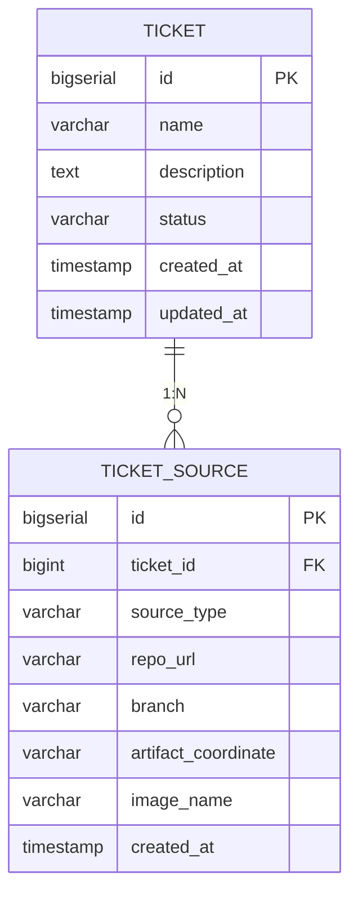
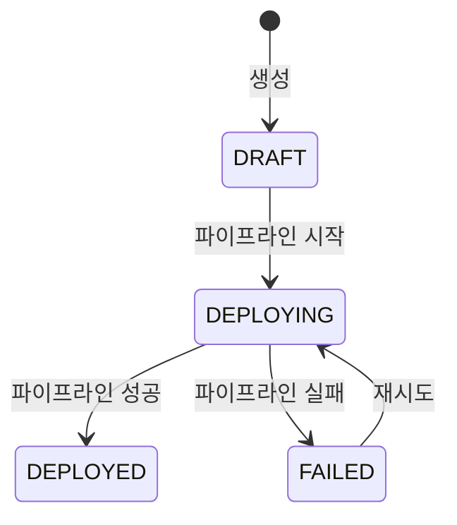
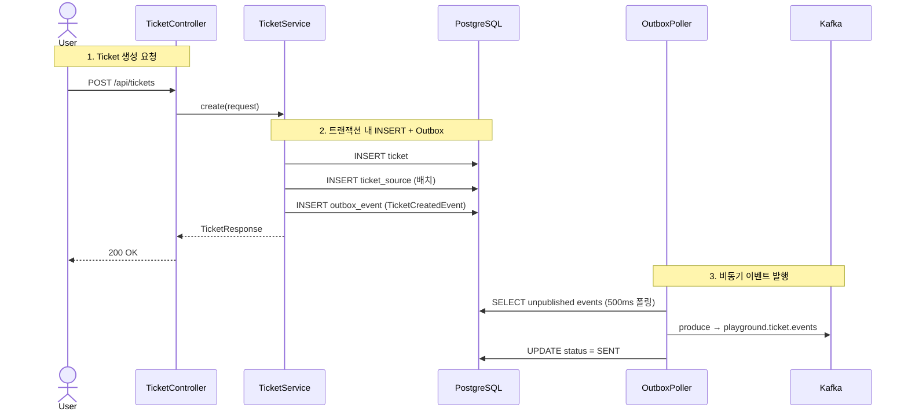

# Ticket 도메인 리뷰

> **한 줄 요약**: Ticket은 "무엇을 배포할 것인가"를 정의하는 도메인이다. 배포 소스(Git 저장소, Nexus 아티팩트, Harbor 이미지)를 묶어서 하나의 배포 단위를 만든다.

---

## 왜 필요한가

배포 파이프라인을 실행하려면 "어디서 코드를 가져오고, 어떤 아티팩트를 쓸 것인지"가 먼저 정의되어야 한다. Ticket이 없으면 파이프라인은 무엇을 배포해야 하는지 알 수 없다. Ticket은 배포 대상의 메타데이터를 한곳에 모아 파이프라인의 입력값으로 제공하는 역할을 한다.

또한 Ticket은 하나의 배포 요청에 여러 종류의 소스를 조합할 수 있게 해준다. 예를 들어 Git 저장소에서 빌드한 결과물과 Nexus에서 가져온 의존 라이브러리, Harbor에서 풀한 베이스 이미지를 하나의 Ticket으로 묶을 수 있다. 이 조합이 파이프라인의 스텝 구성을 결정한다.

---

## 핵심 개념

### 도메인 모델

Ticket과 TicketSource는 1:N 관계다. 하나의 Ticket에 여러 소스를 연결할 수 있고, 소스 타입에 따라 서로 다른 필드를 사용하는 다형적 구조를 갖는다.

### SourceType별 사용 필드

SourceType은 배포 소스의 종류를 구분하는 열거형이다. 각 타입마다 의미 있는 필드가 다르다.

| SourceType | 사용 필드 | 예시 | 생성되는 파이프라인 스텝 |
|:---:|------|------|------|
| `GIT` | `repoUrl`, `branch` | `http://gitlab/repo#main` | GIT_CLONE + BUILD |
| `NEXUS` | `artifactCoordinate` | `com.example:app:1.0.0:jar` | ARTIFACT_DOWNLOAD |
| `HARBOR` | `imageName` | `playground/app:latest` | IMAGE_PULL |

GIT 소스는 코드를 클론하고 빌드하는 두 단계가 필요하기 때문에 스텝이 2개 생성된다. NEXUS와 HARBOR는 이미 빌드된 결과물을 가져오는 것이므로 각각 1개 스텝이면 충분하다.

### 상태 전이

Ticket의 상태는 파이프라인 실행과 연동된다. 파이프라인이 시작되면 DEPLOYING으로 잠기고, 완료 결과에 따라 DEPLOYED 또는 FAILED로 전이한다.

DEPLOYING 상태에서는 Ticket 수정과 삭제가 차단된다. 배포 중에 소스가 바뀌면 실행 중인 파이프라인과 불일치가 생기기 때문이다. 이 검증은 `Ticket.validateModifiable()`에서 수행한다.

---

## 동작 흐름

Ticket 생성부터 이벤트 발행까지의 흐름을 시퀀스 다이어그램으로 나타낸다.

핵심은 2단계에서 비즈니스 데이터(ticket, ticket_source)와 이벤트(outbox_event)가 **같은 트랜잭션**에 저장된다는 점이다. 이렇게 하면 서비스가 INSERT 직후 크래시하더라도 이벤트가 유실되지 않는다. Transactional Outbox 패턴에 대한 자세한 설명은 [backend-deep-dive.md](../guide/backend-deep-dive.md)를 참조한다.

---

## 코드 가이드

아래 표는 Ticket 도메인의 주요 클래스와 역할이다. 모든 경로는 `app/src/main/java/.../ticket/` 기준이다.

| 계층 | 클래스 | 역할 |
|------|--------|------|
| API | `api/TicketController` | REST 엔드포인트 5개. 요청 검증 후 Service 위임 |
| Service | `service/TicketService` | 비즈니스 로직. 트랜잭션 관리, Outbox 이벤트 발행, 감사 이벤트 발행 |
| Domain | `domain/Ticket` | 도메인 모델. `validateModifiable()`로 DEPLOYING 상태에서 수정 차단 |
| Domain | `domain/TicketSource` | 배포 소스 모델. sourceType에 따라 사용 필드 결정 |
| Domain | `domain/TicketStatus` | 상태 열거형: DRAFT, READY, DEPLOYING, DEPLOYED, FAILED |
| Domain | `domain/SourceType` | 소스 종류 열거형: GIT, NEXUS, HARBOR |
| Mapper | `mapper/TicketMapper` | MyBatis CRUD (ticket 테이블) |
| Mapper | `mapper/TicketSourceMapper` | MyBatis CRUD (ticket_source 테이블). `insertBatch`로 일괄 등록 |
| Event | `event/TicketStatusEventConsumer` | 파이프라인 완료 이벤트를 수신해서 Ticket 상태를 DEPLOYED/FAILED로 갱신 |

### 이벤트 발행

TicketService는 생성 시 `TicketCreatedEvent`를 Outbox에 기록한다. 이 이벤트는 Avro로 직렬화되며, 다음 필드를 포함한다.

- `ticketId`: 생성된 Ticket의 ID
- `name`: Ticket 이름
- `sourceTypes`: 연결된 소스 타입 목록 (예: `[GIT, NEXUS]`)
- `EventMetadata`: eventId, correlationId, eventType, timestamp, source

**토픽**: `playground.ticket.events` (3 파티션, 7일 보존)

**파티션 키**: `String.valueOf(ticketId)` — 같은 Ticket의 이벤트는 같은 파티션으로 전달되어 순서가 보장된다.

---

## API 엔드포인트

| Method | Path | 설명 | 응답 |
|--------|------|------|------|
| `GET` | `/api/tickets` | 전체 Ticket 목록 조회 | `List<TicketListResponse>` |
| `GET` | `/api/tickets/{id}` | 단건 조회 (소스 포함) | `TicketResponse` |
| `POST` | `/api/tickets` | 신규 생성 | `TicketResponse` (200) |
| `PUT` | `/api/tickets/{id}` | 수정 (DEPLOYING이면 거부) | `TicketResponse` |
| `DELETE` | `/api/tickets/{id}` | 삭제 (DEPLOYING이면 거부) | 204 No Content |

생성 요청의 `sources` 필드에는 최소 1개 이상의 소스가 필요하다. 소스가 없으면 파이프라인을 구성할 수 없기 때문이다.

---

## 관련 문서

- [02-pipeline.md](02-pipeline.md) — Ticket이 만든 소스 정보가 파이프라인 스텝으로 변환되는 과정
- [backend-deep-dive.md](../guide/backend-deep-dive.md) — Transactional Outbox, 이벤트 직렬화 상세
- [01-async-accepted.md](../patterns/01-async-accepted.md) — 202 Accepted 응답 패턴
