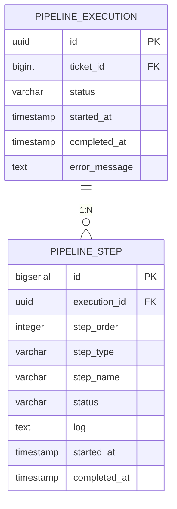
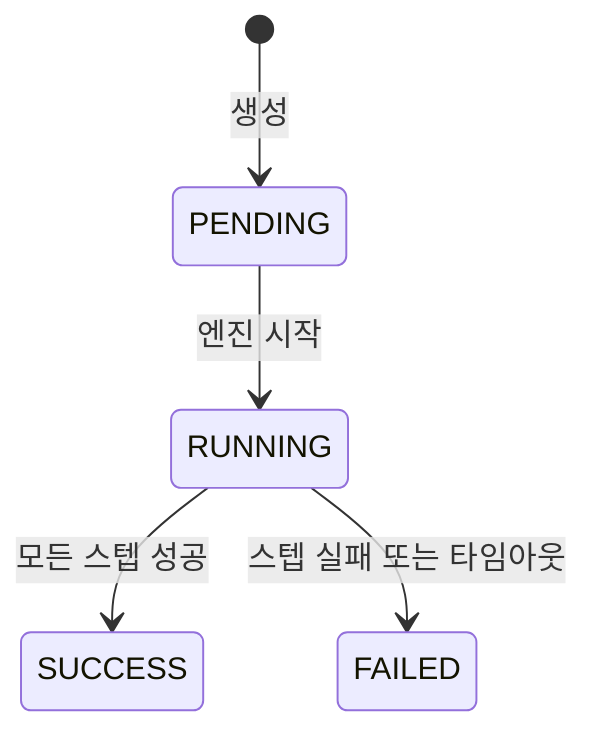
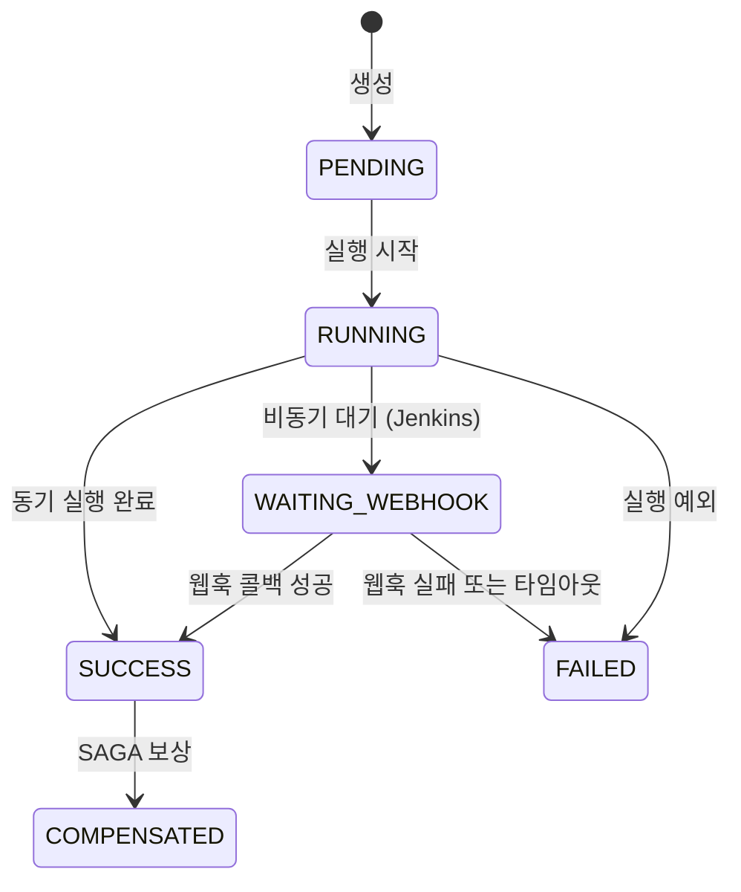
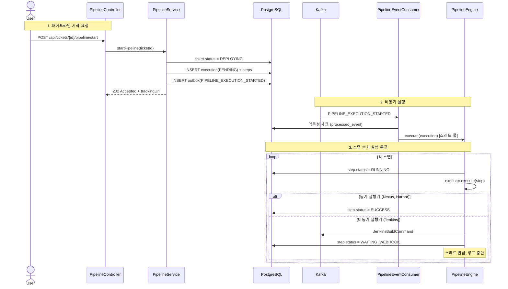
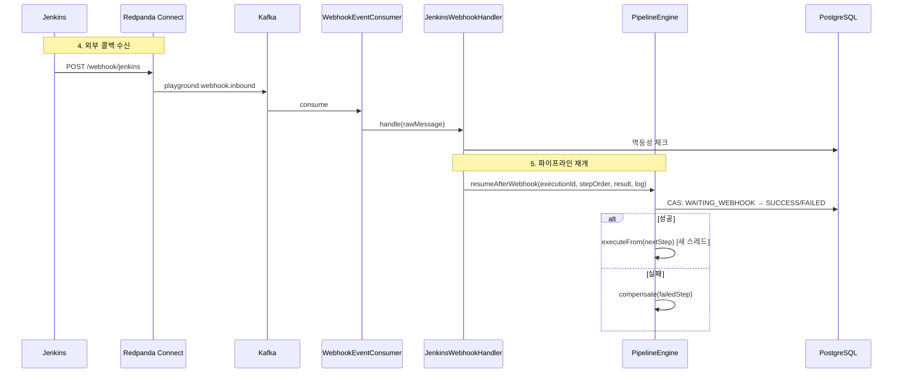
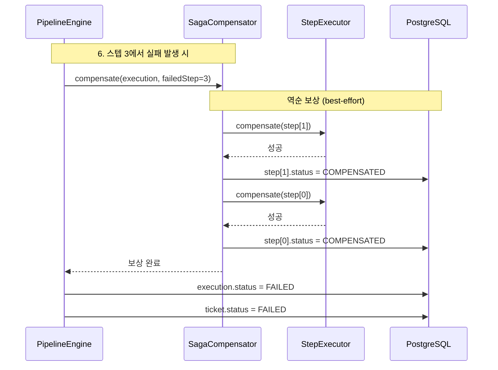

# Pipeline 도메인 리뷰

> **한 줄 요약**: Pipeline은 Ticket에 정의된 배포 소스를 실제로 빌드하고 배포하는 실행 엔진이다. SAGA Orchestrator 패턴으로 스텝을 순차 실행하며, 실패 시 역순 보상을 수행한다.

---

## 왜 필요한가

배포는 단일 작업이 아니라 여러 단계의 조합이다. Git 클론, 빌드, 아티팩트 다운로드, 이미지 풀, 최종 배포까지 각 단계는 서로 다른 외부 시스템과 통신하며, 일부는 수 분이 걸리는 비동기 작업이다. Pipeline이 없으면 이 복잡한 실행 흐름을 추적하거나, 중간에 실패했을 때 이미 완료된 단계를 되돌리는 것이 불가능하다.

Pipeline 도메인은 세 가지 문제를 해결한다.

1. **실행 순서 제어**: 소스 타입에 따라 적절한 스텝을 생성하고 순서대로 실행한다.
2. **비동기 대기**: Jenkins 같은 외부 시스템의 완료를 기다리는 동안 스레드를 점유하지 않는다 (Break-and-Resume).
3. **실패 보상**: 중간 스텝이 실패하면 이미 성공한 스텝을 역순으로 되돌린다 (SAGA Compensation).

---

## 핵심 개념

### 도메인 모델

PipelineExecution은 한 번의 배포 시도를 나타내고, PipelineStep은 그 안의 개별 작업 단위다. 하나의 Execution에 여러 Step이 1:N으로 연결된다.

### 스텝 구성 규칙

PipelineService는 Ticket의 소스 타입을 보고 어떤 스텝을 만들지 결정한다. 예를 들어 GIT + HARBOR 소스를 가진 Ticket이면 다음 스텝이 생성된다.

| 순서 | StepType | StepName | 소스 |
|:---:|:---:|------|------|
| 1 | GIT_CLONE | Clone: http://gitlab/repo#main | GIT |
| 2 | BUILD | Build: http://gitlab/repo#main | GIT |
| 3 | IMAGE_PULL | Pull: playground/app:latest | HARBOR |
| 4 | DEPLOY | Deploy: ... | (항상 마지막) |

DEPLOY 스텝은 소스 타입과 무관하게 항상 마지막에 추가된다.

### 상태 전이

**PipelineExecution 상태**:

**PipelineStep 상태**:

WAITING_WEBHOOK 상태는 Break-and-Resume 패턴의 핵심이다. 이 상태에 진입하면 엔진은 스레드를 반납하고, 외부 콜백이 도착할 때까지 파이프라인 실행이 중단된다. 자세한 내용은 [05-break-and-resume.md](../patterns/05-break-and-resume.md)를 참조한다.

### 실행기(Executor) 매핑

각 StepType마다 전담 실행기가 있다. 실행기는 동기(즉시 완료)와 비동기(웹훅 대기) 두 종류로 나뉜다.

| StepType | 실행기 | 동작 방식 |
|------|--------|------|
| GIT_CLONE | `JenkinsCloneAndBuildStep` | Kafka로 Jenkins 빌드 커맨드 발행 → 웹훅 대기 |
| BUILD | `JenkinsCloneAndBuildStep` | 위와 동일 (Clone과 Build가 같은 Jenkins Job) |
| ARTIFACT_DOWNLOAD | `NexusDownloadStep` | NexusAdapter로 동기 조회 + 다운로드 |
| IMAGE_PULL | `RegistryImagePullStep` | RegistryAdapter로 동기 조회 |
| DEPLOY | `RealDeployStep` | Kafka로 Jenkins 배포 커맨드 발행 → 웹훅 대기 |

동기 실행기는 결과를 즉시 반환하고, 비동기 실행기는 `step.waitingForWebhook = true`를 설정한 뒤 반환한다. 이 플래그는 transient 필드라 DB에 저장되지 않으며, 엔진이 루프를 중단할지 판단하는 데만 쓰인다.

---

## 동작 흐름

### 파이프라인 시작과 실행

202 Accepted 응답에는 `trackingUrl`이 포함된다. 프론트엔드는 이 URL로 SSE를 연결해서 스텝 진행 상태를 실시간으로 수신한다.

### Break-and-Resume: 웹훅 콜백 후 재개

Jenkins 빌드가 완료되면 웹훅 콜백이 도착하고, 파이프라인은 중단된 지점부터 다시 실행을 이어간다.

CAS(Compare-And-Swap)는 `updateStatusIfCurrent` 쿼리로 구현된다. 이 쿼리는 현재 상태가 WAITING_WEBHOOK인 경우에만 업데이트를 수행하고, 영향받은 행 수를 반환한다. 행 수가 0이면 이미 타임아웃 체커가 처리한 것이므로 콜백은 무시된다.

### SAGA 보상 흐름

어떤 스텝에서 실패가 발생하면, SagaCompensator가 이미 성공한 스텝을 역순으로 되돌린다.

보상은 best-effort 방식이다. 개별 보상이 실패해도 나머지 보상은 계속 진행된다. 보상 실패한 스텝은 FAILED 상태로 남아 수동 개입이 필요함을 표시한다. SAGA 패턴의 설계 결정에 대한 자세한 내용은 [02-saga-orchestrator.md](../patterns/02-saga-orchestrator.md)를 참조한다.

### 웹훅 타임아웃

WebhookTimeoutChecker는 30초 간격으로 WAITING_WEBHOOK 상태가 5분 이상 지속된 스텝을 찾아 실패 처리한다.

| 항목 | 값 |
|------|-----|
| 체크 주기 | 30초 (`@Scheduled(fixedDelay)`) |
| 타임아웃 기준 | 5분 |
| 경합 방지 | CAS (`updateStatusIfCurrent`) |

타임아웃 체커와 웹훅 콜백이 동시에 같은 스텝을 처리하려 할 때, CAS 덕분에 둘 중 하나만 성공한다. 실패한 쪽은 affected rows = 0을 확인하고 아무 작업도 하지 않는다.

---

## 실시간 SSE

프론트엔드는 파이프라인 시작 후 SSE(Server-Sent Events)로 스텝 진행 상태를 실시간 수신한다.

1. PipelineEngine이 스텝 상태를 변경할 때마다 `PipelineStepChangedEvent`를 Kafka에 발행한다.
2. PipelineSseConsumer가 이 이벤트를 소비해서 Avro → JSON으로 변환한다.
3. SseEmitterRegistry를 통해 해당 ticketId를 구독 중인 브라우저에 이벤트를 푸시한다.
4. 파이프라인 완료 시 `PipelineExecutionCompletedEvent`가 도착하면 SSE 연결을 종료한다.

이 구조 덕분에 브라우저가 폴링하지 않아도 스텝 하나하나의 진행이 실시간으로 표시된다.

---

## 코드 가이드

모든 경로는 `app/src/main/java/.../pipeline/` 기준이다.

| 계층 | 클래스 | 역할 |
|------|--------|------|
| API | `api/PipelineController` | 시작, 조회, 히스토리 엔드포인트 |
| API | `api/PipelineSseController` | SSE 스트림 엔드포인트 |
| Service | `service/PipelineService` | 스텝 생성, Execution 관리, 실패 주입 |
| Engine | `engine/PipelineEngine` | SAGA Orchestrator. `execute()`, `executeFrom()`, `resumeAfterWebhook()` |
| Engine | `engine/SagaCompensator` | 역순 보상 실행 |
| Engine | `engine/WebhookTimeoutChecker` | 5분 타임아웃 스캔 (30초 간격) |
| Step | `step/JenkinsCloneAndBuildStep` | Git Clone + Build 실행기 (비동기, 웹훅 대기) |
| Step | `step/NexusDownloadStep` | Nexus 아티팩트 다운로드 (동기) |
| Step | `step/RegistryImagePullStep` | Harbor 이미지 조회 (동기) |
| Step | `step/RealDeployStep` | 최종 배포 실행기 (비동기, 웹훅 대기) |
| Event | `event/PipelineEventConsumer` | PIPELINE_EXECUTION_STARTED 소비 → 엔진 실행 |
| Event | `event/PipelineEventProducer` | 스텝 변경, 실행 완료 이벤트 발행 |
| Event | `event/PipelineCommandProducer` | Jenkins 빌드 커맨드 발행 |
| SSE | `sse/PipelineSseConsumer` | 이벤트 소비 → SSE 브로드캐스트 |
| SSE | `sse/SseEmitterRegistry` | SSE 연결 관리 (ticketId 기준) |
| Mapper | `mapper/PipelineExecutionMapper` | MyBatis CRUD |
| Mapper | `mapper/PipelineStepMapper` | MyBatis CRUD + CAS 쿼리 (`updateStatusIfCurrent`) |

### 실패 주입 (데모용)

`POST /api/tickets/{id}/pipeline/start-with-failure`를 호출하면 `injectRandomFailure()`가 무작위 스텝의 이름에 `[FAIL]` 마커를 추가한다. 실행기는 이 마커를 감지하면 의도적으로 예외를 던져 SAGA 보상 흐름을 시연한다. `[SLOW]` 마커는 10초 지연을 추가해서 SSE 실시간 전달을 테스트할 때 쓴다.

---

## API 엔드포인트

| Method | Path | 설명 | 응답 |
|--------|------|------|------|
| `POST` | `/api/tickets/{id}/pipeline/start` | 파이프라인 시작 | 202 Accepted + `PipelineExecutionResponse` |
| `POST` | `/api/tickets/{id}/pipeline/start-with-failure` | 실패 주입 시작 (SAGA 데모) | 202 Accepted |
| `GET` | `/api/tickets/{id}/pipeline` | 최신 실행 조회 | `PipelineExecutionResponse` |
| `GET` | `/api/tickets/{id}/pipeline/history` | 실행 이력 목록 | `List<PipelineExecutionResponse>` |
| `GET` | `/api/tickets/{id}/pipeline/events` | SSE 스트림 | `text/event-stream` |

---

## 관련 문서

- [01-ticket.md](01-ticket.md) — 파이프라인의 입력이 되는 Ticket 도메인
- [03-webhook.md](03-webhook.md) — Jenkins 콜백이 파이프라인에 도달하는 경로
- [02-saga-orchestrator.md](../patterns/02-saga-orchestrator.md) — SAGA 패턴 설계 결정과 트레이드오프
- [05-break-and-resume.md](../patterns/05-break-and-resume.md) — Break-and-Resume 패턴 상세
- [01-async-accepted.md](../patterns/01-async-accepted.md) — 202 Accepted 응답 패턴
