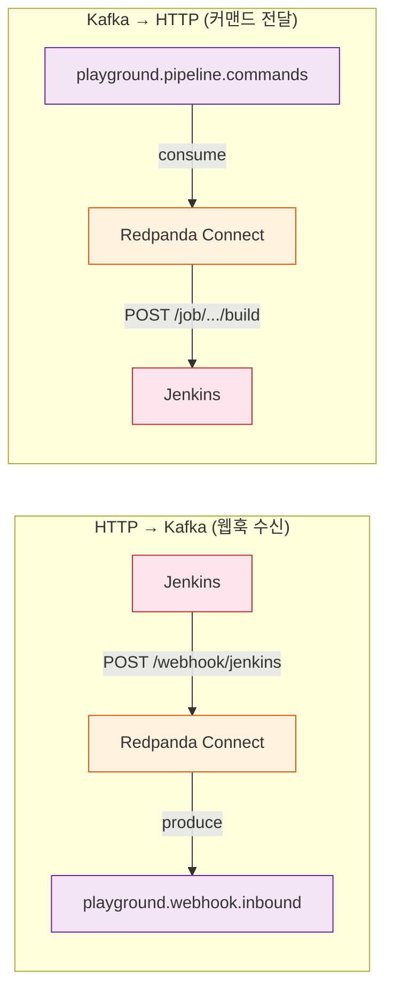
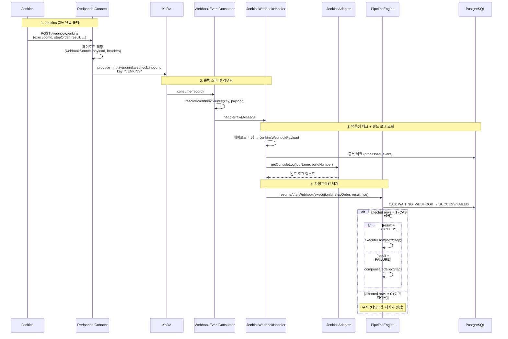

# Webhook 도메인 리뷰

> **한 줄 요약**: Webhook은 외부 시스템(Jenkins)의 완료 콜백을 수신해서 중단된 파이프라인을 재개하는 브릿지 도메인이다.

---

## 왜 필요한가

Jenkins 빌드는 수 분이 걸릴 수 있다. 파이프라인 엔진이 빌드 완료를 동기적으로 기다리면 스레드가 낭비되고, 동시 실행 가능한 파이프라인 수가 스레드 풀 크기에 제한된다. 그래서 엔진은 빌드 요청을 보낸 뒤 스레드를 반납하고(Break), Jenkins가 빌드를 끝내면 콜백을 보내서 엔진을 깨운다(Resume).

문제는 Jenkins가 직접 스프링 애플리케이션에 HTTP를 보내지 않는다는 점이다. Jenkins의 콜백 URL은 고정이고, 내부 서비스 주소는 변할 수 있으며, Jenkins가 Kafka 프로토콜을 지원하지도 않는다. Webhook 도메인은 이 간극을 **Redpanda Connect**로 메운다. Jenkins → HTTP → Redpanda Connect → Kafka → WebhookEventConsumer → PipelineEngine 순서로 콜백이 전달된다.

---

## 핵심 개념

### Redpanda Connect 브릿지

Redpanda Connect는 HTTP와 Kafka 사이의 양방향 브릿지 역할을 한다. 이 프로젝트에서는 두 개의 스트림 설정을 사용한다.



**HTTP → Kafka** (`docker/connect/jenkins-webhook.yaml`): Jenkins의 POST 웹훅을 수신해서 `playground.webhook.inbound` 토픽에 발행한다. 원본 페이로드를 `{ webhookSource: "JENKINS", payload: {...}, headers: {...} }` 형태로 감싸서 소스 식별이 가능하게 만든다.

**Kafka → HTTP** (`docker/connect/jenkins-command.yaml`): `playground.pipeline.commands` 토픽에서 `JENKINS_BUILD_COMMAND` 이벤트를 소비해서 Jenkins REST API(`POST /job/{jobName}/buildWithParameters`)를 호출한다. Bloblang 필터로 이벤트 타입을 걸러내고, Basic Auth로 Jenkins에 인증한다.

Connect 브릿지의 설계 결정에 대한 자세한 내용은 [06-redpanda-connect.md](../patterns/06-redpanda-connect.md)를 참조한다.

### 멱등성 보장

Kafka 컨슈머는 재전달(redelivery)이 발생할 수 있다. 같은 웹훅 콜백이 두 번 처리되면 파이프라인 엔진이 이미 SUCCESS인 스텝을 다시 처리하려 시도할 수 있다. 이를 방지하기 위해 JenkinsWebhookHandler는 `processed_event` 테이블에 `(correlationId, eventType)` 복합 키로 중복 체크를 수행한다.

- **correlationId**: `jenkins:{executionId}:{stepOrder}` 형식
- **eventType**: `WEBHOOK_RECEIVED`

이미 처리된 조합이면 핸들러가 즉시 반환한다.

### CAS 경쟁 방지

웹훅 콜백과 타임아웃 체커가 동시에 같은 스텝을 처리하려 할 수 있다. 이 경쟁 조건은 PipelineStepMapper의 `updateStatusIfCurrent` 쿼리로 해결한다.

```sql
UPDATE pipeline_step
SET status = #{newStatus}, log = #{log}, completed_at = #{completedAt}
WHERE id = #{stepId} AND status = #{currentStatus}
```

이 쿼리는 현재 상태가 `WAITING_WEBHOOK`인 경우에만 업데이트를 수행한다. 영향받은 행 수가 0이면 이미 다른 쪽(타임아웃 체커 또는 콜백)이 처리한 것이므로, 중복 처리를 피할 수 있다.

---

## 동작 흐름

전체 웹훅 수신부터 파이프라인 재개까지의 흐름이다.



### 웹훅 소스 라우팅

WebhookEventConsumer는 Kafka 레코드의 키 또는 페이로드에서 `webhookSource`를 추출한 뒤, 해당 소스에 맞는 핸들러로 라우팅한다. 현재는 JENKINS만 지원하지만, 새로운 외부 시스템(예: ArgoCD, GitHub Actions)을 추가할 때 핸들러만 등록하면 되는 확장 가능한 구조다.

라우팅 로직은 `resolveWebhookSource()`에 있다. Kafka 키를 우선 사용하고, 키가 없으면 페이로드에서 `webhookSource` 필드를 파싱하는 폴백 전략을 따른다.

### 빌드 로그 수집

JenkinsWebhookHandler는 웹훅 페이로드에서 `jobName`과 `buildNumber`를 추출한 뒤, JenkinsAdapter를 통해 Jenkins 콘솔 로그를 조회한다. 이 로그는 PipelineStep의 `log` 필드에 저장되어 프론트엔드에서 빌드 결과를 확인할 수 있게 한다.

로그 형식은 다음과 같다.

```
=== Jenkins deploy-job #42 SUCCESS (15234ms) ===
Started by upstream project...
Building in workspace /var/jenkins_home/workspace/deploy-job
...
Finished: SUCCESS
```

콘솔 로그 조회에 실패하면 간략한 요약(`Jenkins build #42 SUCCESS in 15234ms`)으로 대체한다.

---

## 에러 처리

### 재시도 정책

WebhookEventConsumer는 4회 재시도(지수 백오프: 1초 → 2초 → 4초 → 8초)를 수행한다. 모든 재시도가 실패하면 메시지를 DLT(Dead Letter Topic, `playground.webhook.inbound-dlt`)로 이동시킨다. DLT 핸들러는 토픽, 키, 파티션, 오프셋을 로깅해서 수동 복구 시 참조할 수 있게 한다.

### 타임아웃

WebhookTimeoutChecker(Pipeline 도메인에 위치)가 WAITING_WEBHOOK 상태의 스텝을 30초 간격으로 스캔하고, 5분 이상 경과한 스텝을 FAILED로 전이시킨다. 타임아웃과 콜백이 동시에 도착하는 경우 CAS로 안전하게 하나만 처리된다.

---

## 코드 가이드

모든 경로는 `app/src/main/java/.../webhook/` 기준이다.

| 계층 | 클래스 | 역할 |
|------|--------|------|
| Consumer | `WebhookEventConsumer` | `playground.webhook.inbound` 소비, 웹훅 소스별 핸들러 라우팅, 재시도 + DLT |
| Handler | `handler/JenkinsWebhookHandler` | 페이로드 파싱, 멱등성 체크, 빌드 로그 조회, PipelineEngine 재개 호출 |
| DTO | `dto/JenkinsWebhookPayload` | Jenkins 콜백 데이터 (record): executionId, stepOrder, jobName, buildNumber, result, duration, url |
| Config | `docker/connect/jenkins-webhook.yaml` | HTTP → Kafka 브릿지 설정 |
| Config | `docker/connect/jenkins-command.yaml` | Kafka → HTTP 브릿지 설정 (커맨드 방향) |

### 타 도메인 연결점

Webhook 도메인이 다른 도메인과 만나는 지점은 정확히 두 곳이다.

1. **JenkinsWebhookHandler → PipelineEngine.resumeAfterWebhook()**: 콜백 결과를 파이프라인에 전달한다.
2. **JenkinsAdapter** (common-kafka 모듈): Jenkins REST API 호출을 담당하는 어댑터로, 빌드 로그 조회에 사용된다.

---

## Kafka 토픽 정리

| 토픽 | 파티션 | 보존 | 용도 |
|------|:---:|------|------|
| `playground.webhook.inbound` | 3 | 3일 | Jenkins 콜백 수신 |
| `playground.webhook.inbound-retry` | - | - | 재시도 토픽 |
| `playground.webhook.inbound-dlt` | - | - | Dead Letter Topic |
| `playground.pipeline.commands` | - | - | Jenkins 빌드 커맨드 (Webhook 입장에서는 반대 방향) |

---

## API 엔드포인트

Webhook 도메인은 자체 REST API를 노출하지 않는다. 외부 시스템의 HTTP 콜백은 Redpanda Connect가 수신하며(`http://localhost:4197/webhook/jenkins`), 스프링 애플리케이션은 Kafka 컨슈머로만 웹훅을 처리한다.

이 구조의 장점은 외부 콜백 포맷이 바뀌어도 Connect의 Bloblang 변환만 수정하면 되고, 스프링 애플리케이션 코드는 변경하지 않아도 된다는 것이다.

---

## 관련 문서

- [02-pipeline.md](02-pipeline.md) — 웹훅이 재개하는 파이프라인의 동작 방식
- [01-ticket.md](01-ticket.md) — 파이프라인의 입력이 되는 Ticket 도메인
- [06-redpanda-connect.md](../patterns/06-redpanda-connect.md) — Connect 브릿지 설정과 Bloblang 상세
- [05-break-and-resume.md](../patterns/05-break-and-resume.md) — Break-and-Resume 패턴과 CAS 동기화
